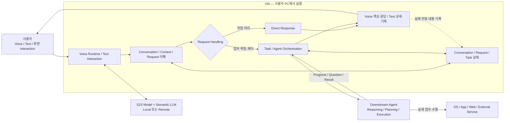

# VIA Software Architecture

이 저장소는 Samsung PC용 **Voice Interaction Agent(VIA)**의 소프트웨어 아키텍처를 정의하고 검증한다.

VIA는 사용자가 PC에서 Voice·Text·화면 interaction을 하나의 연속된 대화로 이어가도록 돕는다. 바로 답할 수 있는 요청은 직접 처리하고, 조사·문서 작성·Application 조작처럼 실제 업무 수행이 필요한 요청은 적절한 Downstream Agent에 위임한다. 사용자는 Agent별 대화창이나 실행 ID를 직접 관리하지 않고 VIA를 통해 질문, 진행 상황, 추가 지시, 취소, 결과를 주고받는다.

이 과제의 핵심은 특정 Model이나 Agent를 선정하는 것이 아니다. **사용자 interaction과 여러 Agent의 실행을 일관되게 연결하려면 VIA 내부의 책임·상태·계약·process boundary를 어떻게 나누어야 하는가**를 정의하고, 후보 Architecture를 같은 조건에서 비교하여 근거 있는 결정을 남기는 것이 목적이다.

## VIA가 제공하려는 사용자 경험

VIA는 다음 경험을 하나의 Conversation 안에서 연결해야 한다.

- Voice와 Text로 질문하고, 입력 방식을 바꾸거나 Voice를 다시 연결해도 앞 대화를 이어간다.
- 현재 화면, 선택 영역, pointer, focused window와 이전 대화·업무를 이용해 “이 부분”, “아까 그 파일” 같은 표현을 이해한다.
- 일반 지식이나 범위가 명확한 자료는 직접 설명하고, 그 답변을 이어 “이 내용으로 발표자료를 만들어줘”처럼 실제 업무를 맡길 수 있다.
- 한 발화에 포함된 독립·순차·조건·데이터 의존 요청을 구분하고 그 관계를 보존한다.
- 여러 장기 업무가 동시에 진행되어도 각 업무의 질문, 승인, 진행 상황, 결과를 올바른 Task에 연결한다.
- Voice Response 도중 끼어들어 질문을 바꾸거나, 특정 업무만 수정·취소하고, 확인된 처리 상태를 전달받는다.
- 허용한 정보와 User Memory를 확인·변경·삭제하고, 접근 실패나 Agent 장애가 발생하면 확인된 상태와 가능한 다음 행동을 안내받는다.

전체 사용자 행동과 완료 조건은 [Representative Use Cases](docs/architecture/05-representative-use-cases.md)에 정의되어 있다. 이 문서는 18개 대표 Use Case를 고정하지만 특정 Component, Model, 알고리즘이나 처리 순서를 미리 선택하지 않는다.

## System boundary

VIA는 사용자와 여러 Downstream Agent 사이의 **Agent-neutral Interaction & Orchestration 계층**이다.

| 영역 | 책임 |
| --- | --- |
| **VIA** | Voice/Text interaction, 화면·대화 Context, 요청 이해, direct response, Conversation/Task 상태, Agent 선택·위임, progress·clarification·approval·result 연결 |
| **Downstream Agent** | 업무별 reasoning, planning, Tool 선택·실행, open-ended research, 외부 업무 상태를 변경하는 Action |
| **AI Model Runtime** | S2S와 VIA semantic inference를 제공하는 local/remote dependency. 호출·연결·교체 구조는 범위 안이고 Model 내부 구현·학습은 범위 밖 |
| **Context Source** | 정책상 허용된 화면, OS, file, mail, calendar, browser, public web 정보. VIA가 읽을 수 있지만 외부 업무 Action을 대신 수행하지는 않음 |

책임 경계의 기본 원칙은 다음과 같다.

> **Bounded Read / Search / Understand → VIA에서 수행 가능** / **Open-ended Research / 업무 Reasoning / Plan / Act → Downstream Agent**

예를 들어 지정한 문서나 일정처럼 대상과 범위가 명확한 read-only 조회는 VIA가 직접 처리할 수 있다. 반면 새로운 Source를 탐색·선별·종합하는 조사, 업무 수행 방법의 계획, 파일·메일·일정·Application·Web service의 상태를 변경하는 작업은 Downstream Agent에 맡긴다. VIA 자신의 Conversation, Task, 설정과 허용된 User Memory 관리는 외부 업무 Action과 구분한다.

정확한 책임 범위는 [System Mission & Boundary](docs/architecture/01-system-mission-and-boundary.md)와 [Fixed Architecture Scope](docs/architecture/03-fixed-architecture-scope.md)가 기준이다.

## Interaction과 업무가 연결되는 방식



VIA는 사용자 입력을 하나 이상의 논리적 Request로 정리하고, 필요한 Context와 관련 Task를 식별한다. 정보가 부족하면 Clarification을 요청하고, 충분하면 S2S Direct Response, VIA Core Direct Response 또는 Downstream Agent Handling 중 적절한 경로로 연결한다. Agent의 진행·질문·결과도 원래 Conversation과 Task로 돌아온다.

이 그림은 논리적 책임 관계를 나타낸다. 내부 활동은 후보 Architecture에 따라 순차·병렬·streaming·반복으로 수행될 수 있으며, 각 상자가 반드시 하나의 Component나 process를 뜻하지 않는다. 상세 흐름은 [Canonical Interaction Flow](docs/architecture/04-canonical-interaction-flow.md)를 따른다.

## 서로 다른 lifecycle을 분리한다

VIA는 음성 연결, 대화, 요청, 사용자 업무와 Agent 실행을 하나의 `session`으로 뭉뚱그리지 않는다.

| 개념 | 의미 |
| --- | --- |
| **Voice Connection** | 지금 실시간 Voice 입출력이 연결되어 있는가 |
| **Conversation** | 지금까지 사용자와 VIA가 무슨 이야기를 했는가 |
| **VIA Request** | 이번 User Turn에서 VIA가 처리해야 하는 하나의 논리적 요청 |
| **VIA Task** | 여러 Request에 걸쳐 계속 상태를 추적해야 하는 사용자의 업무 목표 |
| **Agent Execution** | 해당 업무가 Downstream Agent에서 실제로 수행되는 실행 |

Voice Connection이 끝나도 Conversation이나 Task는 끝나지 않는다. Direct Response도 Conversation에 남으며 이후 업무 요청의 Context가 될 수 있다. 하나의 VIA Task가 여러 Agent Execution과 연결될 수 있지만, 사용자가 보는 Task identity는 특정 Agent의 thread나 run ID에 종속되지 않는다. 자세한 정의는 [Terms](docs/architecture/02-terms.md)에 있다.

## 고정된 Architecture 원칙

- VIA software 자체와 Voice Runtime은 사용자 PC에서 실행한다. Model과 다른 dependency는 local 또는 remote일 수 있다.
- VIA는 **S2S Model 1개와 semantic LLM 1개**를 사용한다. Component·Task·semantic stage별로 Model을 별도 적재하거나 복제하지 않는다.
- Voice와 Text는 같은 논리적 Conversation, Context와 Task 체계를 공유한다.
- 모든 user-facing 응답은 Text로 Chat UI와 Conversation에 남기고, Voice가 활성화되어 있으면 즉시 알아야 할 핵심을 짧게 말한다.
- S2S Direct Response도 VIA Conversation의 일부다. 기록을 위해 같은 Request를 Core에서 다시 실행하거나 중복 응답하지 않는다.
- 사용자가 명시한 복합 요청의 순서·조건·의존 관계는 VIA가 보존한다. 업무를 달성하기 위한 domain planning과 Tool 선택은 Agent 책임이다.
- VIA Task와 Agent Execution identity를 분리하고, 여러 업무의 비동기 event가 서로 섞이지 않게 연결한다.
- Context 접근·외부 제공은 Policy와 Consent를 따르며, 사용자가 확인·변경·삭제할 수 있는 User Memory를 지원한다.
- 재시작 후에는 확인 가능한 기록과 외부 상태를 사용해 업무를 재연결하고, 상태 확인 없이 변경 작업을 중복 실행하지 않는다.
- 특정 Downstream Agent가 VIA의 Conversation, Task identity나 최상위 orchestration을 소유하지 않는다.

## 이 저장소에서 Architecture를 결정하는 방법

모든 후보는 동일한 시스템 범위, 사용자 목표와 완료 조건을 만족해야 한다. 비교 중에는 사용자 입력, Context, Model·Agent 기능과 외부 조건을 같게 유지하고, 구조가 실제로 바꾸는 책임·계약·상태·call graph·deployment·fault boundary의 차이를 관찰한다.

```text
System mission and fixed scope
  → representative Use Cases and change scenarios
  → quality attribute and metric definition
  → pre-result measurement freeze
  → one-DP-at-a-time A/B implementation and measurement
  → trade-off analysis
  → Architecture Decision Record
```

활성 lifecycle은 다음 네 단계다.

1. **Measurement Contract Definition** — stimulus, endpoint, fixture, oracle, 반복·집계, target과 evidence 범위를 결과 전에 확정한다.
2. **Candidate Implementation** — 같은 계약을 만족하는 Architecture 대안을 구현한다.
3. **A/B Measurement & Evaluation** — 다른 조건을 고정하고 한 Decision Point의 대안을 직접 비교한다.
4. **Architecture Decision** — 측정 결과와 구조적 원인을 ADR에 기록한다.

Model·Agent·Context·저장 계약이 바뀌어도 사용자 기능을 유지할 수 있는지도 같은 기준으로 검토한다. 공통 비교 조건은 [Fixed Assumptions](docs/architecture/06-fixed-assumptions.md), 변경 시나리오는 [Intentional Variables](docs/architecture/07-intentional-variables.md), 측정 원칙은 [Measurement Guide](docs/architecture/11-measurement/README.md)에 정의되어 있다.

## 현재 상태

- `docs/architecture/`는 현재 시스템 정의와 Architecture 기준선이다.
- 대표 Use Case와 고정 범위는 정의되어 있지만 내부 Component 배치와 여러 구조 선택은 아직 평가 대상이다.
- QA catalog는 네 core QA와 상세 measurement·diagnostic QA로 구성된다. target, score band, workload와 DP별 applicability freeze는 아직 완료되지 않았다.
- QA-09, QA-19, QA-29, QA-39를 핵심 Architecture Significant Requirement(ASR)로 확정했다. 이 분류는 측정 완료나 특정 후보의 승리를 뜻하지 않는다.
- VIA-DP-01~18은 검토할 구조적 선택의 inventory이며, 목록에 포함되었다는 사실이 최종 우선순위나 선택을 뜻하지 않는다.
- 현재 reference 결과는 후보·측정 구조를 검토하기 위한 예비/부분 evidence다. 최종 Architecture Decision이나 제품 end-to-end 측정으로 해석하지 않는다.
- 기존 ADR의 accepted/deferred 상태와 재검증 caveat는 유지한다.

따라서 `NOT_IMPLEMENTED`, `NOT_RUN`, `N/A`, `BLOCKED`를 과거 결과로 채우거나 draft를 확정된 제품 Architecture로 설명하면 안 된다. 최신 세부 상태는 [Architecture Baseline](docs/architecture/README.md), [Measurement Guide](docs/architecture/11-measurement/README.md), [Current Evaluation Results](results/architecture-evaluation/current/README.md), [Architecture Decisions](docs/architecture/12-decisions/README.md)에서 확인한다.

## Start here

새로 참여한 사람과 LLM은 다음 순서로 읽는다.

1. [Architecture Baseline](docs/architecture/README.md) — 문서 위계와 현재 기준선
2. [System Mission & Boundary](docs/architecture/01-system-mission-and-boundary.md) — VIA의 목적과 책임 경계
3. [Terms](docs/architecture/02-terms.md) — Conversation, Request, Task, Agent Execution 등 핵심 개념
4. [Fixed Architecture Scope](docs/architecture/03-fixed-architecture-scope.md) — 모든 후보가 만족할 공통 범위
5. [Canonical Interaction Flow](docs/architecture/04-canonical-interaction-flow.md) — direct/delegated interaction의 논리적 흐름
6. [Representative Use Cases](docs/architecture/05-representative-use-cases.md) — 사용자가 얻어야 할 행동과 완료 조건
7. [Fixed Assumptions](docs/architecture/06-fixed-assumptions.md)과 [Intentional Variables](docs/architecture/07-intentional-variables.md) — 비교 중 고정할 조건과 대응할 변화
8. [Quality Attributes](docs/architecture/08-quality-attributes/README.md)과 [Traceability](docs/architecture/09-traceability.md) — 품질 초안과 요구 연결
9. [Architecture Element Definition](docs/architecture/10-element-definition.md) — 후보 구조와 변경량을 비교하는 단위
10. [Measurement](docs/architecture/11-measurement/README.md) — 결과 전에 동결할 계약과 evidence 수준
11. [Architecture Decisions](docs/architecture/12-decisions/README.md)과 [ADRs](docs/adr/README.md) — 대안, 평가 방법과 현재 결정

저장소를 수정하는 LLM과 automation은 먼저 [AGENTS.md](AGENTS.md)를 읽어야 한다.

## Repository map

| 경로 | 역할 |
| --- | --- |
| [`docs/architecture/`](docs/architecture/README.md) | active Architecture 기준선 |
| [`docs/adr/`](docs/adr/README.md) | accepted/deferred Architecture Decision Record |
| [`docs/references/`](docs/references/README.md) | 출처와 참고자료; 요구사항이나 결정 자체는 아님 |
| [`benchmark/architecture/`](benchmark/architecture/README.md) | measurement contract, fixture, runner와 analyzer |
| [`prototypes/candidates/`](prototypes/candidates/README.md) | 후보 Architecture 구현 |
| [`results/architecture-evaluation/current/`](results/architecture-evaluation/current/README.md) | 현재 계약으로 생성한 evaluation evidence |
| [`scripts/architecture/`](scripts/architecture/README.md) | active 문서·구조 검증 도구 |
| `*/archive/` | superseded generation과 historical provenance; 현재 요구·계약·결과가 아님 |

## Development

`architecture-ci`는 active 문서의 링크·용어·QA catalog와 candidate prototype을 검사한다. 이 검사는 QA campaign이나 Architecture winner를 자동으로 결정하지 않는다.

```bash
.venv/bin/python scripts/architecture/check_active_markdown_links.py
.venv/bin/python scripts/architecture/check_active_terminology.py
.venv/bin/python scripts/architecture/check_qa_catalog.py
cargo +1.98.1 fmt --manifest-path prototypes/candidates/Cargo.toml --all -- --check
cargo +1.98.1 clippy --locked --manifest-path prototypes/candidates/Cargo.toml --workspace --all-targets -- -D warnings
cargo +1.98.1 test --locked --manifest-path prototypes/candidates/Cargo.toml --workspace --all-targets
```

작업 규칙은 [AGENTS.md](AGENTS.md), 사람 기여 절차는 [CONTRIBUTING.md](CONTRIBUTING.md)를 따른다.
