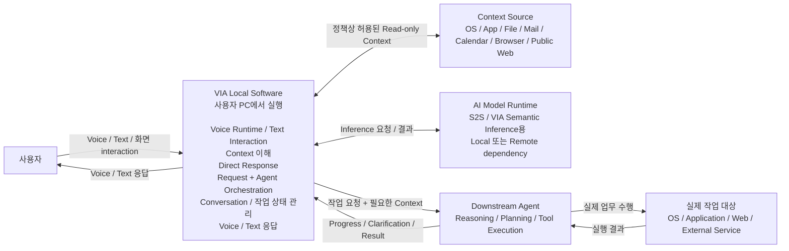

# 1. System Mission & Boundary

## 1.1 System Mission

VIA는 **사용자의 PC에 설치되어 실행되며, Voice·Text·화면 상호작용을 하나의 연속된 사용자 interaction으로 관리하고, VIA 자체에서 완료할 수 있는 요청은 직접 응답하며, 실제 업무 수행이 필요한 요청은 적절한 Downstream Agent에 위임하고, 그 진행 과정과 결과를 사용자에게 연결하는 소프트웨어 시스템**이다.

여기서 "사용자의 PC에 설치되어 실행된다"는 것은 VIA 소프트웨어 자체가 사용자 PC에서 실행된다는 의미이다. VIA가 사용하는 모든 AI Model이나 Downstream Agent까지 반드시 PC에서 실행되어야 한다는 의미는 아니다.

VIA의 핵심 역할은 다음과 같다.

1. **Voice 및 Text 입력 수신**
   - 사용자의 요청을 Voice와 Text 두 방식으로 받는다.
   - 두 입력 방식은 동일한 사용자 interaction과 conversation state 안에서 관리한다.

2. **실시간 Voice interaction 처리**
   - Voice 처리 영역은 VIA Architecture 범위에 포함한다.
   - VIA는 Voice Runtime을 포함하며, Voice Runtime은 S2S(Speech-to-Speech) Model을 기본 Voice Model dependency로 사용한다. S2S Model의 실행 위치는 local 또는 remote일 수 있다.
   - Voice interaction의 시작, 종료, 중단, 재개를 VIA가 관리한다.
   - S2S Model이 자체 지식으로 바로 답하는 경우에도 해당 사용자 발화와 응답은 VIA가 관리하는 conversation state에 포함한다.

3. **Context 수집 및 조회**
   - 화면 정보, pointer 동작, selection, focused window, foreground application 등 현재 PC interaction context를 수집한다.
   - 사용자 요청을 이해하거나 직접 답하기 위해 필요한 경우, 정책상 허용된 범위에서 local file, mail, calendar, browser 및 public web 등의 정보를 read-only 방식으로 조회할 수 있다.
   - 사용자가 허용한 개인화 정보는 User Memory로 사용하고 사용자에게 확인·변경·삭제 수단을 제공한다.

4. **사용자 요청 이해 및 보완**
   - 자연스럽고 불완전하며 대화체인 사용자 표현을 Voice/Text 입력과 현재 Context를 함께 사용하여 해석한다.
   - "이거", "여기", "이 부분", "아까 하던 것"과 같은 표현을 interaction context와 conversation context에 연결한다.
   - 한 번의 발화에 여러 요청이 있으면 요청을 구분하고 사용자가 명시한 순서·조건·결과 의존 관계를 보존한다.

5. **현재 요청과 진행 중인 작업의 관계 판단**
   - 현재 사용자 요청이 새로운 작업을 시작하는지, 기존 작업을 이어서 수행·수정·조회·취소하는 것인지 판단한다.
   - 판단 결과에 따라 해당 요청을 적절한 VIA 내부 작업 상태와 연결한다.

6. **VIA Direct Response 제공**
   - Downstream Agent의 실제 업무 실행이 필요하지 않은 요청은 VIA 내부에서 직접 처리할 수 있다.
   - **S2S Direct Response**는 Voice Runtime의 S2S Model이 자체 지식과 Conversation만으로 바로 응답하는 경우이다.
   - **VIA Core Direct Response**는 VIA가 이미 보유한 대화·작업 정보 또는 범위가 명확한 read-only Context를 사용하여 필요한 semantic processing 후 응답하는 경우이다. 새 정보 조회를 매번 요구하지 않는다.
   - Direct Response도 다른 interaction과 동일하게 VIA conversation history에 기록하며 이후 follow-up에서 참조할 수 있다.

7. **Downstream Agent 선택 및 작업 위임**
   - 실제 업무 수행이 필요한 요청은 적절한 Downstream Agent를 선택하여 요청과 필요한 Context를 전달한다.
   - 실제 업무의 domain reasoning, planning, tool selection, work execution은 Downstream Agent가 담당한다.

8. **사용자 관점의 작업 interaction 관리**
   - 진행 상태, clarification 요청, consent 요청, follow-up, correction, cancellation, completion, failure를 사용자와 관련 작업 사이에 연결한다.

9. **Text 및 Voice 응답 제공**
   - 모든 사용자에게 보이는 응답은 Text 형태로 Chat UI에 표시하고 conversation history에 기록한다.
   - Voice interaction이 활성화되어 있으면 사용자가 즉시 알아야 할 핵심 내용을 짧은 Voice Response로 함께 제공한다.
   - Text Response에는 음성으로 모두 읽을 필요가 없는 상세 결과와 추가 정보를 포함할 수 있다.
   - 장시간 작업 완료나 사용자의 후속 확인이 필요한 경우 UI 또는 OS notification으로 알릴 수 있다.

요약하면 다음과 같다.

> **VIA는 사용자 Interaction과 Orchestration을 담당하고, Downstream Agent는 실제 업무의 Reasoning, Planning, Execution을 담당한다.**

---

## 1.2 System Boundary

VIA와 Downstream Agent의 기본 책임 경계는 다음과 같다.

### System Context Diagram

아래 그림은 VIA를 하나의 시스템으로 보고, 사용자 및 외부 시스템과의 관계를 나타낸다. 실행 위치가 local인지 remote인지와 관계없이 **VIA가 책임을 갖고 설계하는 영역과 외부 책임 영역을 구분하는 것**이 목적이다.

> **경계 해석:** Voice Runtime 자체는 VIA Local Software 안에 있다. S2S 및 VIA Semantic Inference에 사용하는 AI Model Runtime은 local 또는 remote에 배치될 수 있는 dependency이며, **Model을 호출·연결·교체하는 구조는 VIA Architecture 범위에 포함하지만 Model 내부 구현과 학습은 포함하지 않는다.** Context Source 역시 VIA가 사용하는 read-only dependency이다. 외부 업무 상태 변경과 업무의 조사·계획·실행은 Downstream Agent가 담당한다.

### VIA가 직접 수행할 수 있는 범위

- Voice 및 Text interaction 처리
- Voice S2S 처리 및 Direct Response
- Conversation state 관리
- 화면 및 사용자 interaction Context 수집
- 정책상 허용된 local file, mail, calendar, browser, public web 등에 대한 **범위가 명확한(bounded) read-only 검색 및 조회**
- 사용자 표현과 화면/interaction Context의 연결
- 사용자 요청 이해 및 refinement
- 새로운 작업과 기존 작업의 association
- Downstream Agent 선택 및 요청 위임
- Progress, clarification, consent, follow-up, correction, cancellation, result interaction
- Voice 및 Text 응답 전달
- VIA 자체의 대화·작업 상태·설정·허용된 User Memory 관리

### Downstream Agent가 담당하는 범위

- 실제 업무 수행에 필요한 domain-specific reasoning
- 스스로 Source를 탐색·선별·종합하는 open-ended research / analysis
- 업무 수행 방법의 planning
- 사용할 Tool 선택
- 실제 업무 수행을 위한 Tool 실행
- OS, Application, Web, External Service의 실제 업무 상태를 변경하는 작업
- Agent 내부 workflow 및 sub-task 관리

### Read-only Context와 Action의 경계

책임 경계는 다음 원칙으로 고정한다.

> **범위가 명확한 Context를 Read / Search / Understand 하는 것은 VIA가 수행할 수 있다.**  
> **Open-ended Research / 업무 Reasoning / Planning 또는 외부 업무 상태를 변경하는 Action은 Downstream Agent가 수행한다.**

| 동작 | 담당 |
| --- | --- |
| 현재 화면 읽기 | VIA |
| pointer / selection / focused window 확인 | VIA |
| 정책상 허용된 파일명 검색 및 파일 metadata/content 조회 | VIA에서 수행 가능 |
| 정책상 허용된 mail/calendar/browser 정보 검색 및 읽기 | VIA에서 수행 가능 |
| 범위가 명확한 공개 Web 정보 검색 및 읽기 | VIA에서 수행 가능 |
| 스스로 Web Source를 탐색·선별·종합하는 조사 | Downstream Agent |
| 파일 이동 또는 삭제 | Downstream Agent |
| 이메일 발송 | Downstream Agent |
| Calendar 일정 생성 또는 변경 | Downstream Agent |
| 사용자의 업무 수행을 위한 Application 조작 | Downstream Agent |
| Web transaction 실행 | Downstream Agent |

Read-only라는 이유만으로 항상 VIA가 직접 처리하는 것은 아니다. 대상과 범위가 명확한 조회·설명은 직접 처리하거나 Agent에 위임할 수 있다. 반면 탐색 전략이나 업무 계획을 세우는 조사·분석은 Agent에 위임한다. 자세한 경계는 [02의 Bounded Context Processing](./02-terms.md)을 따른다.

VIA 내부의 대화 기록·작업 상태·설정·허용된 User Memory를 저장·변경하는 일은 외부 업무 Action과 구분한다. 이 내부 관리 때문에 모든 기록 저장을 Agent에 위임하는 것은 아니다.

---

## 1.3 AI Model Boundary

VIA 주변에서 사용하는 AI를 책임 범위에 따라 세 영역으로 구분한다.

### 1. Voice S2S Model 사용 및 Integration — VIA Architecture 범위 안

- Voice Runtime 자체는 VIA Local Software 안에 있으며 S2S Model을 기본 Voice AI Model dependency로 사용한다.
- S2S Model Runtime은 사용자 PC에 local로 배치되거나 remote/cloud에 배치될 수 있다.
- S2S Model은 음성 interaction을 처리하고 자체 지식으로 답할 수 있는 요청의 직접 응답에 사용된다.
- S2S Model을 통한 User Turn과 Response도 모두 VIA conversation state에서 관리한다.
- Voice Runtime의 interface, streaming event, state 처리, S2S Model invocation, deployment binding, 다른 VIA 요소와의 연결 방식은 VIA Architecture 설계 범위에 포함한다.
- S2S Model 자체의 내부 구조와 학습 방법은 VIA Architecture 설계 범위에 포함하지 않는다.
- 별도의 speech recognizer(음성 인식), VAD, TTS 또는 helper model을 추가할 수 있으나, 이는 명시적인 Architecture 설계로 결정해야 하며 S2S Model은 기본 Voice Model로 유지한다.
- 필요한 입력·시간·정정 이벤트가 특정 S2S Model에 모두 내장되어 있다고 가정하지 않는다. 제품이 필요로 하는 정보는 Voice Runtime의 연계 설계에서 제공한다.

### 2. VIA Semantic Inference — VIA Architecture 범위 안

VIA는 자신의 책임을 수행하기 위해 다음과 같은 semantic 판단을 할 수 있어야 한다.

- 사용자 요청 refinement
- referent resolution 및 interaction grounding
- 새로운 작업 / 기존 작업 association
- Downstream Agent 선택
- Direct Response와 Agent 위임 경로 판단
- 사용자에게 전달할 응답 구성

이러한 판단은 Generative Model, deterministic logic 또는 둘의 조합으로 구현할 수 있다.

Architecture 설계에서는 각 판단을 어느 VIA 요소가 소유하는지와 어떤 inference 방식을 사용하는지를 명확히 결정해야 한다.

VIA semantic inference에 사용하는 Model은 local/on-device 또는 remote/cloud에 배치될 수 있다. Model의 크기, provider, 배포 위치는 Downstream Agent 내부 구현으로 간주하지 않으며 VIA Architecture에서 다루는 변화 요소에 포함한다.

### 3. Downstream Agent Model — VIA Architecture 범위 밖

Downstream Agent가 domain reasoning, planning, tool selection 또는 tool execution을 위해 내부적으로 사용하는 Model은 해당 Downstream Agent의 구현으로 간주한다.

이 Model의 내부 구조와 성능은 VIA Architecture의 직접 설계 및 평가 범위에서 제외한다.

---

## 1.4 Boundary Principles

본 과제에서는 다음 원칙을 고정한다.

1. **VIA는 사용자 Interaction과 Orchestration을 담당한다. Orchestration은 VIA 내부 요청 흐름을 연결하는 Request Orchestration과 Downstream Agent 실행을 연결하는 Agent Orchestration을 포함한다.**
2. **Downstream Agent는 실제 업무의 Reasoning, Planning, Execution을 담당한다.**
3. **VIA 자체는 사용자의 PC에서 실행되며, VIA가 사용하는 dependency는 local 또는 remote일 수 있다.**
4. **Voice Runtime은 VIA의 일부이며 S2S Model을 기본 Voice Model로 사용한다.**
5. **VIA는 사용자 요청을 이해하거나 직접 답하기 위해 필요한 정책상 허용된 bounded read-only Context access를 수행할 수 있다. Open-ended research나 업무 분석은 Downstream Agent에 위임한다.**
6. **외부 업무 상태를 변경하는 Action은 Downstream Agent에 위임한다. VIA 자체의 대화·상태·설정·허용된 기억 관리는 VIA 책임이다.**
7. **Downstream Agent의 업무 실행이 필요하지 않은 요청은 VIA 내부에서 직접 응답할 수 있다.**
8. **Direct Response와 Agent-delegated Response는 동일한 VIA conversation 관리 체계 안에서 관리한다.**
9. **모든 사용자에게 보이는 응답은 Text로 Chat UI에 기록하고, Voice interaction이 활성화된 경우 핵심 내용을 짧은 Voice Response로 함께 제공한다.**
10. **VIA 내부 semantic decision의 책임 위치와 inference 방식은 Architecture에서 명시적으로 결정하며, 모든 판단이 하나의 고정 Model 또는 하나의 고정 Component에서 수행된다고 가정하지 않는다.**
11. **Downstream Agent 내부의 Model, reasoning, planning, tool selection, tool execution 및 execution 성능은 VIA Architecture 평가 범위에서 제외한다.**

본 절에서는 최종 Architecture Significant Requirement를 미리 고정하지 않는다. ASR은 이후 시스템 기능, 대표 Use Case, Fixed Assumption, 변화 시나리오를 정의한 뒤 그 결과에서 도출한다.
