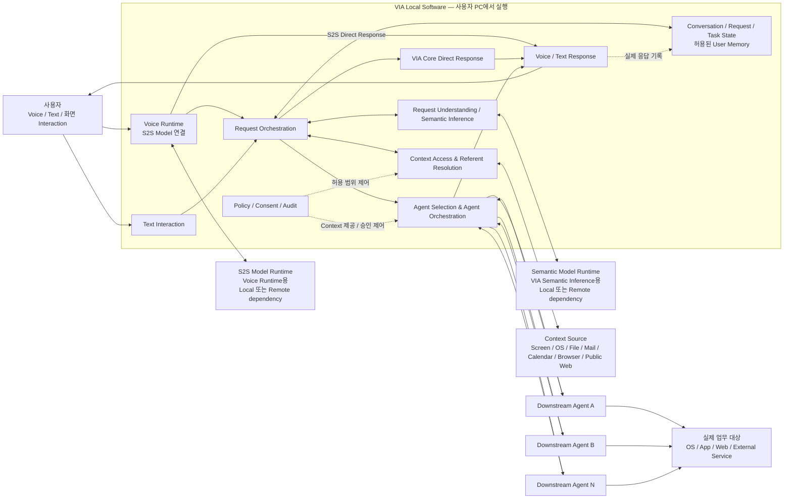

# 3. 고정 Architecture Scope

## 3.1 목적

본 과제에서 VIA의 최상위 책임 구조는 다음과 같이 고정한다.

> **VIA는 사용자와 여러 Downstream Agent 사이에서 동작하는 Agent-neutral Interaction & Orchestration 시스템이다.**  
> VIA는 사용자 Interaction, Context 이해, 요청 정리, Conversation/Task 상태, Request Handling 결정, Downstream Agent 선택 및 사용자-facing orchestration을 책임진다.  
> 실제 업무의 domain reasoning, planning, tool selection, tool execution은 선택된 Downstream Agent가 담당한다.

여기서 `Agent-neutral`은 VIA가 특정 하나의 Downstream Agent 또는 특정 Agent Runtime을 중심으로 설계되지 않는다는 뜻이다.

Downstream Agent는 여러 종류가 존재할 수 있으며, VIA는 사용자 요청과 현재 상태에 따라 적절한 Agent를 선택하여 위임한다.

---

## 3.2 고정 설계 전제

본 과제는 다음 문제를 해결하는 Architecture를 설계한다.

- Voice/Text 기반 사용자 interaction
- 화면 및 사용자 Context 이해
- 자연스럽고 불완전한 요청의 정리
- S2S Direct Response와 VIA Core Direct Response
- 새로운 작업과 기존 작업의 연속성
- 여러 종류의 Downstream Agent와의 연결
- Agent 진행 상태와 결과의 일관된 사용자 전달
- Compound Request decomposition 및 관계 보존
- Model 및 Agent 생태계 변화에 대한 대응

VIA 자체가 하나의 범용 업무 실행 Agent가 되는 구조가 아니라, **사용자와 여러 Agent 사이의 독립적인 Interaction/Orchestration 계층**으로 동작하는 것을 본 과제의 설계 전제로 고정한다.

---

## 3.3 Top-level Architecture

VIA Local Software 박스는 사용자 PC에서 실행되는 VIA 자체를 나타낸다. Voice Runtime은 그 안에 있으며, **S2S Model Runtime**과 **Semantic Model Runtime**은 용도가 다른 Model dependency로 구분한다. 각각 local 또는 remote에 배치될 수 있다.

Model 박스를 밖에 그렸다는 이유로 반드시 원격 또는 별도 프로세스로 배치해야 하는 것은 아니다. 두 Model 용도의 구분도 반드시 서로 다른 물리 모델 두 개를 도입해야 한다는 뜻은 아니다. 이 그림은 책임 관계를 보여주며 실제 배치는 설계에서 결정한다.

다음은 VIA Architecture 설계 범위에 포함한다.

- Model invocation interface
- streaming / event contract
- deployment binding
- provider 교체 구조
- Model 호출과 VIA state의 연결

Model 자체의 내부 구조와 학습 방법은 VIA Architecture 설계 범위에 포함하지 않는다.

이 그림의 VIA 내부 박스는 최종 Component 구성을 의미하지 않는다. 현재 단계에서 고정하는 것은 **책임 영역과 책임 방향**이다. S2S 직접 응답도 Conversation에 남으며, 기록을 위해 동일 요청을 Core에서 다시 실행하지 않는다.

---

## 3.4 VIA에 고정되는 책임

### 사용자 Interaction

- Voice 입력
- Text 입력
- Voice Response
- Text Response
- Voice interruption
- Chat UI 및 notification

### Conversation 및 요청 상태

- Conversation 유지
- User Turn 관리
- VIA Request 생성 및 관계 관리
- VIA Task 생성 및 상태 관리
- Voice Connection과 Conversation/Task lifecycle 분리
- VIA 자체의 대화·작업 상태·설정 및 허용된 User Memory 관리

### Context

- Interaction Context 수집
- Conversation Context 사용
- Task Context 사용
- Personal Information Context read-only 조회
- Public Information Context read-only 조회
- User Memory Context 사용
- Referent Resolution 및 Interaction Grounding에 필요한 Context 제공

### 요청 이해 및 처리 경로 판단

- Compound Request decomposition과 request 간 관계 보존
- Request Refinement
- Referent Resolution
- Task Association 및 Task Relation 결정
- Request Handling 결정
- Downstream Agent 선택

이러한 판단에 Generative Model을 사용할지 deterministic logic을 사용할지는 이 절에서 고정하지 않는다. 다만 해당 판단의 **최종 책임은 VIA에 있다.**

사용자가 명시한 순서·조건·결과 의존성을 유지하는 것은 VIA 책임이다. 사용자 목표를 달성하기 위해 업무 내부 단계를 새로 계획하거나 Tool을 선택하는 것은 Agent 책임이다. 복합 요청 지원을 이유로 VIA에 범용 업무 Workflow Engine을 강제하지 않는다.

### Direct Response

VIA는 다음 Direct Response를 제공할 수 있다.

- **S2S Direct Response**
- **VIA Core Direct Response**

두 경우 모두 User Turn, VIA Request, Response 및 필요한 Context를 Conversation에 기록하여 이후 follow-up에서 사용할 수 있어야 한다. Core 직접 응답은 이미 가진 대화·작업 상태를 사용할 수 있으며, 매번 새 Source 조회를 강제하지 않는다.

### Agent Selection 및 Agent Orchestration

VIA는 다음을 책임진다.

- 요청에 적절한 Downstream Agent 선택
- Agent에 전달할 요청과 Context 구성
- VIA Task와 Agent Execution 연결
- progress / status
- clarification
- consent / approval interaction
- follow-up
- correction
- cancel
- result / failure 전달

### Policy 및 Context 제공 통제

VIA는 다음을 통제한다.

- 어떤 Context를 읽을 수 있는지
- 어떤 Context를 외부 Model에 제공할 수 있는지
- 어떤 Context를 Downstream Agent에 제공할 수 있는지
- 사용자 consent가 필요한지
- 사용자-facing audit / provenance 정보

Agent 업무 Action의 실제 실행과 권한 강제는 Agent가 담당한다. VIA는 Context 접근·제공을 통제하고 사용자 질문·승인·거부를 해당 업무에 연결한다.

---

## 3.5 Downstream Agent에 고정되는 책임

Downstream Agent는 다음을 담당한다.

- open-ended research
- 스스로 Source를 찾아 선별·종합해야 하는 업무 analysis
- 실제 업무 수행을 위한 domain reasoning
- 업무 수행 순서와 방법의 planning
- 사용할 Tool 선택
- Tool invocation
- OS / Application / Web / External Service에서 실제 업무 수행
- 외부 업무 상태를 변경하는 Action
- Agent 내부 workflow / sub-task
- Agent 내부 retry / planning loop
- Agent 내부 Model 사용 방식

대표 예:

- 여러 공개 Source를 조사하여 비교 보고서 작성
- 파일 이동/삭제
- 이메일 발송
- 일정 생성/변경
- Application UI 조작
- Web transaction
- 문서/파일 생성 및 저장

VIA는 이러한 Agent 내부 동작을 다시 계획하거나 개별 Tool Call을 중앙에서 통제하지 않는다.

---

## 3.6 VIA와 Downstream Agent의 처리 경계

본 과제에서 기본 책임 경계는 다음과 같다.

> **Bounded Read / Search / Understand → VIA에서 수행 가능**  
> **Open-ended Research / 업무 Reasoning / Plan / Act → Downstream Agent**

### VIA가 직접 처리할 수 있는 범위

- S2S Model 자체 지식과 제공된 Conversation으로 답변
- 현재 화면/selection 이해
- 특정 문서·메일·일정 등 대상이 명확한 read-only 조회
- 대상과 범위가 명확한 Public Web 조회
- 지정 자료 안에서 읽기·발췌·요약·단순 비교
- Conversation / Task 상태를 이용한 interaction-level 응답

### Downstream Agent에 위임하는 범위

- 탐색 범위 자체를 결정해야 하는 research
- 새로운 Source를 찾아 선별·종합해야 하는 업무 분석
- 업무 수행 방법을 결정하는 domain-specific reasoning
- multi-step planning
- state-changing Action
- 실제 업무 workflow 수행

지정한 두 그래프의 내용을 비교하는 것과, 비교 근거를 찾기 위해 여러 사이트를 조사하는 것은 다른 요구이다. 자료 수, 검색 횟수 또는 처리 시간만으로 경계를 정하지 않는다.

Public Web Search가 VIA의 Context Source라는 사실은 **모든 Web 기반 요청을 VIA가 직접 수행한다는 뜻이 아니다.** VIA 직접 처리도 가능한 정보성 요청을 Agent에 위임하는 구성은 허용된다. 구체적인 배치는 이후 후보 비교에서 결정하되 [05의 사용자 목표와 완료 조건](./05-representative-use-cases.md)은 동일하게 충족해야 한다.

---

## 3.7 Agent-neutral 원칙

1. **특정 Downstream Agent가 VIA 전체의 Primary Runtime 역할을 하지 않는다.**
2. **VIA의 Conversation, VIA Request, VIA Task identity는 특정 Agent의 session/thread ID에 종속되지 않는다.**
3. **VIA가 Downstream Agent를 선택한다.**
4. **Agent가 바뀌어도 VIA의 사용자-facing Conversation과 Task identity는 유지된다.**
5. **Agent-specific protocol/SDK 차이는 VIA와 Agent 사이의 integration boundary에서 흡수한다.**
6. **Downstream Agent의 result, progress, clarification은 VIA를 통해 사용자에게 전달한다.**
7. **사용자가 특정 Agent 내부 구조를 이해해야만 시스템을 사용할 수 있는 구조를 기본으로 하지 않는다.**

사용자가 보는 Task identity를 유지한다는 것이 서로 다른 Agent의 내부 실행 상태까지 자동 이전된다는 뜻은 아니다. 재위임 시 기존 실행의 상태와 새 요청을 연결해야 한다.

---

## 3.8 Architecture Scope에서 제외되는 구조

### 특정 General-purpose Agent가 VIA의 최상위 책임을 소유하는 구조

특정 하나의 General-purpose Agent Runtime이 다음 VIA 책임을 대신 소유하는 구조는 본 과제 범위에서 제외한다.

- 사용자 요청의 최상위 semantic interpretation
- VIA 전체 Request Handling 결정
- VIA Task identity
- 사용자-facing orchestration
- 모든 Downstream Agent에 대한 최상위 delegation

### VIA의 State-changing Local Action

VIA가 직접 다음과 같은 외부 업무 상태 변경을 수행하는 구조도 본 과제 범위에서 제외한다.

- 파일 이동/삭제
- 이메일 발송
- 일정 수정
- Application 조작
- Web transaction

단순하고 빠른 작업이라도 **외부 업무 상태를 변경하는 Action이면 Downstream Agent에 위임**한다. VIA 자신의 기록·상태·설정·허용된 기억을 관리하는 일이나 사용자의 화면 동작을 관찰하는 일은 이 Action과 다르다.

Agent가 업무용 앱을 여는 것은 허용되지만 사용자 질문·승인·결과 전달의 창구는 VIA로 유지한다.

---

## 3.9 고정 Scope 안에서 Architecture가 결정해야 하는 범위

다음 구조적 문제는 이후 Architecture Decision에서 반드시 결정한다.

- Voice Runtime을 S2S 중심으로 어떻게 구성할 것인가
- S2S 모델 1개·semantic LLM 1개 안에서 필요한 입력 근거와 출력·제어 계약을 어떻게 제공할 것인가. 추가 speech recognizer/VAD/TTS/helper 모델은 허용하지 않음
- S2S Direct Response와 VIA Core 처리 사이의 boundary를 어떻게 구성할 것인가
- VIA semantic inference를 어디에서 수행할 것인가
- Context를 언제 수집하고 어디에서 보관할 것인가
- Referent Resolution을 어떤 책임 구조로 나눌 것인가
- Request Refinement를 어떤 단계와 책임으로 구성할 것인가
- Task Association의 책임과 authoritative state를 어디에 둘 것인가
- Request Handling 결정을 어디에서 수행할 것인가
- **Downstream Agent 없이 상태를 추적하는 별도의 VIA-local execution path가 필요한가**
- VIA 직접 처리도 가능한 요청을 Core에서 처리할지 Agent에 위임할지
- 여러 Model provider와 local/cloud deployment를 어떤 abstraction으로 흡수할 것인가
- 서로 다른 Downstream Agent protocol을 어떤 integration boundary로 흡수할 것인가
- VIA Task와 Agent Execution 상태를 어디에서 소유하고 복구할 것인가
- progress / cancel / follow-up / failure를 어떤 구조로 관리할 것인가
- Context 및 Model/Agent 접근 Policy/Consent 책임을 어떤 구조로 배치할 것인가

즉, **VIA-local stateful execution path의 존재 여부는 이 문서에서 고정하지 않으며 Architecture Decision으로 평가한다.**

---

## 3.10 한 문장 요약

> **VIA는 사용자와 여러 Agent 사이의 일관된 Interaction/Orchestration 계층이다. 범위가 명확한 정보를 읽고 이해하고 사용자 interaction을 연결하는 일은 VIA가 수행할 수 있으며, open-ended research와 실제 업무 reasoning·planning·execution은 Downstream Agent가 담당한다.**
