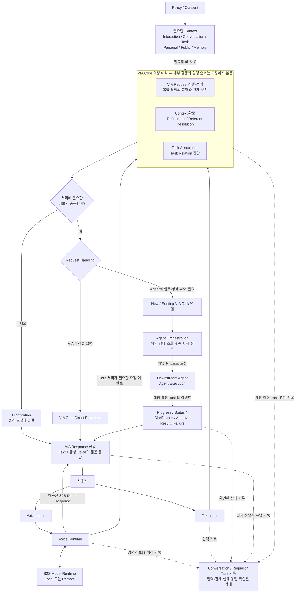
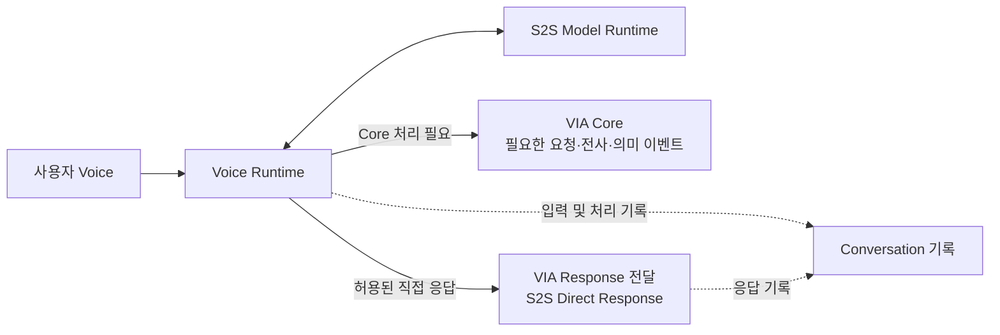
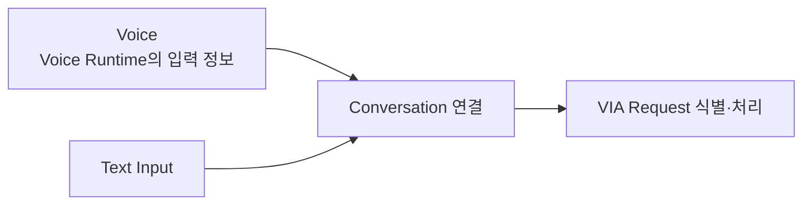
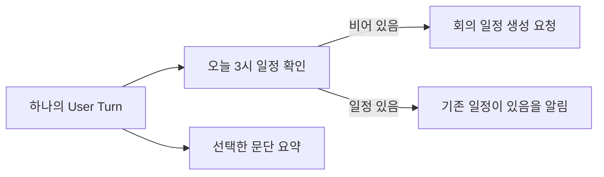
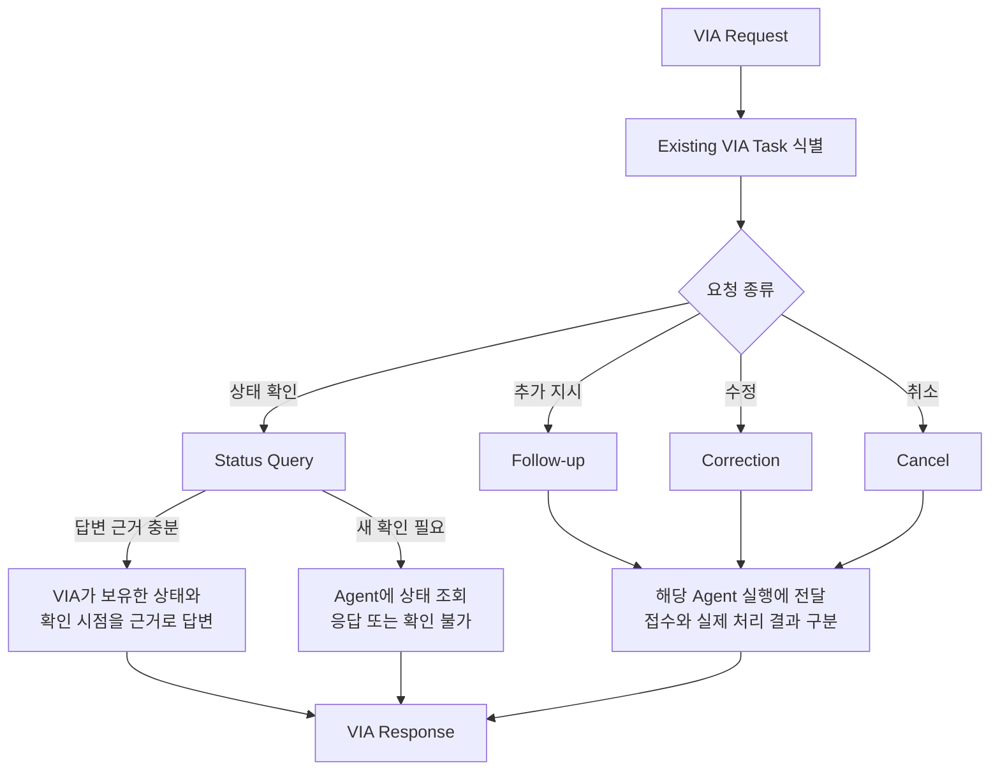

# 4. Canonical Interaction Flow

## 4.1 목적

Canonical Interaction Flow는 VIA가 어떤 세부 Architecture로 구현되더라도 **사용자 요청을 처리하기 위해 성립해야 하는 논리적 책임과 정보 관계**를 정의한다.

이 문서는 실제 pipeline의 고정 실행 순서를 의미하지 않는다. 다음 활동은 Architecture에 따라 순차, 병렬, 반복 또는 일부 fast path로 처리될 수 있다.

- S2S streaming 처리
- Context 확보
- Compound Request decomposition
- Request Refinement
- Referent Resolution
- Task Association
- Semantic Inference
- Request Handling 결정

필요 없는 활동이나 별도 Model 호출을 모든 요청에 강제하지 않는다. 다만 수행할 업무의 대상과 제약, 관련 Task, 사용자에게 전달한 응답은 올바르게 식별·연결되어야 한다.

**고정하는 것은 필요한 책임과 산출물이며, 순서·병렬화·Component 배치는 Architecture Decision에서 결정한다.** 사용자 행동과 완료 조건은 [05 Representative Use Cases](./05-representative-use-cases.md)에서 구체화한다.

---

## 4.2 전체 Canonical Interaction Flow



### 이 그림을 읽는 방법

- **Request 생성/분해, Context·Refinement·Referent Resolution, Task Association 사이에는 고정 실행 순서가 없다.** 하나의 책임 묶음 안에 표시했으며, 병렬·선행·반복 처리가 가능하다.
- 실선은 처리 책임 사이의 논리적 전달, 점선은 기록·제어 관계이다. 모든 화살표가 별도 호출·스레드·프로세스를 뜻하지 않는다.
- **S2S가 이미 답한 Request는 기록했다는 이유로 Core에서 다시 실행하지 않는다.** 같은 User Turn에 별도의 다른 Request가 있으면 그것만 Core 처리로 이어질 수 있다.
- 기록 영역은 입력·응답·상태를 연결하기 위한 책임이다. 데이터베이스를 하나로 만들거나 기록 완료까지 음성 전달을 직렬 대기시키라는 의미가 아니다.
- Voice/Model Runtime의 물리적 배치는 03의 경계 설명을 따른다. 이 그림은 배치도가 아니다.

### Task Relation과 Request Handling

Task Relation은 **현재 요청이 어떤 지속 업무와 관련 있는가**이다.

- No Tracked Task
- New Task
- Existing Task

Request Handling은 **이번 요청을 어디에서 어떻게 처리하는가**이다.

- S2S Direct Response
- VIA Core Direct Response
- Downstream Agent Handling

두 판단은 구분하지만 모든 조합을 무조건 허용하지는 않는다. 새 Agent 업무를 시작하면 VIA Task와 연결하고, 기존 업무 상태 질문은 해당 Task를 식별한다. S2S나 Core가 답한다는 사실만으로 과거 대화나 Task 관계가 사라지는 것은 아니다.

---

## 4.3 Voice Runtime 및 S2S Flow

Voice 입력은 단순히 speech-recognition 결과를 만드는 경로가 아니다.

Voice Runtime은 S2S Model을 사용하여 다음 두 기능을 지원한다.

1. **VIA Core 처리 및 기록에 필요한 입력 정보와 이벤트 제공**
2. **자체 지식과 제공된 Conversation만으로 충분한 경우 S2S Direct Response 전달**



입력 정보의 제공과 직접 응답의 생성은 배타적인 기능이 아니다. 직접 응답한 경우에도 입력·응답 기록은 필요하다. **다만 같은 Request에 대해 사용자 답변이나 업무 실행이 중복되어서는 안 된다.**

이 정의는 특정 S2S Model이 전사·단어별 시간정보·수정 이벤트를 모두 자체 API로 제공한다고 가정하지 않는다. 제품에 필요한 정보는 Voice Runtime과 Model 또는 보조 기능의 연결로 제공하며, 그 구성은 Architecture Decision에서 비교한다.

S2S Direct Response도 독립 대화로 취급하지 않는다. 최소한 다음 정보는 Conversation에 연결한다.

- User Turn
- transcript 또는 의미상 동등한 입력 기록
- VIA Request
- S2S Response
- 시간 및 순서

추가 정보 조회·업무 제어가 필요하거나 발화가 정정되면 VIA의 해당 처리 책임으로 연결한다. S2S 직접 응답을 이유로 VIA의 허용 범위와 사용자 요청 확인을 우회하지 않는다.

---

## 4.4 Text Flow

Text 입력은 Chat UI에서 하나의 User Turn으로 들어오며 Voice와 동일한 Conversation과 VIA Request 처리 체계에 연결한다.



Voice와 Text는 입력 방식은 다르지만 Conversation, Context, Task Relation 및 Agent interaction을 공유한다. Text 일반 질문은 VIA Core가 이미 가진 지식·대화 맥락으로 직접 답할 수 있으며, 외부 Context 조회나 음성 S2S 경로를 매번 거치도록 강제하지 않는다.

---

## 4.5 Compound Request Decomposition

Compound Request는 본 과제의 핵심 Use Case이며 VIA가 처리해야 한다.

예:

> "오늘 3시가 비었으면 회의 일정을 만들고, 이미 일정이 있으면 알려주기만 해. 그리고 이 문단도 요약해줘."

하나의 User Turn을 여러 VIA Request로 구분하고, 대상·제약과 Request 사이 관계를 함께 보존한다.



지원하는 관계는 다음과 같다.

- **Independent**: 서로 독립적으로 처리 가능
- **Sequential**: 사용자가 지정한 순서대로 처리
- **Data-dependent**: 앞 Request 결과를 뒤 Request가 사용
- **Conditional**: 앞 결과 또는 조건에 따라 뒤 Request 수행

Compound Request decomposition은 Request Refinement의 주요 책임이다. 사용자가 명시한 업무 관계를 보존하는 것과 목표를 달성하기 위한 Agent 내부 계획을 새로 만드는 것은 다르다. 후자의 planning과 Tool 선택은 Agent가 담당한다.

관계를 한 Agent에 함께 전달할지 여러 Agent 사이에서 연결할지는 이 문서에서 고정하지 않는다. 조건 자체가 업무 분석을 필요로 하면 그 판단도 Agent에 맡긴다. 단순히 여러 대상을 지칭했다는 이유로 한 요청을 여러 업무로 분해하지 않는다.

앞 요청이 실패하면 그 결과에 의존한 뒤 요청을 완료했다고 처리하지 않는다. 독립 요청은 별도로 진행·실패를 전달할 수 있으며 부분 완료를 전체 완료와 구분한다.

---

## 4.6 Context, Request Refinement, Referent Resolution

각 VIA Request에 대해 VIA는 처리에 필요한 의미와 Context를 확보한다.

사용할 수 있는 Context:

- Interaction Context
- Conversation Context
- Task Context
- Personal Information Context
- Public Information Context
- User Memory Context

### Request Refinement

불완전하고 자연스러운 표현을 처리 가능한 Request 의미로 정리한다.

### Referent Resolution

"이거", "그 파일", "아까 그거" 등 사용자가 지칭한 실제 대상을 결정한다. 화면에 보이는 대상뿐 아니라 background의 열린 자료, 검색 가능한 정보, 이전 대화·업무의 대상도 포함한다.

### Interaction Grounding

Referent Resolution 중 사용자가 대상을 지정한 시점의 화면 interaction evidence를 이용하는 경우이다.

- pointing
- pointer trajectory
- hover / click
- drag
- selection
- focus / caret
- screen / viewport / UI object

발화 전에 지정한 대상과 발화 중 지정한 대상을 모두 지원한다. Context 접근은 Policy State와 Consent 조건을 따른다. 지원하지 않는 자료나 읽을 수 없는 화면 내용을 임의로 만들어내지 않는다.

---

## 4.7 Task Association과 Task Relation

각 VIA Request에 대해 필요한 Task Association을 수행하여 지속적으로 추적되는 VIA Task와의 관계를 판단한다. 그 결과가 Task Relation이다. 이것은 매번 별도의 LLM 호출을 수행한다는 뜻이 아니다.

### No Tracked Task

별도의 지속 Task identity 없이 현재 Request를 처리할 수 있다.

> **No Tracked Task여도 Conversation history와 VIA Request 기록은 유지된다.**

예: "TCP와 UDP 차이가 뭐야?"

### New Task

새로운 지속 업무를 시작해야 한다.

예: "이 자료로 PPT 만들어줘."

### Existing Task

기존 VIA Task의 상태 조회, follow-up, correction, cancel 또는 같은 목표·결과물에 이어지는 요청이다.

예: "아까 PPT 어디까지 됐어?" / "거기에 시장 전망 한 장 더 추가해줘."

Existing Task인 경우 정확한 VIA Task ID를 식별한다. 반대로 이전 결과를 단순 참고하여 별도의 새 목표를 수행하면 새 Task를 만들고 이전 결과를 연결할 수 있다. 구분할 근거가 없으면 확인한다.

---

## 4.8 Request Handling

Task Relation과 구분하여 **이번 Request를 어디에서 어떻게 처리할지** 결정한다. 두 판단의 실제 실행 순서는 고정하지 않는다.

### A. S2S Direct Response

Voice 입력에서 S2S Model이 자체 지식과 제공된 Conversation만으로 바로 답할 수 있는 경우이다.

예: "TCP랑 UDP 차이가 뭐야?"

### B. VIA Core Direct Response

VIA Core가 기존 Conversation/Task 정보, bounded Context 조회 및 필요한 semantic processing으로 답할 수 있는 경우이다. 매번 새 Context 조회가 필요한 것은 아니다.

예:

- 현재 PDF를 보며 "이 문서 핵심이 뭐야?"
- "오늘 원달러 환율 얼마야?"에 대해 정해진 공개 정보를 조회
- Text로 입력한 일반 질문에 답변
- 이미 받은 진행 상태를 근거와 함께 전달

이러한 정보성 요청도 설계에 따라 Downstream Agent에 위임할 수 있다. 공개 Web을 사용하거나 5초 이상 걸린다는 이유만으로 처리 위치를 정하지 않는다.

### C. Downstream Agent Handling

새 업무를 위임하거나 기존 Agent 업무의 상태 확인·후속 지시·수정·취소를 처리하는 경우이다.

다음 업무는 Downstream Agent에 위임한다.

- 스스로 탐색 범위를 정하는 open-ended research
- 여러 Source를 찾아 선별·종합하는 업무 분석
- 업무 수행 방법을 결정하는 domain reasoning
- multi-step planning 및 domain workflow
- 외부 업무 상태 변경 Action
- 실제 업무 수행을 위한 Tool 실행

예: "최근 AI Agent 시장 자료를 조사해서 비교 보고서로 만들어줘."

사용자가 지정한 두 자료의 단순 내용 비교와 새로운 Source를 찾아 수행하는 업무 조사는 구분한다. Agent가 작성한 결과를 VIA Core가 요약하거나 S2S가 읽어주더라도 원래 업무의 Handling이 Direct Response로 바뀌는 것은 아니다.

---

## 4.9 Task Relation과 Request Handling 조합

두 축은 1:1로 고정되지 않는다.

| 사용자 요청과 대표 구성 | Task Relation | Handling |
| --- | --- | --- |
| "TCP랑 UDP 차이가 뭐야?" | No Tracked Task | S2S Direct Response |
| 현재 PDF를 VIA Core가 직접 설명 | No Tracked Task | VIA Core Direct Response |
| 같은 PDF 설명을 Agent 업무로 위임 | New Task 또는 관련 Existing Task | Downstream Agent Handling |
| "이 내용으로 PPT 만들어줘." | New Task | Downstream Agent Handling |
| "아까 PPT 어디까지 됐어?" | Existing Task | VIA 보유 상태로 직접 답변하거나 Agent에 상태 조회 |
| "PPT에 한 장 더 추가해줘." | Existing Task | Downstream Agent Handling |

표는 가능한 구성을 설명한다. UC별 처리 위치를 모두 미리 선택한 것은 아니다. **Task Relation을 처리 위치로 해석해서는 안 된다.**

---

## 4.10 Existing Task Control Flow

기존 VIA Task에 대한 Request는 유형에 따라 처리한다.



VIA Task identity와 Agent Execution identity는 분리한다. 기존 실행이 종료되었거나 후속 요청을 지원하지 않으면 가능한 다른 실행 방식과 사용자에게 미치는 영향을 확인한다. 사용자 목표가 이어지더라도 Agent 내부 상태가 자동 이동한다고 가정하지 않는다.

상태 질문에는 마지막으로 확인한 상태와 방금 확인한 상태를 구분한다. 새 정보가 없으면 진행률을 추측하지 않는다. 수정·취소 요청이 접수되었다는 사실과 실제 반영·종료는 구분하여 알린다.

---

## 4.11 Clarification

현재 정보만으로 Request를 충분히 이해할 수 없으면 Clarification을 요청한다.

사용자의 확인 응답은 새로운 User Turn이지만 다음 정보와 연결한다.

- 원래 VIA Request
- 이미 확정된 Referent
- 확보한 Context
- Conversation
- 관련 VIA Task 또는 후보
- 부족했던 정보와 해당 질문

VIA Task가 없는 Request도 확인 대기 상태를 가질 수 있다. 사용자가 전체 요청을 처음부터 반복할 필요가 없어야 한다. 여러 질문이 대기 중이면 “응”이 어느 질문에 대한 답인지 식별하고, 근거가 부족하면 다시 확인한다. 사용자가 새 주제를 시작했다고 앞 질문에 동의한 것으로 처리하지 않는다.

---

## 4.12 Downstream Agent Interaction

Downstream Agent Handling 중에도 **모든 user-facing interaction의 창구는 VIA**이다.

Agent가 다음을 요청하거나 전달할 수 있다.

- progress / status
- clarification
- action approval
- consent가 필요한 추가 Context 요청
- completion
- failure

사용자는 VIA를 통해 follow-up, correction, cancel, approval, clarification response를 전달한다.

질문·동의·승인과 답변은 해당 Request, VIA Task, Agent Execution에 연결한다. 모든 일반 요청에 승인 단계를 추가하지 않는다. Context의 접근·제공 허용은 VIA가 통제하고, Agent 업무 Action의 실행과 권한 강제는 Agent가 담당한다.

Agent가 업무 수행을 위해 대상 앱이나 문서를 여는 것은 가능하다. 다만 사용자에게 별도의 Agent 채팅창에서 질문·승인·결과를 주고받도록 요구하지 않는다.

---

## 4.13 Response Flow

모든 user-facing 결과는 VIA Response로 전달한다. 입력에 대한 즉시 응답뿐 아니라 새 사용자 입력 없이 도착한 Task 결과도 포함한다.

### Text Response

- 모든 사용자에게 전달하는 응답을 Chat UI와 Conversation에 남긴다.
- 상세 결과, 근거, 실제 결과물 참조, 확인된 상태를 제공할 수 있다.
- 모든 내부 이벤트를 별도 사용자 메시지로 출력해야 한다는 뜻은 아니다.

### Voice Response

Voice interaction이 활성화된 경우 핵심 내용을 짧게 말한다. Text 전체를 그대로 읽는 것을 기본으로 하지 않는다.

동시에 도착한 여러 결과를 겹쳐 말하지 않는다. 중단된 음성을 자동으로 뒤늦게 이어 재생하지 않으며, 이미 들려준 부분과 전달하지 못한 부분을 구분한다. 음성 전달이 중단되어도 Text 결과는 확인할 수 있다. 두 채널의 대상·상태·결론은 모순되지 않아야 한다.

### Notification

사용자가 VIA 화면을 보고 있지 않을 때 장시간 VIA Task의 완료, 실패 또는 사용자 확인이 필요한 상태를 UI/OS Notification으로 알릴 수 있다. 알림은 올바른 Task 및 상세 결과로 연결한다.

---

## 4.14 Conversation 및 State 갱신

### 모든 Request 공통

다음을 Conversation에 기록한다.

- User Turn
- VIA Request
- Request 간 관계
- 주요 Context / Referent
- Request Handling
- 실제 전달한 VIA Response

기록은 필요한 정보를 참조할 수 있어야 한다는 논리적 요구이다. 모든 원본 화면·음성·문서를 무제한 복사하여 보관하라는 뜻은 아니다.

### VIA Task가 있는 경우

추가로 다음을 관리한다.

- VIA Task ID
- Task 상태
- 관련 VIA Request
- 선택된 Downstream Agent
- Agent Execution 관계
- progress / result / failure
- follow-up / correction / cancel 상태
- 확인 시점과 아직 확인되지 않은 상태

Direct Response가 반복되다가 Agent 업무로 이어져도 이전 대화는 유지된다.

```text
S2S Direct Response
    ↓
VIA Core Direct Response
    ↓
New VIA Task
    ↓
Agent Execution
    ↓
Existing Task Follow-up
```

VIA 자체의 Conversation, Request/Task 상태, 설정, 허용된 User Memory 관리는 외부 업무 상태 변경 Action과 구분한다.

---

## 4.15 비동기 Control Flow

### Voice Interrupt

VIA가 말하는 도중 사용자가 다시 말하면 현재 Voice Response를 중단하고 새 User Turn을 처리한다. **음성 출력 중단은 진행 중 Agent 업무의 자동 취소가 아니다.**

### Cancel

진행 중 VIA Task 취소 시:

1. 정확한 VIA Task를 식별한다.
2. 아직 위임되지 않은 요청은 실행을 막고, 실행 중이면 취소 요청 상태를 기록한다.
3. 관련 Agent Execution에 취소를 전달한다.
4. Agent가 확인한 종료, 이미 완료, 취소 불가 또는 확인 불가를 구분하여 사용자에게 알린다.

취소를 전달했다는 이유만으로 취소 완료나 외부 변경의 원상 복구를 선언하지 않는다. 완료 이벤트와 취소 요청이 교차하면 실제 확인한 결과에 따라 설명한다.

### Correction

직전 Request를 수정하는 User Turn은 기존 Conversation / VIA Request / VIA Task 관계를 유지한다. 위임 전에는 확정된 최신 요청을 사용하고, 위임 후에는 실행 상태를 확인하여 수정·취소·후속 지시를 연결한다. 이미 수행된 외부 Action을 없었던 것으로 처리하지 않는다.

### 여러 업무와 연결 문제

한 Task의 대기 질문이나 실패를 이유로 무관한 사용자 질문·Task까지 자동 중단하지 않는다. 이벤트가 교차해도 각각의 대화·업무와 연결한다. Voice 재연결 또는 VIA 재시작 시 확인 가능한 기록과 실행 상태를 사용하며, 상태 확인 없이 변경 업무를 중복 시작하지 않는다.

---

## 4.16 Canonical Flow에서 고정하는 것과 Architecture Decision

### 고정하는 것

- Voice Runtime은 S2S Model을 사용하고, 필요한 Core 입력·기록과 S2S Direct Response를 연결한다.
- 동일 요청의 S2S 응답과 Core 처리를 중복 실행하지 않는다.
- Voice와 Text는 논리적 Conversation과 업무 맥락을 공유한다.
- 모든 의미 있는 요청은 VIA Request로 관리한다.
- Compound Request는 요청의 구분과 관계를 보존한다.
- 모든 Direct Response도 Conversation history에 남는다.
- Task Association 결과는 No Tracked / New / Existing으로 구분한다.
- Task Relation과 Request Handling은 서로 다른 판단이다.
- Request Handling은 S2S Direct / VIA Core Direct / Downstream Agent Handling으로 구분한다.
- Open-ended research, 업무 planning, 외부 업무 상태 변경은 Agent에 위임한다.
- VIA Task와 Agent Execution identity를 구분한다.
- 모든 사용자-facing interaction은 VIA에서 전달한다.
- Text 응답은 기록하고, 활성 Voice에서는 핵심을 전달한다.
- 음성 중단·취소 요청·실제 취소 완료를 구분한다.

### Architecture Decision에서 결정하는 것

- S2S Direct Response와 VIA Core 처리 사이의 정확한 boundary
- streaming transcript / semantic event contract
- Request 생성/분해, Context·Refinement·Referent Resolution, Task Association의 실제 순서·병렬화·반복
- semantic inference Model의 종류와 호출 위치
- Context capture / materialization / storage 구조
- speculative processing 여부
- 별도의 stateful VIA-local execution path를 둘 것인지
- VIA 직접 처리도 가능한 요청을 Core에서 처리할지 Agent에 위임할지
- local/remote Model deployment 구조
- Agent protocol 및 adapter 구조
- Task/Execution state의 저장 및 recovery 구조

**사용자에게 제공해야 하는 행동은 05의 UC로 구체화한다. 그 행동을 실현하는 내부 구조나 성능 점수는 이 문서에서 미리 선택하지 않는다.**
