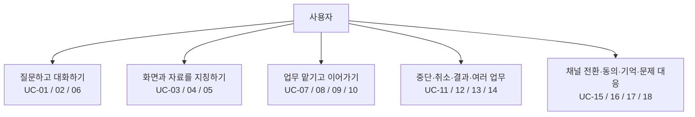

# 5. Representative Use Cases — 대표 사용자 시나리오

> 상태: 검토 완료 · 기준선 확정
> 적용 범위: 본 기준선의 [01 시스템 정의](./01-system-mission-and-boundary.md), [02 용어](./02-terms.md), [03 설계 범위](./03-fixed-architecture-scope.md), [04 공통 처리 흐름](./04-canonical-interaction-flow.md)

## 5.1 이 문서에서 결정하는 것

이 문서는 **사용자가 어떤 상황에서 무엇을 요청하고, VIA가 무엇을 해주면 그 요청을 올바르게 처리한 것인지**를 정한다.

대표 UC 18개와 각 UC의 필수 변형을 본 기준선의 사용자 시나리오 집합으로 정의한다. 아래 대화는 동작을 이해하기 위한 대표 문장이지 사용자가 외워야 하는 명령어가 아니다. 같은 목표를 자연스럽게 바꾸어 말해도 같은 요구를 만족해야 한다.

| 여기서 확정하는 것 | 여기서 결정하지 않는 것 |
| --- | --- |
| 사용자 목표, 시작 상황, 필요한 맥락, VIA의 책임, 성공 완료 조건, 실패·보류 시 행동, 필수 변형 | 특정 모델, 프롬프트, 처리 알고리즘, Component 배치, 단계의 직렬·병렬 실행, 저장 기술 |
| 화면 지칭·후속 요청·복합 요청 등 지원할 사용자 행동 | 녹음 파일, 실제 화면 데이터, 좌표·시간 값, 반복 횟수와 정답 파일 등 실행 가능한 Test Case |
| 무엇을 관찰하면 UC 충족 여부를 확인할 수 있는지 | QA의 ASR 최종 판정, 목표 수치, 가중치, 0~5점 구간 |

**UC는 사용자 요구이고, Test Case는 그 요구를 검증하는 구체적인 입력과 정답이다.** 이 문서에서는 UC를 완결하며, 실행 데이터는 11번 문서에서 이 UC ID에 연결한다. 이후 모든 Architecture 후보에는 동일하게 확정된 Test Case 집합을 적용한다.

### 읽는 순서

먼저 5.3의 전체 목록을 읽는다. 화면 지칭은 UC-03·04, 대화와 업무의 연결은 UC-07·10·14·15, 복합 요청은 UC-09를 중심으로 검토한다. 5.6~5.8은 누락 확인 및 평가 준비용이다.

---

## 5.2 모든 UC에 적용하는 원칙

1. **사용자의 창구는 VIA이다.** 직접 응답과 Agent 위임 모두 답변·추가 질문·승인 요청·진행 상태를 VIA에서 제공한다. Agent가 업무 수행을 위해 문서나 앱을 여는 것은 가능하지만, 사용자에게 별도의 Agent 대화창에서 응답하도록 요구하지 않는다.
2. **음성은 핵심, Text는 기록과 상세 내용이다.** 모든 사용자 응답은 Chat UI와 Conversation에 남긴다. Voice가 활성화되어 있으면 핵심을 짧게 들려준다. 두 채널은 대상·상태·결론이 일치해야 한다. 아직 전달하지 못한 음성을 전달한 것으로 기록하지 않는다.
3. **Direct Response도 대화의 일부이다.** VIA Task가 없어도 입력, 응답, 지칭 대상과 필요한 맥락은 후속 요청에서 참조할 수 있다. 연결 종료를 대화나 업무 삭제로 취급하지 않는다.
4. **업무와 관련 있는지와 어디에서 처리하는지는 구분한다.** Task Relation은 No Tracked Task / New Task / Existing Task이고, Request Handling은 S2S Direct Response / VIA Core Direct Response / Downstream Agent Handling이다. 이들은 같은 분류가 아니며, 모든 조합이 무조건 허용된다는 뜻도 아니다. Agent의 업무 실행을 새로 시작할 때는 VIA Task와 연결하고, 기존 업무 상태 질문은 해당 Task와 연결한다.
5. **처리 위치를 UC로 미리 선택하지 않는다.** 범위가 정해진 정보 조회·설명은 VIA Core가 처리하거나 Agent에 맡길 수 있다. 반면 탐색 전략을 세우는 조사·업무 계획·외부 업무 상태 변경은 Agent 책임이다. S2S Direct Response 자체는 지원해야 하지만, 모든 정보성 UC를 S2S가 처리해야 한다는 뜻은 아니다.
6. **Context를 읽을 수 있다는 것은 모든 앱과 데이터에 무제한 접근한다는 뜻이 아니다.** 해당 UC에서 사용하는 Source의 접근 허용과 지원 여부를 확인한다. 접근 불가·존재하지 않음·판단 불가를 임의의 다른 대상으로 대체하지 않는다.
7. **음성 출력 중단과 업무 취소는 다르다.** 사용자가 말을 끊으면 현재 음성 전달을 멈춘다. 실행 중인 Agent 업무까지 취소하려면 사용자의 취소 의도가 확인되어야 한다.
8. **완료와 접수, 보류와 실패를 구분한다.** Agent가 요청을 받았다는 사실만으로 업무 완료라고 알리지 않는다. 보류·실패가 적절한 상황에서 이를 정직하게 알리는 것은 필수 동작이지만, 원래 목표의 성공 완료와 동일하게 세지 않는다.

### VIA에서 평가할 범위

실제 문서 작성·웹 조사·앱 조작은 Downstream Agent 책임이다. VIA 평가에서는 **올바른 요청·대상·제약을 전달했는지, 진행 상태와 결과를 올바른 대화·업무에 연결했는지**를 관찰한다. Agent의 업무 능력이나 내부 실행 시간을 VIA의 결과로 주장하지 않는다.

---

## 5.3 전체 UC 목록

| UC ID | 사용자 목표 | 핵심 구분 |
| --- | --- | --- |
| [UC-01](#uc-01) | 일반 지식을 묻고 자연스럽게 대화를 이어간다 | S2S 직접 응답과 대화 기록 |
| [UC-02](#uc-02) | 특정 자료나 정해진 정보에 대해 묻는다 | 범위가 정해진 조회·설명 |
| [UC-03](#uc-03) | 대상을 먼저 지정한 뒤 말한다 | Select then Speak |
| [UC-04](#uc-04) | 말하는 동안 대상을 가리키거나 선택한다 | Speak while Pointing / Selecting |
| [UC-05](#uc-05) | 현재 보이지 않는 자료나 이전 대상을 지칭한다 | 열린 대상·닫힌 자료·대화 속 대상 |
| [UC-06](#uc-06) | 불완전한 요청을 보완하고 필요한 확인에 답한다 | 맥락 보완과 Clarification |
| [UC-07](#uc-07) | 직접 응답한 내용을 실제 업무로 이어간다 | Direct Response → 업무 위임 |
| [UC-08](#uc-08) | 조사·문서 작성·외부 동작을 Agent에 맡긴다 | 새 업무 위임과 책임 경계 |
| [UC-09](#uc-09) | 한 번에 여러 요청을 하고 관계를 유지한다 | 독립·순차·데이터 의존·조건 |
| [UC-10](#uc-10) | 기존 업무를 조회·추가 지시·수정한다 | Existing Task 연결 |
| [UC-11](#uc-11) | VIA의 말을 끊고 질문하거나 바로잡는다 | 실시간 음성 중단과 정정 |
| [UC-12](#uc-12) | 진행 중인 특정 업무를 취소한다 | 취소 접수와 실제 종료 구분 |
| [UC-13](#uc-13) | 다른 일을 하면서 진행 상황과 결과를 받는다 | 비동기 결과와 알림 |
| [UC-14](#uc-14) | 여러 업무를 번갈아 시작·조회·제어한다 | 동시 업무와 잘못된 연결 방지 |
| [UC-15](#uc-15) | Voice/Text를 바꾸거나 음성 연결 후 다시 이어간다 | 채널과 대화·업무 수명 분리 |
| [UC-16](#uc-16) | 정보 접근·전달 동의와 업무 실행 승인을 판단한다 | Consent와 Action Approval 구분 |
| [UC-17](#uc-17) | 허용한 개인화 정보를 사용·확인·변경·삭제한다 | User Memory의 사용자 제어 |
| [UC-18](#uc-18) | 연결·조회·실행 문제가 있을 때 상태와 선택지를 안다 | 실패·지원 불가·재시도 안내 |

그림은 UC의 주제 분류이다. 사용자가 이 순서로 기능을 이용해야 한다는 뜻이 아니다.

---

## 5.4 UC 상세 정의

### UC-01. 일반 지식 질문과 연속 대화

**사용자 목표:** 자료를 직접 찾거나 키보드로 길게 입력하지 않고 개념을 듣고 후속 질문을 한다.

**시작 상황:** Voice interaction이 활성화되어 있다. 질문에는 최신 정보 조회나 개인 자료 접근이 필요하지 않다.

**대표 대화:** “TCP랑 UDP는 뭐가 달라?” → 답변 → “방금 두 번째 방식은 언제 쓰는 거야?”

**VIA가 해야 할 일:** Voice Runtime과 S2S를 통해 직접 응답할 수 있어야 한다. 발화와 응답을 Conversation에 연결하고, 다음 질문이 앞 답변의 무엇을 가리키는지 유지한다. 같은 요청이 Core로도 흘렀다는 이유로 두 번 답하지 않는다.

**성공 완료 조건:** 사용자가 답변을 듣고 Chat UI에서 확인하며, 후속 질문에 앞 맥락을 다시 설명할 필요가 없다. 별도 VIA Task 생성 여부와 관계없이 기록이 남는다.

**필수 변형:** UC-01.1 일반 질문, UC-01.2 앞 응답 일부에 대한 후속 질문, UC-01.3 사용자가 새 주제로 전환, UC-01.4 같은 일반 질문을 Text로 입력. Text 응답을 만들기 위해 S2S 음성 경로를 반드시 거치게 하지는 않는다.

**실패·전환:** 최신성이나 외부 근거가 필요한 질문은 모델의 기억만으로 사실을 확정하지 않고 UC-02 또는 UC-08의 조회·위임으로 연결한다.

---

### UC-02. 범위가 정해진 정보 조회와 설명

**사용자 목표:** 특정 자료의 내용을 이해하거나 명확한 정보 한 가지를 확인한다.

**시작 상황:** 대상 자료 또는 조회 조건을 특정할 수 있고, 필요한 Source 접근이 허용되어 있다.

**대표 요청:** “선택한 PDF의 결론 부분만 요약해줘.” / “오늘 오후 일정 알려줘.” / “이 페이지에 나온 가격과 기준 시각을 알려줘.”

**VIA가 해야 할 일:** 대상과 조회 범위를 확인하고 허용된 정보만 사용한다. 자료를 읽고 요약하는 과정이 필요한 경우 그 사실을 처리 경로에 반영한다. 최신 정보를 답할 때는 출처와 확인 시점 또는 자료의 기준 시점을 Text에 남긴다.

**성공 완료 조건:** 지정한 자료·조건에 대한 답을 제공하며, 다른 문서나 오래된 자료를 현재 대상인 것처럼 섞지 않는다. 후속 질문에서 사용한 자료를 다시 참조할 수 있다.

**필수 변형:** UC-02.1 지정 파일/폴더의 정보, UC-02.2 조건이 정해진 메일 검색·읽기, UC-02.3 일정 조회, UC-02.4 현재 또는 지정한 Browser Page 읽기, UC-02.5 범위가 명확한 Public Web 정보 조회, UC-02.6 허용된 브라우저 기록·북마크에서 특정 자료 찾기.

**경계:** 이 UC가 VIA Core Direct Response인지 Agent 위임인지는 여기서 고정하지 않는다. 5초인지 10초인지로 경로를 정하지도 않는다. 스스로 조사 대상을 늘리고 업무 판단을 종합해야 하면 UC-08로 연결한다.

**실패·보류:** 자료가 없거나 접근할 수 없으면 이를 구분하여 알린다. 여러 후보가 남으면 UC-06으로 확인한다.

---

### UC-03. 먼저 대상을 지정하고 말하기 — Select then Speak

**사용자 목표:** 자료명·셀 주소·문장 전체를 다시 설명하지 않고 지정해 둔 부분에 대해 요청한다.

**시작 상황:** 사용자가 발화 전에 선택·포인터·focus 등으로 대상을 지정했다. 지정 시점이 발화 시작보다 앞설 수 있다.

**대표 요청:** 문단을 선택해 두고 “이 부분만 두 문장으로 요약해줘.”

**VIA가 해야 할 일:** 사용자가 미리 지정한 대상과 발화의 지칭 표현을 연결하고, 대상을 포함한 요청을 직접 처리하거나 Agent에 전달한다. 화면상의 위치만이 아니라 어느 문서·페이지·대상인지 구분한다.

**성공 완료 조건:** 사용자가 지정한 대상 또는 대상 집합이 빠지거나 섞이지 않고 요청에 연결된다. 실제 수정이나 파일 생성이 필요하면 그 대상 정보를 Agent에 전달한다.

| 하위 UC | 지원할 행동 | 대표 상황 | 올바른 지칭 결과 |
| --- | --- | --- | --- |
| UC-03.1 | 단일 대상 사전 선택 | 문단 하나 선택 후 “이 부분 설명해줘” | 선택한 문단 |
| UC-03.2 | 복수 대상 사전 선택 | 여러 도형 선택 후 “이것들의 차이를 정리해줘” | 선택된 도형의 집합 |
| UC-03.3 | 연속 영역 사전 지정 | 표의 일정 범위를 drag 선택 후 “이 범위 합계 확인해줘” | 선택 범위와 소속 표 |
| UC-03.4 | 분리된 여러 대상 지정 | 두 영역을 각각 선택한 뒤 “이 둘을 비교해줘” | 두 영역을 구분한 관계 |
| UC-03.5 | 선택 없이 포인터를 미리 둠 | 그래프 한 구간 위에 포인터를 두고 “여기 수치 읽어줘” | 그 시점의 그래프 구간 |
| UC-03.6 | focus/caret로 대상 특정 | 활성 입력칸을 두고 “이 칸에 들어갈 문구를 제안해줘” | focus가 있는 입력 대상 |

**필수 경계 변형:** 발화 전에 만들어진 선택 유지, 동일 좌표의 다른 모니터, 여러 창 중 지정 창, 스크롤로 위치가 달라진 자료, 화면에는 있지만 구조화된 UI ID를 얻지 못하는 이미지·그래프 영역.

**실패·보류:** 선택·포인터·focus가 서로 다른 대상을 가리키고 사용자 의도를 구분할 근거가 없으면 확인한다. 화면에 보이지 않는 내용을 보았다고 가정하지 않는다.

---

### UC-04. 말하면서 가리키거나 선택하기 — Speak while Pointing / Selecting

**사용자 목표:** 화면을 설명하듯 자연스럽게 말하고 손으로 범위나 비교 대상을 지정한다.

**시작 상황:** 발화와 포인터·선택·창 이동이 겹쳐 일어난다. 전사가 도착했을 때 포인터가 이미 다른 곳에 있을 수 있다.

**대표 요청:** 두 그래프를 차례로 가리키며 “이 그래프와 이 그래프가 다른 점을 설명해줘.”

**VIA가 해야 할 일:** 지칭 표현마다 사용자가 실제로 지정한 당시의 대상을 연결한다. 전체 요청을 마지막 포인터 위치 하나로 처리하지 않는다. 다만 특정 저장 방식이나 시간 매칭 알고리즘을 이 UC에서 요구하지 않는다.

**성공 완료 조건:** 단일·복수 지칭의 대상, 집합, 범위 및 서로의 역할이 사용자의 지시와 일치한다. “아니, 여기”와 같은 정정은 이전 임시 대상이 아닌 정정된 요청에 반영된다.

| 하위 UC | 지원할 행동 | 대표 상황 | 올바른 지칭 결과 |
| --- | --- | --- | --- |
| UC-04.1 | 말하면서 한 곳 지시 | 그래프 구간을 가리키며 “여기 표시된 값 읽어줘” | 지시 당시의 구간 |
| UC-04.2 | 한 발화의 복수 순차 지시 | “여기와 여기를 비교해줘” 하며 두 곳 지시 | 첫 번째·두 번째 대상 구분 |
| UC-04.3 | 원형 등 경로로 집합 표시 | 관련 도형들을 둘러 그리며 “이것들 공통점 설명해줘” | 표시한 영역 또는 도형 집합 |
| UC-04.4 | 발화 중 drag로 범위 선택 | 문장을 drag하며 “이 문장들만 요약해줘” | 실제로 선택된 범위 |
| UC-04.5 | 집합과 단일 대상을 함께 지시 | “이 표들은 그대로 두고 이 문단만 고쳐줘” | 보존 대상 집합과 수정 대상 분리 |
| UC-04.6 | 발화 중 지시 대상 정정 | “이 부분, 아니 여기만” 하며 대상 변경 | 정정 후 대상만 해당 요청에 적용 |
| UC-04.7 | 창·페이지·화면을 넘나들며 지시 | 첫 문서에서 “이 부분”, 다른 문서에서 “저 부분” | 각 문서와 지시 시점의 대상 구분 |

**필수 경계 변형:** 지시 후 포인터 이동, 전사 지연·수정, 화면 또는 scroll 변화, 서로 비슷한 도형, 단순 이동 경로와 의도적인 원형 표시의 구분. 값과 반복 횟수는 Test Case에서 정하되 이러한 유형을 빠뜨리지 않는다.

**중요한 구분:** 사용자가 직접 하는 drag·click은 VIA가 관찰할 입력이다. VIA가 사용자를 대신해 앱에서 drag·click하여 업무를 수행하는 것은 Agent의 Action이다. 원형 경로가 항상 의도적인 그룹 지정이라는 뜻도 아니다.

**실패·보류:** 실제 지칭 대상을 확정할 정보가 부족하면 확인한다. 정정된 발화가 확정되기 전에 임시 대상을 근거로 변경 업무를 시작해서는 안 된다.

---

### UC-05. 현재 보이지 않는 대상과 과거 대상을 지칭하기

**사용자 목표:** 화면 앞으로 다시 꺼내거나 경로를 전부 입력하지 않고 이미 알고 있는 자료를 요청한다.

**대표 요청:** “다른 탭에 열어둔 견적서 핵심만 알려줘.” / “지난주 김대리가 보낸 메일을 찾아줘.” / “아까 설명한 두 번째 항목을 다시 말해줘.”

**VIA가 해야 할 일:** 다음 대상 경로를 구분하여 참조한다.

| 하위 UC | 대상 | 필요한 맥락 |
| --- | --- | --- |
| UC-05.1 | 뒤에 열린 창·다른 탭·최소화한 문서 | 열린 대상의 식별 정보와 허용된 읽기 경로 |
| UC-05.2 | 현재 열리지 않은 파일·메일·일정 | 명시한 이름·조건과 Information Context |
| UC-05.3 | 이전 대화에서 등장한 자료·설명 | Conversation과 앞서 확정한 대상 |
| UC-05.4 | 이전 업무의 결과물 | 관련 VIA Task, 결과물의 식별 정보 |

**성공 완료 조건:** 의도한 대상을 식별하여 답변이나 업무 요청에 연결한다. 실행되지 않은 문서를 실행된 것으로, background 창을 현재 보이는 화면으로 간주하지 않는다.

**경계:** background 문서의 식별 정보를 읽는 것과 실제 앱을 앞으로 가져오는 것은 다르다. 사용자가 “그 PDF를 앞으로 띄워줘”라고 하면 대상 식별은 VIA가 지원하고 앱 조작은 Agent가 한다. Referent 유형은 배타적이지 않다. 같은 파일이 과거 대화의 대상이면서 background에 열려 있을 수 있다.

**실패·보류:** 동일 이름의 자료가 여러 개이거나 접근할 수 없으면 확인·안내한다. 이 UC 전체를 화면 Interaction Grounding 정확도에 섞지 않는다.

---

### UC-06. 불완전한 요청 보완과 추가 확인

**사용자 목표:** 매번 완성된 명령을 말하지 않고, 필요한 부분만 확인하면서 요청을 마친다.

**대표 대화:** “아까 그 자료로 정리해줘.” → “요약을 답변으로 드릴까요, 문서 파일로 만들까요?” → “파일로 만들어줘.”

**VIA가 해야 할 일:** 이미 확정된 대상과 제약은 유지하고 부족한 정보만 확인한다. 사용자 답변을 원래 요청 또는 Agent의 질문에 연결한다. “응”이라는 짧은 답변을 무관한 새 작업으로 처리하지 않는다.

**성공 완료 조건:** 확인 결과가 원래 요청에 반영되고 사용자가 전체 지시를 반복하지 않는다. 새로운 업무를 요청한 경우에는 확인 답변과 분리하여 처리한다.

**필수 변형:** UC-06.1 단순 생략을 기존 맥락으로 해소, UC-06.2 두 자료 중 하나 선택, UC-06.3 결과 형식·수신자 확인, UC-06.4 여러 업무의 질문 중 어느 질문에 답했는지 확인, UC-06.5 사용자가 원래 요청을 바꾸거나 철회.

**실패·보류:** 사실상 정답이 여러 개인 요청을 시스템이 임의로 단일 정답으로 확정하지 않는다. Test Case에도 이런 항목은 확인이 필요한 경우로 따로 표시한다.

---

### UC-07. 직접 응답한 내용을 실제 업무로 이어가기

**사용자 목표:** 설명을 듣다가 “그 내용으로 만들어줘”라고 말해 업무를 맡긴다.

**대표 대화:** “TCP와 UDP 차이 설명해줘.” → S2S Direct Response → “방금 설명한 내용으로 발표자료 파일을 만들어줘.”

**VIA가 해야 할 일:** 앞 응답이 Task 없이 처리되었어도 해당 내용을 찾는다. 새 요청의 결과물·조건을 정리하고 VIA Task를 만들어 Agent에 위임한다. 불필요한 전체 대화가 아니라 업무에 필요한 맥락과 출처 관계를 전달한다.

**성공 완료 조건:** Agent에 전달한 요청이 앞서 이야기한 대상을 가리키고, 생성된 업무가 이후 follow-up의 대상이 된다. 사용자가 이전 답을 복사하여 다시 입력할 필요가 없다.

**필수 변형:** UC-07.1 S2S 응답에서 전환, UC-07.2 Context 기반 설명에서 전환, UC-07.3 여러 Direct Response 이후 전환, UC-07.4 다른 주제 대화가 끼어든 뒤 특정 응답을 참조, UC-07.5 Voice 연결 종료 후 Text로 업무 요청.

---

### UC-08. 새 업무를 Downstream Agent에 위임하기

**사용자 목표:** 조사·문서 작성·앱 또는 서비스 작업을 VIA에 말로 맡긴다.

**대표 요청:** “최근 공개된 자료를 조사해 두 제품을 비교한 보고서 파일로 만들어줘. 유료 자료는 사용하지 마.”

**VIA가 해야 할 일:** 업무 목표, 대상, 결과물, 사용자 제약을 유지하고 수행 가능한 Agent에 위임한다. VIA Task와 해당 Agent 실행을 연결하고 접수 상태를 알린다. 실제 업무의 조사 계획·Tool 선택·실행은 Agent가 담당한다.

**성공 완료 조건:** 적절한 Agent에 올바른 요청과 허용된 Context를 전달하고, Agent가 전달한 완료·결과물·실패를 같은 Task와 사용자 대화에 연결한다. VIA만 평가할 때는 통제된 Agent 응답으로 이 연결을 검증한다.

**필수 변형:** UC-08.1 읽기 전용이지만 탐색 전략이 필요한 조사, UC-08.2 문서·파일 작성/수정, UC-08.3 메일 발송·일정 변경, UC-08.4 앱·브라우저 조작, UC-08.5 특정 범위의 정보 요청도 Agent에 위임하는 얇은 VIA 구성.

**실패·보류:** 가능한 Agent가 없거나 필수 기능을 지원하지 않으면 이를 알린다. 더 넓은 권한의 Agent로 임의 전환하거나 VIA가 범용 업무 실행기를 대신하지 않는다.

---

### UC-09. 한 발화의 복수 요청과 관계 보존

**사용자 목표:** 관련된 여러 일을 반복 설명하지 않고 한 번에 지시한다.

**시작 상황:** 하나의 User Turn에 여러 목표 또는 조건이 명시되어 있다.

**VIA가 해야 할 일:** 요청을 구분하고 대상·제약과 함께 관계를 보존한다. 사용자가 말한 업무 관계를 정리하는 것과 업무를 달성하기 위한 내부 계획을 새로 만드는 것을 구분한다. 후자는 Agent 책임이다.

| 하위 UC | 관계 | 대표 요청 | 성공 완료 조건 |
| --- | --- | --- | --- |
| UC-09.1 | 독립 | “이 문단 요약하고, 오늘 오후 일정도 알려줘” | 두 요청이 누락되지 않고 결과가 구분됨 |
| UC-09.2 | 순차 | “이 문서 저장한 다음 창을 닫아줘” | 저장 결과 확인 전에 닫기 요청을 완료로 취급하지 않음 |
| UC-09.3 | 데이터 의존 | “자료를 요약한 다음 그 요약을 김대리에게 메일로 보내줘” | 실제 생성된 요약과 수신자가 후속 업무에 연결됨 |
| UC-09.4 | 조건 | “오늘 3시가 비었으면 회의 일정을 만들고, 이미 일정이 있으면 알려주기만 해” | 조건에 맞는 분기만 수행하고 다른 분기는 실행하지 않음 |
| UC-09.5 | 복합 혼합 | “보고서는 계속 만들고, 메일 보내는 건 취소하고, 이 문단은 설명해줘” | 기존 두 Task의 명령과 현재 자료 질문을 서로 구분함 |

**경계:** 명시된 순서·조건을 VIA Request에 보존하는 것은 VIA 책임이다. Agent 하나에 관계 전체를 전달할지 여러 Agent를 연결할지는 여기서 정하지 않는다. 조건 자체가 업무 분석을 요구하면 그 판단도 Agent에 맡긴다. 단순하게 Request로 나누었다는 이유로 별도의 범용 Workflow Engine을 VIA에 요구하지 않는다.

**실패·보류:** 앞 요청 실패 시 그 결과에 의존한 뒤 요청을 실행한 것으로 처리하지 않는다. 독립 요청은 전체 취소를 지시하지 않은 한 별도로 진행·실패 상태를 전달한다. 일부만 성공한 경우 완료된 부분과 남은 부분을 구분한다.

---

### UC-10. 기존 업무 조회·추가 지시·수정

**사용자 목표:** thread나 Agent를 직접 선택하지 않고 기존 업무를 이어간다.

**대표 요청:** “아까 발표자료 어디까지 됐어?” / “거기에 결론 한 장 더 넣어줘.”

**VIA가 해야 할 일:** 정확한 VIA Task를 찾고 요청 성격을 구분한다. 상태 질문은 이미 받은 근거로 답하거나 Agent에 조회한다. 추가 지시·수정은 해당 실행의 지원 방식으로 전달한다. 모든 발화에 새 Agent Execution을 만들지 않는다.

**성공 완료 조건:** 기존 Task와 대상 결과물이 맞고 무관한 Task는 바뀌지 않는다. 상태를 답할 때 알고 있는 상태와 방금 확인한 상태를 구분한다. 수정 요청 접수를 수정 완료라고 말하지 않는다.

**필수 변형:** UC-10.1 최근 업무, UC-10.2 다른 대화가 끼어든 이전 업무, UC-10.3 같은 Agent의 복수 실행, UC-10.4 완료된 결과물의 추가 수정, UC-10.5 기존 결과물을 자료로만 사용하는 별개의 새 업무.

**업무 관계 기준:** 같은 목표·결과물의 이어쓰기·수정·조회는 Existing Task로 연결한다. 기존 결과를 참고하더라도 사용자가 별도의 목표·결과물을 요청하면 New Task로 만들고 이전 결과를 참조한다. 모호하면 UC-06으로 확인한다. 완료된 Agent 실행을 재사용할 수 없더라도 VIA Task와 새 실행의 연결을 추적할 수 있어야 한다.

---

### UC-11. 음성 응답 중단과 요청 정정

**사용자 목표:** VIA가 말하는 동안 기다리지 않고 짧게 고쳐 말하거나 새 질문을 한다.

**대표 상황:** VIA의 설명 도중 “잠깐, 표 부분만 설명해줘.”

**VIA가 해야 할 일:** 현재 음성 출력을 중단하고 새 발화를 받는다. 정정 요청이면 이전 요청과 연결하고, 새 주제면 새 요청으로 구분한다. 이미 들려준 응답과 중단된 부분을 혼동하지 않는다.

**성공 완료 조건:** 중단한 음성이 뒤늦게 다시 재생되지 않고, 정정·새 질문이 의도대로 처리된다. 진행 중인 다른 Agent 업무를 자동 취소하지 않는다.

**필수 변형:** UC-11.1 S2S 직접 응답 중단, UC-11.2 Core/Agent 결과 음성 전달 중단, UC-11.3 발화 중 “아니, 그거 말고” 정정, UC-11.4 위임 전 정정, UC-11.5 위임 후 정정.

**경계:** 이미 Agent가 수행한 외부 변경은 정정 발화만으로 없었던 일이 되지 않는다. 취소·추가 수정 가능 여부를 확인하여 안내한다. 음성 출력 중단에는 VIA Task 생성이 필요하지 않다.

---

### UC-12. 특정 업무 취소

**사용자 목표:** 더 이상 원하지 않는 업무만 멈춘다.

**대표 요청:** “보고서 만드는 건 취소해줘. 메일 찾는 건 계속하고.”

**VIA가 해야 할 일:** 취소 대상을 식별하고, 미전달 요청은 실행하지 않으며, 실행 중이면 해당 Agent에 취소를 전달한다. 접수·종료 확인·이미 완료됨·취소 불가를 구분하여 상태를 알린다.

**성공 완료 조건:** 대상 Task에 취소 의도가 전달되고 실제 확인된 결과가 보고된다. 다른 Task는 영향받지 않는다. 취소가 확인된 업무만 취소 완료로 표시한다.

**필수 변형:** UC-12.1 위임 전, UC-12.2 Agent 실행 중, UC-12.3 완료와 취소가 교차, UC-12.4 이미 완료, UC-12.5 취소 기능 미지원 또는 응답 없음.

**실패·보류:** 취소를 전달한 사실만으로 외부 변경을 되돌렸다고 말하지 않는다. 취소 미확인 상태는 완료가 아닌 확인 중 또는 확인 불가로 알린다.

---

### UC-13. 비동기 진행 상황·결과·알림

**사용자 목표:** 업무를 맡긴 뒤 다른 일을 하면서 필요한 시점에 결과를 확인한다.

**시작 상황:** VIA Task가 실행 중이고 사용자가 새 발화 없이 결과를 받을 수 있어야 한다.

**VIA가 해야 할 일:** Agent 이벤트를 올바른 Task와 연결하여 상태를 갱신한다. 결과·실패·확인 요청을 VIA에서 Text로 남기고, Voice 활성 상태와 사용자의 현재 응답 상황을 고려하여 음성 또는 알림으로 전달한다.

**성공 완료 조건:** 어느 업무의 결과인지 명확하고 사용자 재질문 없이 결과를 확인할 수 있다. 파일·자료가 결과이면 실제 전달된 참조를 표시한다. 음성은 핵심을, Text는 상세 내용을 전달하며 서로 모순되지 않는다.

**필수 변형:** UC-13.1 일반 진행 상태, UC-13.2 사용자 추가 입력이 필요한 상태, UC-13.3 완료, UC-13.4 실패·부분 완료, UC-13.5 사용자가 다른 앱 사용 중, UC-13.6 다른 VIA 응답을 말하는 중에 결과 도착.

**경계:** 모든 내부 이벤트를 읽어주거나 Chat 메시지로 만들 필요는 없다. 사용자에게 전달한 상태와 최종 결과는 기록한다. 동시에 여러 음성을 겹쳐 재생하지 않으며, 음성이 중단되어도 결과 Text는 남는다.

---

### UC-14. 여러 업무를 번갈아 관리

**사용자 목표:** 한 업무를 기다리는 동안 다른 질문이나 업무를 처리하고, 원하는 업무만 선택하여 제어한다.

**대표 상황:** 발표자료 작성과 메일 검색이 진행 중이다. “메일 검색은 취소하고, 발표자료는 계속해. 지금 선택한 문단도 설명해줘.”

**VIA가 해야 할 일:** 새 요청, 기존 업무 제어, 현재 화면 질문을 구분한다. Agent의 진행·결과가 교차해도 각 Task의 상태와 응답을 유지한다. 사용자가 특정 Agent의 thread를 고르게 만들지 않는다.

**성공 완료 조건:** 모든 요청의 대상이 맞고 한 업무의 대기·확인 요청이 무관한 대화까지 중단시키지 않는다. 답변에서 업무들이 섞이지 않는다.

**필수 변형:** UC-14.1 다른 Agent의 복수 업무, UC-14.2 같은 Agent의 복수 실행, UC-14.3 복수 업무에서 확인 질문 도착, UC-14.4 결과 도착 순서 역전, UC-14.5 “그거”가 여러 업무로 해석 가능한 상황.

**범위:** 여러 active Task를 다룬다는 제품 행동을 고정한다. 최대 동시 개수, CPU/RAM 제약, scheduling 구현은 이 UC에서 임의로 정하지 않는다. Agent 내부 Tool 단위 scheduling은 VIA 범위에 포함하지 않는다.

---

### UC-15. Voice/Text 전환과 음성 재연결

**사용자 목표:** 상황에 따라 말하거나 입력하고, 음성 연결이 끝나도 앞 내용을 이어간다.

**대표 상황:** 음성으로 개념 설명을 듣다가 Text로 “방금 설명을 표로 정리해줘.” 이후 Voice를 다시 켜고 “두 번째 항목만 더 설명해줘.”

**VIA가 해야 할 일:** 같은 논리적 Conversation의 입력·응답·지칭 대상을 유지한다. VIA Task가 있는 경우 해당 연결도 유지한다. Voice Connection ID를 Conversation이나 Task ID와 동일한 것으로 취급하지 않는다.

**성공 완료 조건:** 채널이 바뀌어도 사용자가 대화와 업무를 처음부터 설명하지 않는다. 음성이 비활성일 때도 Text 응답을 볼 수 있다. 재연결만으로 업무를 중복 시작하지 않는다.

**필수 변형:** UC-15.1 Voice → Text, UC-15.2 Text → Voice, UC-15.3 Voice 해제 후 재연결, UC-15.4 업무 실행 중 전환, UC-15.5 사용자가 의도적으로 새 대화를 시작한 경우.

**경계:** 모든 대화를 하나의 영구 thread에 강제로 합치지 않는다. 새 대화를 시작했다는 이유만으로 이미 진행 중인 업무가 자동 취소되는 것도 아니다. 프로세스 장애 후 복구는 UC-18에서 별도로 다룬다.

---

### UC-16. 정보 동의와 업무 실행 승인

**사용자 목표:** 어떤 정보가 사용되고 어떤 외부 동작이 실행되는지 알고 허용하거나 거부한다.

**시작 상황:** 접근·외부 전달에 동의가 필요하거나 Agent가 실행 승인을 요청했다.

**VIA가 해야 할 일:** 동의의 대상 정보·사용 목적·전달 대상 또는 실행할 업무를 설명한다. 사용자의 답을 해당 요청·Task·Agent 실행에 연결한다. 이미 유효한 권한이 있다는 이유와 새로운 동의가 필요하다는 이유를 구분한다.

**성공 완료 조건:** 허용된 범위에서만 진행하고, 거부·철회 시 해당 동작을 수행한 것처럼 표시하지 않는다. 이전 대화의 “응”을 다른 정보 제공이나 다른 업무의 승인으로 재사용하지 않는다.

**필수 변형:** UC-16.1 개인 정보 접근 동의, UC-16.2 외부 Model/Agent로 Context 제공 동의, UC-16.3 Agent의 상태 변경 Action 승인, UC-16.4 거부 또는 범위 축소, UC-16.5 여러 승인 대기 중 짧은 답변.

**경계:** Consent는 VIA의 접근·제공 통제이고, Action Approval은 Agent의 실제 업무 실행 확인을 VIA가 중계하는 것이다. 모든 일반 질의에 승인 단계를 강제로 추가하지 않는다.

---

### UC-17. 개인화 정보 사용과 사용자 제어

**사용자 목표:** 허용한 선호를 반복 설명하지 않되, 무엇을 기억하는지 확인하고 바꿀 수 있다.

**대표 요청:** “내 답변 형식 선호로 기억한 내용 보여줘.” / “앞으로 표를 먼저 보여주는 걸 선호한다고 기억해줘.” / “그 선호는 잊어줘.”

**VIA가 해야 할 일:** Conversation의 임시 내용과 User Memory의 지속 정보를 구분한다. 허용된 개인화 정보를 요청 해석·응답에 사용하고, 사용자 지시에 따라 확인·변경·삭제 결과를 알린다.

**성공 완료 조건:** 현재 대화의 임시 지시를 허가 없이 장기 선호로 승격하지 않는다. 삭제된 기억을 후속 응답에서 저장된 선호로 다시 사용하지 않는다. 새 Conversation에서도 유지하도록 허용된 기억은 사용할 수 있다.

**필수 변형:** UC-17.1 저장된 선호 사용, UC-17.2 내용 확인, UC-17.3 명시적 등록·수정, UC-17.4 삭제, UC-17.5 현재 요청이 저장된 선호와 다름.

**경계:** VIA 자체의 대화·작업 상태·설정·User Memory 저장은 제품 내부 관리이다. 사용자 문서나 외부 서비스의 업무 상태를 변경하는 Action과 구분한다. Routine 정보의 보관은 무인 예약 실행 기능을 추가한다는 뜻이 아니다.

---

### UC-18. 접근·연결·Agent 처리 문제 안내

**사용자 목표:** 요청이 왜 멈췄는지 알고, 다시 시도하거나 다른 방법을 선택할 수 있다.

**시작 상황:** Context 접근 실패, Model/Agent 미응답, 기능 미지원, Agent 실패 또는 VIA 재시작 등이 발생했다.

**VIA가 해야 할 일:** 확인된 상태와 알 수 없는 상태를 구분한다. 가능한 경우 이전 요청과 기록을 다시 연결하고, 추가 확인이 필요하면 사용자에게 설명한다. 재시도 전 이미 수행된 외부 동작이 있는지 확인할 수 있는 범위에서 점검한다.

**성공적인 문제 처리 조건:** 실패·보류 원인과 현재 확인 가능한 진행 상태를 같은 요청/Task에 연결하여 전달한다. 정상 완료로 거짓 보고하지 않고, 확인되지 않은 업무를 재실행하여 중복 변경을 만들지 않는다. 원래 업무의 성공 완료 여부는 별도로 기록한다.

**필수 변형:** UC-18.1 Context 없음/권한 없음, UC-18.2 Model 연결 불가, UC-18.3 Agent 사용 불가·필수 기능 미지원, UC-18.4 Agent 실패 또는 부분 결과, UC-18.5 취소/완료 상태 미확인, UC-18.6 VIA 재시작 후 기록·업무 재연결.

**경계:** Agent 내부 checkpoint나 Tool 복구를 VIA가 재구현하지 않는다. 복구할 근거가 없으면 그 사실을 알리고 사용자 확인을 받는다. 이 UC가 모든 장애에서 자동 복구를 보장한다는 뜻은 아니다.

---

## 5.5 화면 지칭의 지원 범위 정리

### 대상 개수와 지칭 횟수는 다르다

| 발화와 동작 | 지칭 표현 수 | 표현이 가리키는 대상 |
| --- | --- | --- |
| 여러 셀 선택 후 “이것들 정리해줘” | 1개 | 여러 셀로 구성된 하나의 집합 |
| 그래프 A와 B를 차례로 지시하며 “여기와 여기” | 2개 | 서로 다른 두 대상 |
| “이 표들은 두고 이 문단만 고쳐줘” | 2개 | 보존할 집합과 수정할 단일 대상 |
| “이 부분, 아니 저 부분” | 정정 관계가 있는 표현 | 최종 요청에서는 정정된 대상 사용 |

따라서 “대상이 여러 개”라는 이유만으로 서로 다른 Request로 분해하거나, 반대로 모든 대상을 하나의 마지막 포인터 위치로 합치지 않는다.

### 공통 화면 조건

UC-03·04에는 다음 조건을 조합하여 적용한다. 가능한 모든 조합을 무한히 요구하는 것이 아니라 각 필수 유형과 중요한 교차 상황을 Test Case로 구체화한다.

| 조건 | 검증할 의미 |
| --- | --- |
| 단일·복수 모니터 | 좌표가 같아도 어느 화면인지 구분 |
| 활성·background 창 | 현재 표시한 대상과 열려만 있는 대상을 구분 |
| scroll·viewport 변경 | 발화 당시의 문서 위치를 유지 |
| 객체 이동·사라짐 | 지칭한 대상과 나중의 화면 상태를 혼동하지 않음 |
| 선택 전후·포인터 이동 | 사전 선택과 발화 중 지정 모두 처리 |
| 구조화된 UI 정보 있음/없음 | UI object 또는 화면 영역으로 대상을 표현하되, 읽지 못한 내용을 만들지 않음 |
| 전사 지연·수정 | 늦게 도착한 단어를 무조건 현재 포인터와 연결하지 않음 |
| 모호한 지시·우연한 이동 | 근거가 없는 임의 선택 대신 확인 |

이 정의는 “항상 화면 전체를 저장한다”, “timeline을 중앙에 둔다”, “특정 LLM으로 grounding한다”는 구현을 요구하지 않는다.

---

## 5.6 Context와 UC의 연결

| Context 범위 | 주요 UC | 확인할 대상 |
| --- | --- | --- |
| Interaction Context | UC-03, UC-04, UC-05, UC-11 | 화면·display·창·문서·포인터·선택·시점의 관계 |
| Conversation Context | UC-01, UC-05, UC-06, UC-07, UC-10, UC-15 | 이전 발화·실제 응답·확정 대상·확인 결과 |
| Task Context | UC-08~UC-16, UC-18 | Task/Agent 실행 식별, 상태·결과·대기 interaction |
| Personal Information Context | UC-02, UC-05, UC-07, UC-09, UC-16 | 파일·메일·일정·브라우저 자료와 허용 범위 |
| Public Information Context | UC-02, UC-08, UC-16 | 지정 공개 정보의 조회와 범위를 넓히는 조사 구분 |
| User Memory Context | UC-01, UC-02, UC-06, UC-17 | 허용된 선호 사용과 확인·수정·삭제 |

Policy State는 모든 접근·전달·승인에 적용되지만 의미를 추측하는 Context와는 구분한다. Conversation에 과거 동의 기록이 있어도 그것만으로 현재 접근 권한이 생기는 것은 아니다.

---

## 5.7 01~04와의 연결 및 누락 점검

| 기준선의 책임 | 연결 UC | 검토 결과 |
| --- | --- | --- |
| 01 §1.1 입력·S2S 직접 응답·Text 기록 | UC-01, UC-11, UC-15 | 음성·Text·대화 기록 포함 |
| 01 §1.1 Context·요청 보완·지칭·업무 연결 | UC-02~UC-07, UC-10, UC-14 | 현재 화면부터 과거 결과까지 포함 |
| 01 §1.1 위임·사용자 interaction·결과 | UC-08~UC-16, UC-18 | 업무 접수·진행·종료·미확인 구분 |
| 02 Task Relation와 Request Handling의 분리 | UC-02, UC-07, UC-10, UC-14 | 같은 사용자 목표의 가능한 처리 경로를 혼동하지 않음 |
| 02 Context 6종·Referent Resolution | UC-01~UC-07, UC-17 | Context별 지원 범위를 연결 |
| 03 VIA와 Agent의 업무 책임 경계 | UC-02, UC-08, UC-09, UC-16, UC-17 | Context 조회, 업무 계획, 내부 상태 관리 구분 |
| 04 입력·요청 해석·확인 | UC-01~UC-06, UC-11, UC-15 | 처리 단계의 고정 순서를 요구하지 않음 |
| 04 Compound Request | UC-09, UC-14 | 명시된 의존·조건·다중 업무 제어 포함 |
| 04 Existing Task·비동기 제어 | UC-10~UC-16, UC-18 | 상태 질문·중단·취소·결과 도착 구분 |
| 04 Response·Conversation 유지 | UC-01, UC-07, UC-13, UC-15 | Direct/Agent 응답과 Voice/Text의 연속성 포함 |

새 Model provider 도입, Model 배치 변경, Agent protocol 변경 등은 일반 사용자의 실행 UC가 아니라 **변경 시나리오(Evolution Scenario)**이다. 이 목록에 억지로 추가하지 않고 이후 변화 조건과 변경 평가 집합에서 별도로 다룬다.

---

## 5.8 Test Case와 품질 평가로 연결할 관찰 결과

아래는 평가를 위한 관찰 지점이며, 최종 ASR이나 점수표를 미리 선정하는 표가 아니다.

| UC 묶음 | 이후 Test Case에 필요한 입력 | 관찰할 결과 |
| --- | --- | --- |
| UC-01·02·07·08·13 | 사용자 입력, 제공 자료, 처리 경로, 통제된 Agent 응답 | VIA 처리 구간, 실제 응답, 기록된 맥락, 위임 요청과 결과의 연결 |
| UC-03·04 | 음성/전사 시점, 대상이 있는 화면, 선택·포인터·창 변화, 의도한 대상 | 지칭 표현별 대상·집합·범위·역할·정정 반영 |
| UC-05·06 | 열림 상태, 검색 가능한 자료, 이전 대화, 부족한 정보 | 실제 참조 대상, 확인 필요 여부, 확인 후 원래 요청 복원 |
| UC-09 | 복합 발화, 조건 결과, 하위 요청의 성공·실패 | 누락 여부, 순서·데이터·조건 관계, 부분 완료 구분 |
| UC-10·12·14 | 기존 Task 목록·상태·Agent 연결, 새 발화, 교차 도착 이벤트 | No Tracked/New/Existing 판단, 해당 Task, 제어 명령과 상태 근거 |
| UC-11·15 | 실제 전달된 음성/Text, 새 입력, 채널 전환·연결 변화 | 출력 중단, 후속 맥락 유지, 중복 처리 여부 |
| UC-16·17·18 | 권한·동의·기억·문제 발생 상태와 사용자 응답 | 허용 범위 준수, 기억 변경, 정직한 상태와 복구 안내 |

실제 자료, 정답 대상 ID 또는 화면 영역, 시점, 응답 fixture, 반복 횟수는 11번에서 확정한다. 정답이 본질적으로 모호한 상황은 단일 대상을 강제로 정답 처리하지 않는다. 확인이 필요한 상황과 명확히 판별 가능한 상황을 구분하여 평가한다.

**이 문서만으로 특정 Architecture가 더 빠르거나 정확하다고 결론내리지 않는다.** 비교 조건과 지표가 정해진 뒤 같은 사용자 요구를 충족하는 후보끼리 평가한다.

---

## 5.9 이번 UC 집합의 경계

현재 기준선에서 합의하지 않은 카메라/시선 입력, 다사용자 공동 조작, 다기기 업무 이동, 무인 예약 업무 실행을 새로운 필수 UC로 추가하지 않는다. Target device의 상세 사양, 동시 업무 최대 수, 언어·파일 형식별 테스트 조합은 06·07·11의 평가 조건으로 명시한다.

이 문서의 검토 완료는 **사용자 행동과 완료 조건의 범위를 정했다는 뜻**이다. 전체 구현 완료, Test Case 실행 완료, QA 점수 확정, ASR 판정 또는 Architecture 선택 완료를 의미하지 않는다.

---

## 5.10 06으로 넘어가기 전 확정한 제품 범위

05 검토 과정에서 다음을 **필수 제품 기능 또는 허용 capability**로 확정한다. 이 결정은 해당 항목을 반드시 주요 Architecture Decision Point로 선정한다는 뜻은 아니다. DP 우선순위는 이후 ASR과 변화 시나리오를 기준으로 결정한다.

| 항목 | 05에서 확정한 내용 | 이후 Architecture에서 판단할 것 |
| --- | --- | --- |
| **Bounded Context Processing** | VIA는 파일·메일·일정·Browser·Public Web 등 범위가 명확한 read-only 정보를 직접 조회·이해할 **수 있다**. | VIA Core에서 직접 처리할지 Agent에 위임할지, 어떤 범위까지 적용할지, 이 tactic이 중요한 QA를 얼마나 개선하는지 |
| **Compound Request** | 독립·순차·데이터 의존·조건 관계를 가진 복합 요청은 VIA가 지원해야 한다. | decomposition/refinement 구조, 관계 표현, 실행 연결 방식 |
| **Async + Multiple Tasks** | 여러 장기 업무의 상태를 유지하고, 결과가 비동기로 도착해도 올바른 Task에 연결하며, 여러 active Task를 구분해야 한다. | Task state 구조, event routing, durability, concurrency 관리 방식 |
| **Voice/Text Continuity** | Voice Connection의 종료·재연결 및 Voice/Text 전환과 Conversation/VIA Task의 수명을 분리해야 한다. | state ownership, persistence, reconnect protocol |
| **User Memory** | Conversation을 넘어 유지되는 허용된 사용자 preference/routine/stable fact를 지원하며, 사용자가 확인·변경·삭제할 수 있어야 한다. | 저장 위치, lifecycle, privacy boundary, 주요 DP 여부 |
| **Restart Recovery** | VIA process가 재시작되어도 확인 가능한 Conversation/Task/Agent Execution 관계를 사용해 진행 중 업무를 재연결해야 한다. 상태 확인 없이 변경 업무를 중복 시작하지 않는다. | durability 범위, recovery protocol, authoritative state, 주요 DP 여부 |

### 해석 원칙

- **필수 기능**과 **주요 Decision Point**는 다르다. 제품에 필요한 기능이어도 후보 Architecture 간 차이를 크게 만들지 않으면 주요 DP가 아닐 수 있다.
- **VIA가 할 수 있다**와 **VIA가 항상 직접 해야 한다**도 다르다. 특히 bounded read/search는 VIA 직접 처리 capability를 허용하지만, 실제 Architecture에서는 QA trade-off에 따라 Agent delegation을 선택할 수 있다.
- 05에서 고정한 것은 사용자 행동과 완료 조건이다. 성능 목표, resource 한계, persistence 기간, 최대 동시 Task 수와 같은 평가 조건은 06~11에서 정한다.

이 결정으로 Representative Use Case 범위는 닫는다. 이후 새로운 UC를 추가하려면 01~04의 시스템 정의나 제품 범위에 실제 누락이 발견된 경우에만 추가하고, 특정 Architecture 후보를 유리하게 만들기 위해 UC를 변경하지 않는다.
