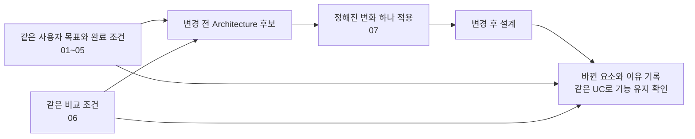

# 7. Intentional Variables — 대응해야 할 변화

> 상태: **검토 완료 · 전체 변경 집합 확정**  
> 기준: 현재 Architecture의 01~05. 상세 provenance는 Git history로 보존한다.
> 함께 읽기: [06 공통 설계·비교 조건](./06-fixed-assumptions.md)

## 7.1 목적

**07은 ‘지금 무엇을 모르는가’의 목록이 아니라, 무엇이 바뀌었을 때 VIA가 기존 기능을 유지하며 대응해야 하는가를 정하는 문서이다.**

모델 이름이나 Agent 제공자가 바뀌었다고 사용자에게 대화를 처음부터 다시 설명하게 하거나 VIA 전체를 다시 만들어서는 안 된다. 다만 변경 없이 모든 미래 기술을 지원한다고 약속하지도 않는다. **정해진 변화에 필요한 설계 변경과 기존 기능 유지 여부를 비교한다.**

06과의 관계는 다음과 같다.

이 흐름을 **각 Architecture 후보와 아래 전체 변경 집합**에 동일하게 적용한다. 현재 결정하는 것은 변화의 범위이며, 특정 adapter나 중앙 gateway를 채택하는 것은 아니다.

---

## 7.2 먼저 구분할 세 가지 변화

| 종류 | 예 | 처리 방법 |
| --- | --- | --- |
| 환경·입력 변화 | 네트워크 지연 증가, 포인터 이동, Task 4개, 권한 거부, Agent 단절 | 06·11에서 같은 상황을 재생. 일반적으로 코드 변경을 세는 대상이 아님 |
| 외부 또는 제품 계약의 변화 | 모델 API 교체, Agent protocol 변경, 새 파일 형식, 기억 데이터 형식 변경 | **07의 변경 시나리오**로 설계 영향과 회귀 결과를 기록 |
| 내부 Architecture 선택 | Core 직접 처리 vs Agent 위임, 중앙/분산 상태, 직렬/병렬 processing | 12의 후보 비교. 변화 요구인 것처럼 정답 구조로 먼저 강제하지 않음 |

또한 User Memory와 재시작 복구는 이미 05에서 확정한 필수 기능이다. “나중에 추가할 기능”으로 분류하지 않는다. 그 기능의 저장 구조·연동 계약이 변할 때 대응하는 것은 별개이다.

---

## 7.3 변화 대상으로 채택한 것과 제외한 것

가능한 변화 축을 펼쳐본 뒤 다음 범위로 정리했다.

| 변화 후보 | 이번 처리 | 이유 |
| --- | --- | --- |
| S2S/의미 판단 모델 제공자·버전 교체 | 채택: M-01·02 | 01·03의 Model integration 범위 |
| 모델 크기·입력 한도·실행 프로필 변화 | 채택: M-03 | 맡길 판단과 입력 방식이 영향을 받을 수 있음 |
| Public/Private/PC 사이 모델 배치 이동 | 채택: M-04~06 | 본체는 PC여도 Model 실행 위치는 변화 가능 |
| 전사·streaming·모델 호출 계약 변화 | 채택: M-07·08 | Voice Runtime과 Core 연결에 직접 영향 |
| 모델의 대화 이력 전달 계약 변화 | 채택: M-09 | VIA 대화 기록과 모델 제공자의 대화 ID 분리 |
| Agent 추가·교체·다른 protocol | 채택: A-01~03 | Agent-neutral 제품 범위 |
| Agent 상태·실행 식별·capability·인증 계약 변화 | 채택: A-04~07 | 비동기 업무와 후속 지시의 연속성 |
| Agent 질문·승인·결과물 계약 변화 | 채택: A-08·09 | 질문 응답과 결과 참조의 연속성 |
| 기존 Context 종류 안의 제공자·자료 형식 변화 | 채택: C-01·02 | file/mail/calendar/browser 등의 연동 변화 |
| 같은 PC 환경의 화면 연동 API 변화 | 채택: C-03 | 화면·선택·포인터 UC 유지 |
| User Memory의 기록 형식 진화 | 채택: C-04 | 이미 저장한 기억과 삭제 결과를 유지해야 함 |
| 기존 정보원을 유지한 추가 연결 | 채택: C-05 | 같은 Context 종류 안의 복수 제공자 공존 |
| 대화·업무 저장 기록의 형식 변경 | 채택: C-06 | 기존 Conversation/Task 관계와 재시작 복구 유지 |
| 새 모델 가중치 학습·정확도 자체 개선 | 변경량 평가에서 제외 | 모델 내부 연구/학습은 VIA 설계 범위 밖 |
| Downstream Agent 내부 Tool/Skill 추가 | **VIA 계약에 안 드러나면 제외** | Agent 내부 구현. capability/연동 계약이 바뀌면 A 계열로 다룸 |
| CPU/GPU SKU만 변경·망 지연만 증가 | 06의 조건 비교 | 실제 결합 계약이 달라지면 해당 M 계열에 연결하되 하드웨어 성능 차이를 코드 변경으로 세지 않음 |
| 모델명·URL·키·timeout 숫자만 변경 | 설정 변경으로 기록 | 설계 변경이 없으면 0개도 정상. 새 protocol/권한 획득 방식이면 해당 변경에 포함 |
| 카메라·시선 입력, 다사용자·다기기, 무인 예약 실행 | 현재 제외 | 05의 미포함 범위를 몰래 필수 기능으로 확대하지 않음 |
| PC에서 Mobile/TV/Robot으로 VIA 본체 이식 | 현재 제외 | 지금 승인한 PC 제품 범위를 넘음 |
| S2S 완전 제거, VIA가 범용 업무 Agent가 됨 | 현재 제외 | 01·03의 고정 책임과 충돌 |
| 모든 시스템을 무중단으로 실시간 교체 | 현재 요구하지 않음 | 교체 가능성과 무중단/진행 중 실행 상태 이전은 서로 다른 요구 |

이 목록은 미래 기술 전망의 사실 주장이나 발생 확률 순위가 아니다. 01~05에서 필요한 기능과 이미 합의한 변화 대응 범위를 기준으로 선택한 **확정한 변경 집합**이다.

---

## 7.4 Closed Change Catalog — 전체 평가 집합

**모델 9개, Agent 9개, Context/저장 정보 6개, 총 24개를 전체 평가 집합으로 확정한다.** 24개를 모두 적용한다. 특정 후보에 유리한 2~3개만 선택하거나 결과를 본 뒤 항목을 빼지 않는다.

아래의 변경 전/후는 **시험용 계약**이며 현재 연결된 실제 서비스의 지원 기능을 주장하는 것이 아니다. A/B라는 제공자 표기는 특정 제품명이 아니다. 10·11에서 실제 요소 ID와 입력 파일을 붙여도 여기 정의한 변화 축과 완료 조건을 바꾸지 않는다.

### A. VIA가 사용하는 모델의 변화 — M-01~09

모든 변경 전후에 **S2S 1개·semantic LLM 1개**를 유지한다. 모델 교체·배치 이동은 추가 적재가 아니며 Component별·Task별 모델 복제를 허용하지 않는다. 역할별 프롬프트·세션은 공유 모델을 사용한다. 추가 보조 모델이 필요해지면 변경 성공이 아니라 현재 제약에서의 기능 미충족으로 기록한다.

모든 항목에서 S2S 사용, 사용자 응답 창구, 대화/Task 연속성과 기존 기능 요구는 유지한다. 다른 모델로 바꾸면서 요구사항을 낮춘 것을 성공적인 교체로 세지 않는다.

| ID | 변경 전 → 변경 후 | 동일하게 두는 조건 | 완료 확인 / 주요 UC |
| --- | --- | --- | --- |
| **M-01 S2S 제공자 교체** | 같은 실행 위치에서 S2S 제공자 A → B. 접속·메시지 포장은 달라도 필요한 음성·이벤트 기능은 동등 | 사용자 입력, 필요한 이벤트의 의미/정보량, PC 연동, 의미 판단 책임 | 음성 입출력·직접 응답·전사/응답 기록·중단·재연결 유지. UC-01, 03~04, 11, 15 |
| **M-02 의미 판단 모델 교체** | 같은 위치와 담당 책임에서 Semantic Model A → B. 호출 API·응답 포장 차이 포함 | 기능 수준, Context 원천, Agent, 요청·Task 의미 | Core가 맡은 요청 정리·지칭·Task 연결·응답 유지. UC-02~10, 14 |
| **M-03 모델 실행 프로필 변경** | 맡은 책임은 같지만 모델 크기·입력 한도·생성 설정 등이 다른 적합한 모델/프로필로 변경 | 실행 위치, 제공 API 종류, 사용자 요구와 역할 적합성 확인 방법 | 입력이 잘리거나 출력 계약이 깨져 기존 기능이 사라지지 않음. UC-01~10. 모델 내부 정확도 개선 자체는 변경 점수 아님 |
| **M-04 외부 Cloud → Private Cloud** | 같은 Model 기능·호출 계약을 별도 관리망의 endpoint에서 제공 | 모델 역할과 데이터 의미, 사용자 PC, Agent | 주소/인증/연결 설정 또는 배치 결합의 변경을 드러내고 기존 기능 유지. UC-01~10, 15~16 |
| **M-05 Remote → 사용자 PC** | 같은 역할의 적합한 Model Runtime을 원격 호출에서 PC 실행으로 이동 | 필요한 모델 기능·논리 계약, 사용자 UC, 정책 요구 | 필요한 설치·시작/종료·가용성·호출 결합을 설계하고 기능 유지. 로컬 메모리 적합성은 별도 근거 필요. UC-01~10, 15, 18 |
| **M-06 사용자 PC → Remote** | PC의 Model Runtime을 동등한 역할의 원격 endpoint로 이동 | 사용자 UC·기능 수준·Agent 업무 | 연결·인증·단절 대응·허용된 Context 전달을 반영하고 기능 유지. UC-01~10, 15~16, 18 |
| **M-07 S2S 이벤트 정보 변경** | 단어별 시각 전사 → 구간별 시각·수정 이벤트 계약. 변경 전후 원음 접근, 시각의 기준, 정정 이벤트를 명시 | 같은 음성 원본과 화면 원천 이벤트, 지칭·정정 UC. 새 계약에서도 원음과 구간 시각 등 보조 처리에 필요한 원천 정보 접근을 허용 | 단어별 시각을 그대로 가정하지 않고 정보 확보·연계를 조정. 필요한 보조 기능도 변경에 포함. UC-03~04, 11, 15 |
| **M-08 의미 판단 응답 방식 변경** | 최종 structured response 1회 → delta·최종완료·오류/취소 이벤트를 제공하는 streaming 계약 | 최종 요청/판단 의미, 모델 역할, 기능 수준 | 부분 결과를 확정 결과로 쓰지 않고 완료·취소·오류를 올바르게 연결. UC-06, 09~13 |
| **M-09 모델 대화 이력 전달 계약 변경** | 매 호출에 필요한 이력을 전달 → 제공자의 대화 ID와 후속 입력으로 호출 | 같은 모델 역할·배치·입력/응답 의미, VIA가 소유하는 Conversation 기록. 새 계약은 대화 생성·이력 재전달 수단 제공 | VIA Conversation과 제공자 대화 ID를 연결하고 재연결·이력 재구성·종료 처리. S2S와 Core의 후속 맥락 유지. UC-01, 07, 15, 18 |

**중복 방지:** M-01은 정보 의미가 동등한 S2S 교체, M-07은 제공되는 정보 계약 자체의 변화이다. M-02는 같은 책임의 제공자 교체, M-08은 결과 수신 lifecycle의 변화이다. M-04는 원격 환경 간 이동, M-05·06은 PC와 원격 사이 이동으로 구분한다.

M-07은 보조 처리를 통해 필요한 정보를 얻을 수 있는 계약 변경을 시험한다. 원천 정보와 대체 획득 경로를 모두 제거한 조건은 별도 기능 적합성 문제로 표시하며, 그 불가능성을 특정 Architecture의 낮은 변경 대응성으로 채점하지 않는다. 시험기가 누락 정보를 무료로 보충하지도 않는다. M-09는 응답 스트리밍(M-08)이 아니라 대화 이력을 유지·전달하는 계약의 변화이다. 제공자 대화 ID가 VIA의 기준 기록을 대체하지 않으며, 모든 모델 역할의 이력 방식 변경을 한 번에 강제하지 않는다.

M-03의 작은 모델이 요구 기능을 수행할 수 없으면 그 모델은 적합한 교체 조건이 아니다. 임의 정확도 가정으로 교체 성공을 만들지 않는다. M-05에서도 목표 PC에서 실행 가능한 구성을 입증하지 않고 on-device 성능을 주장하지 않는다.

### B. Downstream Agent 생태계의 변화 — A-01~09

대상은 VIA가 연결하는 Agent의 **외부 계약**이다. 범용 Agent가 포함되더라도 다른 Agent와 같은 Downstream Agent로 연결하며, VIA의 최상위 책임을 넘겨주지 않는다.

| ID | 변경 전 → 변경 후 | 동일하게 두는 조건 | 완료 확인 / 주요 UC |
| --- | --- | --- | --- |
| **A-01 Agent 추가** | 기존 protocol을 쓰는 새로운 업무 capability의 Agent 추가 | 기존 Agent와 사용자 기능, protocol 종류, Model | 새 업무 선택·위임·상태·결과 연결, 기존 Agent 회귀. UC-08~10, 13~14 |
| **A-02 동일 업무 Agent 교체** | Agent A → 같은 사용자 목표를 수행하는 Agent B. 제공자 고유 필드/endpoint 차이 포함 | 업무 결과 요구, 상위 protocol 종류, 사용자 Task 의미 | 기존 대화·Task ID를 특정 Agent ID로 바꾸지 않고 새 업무/후속 연결 유지. UC-07~10, 13~15 |
| **A-03 다른 Agent protocol 지원** | 기존 protocol 유지 + 다른 접속·메시지 계약의 Agent 연결 | 비교할 업무 능력과 lifecycle 기능, VIA 사용자 기능 | protocol 차이가 어디까지 변경되는지 확인. 복수 protocol이 공존. UC-08, 10, 12~16 |
| **A-04 상태 전달 방식 변경** | push progress/result → 실행 ID로 조회하는 status/result 제공 | 확인 가능한 상태·결과·권한, 업무 내용 | 같은 Task에 상태 연결, 확인 시점 표시, 완료 누락 방지. 없는 상세 진행률을 만들어내지 않음. UC-10, 13~14, 18 |
| **A-05 실행 식별·후속 요청 계약 변경** | 실행 handle 하나 → conversation/thread ID와 run ID가 분리되고 완료 후 follow-up은 새 run 필요 | 사용자 목표·Task identity, 업무 기능, protocol 계열 | 같은 Agent 복수 실행과 기존 Task 후속 요청 연결, 중복 실행 방지. UC-10, 12, 14~15, 18 |
| **A-06 capability 계약 재구성** | 기존 문서 처리 capability → 문서 요약/문서 작성 capability 분리. 요청 필드·필수 조건·버전·지원 lifecycle 명시 방식 변경 포함 | 기존에 가능했던 사용자 업무와 Agent 기능 수준은 유지. 상위 protocol 및 인증은 동일 | 같은 요청을 올바른 새 capability와 입력으로 연결. 구형/신형 선언 공존과 기존 기능 회귀. UC-08~10, 12, 14, 18 |
| **A-07 Agent 인증 계약 변경** | 고정 자격증명 → 사용자별 범위가 있는 만료·갱신 가능한 인증 계약 | 허용되는 업무·Context 범위, 사용자, 업무 기능 | 갱신·만료·거부가 업무·동의와 올바르게 연결. 토큰 값만 교체하는 경우와 구분. UC-08, 15~16, 18 |
| **A-08 질문·승인 응답 계약 변경** | 실행 ID와 대기 중 질문에 답변 전달 → 질문별 ID 및 답변 제출·재개를 분리한 계약 | 양쪽 모두 질문·승인 기능 지원, 동일 질문 내용·Task·실행 의미. 기본 시험의 동시 대기 질문 범위 유지 | 사용자 답을 정확한 질문에 연결하고 제출 확인·실행 재개를 구분. 완료된 질문에 답을 재전송하지 않음. UC-06, 13~16, 18 |
| **A-09 결과물 전달 계약 변경** | 완료 메시지에 설명·파일 링크 포함 → 설명·파일·근거를 구분한 결과 목록과 조회용 참조 제공 | 실제 결과물·권한·업무 완료 의미 유지. 본 시험에서는 참조 유효기간 등 추가 인증 변화는 포함하지 않음 | 결과 목록·조회·Voice/Text 응답·후속 참조를 연결. 결과 도착과 상세 자료 획득을 혼동하지 않음. UC-07~10, 13~15 |

**중복 방지:** A-01은 같은 protocol에서 capability 추가, A-02는 동일 업무 구현체 교체, A-03은 protocol 추가이다. A-04·05는 각기 상태 전달과 실행 식별의 의미 변화이다. A-07은 키 문자열을 바꾸는 것이 아니라 인증 흐름이 바뀌는 경우이다.

A-06은 기존 업무의 capability/입력 계약을 재구성하는 것이므로 새 업무 추가(A-01)와 구분한다. A-08은 사용자 답변을 Agent에 돌려주는 질문 계약이며 상태 수신(A-04)이나 실행 ID 구조(A-05) 변경과 구분한다. A-09는 결과가 도착하는 push/pull 방식이 아니라 결과물의 표현·조회 계약을 바꾼다.

Task identity 유지가 이전 Agent의 내부 실행을 새 Agent로 자동 복사한다는 의미는 아니다. 진행 중 업무를 완료한 뒤 전환하거나 기존 Agent 연결을 해당 업무 종료까지 유지하는 방안도 허용한다. 채택한 전환 방식과 남아 있는 의존성은 반드시 기록한다.

### C. Context 연동과 저장 정보의 변화 — C-01~06

여기서는 02의 Context 종류와 05의 사용자 목표를 유지한다. 카메라·시선 등 새로운 입력 UC를 추가하지 않는다.

| ID | 변경 전 → 변경 후 | 동일하게 두는 조건 | 완료 확인 / 주요 UC |
| --- | --- | --- | --- |
| **C-01 정보 Source 제공자 교체** | Calendar 제공자 A → 같은 일정 정보를 제공하는 B. native identity/field/API 차이 포함 | 사용자 일정 내용·접근 범위, Context 종류, 사용자 목표 | 일시·참석자·대상 식별과 권한을 유지하며 조회·지칭 결과 연결. UC-02, 05~06, 09, 16 |
| **C-02 문서 형식 추가** | 기존 문서 읽기 유지 + DOCX 문서의 본문·표를 읽는 형식 지원 추가 | read-only 책임, 기존 문서 지원, 사용자 요청 의미 | 새 형식의 문서 식별·내용·대상 정보를 처리하고 기존 형식 회귀. UC-02~05, 07. 전체 편집기 구현은 범위 밖 |
| **C-03 화면 연동 계약 변경** | 같은 target Mac의 앱/화면 제공 API가 object handle·좌표/선택 표현을 변경 | 사용자의 실제 화면·포인터·선택 동작, 필요한 지칭 결과 | 문서·화면·위치 식별을 맞추어 Select then Speak와 Speak while Pointing 유지. UC-03~05, 11. 단순 scroll 이벤트는 이 변경이 아님 |
| **C-04 기억 기록 형식 확장** | 저장된 선호 key/value에 기록 version·수정 시점·사용자 등록 근거를 추가 | 기존 기억 내용·허용 범위·확인/수정/삭제 기능 | 기존 기록 읽기/이행과 삭제 상태를 보존하고 새 정보 저장. UC-17~18. 저장 기술 교체를 정답으로 강제하지 않음 |
| **C-05 같은 종류의 정보원 추가** | Calendar 제공자 A만 연결 → A를 유지하며 B도 추가 | 같은 활성 사용자·Context 종류·UC, 각 Source의 제공 능력과 접근 허용. 일정 통합/중복 제거라는 새 사용자 기능은 추가하지 않음 | Source별 identity·권한·대상 참조를 구분하고 새 조회 연결. A의 동작을 유지하며 B 추가. UC-02, 05~06, 09, 16 |
| **C-06 대화·업무 기록 형식 변경** | 저장 기록 V1 → 같은 Conversation/Request/Task/Agent 실행 관계를 다른 구조로 표현하는 V2 | 기존 내용·권한·삭제 결과·진행 업무·필수 복구 기능. 같은 저장 기술 사용, 계획된 정지 후 이행 허용 | 기존 정보 읽기·이행·관계 복원과 중복 실행 방지. 원래 없던 정보를 만들어내지 않으며 실패 시 기존 기록 보존. UC-07, 10, 13~15, 18 |

C-05는 교체(C-01)가 아니라 기존 연동을 유지한 확장이다. C-04는 User Memory의 기록 확장, C-06은 Conversation/업무 연결 기록의 형식 이행이다. C-06은 저장 기술 자체의 교체나 모든 과거 버전의 무중단 이행을 요구하지 않는다.

C-04는 외부 생태계뿐 아니라 **기존 제품 데이터 계약도 진화한다**는 점을 다룬다. User Memory 기능 자체는 신규 추가가 아니다. 이러한 변화가 독립 QA 또는 주요 DP에 해당하는지는 08·12에서 판단한다.

---

## 7.5 전체 변경 집합을 적용하는 방법

### 변경은 누적하지 않고 같은 출발점에서 하나씩 적용

각 Architecture 후보의 변경 전 설계를 한 버전으로 고정한다. M-01을 적용한 설계 위에 M-02를 계속 덧붙이지 않는다. 각 항목은 같은 출발점에서 따로 적용한다. 그래야 먼저 바꾼 후보만 다음 변경을 싸게 할 수 있는 편향을 막는다.

각 변경의 필수 절차는 다음과 같다.

1. 변경 전 계약, 변경 후 계약, 유지할 사용자 기능을 확인한다.
2. 후보의 요소 목록에 영향받는 ID를 표시한다.
3. 수정·추가·제거와 이유, 필요한 데이터 이행·배포 작업을 기록한다.
4. 관련 UC와 전체 공통 회귀 목록에서 기능이 유지되는지 확인한다.
5. 결과를 관측/분석 근거와 함께 저장한다.

직접 구현하지 않은 설계 변경 분석은 **설계 추정**으로 표시한다. 파일별 diff 또는 실행 시험이 없는데 실측 공수나 성공률이라고 부르지 않는다.

### 0, 적용 없음, 처리 불가는 다르다

| 결과 | 의미 | 기록 방법 |
| --- | --- | --- |
| 0개 | 같은 기능을 유지하며 설계 변경 없이 설정 등으로 대응 가능 | 해당 계약과 회귀 확인 근거를 남김. 설정/배포 작업은 별도 기록 |
| 적용 없음 | 예를 들어 별도 의미 모델이 없는 후보의 특정 API 교체 등, 변화 대상 자체가 해당 후보에 없음 | 이유를 기록하고 **0점/0개로 평균에 넣지 않음** |
| 처리 불가 | 그 변화 뒤 필수 기능을 유지할 방안이 제시되지 않음 | 미해결 요구와 필요한 구조 변경 기록. 0개나 성공으로 숨기지 않음 |

Semantic Model Runtime을 S2S와 공유하는 후보라면 단순히 “별도 모델 없음”으로 모든 의미 판단 관련 변경을 건너뛰지 않는다. 실제로 그 역할을 수행하는 모델/계약에 변화가 적용되는지 먼저 확인한다.

**전체 평가란 모든 항목에 답하는 것**이다. 적용 없음은 사전에 이유가 있어야 하며 불리한 항목을 빼는 수단이 아니다. 최종 수치를 평균낼 경우에는 동일하게 적용 가능한 집합과 분모를 공개하고, 후보마다 다른 분모의 평균을 그대로 순위로 비교하지 않는다.

### 한 변화가 여러 후보에 유리하거나 불리할 수 있다

제공자 교체가 쉬운 구조라도 이벤트 계약 변경이나 데이터 이행은 어려울 수 있다. 특정 구조가 항상 유리하다는 방향을 미리 정하지 않는다. 변경량이 같으면 그대로 같은 값으로 기록한다.

모든 종류를 하나의 총점으로 더하지 않는다. M/A/C별 결과를 유지하고 08·09에서 선정한 품질과 연결한다. 동일 변경을 두 ASR에 사용하면 중복 가중 위험을 표시한다. 큰 변화 하나를 여러 항목으로 나누어 특정 QA를 과대표현하지 않는다.

---

## 7.6 변경 완료의 공통 조건

“Model API가 호출된다” 또는 “Agent endpoint에 연결된다”만으로 완료로 보지 않는다.

| 확인 영역 | 유지해야 하는 것 |
| --- | --- |
| 사용자 입력과 응답 | Voice/Text 입력, S2S 직접 응답, VIA 응답 창구, 핵심 Voice와 상세 Text |
| 맥락과 지칭 | 기존 자료·선택·화면·대화의 의미, 후속 지칭 대상 |
| 요청과 업무 | 복합 요청 관계, Task identity, 진행/결과·후속 지시·취소 연결 |
| 상태와 기억 | Conversation/Task/User Memory의 필요 정보, 기존 데이터 이행, 명시적 삭제의 효과 |
| 권한과 문제 처리 | 허용된 Context 접근/제공, 사용자 승인 연결, 확인 불가를 정상 완료로 보이지 않기 |
| 평가 증거 | 변경 요소 ID와 이유, 관련 UC 회귀 결과, 실측/모의시험/설계 추정의 구분 |

이는 UC의 유지 요구이며, Model 문장 하나하나를 변경 전과 똑같이 출력하라는 뜻은 아니다.

교체는 **계획된 변경**으로 평가한다. 진행 중 Agent 업무는 완료·유지·이관 중 선택한 처리 계획과 사용자 영향을 명시한다. 새 버전 도입과 동시에 모든 실행이 무중단 이동한다고 가정하지 않는다. VIA의 평상시 재시작 복구는 별도로 UC-18을 계속 만족해야 한다.

---

## 7.7 내부 Architecture 선택은 별도로 유지

다음은 비교할 구조 자체이며 이번 변경 집합에서 정답으로 먼저 선택하지 않는다.

| 설계 질문 | 유지하는 선택권 | 06/07에서 금지하는 선결정 |
| --- | --- | --- |
| 범위가 정해진 정보 요청 처리 | Core 처리, 별도 상태 추적 처리, Agent 위임을 필요에 따라 비교 | “VIA가 할 수 있음”을 “항상 Core 처리”로 바꾸지 않음 |
| S2S와 의미 판단 | 역할 재사용, 별도 모델, 규칙과 모델 조합 | 모든 후보가 동일 개수의 LLM을 사용하도록 강제하지 않음 |
| Context와 상태 | 수집·보관·조회·연결의 책임과 경계 비교 | 중앙 timeline·단일 DB·전역 task index를 시험기가 대신 제공하지 않음 |
| 처리 순서 | 직렬·병렬·스트리밍·반복 | 04의 논리 활동을 하나의 고정 pipeline으로 취급하지 않음 |
| 연동 방법 | native 연동, 공통 계약, adapter·확장 등 비교 | “adapter 하나만 바꾸면 됨”을 변경 시나리오의 정답으로 넣지 않음 |

이 표가 새로운 DP 추가를 요구하는 것은 아니다. 기존 설계 질문을 정리하고 최종 주요 DP 선정에 필요한 근거를 준비하는 것이다.

---

## 7.8 01~05와의 연결 및 리뷰 결론

| 변화 묶음 | 근거 문서 | 유지할 UC |
| --- | --- | --- |
| M-01~09 | 01 §1.3, 03 §3.3·3.9, 04 §4.3·4.16 | 직접 응답·지칭·정정·채널 전환 및 기존 전체 기능 |
| A-01~09 | 01 시스템 경계, 02 실행 식별, 03 Agent-neutral, 04 업무 제어 | UC-07~16, 18 |
| C-01~03 | 02 Context/Referent, 03 Context 책임 | UC-02~07, 11, 16 |
| C-04 | 02 Memory, 05 §5.10의 필수 Memory/Recovery | UC-17~18 |
| C-05 | 02 Personal Information Context, 03 Context 연동 범위 | UC-02, 05~06, 09, 16 |
| C-06 | 02 Conversation/Task/실행 구분, 05·06 재시작 복구 | UC-07, 10, 13~15, 18 |
| 변화 시나리오와 사용자 UC 분리 | 05 §5.7·5.10 | UC 목록을 특정 후보를 위해 변경하지 않음 |

**이번 검토에서 확정한 것은 24개 변화의 범위, 전/후 조건, 유지할 기능과 전체 적용 규칙이다.** 실제 API 제공자 선정, 변경 요소별 ID, Test Case 파일과 최종 채점표가 이미 완성되었다는 뜻은 아니다. 그것들은 같은 변화 정의에 근거해 08~12에서 작성한다.

06·07 확정 후의 순서는 다음과 같다.

| 다음 단계 | 입력과 산출물 |
| --- | --- |
| 08 QC·QA 정리와 ASR 판정 | 01~05의 중요 기능과 06/07 조건을 바탕으로 품질 coverage와 Architecture 영향 판정. ASR을 미리 정답으로 고정하지 않음 |
| 09 추적표 | QC를 실제 UC·24개 변화에 연결하고 현재 QA coverage를 추적 |
| 10 요소 정의 | 후보 전체에 공통인 셈의 단위와 실제 후보별 요소 목록 확정 |
| 11 시험 자료 | 06의 입력·환경 및 07의 계약 변화에 구체 자료/정답을 붙임 |
| 12 DP 비교 | 같은 기능·조건·변화 집합으로 후보를 비교하고 근거를 남김 |

**필수 기능은 유지하고, 변화는 같은 방식으로 주고, 내부 구조는 비교로 선택한다.** 이것이 06·07을 함께 닫을 때의 기준이다.

## 7.9 최종 보완 기록

기존 19개 항목의 ID는 유지하고 M-09, A-08·09, C-05·06을 추가했다. M-07은 원천 정보 제공 조건을, A-06은 기존 capability의 분리·입력 계약 변화를 명확하게 했다. 사용자 UC나 새로운 DP를 추가한 것은 아니다. 모든 후보에 같은 24개를 적용하며 M/A/C별 결과를 분리한다.

다음 문서: [08 Quality Model, QA Catalog, and ASR Selection](./08-quality-attributes/quality-model.md).
