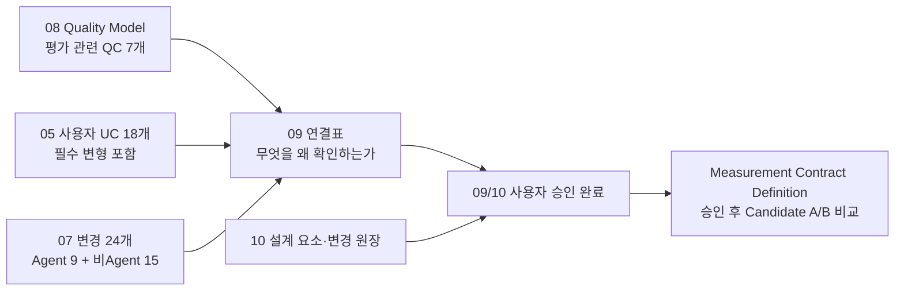

# 9. QC ↔ UC / Evolution Scenario Mapping — 품질과 평가 근거의 연결

> 상태: **사용자 승인 완료 · 현재 Measurement 문서에 연결됨**
> 기준: 현재 Architecture baseline. 상세 provenance는 Git history로 보존한다.
> 입력: [05 대표 UC](./05-representative-use-cases.md), [06 공통 조건](./06-fixed-assumptions.md), [07 변경 집합](./07-intentional-variables.md), [08 Quality Model](./08-quality-attributes/quality-model.md)
> 함께 검토: [10 설계 요소와 변경량 집계](./10-element-definition.md)

## 9.1 목적과 이번 작업의 경계

**09는 현재 평가에 연결된 7개 QC가 어떤 사용자 상황과 변경에서 드러나는지 추적한다.** QC-06·QC-07·QC-10은 현재 독립 QA가 없으므로 이 연결표의 대표 평가 대상에서 제외한다. 이 문서는 ASR을 선정하지 않는다.

| 지금 정리하는 것 | 이번에 진행하지 않는 것 |
| --- | --- |
| QC ↔ UC 18개 및 필수 변형 ↔ 변경 24개의 연결 | 새로운 QA/QC/UC/변경 시나리오 추가 |
| 주 검증 목적, 함께 유지할 품질, 필요한 증거 | 실제 녹음·화면·정답 제작, 반복 횟수·배합·목표·0~5점 구간 동결 |
| QC 사이의 겹침을 구분하는 판정 관점 | Architecture 후보 설계·우열·주요 DP 선정 |

**아래 7개 QC는 현재 QA catalog의 상위 coverage 분류다.** 표의 연결 수는 중요도 점수나 평가 가중치가 아니다. 이 문서만으로 특정 DP가 해당 QA를 개선하거나 해당 QA가 ASR이라고 주장하지 않는다.

## 9.2 평가에 연결된 7개 QC

| QC | 상위 품질 관심사 | 구체화된 현재 QA | 09에서 연결할 주 대상 |
| --- | --- | --- | --- |
| **QC-01** | **User-Experienced Responsiveness** | QA-01~QA-04 | 입력 처리·직접 응답·위임 전후·Agent 결과 전달과 동시 업무 간섭 |
| **QC-02** | **Task Completion Effectiveness** | QA-05 | VIA가 요청·대상·제약·업무·Agent를 맞게 연결하고 요구된 결과를 전달했는가 |
| **QC-03** | **Interaction & Task Continuity** | QA-06 | 대화·채널·직접/위임 경로·업무 전환 후 기존 맥락과 identity가 이어지는가 |
| **QC-04** | **Agent Ecosystem Interoperability & Substitutability** | QA-07 | **A-01~09 전체 9개** |
| **QC-05** | **Evolvability & Maintainability** | QA-08 | **M-01~09 + C-01~06 전체 15개** |
| **QC-08** | **Reliability & Recoverability** | QA-09·QA-10 | 비동기 이벤트·취소·부분 실패·재시작과 dependency fault 처리 |
| **QC-09** | **Privacy, Security & Action Safety** | QA-11·QA-12 | 보호 정보 노출과 접근·Action 승인 경계 |

QC-02에서 구체화된 QA-05가 Task Completion이라고 해서 Agent의 보고서 작성 능력·웹 조사 품질을 VIA 점수로 세지 않는다. **06의 시험용 Agent가 제공한 업무 결과를 이용해 VIA가 맡은 처리와 연결을 검증한다.** 실제 VIA 모델의 판단 품질은 별도로 관측하며, 정답을 되돌려주는 모의 모델로 그 정확도를 실측했다고 주장하지 않는다.

QC-02·QC-03은 한 TC를 단순 PASS/FAIL 하나로만 압축하지 않는다. TC별로 사전 등록한 atomic obligation의 충족/보존 정도를 측정하고, strict TC PASS는 모든 해당 obligation이 충족되었는지를 보여주는 secondary evidence로 보존한다.

## 9.3 연결표를 읽는 규칙

- **주 검증:** 그 상황에서 집중적으로 관찰할 품질. 이후 Test Case의 평가 목적이 된다.
- **함께 확인:** 같은 입력으로 관찰할 수 있는 다른 품질이나 반드시 유지할 기능. 자동으로 해당 QA 분모에 한 건을 추가하지 않는다.
- **변경 후 회귀:** 변경 뒤에도 원래 UC가 동작하는지 확인한다. 변경 요소 수와 기능 유지 결과를 서로 다른 기록으로 남긴다.

한 UC는 여러 QC의 근거가 될 수 있다. 예를 들어 기존 업무 취소는 대상 판단, 취소 이벤트 처리, 승인 안전성을 모두 포함할 수 있다. **11에서는 같은 UC라도 무엇을 검증하려는 시험인지 명시한다.** 같은 결과를 복사해 독립 시험 여러 건으로 부풀리지 않는다.

전체 UC의 필수 변형은 모두 시험 목록에 연결한다. 모든 변형을 모든 QA의 대표값에 넣거나 가능한 조합을 무한히 시험한다는 뜻은 아니다. 주 채점 집합·통합 집합·회귀 집합과 표본 비중은 11에서 모든 후보에 공통으로 동결한다.

## 9.4 UC 18개 전체 연결표

표의 변형 범위는 05에서 승인한 하위 UC ID이다. **94개 명시 변형을 빠뜨리지 않는 확인 목록**이며, Test Case가 94개로 끝난다는 뜻은 아니다. 05에 적힌 모니터·시점·scroll·모호성 등의 공통 경계 조건도 상속한다.

| UC / 필수 변형 | 사용자 목표 | 주 검증 QC와 관찰할 것 | 함께 확인할 것 |
| --- | --- | --- | --- |
| **UC-01 / .1~.4** | 일반 지식 질문과 연속 대화 | **QC-02:** 해당 질문의 답과 기록. **QC-03:** 후속 질문·새 주제 구분 | QC-01 응답 시점; S2S/Core 중복 응답 금지 |
| **UC-02 / .1~.6** | 정해진 정보 조회·설명 | **QC-02:** 지정 자료·조건·근거에 맞는 답 | QC-01 지연; QC-09 개인자료 접근·외부 전달 |
| **UC-03 / .1~.6** | 먼저 지정하고 말하기 | **QC-02:** 미리 지정한 대상·집합·범위·역할 연결 | QC-01 지연; 지칭과 실제 Agent 업무 성공을 구분 |
| **UC-04 / .1~.7** | 말하면서 지정하기 | **QC-02:** 지시 당시 대상, 복수 지칭, 정정 반영 | QC-01 지연; QC-08 정정 뒤 오래된 결과 적용 방지 |
| **UC-05 / .1~.4** | 보이지 않는 자료·과거 대상 지칭 | **QC-02:** 올바른 자료. **QC-03:** 이전 대화·업무 대상 재참조 | QC-01 조회 지연; QC-09 접근 범위 |
| **UC-06 / .1~.5** | 불완전한 요청 보완·확인 | **QC-02:** 필요한 확인 후 원래 목표 처리. **QC-03:** 질문과 짧은 답의 맥락 유지 | QC-09 승인으로 오인 금지; 사용자 답 대기는 VIA 처리시간과 분리 |
| **UC-07 / .1~.5** | 직접 응답에서 업무로 전환 | **QC-03:** 앞 응답·대상을 새 업무에 유지. **QC-02:** 올바른 요청 위임 | QC-01 위임 전후; QC-09 전달할 Context |
| **UC-08 / .1~.5** | 새 업무를 Agent에 위임 | **QC-02:** 목표·제약·capability·결과 연결 | QC-01 VIA 구간; QC-08 접수/완료 구분; QC-09 허용 범위 |
| **UC-09 / .1~.5** | 복합 요청 | **QC-02:** 누락 없는 요청과 독립·순차·의존·조건 관계 | QC-03 기존 업무 혼합; QC-08 부분 실패; QC-09 변경 업무 승인 |
| **UC-10 / .1~.5** | 기존 업무 조회·추가·수정 | **QC-03:** 동일 목표·결과물의 연결. **QC-02:** 현재 지시의 의미 | QC-08 근거 있는 상태·실행 연결; QC-01 응답 지연 |
| **UC-11 / .1~.5** | 음성 중단과 정정 | **QC-02:** 정정된 요청 해석 | QC-03 이전 맥락; QC-08 중단한 음성 재출력·업무 자동 취소 방지; audio-stop latency는 secondary/regression observation이며 QA-01~QA-03 대표값에서 제외 |
| **UC-12 / .1~.5** | 특정 업무 취소 | **QC-08:** 취소 접수·종료·이미 완료·미확인 구분 | QC-02 의도한 대상; QC-03 Task 유지; QC-01 VIA의 제어 전달 구간 |
| **UC-13 / .1~.6** | 비동기 진행·결과·알림 | **QC-08:** 이벤트의 업무 연결과 확인된 상태. **QC-03:** 대화가 바뀌어도 결과 연결 | QC-01 결과 전달; QC-02 결과 의미·Voice/Text 일치; QC-09 질문/승인 |
| **UC-14 / .1~.5** | 여러 업무 번갈아 관리 | **QC-03:** 업무 전환 후 맥락. **QC-08:** 교차 이벤트·대기·독립 업무 처리 | QC-02 복합 지시 대상; QC-01 간섭; QC-09 여러 대기 승인 |
| **UC-15 / .1~.5** | Voice/Text 전환·재연결 | **QC-03:** 채널과 대화·Task 수명 분리 | QC-01 재연결 후 응답; QC-08 중복 실행 방지 |
| **UC-16 / .1~.5** | 정보 동의·Action 승인 | **QC-09:** 허용·거부·축소 및 정확한 승인 대상 | QC-02 승인 문맥 이해; QC-03 대기 질문 유지; QC-08 상태 연결 |
| **UC-17 / .1~.5** | 개인화 정보 사용·확인·변경·삭제 | **QC-02:** 현재 기억 관리 요청 완료. **QC-09:** 허용된 저장·사용·삭제 | QC-08 재시작 후 삭제 효과; Conversation 자체와 장기 기억은 구분 |
| **UC-18 / .1~.6** | 접근·연결·실행 문제 대응 | **QC-08:** 복구 가능한 업무의 실제 재연결, 미확인 상태의 정직한 처리 | QC-09 권한/중복 Action; QC-03 복원 후 맥락; 실패 안내를 업무 성공으로 세지 않음 |

QC-04·QC-05가 이 표의 주 검증에 없는 것은 누락이 아니다. **두 변경 대응 QC의 주 시험 단위는 변경 시나리오이며, UC는 변경 후 기능 유지 조건**이다.

## 9.5 겹치기 쉬운 QC의 검증 관점

### QC-02 / QC-03 / QC-08

| 같은 사용자 요청: “아까 발표자료에 결론을 추가해줘” | 집중하는 질문 | 구분할 증거 |
| --- | --- | --- |
| **QC-02** | 현재 요청의 대상·추가 내용·제약을 맞게 해석했는가? | 요청 의미와 의도한 Task/Agent의 정답 |
| **QC-03** | 채널·대화·실행 전환 뒤에도 앞 업무의 맥락과 identity가 남았는가? | 전환 전후의 대화·결과물·Task 관계 |
| **QC-08** | 올바르게 식별된 업무의 이벤트·실패·재시작을 처리했는가? | Agent 이벤트, 저장 기록, 상태 전이 및 재연결 사실 |

이는 실제 제품을 세 조각으로 분리하라는 뜻이 아니다. 통합 시험에서는 한 상태 손실이 여러 품질을 함께 깨뜨릴 수 있다. **실패를 억지로 하나의 QC에만 남기거나 나머지 실패를 지우지 않는다.** 대신 관찰 목적과 공동 원인을 기록하여 독립적인 세 번의 증거인 것처럼 과장하지 않는다.

기능 분리 진단에서 고정 입력을 제공했다면 그 입력과 목적을 명시한다. 시험기가 정답 Task ID나 사라진 history를 제공한 진단 결과를 실제 의미 정확도·복구 성공률로 대체하지 않는다.

### QA-01~QA-03의 시간선

QC-01의 responsiveness concern은 QA-01 delegated result, QA-02 direct response, QA-03 progress feedback으로 분리한다. 세 QA를 서로 평균내지 않으며 각 QA 안에서도 서로 난이도가 다른 전체 TC를 하나의 모집단에 합쳐 p95를 만들지 않는다. 세부 경계와 집계는 [Voice Responsiveness](./08-quality-attributes/voice-responsiveness.md)를 따른다.

위임 시간은 입력 종료부터 인계까지와 Agent 결과 준비 후 사용자 전달 구간을 연결하되, Agent의 open-ended domain research/planning/tool execution과 사용자 확인 대기를 따로 기록한다. 단, bounded Read/Search/Understand 작업을 Architecture 선택으로 Agent에 옮긴 경우에는 단순히 프로세스 위치가 Agent라는 이유로 그 시간을 제외하지 않는다.

Voice interruption의 새 발화 시작→audio stop은 UC-11의 secondary/regression observation으로 raw latency를 보존하지만 QA-01~QA-03 대표 모집단과 점수에는 포함하지 않는다.

VIA가 쓰는 모델·Context 조회는 원격이어도 VIA 의존 구간이다. 같은 설명 작업을 Agent로 옮겨 그 시간을 제외했다고 사용자 전체 대기가 줄었다고 주장하지 않는다. 06 FA-12의 경계와 별도 전체 경로 분석 규칙을 유지한다.

### 성공·보류·안전성

QA-05에서는 올바른 확인 질문을 했다는 사실만으로 원래 업무를 성공 완료로 세지 않는다. 고정 대화에서 필요한 확인을 마치고 완료 조건을 충족했는지와, 확인이 계속 필요한 적절한 보류를 구분한다. 실패·미응답을 분모에서 사후 삭제하지 않는다.

QC-08의 “외부 상태 확인 불가를 정직하게 알림”은 그 실패 조건의 올바른 처리이다. **복구 가능한 조건에서 실제 업무를 재연결해야 한다는 FA-14 요구와 QA-09 recovery 판정을 대신하지 않는다.**

QA-12의 위반은 다른 QA의 높은 점수로 상쇄하지 않는다. 모든 요청을 차단한 구조도 사용자 UC를 충족하지 못하므로 적합한 후보가 아니다. 같은 고정 시나리오의 위반 건수를 비교하며 중복 로그 수를 위반 수로 세지 않는 집계는 11에서 정의한다.

## 9.6 변경 24개 전체 연결표

**변경 전/후와 유지 조건의 원문은 07 §7.4가 기준이다.** 아래 표는 평가 목적을 연결하며 그 계약을 축소하거나 바꾸지 않는다. 관련 회귀 UC는 07의 최소 목록과 05의 필수 변형을 상속한다.

| Change | 주 QC | 변경 영향의 확인 대상 | 변경 후 집중 회귀 QC |
| --- | --- | --- | --- |
| **M-01 S2S 제공자 교체** | **QC-05** | 동등 음성·이벤트 기능의 호출·연결 변경 | QC-01, QC-02, QC-03, QC-08 |
| **M-02 의미 판단 모델 교체** | **QC-05** | 같은 판단 책임의 입력·출력 연결 | QC-01, QC-02, QC-03 |
| **M-03 모델 실행 프로필 변경** | **QC-05** | 역할 적합성을 유지한 크기·입력 한도 대응 | QC-01, QC-02; 모델 자체 정확도와 구조 변경 구분 |
| **M-04 외부 Cloud → Private Cloud** | **QC-05** | 연결·인증·배치 결합 | QC-01, QC-02, QC-03, QC-09 |
| **M-05 Remote → 사용자 PC** | **QC-05** | 설치·실행 수명·호출 결합 | QC-01, QC-02, QC-03, QC-08 |
| **M-06 사용자 PC → Remote** | **QC-05** | 원격 연결·인증·전달·단절 대응 | QC-01, QC-02, QC-03, QC-08, QC-09 |
| **M-07 S2S 이벤트 정보 변경** | **QC-05** | 원음·시각·수정 계약과 보조 정보 확보 | QC-01, QC-02, QC-03, QC-08 |
| **M-08 의미 판단 응답 방식 변경** | **QC-05** | 최종 결과와 부분·취소·오류 이벤트의 구분 | QC-01, QC-02, QC-08 |
| **M-09 모델 대화 이력 전달 계약 변경** | **QC-05** | VIA 기록과 제공자 대화 ID의 연결 | QC-02, QC-03, QC-08 |
| **A-01 Agent 추가** | **QC-04** | 새 capability 선택·위임과 기존 Agent 유지 | QC-02, QC-03, QC-08 |
| **A-02 동일 업무 Agent 교체** | **QC-04** | 같은 목표·Task 의미를 유지한 구현체 교체 | QC-02, QC-03, QC-08 |
| **A-03 다른 Agent protocol 지원** | **QC-04** | 다른 계약과 기존 protocol의 공존 | QC-02, QC-03, QC-08, QC-09 |
| **A-04 상태 전달 방식 변경** | **QC-04** | push와 status/result 조회 연결 | QC-01, QC-03, QC-08 |
| **A-05 실행 식별·후속 요청 계약 변경** | **QC-04** | thread/run 구분과 동일 Task 후속 연결 | QC-03, QC-08 |
| **A-06 capability 계약 재구성** | **QC-04** | capability 분리·필수 입력·버전의 대응 | QC-02, QC-08 |
| **A-07 Agent 인증 계약 변경** | **QC-04** | 사용자 범위·만료·갱신·거부 연결 | QC-03, QC-08, QC-09 |
| **A-08 질문·승인 응답 계약 변경** | **QC-04** | 질문 ID·답변 접수·재개 연결 | QC-02, QC-03, QC-08, QC-09 |
| **A-09 결과물 전달 계약 변경** | **QC-04** | 결과 목록·조회·응답·후속 참조 | QC-01, QC-02, QC-03, QC-08 |
| **C-01 정보 Source 제공자 교체** | **QC-05** | 동일 일정 정보의 ID·필드·접근 계약 | QC-02, QC-03, QC-09 |
| **C-02 문서 형식 추가** | **QC-05** | DOCX 본문·표 읽기와 기존 형식 유지 | QC-02, QC-03 |
| **C-03 화면 연동 계약 변경** | **QC-05** | UI handle·좌표·선택의 표현 변경 | QC-01, QC-02, QC-03 |
| **C-04 기억 기록 형식 확장** | **QC-05** | 기존 기억·등록 근거·수정·삭제의 유지 | QC-02, QC-08, QC-09 |
| **C-05 같은 종류의 정보원 추가** | **QC-05** | 기존 정보원 유지와 새 정보원 ID·권한 구분 | QC-02, QC-03, QC-09 |
| **C-06 대화·업무 기록 형식 변경** | **QC-05** | 기존 관계·삭제·진행 업무·복구의 이행 | QC-03, QC-08, QC-09 |

### 집계 소유권과 중복 방지

- A-01~09의 변경 요소 수는 **QA-07에 한 번** 반영한다. 인증·상태 변경이라는 이유로 QA-08에도 가산하지 않는다.
- M-01~09와 C-01~06은 **QA-08의 15개 집합 전체**이다. M-03·C-02 등을 대표값에서 임의로 제외하지 않는다. M/C별 상세 결과는 원인 설명을 위해 함께 보존한다.
- 한 변경으로 여러 요소가 바뀌어도 10의 동일 ID 집계 규칙을 적용한다. 다른 변경에서 같은 요소를 다시 수정하면 그 별도 변경에도 셀 수 있다. 변경별 독립 시나리오이기 때문이다.
- 적용 없음·처리 불가·미측정은 0이 아니다. 모든 24개 항목에 답하되, 비교 가능한 분모와 전체 집합의 충족 여부를 함께 공개한다. 실패한 변경을 빼서 성공한 변경만의 평균으로 전체 우승을 주장하지 않는다.
- 07은 분야별 원장을 유지하고, QA-07은 Agent 9개, QA-08은 비Agent 15개의 대표 집계를 사용한다. 두 집합을 하나의 평균으로 합치지 않는다.

## 9.7 이후 평가 기록에 반드시 남길 정보

아래는 실제 시험 파일이 아니라 **11에서 사용할 기록 항목의 요구**이다.

| 기록 항목 | 필요한 이유 |
| --- | --- |
| 원래 UC/하위 UC 또는 Change ID | 근거 없는 시험 추가·누락 방지 |
| 관련 QC와 주 검증 QA, 함께 관찰하는 QA | 하나의 실패가 무엇을 깨뜨리는지 구분 |
| 사용한 06 FA 조건과 입력·초기 상태 버전 | 후보 사이 정보·장비·모델·Agent 조건 차이 확인 |
| 기대되는 VIA 동작과 확인할 결과 | 정답 대상·업무 관계·권한·결과를 분리 |
| 실제 관측·시점·적용 경로·실패 원인 | “수행했다”가 아닌 검증 가능한 증거 |
| 모델 실측 / 응답 재생 / 설계 추정 구분 | 모의시험을 실제 의미 정확도나 성능으로 오인하지 않음 |
| 변경 시험의 전후 요소 원장·기능 유지 결과 | 적은 변경으로 기능을 없애는 후보 방지 |

후보가 동일 evidence와 같은 판단 모델을 쓰면 정확도가 같을 수 있다. 이 연결표는 coverage와 검증 위치를 보여줄 뿐 변별력의 증명이 아니다. ASR은 QA별 실제 책임 차이 → 관측 차이와 구조 위험을 검토한 뒤 선정한다.

## 9.8 09/10 승인 결과

| 리뷰 질문 | 승인 결과 |
| --- | --- |
| 평가 관련 QC coverage를 유지했는가? | QC 7개와 UC·변경 연결을 유지. 세부 측정은 QA catalog에서 관리 |
| UC가 빠졌는가? | 18개와 94개 명시 변형 범위를 연결; 경계 조건은 05에서 상속 |
| 변경이 빠졌거나 두 대표값에 중복됐는가? | 24개 모두 한 QA에 배정: QA-07 Agent 9 / QA-08 비Agent 15 |
| QC-02/QC-03/QC-08의 관점이 구분되는가? | 현재 요청의 완료 / 전환 후 맥락 / 이벤트·장애 처리로 구분 |
| 실제 점수까지 확정했는가? | 아니오. 11의 표본·정답·집계·목표·점수는 별도 리뷰 |

**09와 10의 공동 리뷰는 사용자 승인으로 종료되었다.** 현재는 Measurement Contract Definition 단계이며, 표본·목표·채점표 승인 전에는 후보·DP 우열을 확정하지 않는다.

## 9.9 측정 자료 연결

이 연결표의 UC·변경 소유권은 유지한다. 측정 정의는 [11 Measurement](./11-measurement/README.md), 94개 변형과 24개 변경의 구체 명세는 [Test Case Catalog](./11-measurement/test-case-catalog.md)에 연결한다. 표본 배합과 최종 점수는 아직 동결하지 않았다.
