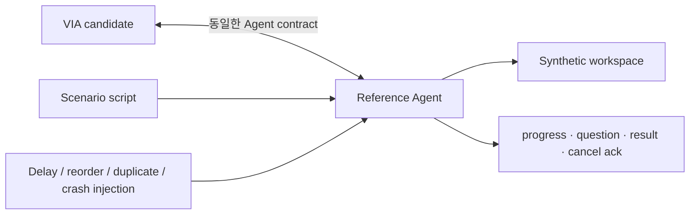

# VIA Core Evaluation Profile

> 기준일: 2026-09-26
> 상태: **평가 입력 profile 확정 / 공통 QA harness qualification 전 / 모든 DP 공식 campaign NOT_RUN**
> 목적: 실제 A/B 구현과 측정에 사용할 장비, Model, Agent, 합성 자료, 핵심 QA와 최소 workload를 한 곳에 고정한다.

## 1. 이번 평가에서 사용하는 구성

| 항목 | 고정값 |
| --- | --- |
| Target PC | MacBook Air 15-inch, Apple M5 10-core CPU(4P+6E), 10-core GPU, unified memory 24 GB |
| OS | macOS 26.5.1 (25F80) |
| 전원 조건 | AC 전원, 동일 전원 모드. scored run 전 실제 상태를 manifest에 기록 |
| S2S | Alibaba Cloud Model Studio Singapore, `qwen3-omni-flash-realtime-2025-12-01`, WebSocket |
| Semantic LLM | local `Qwen/Qwen3-8B-GGUF`, `Q4_K_M`, non-thinking, 16,384-token context |
| Semantic runtime | `llama.cpp` 0.5.0 build 11146, local OpenAI-compatible HTTP, Metal |
| Downstream Agent | VIA 평가용 deterministic Reference Agent 한 종류 |
| 자료와 외부 동작 | 고정 합성 문서·메일·일정·화면·작업 공간만 사용. 실제 계정·메일 발송·사용자 파일 변경 없음 |
| Voice endpoint observer | BlackHole 2ch 0.7.1, 48 kHz stereo; known-waveform qualification PASS |

구성 불변식은 **S2S 1개 + semantic LLM 1개**다. Component·Task·단계별 모델 복제는 허용하지 않는다. 역할별 prompt, schema, session과 호출 graph만 달라질 수 있다.

BlackHole 2ch 설치와 재기동을 완료했다. Native CoreAudio qualification에서 48 kHz stereo known chirp의 output→input capture가 normalized correlation 1.0, peak amplitude 0.199990, output-to-capture offset 21.333 ms로 통과했다. Raw emitted/captured WAV와 판정값은 [audio-loopback qualification v1](../../../results/architecture-evaluation/current/audio-loopback-qualification-v1-20260926/README.md)에 보존한다. 이는 harness 경로의 `MEASURED_REFERENCE_HARNESS` 검증이며 제품 latency 결과가 아니다.

### S2S 연결값

```text
wss://{WorkspaceId}.ap-southeast-1.maas.aliyuncs.com/api-ws/v1/realtime?model=qwen3-omni-flash-realtime-2025-12-01
Authorization: Bearer ${DASHSCOPE_API_KEY}
```

API key와 Workspace ID는 Singapore의 같은 workspace에서 발급한다. Secret은 저장소, fixture, trace에 기록하지 않는다. 실행 환경에는 다음 두 값만 제공한다.

```text
DASHSCOPE_API_KEY
DASHSCOPE_WORKSPACE_ID
```

공식 근거: [Model 정보](https://www.alibabacloud.com/help/en/model-studio/qwen3-omni-flash-realtime), [Realtime WebSocket](https://www.alibabacloud.com/help/en/model-studio/realtime), [첫 API 호출](https://www.alibabacloud.com/help/en/model-studio/first-api-call-to-qwen).

### Local semantic LLM

| 항목 | 고정값 |
| --- | --- |
| Repository | `Qwen/Qwen3-8B-GGUF` |
| Quantization | `Q4_K_M` |
| Cached repository revision | `7c41481f57cb95916b40956ab2f0b139b296d974` |
| GGUF SHA-256 | `d98cdcbd03e17ce47681435b5150e34c1417f50b5c0019dd560e4882c5745785` |
| Endpoint | `http://127.0.0.1:18080/v1/chat/completions` |
| Mode | non-thinking, temperature와 output schema는 case별 freeze |

기동:

```bash
scripts/architecture/start_local_semantic_model.sh
```

2026-09-26 smoke test에서 43-token prompt와 37-token JSON-schema output이 정상 반환됐다. 관측값은 prompt 114.71 tok/s, generation 18.88 tok/s, HTTP 전체 2.289 s였다. 이는 현재 장비와 단일 smoke prompt의 `MEASURED_MODEL` 확인값이지 QA 대표값, p95 또는 A/B 결과가 아니다.

## 2. Reference Agent 계약

Reference Agent는 실제 Agent 제품의 품질을 비교하지 않고 VIA Architecture만 반복 시험하기 위한 외부 상대다.



Reference Agent는 다음만 구현한다.

- stable execution ID, capability와 version
- submit, progress, question, result, status query, cancel
- 결정적인 delay·event 순서·중복·역전·부분 결과·실패 주입
- 합성 workspace에 대한 read와 가상 artifact 생성
- 모든 외부 Action의 dry-run 기록

도메인 reasoning 품질, 실제 브라우저 조작, 실제 메일 발송은 구현하지 않는다. Agent가 정답 Task ID나 evaluator oracle을 VIA에 제공해서도 안 된다. Process 배치 DP를 비교할 때도 Reference Agent 자체는 VIA 밖의 동일 fixture이며, 비교 대상은 VIA-owned client/bridge의 Process 경계다.

## 3. 이번에 우선 측정할 ASR 후보 10개

아래 10개를 하나의 campaign에서 수집한다. `CANDIDATE`는 중요성과 구조 인과를 검증할 working set이라는 뜻이며, A/B 결과 전에 `CONFIRMED_ASR`로 승격하지 않는다.

| Category | ASR 후보 | 선택 이유 |
| --- | --- | --- |
| Responsiveness | QA-01 Delegated Path VIA Responsiveness | 위임·결과 경로의 call graph 차이를 직접 본다. |
| Responsiveness | QA-02 VIA Direct Voice Response Responsiveness | 사용자가 가장 자주 체감하는 직접 음성 경로다. |
| Responsiveness | QA-05 Task Control Responsiveness | 취소·정정이 일반 작업에 밀리는 구조를 구분한다. |
| Correctness | QA-11 VIA Request Handling Correctness | 전체 요청 결과가 실제로 맞는지 보는 통합 결과다. |
| Correctness | QA-12 Request Semantic Resolution Correctness | 같은 semantic LLM의 권한·Context·호출 graph 차이를 분리한다. |
| Modifiability | QA-21 Agent Change Locality | Reference Agent 계약 변경이 VIA에 퍼지는 범위를 센다. |
| Modifiability | QA-22 Model, Context & State Change Locality | 모델·Context·상태 계약의 변경 파급을 센다. |
| Reliability | QA-31 Correct Task Recovery Time | 재시작·worker 실패 뒤 올바른 Task 복구를 본다. |
| Reliability | QA-32 Fault Blast Radius | 한 fault가 무관한 interaction과 Task까지 멈추는지 본다. |
| Observability | QA-61 Execution Trace Completeness | 모든 QA 결과를 실제 실행 경로로 설명할 수 있는지 본다. |

QA-03, QA-04, QA-13~15와 QA-62는 같은 trace에서 함께 계산해 보조 QA로 보존한다. 특히 QA-03/04 endpoint를 harness에서 빼지 않는다. 다만 현재 핵심 DP의 A/B를 가를 구조 인과가 약하면 최종 보고서의 ASR로 승격하지 않는다. QA-41은 target PC에서 반드시 기록하지만, 현재 메모리 상한 요구가 없으므로 진단값으로 유지한다.

## 4. 최소 정상 workload 6개

기존 네 workload만으로는 직접 응답, progress/question lifecycle, barge-in을 동시에 대표할 수 없다. 정상 workload는 아래 여섯 개로 고정한다. 각 workload는 한국어 Voice 입력을 기본으로 하고 필요한 Text·화면 event를 같은 fixture로 제공한다.

| ID | 정상 사용자 시나리오 | 반드시 포함할 구조 상황 | 주 DP | 주 QA |
| --- | --- | --- | --- | --- |
| N-01 | 화면의 합성 예산표를 가리키며 결론을 직접 질문 | 시간 정렬된 화면 Context, bounded direct response | 01, 03~06, 16~18 | QA-02, 11, 12, 22, 61 |
| N-02 | 합성 예산 보고서의 결론을 찾아 발표자료 작업에 반영하도록 위임 | Context 선택, semantic 판단, Agent submit/result | 05, 06, 09, 15, 17, 18 | QA-01, 11, 12, 21, 22, 61 |
| N-03 | “그 문서”처럼 부족한 지시를 대화 이력으로 보완한 뒤 위임 | Conversation·Task·Context relation과 clarification | 02, 06, 07, 14, 16 | QA-01, 05, 11, 12, 22, 61 |
| N-04 | 장기 작업의 progress, 추가 질문, 결과를 Voice/Text로 이어 받음 | Agent lifecycle, channel transition, result binding | 04, 09, 10, 15 | QA-01, 03, 11, 13, 15, 21, 61 |
| N-05 | 두 Task가 동시에 진행 중일 때 한 Task만 정정·취소하고 결과는 역순 도착 | control lane, identity binding, async convergence | 02, 07, 13~15 | QA-01, 05, 11, 13, 14, 61 |
| N-06 | 직접 응답과 Agent 결과 음성 재생 중 사용자가 끼어들어 중단 | 실제 audio queue·renderer stop과 다음 control 입력 | 03, 04, 10, 11, 13 | QA-02, 04, 05, 61 |

QA-21/22는 위 실행을 반복해 얻는 시간이 아니라 별도 change pack의 Architecture Element ledger로 계산한다. N-01~06은 변경 뒤 필수 기능이 유지됐는지 확인하는 회귀 입력으로 재사용한다.

정상 여섯 workload가 VIA-DP-01~07, 09~11, 13~18의 정상 경로를 덮는다. 복구 원본인 DP-08과 crash 전후 기록 순서인 DP-12는 정상 실행만으로 차이가 드러나지 않으므로 아래 최소 fault가 담당한다. 따라서 workload 수를 더 늘리지 않고도 18개 DP의 참여 경로를 한 번 이상 관찰할 수 있다.

## 5. 최소 fault 3개

정상 workload를 우선한다. Fault는 구조적 차이를 보는 데 필요한 세 종류만 둔다.

| ID | Fault | 주 DP 영역 | 주 QA |
| --- | --- | --- | --- |
| F-01 | active Agent run 중 VIA process 종료 후 재기동 | 복구 원본·Task owner·Agent 상태 재연결 | QA-31, 32, 61 |
| F-02 | VIA-owned Agent client/worker의 fatal crash | Process isolation | QA-31, 32 |
| F-03 | 사용자 응답 게시 직후 evidence durable commit 전 crash | 응답–기록 순서 | QA-31, 61, 62 |

F-02에서 외부 Reference Agent 자체의 crash를 Process 격리의 이점으로 세지 않는다. 양쪽 후보에 같은 fault 의미와 necessary dependency closure를 적용한다.

## 6. 목표와 최소 차이의 초기 기준

목표는 절대 품질 기준이고, 최소 차이는 A/B 차이를 noise와 구분하기 위한 초기 해석 기준이다. 아래 최소 차이를 넘지 못해도 구조적 원인이 반복 관측되면 결과를 버리지 않는다. 기준 변경이 필요하면 결과값이 아니라 측정 noise·표본수·사용자 체감 근거를 함께 남긴다.

| QA | 초기 target 제안 | A/B 차이 해석의 초기 기준 |
| --- | --- | --- |
| QA-01 | p95 ≤ 2,000 ms | ≥ 100 ms이면서 ≥ 10% |
| QA-02 | p95 ≤ 1,000 ms | ≥ 100 ms이면서 ≥ 10% |
| QA-05 | p95 ≤ 1,000 ms | ≥ 100 ms이면서 ≥ 10% |
| QA-11 | ≥ 95% | ≥ 5 percentage points |
| QA-12 | ≥ 95% | ≥ 5 percentage points |
| QA-21 | 평균 ≤ 2 Architecture Elements | 평균 ≥ 1 Element 차이 |
| QA-22 | 평균 ≤ 3 Architecture Elements | 평균 ≥ 1 Element 차이 |
| QA-31 | p95 ≤ 5,000 ms | ≥ 500 ms이면서 ≥ 20% |
| QA-32 | excess affected unit = 0 | 1 user-visible unit 이상 차이 |
| QA-61 | 100% | ≥ 5 percentage points |

이 표는 score band나 최종 제품 SLO를 확정하지 않는다. Fixture, 반복 수, percentile 계산과 실패 처리까지 machine contract로 동결한 뒤 첫 공식 A/B campaign을 시작한다.

## 7. 구현 상태와 다음 순서

1. QA-01~15의 complete machine contract, fixture와 oracle schema를 구현한다.
2. 일부러 latency·semantic·binding·state·continuity를 깨뜨린 sentinel candidate로 각 evaluator의 failure detection을 증명한다.
3. N-01~06, F-01~03, change pack과 19개 QA 공통 trace를 하나의 reusable harness에 연결한다.
4. 그 뒤에만 한 축을 바꾼 DP별 A/B candidate를 구현한다.
5. 같은 MacBook과 dependency profile에서 complete 19-QA 표를 생성하고 실제 변별 QA를 선별한다.

현재 완료된 것은 local semantic LLM 설치·실행, Alibaba S2S 합성 WAV 왕복 smoke test, 외부 deterministic Reference Agent, [DP-06 v4](../../../results/architecture-evaluation/current/dp06-evaluation-v4-20260927/report.md)와 [DP-11 v4 targeted campaign](../../../results/architecture-evaluation/current/dp11-evaluation-v4-20260927/report.md)이다. 이전 DP-11 v1~v3는 [preliminary archive](../../../results/architecture-evaluation/archive/dp11-preliminary-20260926/README.md)이며 current claim에 사용하지 않는다.
