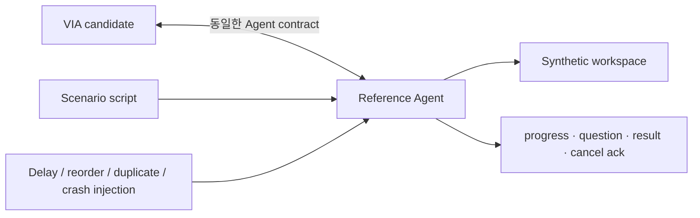

# VIA Core Evaluation Profile

> 기준일: 2026-09-28
> 상태: **공통 환경 profile 확정 / DP-03 candidate model profile `PENDING` / 새 공통 harness qualification 전**
> 목적: 실제 A/B 구현과 측정에 사용할 공통 장비·Agent·합성 자료와 candidate별로 동결해야 할 Model profile을 한 곳에서 관리한다.

## 1. 이번 평가에서 사용하는 구성

| 항목 | 고정값 |
| --- | --- |
| Target PC | MacBook Air 15-inch, Apple M5 10-core CPU(4P+6E), 10-core GPU, unified memory 24 GB |
| OS | macOS 26.5.1 (25F80) |
| 전원 조건 | AC 전원, 동일 전원 모드. scored run 전 실제 상태를 manifest에 기록 |
| 공통 Voice S2S | 1개 사용. 직접 음성 응답·Tool loop·turn-taking 기능을 유지하며 실제 product/build는 DP-03 capability qualification 뒤 동결 (`PENDING`) |
| DP-03 A speech evidence | timestamp-capable Streaming ASR 1개 추가. product/version/deployment와 partial timestamp·revision contract `PENDING` |
| DP-03 B speech evidence | 별도 ASR 없음. S2S 1개가 turn-final time-aligned text를 제공하는 개발 build 또는 product/profile `PENDING` |
| Semantic LLM | local `Qwen/Qwen3-8B-GGUF`, `Q4_K_M`, non-thinking, 16,384-token context |
| Semantic runtime | `llama.cpp` 0.5.0 build 11146, local OpenAI-compatible HTTP, Metal |
| Downstream Agent | VIA 평가용 deterministic Reference Agent 한 종류 |
| 자료와 외부 동작 | 고정 합성 문서·메일·일정·화면·작업 공간만 사용. 실제 계정·메일 발송·사용자 파일 변경 없음 |
| Voice endpoint observer | BlackHole 2ch 0.7.1, 48 kHz stereo; known-waveform qualification PASS |

공통 기반은 **S2S 1개 + semantic LLM 1개**이며 Component·Task·단계별 모델 복제는 허용하지 않는다. DP-03 A에만 timestamp-capable Streaming ASR 1개를 명시적 candidate dependency로 추가한다. A/B는 같은 원음·UI timeline·detector·Grounding·final oracle을 사용하고, 다른 model topology와 evidence 도착 시점은 측정 대상이다.

2026-09-26 predecessor generation에서 BlackHole 2ch 설치·재기동 뒤 Native CoreAudio qualification을 실행했다. 48 kHz stereo known chirp의 output→input capture는 normalized correlation 1.0, peak amplitude 0.199990, output-to-capture offset 21.333 ms였다. Raw emitted/captured WAV와 판정값은 [archived audio-loopback qualification v1](../../../results/architecture-evaluation/archive/pre-core-asr-reference-20260927/evidence/audio-loopback-qualification-v1-20260926/README.md)에 보존한다. 이는 당시 harness 경로 검증이지 제품 latency나 현재 environment qualification이 아니므로 새 scored run 전에 다시 확인한다.

### DP-03 Voice model profile 동결 조건

지금은 특정 Qwen 또는 다른 제품을 A/B의 current profile로 고정하지 않는다. A는 발화 중 partial text와
word/span source timestamp 및 revision/final semantics를 실제로 제공해야 한다. B는 별도 ASR 없이
S2S inference/native event가 발화 종료 뒤 final transcript와 word/span source timestamp를 제공해야
한다. 우리 팀의 S2S build, 근거가 있는 기존 model 또는 구조 mock을 PoC에 사용할 수 있으나 각각의
evidence 수준을 구분한다.

Model/product 선택 시 version·revision, deployment, audio format, clock basis, event schema, timeout,
network condition과 secret 이름을 Measurement Freeze에 기록한다. Secret 값은 repository·fixture·trace에
기록하지 않는다. 과거 `qwen3-omni-flash-realtime-2025-12-01` 설정과 실험은 reference provenance일 뿐
현재 DP-03 candidate나 winner가 아니다.

### Local semantic LLM

| 항목 | 고정값 |
| --- | --- |
| Repository | `Qwen/Qwen3-8B-GGUF` |
| Quantization | `Q4_K_M` |
| Cached repository revision | `7c41481f57cb95916b40956ab2f0b139b296d974` |
| GGUF SHA-256 | `d98cdcbd03e17ce47681435b5150e34c1417f50b5c0019dd560e4882c5745785` |
| Endpoint | `http://127.0.0.1:18080/v1/chat/completions` |
| Mode | non-thinking, temperature와 output schema는 case별 freeze |

기동:

```bash
scripts/architecture/start_local_semantic_model.sh
```

2026-09-26 smoke test에서 43-token prompt와 37-token JSON-schema output이 정상 반환됐다. 관측값은 prompt 114.71 tok/s, generation 18.88 tok/s, HTTP 전체 2.289 s였다. 이는 현재 장비와 단일 smoke prompt의 `MEASURED_MODEL` 확인값이지 QA 대표값, p95 또는 A/B 결과가 아니다.

## 2. Reference Agent 계약

Reference Agent는 실제 Agent 제품의 품질을 비교하지 않고 VIA Architecture만 반복 시험하기 위한 외부 상대다.


```mermaid
flowchart LR
  V["VIA candidate"] <-->|"동일한 Agent contract"| R["Reference Agent"]
  R --> W["Synthetic workspace"]
  S["Scenario script"] --> R
  R --> E["progress · question · result · cancel ack"]
  F["Delay / reorder / duplicate / crash injection"] --> R
```

Reference Agent는 다음만 구현한다.

- stable execution ID, capability와 version
- submit, progress, question, result, status query, cancel
- 결정적인 delay·event 순서·중복·역전·부분 결과·실패 주입
- 합성 workspace에 대한 read와 가상 artifact 생성
- 모든 외부 Action의 dry-run 기록

도메인 reasoning 품질, 실제 브라우저 조작, 실제 메일 발송은 구현하지 않는다. Agent가 정답 Task ID나 evaluator oracle을 VIA에 제공해서도 안 된다. Process 배치 DP를 비교할 때도 Reference Agent 자체는 VIA 밖의 동일 fixture이며, 비교 대상은 VIA-owned client/bridge의 Process 경계다.

## 3. 모든 DP에서 측정할 확정 core ASR 4개

아래 네 QA는 2026-09-28 사용자 결정으로 `CONFIRMED_ASR`가 됐다. 모든 VIA-DP-01~18 A/B package에서 네 값을 산출하되, 구조 인과가 없는 항목은 `REGRESSION_ONLY`로 명시한다. target·score band와 새 machine contract는 아직 동결되지 않았다.

| Category | Core ASR | 선택 이유 |
| --- | --- | --- |
| Responsiveness | QA-09 Average VIA-attributable Interaction Responsiveness | delegation·direct·status·control의 VIA 책임시간을 같은 DP A/B 모집단에서 단순 평균한다. |
| Correctness | QA-19 VIA Request Handling Field Accuracy | QA-11 요청 처리와 QA-12 의미 해석의 중복 없는 applicable field 정확도를 센다. QA-13~15는 회귀 진단이다. |
| Modifiability | QA-29 Average Architecture Change Locality | 해당 DP에 applicable한 A/M/C/E change당 changed Architecture Element 수를 평균한다. |
| Reliability | QA-39 Fault Containment & Recovery Success Rate | 불필요한 장애 확산 없이 deadline 안에 올바르게 복구한 fault trial 비율을 센다. |

QA-01~05, QA-11~15, QA-21~23, QA-31/32는 core ASR input·diagnostic으로 보존한다. QA-04는 QA-09 평균에서 제외한 Voice regression이다. QA-41은 target PC에서 기록하지만 score 없는 진단값이고, QA-51·61·62와 action/access rule은 qualification이다.

## 4. 최소 정상 workload 6개

기존 네 workload만으로는 직접 응답, progress/question lifecycle, barge-in을 동시에 대표할 수 없다. 정상 workload는 아래 여섯 개로 고정한다. 각 workload는 한국어 Voice 입력을 기본으로 하고 필요한 Text·화면 event를 같은 fixture로 제공한다.

| ID | 정상 사용자 시나리오 | 반드시 포함할 구조 상황 | 주 DP | 주 QA |
| --- | --- | --- | --- | --- |
| N-01 | 화면의 합성 예산표를 가리키며 결론을 직접 질문 | 시간 정렬된 화면 Context, bounded direct response | 01, 03~06, 16~18 | QA-09, QA-19, QA-29, QA-61 |
| N-02 | 합성 예산 보고서의 결론을 찾아 발표자료 작업에 반영하도록 위임 | Context 선택, semantic 판단, Agent submit/result | 05, 06, 09, 15, 17, 18 | QA-09, QA-19, QA-29, QA-61 |
| N-03 | “그 문서”처럼 부족한 지시를 대화 이력으로 보완한 뒤 위임 | Conversation·Task·Context relation과 clarification | 02, 06, 07, 14, 16 | QA-09, QA-19, QA-29, QA-61 |
| N-04 | 장기 작업의 progress, 추가 질문, 결과를 Voice/Text로 이어 받음 | Agent lifecycle, channel transition, result binding | 04, 09, 10, 15 | QA-09, QA-19, QA-29, QA-61 |
| N-05 | 두 Task가 동시에 진행 중일 때 한 Task만 정정·취소하고 결과는 역순 도착 | control lane, identity binding, async convergence | 02, 07, 13~15 | QA-09, QA-19, QA-29, QA-61 |
| N-06 | 직접 응답과 Agent 결과 음성 재생 중 사용자가 끼어들어 중단 | 실제 audio queue·renderer stop과 다음 control 입력 | 03, 04, 10, 11, 13 | QA-09 control class, QA-19, QA-61; QA-04 regression |

QA-29는 위 실행을 반복해 얻는 시간이 아니라 별도 applicable change pack의 Architecture Element ledger로 계산한다. N-01~06은 변경 뒤 필수 기능이 유지됐는지 확인하는 회귀 입력으로 재사용한다.

정상 여섯 workload가 VIA-DP-01~07, 09~11, 13~18의 정상 경로를 덮는다. 복구 원본인 VIA-DP-08과 crash 전후 기록 순서인 VIA-DP-12는 정상 실행만으로 차이가 드러나지 않으므로 아래 최소 fault가 담당한다. 따라서 workload 수를 더 늘리지 않고도 18개 DP의 참여 경로를 한 번 이상 관찰할 수 있다.

## 5. 최소 fault 3개

정상 workload를 우선한다. Fault는 구조적 차이를 보는 데 필요한 세 종류만 둔다.

| ID | Fault | 주 DP 영역 | 주 QA |
| --- | --- | --- | --- |
| F-01 | active Agent run 중 VIA process 종료 후 재기동 | 복구 원본·Task owner·Agent 상태 재연결 | QA-39, QA-61 |
| F-02 | VIA-owned Agent client/worker의 fatal crash | Process isolation | QA-39 |
| F-03 | 사용자 응답 게시 직후 evidence durable commit 전 crash | 응답–기록 순서 | QA-39, QA-61, QA-62 |

F-02에서 외부 Reference Agent 자체의 crash를 Process 격리의 이점으로 세지 않는다. 양쪽 후보에 같은 fault 의미와 necessary dependency closure를 적용한다.

## 6. 목표와 최소 차이의 초기 기준

목표는 절대 품질 기준이고, 최소 차이는 A/B 차이를 noise와 구분하기 위한 초기 해석 기준이다. 아래 최소 차이를 넘지 못해도 구조적 원인이 반복 관측되면 결과를 버리지 않는다. 기준 변경이 필요하면 결과값이 아니라 측정 noise·표본수·사용자 체감 근거를 함께 남긴다.

| QA | 초기 target 제안 | A/B 차이 해석의 초기 기준 |
| --- | --- | --- |
| QA-09 | PENDING | mean difference 기준 PENDING |
| QA-19 | PENDING | field percentage-point 기준 PENDING |
| QA-29 | PENDING | applicable change당 평균 Element 기준 PENDING |
| QA-39 | PENDING | fault success percentage-point 기준 PENDING |
| QA-61 qualification | 100% 제안 유지 | 결과 신뢰 조건으로 별도 판정 |

이 표는 score band나 최종 제품 SLO를 확정하지 않는다. Fixture, 반복 수, percentile 계산과 실패 처리까지 machine contract로 동결한 뒤 첫 공식 A/B campaign을 시작한다.

## 7. 구현 상태와 다음 순서

1. QA-01~15의 complete machine contract, fixture와 oracle schema를 구현한다.
2. 일부러 latency·semantic·binding·state·continuity를 깨뜨린 sentinel candidate로 각 evaluator의 failure detection을 증명한다.
3. N-01~06, F-01~03, change pack과 네 core ASR의 상세 evidence를 하나의 reusable harness에 연결한다.
4. 그 뒤에만 한 축을 바꾼 DP별 A/B candidate를 구현한다.
5. 같은 MacBook과 dependency profile에서 complete four-core-ASR 표와 상세 breakdown을 생성한다.

2026-09-27 predecessor generation에서는 local semantic LLM, Alibaba S2S 합성 WAV 왕복 smoke와 외부 deterministic Reference Agent를 qualification했다. [Archived VIA-DP-06 v4](../../../results/architecture-evaluation/archive/pre-core-asr-reference-20260927/evidence/via-dp-06-evaluation-v4-20260927/report.md)는 case당 1회 breadth evidence, [archived VIA-DP-11 v4](../../../results/architecture-evaluation/archive/pre-core-asr-reference-20260927/evidence/via-dp-11-evaluation-v4-20260927/report.md)는 targeted Process evidence다. 둘 다 현재 qualification이나 Core-ASR campaign이 아니다. 새 DP-03 Measurement Freeze에서 실제 dependency version과 environment를 다시 qualification한다.
