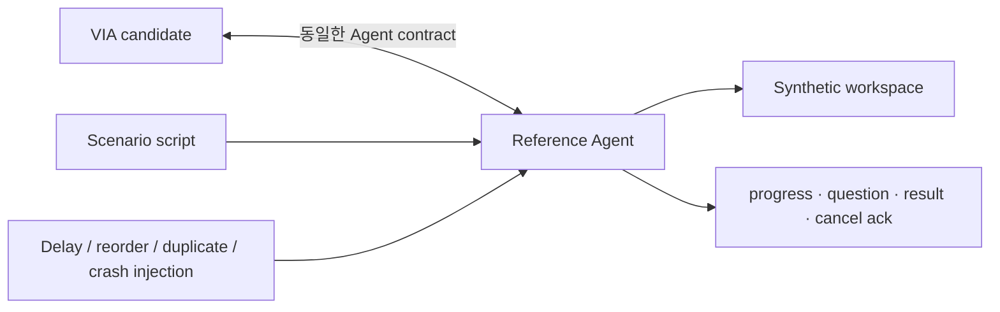

# VIA Core Evaluation Profile

> 기준일: 2026-09-28
> 상태: **공통 환경 profile 확정 / deterministic mock profile·Shared Spine freeze 전 / 새 공통 harness qualification 전**
> 목적: A/B Architecture PoC에 사용할 공통 장비·dependency mock·합성 자료와 candidate별로 동결해야
> 할 behavior profile을 한 곳에서 관리한다.

## 1. 이번 평가에서 사용하는 구성

| 항목 | 고정값 |
| --- | --- |
| Target PC | MacBook Air 15-inch, Apple M5 10-core CPU(4P+6E), 10-core GPU, unified memory 24 GB |
| OS | macOS 26.5.1 (25F80) |
| 전원 조건 | AC 전원, 동일 전원 모드. scored run 전 실제 상태를 manifest에 기록 |
| 공통 Voice S2S | deterministic S2S behavior mock 1개. 직접 음성 응답·Tool loop·turn-taking event와 scheduled audio를 제공 |
| DP-03 A speech evidence | timestamp-capable Streaming ASR behavior mock 1개 추가. partial timestamp·revision·final·fault profile을 freeze |
| DP-03 B speech evidence | 별도 ASR 없음. 같은 S2S mock이 turn-final time-aligned text를 제공 |
| Semantic LLM | deterministic structured-output behavior mock 1개. frozen input digest별 field·error·timeout profile 제공 |
| Optional model reference | local `Qwen/Qwen3-8B-GGUF` 실행은 별도 `MEASURED_MODEL` 재검증용이며 공식 Core-DP PoC score의 선행조건이 아님 |
| Downstream Agent | VIA 평가용 deterministic Reference Agent 한 종류 |
| 자료와 외부 동작 | 고정 합성 문서·메일·일정·화면·작업 공간만 사용. 실제 계정·메일 발송·사용자 파일 변경 없음 |
| Voice endpoint observer | BlackHole 2ch 0.7.1, 48 kHz stereo; known-waveform qualification PASS |

공통 기반은 논리적으로 **S2S 1개 + semantic LLM 1개**이며 PoC에서는 각각 하나의 deterministic
mock endpoint로 표현한다. Component·Task·단계별 복제는 허용하지 않는다. DP-03 A에만
timestamp-capable Streaming ASR mock 1개를 명시적 candidate dependency로 추가한다. A/B는 같은
원음·UI timeline·detector·Grounding·final oracle을 사용하고, 다른 topology와 evidence 도착 시점은
측정 대상이다. 공식 evidence label은 `MEASURED_MOCK_E2E`다.

2026-09-26 predecessor generation에서 BlackHole 2ch 설치·재기동 뒤 Native CoreAudio qualification을 실행했다. 48 kHz stereo known chirp의 output→input capture는 normalized correlation 1.0, peak amplitude 0.199990, output-to-capture offset 21.333 ms였다. Raw emitted/captured WAV와 판정값은 [archived audio-loopback qualification v1](../../../results/architecture-evaluation/archive/pre-core-asr-reference-20260927/evidence/audio-loopback-qualification-v1-20260926/README.md)에 보존한다. 이는 당시 harness 경로 검증이지 제품 latency나 현재 environment qualification이 아니므로 새 scored run 전에 다시 확인한다.

### DP-03 Voice model profile 동결 조건

특정 Qwen, 상용 ASR 또는 팀 S2S build를 이번 PoC의 current dependency로 고정하지 않는다. A mock은
발화 중 partial text와 word/span source timestamp 및 revision/final semantics를 제공한다. B mock은
별도 ASR 없이 발화 종료 뒤 final transcript와 word/span source timestamp를 제공한다. 공개
specification·원 논문과 팀 개발 contract는 mock event shape와 timing/error range의 근거로 사용한다.

Measurement Freeze에는 mock implementation revision, profile ID, audio format, clock basis, event
schema, scheduled delay, error/fault sequence와 seed를 기록한다. 실제 Model/product 연결은 나중의
별도 revalidation이며 이번 PoC winner의 선행조건이 아니다. 과거
`qwen3-omni-flash-realtime-2025-12-01` 설정과 실험은 reference provenance일 뿐 현재 DP-03
candidate나 winner가 아니다.

### Optional local semantic LLM reference

| 항목 | 고정값 |
| --- | --- |
| Repository | `Qwen/Qwen3-8B-GGUF` |
| Quantization | `Q4_K_M` |
| Cached repository revision | `7c41481f57cb95916b40956ab2f0b139b296d974` |
| GGUF SHA-256 | `d98cdcbd03e17ce47681435b5150e34c1417f50b5c0019dd560e4882c5745785` |
| Endpoint | `http://127.0.0.1:18080/v1/chat/completions` |
| Mode | non-thinking, temperature와 output schema는 case별 freeze |

기동:

```bash
scripts/architecture/start_local_semantic_model.sh
```

2026-09-26 smoke test에서 43-token prompt와 37-token JSON-schema output이 정상 반환됐다. 관측값은
prompt 114.71 tok/s, generation 18.88 tok/s, HTTP 전체 2.289 s였다. 이는 현재 장비와 단일 smoke
prompt의 과거 reference `MEASURED_MODEL` 확인값이지 현재 Core-DP PoC dependency, QA 대표값 또는
A/B 결과가 아니다.

## 2. Reference Agent 계약

Reference Agent는 실제 Agent 제품의 품질을 비교하지 않고 VIA Architecture만 반복 시험하기 위한 외부 상대다.


```mermaid
flowchart LR
  V["VIA candidate"] <-->|"동일한 Agent contract"| R["Reference Agent"]
  R --> W["Synthetic workspace"]
  S["Scenario script"] --> R
  R --> E["progress · question · result · cancel ack"]
  F["Delay / reorder / duplicate / crash injection"] --> R
```

Reference Agent는 다음만 구현한다.

- stable execution ID, capability와 version
- submit, progress, question, result, status query, cancel
- 결정적인 delay·event 순서·중복·역전·부분 결과·실패 주입
- 합성 workspace에 대한 read와 가상 artifact 생성
- 모든 외부 Action의 dry-run 기록

도메인 reasoning 품질, 실제 브라우저 조작, 실제 메일 발송은 구현하지 않는다. Agent가 정답 Task ID나 evaluator oracle을 VIA에 제공해서도 안 된다. Process 배치 DP를 비교할 때도 Reference Agent 자체는 VIA 밖의 동일 fixture이며, 비교 대상은 VIA-owned client/bridge의 Process 경계다.

## 3. 모든 DP에서 측정할 확정 core ASR 4개

아래 네 QA는 2026-09-28 사용자 결정으로 `CONFIRMED_ASR`가 됐다. 모든 VIA-DP-01~18 A/B package에서
네 값을 산출하되, 구조 인과가 없는 항목은 `REGRESSION_ONLY`로 명시한다. 공통 system target과
score band proposal 및 DP별 spine patch·mock profile·population을 Measurement Freeze에서 동결한다.

| Category | Core ASR | 선택 이유 |
| --- | --- | --- |
| Responsiveness | QA-09 Average VIA-attributable Interaction Responsiveness | delegation·direct·status·control의 VIA 책임시간을 같은 DP A/B 모집단에서 단순 평균한다. |
| Correctness | QA-19 VIA Request Handling Field Accuracy | QA-11 요청 처리와 QA-12 의미 해석의 중복 없는 applicable field 정확도를 센다. QA-13~15는 회귀 진단이다. |
| Modifiability | QA-29 Average Architecture Change Locality | 해당 DP에 applicable한 A/M/C/E change당 changed Architecture Element 수를 평균한다. |
| Reliability | QA-39 Fault Containment & Recovery Success Rate | 불필요한 장애 확산 없이 deadline 안에 올바르게 복구한 fault trial 비율을 센다. |

QA-01~05, QA-11~15, QA-21~23, QA-31/32는 core ASR input·diagnostic으로 보존한다. QA-04는 QA-09 평균에서 제외한 Voice regression이다. QA-41은 target PC에서 기록하지만 score 없는 진단값이고, QA-51·61·62와 action/access rule은 qualification이다.

## 4. Shared Evaluation Spine

모든 Core DP는 아래 공통 사용자 여정을 사용한다. 각 DP는 별도 corpus를 만들지 않고 구조 차이를
활성화하는 최소 event/state patch만 적용한다. 각 spine은 한국어 Voice 입력을 기본으로 하고 필요한
Text·화면·Context·Agent event를 같은 fixture로 제공한다.

| ID | 정상 사용자 시나리오 | 반드시 포함할 구조 상황 | 주 DP | 주 QA |
| --- | --- | --- | --- | --- |
| SP-01 | 화면의 두 위치를 차례로 가리키며 차이를 Voice로 질문 | 시간 정렬 화면 Context, bounded direct response | 03, 05, 06, 17 | QA-09, QA-19, QA-29, QA-61 |
| SP-02 | 선택한 표·문단을 근거로 수정 결과물을 요청 | Context 선택, semantic 판단, Agent submit/result | 03, 05, 06, 15, 17 | QA-09, QA-19, QA-29, QA-61 |
| SP-03 | 여러 Source와 순차·data-dependent 하위 요청이 있는 compound delegation | Context provenance, node relation, owner, artifact dependency | 05, 06, 07, 17 | QA-09, QA-19, QA-29, QA-61 |
| SP-04 | 지칭·자료·요청 내용을 dispatch 전에 정정 | correction, revision, final target/constraint, duplicate 방지 | 03, 05, 06, 07, 17 | QA-09, QA-19, QA-29, QA-61 |
| SP-05 | 장기 작업의 progress, 추가 질문, 결과를 Voice/Text로 이어 받음 | Agent lifecycle, staleness, notification, result binding | 06, 07, 15 | QA-09, QA-19, QA-29, QA-61 |
| SP-06 | 두 Task 중 하나만 수정·취소하고 다른 Task는 계속함 | control disposition, identity binding, async convergence | 06, 07, 15 | QA-09, QA-19, QA-29, QA-61 |

QA-29는 위 실행을 반복해 얻는 시간이 아니라 별도 applicable change pack의 Architecture Element
ledger로 계산한다. SP-01~06은 변경 뒤 필수 기능이 유지됐는지 확인하는 회귀 입력으로 재사용한다.

Core DP가 특정 spine 경로에 참여하지 않으면 `source_execution_key`와 applicability 근거를 남기고
독립 표본으로 복제하지 않는다.

## 5. SP-07 공통 fault variant

정상 workload를 우선한다. Fault는 구조적 차이를 보는 데 필요한 세 종류만 둔다.

| ID | Fault | 주 DP 영역 | 주 QA |
| --- | --- | --- | --- |
| F-01 | 현재 DP의 dependency/event source가 terminal 전 disconnect 후 reconnect | source generation·pending state·정확한 재연결 | QA-39, QA-61 |
| F-02 | event gap·duplicate·역순·stale revision 주입 | idempotency·freshness·authoritative reconciliation | QA-39, QA-61 |
| F-03 | provisional/state update와 durable handoff/publish 사이 VIA restart | 복구 원본·중복 방지·정확한 final state | QA-39, QA-61, QA-62 |

각 DP는 같은 fault 의미에 맞는 injection point만 patch한다. 양쪽 후보에 같은 necessary dependency
closure, 5,000 ms deadline과 fault item당 10회 기본 반복을 적용한다.

## 6. 목표와 최소 차이의 초기 기준

목표는 절대 품질 기준이고, 최소 차이는 A/B 차이를 noise와 구분하기 위한 초기 해석 기준이다. 아래 최소 차이를 넘지 못해도 구조적 원인이 반복 관측되면 결과를 버리지 않는다. 기준 변경이 필요하면 결과값이 아니라 측정 noise·표본수·사용자 체감 근거를 함께 남긴다.

| QA | 초기 target 제안 | A/B 차이 해석의 초기 기준 |
| --- | --- | --- |
| QA-09 | ≤1,500 ms | mean difference와 공통 score band 변화 |
| QA-19 | ≥95% | field percentage-point와 공통 score band 변화 |
| QA-29 | ≤3.0 elements/change | 평균 changed element와 공통 score band 변화 |
| QA-39 | ≥95% | fault success percentage-point와 공통 score band 변화 |
| QA-61 qualification | 100% 제안 유지 | 결과 신뢰 조건으로 별도 판정 |

0~5 boundary proposal은 [Scoring Contract](./scoring-contract.md)를 따른다. 이 숫자와 Spine patch,
mock schedule, fixture digest와 failure treatment를 함께 동결한 뒤 첫 공식 A/B campaign을 시작한다.
PoC system target은 별도 승인 없이 production SLO로 확대하지 않는다.

## 7. 구현 상태와 다음 순서

1. QA-01~15의 complete machine contract, fixture와 oracle schema를 구현한다.
2. 일부러 latency·semantic·binding·state·continuity를 깨뜨린 sentinel candidate로 각 evaluator의 failure detection을 증명한다.
3. SP-01~07, F-01~03, change pack과 네 core ASR의 상세 evidence를 하나의 reusable harness에 연결한다.
4. 그 뒤에만 한 축을 바꾼 DP별 A/B candidate를 구현한다.
5. 같은 MacBook과 dependency profile에서 complete four-core-ASR 표와 상세 breakdown을 생성한다.

2026-09-27 predecessor generation에서는 local semantic LLM, Alibaba S2S 합성 WAV 왕복 smoke와 외부 deterministic Reference Agent를 qualification했다. [Archived VIA-DP-06 v4](../../../results/architecture-evaluation/archive/pre-core-asr-reference-20260927/evidence/via-dp-06-evaluation-v4-20260927/report.md)는 case당 1회 breadth evidence, [archived VIA-DP-11 v4](../../../results/architecture-evaluation/archive/pre-core-asr-reference-20260927/evidence/via-dp-11-evaluation-v4-20260927/report.md)는 targeted Process evidence다. 둘 다 현재 qualification이나 Core-ASR campaign이 아니다. 새 DP-03 Measurement Freeze에서 실제 dependency version과 environment를 다시 qualification한다.
