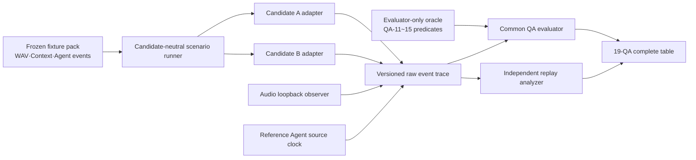

# QA-01~QA-15 공통 측정 Harness 계약

> 상태: **MEASUREMENT FOUNDATION v1 / DP 실행 금지 상태**
>
> 목적: DP마다 측정 코드를 다시 만들지 않고, 모든 후보가 같은 event·oracle·집계·실패 처리를 사용하는 공통 기반을 고정한다.

## 1. 이 기반이 통과하기 전에는 DP를 측정하지 않는다

다음 네 조건을 모두 통과해야 DP별 A/B campaign을 시작할 수 있다.

1. **Contract completeness:** QA-01~15의 모든 endpoint와 predicate가 machine contract에 있고 `default PASS`가 없다.
2. **Failure sensitivity:** QA별 정상 trace는 PASS하고, 의도적으로 한 의무를 깨뜨린 sentinel trace는 반드시 FAIL한다.
3. **Endpoint fidelity:** Voice 대표값은 annotated Voice input과 audio loopback endpoint를 사용한다. queue clear·payload delivery·renderer 함수 반환은 진단값일 뿐 대표 QA endpoint가 아니다.
4. **Independent replay:** raw trace만으로 trial 판정, latency sample, case p95와 correctness macro-rate를 정확히 다시 계산한다.

이 gate를 통과하지 못한 실행은 `PRELIMINARY_HARNESS_DIAGNOSTIC`이며 DP, ASR 또는 Architecture 결론에 사용하지 않는다.

## 2. 한 번 구현해 모든 DP가 공유하는 구조

DP adapter는 Architecture 차이만 구현한다. QA 판정, oracle, audio endpoint, failure 처리와 집계 코드는 바꾸지 않는다. DP와 무관한 공통 실행은 `source_execution_key`로 한 번만 보존하고 양쪽에 매핑한다.

## 3. 공통 실행 단위

모든 trial은 다음 세 파일의 frozen digest에 연결된다.

| 입력 | 내용 | Candidate에 제공 여부 |
| --- | --- | --- |
| Scenario fixture | Voice WAV, Text input, visible Context, 초기 Conversation·Task state, Reference Agent event script | 제공 |
| Evaluator oracle | 허용 semantic graph, identity relation, final state, continuity relation, mandatory cardinality | **미제공** |
| Measurement contract | event 의미, timeout, 반복·집계, evidence requirement | 공통 |

Voice input은 사람이 실시간 발화하지 않는다. 사전 생성한 PCM WAV의 `speech_start_frame`, `speech_end_frame`, barge-in onset과 digest를 고정하고 실제 capture timeline에 재생한다. 사용자는 마이크에 말할 필요가 없다.

Voice output 대표 endpoint는 실제 audio output device를 audio loopback으로 관측한다. 시작 sample과 중단 대상의 마지막 sample을 waveform correlation으로 찾는다. Model packet 도착, buffer enqueue, queue clear와 callback은 원인 분석 event로만 남긴다.

## 4. QA-01~QA-05 시간 측정

모든 latency trial은 같은 monotonic clock domain의 원시 timestamp에서 계산한다. 물리적 endpoint가 없거나 event provenance가 무효이면 frozen timeout 값으로 censored 처리한다. 응답은 실제로 제시됐지만 correctness oracle을 위반한 경우에는 실제 처리시간을 그대로 보존하고 correctness 실패를 별도 열로 보고한다. 의미 실패를 timeout으로 바꾸지 않는다.

| QA | 필수 원시 event | Trial 계산 | 대표값 |
| --- | --- | --- | --- |
| QA-01 | `user_input_end`, `agent_request_available_at_agent_ingress`, `agent_result_available_at_source`, `first_meaningful_audible_result_audio` | `(t1-t0)+(t3-t2)`; Agent 내부 `t2-t1` 제외 | case별 nearest-rank p95 중 최댓값 |
| QA-02 | `user_input_end`, `first_meaningful_audible_direct_response` | `t1-t0` | case별 nearest-rank p95 중 최댓값 |
| QA-03 | `agent_status_available_at_source`, `first_meaningful_audible_status_audio` | `t1-t0` | case별 nearest-rank p95 중 최댓값 |
| QA-04 | `barge_in_speech_onset`, `interrupted_response_last_audible_sample` | `t1-t0` | case별 nearest-rank p95 중 최댓값 |
| QA-05 | `task_control_input_end`, `correct_task_control_disposition_presented` | `t1-t0` | case별 nearest-rank p95 중 최댓값 |

QA-05에는 input finalization, semantic target resolution, Task binding, control 전달, 필요한 source confirmation과 실제 Voice/UI presentation이 모두 포함된다. `cancel RPC + query` 같은 내부 부분시간만 QA-05라고 부르지 않는다.

QA-01~05 결과표는 위 p95 대표값과 함께 **동일한 전체 scored sample의 산술평균**을 보조지표로 표시한다. 평균은 심사자가 전형적인 처리시간을 이해하기 위한 설명값이며, tail latency를 나타내는 p95 대표 metric이나 target 판정을 대체하지 않는다. p95와 평균 모두 실패·timeout을 포함한 같은 frozen failure treatment를 사용하고 각 값의 sample count를 함께 공개한다. case당 1회인 breadth 실행은 p95라고 부르지 않고 `case 최대값 proxy`와 평균으로 명시한다.

### Voice endpoint 허용 근거

| Provenance | 대표 QA 사용 | Evidence label |
| --- | --- | --- |
| Annotated input WAV가 실제 capture timeline에 주입됨 | 허용 | 실행 범위에 따라 reference/product |
| Audio loopback에서 의미 있는 output onset/last sample 검출 | 허용 | 실행 범위에 따라 reference/product |
| Instrumented renderer callback | 대표값 금지, 진단값만 | `MEASURED_REFERENCE_HARNESS` |
| payload delivery, queue enqueue/clear, API return | 대표값 금지 | diagnostic only |

## 5. QA-11~QA-15 정확성 측정

Evaluator는 case마다 명시된 predicate만 평가하며 누락된 predicate를 `true`로 간주하지 않는다. 적용되지 않으면 oracle에 명시적으로 `N/A`가 있어야 한다.

| QA | 반드시 평가하는 machine predicate | PASS 조건 |
| --- | --- | --- |
| QA-11 | 해당 case의 response/result, QA-12~15 applicable predicate, dispatch/control cardinality, mandatory safety gate | 모든 applicable predicate PASS |
| QA-12 | goal, constraints, deliverables, referents, request decomposition/dependency, clarification, Task relation, direct/Agent handling, Agent/capability | 허용 semantic graph와 일치 |
| QA-13 | Conversation, Request, Task, Agent execution, question, result/artifact의 binding과 delivery cardinality | 모든 required relation·cardinality 일치 |
| QA-14 | revision acceptance, duplicate suppression, stale-event rejection, race resolution, terminality, result reference, pending interaction, allowed control | 전체 event script 뒤 final state oracle와 일치 |
| QA-15 | channel·connection·conversation·Task 전환 전후 identity/referent 관계 | 모든 continuity relation 유지 |

QA-11은 통합 outcome이고 QA-12~15는 실패 원인이다. 다섯 값을 합산하거나 평균내지 않는다.

QA-11과 QA-12 결과에는 strict 대표값 외에 다음 보조지표를 함께 보존한다.

- `field_level_correctness = correct atomic predicates / applicable atomic predicates`
- `strict_case_success = all applicable predicates가 맞은 case 수 / scored case 수`

Field-level은 어느 의미·결과 항목에서 차이가 났는지 설명하는 진단값이며 strict 대표 metric을 대체하지 않는다. Strict 비율은 반드시 분자/분모와 함께 표시한다. QA-11 field-level은 응답·위임·Task 상태 연결 등 integrated predicate 전체에서 계산하고, QA-12 field-level은 semantic predicate만 계산한다. Semantic stage만 실행한 campaign은 QA-11을 `N/A / NOT_MEASURED_PRODUCT_INTEGRATED_OUTCOME`으로 두고 QA-12 값을 **QA-11 선행조건 proxy**로만 표시한다. 두 QA가 같은 값처럼 보이도록 복제하지 않는다.

### Oracle 연산자

`EXACT`, `ONE_OF`, `SET_EQUAL`, `ORDERED_RELATION`, `REQUIRED_PROPOSITION`, `FORBIDDEN_PROPOSITION`, `CLARIFICATION_REQUIRED`, `BINDING`, `CARDINALITY`, `FINAL_STATE_EQUAL`, `CONTINUITY_RELATION`만 사용한다. 자연어 문체를 채점하지 않고 structured fact와 관계를 채점한다.

## 6. 최소 corpus와 반복

Fixture 수를 임의로 늘려 쉬운 case로 실패를 희석하지 않는다.

| Pack | 최소 구성 | 반복 |
| --- | --- | --- |
| Latency canonical | QA-01 4 case, QA-02 4, QA-03 3, QA-04 2, QA-05 7 | case별 10 warm-up + 100 scored paired trials |
| Semantic correctness | 승인된 N-01~06 최소 28 case; semantic predicate 종류별 최소 3 case가 안 되면 필요한 case만 추가 | case별 3회 |
| Binding | progress/question/result/failure/follow-up/cancel/multiple-run 각각 포함 | deterministic case별 3회 |
| State convergence | stale, duplicate, reorder, cancel-complete, question-terminal, push-query, partial-terminal 7 strata | stratum별 20회 |
| Continuity | 문서의 8개 전환 scenario를 모두 포함 | scenario별 10회 |

Model·S2S가 DP의 변경 경로에 참여하지 않으면 같은 frozen source execution을 A/B에 매핑할 수 있다. 참여하면 후보별 실제 실행이 필요하다. 표본을 복제해 독립 실행 수를 늘리지 않는다.

## 7. Failure-sentinel qualification

공통 evaluator는 다음 mutation을 모두 검출해야 한다.

| QA | 정상 trace | 반드시 실패해야 하는 sentinel |
| --- | --- | --- |
| QA-01 | 네 endpoint와 올바른 result | Agent 실행시간을 VIA 시간에 포함, ingress 누락, wrong result, audio proxy만 존재 |
| QA-02 | direct route와 loopback onset | Agent가 참여, filler를 endpoint로 사용, output correctness 실패 |
| QA-03 | 새 status·올바른 binding·loopback onset | stale/duplicate status, wrong Task, source 시각을 receive 시각으로 대체 |
| QA-04 | barge-in annotation과 loopback last sample | queue-clear/cancel-return을 종료점으로 사용, 새 응답 생성시간 포함 |
| QA-05 | 입력 종료부터 truthful disposition presentation | semantic 시간 제외, wrong Task, 근거 없는 `canceled`, local enqueue를 종료점으로 사용 |
| QA-11 | 모든 applicable predicate PASS | driver·response·cardinality 중 하나라도 FAIL |
| QA-12 | 전체 semantic graph 일치 | route는 같지만 constraint/referent/dependency 중 하나가 틀림 |
| QA-13 | 전체 identity graph와 cardinality 일치 | wrong Task/run/question, duplicate dispatch/control |
| QA-14 | oracle final state 수렴 | stale revision 수락, terminal reopen, cancel-complete race 오판 |
| QA-15 | 모든 transition relation 유지 | provider connection ID를 Conversation ID로 대체, channel 전환 뒤 Task/referent 손실 |

각 sentinel은 `expected_failure_code`까지 일치해야 한다. 단순히 예외가 났다는 이유로 qualification을 통과하지 않는다.

## 8. DP campaign acceptance

DP별 complete table은 각 QA를 다음 중 하나로만 기록한다.

- `MEASURED_DIFFERENTIATOR`: 공통 evaluator와 해당 candidate path를 실제 실행해 A/B를 비교함
- `MEASURED_QUALIFICATION`: 양쪽이 동일 의무를 만족하는지 실제 실행함
- `COMMON_SOURCE_REGRESSION`: DP가 물리적으로 참여하지 않아 같은 source execution을 명시적으로 매핑함
- `NOT_APPLICABLE`: 해당 QA 모집단에 그 DP 경로가 없고 이유가 component path로 증명됨
- `NOT_RUN`: 필요한 endpoint 또는 dependency를 실행하지 않음

Proxy 값을 넣어 `MEASURED_DIFFERENTIATOR` 칸을 채우지 않는다. `NOT_RUN`은 실패가 아니라 정직한 상태이며, 모든 QA를 억지로 숫자로 만드는 것보다 우선한다.

## 9. 현재 상태

DP-11 v3는 raw format·표·independent replay의 개발 자료다. 위 contract의 endpoint fidelity와 correctness sentinel을 통과하지 않았으므로 공식 campaign이 아니다. 다음 구현 대상은 DP-11 재실행이 아니라 이 공통 evaluator와 qualification suite다.

## 10. 공통 결과 저장 형식

새 DP campaign은 `results/architecture-evaluation/current/dpNN-<campaign>-vN-YYYYMMDD/` 아래의 새 immutable directory에 둔다. 기존 directory를 덮어쓰지 않는다. 최소 구성은 frozen contract/fixture/oracle과 digest, candidate별 raw trace, environment·source manifest, 재계산 가능한 `summary.json`, 사람이 읽는 `report.md`다. A/B 이후 선택안 보완 tactic인 B′를 실행했다면 applicable QA의 같은 complete table에 세 번째 후보로 표시하고, 실행하지 않은 ledger나 endpoint는 N/A로 남긴다.
