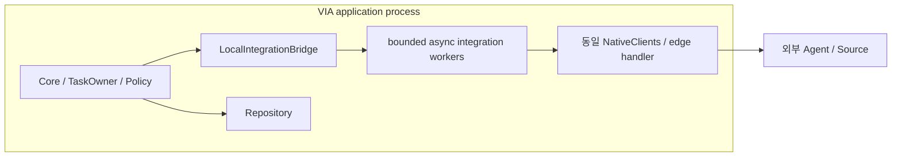
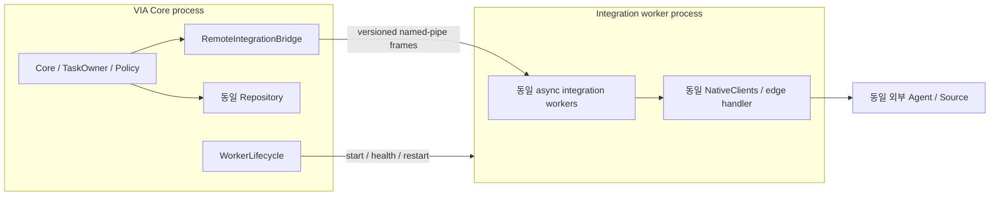

# EXEC-DP01 — 연동 코드의 장애를 Core와 같은 process에서 받을지, 밖에서 격리할지

> 상태: Candidate definition current. 동일 코드·동일 논리 fault point 비교.
> Current measurement contract: 새 Voice 경로와 QA-04의 applicability 및 IPC span은 [Voice Responsiveness](../../08-quality-attributes/voice-responsiveness.md)를 기준으로 재동결한다. 재동결 전에는 QA-09/QA-10만 active hypothesis로 유지한다.
<!-- candidate: {"dp":"EXEC-DP01","reference":"A","hypotheses":["QA-09","QA-10"],"alternatives":{"A":["VIA-C-LOCALBRIDGE","VIA-I-BRIDGE","VIA-D-VIA"],"B":["VIA-C-REMOTEBRIDGE","VIA-C-WORKERLIFE","VIA-I-BRIDGE","VIA-I-IPC","VIA-S-IPC","VIA-D-VIA","VIA-D-INTEGRATION"]}} -->

## 1. 결정과 경계

VIA는 Agent/파일·메일 등 여러 연동 코드와 상호작용한다. **그 연동 코드를 Core와 같은 process에서 실행하는 A와 별도 worker process에서 실행하는 B**를 비교하여 정상 호출 비용과 fatal fault의 영향 범위를 확인한다.

격리 대상은 Agent/Source NativeClients와 그 연동 경계 code다. Core의 semantic decision, Task writer, policy authority와 canonical DB는 두 후보에서 그대로 유지한다. Model Runtime도 별도 고정 dependency이며 이 DP에서 갑자기 모델 가중치를 다른 host로 옮기지 않는다.

## 1-A. Rust/Tokio 구현 가능성

Rust VIA에서도 두 안 모두 현실적이다.

- A: 한 OS process의 Tokio runtime에서 async task, channel/queue, semaphore, timeout/cancellation으로 논리 격리한다.
- B: Core가 `tokio::process::Command` 등으로 integration worker child process를 시작·관찰한다. IPC transport는 measurement OS에서 하나로 고정하며, Windows target realization에서는 Tokio의 async named-pipe API를 사용할 수 있다.

**Tokio 자체가 process isolation을 제공하는 것은 아니다.** B의 실제 격리 경계는 Windows OS process이고 Tokio는 child lifecycle과 비동기 IPC를 관리한다. 구현 선택은 prototype 시점에 고정하고 IPC serialization/copy/restart 비용을 측정에 포함한다.

## 2. A — Single-process Partitioned Runtime

동일 Rust async runtime에서 foreground/control/event queue와 자원별 worker를 분리한다. 네트워크 대기 중 thread를 점유하지 않고 timeout/cancellation/backpressure를 구현한다. blocking library는 제한된 worker에서만 수행한다. 일부 recoverable error/panic을 처리할 수 있지만 process-fatal abort까지 격리됐다고 주장하지 않는다.

## 3. B — Process-isolated Integration Runtime

Core와 worker는 **versioned local IPC frame**으로 같은 logical operation/result를 전달한다. Architecture candidate review smoke prototype은 child stdin/stdout pipe를 쓰며, macOS 성능 측정 transport는 별도 freeze에서 Unix local IPC로 고정하고 Windows target realization은 named pipe를 사용한다. 서로 다른 OS의 IPC 절대 지연을 같은 수치로 간주하지 않는다. Frame은 `protocol_version, operation_id, request_revision, deadline, type, payload_length, payload`를 갖고 oversize/unsupported version을 거부하며 민감 payload를 로그에 남기지 않는다.

worker에는 canonical DB write 권한을 주지 않는다. 연결 끊김은 아직 접수되지 않은 요청과 이미 remote accepted 여부가 불확실한 요청을 분리해 Core에 보고한다. in-flight IPC state를 잃어도 Core의 durable outbox/ExecutionLink로 같은 제출을 조정한다.

## 4. 동등한 자원과 fatal fault

총 CPU worker budget, queue capacity, Model concurrency, event rate는 동일하다. B의 process 증가를 CPU/GPU 무제한 증가로 해석하지 않는다. A도 queue/backpressure를 갖추며 B도 실제 serialization/copy/IPC·worker 시작 시간을 포함한다.

| 시험 | 두 후보의 동일 logical stimulus | 관측 |
|---|---|---|
| 정상 QA-01/QA-02/QA-03/QA-04 | 동일 Source/Agent 동작 | IPC/queue/copy·remote roundtrip·foreground 간섭 |
| QA-09 whole-VIA restart 4 strata | application 전체 메모리 손실, 공통 500ms 뒤 relaunch | 모든 관련 Task의 정확한 control 복귀 |
| QA-09 integration fatal 2 strata | adapter 진입점의 동일 `host_abort` | A는 공유 host, B는 worker가 종료. 같은 relaunch 지연 규칙 |
| QA-10 external 24 cells | 같은 refused/no-reply | timeout/isolation, 무관 기능 유지 |
| QA-10 host-fatal 4 cells | 동일 adapter code의 한 번의 transient fatal 종료 | 무관 기능 2/10/20초 probe와 5초 deadline |

fatal fixture는 특정 candidate ID를 보고 PID를 고르지 않는다. **같은 adapter가 자기 host를 종료**하게 하고 시험 controller는 결과를 관찰한다. recoverable exception과 fatal termination은 별도 종류이며, crash를 반복 주입해 Single-process가 계속 실패하도록 만들지 않는다.

공통 시험 controller의 500ms 재시작은 제품의 OS 자동 재시작 SLA가 아니다. B도 같은 지연 후 worker 재시작을 시작해, A에게만 사용자 수동 재실행 시간을 부과하지 않는다. 두 안 모두 5초 안에 복원하면 QA-10은 동점일 수 있다. blackout duration은 secondary로 보존한다.

## 5. ELEMENTS

| Element ID | 책임·계약 | 소유자 / 소비자 / 수명 | 독립 변경 판정 |
|---|---|---|---|
| VIA-C-LOCALBRIDGE | in-process integration operation 실행 | VIA host / Core·NativeClients / 호출 | 직접 호출·queue·취소 행위 변화 |
| VIA-C-REMOTEBRIDGE | IPC operation 전송·응답·불확실성 연결 | Core / worker·TaskOwner / 호출 | 전송·응답·재연결 행위 변화 |
| VIA-C-WORKERLIFE | worker 시작·종료·health·재시작 | Core / worker / process 수명 | 격리 worker supervision 행위 변화 |
| VIA-I-BRIDGE | logical integration request/result/cancel | Core↔연동 경계 | operation 완료·실패·지원 의미 변화 |
| VIA-I-IPC | framing·version·backpressure·연결 손실 계약 | Core↔worker | 프로세스 간 protocol 의미 변화 |
| VIA-S-IPC | in-flight operation·connection generation | RemoteBridge / caller / 연결 동안 휘발 | 재연결·취소·미확정 호출 state 변화 |
| VIA-D-VIA | VIA application deployment | A=Core+integration, B=Core / OS 시작·종료 | 실제 host 책임·시작·종료·통신 배치 변화 |
| VIA-D-INTEGRATION | 별도 integration worker deployment | B Core가 관리 / worker process 수명 | worker host·재시작·IPC 배치 변화 |

동일 역할 NativeClients/edge handler 자체는 같은 code다. 프로세스가 나뉜다는 이유로 함수·DTO·Task 인스턴스를 C/S로 복제 집계하지 않는다. subprocess 개수가 아니라 독립 배치 유형 D를 센다.

## 6. trade-off 가설과 반증

A는 IPC를 피하고 메모리 내 참조 전달을 활용하지만 process-fatal 장애가 Core까지 닿을 수 있다. B는 연동 장애의 종료 범위를 줄이고 worker만 복원할 수 있지만 프레임 전송·copy·운영 lifecycle이 추가된다. [E4](../../../archive/w12-g1/evidence-and-readiness.md)

QA-01/QA-04 정상 경로의 차이가 모델 inference에 비해 작다면 별도 큰 score 차이를 주장하지 않는다. QA-09는 정확한 recovery endpoint까지 측정하며, QA-10은 28개 fixed cell의 성공 여부를 그대로 계산한다. 6초짜리 외부 장애와 1회 local abort를 임의 빈도로 섞어 제품 가용성 확률처럼 발표하지 않는다.

EXEC A/B × TASK-DP01 A/B의 교차 확인으로 저장·소유권 효과와 process 격리 효과를 분리한다. AGENT variant의 edge normalizer가 어느 host에서 수행되는지도 complete configuration에 기록한다. 일부 연동만 process 밖으로 보내는 제3 설계는 adapter별 deployment mapping과 비용을 별도 명세해야 하며, 이번 A/B의 승자를 먼저 가정하지 않는다.
