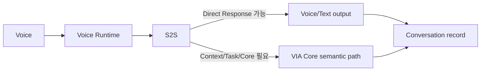

# FP-INT01 — S2S Direct Fast Path

> Current measurement contract: W-01~W-03이 delegated result, direct Voice response, Agent progress Voice feedback으로 재정의되었다. 이 문서의 기존 latency 연결은 [11-E](../../08-quality-attributes/voice-responsiveness.md)에 맞춰 구현 전에 재검토한다.

> **Candidate 자체 리뷰에서 INT-DP01을 독립 DP에서 내리고 고정 Interaction 원칙으로 전환하는 제안.** 사용자 승인 전.

## 결론

Voice 입력은 VIA Voice Runtime과 S2S Model을 거친다. 제품 정의의 **S2S Direct Response**는 S2S가 자체 지식과 Conversation만으로 답할 수 있는 경우이므로, 그 판단이 유효한데도 Core Router가 다시 release 허가를 내리게 하는 구조는 현재 요구에서 강한 독립 이점을 제시하지 못한다.

따라서 기본 구조는 다음으로 고정하는 것이 타당하다.

- S2S direct answer의 **release owner는 Voice Runtime**이다.
- Core가 필요한 요청만 escalation한다.
- Direct Response도 canonical Conversation에 기록한다.
- Voice Runtime이 판단할 수 없는 Context/Task/Agent routing은 Core responsibility다.
- interruption은 audio generation을 멈추되 명시적 cancel intent 없이 Task를 취소하지 않는다.
- S2S가 필요한 route/control event를 native로 제공하지 않으면 supplemental interpretation을 추가하며 direct-response 비용을 W-02에 포함한다. Delegation 경로의 비용 귀속은 새 W-01 call graph에서 별도 고정한다.

## 왜 기존 B를 탈락시키는가

이전 B는 S2S가 direct answer candidate를 만든 뒤 Unified Core Router가 release를 다시 허가했다. Core에서 policy/Task/context 때문에 **새 판단이 실제로 필요하다면** S2S가 애초에 direct path가 아닌 Core path로 escalation해야 한다. 반대로 새 판단이 필요 없다면 B는 사실상 forwarding gate다.

따라서 A와 B 사이에 충분히 강한 제품 trade-off가 없고 A가 자연스러운 구조로 지배할 가능성이 높다. 발표 목적상 이런 candidate를 억지로 유지하지 않는다.

## 관련 Working ASR

- **W-02 VIA Direct Voice Response Responsiveness** — S2S direct path의 실제 audible 응답 latency. 새 W-01 delegation 경로의 관련성은 별도 재검토한다.
- **W-08 Evolvability & Maintainability** — S2S event/control 계약 변경은 regression으로 추적.
- Voice barge-in/jitter — secondary observation.

이 문서는 Architecture Decision score 대상이 아니다.
