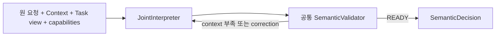
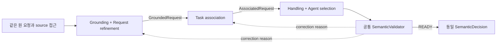

# IR-DP01 — 요청을 한 번에 함께 판단할지, 계약으로 나눈 단계가 판단할지

> 상태: Candidate definition current. semantic accuracy와 latency는 NOT_RUN.
> Current measurement contract: 새 delegated/direct Voice call graph는 [Voice Responsiveness](../../08-quality-attributes/voice-responsiveness.md)를 기준으로 재동결한다. 재동결 전에는 W-05/W-08만 active hypothesis로 유지한다.
<!-- candidate: {"dp":"IR-DP01","reference":"A","hypotheses":["W-05","W-08"],"alternatives":{"A":["VIA-C-JOINT","VIA-C-SEMCHECK"],"B":["VIA-C-GROUNDREFINE","VIA-C-ASSOCIATE","VIA-C-SELECT","VIA-C-SEMCHECK","VIA-I-GROUNDED","VIA-I-ASSOCIATED","VIA-S-SEMSTAGES"]}} -->

## 1. 왜 필요한 결정인가

VIA는 '이걸 정리해서 아까 업무에 넣어줘'를 **대상·요청 관계·기존 Task·처리 경로**로 정확히 정리해야 한다. 같은 모델을 쓰더라도 이 판단들을 하나의 출력으로 묶을지, 독립 계약을 가진 stage로 연결할지가 호출 경로와 변경 단위를 결정한다.

여기서 authority는 의미 판단 산출물의 책임이다. 모델에게 실행·권한 승인을 맡기는 것이 아니며, 실제 side effect는 공통 검증과 Task/Policy 경계를 통과한다.

## 1-A. Model 능력 의존성

**W-05 Task Completion Effectiveness의 차이는 Model 능력에 상당 부분 의존한다.** 같은 Qwen reference Model이 joint structured output을 안정적으로 만들 수 있으면 A가 기능적으로 불리하지 않을 수 있고, 복잡한 joint schema에서 오류가 늘면 B의 집중된 stage가 유리할 수 있다. 반대로 stage 간 중간 판단 오류가 누적되면 B가 불리할 수도 있다.

따라서 Architecture가 W-05의 우열을 미리 결정했다고 말하지 않는다. 같은 Model/corpus/Context의 실제 결과만 W-05 차이로 인정한다. Current measurement contract에서는 **W-01 Delegated Task Result Responsiveness / W-02 VIA Direct Voice Response Responsiveness**의 후보별 token ledger와 call critical path를 새로 동결하고 W-08 Evolvability & Maintainability와 함께 본다.

## 2. A — Integrated Semantic Authority

하나의 독립 semantic component가 referent, Request graph, Task Relation, Handling, Agent capability 선택을 함께 산출한다. 명목 정상 경로는 **한 번의 structured semantic invocation**이고, 필요한 자료가 없으면 `NEED_CONTEXT`로 외부 읽기를 요청한 뒤 다시 판단한다.

통합 prompt는 역할/금지사항/전체 output schema와 요청에 실제 필요한 evidence를 포함한다. 작은 output을 위해 constraint나 근거를 삭제하지 않는다. context 부족·불일치가 발생한 경우 추가 호출을 모두 기록한다.

## 3. B — Staged Semantic Authorities

세 stage가 독립 판단 계약을 가진다. Stage 1은 referent·원래 의미·compound edge를, Stage 2는 No Tracked/New/Existing 및 관련 Task를, Stage 3은 bounded/direct/delegated handling과 적합한 capability를 판단한다.

원문·source version·provenance는 모든 stage가 재조회할 수 있다. 앞 단계의 결론을 맹신하지 않고 contradiction이면 명시적 correction을 요청한다. 단순 명시 Task ID 선택 등 기계적으로 확인 가능한 경우는 **양 후보 모두 동일한 deterministic bypass**를 허용한다. B에 필요 없는 LLM 호출을 강제로 추가하지 않는다.

## 4. 중간 계약과 failure semantics

| 계약 | 필수 내용 | 의미 |
|---|---|---|
| GroundedRequest | original_request_ref, request_revision, request nodes, referent bindings, source versions, constraints, 4종 compound edge, unresolved 목록 | 원문 복원 가능. 아직 Task/Agent를 확정하지 않음 |
| AssociatedRequest | GroundedRequest 참조, node별 TaskRelation/TaskID, Task view revision, pending interaction 참조 | 'New Task=Agent Handling'으로 같은 enum에 합치지 않음 |
| SemanticDecision | 위 의미 + 처리 경로/capability + READY/NEED_CONTEXT/CLARIFY/REJECT | A/B의 외부 소비 계약은 동일 |

`VIA-C-SEMCHECK`는 schema, reference 존재/version, compound cycle/누락, Task revision, 지원 capability, 금지된 직접 Action을 검사한다. 의미의 정답을 oracle에서 가져오지 않는다. Stage state는 해당 Request revision의 작업 상태이며 Conversation 원문이나 Task truth를 대체하지 않는다.

모든 stage의 output과 source 재조회는 trace에 남긴다. 동일 경로의 무한 repair를 막기 위해 **최초 판단 후 최대 2개 correction cycle**을 공통 허용한다. cycle 수는 성공을 보장하는 수치가 아니라 실행 제한이며, 소진 시 구조화된 failure/clarification으로 처리하고 성공 표본에서 삭제하지 않는다. Context 획득·사용자 답변은 별도 사건으로 구분한다.

## 5. ELEMENTS

| Element ID | 책임·계약 | 소유자 / 소비자 / 수명 | 독립 변경 판정 |
|---|---|---|---|
| VIA-C-JOINT | 전체 의미 판단·structured output | IR / router·TaskOwner / Request | 통합 판단·prompt/output 구성 행위 변화 |
| VIA-C-GROUNDREFINE | 지칭·제약·compound 정리 | IR Stage1 / Stage2 / Request | 해당 의미 처리 행위 변화 |
| VIA-C-ASSOCIATE | Task 관계·pending 답변 연결 | IR Stage2 / Stage3 / Request | 업무 연계 행위 변화 |
| VIA-C-SELECT | handling/capability 선택 | IR Stage3 / validator / Request | 처리 경로·선택 행위 변화 |
| VIA-C-SEMCHECK | schema/참조/수정 제어와 final 검증 | IR Control / 양 후보 / Request | 검증·retry/correction 행위 변화 |
| VIA-I-GROUNDED | GroundedRequest stage 계약 | Stage1→Stage2 | source/constraint/관계 계약 변화 |
| VIA-I-ASSOCIATED | AssociatedRequest stage 계약 | Stage2→Stage3 | Task binding/revision 계약 변화 |
| VIA-S-SEMSTAGES | stage revision·provenance·invalidated suffix | IR Control / 단계들 / Request 동안, 재시작 시 미완료 판단 재수행 | 중간 판단 상태·무효화 수명 변화 |

Model client, Context access, final Decision interface는 COMMON 재사용이다. Model inference는 동일 dependency D에서 실행되고 B의 각 stage가 별도 GPU/process인 것으로 간주하지 않는다.

## 6. 호출 원장과 평가 가설

각 invocation에 system prompt, schema, 실제 Context/history, 현재 요청, 최종 직렬화 SHA, input/output token, resource ID, 선행 call ID를 기록한다. 글자 수 추정이나 stage 수×평균 지연을 쓰지 않는다. schema-only 문서 토큰을 실제 전체 prompt token이라고 보고하지 않는다.

| 사전 가설 | 비교 근거 | 반증 조건 |
|---|---|---|
| W-01 Delegated Task Result Responsiveness / W-02 VIA Direct Voice Response Responsiveness | A의 전체 prompt와 B의 누적 prompt·decode·critical path, 실제 bypass/repair 횟수 | 새 Voice endpoint와 call graph 동결 전 우열 미정 |
| W-05 Task Completion Effectiveness | 동일 48 TC의 obligation별 실제 모델 결과 | 둘 다 필요한 정보를 보존하면 동점 가능 |
| W-08 Evolvability & Maintainability | M-02/03/08 변화의 component·stage contract 수정 | 공통 adapter에 국소화되면 예상 차이가 없어짐 |

TC-04.2/06.2/09.3/09.4/14.5를 설명용 대표 trace로 사용하되 전체 membership을 유지한다. A의 장점 후보는 joint evidence와 적은 boundary, 단점 후보는 prompt/책임 결합이다. B는 집중된 판단과 독립 변경에 유리할 수 있으나 중간 계약·correction·누적 decode 비용을 부담한다.

부분 grouping은 언제나 불가능하다는 주장이 아니다. 이번 두 후보는 **전체 final decision을 한 단위가 생성하는 topology와 독립 stage 산출물을 조합하는 topology**다. group/hybrid를 새 후보로 넣으면 수정되는 stage 계약과 경로를 명시하고 같은 기준으로 평가해야 한다.
