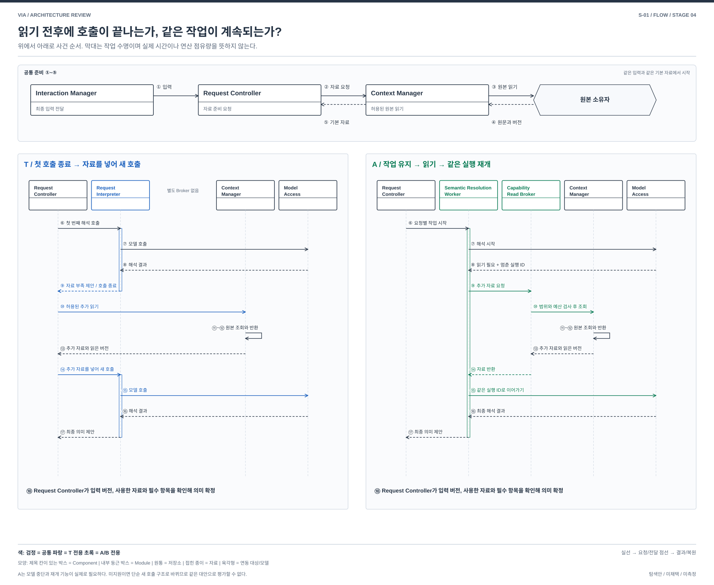

# S-01. 해석 중 근거를 보완하는 실행 구조

> 상태: **STAGE_4_REVISED / 사용자 재검토 대기** / 2026-10-01
> [04 전체 지도](./04-00-structural-alternatives.md#s-01) / [설명과 그림의 공통 원칙](./04-00-structural-alternatives.md#12-처음-읽는-사람을-위한-설명과-그림-원칙) / [품질의 공통 의미](./03-00-quality-scenarios.md#2-어떤-품질을-보고-있는가) / [검토 기록](./04-09-structural-review.md)
> 연결 문제: **P-01, P-03**. S는 탐색 질문이며 DP 선정이 아니다. T는 실제 REVIEWED_BASELINE, A/B는 미채택 탐색안이다.

## 1. 어떤 상황에서 필요한 선택인가

> 사용자가 “아까 그 자료를 김 팀장에게 보내줘”라고 요청한다. VIA가 기본 대화 이력만 확인해서는 “그 자료”가 어떤 자료인지, “김 팀장”이 어느 사람인지 확정할 수 없다. 관련 자료나 연락처를 추가로 읽은 뒤 요청을 다시 해석해야 한다.

두 구조는 사용자의 최종 입력을 받고 기본 Context를 만드는 단계까지 같다. 차이는 첫 번째 해석에서 근거 부족을 발견한 다음에 생긴다.

- **T, 실제 target:** 첫 번째 해석을 끝내고 그 결과를 Request Controller에 돌려준다. Request Controller가 추가 자료를 읽은 다음 Request Interpreter를 새로 호출한다.
- **A, 대안:** 해석 실행이 필요한 자료를 지정한 뒤 완료되지 않은 실행을 잠시 멈춘다. 별도 Worker가 자료를 읽어 같은 실행에 넣고 이어서 수행한다.

이 문서가 비교하는 것은 검색 알고리즘이나 읽을 자료의 종류가 아니다. **추가 자료가 필요할 때 해석 실행을 끝냈다가 새로 호출할지, 멈춘 실행을 같은 상태에서 재개할지**다.

### 1.1 처음 읽을 때 필요한 용어

| 용어 | 이 문서에서의 뜻 |
| --- | --- |
| input revision | 사용자가 정정하거나 새로 말할 때마다 바뀌는 입력 버전이다. 해석과 근거가 어느 입력을 위한 것인지 구별한다. |
| Context | 모델에 넣는 대화 전체가 아니다. 현재 입력을 이해하는 데 허용된 최소 근거 묶음이다. 현재 입력, 사용자가 선택한 화면이나 자료, 최근 실제 응답, 대기 질문, 관련 Task 후보와 각 근거의 revision 및 receipt가 들어갈 수 있다. |
| SemanticProposal | Request Interpreter 또는 Worker가 Request Controller에 주는 해석 제안이다. 목표, 대상, 관련 Task, 처리 방향과 아직 부족한 field를 담는다. 실행 승인이나 최종 확정이 아니다. |
| source와 owner read port | 대화, Task, 문서처럼 원본 자료를 소유하는 Component나 외부 source에 읽기를 요청하는 접점이다. Context Manager는 이 접점을 통해 원문과 현재 버전을 확인한다. |
| receipt | 어떤 source의 어느 revision을 읽었는지 나타내는 읽기 증표다. Request Controller가 오래된 근거인지 확인할 때 사용한다. |
| READ_REQUIRED | 대안 A의 모델 실행이 “이 범위의 자료가 더 필요하다”고 알리는 중간 상태다. 사용자에게 보여주는 응답이나 최종 SemanticProposal이 아니다. |
| 재개 handle | 멈춘 모델 실행을 같은 input revision과 예산으로 이어가기 위한 식별자다. 다른 요청이나 새 입력에 재사용할 수 없다. |
| Semantic Commit | Request Controller가 해석 제안의 현재성과 필수 field를 확인해 이 요청에서 사용할 의미로 확정하는 순간이다. 실제 외부 실행 승인이나 사용자 전달 완료를 뜻하지 않는다. |

기존 target 문서 일부에서 `host`는 모델 밖에서 호출, 권한, revision과 결과 사용을 제어하는 VIA 코드를 넓게 가리킨다. 어느 Component를 뜻하는지 모호하므로 이 문서에서는 `host`라고 줄이지 않고 **Request Controller, Context Manager, Model Access**처럼 실제 담당 이름을 쓴다.

## 2. 두 안에 공통인 시작: 기본 Context 구성

최초 기본 Context 구성은 두 안이 동일하다. 그림의 ①~⑤와 아래 순서가 공통이다.

1. Interaction Manager가 확정된 사용자 입력과 발화, 화면, 선택의 시점별 근거 참조를 Request Controller에 전달한다.
2. Request Controller가 현재 input revision, 허용 범위와 읽기 예산을 정한 뒤 Context Manager에 기본 Context를 요청한다.
3. Context Manager가 관련 대화, Task, 자료의 owner read port에서 허용된 원본을 읽는다.
4. 각 source가 원문, 현재 revision과 읽기 결과를 Context Manager에 돌려준다.
5. Context Manager가 기본 Context와 receipt를 Request Controller에 돌려준다.

InputStarted 뒤 값싼 기본 Context 준비는 사용자가 말하는 동안 시작될 수 있다. 위 순서는 책임과 전달 관계를 설명하며, 발화가 끝난 뒤 ①~⑤를 모두 직렬로 시작한다는 뜻은 아니다. 두 안 모두 같은 입력, 기본 Context 범위, 권한과 총예산을 사용해야 한다.

## 3. 먼저 볼 구조 차이

| 비교 지점 | T: 실제 target | 대안 A |
| --- | --- | --- |
| 첫 해석의 종료점 | Request Interpreter가 SemanticProposal을 Request Controller에 반환하면 첫 호출이 끝남 | Worker가 READ_REQUIRED와 재개 handle을 받으면 모델 연산만 양보하고 작업은 끝내지 않음 |
| 추가 읽기 조정 | Request Controller가 추가 읽기의 범위와 예산을 확인하고 Context Manager에 요청 | Capability Read Broker가 Worker의 읽기 요청을 검사하고 Context Manager에 위임 |
| 추가 근거 뒤 실행 | Request Controller가 추가 근거를 넣어 Request Interpreter를 두 번째로 호출 | Worker가 추가 근거를 handle에 넣고 같은 모델 실행을 재개 |
| 최종 확정 | Request Controller가 최종 SemanticProposal의 현재성과 필수 field를 확인 | 동일. Worker와 모델은 실행 또는 게시를 승인할 수 없음 |
| 새 상태와 비용 | 첫 번째 proposal, 두 번째 호출의 입력과 기존 Model Access session/KV | Worker 작업, 재개 handle, 대기 중 KV 수명과 Capability Read Broker가 추가됨 |

### 3.1 이름 교체가 아닌 책임과 계약의 교체

T의 Request Interpreter는 호출 한 번의 의미 제안을 반환하고 끝난다. 추가 읽기는 Request Controller 내부의 조회 조정이 진행한다. A의 Semantic Resolution Worker는 대안 Component이며, 읽기를 기다리는 동안 요청별 작업과 멈춘 실행 ID를 보유한다. Capability Read Broker도 대안 Component로서 읽기 검사와 위임 계약을 제공한다. 두 Component가 별도 process라는 뜻은 아니다.

그림의 Worker 안에는 중단 상태 판별과 재개 Module, 임시 자료가 있고, Broker 안에는 읽기 범위와 예산 검사 Module이 있다. Model Access에도 같은 모델 실행을 멈췄다가 잇는 계약과 대기 상태 관리가 필요하다. 이 계약을 제공하지 못해 자료를 넣은 새 호출을 만드는 경우는 A의 구조가 성립한 것이 아니다. 최종 의미 확정은 두 안 모두 Request Controller에 남는다.

## 4. 그림과 글로 같은 흐름 따라가기

[그림 크게 보기](./diagrams/stage4-s01-comparison.svg) / [편집 가능한 draw.io](./diagrams/stage4-s01-comparison.drawio)

위 구조도는 같은 기본 Context에서 출발한 뒤 **누가 추가 읽기를 진행하고 해석 실행의 수명을 소유하는지** 비교한다. VIA의 비교 대상과 모델 의존성을 구분하고, 공통 Component는 같은 위치에 놓았다. 원본 소유자의 읽기 접점은 내부 owner와 외부 source를 묶어 펼친 참조이며, 모두 VIA 밖에 배치한다는 뜻이 아니다. 검정은 공통, 파랑은 T 전용, 초록은 A 전용 구조와 경로다. 내부 Module은 소유 Component 안에 놓고 자료는 접힌 종이로 구분했다. 자세한 표현 규칙은 [설계도 작성 기준](./diagram-design-guide.md)에 있다.

아래 실행 상세도는 구조도의 왕복 호출을 시간 순서로 펼친 것이다. 위쪽 ①~⑤는 두 안의 공통 준비다. 아래쪽은 T의 첫 호출 종료와 두 번째 호출, A의 한 작업 안에서 중단과 재개를 나란히 보여준다. 가는 세로 막대는 호출 또는 작업의 수명을 나타내며 실제 소요 시간을 측정한 길이가 아니다. 실선은 요청, 점선 화살표는 반환이다.

[실행 상세 크게 보기](./diagrams/stage4-s01-execution-detail.svg) / [실행 상세 draw.io](./diagrams/stage4-s01-execution-detail.drawio)

### 4.1 T: 실제 target의 ⑥~⑱

| 순서 | 보내는 쪽 → 받는 쪽 | 전달하는 내용과 결과 |
| --- | --- | --- |
| ⑥ | Request Controller → Request Interpreter | 최종 입력, 기본 Context, input revision, 허용 범위와 semantic 예산으로 첫 해석을 요청한다. |
| ⑦~⑧ | Request Interpreter ↔ Model Access | Request Interpreter가 semantic 모델을 호출하고 model result를 받는다. Model Access는 두 안 모두 같은 Shared Inference Service와 Omni weights 한 벌을 사용한다. |
| ⑨ | Request Interpreter → Request Controller | 부족한 field와 제한된 추가 읽기 제안이 담긴 SemanticProposal을 반환한다. **반환하는 주체는 Request Interpreter이고, 받는 주체는 Request Controller다.** 첫 호출은 여기서 끝난다. |
| ⑩ | Request Controller → Context Manager | 제안한 읽기가 현재 권한, scope와 남은 예산 안인지 확인한 뒤 추가 읽기를 요청한다. |
| ⑪~⑬ | Context Manager ↔ 원본 source → Request Controller | Context Manager가 자료를 읽고 원문, revision과 receipt를 Request Controller에 반환한다. |
| ⑭ | Request Controller → Request Interpreter | 같은 input revision에 추가 근거를 더해 두 번째 해석을 요청한다. |
| ⑮~⑯ | Request Interpreter ↔ Model Access | 두 번째 semantic 호출과 model result 반환이 일어난다. 첫 호출과 별개의 호출이다. |
| ⑰ | Request Interpreter → Request Controller | 최종 SemanticProposal을 반환한다. |
| ⑱ | Request Controller 내부 | 현재 input revision, 실제 사용한 receipt와 필수 field를 확인한다. 조건이 맞으면 Semantic Commit하고, 부족하면 사용자 질문 또는 실패 경로로 보낸다. |

### 4.2 A: 대안의 ⑥~⑱

| 순서 | 보내는 쪽 → 받는 쪽 | 전달하는 내용과 결과 |
| --- | --- | --- |
| ⑥ | Request Controller → Semantic Resolution Worker | T와 같은 최종 입력과 기본 Context, 허용 scope와 총예산으로 요청별 작업을 시작한다. |
| ⑦~⑧ | Worker ↔ Model Access | Worker가 semantic 실행을 시작한다. 실행 중 자료가 더 필요하면 Model Access가 READ_REQUIRED와 재개 handle을 Worker에 반환하고 모델 연산은 양보한다. |
| ⑨ | Worker → Capability Read Broker | handle, 같은 input revision, 필요한 자료의 scope와 남은 예산을 보낸다. |
| ⑩~⑬ | Broker → Context Manager ↔ 원본 source → Broker | Broker가 권한과 scope를 확인하고 읽기를 위임한다. Context Manager가 실제 source를 읽어 근거와 receipt를 반환한다. |
| ⑭ | Broker → Worker | 같은 input revision에 묶인 근거와 receipt를 Worker에 반환한다. |
| ⑮~⑯ | Worker ↔ Model Access | Worker가 근거를 handle에 넣어 같은 semantic 실행을 재개하고 최종 model result를 받는다. 이 재개 기능은 아직 지원 미확인이다. |
| ⑰ | Worker → Request Controller | 최종 SemanticProposal을 반환한다. |
| ⑱ | Request Controller 내부 | T와 같은 규칙으로 현재 input revision, receipt와 필수 field를 확인해 확정하거나 질문 및 실패 경로로 보낸다. |

## 5. 누가 무엇을 소유하고 어떻게 실패하는가

### T — 실제 reviewed target

P-01/03의 “아까 그 자료를 김 팀장에게 보내줘”에서 대상 자료와 수신자 단서는 서로 영향을 줄 수 있다. Target은 §2와 §4.1의 순서로 기본 Context를 준비하고, Request Interpreter의 제안을 받은 뒤 필요하면 한 번의 추가 읽기와 제한된 재해석을 수행한다. Request Interpreter는 자료를 직접 읽거나 요청을 확정하지 않는다. 현재 정책은 input revision당 semantic 총 2회와 추가 읽기 한 묶음이다. [구조 §6~7](../target-architecture/architecture.md), [제어 §3](../target-architecture/control-and-lifecycle.md#3-core-해석읽기응답-예산).

### 대안 A — 읽기에서 중단하고 재개하는 해석 실행체

Semantic Resolution Worker가 하나의 요청에 대한 임시 field와 read set, 모델 실행의 읽기 continuation을 가진다. 이 스케치에서는 Model Access를 통해 runtime이 최종 semantic proposal을 끝내기 전에 `READ_REQUIRED`와 재개 handle을 반환하는 계약을 제안한다. 실행은 그 지점에서 연산 점유를 양보하고, Capability Read Broker가 현재 Policy Manager의 권한과 읽기 예산을 검사한 뒤 Context Manager의 source/owner read port에서 근거를 가져온다. Worker는 동일 input revision과 receipt에 묶인 근거만 handle에 넣어 실행을 재개하고, 마지막에 최종 proposal을 Request Controller에 반환한다. 대기 중 KV를 유한 범위로 보관하며 회수되거나 handle이 무효하면 재개 실패로 처리한다. Request Controller는 현재 입력 revision, 질문과 권한을 확인하고 최종 commit한다. Worker에는 Agent 업무 실행, 외부 변경 또는 자체 승인의 권한이 없다. 이 스케치는 local Core 안의 독립 실행 수명과 계약을 가진 작업으로 두며, 별도 process의 장애 격리 이익을 가정하지 않는다.

| 실행과 상태 | T와 다른 점 및 비용 |
| --- | --- |
| 정상 보완 | Request Controller가 첫 SemanticProposal을 받고 다음 호출을 새로 만드는 대신 Worker가 근거 보완의 중간 실행을 지속한다. 첫 proposal 반환과 종료 → Request Controller의 추가 Context 결합 → 새 semantic 호출이라는 경계를 runtime의 중단, 근거 주입과 재개로 대체한다. 읽기 권한 검사와 Context Manager 호출은 남는다. |
| 책임의 교체 | Request Interpreter의 단발 제안 계약을 Worker와 Model Access의 양방향 중단 및 재개 계약으로 대체한다. Request Controller의 최종 확정과 입력 hold는 유지하되 상세 읽기 continuation은 소유하지 않는다. 같은 함수를 다른 파일로 옮기는 안이 아니다. |
| 정정과 철회 | 새 입력 revision이나 정책 epoch에서 Worker 결과를 폐기한다. Broker는 시작뿐 아니라 실제 읽기와 결과 사용 때 유효성을 확인한다. 이미 반환된 자료의 사용과 KV도 차단한다. 이전 session을 새 요청의 권한으로 재사용하지 않는다. |
| 실패와 복구 | 임시 continuation은 권위 업무 상태가 아니다. Worker crash 뒤 Request Controller가 현재 Request에서 읽기를 재시도하거나 사용자에게 한계를 알린다. 읽기 실패와 부분 coverage를 남긴다. 동일 input revision의 누적 읽기 및 semantic 연산 예산과 deadline은 Request Controller와 Broker의 예산 기록에 남겨 Worker 재시도로 초기화하지 않는다. 유한 예산에서 종료한다. 최종 commit과 Action 전송은 Request Controller의 내구 상태와 기존 dispatch 경계를 따른다. |
| 지원 목표와 U | 조건 보완과 정정 기능은 유지 목표. 중단 및 재개 가능한 read callback, 근거 주입, 격리 session, 취소와 receipt 전달은 U-03/04/07/08로 미확인이다. 기능 없는 runtime을 wrapper 이름만으로 보완했다고 하지 않는다. |

이 안의 핵심은 **Request Controller가 첫 SemanticProposal을 받은 뒤 새 호출을 만드는 구조를, Worker가 모델 실행을 중단하고 재개하는 계약으로 바꾸는 것**이다. session과 KV 격리는 target에도 있다. Target의 cache 및 prefix 재사용이 불가능하거나 A가 prefill을 반드시 줄인다고 가정하지 않는다. 동일한 호출, Context와 예산을 유지한 채 제어 코드만 Worker로 옮겼다면 별도 구조 효과의 근거가 없다. 제안한 runtime 계약을 확보하지 못하면 그 차이는 성립 미확인으로 남긴다. 05에서는 공통 읽기 및 연산 예산으로 구조와 예산 효과를 구별하며 API 호출 수가 줄었다고 연산 예산까지 줄었다고 세지 않는다. 같은 모델의 반복 검토는 독립 정답 검증이 아니다.

### 참고 자료를 대조하며 구체화한 경계

| 대안 A에서 고정할 실행 경계 | 스케치 |
| --- | --- |
| 재개 handle | Request ID, input revision, model build/session, 허용 read scope와 누적 예산에 결합. 재시도 handle을 다른 요청으로 재사용하지 않음 |
| 읽기 실패와 예산 소진 | timeout, 거부, 부분 coverage를 같은 실행에 전달하거나 종료. 더 읽을 권한을 모델이 스스로 확대하지 않음 |
| 양보와 취소 | READ_REQUIRED 대기는 모델 연산을 붙잡지 않음. KV를 회수하거나 input epoch가 바뀌면 handle을 폐기. 취소된 handle의 근거 주입과 늦은 proposal을 차단 |
| 지원 미확인 | runtime이 내부 실행을 재개하지 못하고 새 호출로만 처리한다면 이 스케치의 차이는 성립 미확인. wrapper만 추가한 안을 같은 대안으로 주장하지 않음 |

## 6. 품질 차이는 어디에서 생기는가

아래는 T에 대한 대안의 조건부 인과다. V-01~13의 의미와 우선순위는 03을 따르며 새 지표나 측정 결과가 아니다. V-02는 목표 달성을 돕는 적절성과 불필요한 사용자 수고를 함께 보며 되묻기 횟수만을 뜻하지 않는다. 필요한 확인과 승인은 단순 감점하지 않는다. V-04/05는 VIA 귀속 시간이며 Agent 내부 실행과 사람의 대기는 외부 조건으로 구별한다. 기능 손실과 미확인은 평가에서 지우거나 동등으로 취급하지 않는다.

| 관점 | A에서 확인할 품질 경로와 조건 |
| --- | --- |
| V-01 기능 정확성 | 읽기 결과를 잇는 중간 상태가 조건 보완을 도울 수 있다. 반대로 오래된 임시 field나 부적절한 읽기 계획이 오류를 이어갈 수 있어 최종 read set 검증이 필요하다. |
| V-02 기능 적절성 | 필요한 추가 자료를 스스로 확보하면 사용자 재선택을 줄일 수 있다. 근거가 모호한 경우의 질문까지 없애지는 않는다. |
| V-03 기능 완전성 | 02 P-01/03 기능을 유지하는 설계 목표. callback 미지원과 접근할 수 없는 source는 실제 지원 미확인 또는 제한으로 남긴다. |
| V-04 상호작용 반응성 | 첫 SemanticProposal 종료, Request Controller의 Context 재결합과 새 호출 준비를 줄일 가능성이 있으나 실제 이득은 미확인이다. Worker의 긴 실행이나 점유로 질문과 정정 응답이 늦어질 수 있다. 입력 stop은 이 실행체 밖에 둔다. |
| V-05 VIA 귀속 요청 완료 시간 | 재개 계약이 줄이는 재조립 및 재호출 비용과 broker 읽기, KV 보관, handle 무효 뒤 재처리 비용을 함께 본다. Agent 업무 시간을 단축한다는 주장은 없다. |
| V-06 자원 활용성과 수용량 | 읽기 대기 중의 pinned KV, 동시 Worker와 broker 비용을 본다. Target에도 session/KV가 있으므로 전체 KV를 A의 순증가로 세지 않는다. weights는 공유하며 Worker마다 모델을 만들지 않는다. |
| V-07 결함 허용성과 복구성 | 임시 작업만 폐기할 수 있지만 긴 읽기 진행은 잃는다. 재시도 가능 읽기와 commit 이후 효과를 구별한다. |
| V-08 변경 용이성과 모듈성 | read callback 형식 변경은 Worker, Broker와 Model Access에 걸친다. source 형식은 기존 Context Manager port로 흡수할 수 있으나 의미 변화까지 자동 격리되지는 않는다. |
| V-09 분석 및 시험 용이성 | read plan, receipt, input revision과 최종 proposal 연결이 필요하다. 하나의 긴 모델 session 내부만 보이면 오히려 원인 분리가 어렵다. Broker의 지연과 잘못된 revision, 재개 handle 무효를 통제할 시험 경계가 필요하며 runtime 지원은 미확인이다. |
| V-10 기밀성 | 지속 session과 중간 읽기에 자료가 더 남을 수 있다. 현재 정책 검사, 철회와 KV 폐기까지 비용에 넣는다. |
| V-11 상호운용성과 공존성 | callback 계약 의존성이 늘고 긴 추론이 다른 앱과 자원을 공유한다. 지원되지 않는 모델에 동등 연동을 가정하지 않는다. |
| V-12 조작 용이성과 사용자 오류 방지 | 실제 제시된 질문에 답을 연결하는 Request Controller의 규칙은 유지한다. 늦은 Worker 질문이 새 질문 focus를 덮지 않도록 한다. |
| V-13 설치 용이성 | Worker와 Broker의 배포 및 호환 확인이 생긴다. 같은 제품에 묶을 수 있지만 설치 부담의 실제 크기는 미확인이다. |

## 7. 어떤 조건에서 더 살펴볼 만한가

연쇄적인 근거 보완이 있는 조건과 기본 Context만으로 끝나는 조건을 나눈다. target도 같은 정도로 상태를 재사용하거나 Context 재조립 비용이 작고 대기 KV 유지 및 잘못된 읽기가 더 비싸면 이점 가설은 약해진다. 실제 runtime이 같은 실행의 중단과 재개를 지원하지 않으면 이 구조 스케치는 그대로 실현되지 않는다.

같은 QA는 모든 DP와 모든 방안에서 동일한 정의, 지표와 측정 방법을 사용한다. 이 문서의 시험 경계는 후속 검토 대상이며 구현이나 측정 freeze가 아니다. 05의 정식 비교와 강한 방안 2 선정은 사용자 리뷰 후에 진행한다.

## 8. 기존 자료에서 무엇을 참고했는가

| 참고 자료 | 가져온 검토와 이번 적용 | 그대로 가져오지 않은 것 |
| --- | --- | --- |
| [지속 요청 구조](./durable-request-orchestration.md) | 동일 Request의 누적 예산, activity identity와 늦은 완료 차단을 참고해 Worker의 revision과 재개 handle을 구별 | 긴 사용자 대기용 durable workflow를 짧은 의미 실행에 도입하지 않음 |
| [의미 검색 구조](./semantic-retrieval-subsystem.md) | 읽기 결과의 source revision과 coverage, 원문 사용 전 검사를 Broker receipt에 적용 | Vector Index와 embedding helper는 필요하지 않음. 읽기 실행과 후보 생산은 별개 |
| [복구 원본 구조](./recovery-state-source.md) | 임시 실행의 재생과 이미 확정한 외부 효과의 재실행을 구별 | model continuation을 Domain Journal의 권위 원본으로 저장하지 않음 |
| [음성 근거 구조](./speech-evidence-source.md) | 비동기 API와 실제 동시 진행을 구별. 읽기 대기에 연산을 양보하는 runtime 지원을 U로 남김 | native speech evidence를 이 안의 필수 dependency로 만들지 않음 |
