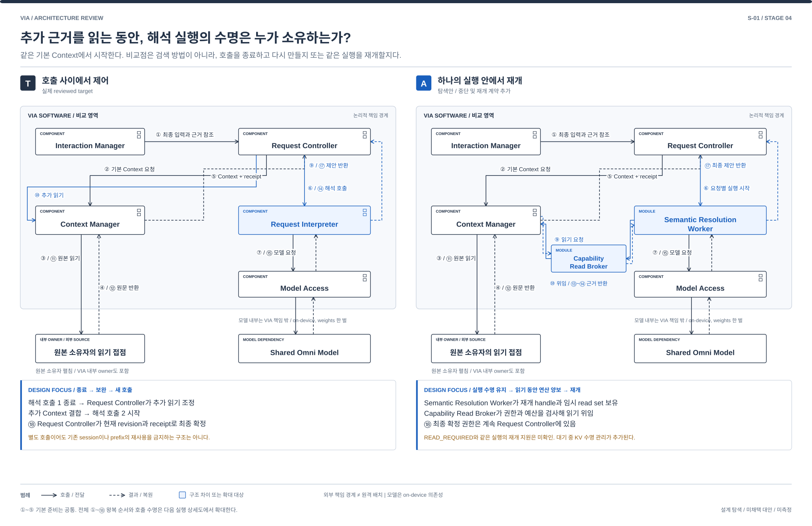

# S-01. 해석 중 근거를 보완하는 실행 구조

> 상태: **STAGE_4_REVIEW_READY / 사용자 리뷰 대기** / 2026-10-01
> [04 전체 지도](./04-00-structural-alternatives.md#s-01) / [품질의 공통 의미](./03-00-quality-scenarios.md#2-어떤-품질을-보고-있는가) / [검토 기록](./04-09-structural-review.md)
> 연결 문제: **P-01, P-03**. S는 탐색 질문이며 DP 선정이 아니다. T는 실제 REVIEWED_BASELINE, A/B는 미채택 탐색안이다.

## 1. 어떤 상황에서 필요한 선택인가

> “아까 그 자료를 김 팀장에게 보내줘.” 자료 후보를 읽어 보니 수신자까지 다시 확인해야 한다.

**추가 근거가 필요할 때 중간 해석 제안을 반환한 뒤 다시 호출할지, 읽기 지점에서 멈춘 실행을 이어갈지 비교한다.**

## 2. 먼저 볼 차이

| 비교 지점 | T: 실제 target | 대안 A |
| --- | --- | --- |
| 핵심 실행 | Request Controller가 중간 제안과 추가 읽기, 다음 호출을 조정 | Worker가 READ_REQUIRED handle을 보유하고 근거 주입 후 실행 재개 |
| 중간 상태 | host의 입력 및 read set과 Model Access의 session/KV | host 최종 확정은 유지, Worker의 재개 handle과 pinned KV 수명 추가 |
| 가장 큰 교환 | 단발 호출 계약으로 제어, Context 재조립 비용 가능 | 재개 계약으로 연결 경계 변경, runtime 지원과 대기 KV 비용 필요 |

## 3. 구조를 나란히 보기

[그림 크게 보기](./diagrams/stage4-s01-comparison.svg) / [편집 가능한 draw.io](./diagrams/stage4-s01-comparison.drawio)

파란색은 달라지는 책임, 자료 또는 실행 경로이며 추천 표시가 아니다. 검정은 공통으로 남는 책임이다. 박스는 논리 구성 또는 명시한 runtime이며 OS process와 같다는 뜻은 아니다. 점선 화살표의 의미는 그림의 개별 label을 따른다. 그림은 이 질문의 경계를 보여주며 전체 VIA 배치도가 아니다.

## 4. 같은 요청을 따라가 보기

| 사건 | T: 실제 target | 대안 A |
| --- | --- | --- |
| 처음 요청 | Request Controller가 기본 Context를 준비하고 Request Interpreter를 호출 | Request Controller가 허용 scope와 예산으로 Worker 작업을 시작 |
| 자료 부족 | 중간 제안을 반환한 뒤 host가 Context Manager에 읽기를 요청 | runtime이 READ_REQUIRED를 내며 연산을 양보. Broker가 실제 읽기를 검사 |
| 근거 확보 | host가 새 Context를 조립해 다음 semantic 호출 | Worker가 같은 revision의 receipt와 근거를 handle에 주입 |
| 최종 확정 | Request Controller가 최신 입력과 근거를 검사해 확정 | 같은 Request Controller가 최종 proposal을 검사해 확정. Worker는 실행 승인 불가 |

## 5. 누가 무엇을 소유하고 어떻게 실패하는가

### T — 실제 reviewed target

P-01/03의 “아까 그 자료를 김 팀장에게 보내줘”에서 대상 자료와 수신자 단서가 서로 영향을 줄 수 있다. Target은 Request Controller → Context Manager의 기본 준비 → Request Interpreter의 제안 → 필요 시 Request Controller → Context Manager → Request Interpreter 순이다. Request Interpreter는 도구와 확정 권한이 없는 제안자다. 기본 자료 준비는 입력과 겹칠 수 있으며, target이 모든 조회를 매번 처음부터 직렬 실행하는 것은 아니다. 현재 정책은 입력 revision당 semantic 총 2회와 추가 읽기 한 묶음이다. [구조 §6~7](../target-architecture/architecture.md), [제어 §3](../target-architecture/control-and-lifecycle.md#3-core-해석읽기응답-예산).

### 대안 A — 읽기에서 중단하고 재개하는 해석 실행체

Semantic Resolution Worker가 하나의 요청에 대한 임시 field와 read set, 모델 실행의 읽기 continuation을 가진다. 이 스케치에서는 Model Access를 통해 runtime이 최종 semantic proposal을 끝내기 전에 `READ_REQUIRED`와 재개 handle을 반환하는 계약을 제안한다. 실행은 그 지점에서 연산 점유를 양보하고, Capability Read Broker가 현재 Policy Manager의 권한과 읽기 예산을 검사한 뒤 Context Manager의 source/owner read port에서 근거를 가져온다. Worker는 동일 input revision과 receipt에 묶인 근거만 handle에 넣어 실행을 재개하고, 마지막에 최종 proposal을 Request Controller에 반환한다. 대기 중 KV를 유한 범위로 보관하며 회수되거나 handle이 무효하면 재개 실패로 처리한다. Request Controller는 현재 입력 revision, 질문과 권한을 확인하고 최종 commit한다. Worker에는 Agent 업무 실행, 외부 변경 또는 자체 승인의 권한이 없다. 이 스케치는 local Core 안의 독립 실행 수명과 계약을 가진 작업으로 두며, 별도 process의 장애 격리 이익을 가정하지 않는다.

| 실행과 상태 | T와 다른 점 및 비용 |
| --- | --- |
| 정상 보완 | host가 해석 제안과 다음 호출을 번갈아 조정하는 대신 Worker가 근거 보완의 중간 실행을 지속한다. 중간 proposal 종료 → host의 다음 Context 조립 → 새 semantic 호출이라는 의존 경계를 runtime의 중단 및 근거 주입 후 재개로 대체한다. 읽기 권한 검사와 broker 호출은 남는다. |
| 책임의 교체 | Request Interpreter의 단발 제안 계약을 Worker와 Model Access의 양방향 중단 및 재개 계약으로 대체한다. Request Controller의 최종 확정과 입력 hold는 유지하되 상세 읽기 continuation은 소유하지 않는다. 같은 함수를 다른 파일로 옮기는 안이 아니다. |
| 정정과 철회 | 새 입력 revision이나 정책 epoch에서 Worker 결과를 폐기한다. Broker는 시작뿐 아니라 실제 읽기와 결과 사용 때 유효성을 확인한다. 이미 반환된 자료의 사용과 KV도 차단한다. 이전 session을 새 요청의 권한으로 재사용하지 않는다. |
| 실패와 복구 | 임시 continuation은 권위 업무 상태가 아니다. Worker crash 뒤 현재 Request에서 읽기를 재시도하거나 사용자에게 한계를 알린다. 읽기 실패와 부분 coverage를 남긴다. 동일 input revision의 누적 읽기 및 semantic 연산 예산과 deadline은 Request Controller와 Broker의 예산 기록에 남겨 Worker 재시도로 초기화하지 않는다. 유한 예산에서 종료한다. 최종 commit과 Action 전송은 host의 내구 경계를 따른다. |
| 지원 목표와 U | 조건 보완과 정정 기능은 유지 목표. 중단 및 재개 가능한 read callback, 근거 주입, 격리 session, 취소와 receipt 전달은 U-03/04/07/08로 미확인이다. 기능 없는 runtime을 wrapper 이름만으로 보완했다고 하지 않는다. |

이 안의 핵심은 **완료된 중간 제안과 새 호출 사이를 host가 잇는 구조를, 중단 및 재개 가능한 실행 계약으로 바꾸는 것**이다. session과 KV 격리는 target에도 있다. Target의 cache 및 prefix 재사용이 불가능하거나 A가 prefill을 반드시 줄인다고 가정하지 않는다. 동일한 호출, Context와 예산을 유지한 채 제어 코드만 Worker로 옮겼다면 별도 구조 효과의 근거가 없다. 제안한 runtime 계약을 확보하지 못하면 그 차이는 성립 미확인으로 남긴다. 05에서는 공통 읽기 및 연산 예산으로 구조와 예산 효과를 구별하며 API 호출 수가 줄었다고 연산 예산까지 줄었다고 세지 않는다. 같은 모델의 반복 검토는 독립 정답 검증이 아니다.

### 참고 자료를 대조하며 구체화한 경계

| 대안 A에서 고정할 실행 경계 | 스케치 |
| --- | --- |
| 재개 handle | Request ID, input revision, model build/session, 허용 read scope와 누적 예산에 결합. 재시도 handle을 다른 요청으로 재사용하지 않음 |
| 읽기 실패와 예산 소진 | timeout, 거부, 부분 coverage를 같은 실행에 전달하거나 종료. 더 읽을 권한을 모델이 스스로 확대하지 않음 |
| 양보와 취소 | READ_REQUIRED 대기는 모델 연산을 붙잡지 않음. KV를 회수하거나 input epoch가 바뀌면 handle을 폐기. 취소된 handle의 근거 주입과 늦은 proposal을 차단 |
| 지원 미확인 | runtime이 내부 실행을 재개하지 못하고 새 호출로만 처리한다면 이 스케치의 차이는 성립 미확인. wrapper만 추가한 안을 같은 대안으로 주장하지 않음 |

## 6. 품질 차이는 어디에서 생기는가

아래는 T에 대한 대안의 조건부 인과다. V-01~13의 의미와 우선순위는 03을 따르며 새 지표나 측정 결과가 아니다. V-02는 목표 달성을 돕는 적절성과 불필요한 사용자 수고를 함께 보며 되묻기 횟수만을 뜻하지 않는다. 필요한 확인과 승인은 단순 감점하지 않는다. V-04/05는 VIA 귀속 시간이며 Agent 내부 실행과 사람의 대기는 외부 조건으로 구별한다. 기능 손실과 미확인은 평가에서 지우거나 동등으로 취급하지 않는다.

| 관점 | A에서 확인할 품질 경로와 조건 |
| --- | --- |
| V-01 기능 정확성 | 읽기 결과를 잇는 중간 상태가 조건 보완을 도울 수 있다. 반대로 오래된 임시 field나 부적절한 읽기 계획이 오류를 이어갈 수 있어 최종 read set 검증이 필요하다. |
| V-02 기능 적절성 | 필요한 추가 자료를 스스로 확보하면 사용자 재선택을 줄일 수 있다. 근거가 모호한 경우의 질문까지 없애지는 않는다. |
| V-03 기능 완전성 | 02 P-01/03 기능을 유지하는 설계 목표. callback 미지원과 접근할 수 없는 source는 실제 지원 미확인 또는 제한으로 남긴다. |
| V-04 상호작용 반응성 | 중간 제안 종료와 host 재제출 대기를 줄일 가능성이 있으나 실제 이득은 미확인이다. Worker의 긴 실행이나 점유로 질문과 정정 응답이 늦어질 수 있다. 입력 stop은 이 실행체 밖에 둔다. |
| V-05 VIA 귀속 요청 완료 시간 | 재개 계약이 줄이는 재조립 및 재호출 비용과 broker 읽기, KV 보관, handle 무효 뒤 재처리 비용을 함께 본다. Agent 업무 시간을 단축한다는 주장은 없다. |
| V-06 자원 활용성과 수용량 | 읽기 대기 중의 pinned KV, 동시 Worker와 broker 비용을 본다. Target에도 session/KV가 있으므로 전체 KV를 A의 순증가로 세지 않는다. weights는 공유하며 Worker마다 모델을 만들지 않는다. |
| V-07 결함 허용성과 복구성 | 임시 작업만 폐기할 수 있지만 긴 읽기 진행은 잃는다. 재시도 가능 읽기와 commit 이후 효과를 구별한다. |
| V-08 변경 용이성과 모듈성 | read callback 형식 변경은 Worker, Broker와 Model Access에 걸친다. source 형식은 기존 Context Manager port로 흡수할 수 있으나 의미 변화까지 자동 격리되지는 않는다. |
| V-09 분석 및 시험 용이성 | read plan, receipt, input revision과 최종 proposal 연결이 필요하다. 하나의 긴 모델 session 내부만 보이면 오히려 원인 분리가 어렵다. Broker의 지연과 잘못된 revision, 재개 handle 무효를 통제할 시험 경계가 필요하며 runtime 지원은 미확인이다. |
| V-10 기밀성 | 지속 session과 중간 읽기에 자료가 더 남을 수 있다. 현재 정책 검사, 철회와 KV 폐기까지 비용에 넣는다. |
| V-11 상호운용성과 공존성 | callback 계약 의존성이 늘고 긴 추론이 다른 앱과 자원을 공유한다. 지원되지 않는 모델에 동등 연동을 가정하지 않는다. |
| V-12 조작 용이성과 사용자 오류 방지 | 실제 제시된 질문에 답을 연결하는 host 규칙은 유지한다. 늦은 Worker 질문이 새 질문 focus를 덮지 않도록 한다. |
| V-13 설치 용이성 | Worker와 Broker의 배포 및 호환 확인이 생긴다. 같은 제품에 묶을 수 있지만 설치 부담의 실제 크기는 미확인이다. |

## 7. 어떤 조건에서 더 살펴볼 만한가

연쇄적인 근거 보완이 있는 조건과 기본 Context만으로 끝나는 조건을 나눈다. target도 같은 정도로 상태를 재사용하거나 Context 재조립 비용이 작고 대기 KV 유지 및 잘못된 읽기가 더 비싸면 이점 가설은 약해진다. 실제 runtime이 같은 실행의 중단과 재개를 지원하지 않으면 이 구조 스케치는 그대로 실현되지 않는다.

같은 QA는 모든 DP와 모든 방안에서 동일한 정의, 지표와 측정 방법을 사용한다. 이 문서의 시험 경계는 후속 검토 대상이며 구현이나 측정 freeze가 아니다. 05의 정식 비교와 강한 방안 2 선정은 사용자 리뷰 후에 진행한다.

## 8. 기존 자료에서 무엇을 참고했는가

| 참고 자료 | 가져온 검토와 이번 적용 | 그대로 가져오지 않은 것 |
| --- | --- | --- |
| [지속 요청 구조](./durable-request-orchestration.md) | 동일 Request의 누적 예산, activity identity와 늦은 완료 차단을 참고해 Worker의 revision과 재개 handle을 구별 | 긴 사용자 대기용 durable workflow를 짧은 의미 실행에 도입하지 않음 |
| [의미 검색 구조](./semantic-retrieval-subsystem.md) | 읽기 결과의 source revision과 coverage, 원문 사용 전 검사를 Broker receipt에 적용 | Vector Index와 embedding helper는 필요하지 않음. 읽기 실행과 후보 생산은 별개 |
| [복구 원본 구조](./recovery-state-source.md) | 임시 실행의 재생과 이미 확정한 외부 효과의 재실행을 구별 | model continuation을 Domain Journal의 권위 원본으로 저장하지 않음 |
| [음성 근거 구조](./speech-evidence-source.md) | 비동기 API와 실제 동시 진행을 구별. 읽기 대기에 연산을 양보하는 runtime 지원을 U로 남김 | native speech evidence를 이 안의 필수 dependency로 만들지 않음 |
