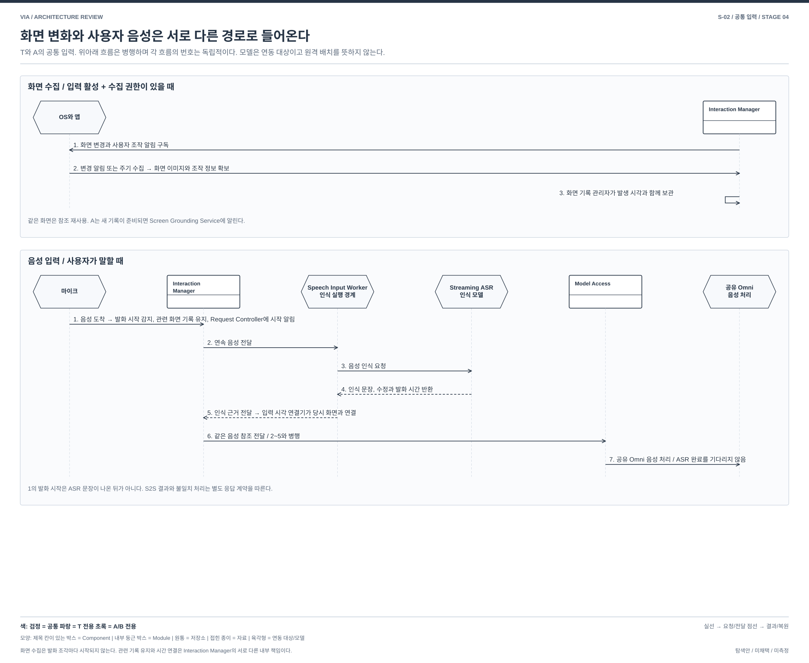
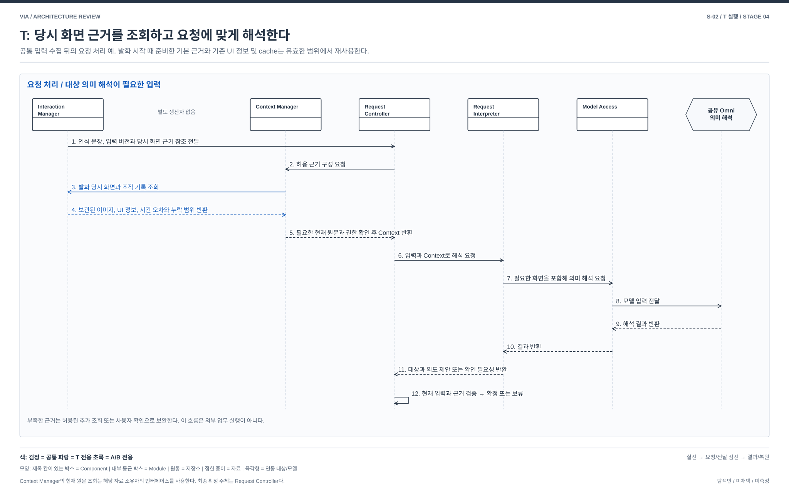
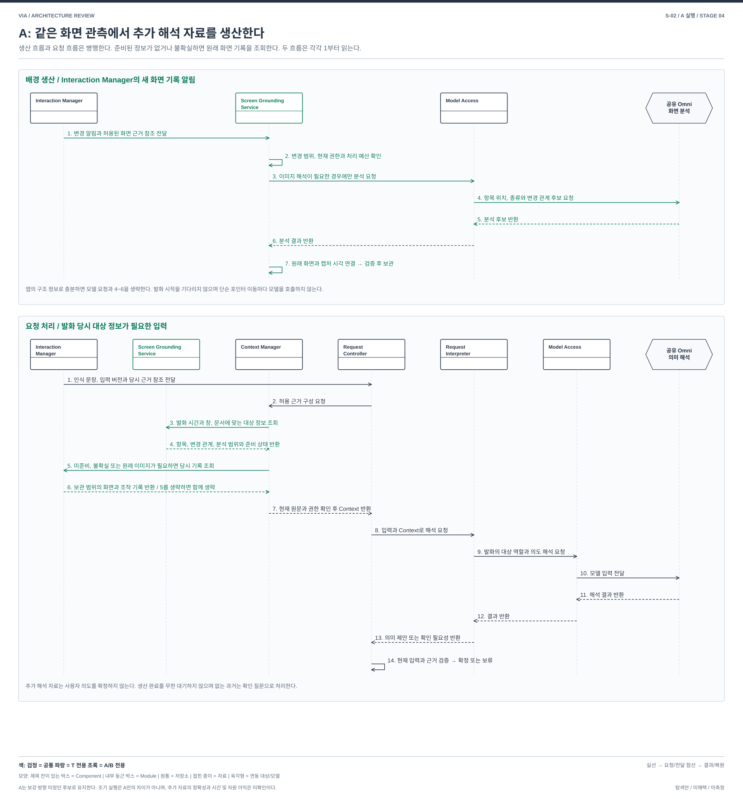

# S-02. 말한 당시의 화면 대상을 언제 파악할 것인가

> 상태: **STAGE_4_REVISED / 사용자 재검토 대기**
> [04 전체 지도](./04-00-structural-alternatives.md#s-02) / [그림 작성 기준](./diagram-design-guide.md) / [품질의 공통 의미](./03-00-quality-scenarios.md#2-어떤-품질을-보고-있는가)
> 연결 문제: **P-02; P-01, P-11, P-14 연결**. T는 검토 완료 target, A는 미채택 탐색안이다. 구현이나 측정 결과가 아니다.

## 1. 배경: 어떤 정보를 연결해야 하는가

사용자가 문서의 표 두 개를 차례로 가리키며 “이 두 개는 남기고, 저것만 바꿔”라고 말한다. 말하는 동안 화면이 스크롤되고 마우스 위치도 바뀐다. 음성 인식 결과는 그 뒤에 도착하거나 수정될 수 있다. VIA는 현재 화면만 보는 대신 **말한 당시 어느 대상을 가리켰는지** 알아내야 한다. 그 대상에 지금도 변경을 적용할 수 있는지는 별도로 확인한다.

### 1.1 사용하는 데이터

이 표는 이후 DP 배경과 발표자료에서도 유지할 입력 설명이다. 수집 권한이 있는 범위만 사용하며, 앱이 제공하지 않는 정보는 모르는 상태로 남긴다.

| 데이터 | 구체적인 예 | 제공 주체와 필요한 이유 |
| --- | --- | --- |
| 화면 이미지와 캡처 시각 | 10:00:01에 보인 표 두 개와 버튼 | Interaction Manager가 OS의 화면 캡처 기능으로 확보. 나중에 화면이 바뀌어도 당시 보인 내용을 확인 |
| 앱, 창과 문서 정보 | 어느 모니터의 어떤 문서 창인지, 스크롤 위치와 문서 버전 | OS와 허용된 앱 연동 기능이 제공. 같은 좌표의 다른 창이나 문서를 혼동하지 않도록 함 |
| 마우스 위치와 이동 기록 | 특정 시각의 포인터 좌표와 드래그 경로 | Interaction Manager가 OS 입력을 수집. 가리킨 후보를 좁히되 시선이나 의도가 확정됐다고 보지 않음 |
| 클릭과 선택 변경 기록 | 클릭한 위치, 선택한 텍스트나 영역, 텍스트 입력 커서 위치 | OS와 앱이 제공. 선택이 유지된 시간과 바뀐 시간을 구별 |
| 화면 구성 정보 | 앱이 제공하는 버튼 이름, 표 영역, 항목 식별 정보 | 지원되는 앱에서 활용. T도 이 정보를 사용할 수 있으며 모든 화면이 제공한다고 가정하지 않음 |
| 사용자 음성과 인식 문장 | 원음 참조, “이 두 개”라는 문장, 실제로 말한 시간, 인식 결과 수정 | 마이크에서 음성을 받고 Speech Input Worker의 Streaming ASR 경로가 문장과 시간 정보를 생산. 문장이 도착한 시간이 아닌 말한 시간에 화면을 연결 |
| 수집 시각과 누락 정보 | 캡처 시각, 도착 시각, 시간 오차, 수집하지 못한 구간 | 각 수집 경로가 제공. 늦게 온 기록을 올바른 위치에 연결하고 없는 과거를 추측으로 채우지 않음 |

화면은 사용자의 조작 없이 앱이 갱신할 수도 있다. 마우스의 모든 이동이나 모든 화면 프레임을 저장하는 설계는 아니다. 화면 캡처 빈도, 포인터 기록 간격, 보관 시간과 메모리 상한은 기기별 설정으로 제한하며 여기서 수치를 정하지 않는다.

### 1.2 이름과 책임을 구별한다

| 그림의 이름 | 역할 |
| --- | --- |
| 화면 관측 수집기 | 화면 변경 알림과 마우스, 클릭, 선택 정보를 받아 필요한 기록을 생성하는 Interaction Manager 내부 모듈 |
| 음성 입력 수집기 | 마이크 음성을 받아 발화 시작을 알리고 음성 처리 경로로 전달하는 Interaction Manager 내부 모듈 |
| 화면 기록 관리자 | 최근 화면 기록의 보관, 필요한 구간 유지, 조회와 해제를 담당하는 Interaction Manager 내부 모듈 |
| 입력 시각 연결기 | 실제 발화 시간과 화면 및 조작 기록의 시간을 맞추는 Interaction Manager 내부 모듈 |
| S2S 입력 연동기 | Interaction Manager 안에서 같은 음성을 Model Access에 전달하고 음성 해석과 응답 후보를 받는 모듈 |
| 음성 인식 연동기 | Model Access의 ASR 연동 모듈. 별도 Speech Input Worker에서 실행하며 Streaming ASR의 문장과 발화 시간 정보를 Interaction Manager로 반환 |
| S2S 모델 연동기와 의미 분석 연동기 | Model Access의 역할별 연동 모듈. 각각 음성 처리와 의미 및 화면 분석을 같은 공유 Omni에 요청하고 결과를 반환 |
| 최근 화면 기록 | 캡처 시각이 기록된 화면 이미지와 마우스, 클릭, 선택 및 앱 정보. 메모리에 임시 보관하는 자료이며 실행 모듈이 아님 |
| 화면 대상 기록 | A가 화면 속 항목에 붙인 임시 식별자, 위치, 종류, 변경 관계와 분석 근거. Screen Grounding Service가 소유하는 파생 자료 |

Target의 `Timeline & Buffer` 책임을 여기서는 **입력 시각 연결**과 **기록 보관 관리**로 구분해 표현한다. 모듈명은 승인된 책임을 읽기 쉽게 나눈 설계 이름이며, 클래스나 crate와 일대일 대응하는 구현 확정은 아니다. 나머지 모듈도 상자에는 이름, 화살표에는 동작을 적는다.

## 2. 실제로 비교할 구조

**T는 요청 해석에 필요한 당시 관측을 가져와 대상을 판단한다. A는 요청과 별도로 화면 대상의 변화 정보를 생산하고, 요청 때 그 정보를 조회한다.** 두 안 모두 화면 관측, 발화 시간 연결과 최종 요청 해석이 필요하다.

| 비교 지점 | T: 요청에 필요한 화면 근거를 해석 | A: 화면 대상 정보를 별도로 생산하고 조회 |
| --- | --- | --- |
| 관측 입력 | Interaction Manager가 화면과 조작 기록을 수집 | T와 같은 종류의 관측을 사용. 더 많은 캡처를 무료로 제공하지 않음 |
| 대상 정보 생산 | Context Manager가 필요한 화면, UI 구조와 원문을 구성하고 Request Interpreter가 요청의 의미를 제안 | Screen Grounding Service가 변경 알림을 받아 요청과 독립적으로 항목과 변경 관계를 생산. Request Interpreter는 그 결과도 사용해 발화 속 역할과 의미를 제안 |
| 생산 시점 | 기본 근거 준비는 발화 시작 때부터 가능. 추가 해석과 조회는 요청 필요에 따라 수행 | 화면 관측이 갱신되면 발화 전에도 생산 가능. 발화 시작이나 단어 도착을 필수 시작 조건으로 삼지 않음 |
| 별도 상태의 소유 | 전용 화면 대상 생산 Component는 없음. 기존 UI 정보와 cache는 활용 | Screen Grounding Service가 분석 대기 작업과 화면 대상 기록의 갱신, 조회, 폐기를 소유 |
| 요청이 기다리는 것 | 필요한 관측 조회와 요청에 따른 해석 | 준비된 대상 정보 조회와 검증. 준비되지 않았으면 원래 화면 기록을 사용하는 경로로 전환 |
| 대안이 대체하는 작업 | 요청에 필요한 화면에서 대상을 파악 | 사전에 충분히 파악한 항목은 요청 시 동일한 항목 추출을 반복하지 않을 수 있음. 발화의 의미 판단과 현재 권한 검사는 계속 수행 |

A는 T의 사용자 기능을 의도적으로 줄이지 않는다. 구조의 차이는 새 Component의 존재만이 아니라 **요청과 독립된 생산 작업, 별도로 갱신되는 상태, 조회 계약, 준비 지연과 실패 처리**에 있다. A가 선택적 결과 cache만 추가하고 생산 책임이나 실행 의존성도 달라지지 않는 구현이라면 이 문서의 독립 구조 대안으로서 차이는 약해진다. 이 질문을 DP로 선발할지는 아직 정하지 않았다.

T도 UI 구조 정보, 기존 cache와 필요한 모델 해석을 사용할 수 있다. T를 매번 이미지부터 전부 다시 분석하는 안으로 만들지 않는다. A의 임시 항목 ID는 외부 앱의 영구 식별자나 사용자 의도 확정이 아니다.

## 3. 구조와 공통 입력 경로

[크게 보기](./diagrams/stage4-s02-comparison.svg) / [draw.io 원본](./diagrams/stage4-s02-comparison.drawio)

검정은 공통, 파랑은 T 전용 경로, 초록은 A에서 추가하거나 달라지는 경로다. 색은 품질 우위를 뜻하지 않는다. 저장소는 수동 자료이고 조회와 반환의 주체는 소유 Component다. 메인 그림은 마이크와 화면 입력, Interaction Manager의 수집 및 시간 연결, Speech Input Worker와 Streaming ASR의 왕복, 병행 S2S, 화면 대상 생산과 최종 요청 해석까지 포함한다. 위쪽 입력, 가운데 화면 처리와 모델 연동, 아래쪽 요청 해석 순으로 읽는다. 추가 흐름도는 이 경로의 실행 순서와 조건을 확대해서 설명하며 메인 그림에서 빠진 경로를 대신하지 않는다. 공유 Omni와 Streaming ASR은 VIA가 연동하는 모델이며 VIA 경계 밖 표시는 원격 실행이라는 뜻이 아니다.

### 3.1 두 안의 공통 수집 과정

[크게 보기](./diagrams/stage4-s02-input-flow.svg) / [draw.io 원본](./diagrams/stage4-s02-input-flow.drawio)

각 흐름의 번호는 해당 흐름 안에서만 사용한다. 화면 수집과 음성 처리는 동시에 진행되므로 두 흐름의 번호를 이어지는 하나의 순서로 읽지 않는다.

**화면 수집 흐름**

1. 입력 기능이 활성화되고 수집 권한이 있으면 Interaction Manager의 화면 관측 수집기가 OS와 앱의 화면 변경 및 사용자 조작 알림을 구독한다.
2. OS나 앱의 알림 또는 제한된 주기 수집 시점이 되면 화면 관측 수집기가 허용된 화면 이미지와 앱, 마우스, 선택 정보를 확보한다. 같은 화면은 기존 이미지 참조를 재사용할 수 있다.
3. 화면 기록 관리자가 발생 시각과 함께 최근 화면 기록을 보관한다. 오래된 불필요 기록은 보관 상한 안에서 회수한다. A에서는 새 기록이 준비됐다는 알림을 Screen Grounding Service에도 전달한다.

**음성 입력 흐름**

1. 사용자가 말하면 마이크가 Interaction Manager의 음성 입력 수집기에 음성을 전달한다. 발화 시작을 감지하면 화면 기록 관리자가 말하기 직전과 발화 중 기록을 처리에 필요한 동안 유지한다. Interaction Manager는 Request Controller에도 입력 시작을 알려 기본 Context 준비를 시작할 수 있게 한다.
2. Interaction Manager가 Speech Input Worker에 연속 음성을 전달한다. Speech Input Worker는 Model Access의 ASR 연동 모듈을 실행하는 별도 인식 실행 경계다. 논리적 Component 소유와 process 배치를 구별한다.
3. Speech Input Worker가 Streaming ASR에 음성 인식을 요청한다.
4. Streaming ASR이 인식 문장, 수정 결과와 발화 시간 근거를 Speech Input Worker에 반환한다.
5. Speech Input Worker가 이 근거를 Interaction Manager에 전달한다. 입력 시각 연결기는 문장이 도착한 시간 대신 실제 발화 시간에 화면과 조작 기록을 연결한다. 시간 오차로 후보가 겹치면 여러 후보를 유지한다.
6. Interaction Manager는 같은 음성 참조를 Model Access에도 전달한다. 이는 2~5의 완료를 기다리는 후속 단계가 아니라 병행하는 S2S 경로다.
7. Model Access가 공유 Omni의 음성 처리 세션에 음성을 제공한다. Omni의 응답 후보와 인식 불일치는 별도 응답 및 입력 검증 계약으로 처리한다. S2S가 정규 인식 문장을 임의로 덮어쓰지 않는다.

ASR의 발화 조각마다 새 화면 캡처나 모델 분석을 시작하지 않는다. 인식 결과가 늦거나 수정돼도 보관한 당시 기록으로 연결한다. 수집 누락, 상한 초과와 시간 오차는 숨기지 않는다. 근거가 부족하면 자동 대상을 확정하지 않고 §6의 확인 수단을 사용한다.

## 4. T의 요청 처리 순서

[크게 보기](./diagrams/stage4-s02-target-flow.svg) / [draw.io 원본](./diagrams/stage4-s02-target-flow.drawio)

예시는 발화가 끝나고 요청을 해석하는 흐름이다. 발화 시작 때 준비한 기본 Context가 있으면 재사용하되, 관련 화면과 입력이 바뀐 부분은 갱신한다.

1. Interaction Manager가 Request Controller에 인식 문장, 입력 버전과 발화 시간에 연결된 화면 근거 참조를 전달한다.
2. Request Controller가 Context Manager에 해당 요청에 허용된 근거 구성을 요청한다.
3. Context Manager가 Interaction Manager에 해당 발화 시간의 화면과 조작 기록을 조회한다.
4. Interaction Manager가 보관한 화면 이미지, UI 정보, 선택과 마우스 기록, 시간 오차와 누락 범위를 반환한다.
5. Context Manager가 필요한 현재 원문과 권한을 확인해 Context를 Request Controller에 반환한다. 필요한 원문은 해당 자료 소유자의 조회 인터페이스에서 얻는다.
6. Request Controller가 Request Interpreter에 입력과 Context를 전달해 해석을 요청한다.
7. Request Interpreter가 Model Access에 의미 해석을 요청한다. 이미 확보한 UI 구조와 cache를 활용하며 필요한 화면 이미지를 포함한다.
8. Model Access가 공유 Omni의 의미 해석 세션에 자료를 전달한다.
9. 공유 Omni가 대상을 포함한 해석 결과를 Model Access에 반환한다.
10. Model Access가 결과를 Request Interpreter에 반환한다.
11. Request Interpreter가 Request Controller에 대상과 의도에 관한 제안 또는 부족한 근거와 확인 필요성을 반환한다.
12. Request Controller가 현재 입력, 사용 근거와 권한을 검증해 의미를 확정하거나 추가 조회와 사용자 확인으로 보류한다. 최종 확정 전 제안을 외부 실행 권한으로 쓰지 않는다.

추가 읽기가 필요하면 Request Controller가 Context Manager의 조회를 허용하고 해석을 다시 요청한다. 호출과 예산 계약은 [target 판단 및 제어](../target-architecture/control-and-lifecycle.md)를 따르며 S-01 대안을 동시에 채택하지 않는다.

## 5. A의 생산과 요청 처리 순서

[크게 보기](./diagrams/stage4-s02-alternative-flow.svg) / [draw.io 원본](./diagrams/stage4-s02-alternative-flow.drawio)

### 5.1 요청과 독립적인 화면 대상 생산

다음은 A의 탐색 계약이다. 기존 target에 구현된 기능으로 해석하지 않는다. 작업 빈도나 인식 정확도 수치는 미확인이다.

1. Interaction Manager의 화면 기록 관리자가 새 기록을 보관하면 Screen Grounding Service에 변경 알림과 허용된 근거 참조를 전달한다. **발화 시작을 기다리지 않는다.**
2. Screen Grounding Service의 분석 작업 관리자가 변경 범위와 현재 권한, 처리 예산을 확인해 작업을 준비한다. 같은 변경을 묶을 수 있지만 관측 시각과 분석하지 못한 구간은 보존한다. 단순 포인터 이동은 위치 연결만 갱신하며 매번 모델 호출로 바꾸지 않는다.
3. 화면 대상 분석기가 앱의 구조 정보만으로 항목과 변경 관계를 갱신할 수 있으면 일반 코드로 처리한다. 이미지 해석이 필요한 새 화면이나 관련 영역의 변화라면 분석 작업 관리자가 Model Access에 해당 이미지와 이전 분석 근거를 전달해 분석을 요청한다. 과거 이미지에서 관측하지 못한 항목을 추정으로 확정하지 않는다.
4. Model Access가 공유 Omni에 화면 속 항목의 위치, 종류와 변경 관계에 관한 후보 생성을 요청한다. 사용자 지시나 외부 작업 실행을 결정하는 호출이 아니다.
5. 공유 Omni가 Model Access에 후보 결과를 반환한다.
6. Model Access가 Screen Grounding Service에 분석 결과를 반환한다.
7. 화면 대상 기록 관리자가 원래 화면의 버전과 캡처 시각, 임시 항목 ID, 관계, 분석 범위와 불확실성을 연결해 게시한다. 게시 직전 권한과 취소 상태를 다시 검사한다. 새 화면 분석이 끝났다고 이전 시점의 기록을 최신 결과로 덮어쓰지 않는다.

구조 정보만으로 처리한 경우 3의 모델 요청과 4~6을 생략하고 7로 간다. 권한이 철회되면 관련 생산과 신규 사용을 중단한다. 입력 비활성이나 OS 잠금에서는 새로운 화면 수집에 따른 생산도 중단한다. 배경 분석은 실시간 입력과 요청 해석의 자원 예산을 침범하지 않는 조건에서만 실행한다.

### 5.2 사용자 요청 처리

1. Interaction Manager가 Request Controller에 인식 문장, 입력 버전과 당시 화면 근거 참조를 전달한다.
2. Request Controller가 Context Manager에 허용된 근거 구성을 요청한다.
3. Context Manager가 Screen Grounding Service에 발화 시간, 창과 문서에 맞는 화면 대상 정보를 조회한다. 발화 시간의 정렬 책임은 Interaction Manager에 남는다.
4. Screen Grounding Service가 해당 시점의 항목과 변경 관계, 원래 화면 참조, 분석 범위와 준비 상태를 반환한다. 준비 안 됨, 분석 누락과 불확실성을 구별한다.
5. 원래 이미지가 해석에 필요하거나 결과가 미준비, 누락 또는 불확실하면 Context Manager가 Interaction Manager에 당시 화면 기록을 조회한다. 해당 정보가 충분하면 이 추가 조회는 생략할 수 있다.
6. Interaction Manager가 보관 범위의 화면과 조작 기록을 반환한다. 없는 과거는 현재 화면으로 대신하지 않는다.
7. Context Manager가 현재 원문과 권한을 확인하고 준비된 대상 정보 및 필요한 원래 근거를 Request Controller에 반환한다. 배경 분석 완료를 무한히 기다리지 않는다.
8. Request Controller가 Request Interpreter에 입력과 Context를 전달한다.
9. Request Interpreter가 Model Access에 요청의 의미 해석을 요청한다. 사전 분석이 충분하면 같은 항목 추출을 반복하지 않을 수 있지만, “남길 것”과 “바꿀 것”의 역할은 발화를 바탕으로 판단한다.
10. Model Access가 공유 Omni의 의미 해석 세션에 자료를 전달한다.
11. 공유 Omni가 해석 결과를 Model Access에 반환한다.
12. Model Access가 결과를 Request Interpreter에 반환한다.
13. Request Interpreter가 대상과 의도의 제안 또는 확인 필요성을 Request Controller에 반환한다.
14. Request Controller가 현재 입력, 사용 근거와 권한을 검증해 확정하거나 보류한다. Screen Grounding Service의 항목 ID 자체를 대상 확정으로 취급하지 않는다.

화면 대상 기록도 메모리에 임시 보관하며 기록 수명, 대기 작업과 메모리 사용에 상한을 둔다. 요청이 사용하는 시점의 기록은 허용된 범위에서 유지하고, 필요한 최소 근거만 기존 보관 정책에 따라 내구 저장할 수 있다. 전체 화면이나 모든 대상 정보를 영구 저장하는 안은 아니다.

A의 준비 상태는 분석 결과의 존재를 말하며 정확성을 보증하지 않는다. 신뢰할 수 없는 준비 결과를 사용하는 오류와, 원본을 매번 다시 분석해 사전 생산 이익이 사라지는 경우를 모두 비교해야 한다.

## 6. 두 안의 공통 확인 수단과 실패 처리

명시 선택은 주 대안을 대체하는 사용 방식이 아니라 **모호함을 해소하는 tactic**이다. Request Interpreter가 확인할 후보와 이유를 제안하고 Request Controller가 대기 질문을 관리한다. Response Manager와 Interaction Manager를 통해 질문을 제시하고 답을 원래 요청에 연결한다.

- 후보를 말로 구별할 수 있으면 “왼쪽 표를 말씀하신 건가요?”처럼 확인한다.
- 말만으로 구별하기 어려우면 클릭, 드래그나 영역 선택을 요청한다. Interaction Manager가 선택 대상과 시각을 기록한다.
- 답변이나 선택 후에도 현재 대상과 권한을 검증한다. 사용자의 모든 요청에 사전 선택을 강제하지 않는다.

| 상황 | T와 A의 처리 |
| --- | --- |
| 늦은 인식 결과나 수정 | 해당 발화 시간과 입력 버전으로 다시 연결. 영향받은 해석을 재검증 |
| 보관 상한 또는 수집 누락 | 근거 부족을 명시하고 자동 확정을 보류. 사용자가 다시 설명하거나 선택하도록 요청 |
| 화면 이동과 내용 변경 | 단순 스크롤 뒤에도 당시 대상은 유지. 대상 자체의 변경이나 삭제는 적용 전에 확인 |
| A의 생산 지연, 실패 또는 오래된 결과 | 원래 기록이 있으면 요청 시 해석으로 전환. 없으면 확인 요청. 원본 보관과 전환 비용도 A의 비용에 포함 |
| 권한 철회와 삭제 | 원래 기록, A의 파생 기록과 진행 중 분석 결과의 신규 사용 차단 및 정리 |
| 재시작 | 두 안의 메모리 임시 기록은 복원되지 않음. 허용된 최소 요청 근거만 내구 보관 가능. 과거 전체 화면이나 모든 항목을 복원한다고 주장하지 않음 |

## 7. 품질 차이와 05에서 확인할 조건

각 관점의 의미는 03과 같고 아래는 조건부 가설이다. 사전 분석을 더 한다는 사실만으로 A의 정확성이 높아지는 것은 아니다. 같은 관측 기회, 모델과 장비 조건에서 요청 중 비용과 요청 밖 비용을 함께 확인한다. V-04/05는 VIA 귀속 시간이며 사용자 확인 대기는 별도 조건, 불필요한 사용자 수고는 V-02로 남긴다.

| 관점 | A와 T를 비교할 경로 |
| --- | --- |
| V-01 기능 정확성 | A의 항목 추적이 반복 지칭을 도울 수 있으나 잘못된 연결과 오래된 분석이 후속 해석을 오염시킬 수 있음. T도 UI 구조와 원래 이미지를 사용하므로 상대 정확성은 미확인 |
| V-02 기능 적절성 | A의 준비가 정확하면 재지칭을 줄일 여지. 잘못된 후보는 확인 부담을 늘림. 질문과 선택 tactic은 두 안에 동일하게 제공 |
| V-03 기능 완전성 | 두 안 모두 자연스러운 복수 지칭 지원 목표. 객체 추적, 구조 정보 없는 화면과 원본 전환의 실제 지원은 미확인. 미지원 사례를 비교에서 제외하지 않음 |
| V-04 상호작용 반응성 | 준비된 대상이 있으면 요청 중 분석을 줄일 수 있음. 배경 작업 경합과 준비 실패는 응답을 늦출 수 있음 |
| V-05 VIA 귀속 요청 완료 시간 | 사전 분석으로 옮긴 작업, 원문 확인, 잘못된 대상 재처리와 원본 전환을 포함. 후보 반환 속도를 최종 완료 시간으로 바꾸지 않음 |
| V-06 자원 활용성과 수용량 | A의 분석 대기열, 대상 기록, 배경 모델 연산과 원본 보관 비용을 함께 계산. 요청이 없는 동안의 작업과 동시 음성 인식 부하도 포함 |
| V-07 결함 허용성과 복구성 | A의 별도 생산 실패와 원본/분석 불일치가 추가됨. 원래 기록으로 전환 가능한 범위와 전환 실패를 확인 |
| V-08 변경 용이성과 모듈성 | A의 UI 정보 형식, 모델 출력 및 대상 기록 형식 변경이 생산, 조회와 검증에 전파. Component 분리만으로 변경 감소를 주장하지 않음 |
| V-09 분석 및 시험 용이성 | 수집 누락, 시간 연결 오류, 사전 분석 오류와 요청 해석 오류를 구별할 근거 필요. 생산 지연, 역순 결과와 삭제 뒤 결과 도착을 통제할 시험 경계 확인 |
| V-10 기밀성 | A의 대상 기록도 보호자료. 원래 이미지와 파생 자료의 허용 범위, 폐기와 늦은 결과 사용 차단을 함께 확인 |
| V-11 상호운용성과 공존성 | 앱별 UI 정보 제공 범위와 모델 연동 지원을 확인. 배경 분석이 음성 처리 및 다른 PC 앱과 자원을 공유하는 영향도 확인 |
| V-12 조작 용이성과 사용자 오류 방지 | 두 안의 질문과 선택에서 실제 후보를 구별할 수 있어야 함. 오래된 대상 표시와 잘못 선택한 대상의 무조건 수락을 방지 |
| V-13 설치 용이성 | A의 생산 Component와 기록 형식 호환 관리가 추가됨. 별도 helper 모델은 현재 안에 포함하지 않으며 필요하면 자원과 설치 비용을 명시해 재검토 |

05에서 같은 화면과 발화로 확인할 조건은 다음과 같다.

- 같은 화면을 반복 지칭하는 상황과, 짧게 나타나 바로 사라지는 화면을 구별한다.
- 앱의 구조 정보가 충분한 경우와 이미지 분석이 필요한 경우를 구별한다.
- 사전 분석이 준비된 경우, 생산이 밀린 경우, 잘못된 결과가 준비된 경우를 모두 남긴다.
- 음성 인식과 의미 해석이 함께 실행될 때의 공유 모델 경합을 포함한다.
- T의 기존 cache와 UI 정보 활용을 보존하고, A에만 더 많은 관측이나 모델 자원을 무료로 주지 않는다.

A가 요청 중 반복 분석을 실제로 줄이지 못하거나, 추가 연산과 오래된 결과 처리 비용이 더 크면 이점 가설은 약해진다. 독립 생산과 상태 관리가 실제 실행 의존성을 바꾸지 못하면 별도 구조 질문으로서의 가치도 재검토한다. 현재 05 비교, QA 지표 확정, 구현과 측정은 시작하지 않는다.

## 8. 기준 문서와 참고 범위

| 자료 | 이 문서에서 사용하는 내용 |
| --- | --- |
| [Target 구조 §9](../target-architecture/architecture.md#9-contextcachestale-처리) | OS/UI 기반 수집, 발화 구간 보관, 요청 시 근거 구성과 현재성 확인 |
| [공유 Omni §3](../target-architecture/shared-omni-runtime.md#3-발화를-받는-경로를-의미-해석과-분리한다) | 마이크 수집, 별도 Streaming ASR, 병행 S2S와 시간 근거 |
| [기억과 Context 수명](../target-architecture/memory-and-context-lifecycle.md) | 선택과 시간 연결, 임시 기록과 허용된 최소 내구 근거의 구별 |
| [기존 음성 근거안](./speech-evidence-source.md) | 발화 시간과 인식 수정, 누락 정보를 구별. S-06을 동시에 채택하지 않음 |
| [기존 의미 검색안](./semantic-retrieval-subsystem.md) | 파생 자료의 원본 버전, 늦은 결과와 삭제 처리. 지속 vector 색인은 도입하지 않음 |
| [기존 복구안](./recovery-state-source.md) | 없는 과거 자료를 사실처럼 복원하지 않는 경계. 전체 화면 영구 기록은 추가하지 않음 |
| [기존 지속 요청안](./durable-request-orchestration.md) | 현재 입력과 연결된 결과만 적용. 화면 분석을 장기 업무 workflow로 만들지 않음 |
