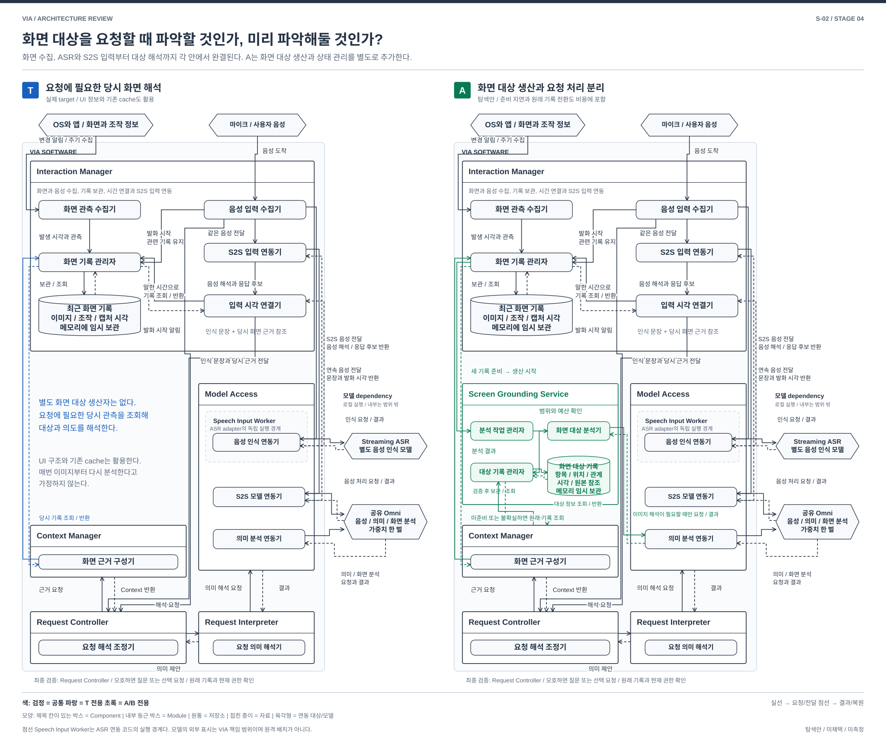

# S-02. 말한 당시의 화면 근거를 만드는 구조

> 상태: **STAGE_4_REVIEW_READY / 사용자 리뷰 대기** / 2026-10-01
> [04 전체 지도](./04-00-structural-alternatives.md#s-02) / [품질의 공통 의미](./03-00-quality-scenarios.md#2-어떤-품질을-보고-있는가) / [검토 기록](./04-01-structural-review.md)
> 연결 문제: **P-02; P-01, P-11, P-14 연결**. S는 탐색 질문이며 DP 선정이 아니다. T는 실제 REVIEWED_BASELINE, A/B는 미채택 탐색안이다.

## 1. 어떤 상황에서 필요한 선택인가

> “이 두 개는 남기고, 저것만 바꿔.” 말하는 동안 선택과 화면이 바뀌고 전사는 나중에 수정된다.

**과거 화면의 원시 관측을 나중에 해석하는 T, 객체 이력을 미리 만드는 A, 명시 선택만 받는 B를 비교한다.**

## 2. 먼저 볼 차이

| 비교 지점 | T: 실제 target | 대안 A | 대안 B |
| --- | --- | --- | --- |
| 핵심 자료 | 시점별 원시 화면과 선택 timeline | 미리 만든 객체 및 관계 이력 + 제한된 원시 fallback | 사용자가 봉인한 Capture Package |
| 준비 시점 | OS/UI 사건과 유한 sampling으로 먼저 관측 | 허용 화면을 관측하고 요청 전 객체 후보까지 생산 | 사용자가 명시적으로 선택한 시점에만 자료 획득 |
| 기능과 비용 | 자연 지칭 유지 목표, 시간 결합과 해석 비용 | 자연 지칭 유지 목표, producer와 vision 비용 추가 | 연속 자연 지칭 포기, 자원 감소 여지와 사용자 선택 부담 |

## 3. 구조를 나란히 보기

[그림 크게 보기](./diagrams/stage4-s02-comparison.svg) / [편집 가능한 draw.io](./diagrams/stage4-s02-comparison.drawio)

파란색은 달라지는 책임, 자료 또는 실행 경로이며 추천 표시가 아니다. 검정은 공통으로 남는 책임이다. 박스는 논리 구성 또는 명시한 runtime이며 OS process와 같다는 뜻은 아니다. 점선 화살표의 의미는 그림의 개별 label을 따른다. 그림은 이 질문의 경계를 보여주며 전체 VIA 배치도가 아니다.

## 4. 같은 요청을 따라가 보기

| 사건 | T: 실제 target | 대안 A | 대안 B |
| --- | --- | --- | --- |
| 말하기 전 | 유한 pre-roll과 UI/선택 사건을 RAM에 보관 | 같은 종류 관측에서 객체 이력을 미리 생산 | 사용자가 먼저 영역/객체를 선택하고 패키지 확정 |
| 발화와 화면 변화 | 발화 구간 관측을 pin하고 시간 오차 및 gap 보존 | 객체 version과 시각을 보존. 늦은 producer는 gap으로 표시 | 선택 패키지 밖의 화면 이동은 추적하지 않음 |
| 늦은 전사 도착 | 당시 관측과 전사를 결합해 후보 해석 | 당시 객체 이력에 결합하고 필요한 원시 근거 확인 | 발화와 지정 패키지만 연결. 과거 복수 지칭은 미지원 |
| 적용 전 | 과거 관측과 현재 Action 대상의 유효성을 따로 검사 | 객체 ID를 source 영구 ID로 오인하지 않고 현재성 검사 | 사용자가 선택한 자료도 source 변경과 권한을 재확인 |

## 5. 누가 무엇을 소유하고 어떻게 실패하는가

### T — 실제 reviewed target

 P-02의 “이것들은 남기고 저것만 바꿔”는 현재 screenshot 하나로 풀 수 없다. Target의 Interaction Manager는 OS/UI 사건, 유한 sampling, pre-roll, 발화 구간 pin을 RAM timeline에 남긴다. 늦은 전사와 시각 오차를 당시 관측에 연결하고 Context Manager와 Request Interpreter가 자료 및 의미 후보를 만든다. target은 partial transcript의 ‘이거’ token마다 capture를 시작하지 않으며 화면 구조 자료도 활용한다. [기억 §2, 4](../target-architecture/memory-and-context-lifecycle.md), [구조 §9](../target-architecture/architecture.md#9-contextcachestale-처리).

### 대안 A — 사전 객체 이력

Screen Grounding Service가 허용된 UI 사건과 제한된 crop을 받아 window/document, 객체, 영역, 선택과 version을 가진 파생 이력을 만든다. 구조 정보가 없으면 공유 Omni의 별도 vision session으로 객체 후보를 생산한다. 이 추가 추론과 자원은 공짜가 아니다. 전용 모델이 필요하다고 밝혀지면 helper 비용과 설치를 추가 검토하며 현재 안에 숨겨 두지 않는다. 발화 시점에는 원시 화면을 처음 해석하기보다 준비된 객체 이력에 결합하고 필요한 원문을 확인한다.

A는 발화 뒤 수행하던 지칭 준비의 일부를 별도 producer와 Derived Object Store로 옮긴다. 이 스케치에서 객체 이력은 유한 RAM에 두고, 요청에 채택한 최소 객체 근거와 source 참조만 허용 범위에서 내구 보관한다. 화면 전체의 영구 객체 DB를 추가한 안은 아니다. 객체 ID는 외부 앱의 영구 ID와 같다고 가정하지 않는다. source revision, 시간 오차, confidence, gap과 원시 근거 참조를 보존하고 제한된 RAM 원시 buffer를 fallback으로 유지한다. 재시작 후 오래된 객체를 현재 화면으로 재사용하지 않으며, 허용된 durable 자료가 없는 과거는 복원 불명이다. producer가 늦으면 최신 객체가 아니라 해당 시점의 가용 근거를 사용하거나 재지칭을 요청한다. 삭제와 권한 철회는 객체 이력과 생성 중 작업까지 전파한다.

### 대안 B — 명시 Capture Package

사용자가 영역 또는 객체를 선택하고 ‘이 자료로 요청’하는 시점에 UI/문서 identity, revision, timestamp, crop을 한 묶음으로 봉인한다. 이후 발화는 그 패키지의 대상만 참조한다. 연속 화면 이력 producer와 자연스러운 과거 지칭 결합을 제거한다. 패키지는 허용 수명 안에서 요청 근거로 보관하고 source 변경 시 적용 가능성을 다시 확인한다. crash 뒤 남지 않은 선택은 사용자가 다시 만든다. 접근 거부나 source 불명은 패키지 성공으로 표시하지 않는다.

| 지원 범위 | T | A | B |
| --- | --- | --- | --- |
| 말하면서 여러 대상을 가리킨 당시 관계 | 지원 설계, U-01/02/03 필요 | 지원 목표. 객체 추적과 시간 정렬 능력 미확인 | 미지원. 명시 선택한 묶음만 지원 목표 |
| 구조 정보가 없는 화면 | 시각 근거 사용 설계 | vision producer와 fallback의 실제 지원 미확인 | 명시 crop은 가능 목표, crop 안의 의미 해석은 여전히 미확인 |
| 늦은 전사와 화면 변경 | pin된 근거 범위에서 연결 | 당시 객체 이력과 제한된 원시 근거 범위에서 연결 목표 | 지정 패키지 연결만 가능. 선택 전 이동과 역할 변화는 복원하지 않음 |
| 사용자 우회 | 필수 근거가 없으면 재지칭 | producer 실패나 모호함에서 재지칭 | 사용자가 매번 자료를 미리 선택. 자연스러운 연속 지칭 목표를 완전히 대체하지 못함 |

### 참고 자료를 대조하며 구체화한 경계

| 생산과 적용 경계 | A: 객체 이력 | B: Capture Package |
| --- | --- | --- |
| source가 바뀜 | 객체 ID, revision, 관측 시간과 gap을 함께 게시. 일부 갱신을 완전한 장면으로 사용하지 않음 | 선택 시점의 근거는 보존하되 현재 Action 적용 가능성은 새로 확인 |
| 늦은 생산과 철회 | 작업 시작 때 epoch뿐 아니라 게시 및 사용 때 현재 epoch 확인. 철회 뒤 완료한 객체를 재사용하지 않음 | 패키지의 읽기 허용이 외부 제공 허용을 뜻하지 않음. 사용 때 다시 검사 |
| raw fallback | producer 실패 시 보존한 구간 안에서만 원시 자료로 돌아감. 없는 과거 자료를 현재 화면으로 대신하지 않음 | 봉인되지 않은 과거 관측은 없음. 사용자의 재선택이 필요 |
| 저장 범위 | 유한 RAM 객체 이력과 요청에 채택한 최소 내구 근거. 전체 화면 영구 저장 없음 | 명시 선택한 근거만 허용 수명에 따라 보관. 패키지 손실은 별도 표시 |

## 6. 품질 차이는 어디에서 생기는가

아래는 T에 대한 대안의 조건부 인과다. V-01~13의 의미와 우선순위는 03을 따르며 새 지표나 측정 결과가 아니다. V-02는 목표 달성을 돕는 적절성과 불필요한 사용자 수고를 함께 보며 되묻기 횟수만을 뜻하지 않는다. 필요한 확인과 승인은 단순 감점하지 않는다. V-04/05는 VIA 귀속 시간이며 Agent 내부 실행과 사람의 대기는 외부 조건으로 구별한다. 기능 손실과 미확인은 평가에서 지우거나 동등으로 취급하지 않는다.

| 관점 | A: 사전 객체 이력 | B: 명시 Capture Package |
| --- | --- | --- |
| V-01 기능 정확성 | 반복 객체 지칭에 일관된 근거를 줄 수 있으나 추적 오류가 후속 요청에 퍼질 수 있음 | 명시 대상은 좁아지지만 사용자의 잘못된 선택과 crop 내 해석 오류는 남음 |
| V-02 기능 적절성 | 준비가 맞으면 재지칭을 줄일 가능성 | 선택, 봉인과 재선택을 사용자에게 요구 |
| V-03 기능 완전성 | 자연 지칭 유지 목표, 실제 객체 추적과 fallback 지원 미확인 | 시간에 따른 자연스러운 복수 지칭을 포기. 공통 요구 목록에서 제거하지 않음 |
| V-04 상호작용 반응성 | 이미 준비된 객체면 결합이 짧아질 수 있으나 producer backlog이면 대기 | 선택 뒤 경로는 짧아질 수 있으나 사전 UI 준비는 사용자 수고. 미지원 안내는 유효 처리 성공이 아님 |
| V-05 VIA 귀속 요청 완료 시간 | 준비 비용 이동과 요청 때 재확인, 추론 경합을 함께 봄 | 연속 관측 비용이 줄 수 있으나 패키지 검증과 재요청 비용을 포함. 사람의 선택 시간은 별도 |
| V-06 자원 활용성과 수용량 | 객체 저장, 갱신, background vision과 raw fallback 비용 추가 | 연속 buffer와 producer 제거 여지, 패키지와 이미지 해석 비용은 남음 |
| V-07 결함 허용성과 복구성 | producer 장애와 객체/raw 불일치 추가. 파생 상태를 재생산하는 비용 | 연속 관측 작업과 임시 상태는 줄지만 UI/Core process와 그 장애 경계는 남음. 보관되지 않은 선택은 잃고 자연 연속 지칭은 미지원 |
| V-08 변경 용이성과 모듈성 | UI schema 변경이 객체 변환과 저장 version까지 전파 | source의 selection/capture API 변화에 의존. 시간 추적 변환은 줄어듦 |
| V-09 분석 및 시험 용이성 | 객체 생성 근거와 발화 결합을 구분해 남기고 producer gap, 시각 오차와 늦은 객체 갱신을 통제할 시험 경계 필요 | 패키지 생성 뒤 source 변경과 권한 철회를 통제해 판정할 수 있어야 함. 원래 자연 지칭의 실패 자료가 사라지는 한계는 남음 |
| V-10 기밀성 | 객체 이력도 보호자료이며 raw와 함께 철회 및 삭제 필요 | 수집 시점과 범위가 좁지만 선택 패키지의 보관과 제공 권한 검사는 필요 |
| V-11 상호운용성과 공존성 | UI 구조 지원 차이, background vision의 다른 앱 경합 | 선택 API 지원과 수동 crop 대체 범위에 의존. 연속 부하는 줄어들 여지 |
| V-12 조작 용이성과 사용자 오류 방지 | 오래된 객체를 현재 선택처럼 보여주지 않아야 함 | 선택 확정이 눈에 보이나 잘못 봉인한 대상을 그대로 쓸 위험 |
| V-13 설치 용이성 | producer와 파생 저장 version 관리 추가. 현재 별도 helper 미포함 | 기존 UI 기능으로 구현 가능 목표. OS capture 권한 설정 부담은 남음 |

## 7. 어떤 조건에서 더 살펴볼 만한가

A는 지칭 전에 자료가 준비될 수 있고 객체 변화가 추적 가능한 조건에서 강하다. 짧게 나타나는 화면, 빠른 변화, 자원 포화에서는 그 전제가 무너질 수 있다. B는 의도적인 기능 제한안이다. 선택 작업이 실제 사용 목표를 지나치게 방해하면 자원 이익이 있어도 V-02/03의 손실이 크다. 양안 모두 U-01/02/03/04/07/08을 확인해야 한다.

같은 QA는 모든 DP와 모든 방안에서 동일한 정의, 지표와 측정 방법을 사용한다. 이 문서의 시험 경계는 후속 검토 대상이며 구현이나 측정 freeze가 아니다. 05의 정식 비교와 강한 방안 2 선정은 사용자 리뷰 후에 진행한다.

## 8. 기존 자료에서 무엇을 참고했는가

| 참고 자료 | 가져온 검토와 이번 적용 | 그대로 가져오지 않은 것 |
| --- | --- | --- |
| [음성 근거 구조](./speech-evidence-source.md) | sample 시각, revision, watermark와 gap을 지칭 결합의 입력으로 구별 | 인식 producer를 바꾸는 S-06을 동시에 채택하지 않음 |
| [의미 검색 구조](./semantic-retrieval-subsystem.md) | 파생 자료의 source revision, 늦은 생산 결과와 삭제 epoch 검사를 객체 이력에 적용 | 지속 vector corpus는 도입하지 않음. 객체 이력은 유한 RAM 중심 |
| [복구 원본 구조](./recovery-state-source.md) | 원본이 없는 파생 자료를 재생만으로 사실처럼 복원하지 않음 | 화면 전체 journal이나 무기한 원시 기록은 추가하지 않음 |
| [지속 요청 구조](./durable-request-orchestration.md) | 현재 input revision에 연결된 결과만 받아들이는 경계 참고 | 객체 추적을 장기 목표 workflow로 만들지 않음 |
