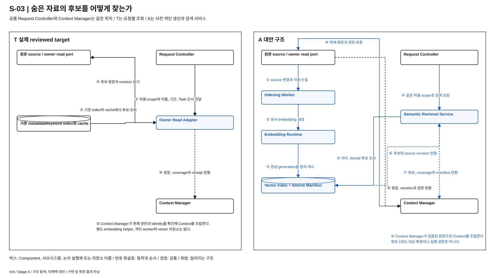

# S-03. 숨은 자료를 발견하는 구조

> 상태: **STAGE_4_REVISED / 사용자 재검토 대기** / 2026-10-01
> [04 전체 지도](./04-00-structural-alternatives.md#s-03) / [설명과 그림의 공통 원칙](./04-00-structural-alternatives.md#12-처음-읽는-사람을-위한-설명과-그림-원칙) / [품질의 공통 의미](./03-00-quality-scenarios.md#2-어떤-품질을-보고-있는가) / [검토 기록](./04-09-structural-review.md)
> 연결 문제: **P-03; P-10~12, P-15 연결**. S는 탐색 질문이며 DP 선정이 아니다. T는 실제 REVIEWED_BASELINE, A/B는 미채택 탐색안이다.

## 1. 어떤 상황에서 필요한 선택인가

> “전에 비용 줄이자고 이야기했던 자료 찾아줘.” 파일명에는 ‘운영 개선’만 있고 비슷한 문서도 있다.

**T의 원본 조회와 기존 index/cache에, A의 지속 의미 후보 생산 서브시스템을 추가할 가치가 있는지 본다.**

## 2. 먼저 볼 차이

| 비교 지점 | T: 실제 target | 대안 A |
| --- | --- | --- |
| 후보 생산 | Context Manager의 owner 조회와 metadata/keyword index | Semantic Retrieval Service의 의미 후보 + 기존 조회 fallback |
| 추가 상태 | 기존 revision cache와 summary | Vector Index, Source Manifest, embedding build와 generation |
| 가장 큰 교환 | 사전 의미 색인 비용 없음, 표현 차이에 따른 후보 누락 가능 | 주제 지칭에 유리할 여지, 추가 helper와 갱신/삭제 비용 |

## 3. 구조를 나란히 보기

[그림 크게 보기](./diagrams/stage4-s03-comparison.svg) / [편집 가능한 draw.io](./diagrams/stage4-s03-comparison.drawio)

검정은 공통, 파랑은 T 전용, 초록은 A/B 전용 구성과 경로다. 제목 칸이 있는 상자는 Component이며 내부의 둥근 상자는 그 Component의 Module이다. 원통은 저장소, 접힌 종이는 자료, 육각형은 내부를 펼치지 않은 연동 대상이나 모델이다. 실선은 요청과 전달, 점선 화살표는 결과와 복원이다. 색과 모양의 뜻은 [설계도 작성 기준](./diagram-design-guide.md)을 따른다. 이 그림은 비교할 책임을 펼친 것이며 전체 배치도나 구현 확정이 아니다.

## 4. 같은 요청을 따라가 보기

두 안 모두 Request Controller가 Context Manager에 허용 scope와 자료 단서를 전달하고, Context Manager가 검증한 원문과 receipt를 반환한다. 아래 번호는 이 공통 호출 내부의 후보 발견과 원문 확인을 펼친 것이다. Owner Read Adapter는 Context Manager의 source 연동 Module을 표현한 이름이며 별도 target Component가 아니다. 그림에서는 이 Module을 Context Manager 안에 두고 쉬운 이름인 ‘원본 조회 연동’으로 표시한다. A의 점선 Subsystem은 Semantic Retrieval Service, Indexing Worker와 Embedding Runtime이라는 대안 Component를 묶는다. 각각의 내부 처리만 Module로 표시하며, 별도 process 배치는 전제하지 않는다. 그림 아래의 원본은 내부 owner와 외부 source를 함께 펼친 참조다.

| 흐름 | T: 실제 target | 대안 A |
| --- | --- | --- |
| 요청 전 준비 | 별도 의미 색인을 만들지 않는다. 기존 metadata/keyword index와 cache는 유지한다. | ① Indexing Worker가 허용 source의 변경과 삭제를 수집한다. ② Embedding Runtime이 문서 표현을 만든다. ③ 완성된 Vector Index와 Source Manifest generation을 원자 게시한다. |
| 후보 검색 | ① Context Manager가 내부 조회 모듈에 허용 scope와 이름, 기간, Task 단서를 전달한다. ② 조회 모듈이 기존 index와 cache에서 후보를 얻어 Owner Read Adapter의 원문 확인으로 연결한다. | ④ Context Manager가 Semantic Retrieval Service에 같은 허용 scope를 보낸다. ⑤ Service가 의미 후보와 lexical 후보를 조회한다. ⑥ Vector Index가 후보와 source revision을 Service에 반환한다. ⑦ Service가 후보, coverage와 manifest를 Context Manager에 반환한다. |
| 원문 확인과 Context 조립 | ③ Owner Read Adapter가 후보 원문과 revision을 source에서 읽는다. ④ 원문, coverage와 receipt를 Context Manager에 반환한다. ⑤ Context Manager가 현재 권한과 identity를 확인해 Context를 조립한다. | ⑧ Context Manager가 후보 source에 현재 원문과 권한을 요청한다. ⑨ source가 원문, revision과 권한을 반환한다. ⑩ Context Manager가 검증된 원문으로 Context를 조립한다. 후보 1위도 대상 확정이나 실행 권한은 아니다. |

## 5. 누가 무엇을 소유하고 어떻게 실패하는가

### T — 실제 reviewed target

 P-03의 “전에 이야기한 고객 이탈 분석 자료”는 정확한 파일명이 아닐 수 있다. Target의 Context Manager는 owner read port, source adapter, metadata/keyword index, revision cache와 파생 summary를 사용한다. 기본 embedding 모델과 vector DB는 없다. source의 내용, 권한, 부분 coverage를 receipt로 남긴다. 따라서 이 비교는 ‘검색 없음 대 검색 있음’이 아니다. [기억 §1~3](../target-architecture/memory-and-context-lifecycle.md), [02 P-03](./02-00-requirements-and-choices.md#p-03).

### 대안 A — 지속 의미 검색 서브시스템

Indexing Worker가 지속 가공과 보관이 허용된 유한 collection의 자료와 revision을 읽고 Embedding Runtime이 의미 표현을 만든다. Vector Index와 source manifest가 파생 자료를 보관하며 Semantic Retrieval Service가 요청의 후보를 생산한다. Context Manager는 후보의 현재 source, 권한, identity와 필요한 본문을 다시 확인한다. 의미 검색 결과는 확정 대상이나 전체 coverage 증명이 아니다. 한정 조회 뒤 여러 후보가 남으면 질문한다.

추가 embedding helper는 역할, weights, runtime, CPU/accelerator, 갱신과 설치 비용을 모두 공개할 별도 dependency다. 이를 shared Omni의 무료 기능으로 계산하지 않는다. 색인이 없는 최초 요청과 갱신 중 요청에는 target의 metadata/keyword 및 source 조회 경로를 fallback으로 유지한다. 따라서 구성 단순화가 아니라 **발견 기능과 준비 비용의 교환**이다.

색인 commit은 source revision과 자료 사용 epoch에 묶는다. 늦은 갱신이 삭제 자료를 되살리지 못하게 tombstone과 purge 작업을 적용한다. index 손상은 원본 복구와 구별해 재구축하고 그동안 fallback의 지원 한계를 알린다. 외부 source가 revision이나 삭제 확인을 제공하지 않는 범위는 freshness와 coverage 미확인으로 남긴다. helper의 검색 품질, source connector와 삭제 전파의 실제 동작은 U-03/04/07/08로 미확인이다.

### 참고 자료를 대조하며 구체화한 경계

| 대안 A의 추가 계약 | 구체 처리 |
| --- | --- |
| 색인 게시 | source ID, revision, chunk span, policy epoch, embedding build와 generation을 결합. 새 generation이 완성된 뒤 manifest pointer와 원자 게시. 부분 생성은 검색에 노출하지 않음 |
| query와 문서 | 같은 embedding build로 query와 document vector를 생성. build 교체 중 서로 다른 표현 공간을 섞지 않고 재색인 또는 이전 generation 사용의 한계를 표시 |
| 변경 발견 | source change feed가 있으면 사용하고 없으면 유한 revision scan. 변경 발견 전 지연은 남으며 소비 직전 원문 검증을 대체하지 못함 |
| 후보 한 건 또는 없음 | top-1은 대상 유일성 증명이 아니며 결과 없음도 원본 없음이 아님. 허용된 범위의 owner 조회나 사용자 확인으로 보완 |
| 삭제와 늦은 job | 검색 gate와 소비 gate에서 현재 policy/data epoch 검사. 늦은 index commit은 CAS로 거절하고 vector/chunk/cache purge 추적. epoch 확인 불명이면 해당 scope의 새 사용 차단 |
| 손상과 배치 | Vector Index는 원본에서 재생성할 파생 자산. local worker와 helper를 같은 worker process로 배치할 수 있으며 별도 DB server를 전제하지 않음. query와 원본 확인 경로는 유지 |

## 6. 품질 차이는 어디에서 생기는가

아래는 T에 대한 대안의 조건부 인과다. V-01~13의 의미와 우선순위는 03을 따르며 새 지표나 측정 결과가 아니다. V-02는 목표 달성을 돕는 적절성과 불필요한 사용자 수고를 함께 보며 되묻기 횟수만을 뜻하지 않는다. 필요한 확인과 승인은 단순 감점하지 않는다. V-04/05는 VIA 귀속 시간이며 Agent 내부 실행과 사람의 대기는 외부 조건으로 구별한다. 기능 손실과 미확인은 평가에서 지우거나 동등으로 취급하지 않는다.

| 관점 | A에서 확인할 품질 경로와 조건 |
| --- | --- |
| V-01 기능 정확성 | 주제 지칭에서 후보 발견을 도울 수 있지만 유사한 다른 자료와 오래된 vector가 오확정을 늘릴 수 있다. 원문 및 identity 확인이 필요하다. |
| V-02 기능 적절성 | 파일명을 기억하거나 자료를 다시 고르는 일을 줄일 여지가 있다. 부정확한 후보 목록이 오히려 선택 부담을 늘릴 수 있다. |
| V-03 기능 완전성 | P-03의 자료 유형과 예외 지원 유지 목표. 색인 불가능 source는 fallback 범위를 밝히며 ‘검색 안 됨’을 ‘자료 없음’으로 바꾸지 않는다. |
| V-04 상호작용 반응성 | 준비된 index에서 후보 응답이 빨라질 수 있으나 cold start, 갱신과 원문 재조회에서는 다르다. |
| V-05 VIA 귀속 요청 완료 시간 | 후보 탐색 단축과 본문 확인, 잘못된 후보 재처리, background 자원 경합을 함께 본다. 결과 몇 건이 빨리 나왔다는 사실만으로 전체 완료 이익을 주장하지 않는다. |
| V-06 자원 활용성과 수용량 | helper weights, vector와 manifest, 초기 색인, 재색인, 삭제와 fallback 유지 비용이 추가된다. 요청 밖 비용도 포함한다. |
| V-07 결함 허용성과 복구성 | 원본과 index의 불일치, 부분 갱신과 손상을 처리해야 한다. fallback이 있더라도 의미 검색의 동일 기능 복구는 아니다. |
| V-08 변경 용이성과 모듈성 | 새 source, embedding 차원 또는 청크 표현 변경이 adapter뿐 아니라 재색인, manifest와 검증에 영향을 준다. 검색 계약으로 호출부를 가릴 수 있는 범위와 구별한다. |
| V-09 분석 및 시험 용이성 | 후보 목록, index/source version과 확정 근거가 연결되어야 발견 실패와 해석 실패를 구분할 수 있다. 전체 원문 로그는 필수가 아니다. Worker 갱신을 멈추거나 삭제 뒤 늦은 색인 commit을 전달해 결과 사용 차단을 확인할 시험 경계도 필요하다. |
| V-10 기밀성 | vector와 snippet도 파생 보호자료다. 읽기 허용과 지속 보관 허용을 구별하고 철회 이후 신규 사용 차단과 purge를 수행한다. |
| V-11 상호운용성과 공존성 | source 열거 및 revision 지원과 embedding runtime 호환에 의존한다. background 색인이 다른 앱의 자원을 사용할 수 있다. |
| V-12 조작 용이성과 사용자 오류 방지 | 의미 유사도를 유일 정답처럼 표시하지 않는다. 후보 출처와 구별 단서를 사용자에게 제시해야 한다. |
| V-13 설치 용이성 | helper와 index 초기화, 버전 호환, 제거 후 파생 자료 정리 단계가 늘어난다. |

## 7. 어떤 조건에서 더 살펴볼 만한가

반복되는 주제 조회와 안정된 자료에서는 준비 비용을 감수할 이유가 있다. exact ID 위주의 조회, 자주 바뀌는 자료, 지속 보관이 허용되지 않는 환경에서는 기존 index/cache보다 추가 효익이 작을 수 있다. [기존 의미 검색안](./semantic-retrieval-subsystem.md)은 이 질문의 입력이지만 이전 QA 표와 선정 판단을 그대로 승계하지 않는다.

같은 QA는 모든 DP와 모든 방안에서 동일한 정의, 지표와 측정 방법을 사용한다. 이 문서의 시험 경계는 후속 검토 대상이며 구현이나 측정 freeze가 아니다. 05의 정식 비교와 강한 방안 2 선정은 사용자 리뷰 후에 진행한다.

## 8. 기존 자료에서 무엇을 참고했는가

| 참고 자료 | 가져온 검토와 이번 적용 | 그대로 가져오지 않은 것 |
| --- | --- | --- |
| [의미 검색 구조](./semantic-retrieval-subsystem.md) | 원자 generation 게시, query/document build 일치, top-1과 coverage 구별, 삭제 후 늦은 job 차단을 §5에 구체화 | 이전 QA 번호와 상대 기호, 완전 지원을 후보 진입 조건으로 쓰는 규칙 |
| [복구 원본 구조](./recovery-state-source.md) | 파생 index 손상과 원본 손상을 구별하며 현재 삭제 fence를 먼저 적용 | 검색 index를 업무의 권위 journal로 승격하지 않음 |
| [지속 요청 구조](./durable-request-orchestration.md) | job 재시도 identity와 현재 revision 검사를 참조 | 색인 관리에 Interaction Workflow Runtime을 필수로 두지 않음 |
| [음성 근거 구조](./speech-evidence-source.md) | 추가 helper 전체 비용과 공유 PC 부하를 드러내는 방식 참고 | 음성 producer 변경과 검색 이익을 결합하지 않음 |
