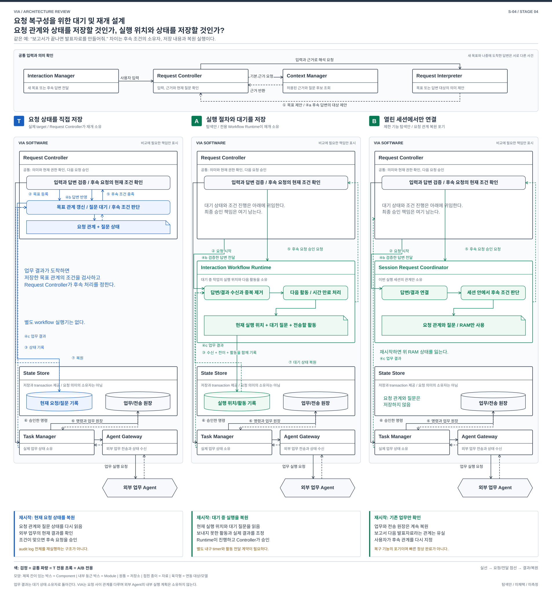

# S-04. 목표와 질문의 대기를 이어가는 구조

> 상태: **STAGE_4_REVIEW_READY / 사용자 리뷰 대기** / 2026-10-01
> [04 전체 지도](./04-00-structural-alternatives.md#s-04) / [품질의 공통 의미](./03-00-quality-scenarios.md#2-어떤-품질을-보고-있는가) / [검토 기록](./04-09-structural-review.md)
> 연결 문제: **P-05, P-06; P-07/08/10/11/13/15 연결**. S는 탐색 질문이며 DP 선정이 아니다. T는 실제 REVIEWED_BASELINE, A/B는 미채택 탐색안이다.

## 1. 어떤 상황에서 필요한 선택인가

> “보고서가 끝나면 그 결과로 발표자료를 만들어줘.” 수신자 질문을 기다리는 동안 다른 Task가 끝나고 VIA가 재시작된다.

**대기 원본을 domain 상태로 둘지, workflow continuation으로 둘지, 세션 중에만 유지할지 비교한다.**

## 2. 먼저 볼 차이

| 비교 지점 | T: 실제 target | 대안 A | 대안 B |
| --- | --- | --- | --- |
| 대기 권위 | Request Controller의 durable Request Graph와 질문 상태 | Interaction Workflow Runtime의 continuation과 질문 상태 | Core 세션의 메모리 coordinator |
| 재시작 | current records와 미완료 원장 및 source에서 재연결 | continuation, signal, activity 기록 및 source에서 재연결 | 기존 Task는 확인하되 잃은 목표 관계와 질문은 사용자 재지정 |
| 가장 큰 교환 | domain 전이와 저장이 가까움 | 재개 규약 공통화 여지, runtime 및 version 유지 비용 | 그래프 내구 비용 감소 여지, 자동 재개 기능 손실 |

## 3. 구조를 나란히 보기

[그림 크게 보기](./diagrams/stage4-s04-comparison.svg) / [편집 가능한 draw.io](./diagrams/stage4-s04-comparison.drawio)

파란색은 달라지는 책임, 자료 또는 실행 경로이며 추천 표시가 아니다. 검정은 공통으로 남는 책임이다. 박스는 논리 구성 또는 명시한 runtime이며 OS process와 같다는 뜻은 아니다. 점선 화살표의 의미는 그림의 개별 label을 따른다. 그림은 이 질문의 경계를 보여주며 전체 VIA 배치도가 아니다.

## 4. 같은 요청을 따라가 보기

| 사건 | T: 실제 target | 대안 A | 대안 B |
| --- | --- | --- | --- |
| 독립 목표 확정 | Request Controller가 graph node와 의존 관계 기록 | host가 의미를 확정한 뒤 runtime에 시작 signal을 내구 인계 | 같은 의미를 확정하되 관계는 메모리로 유지 |
| 결과/답변 대기 | domain 상태와 질문 identity로 대기 | continuation과 Signal Inbox/Timer Service로 대기 | 세션의 graph와 실제 제시 질문 identity로 대기 |
| 결과 도착 | 현재 result version과 권한을 검사하고 후속 admission | 유효 signal로 continuation 전이, activity intent를 기록한 뒤 host admission | 메모리 관계를 검사하고 후속 요청. 외부 전송 원장은 내구 유지 |
| 재시작 | 같은 관계와 대기 복원 후 source 확인 | activity 재전송 전에 current owner 및 source와 조정 | 미완료 목표와 질문 연결은 복원하지 않음. 기존 Task 상태와 손실 범위 구별 |

## 5. 누가 무엇을 소유하고 어떻게 실패하는가

### T — 실제 reviewed target

“보고서가 끝나면 그 결과로 발표자료를 만들고, 별도로 일정도 확인해줘”에서 VIA는 사용자 목표 사이 관계를 다룬다. 보고서 내부의 조사와 도구 순서는 Agent 책임이다. Target은 Request Controller의 durable Request Graph, Pending User Interaction과 domain 전이로 대기와 후속 admission을 소유한다. Task Manager는 Task/Execution, Agent Gateway는 전송과 source 관측을 소유한다. current records와 미완료 원장으로 복구하며 audit log를 실행 원본으로 replay하지 않는다. [구조 §5, 12, 14](../target-architecture/architecture.md), [제어 §4~5, 7](../target-architecture/control-and-lifecycle.md).

### 대안 A — 지속 interaction workflow

Interaction Workflow Runtime이 목표별 continuation, 의존 결과 version, 질문 대기와 timer를 내구 실행 원본으로 가진다. Signal Inbox는 source 사건과 사용자 답변을 중복 제거하며 Timer Service는 내구 deadline에 맞는 timeout signal을 만든다. Activity Dispatcher는 source 읽기, 질문 게시, 후속 admission 요청을 보낸다. Request Controller는 해석과 현재 권한의 최종 승인 경계를 유지하지만 같은 대기 그래프와 질문 상태를 별도 권위 원본으로 중복 보유하지 않는다. 조회용 view는 workflow 원본에서 만든다. Task Manager의 실제 업무 lifecycle과 Agent Gateway의 명령 전송은 유지한다.

Continuation Store는 State Store의 별도 논리 영역으로 두고 signal 수락, continuation 전이와 activity intent를 하나의 로컬 transaction에 기록하는 안으로 잡았다. Task Manager가 확정한 사건은 내구 outbox에서 전달하고, runtime은 중복 제거 후 수락한다. Activity Dispatcher가 보낸 admission 요청은 host에서 identity와 현재 epoch를 다시 검사한다. 이 연결을 단순 함수 호출로만 두면 crash 때 유실 또는 중복이 생긴다.

답변은 실제 제시된 interaction ID, 현재 workflow version, Execution 및 승인 digest에 맞는 continuation에만 들어간다. 답변 수락과 해당 대기 종료도 같은 runtime transaction에서 처리한다. 선행 결과 version이 바뀌면 미해제 continuation을 무효화한다. 이미 해제한 외부 실행은 되감지 않고 새 정정으로 처리한다. Workflow의 재개 기록만으로 외부 Agent의 exactly-once를 보장하지 않는다. Activity의 stable identity와 host admission, command outbox, source 조회가 여전히 필요하다.

### 대안 B — 세션 한정 요청 coordinator

살아 있는 Core 세션에서만 목표 관계, 후속 대기와 질문 focus를 유지한다. durable Request Graph와 질문 continuation 저장 및 복구 loader를 제거한다. Conversation과 이미 접수한 Task/Execution, 전송 의도와 중복 방지 원장, 실제 게시 기록은 계속 보관한다. 사용 중에는 독립 요청과 질문을 연결하지만 Core가 재시작하면 미완료 목표 관계와 대기 질문 연결은 재구성하지 않는다. 살아 있는 세션의 Voice/Text 전환은 지원 목표다.

B의 재시작 뒤에는 확인 가능한 기존 Task와 결과를 보여주되 미제출 목표와 후속 관계는 사용자가 다시 지정한다. 옛 답변이나 승인을 새 요청에 재사용하지 않는다. 외부 접수가 불명인 요청은 자동 재전송하지 않는다. Agent가 질문을 재조회해 줄 수 있더라도 원래 VIA clarification과 전체 요청 그래프 복구를 대신하지 못한다. 이는 FA-14와 P-05/06/13의 일부 기능 포기이며, 단순 구현 미완료를 정상 복구로 포장한 안이 아니다.

| 상황 | T | A | B |
| --- | --- | --- | --- |
| 정상 결과 도착 | current graph의 version과 조건 확인 후 후속 해제 | Signal Inbox 반영 후 해당 continuation의 activity 실행 | 메모리 관계 확인 후 후속 요청 생성 |
| 질문 대기 중 새 목표 | 별도 Request와 질문 identity로 진행 | 별도 continuation 진행, 제시 focus를 결합 | 메모리 identity로 진행, 단일 ‘마지막 질문’만 두지 않음 |
| 정정과 전송 경쟁 | host hold/epoch와 조건부 dispatch | workflow 취소 신호와 별개로 동일 host dispatch 경계 필요 | 내구 command admission 경계 유지. 그래프가 메모리라는 이유로 전송 검사 생략 불가 |
| crash 뒤 대기 복원 | current records와 미완료 원장 및 source 확인 | 내구 continuation과 signal/activity 기록 복원 및 source 확인 | 해당 기능 미지원. 확인되는 Task 상태와 잃은 목표 관계를 구분 |
| 저장 또는 이행 실패 | 새 외부 전송 차단, 상태 보존 및 실패 표시 | continuation version과 activity 이행 실패에서도 동일한 제한. 같은 저장소여도 activity 전달과 외부 실행은 별도 경계이므로 중복 및 유실 조정 필요 | 남아 있는 Task/command 저장 실패에서도 새 전송 금지. 제거한 저장만큼 전체 persistence가 사라진 것은 아님 |

### 참고 자료를 대조하며 구체화한 경계

| 대안 A에서 쉽게 빠지는 계약 | 구체 처리 |
| --- | --- |
| 시작과 대기 | Request Controller의 내구 Request 기록과 시작 signal을 같은 State Store transaction에 남긴다. runtime은 signal ID로 중복 제거. 사용자 대기에는 Omni KV와 source 연결을 붙잡지 않음 |
| 활동의 범위 | source 읽기, 의미 제안, 질문과 응답 게시, Task command 요청, typed 기억 변경 등 VIA 활동으로 한정. Agent 업무의 내부 도구 계획은 정의하지 않음 |
| 답변과 terminal 경쟁 | host의 실제 제시 질문 binding 및 승인 digest 확인에 더해 runtime 질문 revision과 Task Manager의 Execution revision을 같은 Unit of Work로 검증. terminal이 먼저면 늦은 answer activity는 실행하지 않음 |
| 기억 변경 | 원본 writer는 Context Manager. change ID, expected revision과 현재 epoch를 검사해 한 번 적용하고 재시도는 적용 여부 확인. workflow 성공 표시가 기억 원본을 대신하지 않음 |
| 위임 수명 | Agent 접수 ACK는 위임 Request 처리의 완료 경계. Agent 업무 완료는 별도 Task lifecycle이며 이후 질문/결과는 같은 Task와 Conversation을 참조한 continuation으로 연결 |
| 접수 불명과 재시작 | activity transport timeout을 새 Agent start로 재시도하지 않음. 새 incarnation 및 fence 뒤 같은 command key와 source를 확인하고 현재 owner revision과 미완료 activity를 조정 |
| 정의 변경 | 진행 중 definition version을 유지하거나 명시 migration/drain. 옛 reader와 activity 계약을 지원하지 못하면 해당 재개 제한을 표시 |

T는 current records와 미완료 원장으로 복구한다. A도 이 스케치에서는 같은 embedded State Store에 continuation을 저장하며 전체 domain event sourcing은 도입하지 않는다. B에는 그래프 복구가 없지만 Task, command와 publication의 원장은 남는다. 세 안 모두 외부 ACK나 실제 청취 여부를 로컬 기록만으로 확정할 수 없다.

## 6. 품질 차이는 어디에서 생기는가

아래는 T에 대한 대안의 조건부 인과다. V-01~13의 의미와 우선순위는 03을 따르며 새 지표나 측정 결과가 아니다. V-02는 목표 달성을 돕는 적절성과 불필요한 사용자 수고를 함께 보며 되묻기 횟수만을 뜻하지 않는다. 필요한 확인과 승인은 단순 감점하지 않는다. V-04/05는 VIA 귀속 시간이며 Agent 내부 실행과 사람의 대기는 외부 조건으로 구별한다. 기능 손실과 미확인은 평가에서 지우거나 동등으로 취급하지 않는다.

| 관점 | A: 지속 workflow | B: 세션 한정 coordinator |
| --- | --- | --- |
| V-01 기능 정확성 | 명시 signal과 continuation이 관계 보존을 도울 수 있으나 잘못 연결한 signal이나 replay가 반복 오류를 만들 수 있음 | 정상 세션의 binding은 유지 목표. 재시작 후 관계 상실과 오연결 위험을 드러내고 재확인 |
| V-02 기능 적절성 | 긴 대기 뒤 자동 재개 목표. 실패 복구가 실제로 간단해지는지는 미확인 | crash 후 목표 재설명과 수동 연결 부담 증가 |
| V-03 기능 완전성 | 02의 요청 및 질문 복구 유지 목표. runtime의 version, timer, 취소와 signal 지원 미확인 | 재시작 뒤 미완료 요청 관계 및 질문의 자동 복원 미지원. 지원하는 Task 복구와 구별 |
| V-04 상호작용 반응성 | signal 접수와 질문 게시에 내구 단계가 추가될 수 있음. local stop은 workflow 대기를 거치지 않음 | 그래프 저장 대기를 줄일 여지가 있으나 의미 확정과 command 저장은 남음 |
| V-05 VIA 귀속 요청 완료 시간 | 후속 release와 재개 비용, activity 전달 및 중복 제거 비용을 함께 봄 | 정상 흐름의 저장 비용 감소 가능. 잃은 후속 목표를 빠른 완료로 세지 않고 재처리와 실패 기록 유지 |
| V-06 자원 활용성과 수용량 | Runtime, timer, signal/continuation 기록과 조회 view 유지 비용 | 제거한 내구 그래프 비용 감소 가능. 열린 세션의 메모리와 Task 원장은 남음 |
| V-07 결함 허용성과 복구성 | 대기 재개를 runtime 계약에 맡길 수 있으나 activity 전달과 외부 실행의 불일치는 별도 처리 | 그래프와 질문 복구 능력이 명시적으로 낮아짐. 프로세스 재시작은 정상 기능 복구가 아님 |
| V-08 변경 용이성과 모듈성 | 새로운 대기 유형은 workflow로 표현 가능. 실행 중 continuation version과 activity 계약 이행 부담 추가 | 내구 그래프 migration은 없어지지만 변경 시 살아 있는 대기를 잃거나 drain해야 함 |
| V-09 분석 및 시험 용이성 | signal, activity와 domain 사건을 연결하고 답변, terminal, timeout의 순서를 통제할 시험 경계 필요. runtime 이력만으로 외부 효과 판정 불가 | 세션 종료 전 최소 기록이 없으면 사후 분석 범위 축소. 재시작을 주입해 잃은 그래프와 남은 Task를 구별해야 함. 임시 상태 전체 로그로 내구 그래프를 몰래 재도입하지 않음 |
| V-10 기밀성 | signal/continuation에 민감한 payload를 복제하지 않고 참조 사용. 삭제 및 철회 전파 대상 증가 | 임시 자료 수명은 짧아질 수 있지만 남는 Conversation/Task 자료의 권한 및 삭제 의무는 동일 |
| V-11 상호운용성과 공존성 | Agent event/질문을 signal로 바꾸는 계약 추가. 내부 timer가 Agent 기능을 대신하지 않음. timer 및 signal/activity 재개가 공유 CPU와 IO를 사용하므로 다른 PC 앱과의 공존성도 미확인 | 동일 Agent 지원 수준. 메모리 절약 가능성은 대기 부하와 잔존 runtime에 따라 다름 |
| V-12 조작 용이성과 사용자 오류 방지 | 실제 제시 focus와 유효 continuation을 표시해야 늦은 승인을 막음 | 재시작 뒤 남은 Task와 잃은 요청을 분명히 구별해야 중복 재요청을 줄임 |
| V-13 설치 용이성 | 내장 가능한 runtime이라도 version 및 상태 호환 관리가 추가됨 | 별도 workflow dependency는 없으나 target도 원래 그런 dependency는 없음. 그래프 제거가 자동 설치 이익은 아님 |

## 7. 어떤 조건에서 더 살펴볼 만한가

A는 긴 대기와 다양한 재개 형태에서 유력하지만 VIA가 runtime에 넣을 domain 계약이 여전히 많다면 추상화의 이점이 작을 수 있다. B는 세션 중 처리만으로 충분한 제한된 환경에서 검토할 수 있다. target의 기본 복구 목표와 같다고 주장하지 않는다. U-05/06/07/08과 runtime 재개 기능은 미확인이다. [기존 지속 요청안](./durable-request-orchestration.md)은 참고 입력이다.

같은 QA는 모든 DP와 모든 방안에서 동일한 정의, 지표와 측정 방법을 사용한다. 이 문서의 시험 경계는 후속 검토 대상이며 구현이나 측정 freeze가 아니다. 05의 정식 비교와 강한 방안 2 선정은 사용자 리뷰 후에 진행한다.

## 8. 기존 자료에서 무엇을 참고했는가

| 참고 자료 | 가져온 검토와 이번 적용 | 그대로 가져오지 않은 것 |
| --- | --- | --- |
| [지속 요청 구조](./durable-request-orchestration.md) | 답변/terminal 경쟁, activity identity, definition version 고정, 기억 변경 owner, 위임 접수와 Task 완료 구별을 §5에 적용 | runtime이 모든 VIA 처리를 대신한다는 가정과 이전 QA 수식 |
| [복구 원본 구조](./recovery-state-source.md) | 실제 외부 실행은 replay하지 않음. 저장 원본 손상과 파생 조회 손상을 구별 | Domain Journal, Replay Engine과 Checkpoint Manager를 A에 자동 결합하지 않음. workflow 실행과 event sourcing은 별도 선택 |
| [의미 검색 구조](./semantic-retrieval-subsystem.md) | 파생 index가 원본 상태를 대신하지 않는 원칙을 B의 기능 손실에 적용 | index를 숨은 내구 graph로 삼아 B의 비용을 낮게 계산하지 않음 |
| [음성 근거 구조](./speech-evidence-source.md) | 입력과 local stop은 긴 대기 runtime 밖에서 진행 | S-06의 입력 producer 선택을 이 안에서 고정하지 않음 |
