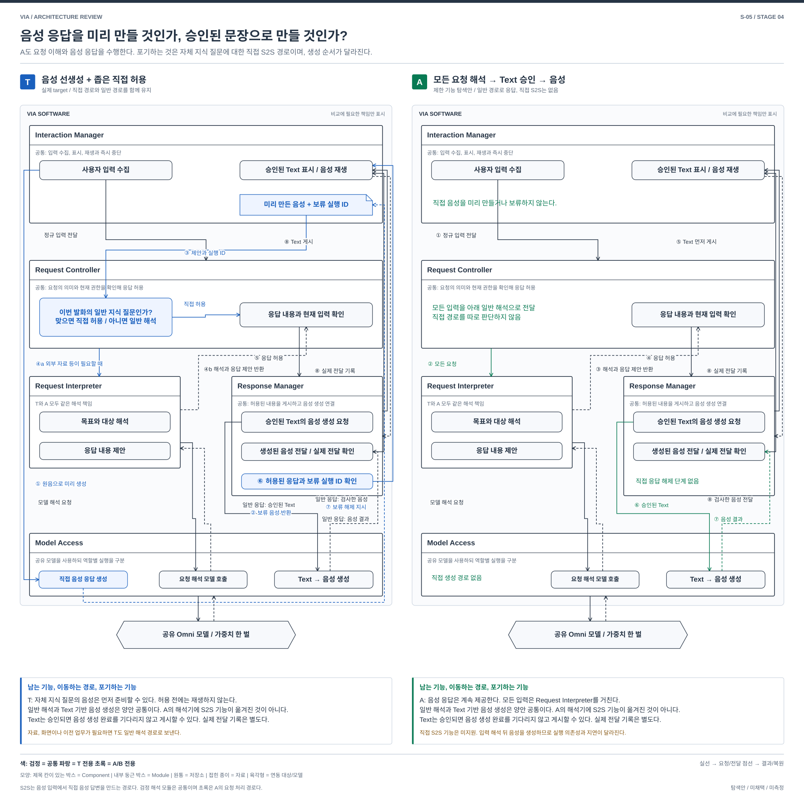
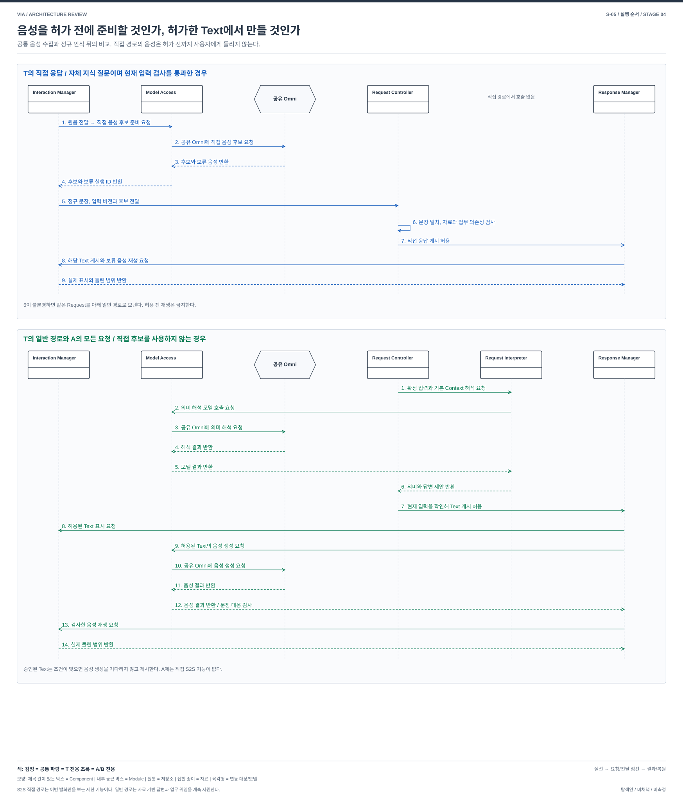

# S-05. 응답성을 위한 음성 응답 생성 설계 — 직접 음성 생성도 사용할 것인가, 확정된 문장만 음성으로 바꿀 것인가?

> 상태: **STAGE_4_REVISED / 사용자 재검토 대기** / 2026-10-02
> [04 전체 지도](./04-00-structural-alternatives.md#s-05) / [설명과 그림의 공통 원칙](./04-00-structural-alternatives.md#12-처음-읽는-사람을-위한-설명과-그림-원칙) / [품질의 공통 의미](./03-00-quality-scenarios.md#2-어떤-품질을-보고-있는가) / [검토 기록](./04-09-structural-review.md)
> 연결 문제: **P-04; P-08/09/14 연결**. S는 탐색 질문이며 DP 선정이 아니다. T는 실제 REVIEWED_BASELINE, A/B는 미채택 탐색안이다.

## 1. 어떤 상황에서 필요한 선택인가

> 사용자가 “무지개는 왜 생겨?”라고 물은 뒤 “그 설명으로 발표자료를 만들어줘”라고 이어 말한다.

**T는 일부 질문의 음성 답변을 미리 만들고 허용 후 재생한다. A는 모든 질문을 해석한 뒤 허용한 문장으로 음성을 만든다.**

### 1.1 입력과 결과를 구별한다

| 이름 | 처음 읽을 때의 뜻 |
| --- | --- |
| 원음과 정규 입력 | 사용자가 말한 음성과 Streaming ASR의 확정 문장. Interaction Manager가 음성을 받고 Request Controller가 확정 입력의 현재 버전을 사용 |
| 직접 답변 후보 | 공유 Omni가 이번 발화만 보고 미리 만든 제한된 음성 답변과 판단 자료. T에서만 사용하며 게시 허가가 아님 |
| 보류한 음성 | T가 허가 전까지 재생하지 않고 쥐고 있는 음성. 다른 요청에 재사용하지 않음 |
| 승인된 문장 | Request Controller가 현재 입력과 권한을 확인해 Response Manager에 게시를 허용한 Text |
| 실제 전달 기록 | Interaction Manager가 화면 표시 또는 들린 음성의 범위를 Response Manager에 알린 결과. 음성 생성 완료와 다름 |

S2S는 이번 발화의 음성을 바탕으로 직접 음성 답변을 준비하는 역할이다. 화면, 개인 자료나 이전 업무가 필요하면 T에서도 일반 해석으로 보낸다.

## 2. 먼저 볼 차이

| 비교 지점 | T: 실제 target | 대안 A |
| --- | --- | --- |
| 자체 지식 질문 | 공유 Omni가 음성을 미리 만들고 Request Controller가 허용하면 재생 | Request Interpreter가 의미를 해석하고 Request Controller가 허용한 문장을 음성으로 생성 |
| 자료나 업무가 필요한 요청 | 미리 만든 음성을 사용하지 않고 일반 해석으로 넘김 | 처음부터 일반 해석. 자료를 바탕으로 답하거나 업무를 맡기는 기능은 유지 |
| 기능과 비용 | 이번 발화에서 바로 음성 후보를 만드는 기능이 있지만 허용되지 않은 음성은 버림 | 직접 음성 후보 기능은 없고 모든 질문이 의미 해석과 문장 기반 음성 생성에 의존 |

## 3. 구조를 나란히 보기

[그림 크게 보기](./diagrams/stage4-s05-comparison.svg) / [편집 가능한 draw.io](./diagrams/stage4-s05-comparison.drawio)

검정은 공통, 파랑은 T 전용, 초록은 A/B 전용 구성과 경로다. 제목 칸이 있는 상자는 Component이며 내부의 둥근 상자는 그 Component의 Module이다. 원통은 저장소, 접힌 종이는 자료, 육각형은 내부를 펼치지 않은 연동 대상이나 모델이다. 실선은 요청과 전달, 점선 화살표는 결과와 복원이다. 색과 모양의 뜻은 [설계도 작성 기준](./diagram-design-guide.md)을 따른다. 메인 그림은 사용자의 음성이 Interaction Manager에 들어와 Streaming ASR의 정규 입력과 공유 Omni의 음성 답변 후보로 나뉘는 시작, T의 직접 허용 또는 일반 해석, A의 일반 해석, 승인된 Text와 음성 생성, 실제 전달 기록까지 보여준다. 이 그림은 비교할 책임을 펼친 것이며 전체 배치도나 구현 확정이 아니다.

A가 포기하는 것은 직접 S2S 경로이며 요청 이해나 음성 응답 전체가 아니다. Request Interpreter는 양안에서 같은 일반 해석 책임을 가지므로 검정으로 표시한다. T의 직접 음성 생성 기능이 이 Component로 옮겨 들어간 것은 아니다. A는 모든 요청을 일반 해석으로 보내고, Request Controller가 허용한 Text를 Response Manager와 Model Access가 음성으로 바꾼다. 그림에서 T 전용인 선생성, 보류 자료, 직접 허용과 해제는 파랑이고, A의 모든 요청이 따르는 경로는 초록이다.

## 4. 같은 요청을 따라가 보기

[크게 보기](./diagrams/stage4-s05-execution-flow.svg) / [draw.io 원본](./diagrams/stage4-s05-execution-flow.drawio)

사용자가 “무지개는 왜 생겨?”라고 말하면 Interaction Manager가 원음을 Model Access의 S2S 경로에 보내는 한편 Speech Input Worker의 Streaming ASR에서 확정 문장을 받는다. 발화 시작 때는 재생 중인 음성을 즉시 중단한다. 두 처리는 병행하며, Request Controller는 확정 입력과 필요한 검증 근거를 받아 최종 경로와 게시를 결정한다.

**T: 자체 지식 질문의 직접 후보가 허용되는 경우**

1. Interaction Manager가 원음을 Model Access에 전달해 이번 발화의 직접 음성 후보를 준비해 달라고 요청한다. 허용 전에는 재생하지 않는다.
2. Model Access가 공유 Omni 모델의 S2S 역할에 직접 음성 후보를 요청한다.
3. 공유 Omni 모델이 후보와 아직 재생하지 않은 음성을 Model Access에 반환한다.
4. Model Access가 후보와 보류 음성의 실행 ID를 Interaction Manager에 반환한다.
5. Interaction Manager가 확정 문장, 입력 버전, 후보와 실행 ID를 Request Controller에 보낸다.
6. Request Controller가 후보가 이해한 문장과 정규 문장의 일치, 자체 지식 질문인지, 개인 자료와 업무 등 다른 근거가 필요한지 확인한다. 하나라도 불분명하면 같은 Request를 일반 해석으로 보낸다.
7. 직접 허용 조건이 맞으면 Request Controller가 Response Manager에 현재 입력에 묶인 응답 게시를 허용한다.
8. Response Manager가 승인된 Text와 보류 실행 ID를 확인하고 Interaction Manager에 Text 게시와 해당 음성 재생을 요청한다.
9. Interaction Manager가 실제로 표시되고 들린 범위를 Response Manager에 반환한다. 생성만 됐거나 중단된 구간을 전달 완료로 기록하지 않는다.

**T의 일반 경로와 A의 모든 요청 경로**

1. T에서는 직접 응답을 허용할 수 없을 때, A에서는 모든 입력에서 Request Controller가 확정 문장과 기본 Context를 Request Interpreter에 보낸다. A에는 직접 후보와 보류 음성이 없다.
2. Request Interpreter가 Model Access에 의미 해석을 요청한다.
3. Model Access가 공유 Omni 모델에 의미 해석을 요청한다.
4. 공유 Omni 모델이 해석 결과를 Model Access에 반환한다.
5. Model Access가 결과를 Request Interpreter에 반환한다.
6. Request Interpreter가 목표, 대상과 답변 제안을 Request Controller에 반환한다.
7. Request Controller가 현재 입력, 사용한 자료와 권한을 확인해 Response Manager에 게시할 Text를 허용한다.
8. Response Manager가 허용된 Text를 Interaction Manager에 보내 표시하도록 요청한다. 게시 단위가 확정됐다면 음성 생성을 기다리지 않는다.
9. Response Manager가 Model Access에 승인된 Text의 음성 생성을 요청한다.
10. Model Access가 공유 Omni 모델에 음성 생성을 요청한다.
11. 공유 Omni 모델이 생성한 음성을 Model Access에 반환한다.
12. Model Access가 음성을 Response Manager에 반환한다. Response Manager가 승인된 Text와 음성이 대응하는지 확인한다.
13. Response Manager가 검사한 음성을 Interaction Manager에 보내 재생을 요청한다.
14. Interaction Manager가 실제로 들린 범위를 Response Manager에 반환한다. 중단되거나 확인되지 않은 구간은 전달 완료로 기록하지 않는다.

A에서도 자료를 바탕으로 직접 답하거나 업무를 위임할 수 있다. A가 포기하는 기능은 이 절 첫 흐름의 S2S 직접 음성 경로다.

## 5. 누가 무엇을 소유하고 어떻게 실패하는가

### T — 실제 reviewed target

Target은 자체 지식으로 답할 수 있는 current-Turn-only 질문에서 VoiceProposal을 먼저 만들고 Request Controller의 admission 뒤 보류한 generation을 release한다. 개인 자료, 화면, Task나 과거 대화가 필요하면 같은 Request를 Core로 인계한다. Core 응답의 Text와 Voice는 Response Manager가 공통 사실에 연결하고 Interaction Manager가 실제 전달 receipt를 보낸다. target도 검증된 문장 단위 출력을 허용하므로 ‘항상 전체 답을 기다린다’는 비교는 잘못이다. [제어 §2, 6](../target-architecture/control-and-lifecycle.md), [구조 §8, 13](../target-architecture/architecture.md).

### 대안 A — Core-only 응답 pipeline

모든 발화를 정규 입력 근거 → Request Controller의 입력, 기본 Context와 예산 결합 → Request Interpreter의 의미 및 handling 제안 → Request Controller의 확정으로 보낸다. 직접 답할 내용은 같은 호출의 허용된 draft 또는 필요한 Response Manager 구성으로 만들고 승인된 Text에서 공유 Omni의 SpeechRender를 실행한다. 별도 VoiceProposal, speculative S2S 생성과 그 전용 buffer/admission 상태는 제거한다. Response Manager의 publication outbox, 채널별 전달 사실과 local stop의 output epoch는 유지한다.

자체 지식 질문도 답할 수 있고 후속 Agent 업무에 같은 Response를 참조할 수 있다. 그러나 **S2S 직접 기능(B-03)은 미지원**이다. Text 기반 의미 처리와 SpeechRender를 연결한 것을 동일 S2S 기능이라고 부르지 않는다. 자료 기반 직접 처리와 Agent 위임의 책임 경계는 유지한다. SpeechRender도 미지원이면 Text-only 제한이며 전체 음성 기능 성공이 아니다.

정정 때 Core 제안과 음성 generation을 현재 revision에 맞게 폐기한다. 먼저 생성된 Text가 이미 게시됐으면 게시 사실과 정정 기록을 보존한다. 늦은 Voice segment는 output epoch로 막는다. crash 뒤 미완료 publication을 복원하되 audible receipt가 없는 구간은 DELIVERY_UNKNOWN으로 남긴다. 경로를 하나로 만들었다고 실제 전달과 저장의 비원자성이 사라지지 않는다. U-01/03/06/07/08이 필요하다.

### 참고 자료를 대조하며 구체화한 경계

| 공통으로 남는 경계 | T와 A의 적용 |
| --- | --- |
| 입력과 확정 | T도 정규 전사와 input_echo 대조 및 Request Controller admission이 필요. A에만 ASR 또는 Core 의존성이 생긴 것이 아님 |
| Text와 Voice | 공통 사실에서 상세 Text와 핵심 Voice를 만든다. T도 검증된 문장 단위 전달 가능. A의 SpeechRender는 승인 Text에 묶음 |
| 실제 전달 | publication, UI 표시와 audible receipt는 다른 사건. 생성된 내용을 사용자가 들었다고 가정하지 않음 |
| 중단과 복구 | local stop과 output epoch, 부분 전달/DELIVERY_UNKNOWN을 유지. Voice 중단을 Agent Task 취소로 바꾸지 않음 |

## 6. 품질 차이는 어디에서 생기는가

아래는 T에 대한 대안의 조건부 인과다. V-01~13의 의미와 우선순위는 03을 따르며 새 지표나 측정 결과가 아니다. V-02는 목표 달성을 돕는 적절성과 불필요한 사용자 수고를 함께 보며 되묻기 횟수만을 뜻하지 않는다. 필요한 확인과 승인은 단순 감점하지 않는다. V-04/05는 VIA 귀속 시간이며 Agent 내부 실행과 사람의 대기는 외부 조건으로 구별한다. 기능 손실과 미확인은 평가에서 지우거나 동등으로 취급하지 않는다.

| 관점 | A에서 확인할 품질 경로와 조건 |
| --- | --- |
| V-01 기능 정확성 | 경로별 불일치와 handoff 오류를 줄일 여지가 있다. Target S2S도 정규 전사와 input_echo 대조를 사용하므로 ASR 의존성을 A만의 비용으로 세지 않는다. A는 VoiceProposal의 자체 분류와 원음 활용 경로를 정규 입력 기반 Request Interpreter의 semantic 처리로 바꾸므로 오류 유형과 음성 단서 보존의 차이를 확인해야 한다. 같은 모델 사용은 독립 검증이 아니다. |
| V-02 기능 적절성 | 직접 답변에서 후속 업무로 이어지는 사용자 흐름은 유지 목표. 경로가 단일하다는 이유만으로 사용자 단계가 줄었다고 주장하지 않는다. |
| V-03 기능 완전성 | 일반 질문 답변은 유지하되 B-03의 S2S 직접 응답은 포기한다. 음성의 풍부한 표현 보존 여부도 실제 SpeechRender 지원으로 확인한다. |
| V-04 상호작용 반응성 | 양안 모두 Request Controller의 확정을 거친다. A는 단순 자체 지식 질문도 Request Interpreter의 semantic 호출 뒤 SpeechRender로 이어지므로 target의 speculative 직접 경로보다 첫 Voice 대기가 늘 수 있다. 맥락 요청에서 불필요한 speculative 작업은 줄일 여지가 있다. |
| V-05 VIA 귀속 요청 완료 시간 | handoff와 미사용 생성 제거, 모든 질문의 Core 처리 및 SpeechRender 의존성을 함께 본다. 첫 음성이 빠른 것과 최종 내용 전달은 구별한다. |
| V-06 자원 활용성과 수용량 | speculative generation/buffer가 줄지만 Core 부하가 늘 수 있다. 같은 weights를 쓰므로 Omni 모델 하나가 통째로 줄어드는 효과는 없다. |
| V-07 결함 허용성과 복구성 | direct/Core 전환 실패는 줄일 수 있다. Core process 장애는 target의 S2S admission과 publication도 막는 공통 한계다. Request Interpreter의 의미 제안만 실패하고 Request Controller admission 및 게시가 살아 있는 국소 장애에서는 target의 좁은 직접 경로가 남을 가능성과 A의 전 경로 의존성을 구별한다. 실제 격리 가능성은 미확인이다. |
| V-08 변경 용이성과 모듈성 | VoiceProposal와 direct admission 연동을 제거한다. SpeechRender의 Text/audio 대응 계약 변경은 여전히 Model Access, Response Manager와 전달 검증에 영향을 준다. |
| V-09 분석 및 시험 용이성 | 한 semantic commit에서 게시까지 추적할 수 있다. 전사, 해석, 생성 및 실제 전달 원인은 계속 구분해야 한다. semantic 실패, 늦은 generation과 receipt, 출력 중단을 각각 통제할 시험 경계가 필요하다. |
| V-10 기밀성 | target의 직접 경로는 current-Turn-only다. Core 경로에 필요 이상의 개인 Context를 넣으면 노출 범위가 늘 수 있으므로 최소 자료 준비가 필요하다. |
| V-11 상호운용성과 공존성 | VoiceProposal 없는 runtime의 연동 여지가 생기나 SpeechRender와 정규 근거 지원은 필요하다. Core 경합은 다른 앱 부하에 따라 다르다. |
| V-12 조작 용이성과 사용자 오류 방지 | 사용자에게 경로 선택을 요구하지 않는다. 실제 게시와 audible 범위, 중단과 Task 취소 구별은 같은 UI 계약으로 유지한다. |
| V-13 설치 용이성 | 별도 helper 추가는 없다. 동일 Omni runtime 안의 계약 일부를 줄이는 안이므로 설치 크기 감소는 미확인이다. |

## 7. 어떤 조건에서 더 살펴볼 만한가

단순 자체 지식 대화 비중이 높으면 S2S 포기의 손실이 크다. 맥락 기반 요청이 많고 native VoiceProposal 지원 비용이 높으면 경로 축소의 이점이 있을 수 있다. 실제 빈도는 아직 모른다. 문장 streaming 여부만 바꾸거나 gate를 건너뛰는 안은 별도 구조로 세지 않았다.

같은 QA는 모든 DP와 모든 방안에서 동일한 정의, 지표와 측정 방법을 사용한다. 이 문서의 시험 경계는 후속 검토 대상이며 구현이나 측정 freeze가 아니다. 05의 정식 비교와 강한 방안 2 선정은 사용자 리뷰 후에 진행한다.

## 8. 기존 자료에서 무엇을 참고했는가

| 참고 방식 | 반영 및 경계 |
| --- | --- |
| 기존 네 문서의 그림 구성 | 파란색으로 실제 달라지는 책임과 실행 경로를 표시하고 공통 승인 및 전달 경계를 함께 표현 |
| 설계 내용 | S-05는 현재 target의 S2S 계약과 04 독립 리뷰를 기준으로 유지. 기존 네 안 중 하나를 이 응답 경로의 대안으로 가져오지 않음 |
