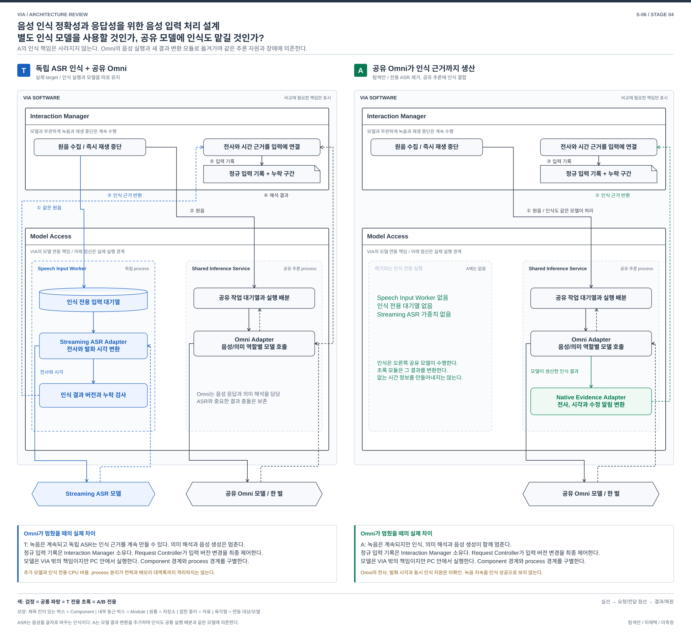
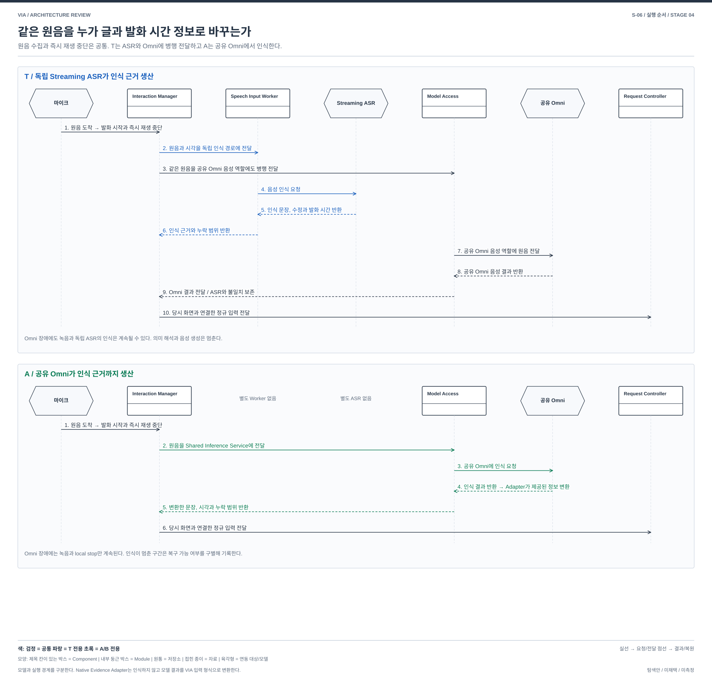

# S-06. 음성 인식 정확성과 응답성을 위한 음성 입력 처리 설계 — 별도 인식 모델을 사용할 것인가, 공유 모델에 인식도 맡길 것인가?

> 상태: **STAGE_4_REVISED / 사용자 재검토 대기** / 2026-10-02
> [04 전체 지도](./04-00-structural-alternatives.md#s-06) / [설명과 그림의 공통 원칙](./04-00-structural-alternatives.md#12-처음-읽는-사람을-위한-설명과-그림-원칙) / [품질의 공통 의미](./03-00-quality-scenarios.md#2-어떤-품질을-보고-있는가) / [검토 기록](./04-09-structural-review.md)
> 연결 문제: **P-14; P-01/02/08/15 연결**. S는 탐색 질문이며 DP 선정이 아니다. T는 실제 REVIEWED_BASELINE, A/B는 미채택 탐색안이다.

## 1. 어떤 상황에서 필요한 선택인가

> 긴 문서를 해석하는 동안 사용자가 “아니, 옆 표만”이라고 말한다. 그 순간 Omni runtime에 장애가 생길 수도 있다.

**T는 별도 Streaming ASR가 음성을 글로 바꾸고, A는 공유 Omni 모델이 그 일까지 맡는다. 두 안에서 인식이 멈추는 조건과 필요한 자원이 달라진다.**

### 1.1 들어오고 나가는 자료

| 이름 | 처음 읽을 때의 뜻 |
| --- | --- |
| 원음 | 마이크가 받은 사용자의 실제 음성. Interaction Manager가 수집하고 발화가 시작하면 즉시 재생을 중단할 수 있음 |
| 인식 근거 | 들은 문장, 수정 버전, 실제 발화 시간과 비어 있는 구간. 화면 지칭과 입력 정정에 필요 |
| 정규 입력 기록 | Interaction Manager가 인식 근거를 현재 입력에 연결한 기록. Request Controller가 버전 변경과 처리 허용을 최종 제어 |
| 별도 인식 모델 | T에서 Speech Input Worker가 실행하는 Streaming ASR. Omni의 음성 응답과 의미 해석이 바쁠 때도 인식을 계속할 수 있게 설계 |
| 공유 모델의 인식 결과 | A에서 Omni가 직접 만든 전사와 시간 정보. Native Evidence Adapter는 제공된 정보만 정규 입력 형식으로 바꿈 |

두 안 모두 같은 원음을 공유 Omni의 음성 역할에도 전달한다. A에서 인식 생산자가 바뀌어도 녹음과 즉시 재생 중단은 Interaction Manager가 계속 맡는다.

## 2. 먼저 볼 차이

| 비교 지점 | T: 실제 target | 대안 A |
| --- | --- | --- |
| 음성을 글로 바꾸는 주체 | Speech Input Worker가 별도 Streaming ASR를 사용 | Shared Inference Service가 공유 Omni 모델을 사용 |
| 실행과 장애 | 별도 ASR가 Omni의 긴 작업이나 장애와 관계없이 인식을 계속할 수 있음. PC 자원은 함께 사용 | 별도 ASR가 없어지지만 인식이 공유 Omni의 대기, 자원 경합과 장애에 함께 묶임 |
| 가장 큰 교환 | 모델과 인식 작업의 비용이 추가되고 두 결과가 다를 때 처리해야 함 | 모델 하나를 덜 배포할 여지가 있으나 Omni가 실제 발화 시각과 동시 인식을 제공해야 함 |

## 3. 구조를 나란히 보기

[그림 크게 보기](./diagrams/stage4-s06-comparison.svg) / [편집 가능한 draw.io](./diagrams/stage4-s06-comparison.drawio)

큰 VIA 경계 안에는 연동 코드를, 밖에는 모델 의존성을 두었다. 모델 내부와 학습이 VIA 책임 밖이라는 뜻이며 원격 서버 배치를 뜻하지 않는다. Model Access는 연동 책임을 나타내며 하나의 process가 아니다. 그 안에 독립 Speech Input Worker와 Shared Inference Service의 실행 경계를 펼쳤다. 두 모델의 가중치는 PC 안에 배치될 수 있다. 공통 Component는 같은 위치에서 검정으로 표시한다. T 전용 ASR 경로는 파랑, A의 인식 역할을 옮겨 받는 경로와 새 변환 Module은 초록이다. Module은 Model Access 안에 있고 점선 process 경계로 실제 실행 위치를 구별한다. 점선 화살표는 모델에서 adapter로, adapter에서 Interaction Manager로 돌아오는 근거를 나타낸다.

A에서는 공유 Omni 모델이 인식 근거를 생산하고 Native Evidence Adapter가 그 결과를 VIA 입력 형식으로 변환한다. Adapter가 음성을 스스로 인식하거나 모델이 주지 않은 시간을 만들어내는 구조가 아니다. 별도 ASR가 사라지는 대신 인식이 공유 추론 대기열과 같은 모델의 장애에 묶인다. 그림에서 삭제 영역뿐 아니라 새 생산자, 변환 Module과 결과 반환 경로를 함께 확인할 수 있다.

## 4. 같은 요청을 따라가 보기

[크게 보기](./diagrams/stage4-s06-execution-flow.svg) / [draw.io 원본](./diagrams/stage4-s06-execution-flow.drawio)

사용자가 “아니, 옆 표만”이라고 말하면 마이크가 Interaction Manager에 원음을 전달한다. Interaction Manager는 시작 시각과 입력 버전을 잡고 재생 중인 음성을 즉시 멈춘다. 원음 수집과 이 중단은 두 안에서 같은 경로다. 아래 두 흐름의 번호는 각각 1부터 읽는다.

**T: Streaming ASR가 인식 근거를 생산**

1. 마이크가 원음을 Interaction Manager에 전달한다. Interaction Manager는 발화 시작 시각과 입력 버전을 잡고 재생 중인 음성을 즉시 멈춘다.
2. Interaction Manager가 원음과 시각을 Speech Input Worker의 독립 인식 대기열에 보낸다.
3. Interaction Manager가 같은 원음을 Model Access의 공유 Omni 음성 역할에도 병행해서 보낸다. 별도 ASR 완료를 기다리는 후속 호출이 아니다.
4. Speech Input Worker가 Streaming ASR 모델에 음성 인식을 요청한다.
5. Streaming ASR 모델이 문장, 정정과 실제 제공한 발화 시간을 Speech Input Worker에 반환한다.
6. Speech Input Worker가 인식 근거와 누락 범위를 Interaction Manager에 반환한다.
7. Model Access가 공유 Omni 모델의 음성 역할에 같은 원음을 전달한다. 이 경로는 ASR 완료를 기다리지 않고 병행한다.
8. 공유 Omni 모델이 음성 결과를 Model Access에 반환한다.
9. Model Access가 결과를 Interaction Manager에 전달한다. 별도 ASR 근거와의 중요한 불일치는 숨기지 않는다.
10. Interaction Manager가 발화 시간에 맞는 화면 기록과 인식 문장을 연결해 정규 입력을 만들고 Request Controller에 보낸다. Omni가 멈춰도 녹음과 독립 ASR 인식은 계속될 수 있지만 의미 해석과 음성 생성은 멈춘 상태로 남긴다.

**A: 공유 Omni가 인식 근거까지 생산**

1. 마이크가 원음을 Interaction Manager에 전달한다. Interaction Manager는 T와 같이 발화 시작을 기록하고 재생을 즉시 멈춘다.
2. Interaction Manager가 원음을 Model Access의 Shared Inference Service에 보낸다. 별도 Speech Input Worker와 Streaming ASR는 두지 않는다.
3. Model Access가 공유 Omni 모델에 음성 인식과 결과 생성을 요청한다.
4. 공유 Omni 모델이 실제 제공한 문장과 시각을 Model Access에 반환한다. 그 안의 Native Evidence Adapter가 결과를 VIA 입력 형식으로 변환한다.
5. Model Access가 변환한 근거와 확인할 수 없는 구간을 Interaction Manager에 반환한다.
6. Interaction Manager가 발화 시간의 화면 기록과 근거를 연결해 정규 입력을 만들고 Request Controller에 보낸다. Omni가 멈추면 녹음과 즉시 중단은 계속되지만 인식, 의미 해석과 음성 생성은 함께 멈춘다. 복구할 수 없는 구간은 누락으로 표시한다.

A의 모델이 필요한 발화 시각이나 동시 인식을 제공하지 않으면 해당 화면 지칭 또는 지속 인식은 지원 미확인이나 제한으로 남긴다. 녹음이 이어졌다는 사실을 인식 완료로 바꾸지 않는다.

## 5. 누가 무엇을 소유하고 어떻게 실패하는가

### T — 실제 reviewed target

Target은 Speech Input Worker의 경량 Streaming ASR로 transcript revision, partial/final과 시각 근거를 생산하며 음성 입력은 Omni에도 전달한다. Model Access의 Shared Inference Service는 한 Omni weights를 역할별 session과 KV로 공유한다. capture와 local stop은 추론 밖이고 독립 ASR의 CPU 비용, 오류와 Omni 해석 불일치 처리도 존재한다. process 분리가 열과 메모리 대역폭까지 격리하는 것은 아니다. [공유 Omni 계약](../target-architecture/shared-omni-runtime.md).

### 대안 A — Omni native evidence

독립 ASR weights와 Speech Input Worker를 제거하고, Omni 음성 session이 인식 근거까지 생산하게 한다. Native Evidence Adapter는 native transcript/event를 input revision, sample 시간, uncertainty와 gap으로 변환한다. 근거가 없는 시간을 adapter가 만들어내지는 않는다. capture와 local stop은 계속 독립 경로이며 음성/semantic 역할의 session, KV와 권한 격리는 유지한다.

native 인식은 semantic과 같은 inference runtime의 실행 기회에 의존한다. bounded scheduling, 동시 session과 긴 비선점 연산의 실제 한계를 확인해야 한다. API가 비동기라는 사실만으로 지속 인식이 입증되지 않는다. Omni crash 동안 capture가 계속되어도 recognition은 멈추며, 복구 후 유한 backlog와 gap을 구분한다. 계속 녹음했다는 이유로 연속 인식 성공이라 하지 않는다.

U-01/03/08의 native partial/final, revision, 실제 발화 시각과 취소 지원은 미확인이다. target의 독립 ASR 정확도와 지속 처리도 아직 미측정이다. A에서 시각 근거가 없으면 P-02의 해당 지칭 기능 제한, 동시 인식이 불가능하면 B-02의 지속 인식 제한으로 V-03에 남긴다. target과 동등 지원을 주장하지 않으며 숨은 보조 ASR를 넣어 비용을 제외하지 않는다.

### 참고 자료를 대조하며 구체화한 경계

| 입력 경계 | 대안 A의 계약과 한계 |
| --- | --- |
| 근거 내용 | stream/Turn, sample range, transcript revision, partial/final, 대체 span, 시각 오차/방법, gap, producer build/incarnation 필요. 정확한 단어 시각을 항상 보장하지 않음 |
| native 진행 | semantic 종료를 기다리지 않는 실제 encode/evidence 실행 기회와 유한 backlog가 필요. 비동기 API만으로 입증 불가. Native 입력 예약이 정상 semantic 처리를 영구 굶기지 않아야 함 |
| 포화 | background 회수와 신규 긴 job 제한으로 조정하되 넘친 원음은 gap으로 남김. 늦은 인식을 정상적인 즉시 입력 처리로 집계하지 않음 |
| 재시작 | producer incarnation을 바꾸고 미완료 구간을 gap 처리. 옛 final과 audio handle의 늦은 결과를 차단. 새 인식 준비와 입력 capture 상태를 따로 표시 |
| 근거 충돌 | T는 독립 ASR와 Omni의 중요한 불일치를 보존. A는 단일 producer의 revision 및 echo binding을 검사하며 자기 일치를 독립 검증으로 부르지 않음 |
| 미지원 | 시각 근거가 없으면 해당 화면 지칭 제한, 동시 인식이 안 되면 지속 인식 제한을 V-03에 남김. 숨은 ASR나 cloud로 보충하지 않음 |

## 6. 품질 차이는 어디에서 생기는가

아래는 T에 대한 대안의 조건부 인과다. V-01~13의 의미와 우선순위는 03을 따르며 새 지표나 측정 결과가 아니다. V-02는 목표 달성을 돕는 적절성과 불필요한 사용자 수고를 함께 보며 되묻기 횟수만을 뜻하지 않는다. 필요한 확인과 승인은 단순 감점하지 않는다. V-04/05는 VIA 귀속 시간이며 Agent 내부 실행과 사람의 대기는 외부 조건으로 구별한다. 기능 손실과 미확인은 평가에서 지우거나 동등으로 취급하지 않는다.

| 관점 | A에서 확인할 품질 경로와 조건 |
| --- | --- |
| V-01 기능 정확성 | 독립 전사와 Omni 해석의 충돌은 줄 수 있지만 오류가 같은 모델에 결합된다. 일치율이 높아져도 정확성 개선의 증거가 아니다. |
| V-02 기능 적절성 | native 근거가 충분하면 재질문을 줄일 여지. 부하 때문에 늦거나 유실되면 사용자의 반복 발화가 늘어난다. |
| V-03 기능 완전성 | 지속 인식과 당시 화면 연결 유지 목표. native 시각 및 동시 처리 미지원은 해당 기능 제한이다. |
| V-04 상호작용 반응성 | 별도 ASR 전달 경로는 줄지만 인식이 semantic 연산을 기다릴 수 있다. local stop의 독립 실행과 인식 완료를 구별한다. |
| V-05 VIA 귀속 요청 완료 시간 | evidence 변환 비용 감소 가능성과 공유 inference 대기, gap 후 재처리 비용을 함께 본다. |
| V-06 자원 활용성과 수용량 | ASR weights와 CPU 작업은 제거되지만 Omni의 인식 session, KV 및 연산 부담이 늘 수 있다. 총 메모리와 지원 부하의 이익은 미확인이다. |
| V-07 결함 허용성과 복구성 | ASR 별도 고장은 없어지나 Omni 장애가 인식과 의미 처리를 함께 중단한다. backlog와 근거 gap을 복구해야 한다. |
| V-08 변경 용이성과 모듈성 | ASR 교체 계약은 없어지지만 모델 교체 시 native evidence의 시각, revision, 해석과 Voice 계약을 함께 맞춰야 한다. |
| V-09 분석 및 시험 용이성 | 인식과 의미 오류를 구분할 관측이 더 어려울 수 있다. native event와 sample 대응 자료가 실제 제공되는지 확인한다. Adapter 경계의 event 유실과 역순 시험만으로 실제 inference의 인식 진행을 입증할 수 없으므로 runtime 경합과 중단도 통제할 수 있는지 확인해야 한다. |
| V-10 기밀성 | target도 원음을 Omni에 보낸다. Omni의 새 원음 노출이라는 가짜 차이는 없다. 제거된 ASR buffer와 native session 보관 및 철회 차이를 본다. |
| V-11 상호운용성과 공존성 | native 계약 지원 모델로 선택 범위가 좁아질 수 있다. CPU 감소와 accelerator 경합 증가는 외부 앱 부하별로 다르다. |
| V-12 조작 용이성과 사용자 오류 방지 | 지연된 인식 중 입력이 접수됐는지와 실제 제어 효력을 구별해야 한다. 녹음 표시만으로 정정이 반영됐다고 알리지 않는다. |
| V-13 설치 용이성 | ASR model/runtime 배포를 줄일 수 있다. 대신 필요한 native build 지원과 업그레이드 호환 확인이 남는다. |

## 7. 어떤 조건에서 더 살펴볼 만한가

native 계약이 충분하고 공유 runtime이 지원 부하를 처리할 수 있을 때 비용 절감의 설득력이 생긴다. 긴 semantic 처리나 runtime 장애가 입력을 막으면 그 전제는 성립하지 않는다. scheduler 우선순위 값만 달리하는 안은 이 구조와 별개의 DP 후보로 만들지 않는다. [기존 음성 근거안](./speech-evidence-source.md)은 재평가 입력이다.

같은 QA는 모든 DP와 모든 방안에서 동일한 정의, 지표와 측정 방법을 사용한다. 이 문서의 시험 경계는 후속 검토 대상이며 구현이나 측정 freeze가 아니다. 05의 정식 비교와 강한 방안 2 선정은 사용자 리뷰 후에 진행한다.

## 8. 기존 자료에서 무엇을 참고했는가

| 참고 자료 | 가져온 검토와 이번 적용 | 그대로 가져오지 않은 것 |
| --- | --- | --- |
| [음성 근거 구조](./speech-evidence-source.md) | evidence의 producer incarnation, sample range, revision, gap, 포화와 재시작 경계를 §5에 구체화 | native 미지원을 후보 자동 탈락으로만 처리하지 않음. 현재 규칙대로 기능 제한을 V-03에 남김 |
| [복구 원본 구조](./recovery-state-source.md) | 오래된 결과나 audio handle을 replay해 입력/전송 성공으로 만들지 않음 | 모델 KV를 내구 업무 원본으로 보존하지 않음 |
| [지속 요청 구조](./durable-request-orchestration.md) | 입력 producer 회복과 장기 Task/질문의 재개가 다른 수명임을 구별 | speech runtime을 interaction workflow로 대체하지 않음 |
| [의미 검색 구조](./semantic-retrieval-subsystem.md) | 추가 또는 제거 helper의 weights, queue, rebuild/준비 비용 전체를 inventory에 반영 | 검색 helper의 이익과 음성 producer의 이익을 함께 계산하지 않음 |
