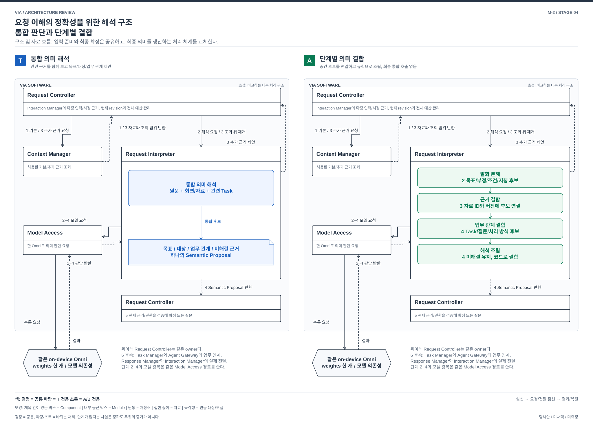

# 요청 이해의 정확성을 위한 해석 구조 — 통합 판단과 단계별 결합

> 2026-10-03 사용자 리뷰: 이 핵심 기능 **주제**를 우선 검토한다. 아래 두 안 자체의 승인이나 선택은 아니다. 기존 T는 참조 구조이며 이후 두 안을 구체화할 때 어느 쪽도 참조 구조에 고정할 필요가 없다.

> M-2 / **구조 비교 후보로 유지** / Stage 4 / 2026-10-02
> [발굴 및 판정](./04-13-broad-mechanism-discovery.md), [전체 품질 검토](./04-17-broad-mechanism-review.md). 구현과 측정 없음.

## 1. 문제와 선택

“이 두 표 중 작년 것으로 보고서를 고쳐줘. 메일 작업은 계속해”라는 요청에서 발화의 조건, 화면의 두 표, 수정할 기존 Task와 유지할 다른 Task를 정확히 연결해야 한다. 현재 T는 관련 근거를 함께 보고 하나의 구조화된 해석을 제안한다. 대안은 각 판단이 소비하고 생산하는 자료를 분리하고 단계적으로 결합한다.

**비교할 선택은 전체 의미를 함께 추론할 것인가, 발화 해석 → 대상 결합 → 업무 연결의 명시적 처리 구조로 풀 것인가다.** 대안은 다른 판단에 잘못된 정보가 섞이는 범위와 재처리 대상을 제한할 수 있다. 대신 앞 단계의 오류가 뒤로 전파되고, 여러 근거를 함께 봐야 풀리는 표현은 불리하며, 호출 왕복이 늘어난다. 어느 쪽의 정확도가 높은지는 미측정이다.

T의 근거는 [architecture §6~7](../target-architecture/architecture.md#6-요청-이해와-처리-확정), [Context 계약 §2~3](../target-architecture/memory-and-context-lifecycle.md#2-context-획득과-지칭의-정확성)이다. T도 field별 근거와 미해결 상태, 제한된 추가 읽기를 지원한다. 이를 대안만의 기능으로 주장하지 않는다.

## 2. 공통 경계와 바뀌는 내부 구조

Interaction Manager가 확정 입력과 당시 화면/선택을 기록한다. Request Controller는 Context Manager에 현재 허용 범위의 기본 근거를 요청하고 받은 자료 및 revision을 Request Interpreter에 전달한다. 이후 두 안이 갈라진다. Model Access는 동일한 on-device Omni 가중치를 공유하며 음성 입력/인식과 추론의 자원 진행을 관리한다. 업무 계획과 실행은 계속 외부 Downstream Agent 책임이다.

**T의 Request Interpreter:** 발화, 화면/본문, 대화/Task 후보와 기능 범위를 한 semantic 입력에 결합해 목표, 대상, Task 관계와 handling을 함께 제안한다. 필요하면 한 묶음의 추가 읽기 뒤 다시 해석한다. 입력 revision당 semantic generation 총 2회라는 실제 기준선을 보존한다.

**대안의 Request Interpreter:** 아래 네 내부 Module이 연결된다. 새 Component를 네 개 추가하는 안이 아니다. 동일한 외부 제안 port 뒤의 핵심 의미 처리 구조를 교체한다.

| 내부 Module | 입력 → 출력 | 판단과 제한 |
| --- | --- | --- |
| 발화 분해 | 입력 원문, 전사 불일치/시간 근거, 현재 지시 → 목표/부정/조건/지칭 표현의 후보와 원문 구간 | Omni 1회. “작년”이나 “그것”을 이 단계에서 실제 파일/Task ID로 확정하지 않음. 복수 해석 후보 유지 |
| 근거 결합 | 지칭 후보와 원문 구간, 허용된 당시 관측/자료 및 조회 receipt → source ID/revision에 결합한 대상 후보, 충돌/누락 | Omni 최대 1회. 안정된 명시 ID는 코드로 대조 가능. 시각 추론이 필요하면 같은 Omni를 이 단계에서 호출. 새 시각 모델은 숨겨 넣지 않음 |
| 업무 관계 결합 | 목표/대상 후보, 필요한 원문 구간, 관련 Task/질문과 Agent capability → 새/기존/정정/독립 관계와 handling 후보 | Omni 최대 1회. Task 사실을 생성하거나 단일 Agent 업무의 내부 실행 단계를 계획하지 않음 |
| 해석 조립 | 세 단계의 versioned 후보 및 근거 → Semantic Proposal 또는 최소 질문/부족 자료 제안 | 일반 코드. 조건 모순, 결합되지 않은 필수 field, 후보 다수는 미해결로 유지. 모든 raw 자료를 다시 한 모델에 넣어 통합 판단하지 않음 |

`Module`은 Request Interpreter 내부 처리 단위다. 중간 자료는 값뿐 아니라 원문 구간, 후보 집합, 적용한 조건, 근거 ID/revision, 실패/누락을 가진다. 모델의 자기 신뢰도는 참이라는 증거가 아니다. 여러 단계가 같은 Omni를 써도 독립 판단자로 세지 않는다.

기본 semantic generation은 최대 3회, 단계 수정은 입력 revision 전체에서 추가 1회로 제한하는 대안 계약을 둔다. 형식 repair, 원음 재확인과 재처리를 이 합계에 포함한다. 이 수는 성능 freeze가 아니라 구체적인 종료 구조를 설명하기 위한 대안 정책이다. 같은 요청 deadline을 넘으면 실패/질문으로 끝낸다. 수정 feedback은 부족한 field와 충돌 근거를 앞 단계에 전달하고, 모든 자료를 합친 T의 최종 판단을 fallback으로 추가하지 않는다. 그런 hybrid는 이 순수 대안과 별도 비교해야 한다.

추가 source 읽기는 어느 단계든 Request Interpreter → Request Controller → Context Manager → Request Controller → Request Interpreter로 전달한다. source scope, 전체 byte/page와 시간 예산은 공통이며 단계마다 새 예산을 만들지 않는다. 중간 단계 상태는 현재 attempt의 임시 자료다. 질문 및 최종 의미 확정은 계속 Request Controller의 내구 상태이고 재시작 시 모델 중간 실행을 권위 원본으로 복원하지 않는다.

[편집 가능한 draw.io 원본](./diagrams/mechanism-semantic.drawio). 그림의 번호는 아래 정상 흐름의 단계와 같다. 비교하는 하위 구조를 확대했으며, 공통 음성 입력과 외부 업무 실행 내부는 펼치지 않았다.

## 3. 같은 사건의 정상 흐름

두 표의 당시 관측과 현재 보고서/메일 Task 후보를 양안에 동일하게 제공한다. 한 표만 작년 자료이며 어떤 Task를 수정할지는 실제 근거로 확인 가능한 경우다.

| 순서 | T | 단계별 결합 |
| --- | --- | --- |
| 1 | Interaction Manager → Request Controller: 입력 revision과 시간별 근거. Request Controller ↔ Context Manager: 기본 자료 요청/반환 | 동일한 송수신 및 준비 |
| 2 | Request Controller → Request Interpreter → Model Access: 원문, 두 표와 Task 후보를 함께 해석하도록 요청. Model Access → Request Interpreter: 통합 후보 | Request Controller → Request Interpreter: 같은 자료. 발화 분해 Module이 Model Access에 원문/시간 정보를 보내고 목표, 조건과 미결 지칭 후보를 받음 |
| 3 | 부족 근거면 Request Interpreter가 Request Controller에 조회 제안. Context Manager의 반환 뒤 남은 호출로 재해석 | 근거 결합 Module이 두 표의 관측과 “작년” 조건/원문을 Model Access에 전달하고 source 후보를 받음. 추가 source 조회가 필요하면 공통 Controller 경로로 요청/반환 |
| 4 | Request Interpreter → Request Controller: 대상/기존 보고서/유지할 메일 관계가 포함된 제안 | 업무 관계 결합 Module이 대상과 조건, 관련 Task를 Model Access에 전달하고 관계 제안을 받음. 해석 조립 Module이 미해결/충돌을 대조해 Request Controller에 Semantic Proposal 반환 |
| 5 | Request Controller가 현재 input/source/Task/policy revision과 필수 조건을 검증해 의미 및 admission 확정 | 동일한 최종 owner 검증. 단계 중간의 “해결됨” 표시만으로 commit하지 않음 |
| 6 | Request Controller → Task Manager: 보고서 Task 정정 요청. Task Manager → Agent Gateway: 현재 command를 내구 기록해 전송 요청. Agent Gateway → 외부 Agent: 조건을 검증한 command. 반환 상태 → Task Manager → Request Controller → Response Manager → Interaction Manager | 동일한 외부 업무/전달 경로. 보고서 정정 수용과 실제 완료를 구별하고 무관한 메일 Task 유지. 대안이 Agent 내부 실행 시간을 줄인다고 하지 않음 |

조건과 Task를 함께 보아야 발화 자체가 해석되는 경우에는 T의 통합 판단이 유리할 수 있다. 대안은 한 차례 feedback 뒤에도 모호하면 질문한다. 이 기능 손실 가능성을 호출 횟수 또는 낮은 자원 소비로 성공 처리하지 않는다.

## 4. 정정, 철회, 실패와 재시작

| 사건 | T | 대안 |
| --- | --- | --- |
| 해석 중 “아니, 올해 표로” | 새 입력 hold, 기존 해석 취소, 새 revision으로 재해석 | 동일 hold. 원문 조건부터 달라지므로 관련 단계 결과 무효화. 이전 대상 후보를 Task 결합에 사용 금지 |
| Task 상태만 terminal로 바뀜 | 현재 Task revision 검사 후 필요한 재해석/거부 | 발화와 대상 근거가 여전히 유효하면 업무 관계 단계부터 재처리 가능. 의존성 집합을 증명하지 못하면 전체 재실행. 추가 1회/전체 deadline을 넘으면 종료 |
| 화면/자료 변경 또는 조회 gap | stale 근거와 coverage를 보존하고 재조회/질문 | 해당 대상 후보와 그것에 의존한 업무 결합을 무효화. Module 출력이 있다는 이유로 gap을 메우지 않음 |
| 정책 철회/기억 삭제 | 실제 사용 port 검사, epoch/tombstone 및 KV/cache 무효화 | 같은 동작에 모든 단계별 자료/모델 job의 dependency를 포함. 여러 중간 사본 때문에 삭제 작업이 늘어남 |
| 형식 오류, 단계 timeout | T의 통합 generation 예산 안에서 repair 또는 종료 | 오류 난 단계의 재실행/feedback도 총예산에 포함. 앞 단계 실패를 빈 값으로 뒤에 넘겨 정상 완료하지 않음 |
| Agent ACK 유실 | UNKNOWN command, source 조회와 capability에 따른 제한 | 동일. 단계별 의미 해석이 외부 실행 사실을 더 잘 복원하지 않음 |
| Core 재시작 | 내구 Request/Task/질문 및 전송 원장 복원, 필요한 해석 재시작 | 같은 권위 자료를 복원. 임시 단계 state는 폐기하고 현재 입력/근거에서 다시 계산. 확정된 의미와 이미 보낸 command를 재해석 때문에 중복 전송하지 않음 |

## 5. 작은 확장인가 — 양방향 판정

**가장 강한 싼 방법:** T 앞에 화면 구조나 문장별 field 추출을 붙이고 마지막에 원문, 근거와 모든 중간 결과를 통합 semantic 모델로 보내면 된다. 기존 S-02의 확장은 이 방식이다. 이것으로 파생 자료의 도움을 얻을 수 있지만, 각 단계의 정보 범위와 판단 책임을 제한하고 단계 결과만으로 결합하는 대안의 성질은 얻지 못한다. 최종 통합 판단의 전체 문맥 비용과 재해석 범위가 그대로 남는다.

**T → 대안에서 남는 설계 변경:** 통합 입력/출력을 세 종류의 중간 계약으로 분해하고, 부정/조건/지칭 후보가 단계 사이에서 손실되지 않도록 전달해야 한다. source 및 Task 갱신의 의존성 전파, 어떤 단계로 되돌아갈지, 실패/미해결의 조립과 종료 조건을 새로 설계한다. Request Interpreter를 감싼 adapter만 작성해서는 이 처리 체계가 생기지 않는다. 최종 통합 판단을 켠 채 중간 Module만 추가하면 다른 hybrid다.

**대안 → T:** 새 통합 해석이 단계 자료에 없는 raw 문맥을 다시 받도록 입력을 구성하고, 단계 간 명시 규칙을 모델 제안/최종 guard로 재배치해야 한다. 단계별 재실행과 모순 처리는 제거 또는 재구성한다. 진행 요청을 끝내면 임시 state 이전비는 거의 없어지지만, 핵심 해석 구조의 교체와 지칭/부정/정정/Task 오결합 회귀는 남는다.

**전환 비용의 비대칭:** 기존 T 구현을 그대로 유지하고 요청별로 두 엔진을 고를 수 있게 만들었다면, 새 요청을 T로 돌리는 운영 전환은 작다. 대안 내부에 이미 원문과 통합 입력 조립 코드를 남겼다면 T 재구성도 더 쉬워진다. 이 경우를 어려운 rollback이라고 하지 않는다. 주요 설계 비용은 단계 엔진을 처음 만들고 이후의 의미 변경을 두 처리 체계에서 일치시키는 데 있다. 단순 경로 스위치 비용과 이 비용을 분리한다.

**보존 가능한 것:** Semantic Proposal 외부 형식, Request Controller의 최종 확정, Task Manager/Agent Gateway의 업무 계약, 공유 Omni weights와 현재 상태 저장이다. 이 주변부까지 재작성한다고 비용을 부풀리지 않는다. 큰 변경이 남는 곳은 VIA의 핵심인 의미 해석 서브시스템의 처리 단계와 중간 계약이다. 외부 API를 보존하는 점은 이 전환의 유리한 조건이며, 그 자체가 내부 구조 설계가 작은 변경이라는 증거는 아니다.

**판정: 다른 처리 구조이며 주요 비교 후보로 유지한다.** S-01의 호출 유지 방식이나 S-02의 파생 화면 자료 추가와 다르게 실제 최종 의미를 생성하는 경로를 교체한다.

## 6. 선택 조건과 반증

- **T를 선택할 조건:** 여러 근거의 상호작용이 중요하고 통합 해석이 지원 범위를 잘 처리하며, 추가 왕복과 단계 오류 전파를 줄이는 것이 중요하다.
- **대안을 선택할 조건:** 목표/지칭/Task의 관계를 명시적인 표현으로 유지할 수 있는 VIA 사용 범위가 크고, 근거별 갱신 및 오결합 원인 분리가 중요하며, 여러 짧은 해석과 결합의 비용을 감수할 수 있다. 무관한 Task 정보를 시각 해석에 넣지 않는 등의 입력 분리를 구조적으로 요구할 때 선택 이유가 생긴다.
- **기능 손실:** 단계 중간 표현이 표현하지 못하는 암묵적/교차 문맥 관계는 질문 또는 실패로 남는다. 원래 목표와 비교 모집단을 줄이지 않는다. 일상 상태 알림, 음성 stop, 좁은 S2S 및 외부 Task lifecycle은 공유한다.
- **반증:** T에 값싼 관련 근거 선별이나 제한된 전처리만 넣어 동일한 입력 분리/갱신 범위와 품질을 얻으면 별도 구조의 필요성이 약해진다. 대안의 단계 오류, 반복 질문과 VIA 시간 증가가 이익을 상쇄해도 선택 근거가 약해진다. 단계 중간 표현이 존재한다는 사실만으로 정확성을 주장하지 않는다.

13개 관점의 개별 인과는 [04-17 §3](./04-17-broad-mechanism-review.md#3-남긴-후보의-13개-관점)을 따른다. 양안에 같은 정의, 적용 모집단과 실패 처리를 사용할 것이며 이번에 측정 계약을 고정하지 않았다.
