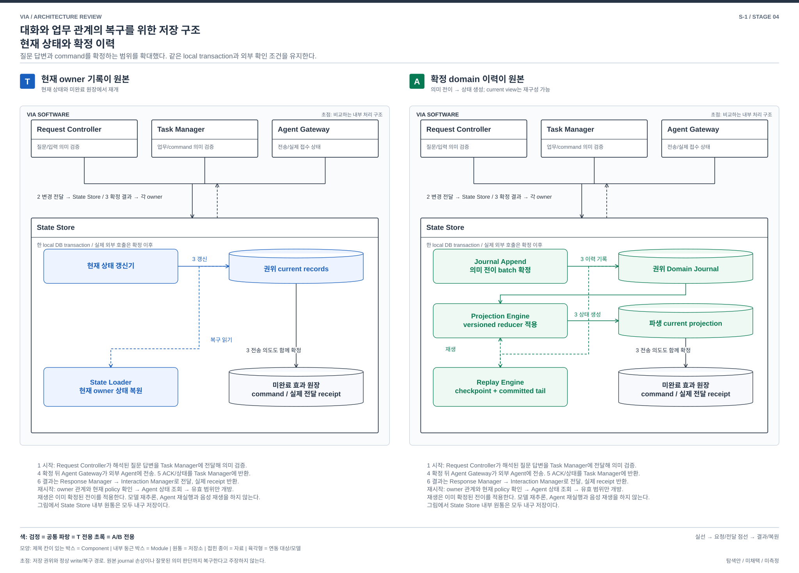

# 대화와 업무 관계의 복구를 위한 저장 구조 — 현재 상태와 확정 이력

> S-1 / **구조 비교 후보로 유지** / Stage 4 / 2026-10-02
> [확대 탐색](./04-13-broad-mechanism-discovery.md), [품질 검토](./04-17-broad-mechanism-review.md). 이전 [복구 저장 비교](./recovery-state-source.md)를 새 선발 기준으로 재심사했다. 새 발명이나 기존 DP 채택으로 표시하지 않는다.

## 1. 문제와 선택

사용자가 질문에 답한 직후 Task가 종료되고 결과가 일부 전달된 상태에서 VIA가 재시작한다. 어떤 답이 어느 실행에 적용됐고, 무엇이 확정됐으며, 무엇을 다시 전달해야 하는지 연결해야 한다. 상태 표현을 변경하거나 관계 오류를 조사할 때도 이 의미를 잃으면 안 된다(P-08/10/13/15/16).

**T는 현재 owner 상태와 미완료 원장이 원본이다. 대안은 확정된 의미상 전이 이력이 원본이며 현재 상태는 그 이력으로 만든 결과다.** T는 현재 상태를 직접 읽어 재개하는 단순성과 비용에 유리하다. 대안은 현재 조회 구조와 과거의 확정 사실을 분리하여 view를 다시 만들고 전이를 추적할 수 있지만, 모든 writer와 과거 사건의 의미를 오래 유지해야 한다.

T에도 durable inbox/outbox, Semantic Commit, Task/Execution 및 전달 기록이 있다. “T는 이력이 없다”라고 하지 않는다. 정상 crash에서 둘 다 같은 요구를 만족하려는 설계다. 어느 쪽도 외부 Agent의 잃어버린 ACK를 local 기록만으로 알 수 없다.

## 2. 무엇을 원본으로 확정하는가

한 **domain event**는 `질문에 답변을 확정함`, `전송 시작을 확정함`, `Task의 source 상태를 반영함`처럼 owner가 검증한 의미상 전이다. 모델의 내부 사고나 원음 전체를 기록하는 뜻이 아니다. **reducer**는 이미 확정된 사건을 현재 상태에 적용하는 결정적 코드이며 모델을 다시 호출하지 않는다. 여러 owner가 함께 확정할 사건은 하나의 **Domain Batch**에 담는다.

| 책임 | T | 확정 이력 원본 |
| --- | --- | --- |
| 정상 변경 | Request Controller, Task Manager, Agent Gateway, Response Manager, Policy Manager, Context Manager가 현재 상태와 intent의 변경 집합 생성 | 같은 owner가 현재 유효 조건을 검증하고 의미 event, 예상 owner revision과 효과 intent를 생성 |
| 원자성 | State Store의 단일 local transaction으로 변경 집합 확정 | 동일한 local transaction으로 journal append, reducer 적용 위치, 현재 view와 effect intent를 함께 확정. 별도 DB server나 분산화를 추가하지 않음 |
| 현재 읽기 | 현재 owner record의 권위 값 사용 | journal 위치에 일치하는 current projection 사용. 위치/검증 불일치면 해당 scope의 새 실행을 막고 재구성 |
| 외부 전송/게시 | 각 outbox의 현재 epoch 및 실제 권한 검사 후 수행 | 동일. replay는 outbox intent의 논리 상태를 만들 뿐 외부 전송이나 음성 재생을 직접 수행하지 않음 |
| 상태 생성/복구 | 현재 record, schema 및 미완료 원장 복원 후 외부 조회 | 검증된 checkpoint와 committed tail을 reducer로 재생한 뒤 관계 검증과 외부 조회 |
| 삭제 | 현재 tombstone, 파생 view/KV 무효화 및 payload 정리 | 같은 요구에 journal의 삭제 가능한 payload 참조, 옛 event reader와 checkpoint 무효화까지 포함 |

State Store 내부에 Journal Append, Projection/Replay, Checkpoint 관리 Module이 생긴다. 이 Module의 유무가 비교의 근거는 아니다. 기존 owner들이 현재 record를 최종 원본으로 갱신하던 쓰기 계약과, 재시작 시 무엇을 믿는지가 함께 바뀐다.

[편집 가능한 draw.io 원본](./diagrams/mechanism-state.drawio). 그림의 번호는 아래 정상 흐름의 단계와 같다. 비교하는 하위 구조를 확대했으며, 공통 음성 입력과 외부 업무 실행 내부는 펼치지 않았다.

## 3. 같은 사건의 정상 흐름

공통 준비는 Interaction Manager의 입력 → Request Controller의 근거/질문 조회 → Request Interpreter의 답변 대상 해석이다. “보고서 작업의 질문에 대한 답변”임이 특정되고 승인 digest와 현재 policy가 일치한 상태에서 시작한다. 대화의 “응” 자체를 권한으로 만들지 않는다.

| 순서 | T | 확정 이력 원본 |
| --- | --- | --- |
| 1 | Request Controller가 현재 질문/입력 revision을 검사하고 Task Manager에 답변 command 준비 요청 | 동일 의미 검사. Task Manager에 답변 처리의 예상 Execution/질문 revision과 command intent 요청 |
| 2 | Request Controller와 Task Manager가 질문 답변, 현재 Task 및 command의 변경 집합을 State Store에 전달 | 두 owner가 QuestionAnswerCommitted 및 CommandPrepared 등 의미 전이와 효과 intent를 State Store에 전달. event 이름은 설계 예시이며 기존 계약 이름인 것처럼 사용하지 않음 |
| 3 | State Store가 현재 record와 outbox를 한 transaction으로 확정 후 owner에 결과 반환 | State Store가 batch를 append하고 versioned reducer로 current view/outbox를 구성해 같은 transaction으로 확정 후 owner에 batch 위치 반환 |
| 4 | Agent Gateway가 현재 admission/hold/policy를 검증해 DISPATCHING을 확정하고 외부 Agent에 전달 | Agent Gateway가 같은 조건을 검증해 DispatchStarted batch를 확정한 뒤 같은 외부 전달. journal append 이전에 보내지 않음 |
| 5 | Agent Gateway → Task Manager: ACK/상태 사건. Task Manager가 inbox 적용과 current projection, domain outbox를 함께 확정 | 동일 source 사실을 검증한 owner event로 batch 확정. current projection은 그 결과. 중복/역순 source 사건을 새 사실로 재생하지 않음 |
| 6 | Request Controller → Response Manager: 현재 결과 게시. Response Manager → Interaction Manager: Text/Voice. Interaction Manager → Response Manager: 실제 receipt 확정 | 같은 주체와 실제 전달. Publication/Delivery 의미 전이를 기록하되 생성 완료를 실제 청취로 기록하지 않음 |

## 4. 정정, 철회, 실패와 재시작

| 사건 | T | 확정 이력 원본 |
| --- | --- | --- |
| 새 입력 hold와 전송 경쟁 | 공유 transaction에서 먼저 확정된 hold/DISPATCHING에 따라 처리 | 동일. HoldChanged와 DispatchStarted의 검증/확정 순서가 원본 batch에 남음. journal만 먼저 남기고 실패한 projection을 정상 성공으로 처리하지 않음 |
| terminal과 답변 교차 | 현재 Execution/질문 revision으로 늦은 승인 거부 | 같은 guard. terminal이 확정된 batch 뒤의 늦은 답변은 실패 사실을 남길 수 있으나 유효 승인 event를 만들지 않음 |
| 삭제/정책 철회 | 현재 epoch와 tombstone을 실제 사용 port가 검사 | 현재 epoch가 우선. 개인 payload는 별도 삭제 가능한 자료로 두고 event는 opaque ID와 상태 metadata만 보존. 삭제 이전 checkpoint/KV를 무효화하고 replay가 본문을 부활시키지 않게 함 |
| 정상 commit 직후 crash | current records와 미완료 원장 복원, 외부 조회 | committed batch만 재생. 부분 append/부분 transaction을 적용하지 않음. effect ledger와 command key로 중복 외부 실행 방지 |
| current 관계가 손상되고 원본은 정상 | 남아 있는 current record/원장, 백업 및 source로 가능한 범위 복원 | journal 및 reader가 정상인 경우 파생 관계를 재구성. 처음부터 잘못된 의미 event이거나 journal도 손상되면 이 이익 없음 |
| projection/reducer 변경 | current schema와 migration 변환을 설계 | event 의미는 유지하면서 새 view 생성 가능. 과거 event reader, reducer version, checkpoint 및 삭제 변환을 함께 관리. 잘못된 reducer를 그대로 다시 실행하면 오류 반복 |
| Agent ACK/Voice receipt 유실 | UNKNOWN 유지, Agent 조회, 실제 청취를 추정하지 않음 | 동일. 풍부한 내부 이력으로 외부 사실을 만들어내지 않음 |
| 저장 상한/지원 reader 없음 | 새 내구 확정 차단, 원인과 확인 상태 표시 | 같은 동작. 권위 이력을 임의 잘라 새 상태를 정상으로 만들지 않음. 지원하는 checkpoint/compaction 의미가 검증되지 않으면 자동 과거 이력 제거 금지 |

개인정보를 지워야 한다는 이유로 과거 event의 삭제 불가능한 원문을 남기지 않는다. 반대로 원문 삭제 뒤 동일 응답을 완전히 재현할 수 있다고 주장하지 않는다. 복구하는 것은 현재 허용된 업무 관계와 확인 가능한 진행 상태다.

## 5. 가장 싼 반론과 양방향 전환

### 반론 1: backup, WAL 또는 row 변경 로그를 추가하면 충분하지 않은가?

**단순 저장 손상 복구에는 충분할 수 있다.** 이 조건만으로 S-1을 선택할 이유는 없다. S-3을 강한 대안 반론으로 남긴 이유다. T의 DB crash 복구와 backup을 일부러 약화하지 않는다.

S-1의 추가 성질은 모든 의미상 확정 전이를 소비하는 versioned 해석 규칙으로 현재 상태를 생성한다는 것이다. 물리 변경 기록은 기존 row/페이지를 복원한다. “이 질문 답변이 이 Task의 이 command로 확정됐다”는 도메인 전이의 지원 schema와, 새 view로 재적용할 계약을 자동 제공하지 않는다. 그런 의미를 generic row log에서 추출할 수 있다면 과거 schema별 변환과 누락/중복/삭제 규칙을 작성해야 하며, 단순 저장 adapter의 비용으로 끝나지 않는다.

### 반론 2: T에 완전한 domain 이력과 replay를 추가하되 current record도 원본으로 남기면?

가능한 hybrid다. 다만 모든 owner의 전이를 빠짐없이 기록하는 계약, journal와 current 기록의 동시 확정, reader/reducer, 효과 재실행 차단, 삭제와 checkpoint 관리가 필요하다. 두 원본이 다를 때 어느 것을 믿고 고칠지도 정해야 한다. 필요한 업무 정보를 이미 충분히 기록한 T 영역은 그만큼 재사용할 수 있다. **점진 도입이 가능하다는 사실은 인정하되, 이 변경 전체를 로그 Component 하나 추가하는 작은 작업으로 세지 않는다.**

### 전환 판정

| 방향 | 값싸게 보존할 것 | drain 후에도 남는 핵심 변경 |
| --- | --- | --- |
| T → S-1 | local DB, owner의 권한과 외부 API, 이미 있는 command/event/receipt, Agent 조회 | owner별 현재 변경 집합을 의미 전이로 표현, 원본 확정 계약 교체, deterministic 상태 생성, 옛 event/삭제/재생 규칙 설계. 기존 record를 시작 snapshot으로 가져와도 앞으로의 쓰기/복구 방식 변경은 남음 |
| S-1 → T | 검증된 최신 projection을 초기 current state로 사용, 외부 identity 유지 | 기존 reducer를 현재 상태 갱신 함수로 재사용하면 정상 writer를 다시 만들 필요는 없음. journal 의존 복구/검증을 해제하고 current 상태와 migration을 권위 계약으로 전환. 재생을 포기하는 만큼 역방향은 더 저렴할 수 있음 |

**비대칭:** 최신 projection과 reducer를 그대로 사용하는 역전환은 T에서 완전한 event 원본 체계를 도입하는 것보다 작을 수 있다. journal 기록을 끄는 것만으로 모든 read/복구/삭제 경로가 독립하는지 확인해야 하지만, 이미 독립돼 있다면 그 제거를 대규모 개발이라고 하지 않는다. 이 후보의 핵심 비용은 첫 도입과 이후 의미 전이/reader 호환 유지에 있다. 양방향의 공수를 같다고 주장하지 않는다.

**판정: 다른 상태 운영 구조이며 주요 비교 후보로 유지한다.** 기존 API의 유지나 current projection의 존재 때문에 같은 구조로 분류하지 않는다. 파일 수나 과거 데이터를 소급 복원할 수 없다는 사실은 전환 난이도의 근거로 쓰지 않는다.

## 6. 선택 조건과 반증

- **T를 선택할 조건:** 현재 record와 미완료 원장, source 조회 및 backup으로 필요한 복구가 충분하고 정상 write/삭제/버전 유지 비용을 줄이는 것이 중요하다.
- **S-1을 선택할 조건:** 여러 Request/Task/질문/게시 관계의 확정 경위를 지속적으로 추적하고, 상태 표현 변경 때 같은 확정 사실에서 view를 재구성하는 것이 중요하다. 원본 전이의 schema와 삭제 계약을 장기간 유지할 수 있어야 한다. 대규모 트래픽이나 cloud 배포를 전제로 하지 않는다.
- **반증:** T에 작은 감사 기록/검증된 backup만 추가해 필요한 진단과 복구 범위를 모두 충족하면 S-1의 선택 가치는 낮아진다. event schema/삭제 관리와 replay가 시간/자원 예산을 침해해도 이익이 상쇄된다.
- **지원과 손실:** 정상 기능 범위는 유지하려는 안이다. 미지원 reader, 유실된 개인 원문, 권위 journal 손상과 외부 ACK 불명은 별도 실패다. replay 비용 때문에 늦은 복구를 정상 시간으로 숨기지 않는다.

기술 원리의 참고로 [Microsoft의 Event Sourcing 설명](https://learn.microsoft.com/en-us/azure/architecture/patterns/event-sourcing)은 전이 이력 원본, 상태 재구성과 schema/동시성의 변경 부담을 설명한다. 이 출처는 VIA의 품질 우위나 특정 DB 선택의 근거가 아니다. 위 VIA 전환과 기능 판정은 저장소의 실제 target에 대한 설계 분석이다.
