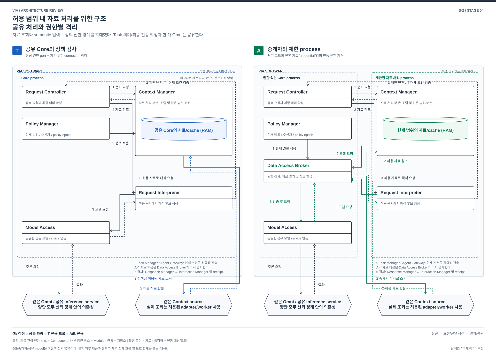

# 허용 범위 내 자료 처리를 위한 구조 — 공유 처리와 권한별 격리

> S-2 / **구조 비교 후보로 유지** / Stage 4 / 2026-10-02
> [확대 탐색](./04-13-broad-mechanism-discovery.md), [품질 검토](./04-17-broad-mechanism-review.md). 기기별 OS enforcement와 성능은 미검증.

## 1. 같은 목적과 품질 충돌

VIA는 화면, 문서, 메일, 대화와 업무 결과를 필요한 범위에서 읽고, 현재 허용한 목적과 수신자에게만 제공해야 한다(P-03/11/12). 서로 다른 요청의 자료가 섞이거나 권한이 바뀐 뒤 과거 결과가 제공되면 안 된다. T는 올바른 프로그램 경로에서 정책을 검사하며 여러 요청의 처리 코드는 공유 Core 안에 있다. 대안은 자료를 다루는 일부 코드가 잘못 동작해도 다른 범위의 자료나 외부 제공 경로에 직접 도달하기 어렵도록 권한 배치를 바꾼다.

**핵심 선택은 자료 접근 권한이 있는 공유 처리 코드에 검사를 둘 것인가, 권한을 가진 중개자와 제한된 자료 처리 process를 분리할 것인가다.** 대안은 정보 경계를 강화하는 대신 IPC, 복사, 자료 handle 수명과 제한 process 운영 비용을 부담한다. 보호하려는 결함/오접근 범위가 실제로 중요할 때 선택할 이유가 있다. 모델 의미 정확성의 자동 개선이나 모든 공격의 방어를 주장하지 않는다.

T의 [process 배치](../target-architecture/architecture.md#14-프로세스-배치fault-boundary)는 위험한 native/blocking connector와 무거운 화면 읽기를 이미 worker로 분리한다. 대안은 그 worker 하나를 더 만드는 안이 아니다. **Context 조립/cache와 Request Interpreter의 입력 구성 코드가 공유 Core의 raw 자료, credential과 전역 저장 접근을 보유하지 않도록 경계를 옮기는 안**이다. 원래 격리된 connector 장애를 새 이익으로 세지 않는다.

## 2. 실제 권한과 실행 구조

**자료 handle**은 특정 source/range/revision을 현재 목적, 수신자, policy epoch에서 사용할 수 있도록 중개자가 발급한 불투명 참조다. 문자열에 `scope`라는 필드를 붙인 것만으로 권한 격리가 되지 않는다. 제한 process가 그 값을 바꾸거나 다른 파일/네트워크를 직접 열어 우회할 수 없어야 한다.

**Data Access Broker**는 새 Component다. Policy Manager의 현재 권한과 Request Controller의 유효 요청을 확인하여 실제 자료를 열고, 제한 process 또는 허가된 외부 전달 경로에 부여할 handle을 관리한다. 외부 업무 실행은 맡지 않는다. 권한을 결정하는 의미상 owner는 계속 Policy Manager다. Broker는 Policy Manager 및 제어 owner와 같은 신뢰 Core에 두고 같은 State Store의 현재 epoch와 command 확정 경계를 사용한다. 별도 권한 복제본을 비동기로 믿지 않는다. 제한 process는 Broker가 허용한 IPC만 사용할 수 있고 Model Access의 직접 호출 port나 credential을 받지 않는다. 그림의 Context Manager 상자는 이동한 자료 처리 부분이며, 현재 정책과 권위 state는 Core에 남는다.

| 영역 | T | 대안 |
| --- | --- | --- |
| 대화/업무 제어 | Core 안의 Request Controller, Task Manager, Agent Gateway, Response Manager가 상태와 확정 소유 | 같은 owner 및 공유 transaction 유지. 자료의 직접 전역 접근을 제한하고 참조/검증 결과를 사용. 제어 영역과 Broker는 신뢰 경계 안에 남음 |
| 자료 처리 | Core의 Context Manager와 Request Interpreter가 허용된 raw package, cache와 semantic 입력을 처리 | 해당 요청 범위의 제한 process 안에 Context Manager의 자료 조립/cache Module과 Request Interpreter 배치. 범위 밖 자료, credential, 전역 DB와 임의 네트워크 접근 없음 |
| source 열기 | Context Manager의 adapter 및 필요한 Connector Worker가 정책에 맞게 read | Context Manager의 제한 client가 Data Access Broker에 handle 요청. Broker가 source adapter/Connector Worker를 호출하고 허용된 자료만 반환 |
| 저장 | State Store의 owner state, 공통 정책/자료 cache 관리 | 권위 state는 동일. 제한 process의 cache/임시 파일은 scope별 제한 영역. State Store에 직접 쓰지 않고 owner port를 통해 검증된 후보/receipt만 전달 |
| 모델 | Model Access의 공유 service에 역할별 격리 session 전달 | 같은 단일 weights. Broker가 허가한 자료/job만 Model Access로 전달. 공유 inference service는 여전히 모든 허용 세션을 처리하는 **신뢰 경계 내부**이며 이 안으로 격리된 것으로 주장하지 않음 |
| 외부 제공 | Agent Gateway의 현재 command/policy 검사와 전달 | Agent Gateway의 승인된 command digest, 수신자 및 현재 policy에 결합된 제공 요청만 Broker가 해석. 제한 process는 외부 Agent에 직접 보낼 수 없음 |

제한 process는 새 자료 권한을 스스로 넓힐 수 없다. 기존 자료 범위가 부족하면 Request Controller에 부족한 근거를 제안하고 현재 권한에 맞는 새 범위를 준비한다. 사용자가 이미 허용한 범위 안의 확대에 무조건 새 확인 질문을 만들지는 않는다. 실제 동의 확대가 필요한 경우에만 공통 consent 절차를 따른다.

process를 요청마다 무한히 유지하지 않는다. 유한한 동시 실행 및 메모리 예산으로 받고, 기다리는 요청은 필요한 참조만 내구 보존한 뒤 process를 종료할 수 있다. 같은 권한의 자료라도 요청/역할 Context를 임의 합치지 않는다. 제한 process를 다시 쓸 경우 이전 handle, 원문 및 session을 폐기했음을 확인해야 한다.

[편집 가능한 draw.io 원본](./diagrams/mechanism-scope.drawio). 그림의 번호는 아래 정상 흐름의 단계와 같다. 비교하는 하위 구조를 확대했으며, 공통 음성 입력과 외부 업무 실행 내부는 펼치지 않았다.

## 3. 같은 자료 읽기와 업무 위임 흐름

사건은 “선택한 문서를 요약해줘. 이 요약을 지정한 업무 Agent에 넘겨줘”다. 업무의 일부인 요약/전송 전체는 공통 scope 규칙에 따라 하나의 Agent 목표로 위임할 수 있고, VIA가 대신 외부 업무를 수행하지 않는다. 아래는 VIA가 목표를 이해하기 위해 필요한 자료를 읽고 허용 범위로 인계하는 경로다.

| 순서 | T | 권한별 격리 |
| --- | --- | --- |
| 1 | Interaction Manager → Request Controller: 같은 입력, 선택 identity와 당시 근거. Request Controller가 Policy Manager의 허용 범위 확인 | 동일. Request Controller → Data Access Broker: 유효 요청, source/range, 목적/수신자/epoch의 자료 범위 준비 요청 |
| 2 | Request Controller → Context Manager: bounded read. Context Manager → source adapter/Connector Worker: 조회. 반환 자료와 receipt 구성 | Broker → source adapter/Connector Worker: 허용 조회. Broker가 scope handle과 제한 process를 준비해 Context Manager의 제한 client에 자료/receipt 반환. 이 process에는 다른 자료를 여는 권한이 없음 |
| 3 | Request Controller → Request Interpreter → Model Access: 허용 raw package로 의미 해석. Model Access → Request Interpreter → Request Controller: 제안 | 제한 process의 Request Interpreter → Broker: 현재 자료를 사용한 model job 요청. Broker가 scope 검증 후 Model Access에 전달, 반환 결과를 같은 제한 process로 전달. Request Interpreter → Request Controller: Semantic Proposal과 근거 참조 |
| 4 | Request Controller가 현재 revision/자료/Task/권한을 확인해 의미 및 admission 확정 | 동일. 제한 process의 반환에 붙은 source/epoch는 Broker의 실제 발급 기록과 대조. 임의로 주장한 다른 범위의 근거를 채택하지 않음 |
| 5 | Task Manager가 command를 만들고 Agent Gateway가 현재 권한을 검사해 허용 Context를 외부 Agent에 제공 | Task Manager와 Agent Gateway는 같은 command/전송 상태를 관리. Agent Gateway → Broker: 승인된 digest와 수신자의 자료 제공 요청. Broker가 현재 policy/handle을 검사하여 해당 전달 경로에만 자료 제공 |
| 6 | Agent Gateway/Task Manager의 확인 사실 → Request Controller → Response Manager → Interaction Manager. 실제 Text/Voice receipt 기록 | 동일한 결과/전달 의미. Broker 검사는 실제 Agent 접수나 사용자 청취를 대신하지 않음 |

Interaction Manager의 capture, 독립 ASR, 좁은 S2S와 즉시 음성 stop은 공유한다. Omni를 제한 process마다 적재하지 않는다. Broker 경유가 늘어난 모델/자료 전달과 직렬화는 VIA 시간/자원 비용이다.

## 4. 정정, 철회, 실패와 재시작

| 사건 | T | 권한별 격리 |
| --- | --- | --- |
| “그 문서 말고 다른 문서” | input hold, 이전 해석/제공 admission 무효화, 새 자료 조회 | 같은 hold. 기존 handle/job을 새 input revision에 재사용 금지. 새 범위가 필요한 제한 process/handle 준비 |
| 정책 철회 | 현재 policy epoch로 신규 read/provide/publish 차단, cache/KV 무효화 | Broker가 신규 handle 사용 및 외부 제공을 현재 epoch로 차단. 관련 제한 process의 pending IPC/job을 무효화하고 본문/handle 폐기 또는 process 종료. 이미 본 원문을 소급해서 안 본 상태로 만들지는 못함 |
| 기억 삭제 | tombstone, dependency에 따른 파생 view/KV 무효화와 purge | 동일 원본 처리. 제한 process의 임시 파일/사본과 Model Access session도 purge 목록에 포함. 사용 차단 완료와 물리 정리 완료를 구별 |
| 제한 대상 코드가 다른 자료를 열려 함 | 정책 port를 정상 호출하면 거절. 같은 신뢰 process 안의 코드 결함이 정책 경로를 우회하는 범위까지 OS 경계로 가두지는 않음 | Broker/OS의 handle 및 파일/네트워크 권한으로 거절하는 것이 설계 요건. process 하나를 나눈 사실만으로 달성한 것으로 보지 않음 |
| 처리 process crash | 이미 격리된 connector 실패는 해당 source 영향. Core 안의 추가 처리 코드 crash라면 Core 재시작 가능 | 새로 이동한 Context 조립/입력 구성 코드의 crash는 해당 범위의 요청 재시도. Broker/공유 model/Core 장애는 여전히 공유 영향 |
| Broker/권위 저장 장애 | 해당 항목 없음. 기존 Core/State Store 장애 처리 | 새 자료 권한/제공 중단, 유효성 불명 handle로 우회 금지. UI는 접수/진행 불가를 표시. local stop 유지. Broker가 단일 중요 의존성이 되는 비용 |
| 재시작 | owner state/외부 Task 복원, policy와 deletion 적용 후 개방 | 같은 과정 후 새 Broker incarnation과 새 handle 발급. 오래된 OS handle/임시 process/KV를 재사용하지 않음. 이미 보낸 command는 외부 조회로 조정 |

악성 자료의 문장을 모델이 진짜 사용자 지시로 오해하는 문제는 이 격리만으로 해결되지 않는다. Broker, Policy Manager, 제어 owner, OS 또는 공유 inference service 자체의 침해도 이 안의 보호 주장 밖이다. 제거되는 권한과 남는 신뢰 영역을 함께 비교한다.

## 5. 싼 확장과 양방향 전환의 판정

**가장 강한 싼 방법:** 기존 Connector Worker에 제한을 더하고 Context package에 scope tag를 붙인다. source adapter의 위험은 줄일 수 있고 T의 원래 격리와 연속적이다. 그러나 Context 조립/cache, prompt 입력 구성 등 Core 코드가 여전히 raw 자료와 전역 접근을 보유하면, 그 코드의 우회를 막는 대안의 성질은 얻지 못한다.

**T → 대안:** Core의 공유 주소/객체 참조와 직접 자료 열기를 handle 기반 IPC로 바꾸고, credential 및 cache/임시 저장 접근을 실제로 제거해야 한다. source 획득, Model Access job, Agent Gateway 제공과 Response Manager 게시 경로가 같은 scope 수명/철회를 따르도록 다시 연결한다. 자료가 있는 process와 권한을 판단하는 process가 달라지므로 취소, crash, 재시작의 미완료 handle/job 회수 계약도 필요하다. 기존 외부 Agent API는 보존 가능하다.

**대안 → T:** 제한 process 안의 자료 처리기를 Core 호출로 재배치하고 handle 수명/비동기 반환/실패를 공유 cache와 owner 수명으로 변환한다. 호환 Broker를 남기면 점진 전환은 가능하지만 그 동안 두 구조의 비용을 모두 부담한다. 최종적으로 격리 권한을 없애면 보호 범위와 시험 계약도 달라진다. 새 요청부터 전환하면 live 자료 이전은 줄어도 데이터 접근 및 실패/삭제 계약 교체는 남는다.

**비대칭:** Broker port를 유지한 채 sandbox 제한만 풀거나 process를 in-process adapter로 바꾸면 역방향의 정상 기능 전환은 더 작을 수 있다. 대신 대안의 오류/오접근 제한을 잃는다. 이를 되돌릴 수 없다고 주장하지 않는다. 반대 방향에서 raw 접근 권한을 실제로 제거하고 자료 수명/모델/제공 경로를 중개 방식으로 전환하는 설계 부담이 남는 것이 이 후보의 주요 근거다.

**판정: 다른 권한 및 데이터 처리 구조이며 주요 비교 후보로 유지한다.** 네트워크 filter 하나, 새로운 access-check 함수 하나, 추가 worker 하나만으로 같은 성질을 얻지 못한다. 기존에 격리돼 있던 연동 부분은 재사용하며 무관한 Task 의미 상태나 모델 weights를 다시 설계한다고 과장하지 않는다.

## 6. 선택 조건과 반증

- **T를 선택할 조건:** 공유 Core 코드와 adapter 경계를 충분히 신뢰할 수 있고, 현재 검사/기존 worker 격리로 필요한 정보 통제 및 오류 범위를 만족하며, IPC와 메모리 부담을 줄이는 것이 중요하다.
- **대안을 선택할 조건:** 서로 다른 자료/수신 범위를 가진 요청이 공존하고, Context 처리 코드의 오류나 우회가 다른 범위에 미치는 영향을 제한할 가치가 추가 지연/메모리보다 크다. 현재 PC OS에서 필요한 파일/네트워크/IPC 제한을 실제로 강제할 수 있어야 한다.
- **반증:** 실제로 격리할 코드가 이미 기존 worker에만 있거나, 새로 분리한 process에 전역 credential/자료 접근을 남겨 두면 추가 보호 주장이 무너진다. Broker 또는 공유 model에 모든 위험을 그대로 옮기기만 해도 이익이 약하다. 범위 전환과 복사가 주요 응답 경로를 과도하게 늦추면 선택 가치는 낮아진다.
- **지원과 손실:** 정상 기능은 같은 요구를 유지하려는 안이다. 우회 권한 없이는 동작하지 않는 source integration은 fail-closed하고 미지원으로 기록한다. OS별 강제 능력, 실제 자원 및 외부 제품 호환은 검증 전이며 기능을 지원한 것으로 세지 않는다.

권한 있는 broker와 제한 process의 구별, process 분리 자체와 실제 enforcement의 구별은 [Chromium의 공식 sandbox 설계](https://chromium.googlesource.com/chromium/src/+/main/docs/design/sandbox.md)를 원리 확인에 참고했다. 이 문서의 VIA 책임 배치와 품질 효과는 별도 설계 분석이며 Chromium의 보장이나 Windows 수치를 VIA에 이전하지 않는다.
