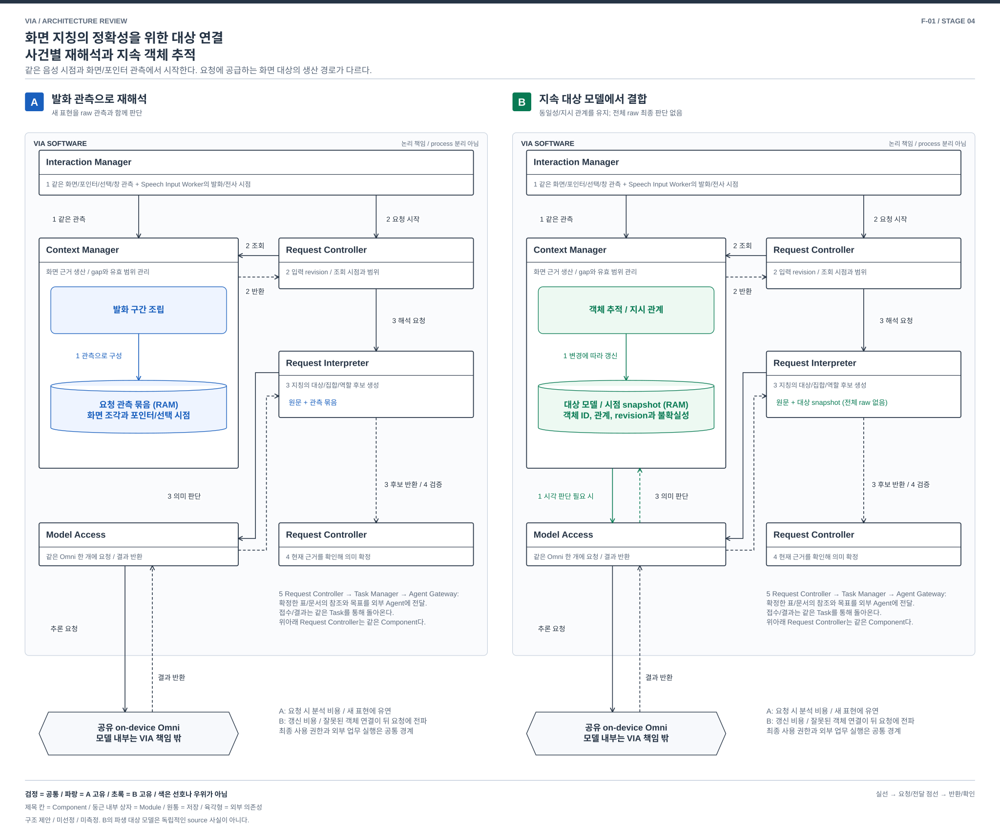

# 화면 지칭의 정확성을 위한 대상 연결 — 사건별 재해석과 지속 객체 추적

> F-01 / 핵심 기능의 추가 비교 제안 / 2026-10-03
> [전체 지도](./04-18-functional-priority-exploration.md), [13개 품질 검토](./04-22-functional-priority-review.md). A/B는 제안이며 참조 구조의 별칭이 아니다.

## 1. VIA에서 왜 중요한가

사용자가 표 A를 가리키며 “이 표는 두고”, 창을 바꿔 표 B를 가리키며 “이것만 보고서에 넣어줘”라고 말한다. 전사는 늦게 도착하고 포인터는 이미 빈 곳으로 옮겨졌다. 마지막 화면이나 같은 좌표만 사용하면 보존할 표를 수정 대상으로 위임할 수 있다. 이것은 정상 기능의 실패다.

[P-02/03](./01-00-problem-coverage.md), [UC-03/04/05](../../05-representative-use-cases.md#uc-03)의 질문이다. 목적은 **말의 각 지칭 표현을 당시의 객체/범위/집합 및 역할에 정확하게 연결하고, 같은 대상을 다시 지칭해도 이어가는 것**이다. 상위 축은 V-01 정확성, V-02 재지칭 부담, V-03 다양한 화면/정정의 지원이며 V-04/05의 지연이 충돌한다.

## 2. 같은 입력과 두 가지 구조

양안의 Interaction Manager는 같은 허용된 화면 관측, pointer/selection/focus 사건, display/window/document 식별자와 시각을 받는다. Speech Input Worker의 발화/단어 시점과 전사 수정도 동일하다. 관측과 음성의 시각 오차, 유실 구간 및 source revision을 보존한다. **B에 더 좋은 화면이나 비공개 정답 ID를 주지 않는다.**

### A. 발화 구간의 관측을 요청 시점에 다시 해석

Interaction Manager의 유한 관측 buffer에서 해당 발화 전후와 사전 선택의 유효 구간을 묶는다. Context Manager는 당시 화면 조각과 포인터 경로를 담은 **관측 묶음**을 만든다. Request Interpreter는 Model Access를 통해 원문, 단어 시각, 관측을 함께 보고 지칭 후보를 생성한다. Request Controller가 근거와 현재 적용 가능성을 검사하여 요청에 사용할 대상을 확정한다.

이미 확정한 대상은 다음 대화에서 참조할 수 있다. 매번 모든 화면을 처음부터 분석할 필요는 없다. 다만 해석되지 않은 새 관측에서 지속적인 객체 세계를 먼저 만드는 경로는 없다. 새 지칭의 의미 결합이 요청 해석에 집중된다.

### B. 관측 때부터 객체의 동일성과 관계를 유지

Context Manager 안에 **객체 추적 Module**과 **지시 관계 Module**을 둔다. 같은 관측에서 `어느 문서의 어떤 객체가 어느 시점에 어디 있었는가`, `어떤 선택/경로가 어떤 후보 집합을 가리켰는가`를 갱신한다. 이 결과인 **대상 모델**은 객체 ID, source revision, 관측 시각/범위, 동일성 후보, 집합 및 불확실성을 가진다. 앱이 안정된 ID를 주면 이용하고, 없으면 같은 Omni의 시각 해석을 Model Access로 요청한다. 숨은 검출/추적 모델은 추가하지 않는다.

Request Interpreter는 요청할 때 이 모델의 해당 시점 snapshot과 지칭/조건을 결합한다. **최종 지칭 판단에 전체 원화면을 매번 함께 넣지 않는다.** 자료가 부족하면 Context Manager가 해당 객체/구간을 다시 관측하고 대상 모델을 수정하거나 사용자에게 재지칭을 요청한다. 객체 위치 추적만으로 사용자의 의도까지 확정하지 않으며, 마지막 의미 확정은 Request Controller가 맡는다.

대상 모델은 외부 source의 사실보다 강한 원본이 아니다. 관측에서 만든 파생 해석이다. 여기서 바뀌는 것은 저장소의 복구 권위가 아니라 **요청이 사용할 화면 대상 해석을 어느 처리 체계가 생산하는가**다.

| 차이 | A | B |
| --- | --- | --- |
| 요청 전 작업 | 관측 보존, 시점과 선택 유효 구간 관리 | 같은 관측에 객체 대응/관계 해석을 수행하고 지속 갱신 |
| 의미 해석 입력 | 요청 관련 raw 관측과 시각, 기존 확정 참조 | versioned 객체/지시 관계 snapshot, 누락/불확실성 |
| 잘못된 연결의 수정 | 해당 발화의 관측으로 재해석 | 잘못된 동일성/관계를 수정하고 의존한 snapshot 및 요청을 무효화 |
| 비용이 생기는 곳 | 요청 시 재분석과 큰 입력 | 관측 변경 처리, 객체 상태, 갱신 부하와 모델의 표현 한계 |

## 3. 같은 사건의 흐름

[편집용 draw.io](./diagrams/functional-grounding.drawio). 번호는 아래 단계다. 관측 생산과 요청 해석의 수명은 구분한다.

| 단계 | A | B |
| --- | --- | --- |
| 1 | Interaction Manager → Context Manager: 같은 관측과 발화 시점. 관련 구간을 유지 | 동일 입력. Context Manager가 객체/지시 관계를 갱신하며 gap도 기록 |
| 2 | Request Controller → Context Manager: 발화 revision과 필요한 시간 범위. Context Manager → Request Controller: 관측 묶음 | 같은 요청에 해당 시점 대상 모델 snapshot과 coverage 반환. 갱신이 뒤처졌으면 기다리거나 gap 반환 |
| 3 | Request Controller → Request Interpreter → Model Access: 원문과 관측으로 두 지칭/역할 해석. 반환 후보 → Request Controller | 같은 경로에 객체 후보 및 지시 관계 입력. `첫 대상=보존`, `둘째 대상=위임 자료` 후보 반환. 전체 raw 재해석으로 우회하지 않음 |
| 4 | Request Controller가 input/source/policy revision을 확인해 대상과 역할 확정 | 동일. 대상 모델 revision과 의존 관측의 유효성도 확인 |
| 5 | Request Controller → Task Manager → Agent Gateway: 표 B의 자료 참조, 보고서 목표와 제약을 전달. 실제 접수/결과는 역방향으로 반환 | 동일한 외부 업무 계약. 표 A를 수정 대상으로 보내지 않음. 표 B의 source가 바뀌었으면 재확인 |

B의 모델 호출은 모든 pointer 이동마다 일어나지 않는다. 안정된 ID의 이동은 코드로 갱신하고, 시각 판단이 필요한 변경을 모아 유한 예산 안에서 실행한다. 그 결과 갱신 지연이 생기며 요청이 최신 완료 지점을 기다리는 비용도 센다. A 역시 bounded capture/cache와 이전 확정 참조를 사용하므로 항상 전체 화면을 재분석한다고 비교하지 않는다.

## 4. 기능 장단점이 갈리는 정상 사례

| 같은 사용자 상황 | A가 유리할 수 있는 이유 | B가 유리할 수 있는 이유 |
| --- | --- | --- |
| 새 이미지의 “줄이 끊어진 바로 아래 부분” | 객체 schema로 미리 나누지 않은 모양과 표현을 raw에서 함께 판단 | 모델에 그 부분의 객체/관계가 없으면 재구성/질문 필요 |
| 같은 표를 여러 차례 지칭하고 scroll/window가 반복 변경 | 매번 시점과 위치 관계를 다시 확인하는 부담 | 안정된 동일성 이력이 유지되면 같은 객체를 이어서 참조 |
| 비슷한 두 도형이 자리를 바꿈 | 그 발화의 raw 관측에서 다시 구별할 기회 | 추적기가 둘을 바꿔 연결하면 뒤 요청까지 오류 전파. 반대로 충분한 연속 관측이 있으면 이동의 연속성을 활용 |
| 요청하지 않은 화면 변경이 많음 | 관측 한도만 유지하고 불필요한 의미 분석을 줄임 | 요청에 쓰이지 않을 객체 갱신에도 자원 소비. 갱신을 줄이면 coverage가 낮아짐 |

“B는 미리 했으니 빠르다”는 결론은 없다. 예산 내 추적 완료, 요청에 필요한 표현의 보존, identity 오류의 빈도가 성립 조건이다.

## 5. 정정, 철회, 장애 및 재시작

| 사건 | A | B |
| --- | --- | --- |
| “아니, 여기만” 또는 전사 시각 수정 | 새 revision으로 관측 범위/지칭 후보 재해석 | 지시 관계와 관련 snapshot을 무효화하고 새 시점/조건으로 결합. 오래된 객체 후보를 확정에 재사용 금지 |
| 원형 이동이 단순 포인터 이동 | 의도 후보를 문장과 함께 판단, 근거 부족 시 질문 | 지시 관계 Module도 `의도 불명`을 표현해야 함. 경로가 있다는 이유로 선택 집합을 확정하지 않음 |
| source 변경, lock 또는 수집 gap | 당시 관측과 현재 source를 구분, 부족하면 재지칭 | 객체 continuity를 끊고 불명으로 표시. 마지막 객체 상태를 새 관측처럼 연장하지 않음 |
| 동의 철회/삭제 | 관측과 파생 요청 참조의 신규 사용 차단 및 정리 | 같은 동작에 객체 모델, snapshot, 모델 job과 파생 연결까지 포함 |
| 추론/갱신 실패 | 해당 해석 보류, 남은 근거로 재시도 또는 질문 | 미완료 모델 revision을 publish하지 않음. 별도 요청은 유효 scope만 진행 |
| 재시작 | 확정 대상/허용된 최소 근거를 복원하고 없는 raw는 재조회 | 확정 대상은 동일하게 복원. 활성 객체 모델은 source revision을 다시 확인해 구성. 사라진 raw에서 과거 동일성을 꾸며내지 않음 |

## 6. 싼 전환 반론과 판정

**반론:** A에 객체 cache를 추가하면 B가 아닌가? 추가한 cache를 최종 raw 해석의 힌트로만 쓰면 기존 S-02/D-1 확장에 가깝다. B의 선택은 대상 생성, 동일성 변화, 불확실성/갱신 완료 및 정정을 Context Manager의 지속 처리 계약으로 옮기고, Request Interpreter가 그 표현으로 요청을 해결하는 것이다.

A → B에는 객체/관계 표현, 추적 및 의존 무효화, snapshot 의미와 Request Interpreter 입력 계약이 필요하다. B → A는 원관측을 보존했다면 더 쉽지만 객체 snapshot 소비를 raw 시점 결합으로 바꾸고 반복 지칭/정정 처리를 다시 검증해야 한다. 두 경로를 이미 구현한 hybrid라면 요청별 전환은 쉬울 수 있다. 그때도 추적 유지비와 최종 raw 재분석비가 동시에 사라지는 것은 아니다.

**비용 구별:** tracker/schema의 개발은 기능 개발비다. 과거 관측에서 객체 모델을 만드는 비용은 이행비이며 새 관측부터 시작하면 줄어든다. 그 뒤에도 남는 구조 차이는 대상 해석 생산, 갱신 완료와 snapshot 소비, 동일성 수정의 의존 전파다. 새 알고리즘의 구현량이나 과거 데이터 유실 자체를 구조 중요성의 근거로 삼지 않는다.

**판정:** VIA 특화성이 높고 두 원리의 기능 손익이 분명하므로 우선 심화할 주제다. 다만 B가 작은 객체 cache로 같은 효과를 얻거나 대부분 요청에서 전체 raw fallback을 해야 한다면 별도 DP의 구조적 근거가 약해진다. M-2의 전처리 한 절로 합치는 선택도 열어 둔다.

## 7. 적용 가능성과 선택 조건

- **A 선택:** 화면 종류와 표현이 다양하고 첫 지칭이 많으며, 지속 시각 해석의 PC 비용을 줄여야 할 때. 요청 시 분석을 감수한다.
- **B 선택:** 같은 객체에 대한 반복 지칭/이동이 중요하고, 현재 source와 모델로 필요한 동일성/관계를 안정적으로 표현할 수 있을 때. 갱신 비용과 지원 영역을 감수한다.
- **구현 가능한 토대:** 양안 모두 현재 관측/시점 계약, source ID와 단일 Omni 연동을 활용할 수 있다. B의 객체 대응 알고리즘과 schema는 새 SW 개발이다. 안정된 ID가 없는 그래프/이미지의 연속 대응 능력은 검증 전이다.
- **미지원/부분 지원:** B 표현 밖 대상, 양안의 유실된 과거 관측은 재지칭/사용자 선택이 필요하다. 그 추가 조작을 V-02, 원래 목표 미완료를 V-03에 남긴다. 자동 화면 조작으로 몰래 메우지 않는다.
