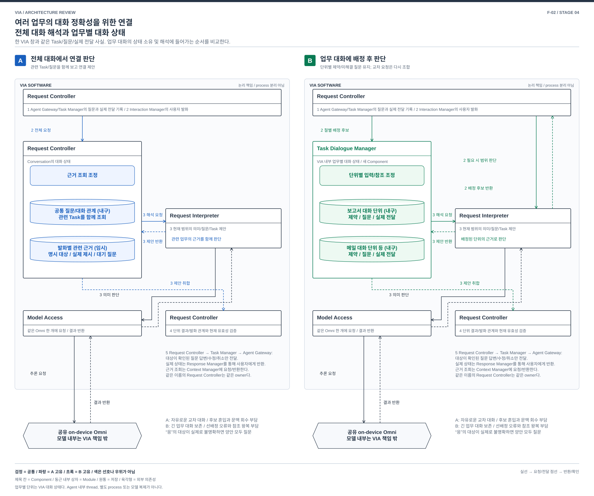

# 여러 업무의 대화 정확성을 위한 연결 — 전체 대화 해석과 업무별 대화 상태

> F-02 / 핵심 기능의 추가 비교 제안 / 2026-10-03
> [전체 지도](./04-18-functional-priority-exploration.md), [13개 품질 검토](./04-22-functional-priority-review.md). 별도의 Agent 대화창을 사용자에게 요구하는 비교가 아니다.

## 1. VIA에서 왜 중요한가

보고서 Task와 메일 Task가 동시에 질문을 보낸다. VIA가 보고서 질문을 들려준 직후 메일 질문도 Text로 표시된다. 사용자가 “응, 그리고 메일은 보내지 마”라고 한다. “응”을 최신 도착 질문에 붙이거나 뒤의 취소를 보고서에 적용하면 실패다. 반대로 매번 Task 이름과 전체 지시를 다시 말하게 해도 VIA의 가치가 줄어든다.

[P-06/08/09](./01-00-problem-coverage.md), [UC-06/10~16](../../05-representative-use-cases.md#uc-06)의 문제다. **동시에 여러 업무를 유지하면서 자연스러운 후속 발화가 정확한 업무/질문/직접 응답에 이어지도록 하는 것**이 목적이다. V-01의 오연결 방지, V-02의 자연스러운 이어가기, V-03의 복합/교차 발화 지원이 중심이다.

## 2. 공통 사실과 두 가지 구조

양안은 같은 입력, Task/Execution 사실, 원문 대화와 실제 Text/Voice 전달 범위를 받는다. 업무 상태의 원본은 Task Manager이며 Agent 내부 작업 계획을 VIA가 재구현하지 않는다. 질문 생성과 실제 제시는 다르다. **참조 구조에도 이미 질문 focus와 유효 질문 검사, 관련 Task 후보 선별이 있다.** B만 “응”을 연결하거나 무관한 Task를 후보에서 뺄 수 있다고 주장하지 않는다.

### A. Conversation 전체에서 이번 발화의 연결을 함께 판단

Request Controller가 Conversation의 미해결 질문/확정 의미 관계를 소유한다. Context Manager가 명시 이름, 결과물, 실제 제시 기록과 관련 Task의 근거를 모은다. Request Interpreter는 한 발화의 여러 절을 함께 보고 `어떤 질문의 답변`, `어떤 Task의 수정/취소`, `새로운 요청`을 제안한다. Request Controller가 현재 질문/Task/정책을 검사해 확정한다.

전체 원문과 모든 Task를 매번 넣는 안은 아니다. 검색/요약으로 관련 후보를 제한하면서도 최종 연결 판단의 책임과 대화 상태는 Conversation 단위에 있다. 필요하면 후보를 더 조회한다.

### B. 업무별 대화 상태에 입력을 배정하고 그 안에서 해석

VIA 안에 **Task Dialogue Manager**라는 새 Component를 둔다. 각 Task 및 직접 대화 주제에 대한 논리적 대화 단위를 관리한다. 각 단위는 그 업무의 사용자 제약, 아직 해결하지 않은 질문, 직접 응답/자료 참조, 마지막 실제 전달 범위와 대화 revision을 소유한다. 별도 프로세스나 별도 Omni 가중치를 뜻하지 않는다. Agent의 내부 thread와도 다르다.

Request Controller는 발화를 받을 때 명시한 업무/질문, 실제 노출된 유효 질문, 현재 대화 초점과 주제 전환 단서를 이용해 **배정 후보**를 만든다. 여러 절은 각각의 배정 후보로 나눌 수 있다. 규칙으로 범위를 정하기 어려우면 각 단위의 짧은 주제 설명과 실제 제시 기록을 Request Interpreter에 보내 배정 후보를 반환받는다. 이 추가 의미 호출도 Model Access를 경유하며 시간과 자원을 센다. 그래도 불명확하면 사용자에게 묻고, 임의로 한 Task에 확정하지 않는다. Task Dialogue Manager는 배정된 단위의 Context로 Request Interpreter를 호출하여 후보를 반환한다.

업무별 대화 안에서 나온 해석은 **배정과 상태 revision이 맞을 때만** 적용된다. Request Controller는 여러 단위에서 나온 제안을 한 사용자 발화에 다시 모아 교차 관계와 현재 권한을 검사한다. Task Manager/Agent Gateway의 실제 업무 command는 공통 경로로 나간다. 의미를 제안하는 모델이 현재 초점만 보고 곧바로 다른 Task를 변경할 수 없다.

| 결정 | A | B |
| --- | --- | --- |
| 질문/대화 의미 상태 | Request Controller의 Conversation 상태 | Task Dialogue Manager의 업무/주제별 상태. Request Controller는 배정과 교차 관계 관리 |
| Task 연결 순서 | 관련 Context를 받은 통합 해석이 발화 의미와 연결을 함께 제안 | 명시/초점/후보 설명으로 범위를 먼저 배정하고 해당 대화 안에서 해석. 불명 배정은 확정 금지 |
| 다른 업무의 Context | 필요하면 한 해석 입력에서 함께 고려 | 다른 단위의 근거는 명시적 참조 요청으로 전달. 모든 원문을 항상 합치지 않음 |
| UI와 모델 | 단일 VIA UI, 공유 Omni | 동일. Task 단위마다 모델 가중치나 열린 모델 세션을 유지하지 않음 |

B의 질문 기록은 Task Manager의 외부 질문 ID 및 상태와 revision으로 결합한다. 권위 있는 Agent 상태를 복제하여 독자적으로 변경하지 않는다. 같은 local State Store transaction으로 관련 질문의 종료, 배정 revision과 command intent를 함께 검증/확정할 수 있으며, 이 안에 분산 commit 비용을 끼워 넣지 않는다.

## 3. 같은 사건의 흐름

[편집용 draw.io](./diagrams/functional-dialogue.drawio). 공통 시작은 같은 두 업무의 질문과 실제 전달 기록이다.

| 단계 | A | B |
| --- | --- | --- |
| 1 | Agent Gateway → Task Manager → Request Controller: 유효한 두 질문. Response Manager → Interaction Manager: 표시/음성, 실제 전달 기록 반환 | 같은 외부 사실. Request Controller가 각 질문을 Task Dialogue Manager의 해당 단위에 연결. 실제 전달 기록도 같은 단위와 초점 기록에 반영 |
| 2 | Interaction Manager → Request Controller: “응, 그리고 메일은 보내지 마”와 입력 revision | 동일. Request Controller는 절별 배정 후보를 만듦. 규칙으로 불명확하면 Request Interpreter/Model Access에 짧은 단위 설명으로 범위 판단을 요청/반환받음 |
| 3 | Request Controller가 Context Manager에 관련 근거를 요청/반환받고 Request Interpreter에 두 질문/전달/Task의 전체 연결 제안을 요청. 모델 제안은 Request Controller로 반환 | Request Controller → Task Dialogue Manager: 절별 배정 후보. 각 단위 → Request Interpreter: 해당 업무의 질문/제약/전달 근거. 단위별 제안 → Request Controller |
| 4 | Request Controller가 해석, 유효 질문, Task 및 input revision을 대조해 확정. “응”이 여전히 모호하면 질문 | 같은 확인에 대화 단위/배정 revision 추가. 어느 단위도 유효성을 확인하지 못한 “응”을 독자 적용하지 않음. 메일 취소의 명확한 부분과 불명 답변을 구분 |
| 5 | Request Controller → Task Manager → Agent Gateway: 확정된 대상의 답변/취소. 반환 상태 → Response Manager → Interaction Manager | 동일한 실제 업무 및 전달. 취소 접수를 취소 완료로 말하지 않으며, 보고서와 메일 결과를 구분 |

두 질문이 서로 다른 채널에 실제로 노출됐고 어느 것에 답했는지 정보가 없다면 양안 모두 확인해야 한다. B의 초점 규칙이 사용자의 의도를 관측 없이 알아내는 수단은 아니다. 반대로 명시한 질문 ID나 유일한 실제 제시 질문이 있으면 불필요하게 다시 물을 필요는 없다.

## 4. 기능 손익이 드러나는 상황

| 상황 | A의 강점/비용 | B의 강점/비용 |
| --- | --- | --- |
| 한 업무에 대해 여러 번 형식/제약을 고친 뒤 “계속해” | 관련 제약을 매번 정확히 회수해야 함. 적절한 index가 있으면 충분할 수 있음 | 해당 단위가 미해결 제약과 이어가기 상태를 유지. unrelated 업무 원문 혼입을 제한 |
| “보고서에서 쓴 그 표현을 아까 메일에도 적용해” | 양 업무와 대화의 연결을 함께 판단하기 쉬움 | 두 단위의 참조 교환과 교차 해석이 필요. 한쪽에 먼저 고정하면 표현/대상 누락 위험 |
| 짧은 답변 중 다른 업무의 결과가 도착 | 중앙 질문/노출 상태 갱신과 해석 snapshot의 경합 | 해당 단위만 갱신하기 좋지만 초점과 실제 노출의 일관성을 별도로 유지해야 함 |
| 사용자가 빠르게 주제를 오감 | 통합 후보 판단이 자연스럽지만 후보 경쟁 증가 | 범위 배정이 틀리면 뒤의 정교한 해석도 잘못된 업무를 향함. 확인/배정 변경 비용 증가 |

B의 대화 분리는 모델 정확도를 보장하지 않는다. A도 Task별 cache/summary를 사용할 수 있다. 차이가 생기려면 업무별 대화 단위가 **자신의 미해결 상호작용을 유지하고 실제 입력 배정 및 응답을 처리**해야 한다.

## 5. 정정, 철회, 장애와 재시작

| 사건 | A | B |
| --- | --- | --- |
| “메일 말고 보고서” | 미전송 제안 hold, 새 입력으로 Task/의미 재해석 | 배정 revision 변경, 옛 단위의 임시 제안 취소. 아직 확정하지 않은 로컬 대화 갱신을 새 단위로 몰래 옮기지 않음 |
| 대기 질문이 있는 Task 종료 | 현재 질문 유효성 검사로 늦은 답변 거절 | 같은 종료를 해당 단위에 반영하고 질문/초점 후보 무효화. 전송 직전에도 공통 Task 상태 확인 |
| 한 발화가 여러 Task 제어 | 전체 발화 의미와 독립/의존 관계를 함께 검증 | 단위별 결과를 모아 원 발화의 관계 검증. 독립 처리는 가능하되 한 절 누락을 전체 성공으로 표시하지 않음 |
| 권한 철회/대화 삭제 | 현재 정책 및 파생 대화 Context 무효화 | 같은 처리에 단위별 기억/참조, 배정 후보와 임시 모델 세션 포함. Task 실행 취소와 대화 삭제는 구별 |
| 한 해석 timeout | 해당 요청 실패/질문. 무관한 Task 진행 유지 | 해당 단위만 보류 가능하지만 공유 모델/저장 장애는 공통. 별도 프로세스 격리 이익을 주장하지 않음 |
| 재시작/채널 전환 | 확정된 질문/의미/전달 기록과 Task 연결 복원 | 단위별 원본과 배정/교차 관계를 함께 복원. 마지막 초점만 복원하여 과거 승인 자동 적용 금지 |

## 6. 싼 전환 반론과 판정

**반론:** A의 prompt를 Task별로 나누면 B가 되는가? Task 필터와 cache만 추가하고 질문/대화 의미 상태 및 처리를 Request Controller가 계속 전담하면 A의 최적화다. B에서는 업무별 대화의 미해결 상태, 입력 배정, 로컬 의미 처리 및 다른 단위와의 참조 교환 계약이 생긴다. 반면 이 추가 소유권 없이 같은 사용자 결과와 혼입 제한을 얻을 수 있다면 B의 필요성은 약하다.

A → B는 전역 질문/대화 상태를 업무 단위와 교차 관계로 나누고, 배정 오류/정정의 되돌림과 단위 결과 조합을 설계해야 한다. B → A는 공통 기록과 Task identity를 재사용할 수 있지만 로컬 의미/대기 상태를 전역 후보 해석에 노출하고 focus 의존 동작을 바꿔야 한다. 이미 양쪽 처리기를 병행한 경우 전환은 더 쉽다. 단순 Task별 모델 세션 추가를 큰 변경으로 세지 않는다.

**비용 구별:** 배정기와 단위별 조회 구현은 기능 개발비다. 기존 대화/질문을 단위별 상태로 옮기는 것은 데이터 이행비이며 새 설치에서는 줄어든다. 이행 후에도 남는 설계 차이는 전역 해석에서 업무별 상태 처리와 교차 참조 조합으로 바뀌는 순서, 소유권 및 정정 전파다. 이 중 마지막 차이가 사라지면 큰 구조 전환이라고 부르지 않는다.

**판정:** VIA의 다중 업무 interaction에 직접적이며 심화 가치가 높다. 구조 차이는 대화 상태와 처리 책임에 있다. B의 이익을 일반 Context 검색/필터링으로 충분히 얻으면 별도 DP로 강제하지 않고 M-2의 Context 구성 선택과 통합한다.

## 7. 실제 적용과 선택 조건

- **A 선택:** 업무 사이를 자주 넘나드는 복합 지칭이 많고, 관련 근거 검색으로 입력 크기를 관리할 수 있을 때. 연결 판단의 통합성과 유연성을 우선한다.
- **B 선택:** 업무별 긴 대화와 여러 대기 질문을 이어가는 것이 중요하고, 명시 대상/실제 노출/주제 후보로 입력 범위를 안정적으로 정할 수 있을 때. 범위 배정 및 교차 참조 비용을 감수한다.
- **지원 조건:** 새로운 Agent protocol을 강제하지 않는다. 현재 Task/질문/전달 ID로 VIA 내부 대화 단위를 만들 수 있다. 단위는 DB 상태이며 가중치 복제나 무한 KV가 아니다. 배정기와 교차 참조/갱신 계약은 새 SW 개발이다.
- **부분 지원:** 불명확한 업무 전환과 cross-task 함축을 B가 풀지 못하면 질문과 명시 선택이 늘어난다. 사용자가 Agent thread를 직접 관리하게 하지는 않는다. UI에서 VIA Task를 선택하는 보완은 허용하되 V-02의 추가 조작으로 센다.
