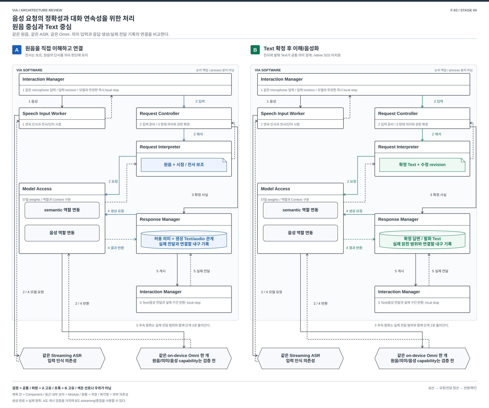

# 음성 요청의 정확성과 대화 연속성을 위한 처리 — 원음 중심과 Text 중심

> F-03 / 전형적이지만 중요한 음성 처리 비교 / 2026-10-03
> [전체 지도](./04-18-functional-priority-exploration.md), [13개 품질 검토](./04-22-functional-priority-review.md). 특정 공개 모델을 VIA 제품에서 실행해 검증한 결과가 아니다.

## 1. 무엇을 결정하는가

사용자가 “보내, 아니 보내지 말고 내용만 읽어줘”라고 한다. 이후 VIA가 읽어 주던 두 번째 항목 도중 “그 부분만 고쳐줘”라고 끼어든다. VIA는 최종 부정/정정, 실제로 들려준 부분, 그 부분을 수정할 업무를 연결해야 한다. 전사가 바뀌거나 음성 생성과 Text가 어긋나면 목표가 달라진다.

[P-01/04/08/09](./01-00-problem-coverage.md), [UC-01/06/07/11/15](../../05-representative-use-cases.md#uc-01)의 문제다. **음성의 의미를 Text로 먼저 확정한 뒤 대화를 진행할 것인가, 원음을 직접 해석하고 음성 응답과의 연결을 관리할 것인가**를 비교한다. V-01 부정/정정/후속 지칭, V-02 자연스러운 이어가기, V-03 Voice/Text 지원이 중심이다.

## 2. 공통 입력과 두 처리 구조

양안은 같은 microphone 입력과 Text 입력을 받는다. Interaction Manager의 local stop은 모델 판단을 기다리지 않는다. 같은 경량 Streaming ASR을 Speech Input Worker에서 계속 실행하여 입력 지속과 시점/전사 근거를 확보한다. 비교 때문에 B에 더 좋은 ASR을 주거나 A의 ASR 비용을 빼지 않는다. 같은 on-device Omni 한 개를 Model Access가 공유하며, 음성 처리와 Task 의미 판단의 권한/Context는 구분한다.

### A. 원음의 의미와 실제 음성 응답을 중심으로 연결

Request Interpreter의 음성 해석 경로는 전사를 보조 근거로 받고 **원음 구간을 Model Access의 semantic 역할에 직접 전달**한다. 전사에 없는 정정/억양/단어 경계 정보를 사용할 수 있다. 결과는 목표, 대상과 부정/조건, 사용한 입력 revision/구간을 담은 의미 제안이다. Request Controller가 현재 입력과 정책/Task 근거를 검사해 확정한다. 원음이라는 이유로 사용자의 의도가 확실해지는 것은 아니다.

답변은 허용된 의미와 자료를 Response Manager가 관리하고, Model Access의 음성 역할이 음성 및 대응 Text를 생산한다. 자체 지식의 허용된 S2S 직접 응답은 원음에서 생성할 수 있다. 업무/자료 관련 답변은 확정된 사실을 별도로 넘기며, 음성 역할이 Task 사실이나 업무 실행 권한을 소유하지 않는다. 입력 원음, 확정 의미, 응답 Text/audio와 **실제 전달 구간의 관계**를 다음 대화의 근거로 유지한다.

원음과 음성 생성을 연결하는 처리는 모델 내부 학습을 새로 구현한다는 뜻이 아니다. native audio 입력/출력 기능을 VIA가 어떤 계약으로 사용할지의 결정이다. 모델 호출 한 번으로 모든 처리가 끝난다거나 full-duplex/정확한 단어 시각이 자동 제공된다고 가정하지 않는다.

### B. 확정 Text를 공통 의미 경로로 사용

Speech Input Worker의 전사 후보를 Interaction Manager가 입력 revision과 함께 전달한다. Request Controller는 발화 종료와 전사 갱신을 반영한 Text를 Request Interpreter에 보낸다. **정상 의미 처리는 Text를 기준**으로 Voice/Text 입력을 같은 경로에서 해석한다. 부정/정정 의심 또는 낮은 근거 품질은 재입력/확인 대상으로 남긴다.

Response Manager는 먼저 사실/대상/결론을 담은 답변 Text와 짧은 발화문을 확정한다. Model Access의 음성 역할은 그 발화문을 읽고 Interaction Manager가 실제 전달한다. 상세 Text와 짧은 음성은 서로 다를 수 있으나 같은 확정 사실/참조에서 나온다. 다음 발화는 Text 원본과 실제 읽힌 범위를 참조한다. 음성화가 실패해도 Text의 의미는 남는다.

원음을 선택적으로 다시 읽어 전사를 수정하는 경로는 가능하다. 그 경우에도 수정된 Text revision을 거쳐 의미를 확정한다. 정상 경로가 raw audio의 별도 의미를 자유롭게 채택하면 A와 결합한 hybrid이며 순수 B의 비용/통제 단순성을 그대로 주장하지 않는다.

| 계약 | A | B |
| --- | --- | --- |
| 의미 처리의 주 입력 | 원음 + 시점/전사 보조 + 허용 Context | 확정 Text revision + 허용 Context |
| 전사와 해석 충돌 | 원음 재확인/질문 후 명시적 의미 제안으로 해결. 조용히 한쪽을 우선하지 않음 | 전사 수정 또는 사용자 확인 뒤 새 Text revision으로 해석 |
| 응답 생성과 대화 기록 | 의미 사실과 native 생성 Text/audio의 대응 및 실제 전달 관계 관리 | 먼저 확정한 답변/발화 Text에서 음성 생성, 읽힌 범위 연결 |
| 재개 | 확인된 의미/전달 기록에서 새 세션 구성. 모델 KV만 원본으로 사용하지 않음 | 확정 Text/의미/전달 기록에서 새 세션 구성 |

## 3. 같은 사건의 흐름

[편집용 draw.io](./diagrams/functional-voice.drawio). 양안의 같은 Omni 그림은 단일 weights를 뜻한다. 그림은 자료 읽기와 후속 정정 경로를 확대하며, 일반 지식의 S2S 직접 응답 경로 전체를 표시하지 않는다.

| 단계 | A | B |
| --- | --- | --- |
| 1 | Interaction Manager가 음성을 수신, Speech Input Worker가 시점/전사 반환. “보내지 말고”까지 같은 입력 revision으로 관리 | 동일. 부분 전사 “보내”만으로 외부 변경 command를 보내지 않음 |
| 2 | Request Controller → Request Interpreter → Model Access: 원음, 보조 전사와 관련 근거로 의미 제안 요청/반환 | 같은 경로로 확정 Text와 관련 근거를 해석. 전사 불명 시 수정/질문 |
| 3 | Request Controller가 `발송하지 않음, 내용 읽기`를 확정. 필요한 bounded read는 Context Manager를 경유하고 실제 업무는 Task Manager/Agent Gateway에 위임 | 동일한 제품 책임과 guard. Model이 스스로 메일을 보내지 않음 |
| 4 | Response Manager → Model Access: 허용된 내용과 음성 생성 요청. 대응 Text/audio 반환. 게시 검증 후 Interaction Manager에 전달 | Response Manager가 답변/발화 Text를 확정하고 Model Access에 음성화 요청. 음성 반환 후 Interaction Manager에 전달 |
| 5 | Interaction Manager → Response Manager: 실제 전달 범위. 끼어들면 즉시 stop, 새 입력은 그 범위와 확정 의미를 근거로 2로 진행 | 동일 stop. Text의 생성된 전체 항목 대신 실제 음성으로 읽힌 부분과 표시된 범위를 구분해 2로 진행 |

A의 native 음성 후보도 현재 허용되지 않은 완료/실행 주장을 사용자에게 먼저 말하고 나중에 취소하는 식으로 처리하지 않는다. 필요한 게시 검사와 buffer 대기는 A의 비용이다. B도 Streaming ASR과 문장별 음성화로 일부 작업을 겹칠 수 있으므로 항상 전체 입력/전체 답변을 기다리는 느린 안으로 만들지 않는다.

## 4. 정상 기능의 주요 손익

| 상황 | A | B |
| --- | --- | --- |
| 전사가 고유명사/부정을 잘못 표현 | 원음을 직접 해석해 회복할 기회. 같은 모델도 음성을 잘못 이해할 수 있음 | 잘못 확정한 Text가 이후 판단을 제한. 선택적 재전사/확인 비용 |
| 말의 끊김, 강조, 자기 정정이 뜻을 바꿈 | 음성 단서를 의미 판단에 유지할 수 있음 | Text가 그 관계를 표현하지 못하면 손실. 전사 후보/수정 이력을 더 풍부하게 남기는 보완 가능 |
| Voice에서 Text로 전환하며 문장을 직접 수정 | 원음과 수정 Text의 우선순위/구간 연결 필요 | 공통 Text revision에서 수정하기 쉬움 |
| 업무 결과의 정확한 숫자/대상 읽기 | native 생성 Text/audio의 일치와 허용 사실 검사 부담 | 발화 Text를 먼저 검증 가능. 다만 음성 발음/누락까지 자동 보장하지 않음 |
| 중단된 두 번째 항목을 후속 지칭 | 생성 Text/audio와 실제 전달의 대응이 필요 | 확정 발화 Text와 청취 범위의 대응이 필요. B 역시 오디오 재생 receipt 없이는 해결 불가 |

지연 차이는 요청의 음성 길이, Text 확정 대기, 원음 처리량, 게시 검사와 공유 모델 경합에 달려 있다. 입력 buffer가 있다는 이유로 지연이 없다고 하지 않는다. 실제 단말의 지연/메모리 수치는 미측정이다.

## 5. 예외와 기능 지원의 한계

| 사건 | 공통 처리 및 차이 |
| --- | --- |
| 발화 중 정정/늦은 전사 | 양안 input hold와 revision 검사. A는 해당 원음 의미 제안, B는 Text 및 그 파생 제안 무효화. 이미 실행된 외부 변경은 따로 수정/취소 확인 |
| 음성 중단 | 양안 Interaction Manager가 즉시 local stop. A 생성 중인 native 연속 출력, B 대기 발화/음성 chunk를 현재 output revision으로 차단 |
| 모델/ASR 실패 | A도 같은 입력 ASR 장애를 무료로 극복한다고 가정하지 않음. 원음 capability에 따라 제한 처리/재입력. B는 의미 입력 Text가 없으면 재입력 또는 Text 채널로 전환 |
| 권한 철회/삭제 | 원음/전사/응답과 각 session/KV의 dependency를 무효화. A의 audio 관계, B의 수정 전 Text와 발화문 사본도 정리 |
| 재시작/재연결 | 내구 의미/실제 전달 기록만 복원. 유실된 raw나 읽히지 않은 문장을 과거 사용자 경험으로 만들지 않음 |
| 순수 S2S 경로 요구 | A는 지원하려는 구조. B는 사용자에게 일반 지식 음성 답변을 제공하지만 **원음에서 직접 답하는 native S2S 경로는 미지원**. 기존 명시 요구와의 차이를 남기며 선택 시 별도 결정 필요 |

B를 탐색하는 것은 부분 기능 대안 허용 지시에 따른다. S2S 요구를 조용히 삭제하지 않는다. 좁은 native S2S를 B에 다시 추가하는 hybrid도 가능하나 그때 생기는 두 대화 기록/제어 경로의 비용을 별도로 본다.

## 6. 싼 전환 반론과 판정

**반론:** A에 ASR/Text를 추가하거나 B에 원음 확인을 붙이면 되는가? 실제로 가능하다. 따라서 helper의 존재는 구조 차이의 증거가 아니다. 구별할 지점은 최종 의미 입력/충돌 해소 경로, 응답 의미와 음성의 생성 순서, Voice/Text 전환 및 후속 지칭의 기록 계약이다. 이 계약까지 같고 audio payload 설정만 다르면 같은 계열 내부 선택으로 내려야 한다.

A → B는 전사 확정과 Text 변경을 모든 의미 판단의 입력 경계로 만들고 응답의 native 연속성을 확정 발화문/음성화로 바꾸어야 한다. B → A는 원음 구간과 의미 제안, 생성 Text/audio, 실제 전달 사이의 연결 및 충돌 해소를 추가해야 한다. 기존 기록/모델 adapter를 재사용할 수 있고 병행 경로가 이미 있으면 전환은 쉬워진다. 양방향이 언제나 대규모 변경이라고 주장하지 않는다.

**비용 구별:** audio 입력/출력 adapter 개발, 기존 대화 기록의 대응 관계 이행, 의미 확정 및 실제 전달 계약의 재설계를 분리한다. Text 기록 재사용이나 진행 발화 종료 후 전환으로 이행비는 줄일 수 있다. 남은 차이도 adapter 안에서 수용되면 주요 구조 결정으로 세지 않는다.

**혼합안도 성립한다:** 원음으로 이해하되 응답은 먼저 확정한 Text로 음성화할 수 있다. 반대로 Text로 요청을 이해한 뒤 허용 사실에서 native 음성을 생성할 수도 있다. 입력 의미의 기준과 출력 생성 순서는 독립적으로 바꿀 수 있는 두 선택이다. 위 A/B는 두 대표적인 전체 처리 구성을 설명하며, 한쪽 입력의 이익이 그쪽 출력 방식까지 요구한다고 주장하지 않는다. 후속 비교에서는 원음 단서 보존과 응답 통제를 나누어 확인하고, 혼합안이 양쪽의 이익을 작은 변경으로 얻으면 이를 포함하거나 주제를 좁혀야 한다. 전체 조합의 변경량을 더해 큰 전환처럼 보이게 하지 않는다.

**판정:** 음성 중심 VIA에서 중요한 전형적 비교로 남긴다. 세 새 주제 중 기존 S-05/06과 중복될 위험이 가장 크다. 요청/응답 전체의 위 계약 차이와 기능 이익이 확인되지 않으면 새 DP 하나를 늘리지 않고 기존 음성 문제를 통합하여 다룬다.

## 7. 실제 적용 가능성 및 선택 조건

- **A 선택:** 원음이 가진 단서가 중요한 사용자 상황이 있고 모델/runtime이 필요한 의미 제안, Text/audio 대응과 중단 제어를 제공할 때. 통제 및 기록의 복잡성과 자원을 감수한다.
- **B 선택:** Text/Voice의 의미 일관성, 정정의 명시성과 발화 내용 통제가 중요하며 ASR의 핵심 단어/부정 인식이 충분할 때. 음성 단서 손실과 Text 확정/음성화 비용을 감수한다.
- **구현 토대:** 원음 입력과 Text/음성 출력은 [Qwen3-Omni 공식 저장소](https://github.com/QwenLM/Qwen3-Omni)와 [기술 보고서](https://arxiv.org/abs/2509.17765)가 설명하는 기능 계열이다. 공개 모델의 점수/지연을 VIA에 이전하지 않는다. 약 10B 목표 build 및 필요한 동시성/시점 계약을 제공한다는 증거도 아니다.
- **구체적 미확인:** A의 streaming 의미/응답 연결, B의 임의 발화문을 내용 변화 없이 음성화하는 연동, 양안의 실제 전달 범위 매핑. 단어 정렬을 못 하면 문장/항목 단위로 청취 범위를 보수적으로 표시하고 세밀한 후속 지칭은 질문한다. 별도 TTS/aligner가 필요해지면 숨은 helper로 넣지 않고 전체 비용과 모델 조건 변경을 다시 검토한다.
