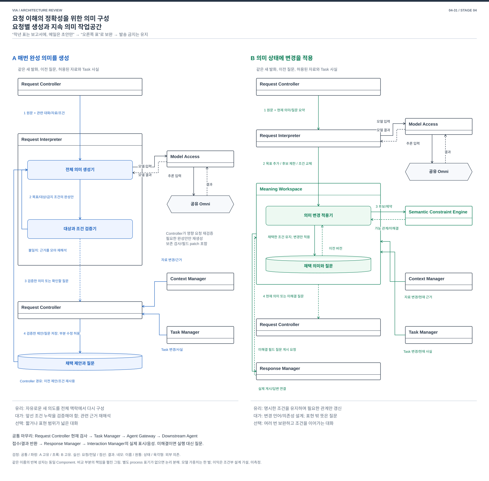
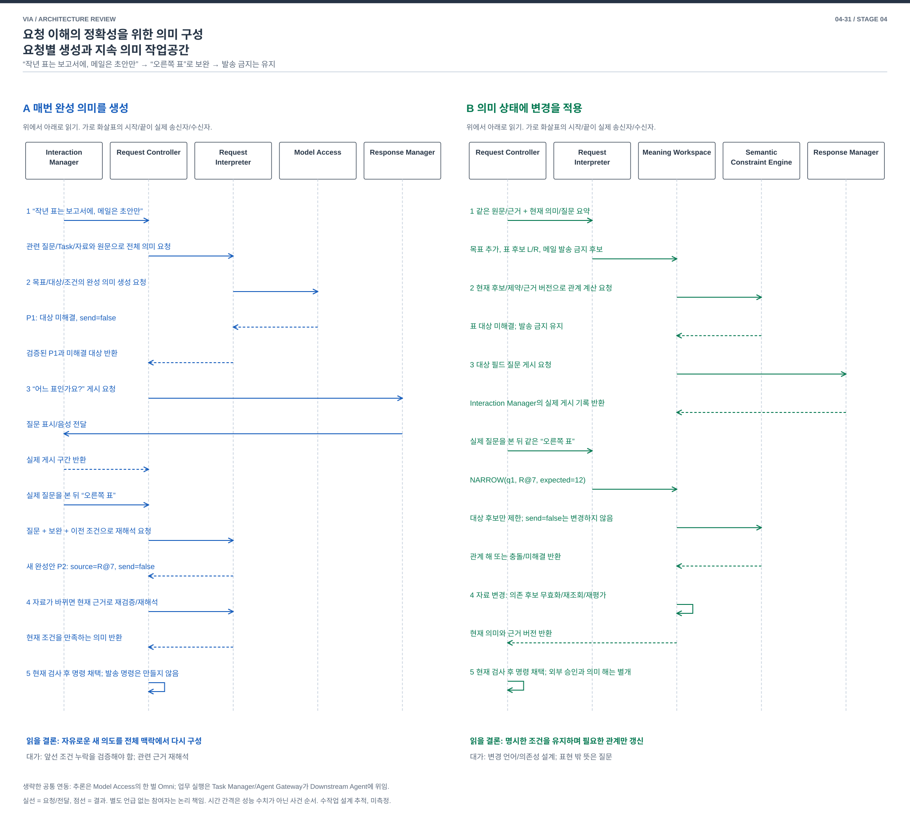

# 04-31. 요청 이해의 정확성을 위한 의미 구성 — 요청별 생성과 지속 의미 작업공간

> 발표용 설명과 도식 보완 / 2026-10-04 / [가이드](./04-30-comparison-guide.md) / 다음: [화면 대상](./04-32-screen-grounding.md)

**두 안 모두 신규인지 보완인지 아직 모르는 발화에서 시작하며, 모델이 맥락을 읽고 그 관계를 판단한다. A는 조회와 추론을 반복해 요청의 전체 뜻을 제안한다. B도 모델로 관계와 변경을 해석하지만, 다음 의미는 지속 상태에 변경을 적용하고 제약을 계산해 구성한다.** A는 자유로운 의도를 함께 해석하기 좋고, B는 여러 번 보완하는 동안 유지할 조건을 명시하기 좋다. 두 안 모두 말뜻을 잘못 이해할 수 있으며, 외부 실행은 별도 현재 검사를 거친다.

**메인 그림에서 볼 차이:** A는 Request Interpreter의 모델이 필요한 조회를 선택하고 결과를 다시 읽는 반복 경로에서 완성 의미를 제안한다. Request Controller는 조회를 중개하고 제안을 채택한다. B는 Meaning Workspace가 후보, 조건과 사실의 의존 관계를 유지하고 코드로 다음 의미를 구성한다. 질문 전달은 양안 모두 Request Controller → Response Manager → Interaction Manager다.

읽는 순서는 **사용자 상황 → 구조도 → 같은 사례의 흐름 → 품질 손익 → 가장 싼 전환 반론**이다. 그림 없이 읽을 때도 §3의 생산 책임과 §4의 사건 표로 같은 결론에 도달하도록 작성했다.

| 먼저 알아둘 말 | 쉬운 뜻 |
| --- | --- |
| 완성 의미 | 목표, 대상, 조건과 연결할 업무를 모두 채운 요청 해석 |
| 의미 변경 | 이전 후보를 좁히거나 특정 조건만 교체하는 제안 |

## 1. 왜 VIA에서 중요한가

사용자가 두 표를 가리키며 “작년 표만 보고서에 넣어줘. 메일은 보내지 말고 초안만 만들어”라고 한다. VIA가 어느 표인지 묻자 사용자는 “오른쪽 것”이라고 답한다. 그 사이 보고서 업무는 종료되거나 화면의 표가 바뀔 수 있다. VIA는 문장뿐 아니라 앞서 말한 조건, 이번 보완과 현재 업무 사실을 함께 맞춰야 한다.

**아래 사례는 차이가 잘 드러나는 보완 대화를 골랐을 뿐, 보완 요청만 지원한다는 뜻은 아니다.** 예를 들어 보고서 업무 도중 “새 일정도 등록해줘”라고 하면 양안 모두 별도 요청으로 해석할 수 있다. 새 요청과 보완의 구분 및 상태 생성은 §3.2에서 설명한다.

관련 요구는 UC-03/04의 지칭, UC-06의 보완, UC-09의 복합 요청, UC-10의 기존 업무 연결이다. Request는 이번 사용자 지시, Task는 여러 지시에 걸쳐 이어지는 업무다. VIA는 목표, 대상, 조건과 Task 연결을 정하고 실제 보고서 작성 방법은 외부 Agent가 결정한다.

## 2. SW Architecture에서 무엇이 어려운가

모델이 필요한 맥락을 조회하며 전체 의미를 생성하면 자유로운 표현을 함께 해석하기 좋다. 대신 “오른쪽 것”을 받을 때 앞의 금지 조건을 빠뜨리거나, 변한 Task 사실을 오래된 뜻에 결합할 수 있다. 앞 의미를 구조화해 계속 갱신하면 이러한 의존 관계를 명시할 수 있지만 표현 체계와 수정 규칙이 복잡해진다.

결정은 **요청마다 완성 의미를 생성하고 검사할 것인가, 여러 입력과 자료 변경이 하나의 의미 작업공간을 갱신하고 그 상태에서 실행 가능한 의미를 도출하게 할 것인가**다.

이전 문서의 “같은 Request Interpreter 안에서 모델 대신 solver를 호출”하는 수준은 주요 구조 비교의 근거로 부족했다. 이번 B는 의미 상태의 소유, 입력 반영, 근거 갱신과 질문 처리까지 바꾼다. 구조가 커 보이도록 별도 process나 서버를 추가하지 않는다.

## 3. 공통 조건과 두 구조

양안 모두 같은 원문, 화면/자료 접근, Task 사실과 권한을 사용한다. Interaction Manager가 사용자 입력을 받으며 Context Manager는 허용된 자료를 읽는다. Task Manager는 외부 업무 상태의 원본이고 Request Controller는 외부 실행 전 현재 조건을 확인한다. Model Access는 같은 단일 Omni를 사용한다. 응답 생성도 필요하면 같은 모델을 사용하며, 의미 해석과 응답의 session/상태는 구분한다. 두 안 모두 읽기 도구와 모델을 반복 호출할 수 있다. “신규/보완” 분류를 이미 끝낸 입력이나 정답 Task ID를 어느 한쪽에 제공하지 않는다.

**먼저 공통 출발점을 고정한다.** 새 발화의 요청 관계는 `미결정`이다. 최초 모델 입력은 원문, 시점, 허용된 최근 대화와 실제 게시한 질문의 안내이며, UI가 명시적으로 지정한 ID가 있으면 단서로 덧붙인다. 과거 제안/Task/자료를 전부 넣는 방식은 필요 조건이 아니다. 초기 안내는 최근성, 현재 UI 선택, 명시적인 연결 등의 기계적 기준으로 제한하며 정확한 관련 Task를 골랐다고 가정하지 않는다.

모델은 이 안내만으로 부족하면 `meaning_retrieval`, `context_retrieval`, `task_retrieval`을 요청해 질문/이전 의미, 자료, 업무 사실을 더 읽는다. 조회 결과를 다시 모델에 넣어 신규/보완/혼합/미해결 관계를 제안한다. 초기 목록에서 안 보였다는 이유만으로 신규라고 확정하지 않는다. 더 넓은 허용 이력 조회 또는 확인 질문이 필요할 수 있고, 검색 누락으로 잘못 연결할 위험은 양안에 공통이다. 구체적인 조회 개수와 예산은 아직 확정하지 않았다.

### A. 요청별로 전체 의미를 생성한 뒤 확정

Request Controller는 관계 미결정 입력과 초기 안내를 Request Interpreter에 넘긴다. Interpreter 안의 전체 의미 생성기는 Model Access를 통해 Omni에 해석을 요청한다. 모델의 반환은 다음 둘 중 하나다.

- **더 읽기:** 질문/이전 의미, 화면/자료 또는 Task 사실의 조회 요청. Interpreter가 요청을 Controller에 넘기면 Controller가 해당 원본 소유자에게 조회한다. 결과/버전/누락을 Interpreter → Model Access → Omni로 다시 전달한다.
- **제안하기:** 신규/보완/혼합 관계를 포함하는 전체 의미 또는 사용자에게 확인할 내용. 대상과 조건 검증기가 확인 가능한 ID, 버전과 조건을 검사한 뒤 Controller에 반환한다.

이것이 이 문서에서 A에 포함하는 **ReAct형 해석 loop**다. 모델이 필요한 읽기를 고르고 결과를 보고 다음 판단을 한다. Controller가 처음에 모든 관련 데이터를 완벽하게 조립해야 한다는 전제를 없앴다. 모델이 고른 조회를 VIA 코드가 실행하며, 모델이 DB나 외부 Task를 직접 수정하는 것은 아니다.

이전 채택 의미와 질문은 Controller 소유 상태이며 State Store가 보관한다. `meaning_retrieval`로 필요한 기록을 읽어 다음 추론에 제공한다. 자료는 Context Manager, 업무 사실은 Task Manager에서 얻는다. 그림에서 반복한 Controller/원통은 같은 책임/상태를 펼친 것이다.

A도 금지 조건 보존 검사, cache, 검증된 field patch와 부분 재시도를 사용할 수 있다. 모델 반환에 읽기 요청이 있으면 여러 번 추론할 수 있으며, 한 번 호출만 허용한 A와 B를 비교하지 않는다. 자연어 의미의 정상 제안자는 모델이고, 최종 채택과 외부 실행 허용은 코드가 맡는다.

**검증기에서 나가는 두 화살표는 다음과 같이 구별한다.**

| 검증 결과 | 다음 수신자와 행동 |
| --- | --- |
| 주어진 근거로 고칠 수 있는 제안 오류. 예: 원문에는 발송 금지가 있는데 제안이 발송으로 바뀜 | 전체 의미 생성기에 오류와 같은 근거를 돌려주어 재생성. 재시도 횟수/시간 상한을 둠. 검증 가능한 필드 patch도 허용 |
| 필요한 값과 관계가 채워졌고 확인 가능한 조건을 만족 | Request Controller에 검증한 의미 반환. 현재 검사 뒤 응답 또는 외부 업무 인계 |
| 표가 여러 개여서 사용자의 선택이 필요하거나, 근거 부족/철회/오래된 버전/재시도 한도에 도달 | Request Controller에 미해결 필드나 거절 사유 반환. 허용된 재조회, 사용자 질문 또는 보류. 모델이 반복해서 추측하도록 보내지 않음 |

예를 들어 “어느 표인지 모른다”는 모델 출력 오류와 다르다. 자료에도 구별 근거가 없다면 사용자에게 물어야 한다. 재조회로 새 근거를 확보한 경우에만 그 근거로 해석을 다시 요청한다.

### B. 지속 의미 작업공간에서 사실과 제약을 결합

새 **Meaning Workspace는 능동적으로 조회와 상태 갱신을 수행하는 Component**다. 이 Component가 소유하는 **의미 작업공간 상태**는 목표, 후보, 제약과 질문의 자료 구조다. 그림의 큰 네모는 Component이고 내부 원통은 그 상태이며 둘을 구별한다. 하나의 Component가 서로 독립된 여러 요청의 의미 상태를 관리할 수 있다. Component 하나가 Task 하나라는 뜻은 아니다. 작업공간은 대화 원문 모음이 아니라 `보고서 대상 후보`, `연도=작년`, `메일 발송 금지`, `아직 답하지 않은 대상 질문`과 이들이 의존하는 자료/Task 버전의 관계다. 미해결 대화를 여러 번 이어갈 수 있도록 채택된 의미 변경과 질문 연결을 State Store에 저장한다. 외부 Task의 상태를 대신 소유하지 않는다.

처리는 네 책임으로 나뉜다.

1. **Request Interpreter**는 Request Controller가 전달한 관계 미결정 원문과 초기 안내를 받는다. Omni가 추가 조회를 요청하면 Meaning Workspace에 읽기 요청을 보내고, Workspace가 의미 상태를 조회하거나 Context Manager/Task Manager의 원본 조회를 중개한다. 읽은 결과를 같은 Model Access/Omni에 다시 제공한다. 기존 Workspace를 미리 하나 선택해 놓고 시작하지 않으며, 처음에는 관련 상태의 목록/요약을 읽을 수 있다. 그런 다음 새 발화를 완성 실행안 대신 타입 있는 의미 변경 후보로 변환한다. 독립 요청이면 새 의미 상태를 만드는 후보를 제안한다. 기존 상태가 없으면 요약은 비어 있다. 관련 상태를 조회했다고 그 조건을 새 요청에 상속하지 않는다. 타입은 자료, Task, 대상 조건 등 값의 종류다. “오른쪽 것”은 기존 대상 질문에 대한 후보 제한, “초안은 됐고 보내줘”는 기존 금지 조건의 변경 후보다. 새 발화를 무조건 기존 목표에 합치지 않으며 새 목표/정정/독립 요청의 관계도 미확인이면 묻는다.
2. **Meaning Workspace**는 원문 구간과 근거가 있는 변경 후보를 현재 의미 버전에 결합한다. 사용자 질문 답변, 자료 변경 및 Task 상태 변경을 같은 의존 관계에 적용한다. 의미 구성에 필요한 자료/사실의 조회와 변경 구독은 Meaning Workspace가 Context Manager와 Task Manager에 요청한다. 두 원본 소유자는 유효한 읽기/상태 결과 및 변경 통지를 반환한다. 통지 누락 시에는 재조회하며 최신 사실을 발명하지 않는다.
3. 새 **Semantic Constraint Engine** Component는 명시한 규칙을 실행하는 코드로, 작업공간의 후보와 제약에서 서로 양립하는 관계를 구성한다. Workspace 내부의 의미 변경 적용기도 코드다. 이 두 처리기는 Omni를 직접 호출하지 않는다. 예를 들어 대상은 표여야 하고 연도가 작년이어야 하며, 발송 금지 상태에서는 발송 명령을 생성할 수 없다. 후보가 하나라도 그 후보의 원문 해석이 맞다는 보장은 없다. 누락/불확실한 근거는 미해결로 남긴다.
4. Engine은 실행 가능한 의미 또는 충돌/차이 필드를 Meaning Workspace에 반환한다. Workspace는 미해결 필드를 특정 질문과 연결하고, 의미 또는 질문 제안을 Request Controller에 반환한다. Controller가 현재 질문/입력 버전을 확인하고 Response Manager에 전달을 요청한다. Interaction Manager가 실제 표시/음성 전달을 수행하면 그 게시 기록을 Response Manager → Request Controller → Meaning Workspace로 돌려주어 저장한다. 사용자 답변은 이 반환이 아니라 Interaction Manager → Request Controller로 들어오는 새 입력이다. 완성 의미는 현재 권한/Task/입력 버전 검사를 통과한 뒤에만 외부 명령으로 변환한다.

모델은 열린 언어를 후보로 바꾸고 제약 해법은 명시된 후보의 관계를 구성한다. 일반 업무 계획, Tool 순서나 Agent의 실행 절차를 이 규칙으로 만들지 않는다. B의 언어 해석 앞부분에도 ReAct형 읽기 반복을 허용한다. 코드가 이해하지 못한 말뜻을 모델에 재질의할 수 있다. 다만 모델의 최종 완성안으로 Workspace를 덮어쓰도록 정상 계약을 바꾸면 의미 생산 방식이 달라지므로 별도 혼합안으로 설명한다.

[편집용 draw.io](./diagrams/choice31-structure.drawio).

**구조도 읽기:** 네모 안은 Component/Module 이름, 원통은 상태 이름이다. 화살표에서 요청/반환 자료와 조건을 읽는다. 구조도의 번호는 해당 안의 처리 흐름이며, §4 사건도의 번호는 같은 사용자 사건 순서다. 같은 이름을 위아래 반복하면 동일 Component의 요청/반환 위치를 펼친 것이다. 양안의 공통 최종 검사, Agent 인계와 사용자 전달도 그림 아래에 표시했다.

A는 모델이 조회를 선택하고 결과를 다시 읽는 loop에서 요청별 완성안을 만든다. B는 사용자 보완과 source/Task 변경이 지속 작업공간에 모이고 그 상태에서 의미와 질문이 생성된다. 같은 Model Access는 양쪽의 모델 의존성을 표현하며 복제 모델이 아니다.

### 3.1 실제로 무엇을 모델이 결정하고 무엇을 코드가 결정하는가

이 비교의 중심은 **완성 의미를 모델이 매번 작성하는가, 모델이 제안한 변경을 코드가 기존 의미에 적용하여 다음 의미를 구성하는가**다. B의 Engine이 자연어를 정확히 이해하는 마법의 두 번째 모델은 아니다.

| 판단 | A의 생산자 | B의 생산자 |
| --- | --- | --- |
| “작년 표”, “오른쪽 것”의 말뜻과 지칭 후보 | Request Interpreter의 모델 해석 | 같은 모델의 변경 후보 해석. 오해 가능성은 공통 |
| 이번 답변이 새 목표인지 이전 질문의 답인지 | 모델의 전체 의미 제안과 질문 연결 검증 | 모델이 질문 ID/변경 종류를 제안하고 Workspace가 실제 게시/현재 버전 확인 |
| 이번에 언급하지 않은 `메일 발송 금지`의 유지 | 이전 의미를 근거로 완성안을 생성하고 validator가 누락/변경 검사 | 기존 제약을 그대로 유지. 그 제약을 바꾸는 유효 변경이 없으면 수정할 수 없음 |
| 어느 표 후보가 연도/선택 조건을 모두 만족하는가 | 모델이 제안, validator가 확인 가능한 속성을 검사 | Engine이 근거가 확인된 후보의 교집합 계산. unknown 속성은 false나 true로 꾸미지 않음 |
| 외부 실행을 허용할 수 있는가 | Request Controller와 Policy Manager의 현재 검사 | 동일. 의미 제약과 실제 실행 승인/정보 동의는 별개 |

**B의 최소 의미 표현**은 아래와 같다. 예시의 표 ID와 속성은 같은 Context 근거에서 양안이 얻는 가상 값이며 정답을 B에만 제공한 것이 아니다. `작년=2025`는 예시의 입력일이 2026년이라는 공통 조건이다. 값 추출이 불확실하면 후보로 남긴다.

| 자료 | 예시 | 소유/사용 |
| --- | --- | --- |
| 사용자 목표 | `g1: 표를 보고서 R에 포함`, `g2: 메일 초안 작성` | Workspace의 의미 상태. 외부 Task R의 실행 사실은 Task Manager 소유 |
| 참조 후보 | `g1.source = {L@7, R@7}`와 각각의 관측/자료 근거 | Workspace가 후보 관계 보유, 원문은 Context Manager 경유 |
| 사용자 제약 | `c1: source.year=2025`, `c2: g2.send=false` | 원문 구간과 유효 범위 포함. 과거 대화의 금지를 영구 정책으로 승격하지 않음 |
| 미해결 질문 | `q1: g1.source`, 후보 L/R, 실제 제시한 화면 버전 7 | Workspace. Response Manager의 질문과 Interaction Manager의 실제 게시 기록을 연결 |
| 변경 후보 | `NARROW(q1,{R@7},expected=12,origin=u2)` | 모델 제안. 현재 질문/원문 근거를 확인한 뒤 후보 집합을 좁힘 |
| 의존 관계 | `g1.source → R@7`, `q1 → g1.source` | 해당 자료가 바뀌면 g1만 미해결로 전환. g2의 금지 조건은 유지 |

B의 변경 연산은 목표 추가, 후보 좁히기, 특정 조건 교체/철회, 자료 근거 무효화로 한정한다. 예를 들어 `REPLACE(c2,false→true,origin=u3)`는 “이제 보내줘”라는 변경 후보다. 코드가 원문만 보고 이 말을 이해하지는 않는다. 유효한 변경으로 채택돼도 **새 외부 발송의 현재 승인 검사**를 생략하지 않는다. “아까처럼 적당히”를 이 표현으로 해석할 수 없으면 사용자에게 뜻을 확인한다.

규칙은 누락된 표를 생성하거나 자료의 의미를 추측하지 않는다. 참조 후보가 없으면 근거 읽기/질문, 여러 개이면 구별 질문, 서로 충돌하면 해당 조건 확인을 요청한다. 표현 가능한 한 요청의 관계를 구성하는 일이며 업무 달성을 위한 도구 계획은 만들지 않는다.

### 3.2 새 요청과 보완을 언제 구별하고, 누가 어떤 자료를 읽는가

**입력 맨 앞에서 항상 “신규/보완”을 확정할 수 있는 것은 아니다.** “이건 빼고 새로 하나 만들어줘”처럼 말뜻을 해석해야 관계가 드러나는 입력도 있다. 공통 순서는 다음과 같다.

1. **입력 접수:** Interaction Manager → Request Controller로 원문과 입력 시점을 전달한다. 신규/보완 표시는 미결정이다. 명시적 UI 연결 ID가 없어도 처리해야 하며, 존재하면 검증할 단서로 사용한다. 같은 최근 대화/게시 안내를 양안의 Interpreter에 제공한다.
2. **조회와 관계 해석:** Request Interpreter가 Omni에 입력을 제공한다. 모델이 필요한 질문/의미/자료/Task 조회를 요청하면 A는 Controller, B는 Workspace가 중개한다. 반환된 근거로 다시 추론하여 새 목표인지, 기존 질문의 답인지, 기존 목표의 수정인지, 한 발화에 여러 관계가 섞였는지 제안한다. A는 완성 의미 안에, B는 의미 변경 종류와 대상 안에 그 관계를 담는다.
3. **연결 검증:** A는 검증기와 Controller가, B는 Workspace와 Controller가 질문의 실제 게시, 상태 수명과 버전을 확인한다. ID가 실제 존재한다는 확인만으로 말뜻이 맞다고 보장되지는 않는다. 관계가 모호하면 질문하고 확정 전에는 기존 상태를 덮어쓰지 않는다.
4. **의미 채택 및 업무 인계:** 독립 요청은 별도 의미로 채택하고 보완은 확인된 기존 의미에 연결한다. 외부 업무가 필요하면 현재 검사 뒤 Task Manager에 새 Task 생성 또는 기존 Task 변경을 요청한다. VIA가 직접 답할 수 있는 요청은 새 외부 Task를 만들 필요가 없다.

| 같은 입력 상황 | A | B |
| --- | --- | --- |
| 기존 업무와 무관한 새 요청 | 관련 근거로 새 완성 의미 생성. 이전 업무의 조건은 자동 승계하지 않음 | 새 목표/의미 상태 생성. 기존 작업공간의 조건을 자동 합치지 않음 |
| 기존 대상 질문에 “오른쪽 것” | 이전 질문/제안과 보완을 함께 해석해 새 완성안 생성 또는 검증된 patch | 현재 질문 ID/버전을 확인한 뒤 해당 후보만 제한 |
| “보고서는 PDF로 바꾸고, 별도 일정도 등록해줘” | 한 입력에서 수정과 신규 목표의 관계를 함께 제안 | 기존 목표 변경과 독립 목표 생성을 별도 범위의 변경으로 제안 |
| 신규인지 보완인지 불명확 | 관계 질문을 반환하고 해당 처리를 보류 | 관계를 미해결로 유지하고 질문. 임의로 기존 조건을 적용하지 않음 |

**따라서 “이 발화가 기존 업무의 보완인가?”라는 자연어 판단은 양안 공통으로 모델이 한다.** 이 앞부분이 공통이라는 점을 구조 차이로 주장하지 않는다. 예를 들어 `u=오른쪽 것으로 해줘`, 기존 질문 q1의 실제 게시 내용, 현재 보고서 Task 사실을 함께 읽은 뒤에야 모델은 `보완(q1)`을 제안할 수 있다. 다른 사례에서 “별도로 일정도 등록해줘”라면 신규 목표를, 연결이 불명확하면 확인 질문을 제안한다.

그 뒤 A는 `전체 의미 P2`를, B는 `관계=보완, 대상=q1, 후보를 R로 좁힘`이라는 변경을 반환한다. B에서는 기존 조건과 새 변경의 결합, 자료 변경의 무효화와 질문 수명을 Workspace/Engine의 규칙이 관리한다. **처음 관계를 잘못 해석하는 문제는 B도 해결하지 못한다.** 단순히 모델 출력 JSON을 완성안에서 patch로 바꾼 정도라면 큰 SW 구조 차이라고 할 수 없다.

**조회 역할은 겹쳐 보일 수 있지만 수행 단계가 다르다.**

| 책임 | A | B |
| --- | --- | --- |
| 관계 미결정 입력과 같은 초기 안내 전달 | Request Controller | Request Controller |
| 모델이 선택한 질문/이전 의미 회수 | Interpreter → Controller → 채택 기록 | Interpreter → Workspace → 의미 상태 |
| 모델이 선택한 자료/Task 조회 | Interpreter → Controller → Context Manager/Task Manager | Interpreter → Workspace → Context Manager/Task Manager |
| 자료/Task 사실만 변경될 때의 의미 처리 | Controller가 영향 제안 재검증, patch 또는 모델 재해석 요청 | Workspace가 의존 상태를 무효화/재계산. 새로운 말뜻이 필요하면 모델 재해석 요청 |
| 의미 상태의 갱신 | Controller가 검증된 완성 제안/질문 채택 | Workspace가 검증된 변경을 자기 의미 상태에 적용 |
| 외부 실행 직전 최신 권한/Task/입력 확인 | Request Controller가 각 원본 소유자와 확인 | 같은 책임. Workspace가 제시한 근거 버전을 재확인하고, 필요하면 원본 재조회 또는 의미 재평가 요청 |
| 질문 전달과 실제 게시 | Controller → Response Manager → Interaction Manager | 동일. 게시 기록은 Controller를 거쳐 Workspace에도 반영 |

B에서 Request Controller가 두 번째 의미 상태를 만들거나 같은 자료 조립을 병렬로 다시 하는 것은 아니다. **Workspace의 의미 구성과 Controller의 실행 직전 검사는 목적이 다르다.** 이미 읽은 근거는 버전과 유효성이 확인되면 재사용할 수 있다. 자료 원본은 Context Manager가 관리하고 업무 사실 원본은 Task Manager가 관리한다. Workspace는 그 원본에 의존하는 의미 관계를 소유한다.

질문 경로는 이번 보완에서 양안의 공통 경로로 명확히 했다. 이전 그림에서 A의 Response Manager를 생략하고 B의 Workspace에서 바로 연결한 표현은 질문을 누가 만들고 누가 전달을 통제하는지 혼동시켰다. 현재는 **B의 질문 내용/연결은 Workspace, 전달 통제는 Controller, 응답 구성은 Response Manager, 실제 전달은 Interaction Manager**로 구분한다. 참조 Architecture나 다른 비교안의 책임을 변경한 것은 아니다.

### 3.3 메인 그림에서 읽는 소유권 차이와 강한 A

왼쪽은 **모델 추론 ↔ Controller를 통한 조회 → 완성안 검증 → 채택 제안/질문 저장**의 요청 처리다. Context Manager와 Task Manager의 변경도 Controller가 받아 관련 요청을 재검증한다. A에 이전 제안 저장, 금지 조건 보존 검사, field patch, 근거 cache를 모두 허용한다. A를 매번 아무 기억 없이 생성하는 안으로 약화하지 않는다.

오른쪽은 **여러 사건 → Meaning Workspace의 후보/조건/질문 상태 → Engine 재평가 → 현재 의미/질문**이다. Request Interpreter는 말뜻을 변경 후보로 바꾸고, Context Manager와 Task Manager는 사실 변경을 제공하며, Response Manager는 Interaction Manager의 실제 게시 기록을 Controller를 거쳐 Workspace에 돌려준다. 사용자 답변은 별도 입력 경로에서 해석한 변경 후보다. 이들이 같은 의미를 각자 덮어쓰지 않고 Workspace의 버전 규칙을 소비한다. State Store는 내구 저장을 맡지만 의미적 쓰기 권한은 Workspace에 있다.

**최소 차이를 분리한 판단:** q1의 source 필드 하나를 고치는 사례는 A+patch로 충분하므로 B를 정당화하지 않는다. 의미 후보의 근거가 삭제되고, 관련 Task가 종료되고, 옛 질문의 답이 뒤늦게 도착하는 동안에도 어떤 조건/질문/업무 관계를 유지할지를 같은 상태 전이로 관리할 때 B의 가치가 생긴다. A도 이를 Controller에서 구현할 수 있다. 그때 비교는 성공 여부가 아니라 요청별 재검증/재생성과 지속 의존 상태 갱신의 비용이다.

| 같은 사건 | A+보존 검사/patch | B의 상태 전이 | 설계 선택을 가르는 대가 |
| --- | --- | --- | --- |
| 대상 보완만 도착 | 검증된 source patch 가능 | 대상 후보만 제한 | 이 사건만으로 B 이익을 주장하지 않음 |
| 선택한 표가 삭제 | Controller가 영향 요청/질문 보류 후 새 대상 제안 | 해당 근거의 후보와 파생 질문을 무효화하고 재평가 | A는 관련 요청 재해석, B는 의존망/삭제 전파 유지 |
| 보고서 Task가 먼저 종료 | Controller가 과거 연결/질문 재검사 | Task 사실 변경으로 해당 목표 연결을 미해결 처리 | B도 새 업무를 임의 실행하지 않음. 둘 다 확인 필요 |
| 사용자가 목표를 완전히 바꿈 | 전체 원문으로 새 의미 생성이 자연스러움 | 옛 목표/조건 종료와 새 목표 변경을 명시 | B가 잘못 보존하면 불필요한 질문/충돌 증가 |

이 비교는 여러 단순 필드 수정만 필요한 제품에서는 채택하지 않는다. 지속 변경/질문/사실 전이가 실제 요구라는 범위에서만 주요 구조 선택으로 유지한다. 전환 시 핵심은 상태 저장소 설치가 아니라 **각 생산자가 어떤 전이 규칙으로 다음 의미를 만들 수 있는지**의 교체다.

### 3.4 ReAct형 해석은 왜 포함해야 하며 모델 호출을 줄여야 하는가

**사용자가 제안한 ReAct형 구현은 유효한 A의 출발안이다.** 원문을 Omni에 전달하고, `context_retrieval`과 `task_retrieval` 같은 읽기 도구를 노출하고, 조회 결과로 해석을 이어가게 할 수 있다. 이 문서에서는 이전 질문/채택 의미를 읽는 `meaning_retrieval`도 제공한다. 도구는 VIA 소유자의 읽기 인터페이스이며, Downstream Agent의 도메인 작업 계획/실행을 VIA로 옮기는 설계는 아니다.

[ReAct 원 논문](https://arxiv.org/abs/2210.03629)은 추론과 외부 정보 획득을 번갈아 수행하는 접근의 근거다. 이 문서의 “ReAct형”은 필요한 읽기를 고르고 관측 결과로 해석을 이어가는 제어 방식이다. 숨은 추론 전문을 제품 상태나 감사 원본으로 저장해야 한다는 요구가 아니다. 선택할 Omni/runtime에서 구조화된 도구 요청과 충분한 해석 정확도가 지원되는지는 아직 검증하지 않았다.

이전 [04-13 §2](./04-13-broad-mechanism-discovery.md#2-기존-c-대화의-국소-전환-판정)는 이런 loop를 기존 요청 처리의 내부 확장으로 수용할 수 있으므로 **독립적인 주요 DP로 세지 않았다.** 이를 A에서 제거할 이유로 사용해서는 안 된다. 이번 수정에서는 A의 정상 경로에 명시적으로 포함한다. B의 앞부분에도 같은 읽기 능력을 허용한다.

**모델 호출 최소화는 이번 비교의 선결 목표가 아니다.** 기능 정확성/적절성/완전성이 먼저이고 VIA 응답 시간/완료 시간, 자원 비용을 함께 본다. 참조 구조의 [Omni 연동 계약](../target-architecture/shared-omni-runtime.md)에는 repair 포함 semantic 2회 상한이 있지만, 이는 참조 설계의 선택이며 여기의 양안에 자동으로 강제하지 않는다. 참조 문서 자체는 변경하지 않는다.

필요한 조회/재해석을 허용하고, 종료/시간/자원 예산에 도달하면 질문이나 보류로 결과를 명시한다. “A=한 번 호출, B=적게 호출”로 비교하지 않는다. 호출 수, 입력/출력 길이, 검색 누락, 재시도, 상태 관리 비용과 사용자 결과를 함께 확인해야 한다. B도 매 발화의 언어 해석에 모델을 쓰며, B의 지속 상태만으로 신규/보완 관계를 알아내거나 호출 수가 줄어든다고 주장하지 않는다.

## 4. 관계 미결정 입력부터 사용자 전달까지 같은 범위로 읽기

[편집용 draw.io](./diagrams/choice31-event.drawio).

사건도는 A를 위, B를 아래에 그렸다. **같은 Interaction Manager 입력 → 같은 Model Access/Omni 호출과 자료 조회 → 의미 채택 → 같은 사용자 전달**까지 보여준다. Component별 열의 위치가 같고, A에 없는 Workspace/Engine만 비워두었다. 이번 예시의 응답 생성도 양안 모두 Model Access/Omni 요청과 반환으로 표시했다. 구조도는 메커니즘을, 사건도는 동일 범위의 한 실행 예를 보여준다.

예시는 “오른쪽 것으로 해줘”가 들어왔지만 아직 어떤 요청과 연결할지 모르는 시점에서 시작한다. 앞서 게시된 질문 q1이 보고서에 넣을 표를 물었다는 사실과 Task 상태를 조회한 후에야 연결을 제안한다. 조회가 성공한 한 경로를 그린 것이며 항상 정답 후보를 찾거나 모델을 같은 횟수만 호출한다는 뜻은 아니다.

| 단계 | A | B |
| --- | --- | --- |
| 1 입력 | Interaction Manager → Controller → Interpreter: 원문과 초기 안내, 관계 미결정 | 동일한 시작과 자료 범위 |
| 2 첫 추론 | Interpreter → Model Access → Omni: 무엇을 더 읽을지 또는 의미를 제안 | 같은 호출. Workspace가 신규/보완을 미리 확정하지 않음 |
| 3 조회 | 모델이 요청한 질문/의미/자료/Task를 Controller가 각 원본에서 읽고 Interpreter에 반환 | Workspace가 같은 읽기를 중개하고 Interpreter에 반환 |
| 4 추가 추론 | 조회 결과 → Model Access → Omni. 필요하면 다시 조회. 관계와 전체 의미 P2 제안 | 같은 반복. 관계와 `NARROW(q1,R)` 같은 변경 제안 |
| 5 의미 구성 | 검증기와 Controller가 P2의 조건/버전 검증, 제안 채택 | Workspace가 변경을 기존 상태에 적용하고 Engine이 제약 평가. Controller에 의미/미해결 반환 |
| 6 현재 검사와 전달 | Controller → Task Manager: 허용된 변경 인계/접수. Response Manager → Interaction Manager: 확인된 상태만 사용자에게 전달 | 같은 종료. 미해결이면 양안 모두 업무 인계 대신 확인 질문 |

### 4.1 같은 보완과 정정을 실제 값으로 따라가기

설계 설명을 위한 수작업 추적이다. 모델을 실행한 결과나 정확도 증거가 아니다. 둘 다 같은 원문과 근거를 받으며 제대로 처리했을 때의 결과는 같아야 한다. u3의 연도 변경 뒤 허용된 재조회에서 올해 표 S@8이 하나 확인되는 경우를 예로 든다.

| 사건 | A: 완성 제안이 다음 상태를 생산 | B: 변경 적용이 다음 상태를 생산 |
| --- | --- | --- |
| u1: “작년 표를 보고서에 넣고 메일은 초안만. 보내지는 마” | `P1={source:L/R,year:2025,mail:draft,send:false}` 생성. q1 질문 | 같은 값이 목표/후보/제약으로 등록. Engine이 L/R을 구별할 수 없어 q1 생성 |
| u2: q1에 “오른쪽 것” | 이전 P1/질문/원문을 넣어 `P2={source:R@7,year:2025,mail:draft,send:false}` 제안. validator가 남아야 할 제약과 비교 | 모델은 `NARROW(q1,{R@7})` 제안. Workspace가 source 후보만 바꾸고 c1/c2 보존. Engine은 g1의 후보 조건 재평가 |
| u3: “표는 올해 것으로 바꿔. 메일은 그대로” | 재조회한 S@8로 새 완성 P3를 생성. 연도 변경과 메일 불변을 검증 | `REPLACE(c1,2025→2026)` 및 이전 후보 무효화. 재조회한 S@8을 후보로 평가. c2는 쓰기 대상이 아님 |
| 새로 선택한 S@8이 삭제됨 | 근거 버전 검사에서 기존 대상 사용 거절. 새 대상 제안/질문 | Context Manager 통지 또는 최종 재조회로 S@8 의존 후보 무효화. g1 재평가, g2는 기존 의미 유지 |
| q1의 옛 답이 늦게 옴 | 질문/입력 버전 검사로 현재 제안에 적용 금지 | expected 버전과 q1 수명을 검사해 변경 거절. 최신 질문과 다시 연결 |

### 4.2 실제 품질 이익과 대가가 생기는 지점

B에서 코드로 설명할 수 있는 성질은 **허용된 변경이 가리키지 않은 조건은 그대로 남는 것**이다. u2로 c2가 바뀌는 경로가 없다. A도 c2 보존 검증을 넣어 같은 오류를 잡을 수 있다. 그 경우 차이는 최종 정답의 독점이 아니라, A가 완성안 생성 후 거절/수정하는 경로와 B가 바뀔 수 있는 범위를 제한해 상태를 구성하는 경로다. A의 재시도가 잦아진다는 수치나 B가 더 정확하다는 결론은 아직 없다.

대가는 분명하다. 모델이 실제로 전면 변경인 u3를 잘못 `NARROW`로 해석하면 B는 옛 조건을 과하게 보존해 모순/불필요한 질문을 만들 수 있다. A는 원문 전체에서 새 의미를 재구성할 여지가 있다. 따라서 **명시적인 조건을 여러 번 좁히는 대화**에서는 B의 보존 규칙을 선택할 이유가 있고, **암묵적으로 목표를 바꾸는 자유 대화**에서는 A의 통합 해석을 선택할 이유가 있다. 둘 다 의미 오해는 가능하며 동일한 완료 조건으로 평가해야 한다.

## 5. 언제 각 구조가 도움이 되는가

| 장면 | A | B |
| --- | --- | --- |
| 열린 표현과 교차 문맥이 많음 | 관련 원문을 함께 해석할 기회 | 타입/규칙에 담지 못하는 관계는 질문 또는 부분 지원 |
| 여러 차례 답하며 조건을 좁힘 | 앞 조건과 보완을 새 의미 생성에 다시 반영 | 같은 후보/제약 상태를 갱신하므로 남아야 할 조건을 명시 |
| 자료나 Task 사실만 변경 | 해당 제안의 근거를 재확인하고 필요한 해석 재실행 | 의존 후보를 찾아 재조회/재평가. 변경 통지와 상태 일관성 비용 발생 |

B를 선택하는 이유는 solver라는 이름이 아니라 장기간 이어지는 해석의 상태 전이와 근거 갱신을 정상 처리 방식으로 삼는 데 있다. 단발 요청 위주이면 이 체계가 과할 수 있다.

## 6. 상태, 정정과 지원 한계

| 사건 | A | B |
| --- | --- | --- |
| “보고서 말고 메일” | 이전 제안 보류, 새 발화와 근거로 관계 재생성 | 목표/업무 관계의 변경 후보를 검증하고 의존 해/질문 무효화. 단순 값 덮어쓰기 금지 |
| 질문 전에 새 지시 도착 | 질문과 입력 버전 대조 | Workspace의 질문 버전과 의미 변경 버전 대조. 옛 답변을 새 필드에 적용 금지 |
| 후보가 없거나 규칙이 모순 | 해석 보완/질문 | 충돌한 필드와 부족 근거를 반환. 해 없음과 solver 예산 초과를 구별 |
| 자료/권한 철회 | 관련 제안/근거/KV 사용 차단 | 해당 의미 사실, 의존 해/질문, 구독과 모델 근거를 함께 무효화 |
| 재시작 | 내구 질문/대화와 현재 사실에서 요청 재구성 | 채택된 작업공간 변경을 복원하되 source/Task 사실 재조회. 잠정 후보/해는 재계산하며 명령을 다시 실행하지 않음 |

B의 표현 언어는 VIA의 제어 관계에 한정한다. 암묵 관계, 열린 비유나 자료의 복잡한 의미를 타입으로 담지 못하면 부분 지원이다. A도 같은 요청의 모델 해석 성공을 보장하지 않는다. 미지원을 성공으로 세거나 비교 입력에서 제외하지 않는다.

## 7. 같은 13개 관점의 품질 손익

[공통 정의와 우선순위](./03-00-quality-scenarios.md#2-어떤-품질을-보고-있는가)를 따른다. 아래는 구조에서 예상하는 조건부 효과이며 측정값이 아니다. V-04/05는 VIA 귀속 시간이고 Agent 내부 실행 시간은 공통 외부 조건이다.

| 관점 | A의 이익과 비용 | B의 이익과 비용 |
| --- | --- | --- |
| V-01 정확성 | 여러 근거의 공동 해석, 보완 때 앞 조건을 잘못 재구성할 위험 | 기존 제약과 변경 의존성 명시, 후보 오해/규칙 누락/잘못된 변경 연결 위험 |
| V-02 적절성 | 열린 자연어의 보완을 통합하기 좋음 | 부족한 필드 중심으로 대화 가능하나 타입 밖 표현은 재설명 증가 |
| V-03 완전성 | 열린 표현 지원 의도, 모델 능력 미확인 | 표현 언어 밖 관계는 부분/미지원, 범위를 축소해 성공으로 처리하지 않음 |
| V-04 반응성 | 조회/추론 loop와 전체 생성 대기. 필요한 조회 수는 입력별로 다름 | 같은 조회/추론 loop에 상태 반영과 제약 해법 대기가 추가될 수 있음. 호출 절감은 미확인 |
| V-05 VIA 완료 시간 | 모델이 조회를 선택하고 결과를 읽는 왕복 및 완성 의미 생성 비용 | 유효 제약 재사용 가능, 여러 해/충돌로 질문 왕복 증가 가능 |
| V-06 자원과 수용량 | 현재 요청 Context와 KV 부담 | 여러 작업공간/후보 조합/구독 메모리와 탐색 예산, 열린 공간 수 제한 필요 |
| V-07 결함과 복구 | 요청 단위 재시도와 대화 복원 | 지속 의미 상태와 사실 버전의 복구 일관성이 새 요구, Engine 장애 시 확정 불가 |
| V-08 변경과 모듈성 | 모델 입력/검증과 질문 정책 변경 | 타입, 변경 사건, 제약, 근거 갱신과 질문 protocol의 공동 변경 |
| V-09 분석과 시험 | 원문과 완성 제안 대조 | 조건이 남고 사라진 이유 추적 가능, 변경 순서/규칙 누락/재시작 시험 추가 |
| V-10 기밀성 | 현재 허용된 근거를 요청별 제공 | 지속 후보/의존 관계와 구독, 파생 해의 삭제 경로 확대 |
| V-11 연동과 공존 | 연동: 조회형 근거 수용 / 공존: 통합 추론 burst | 연동: source/Task 버전과 변경 반영 / 공존: 재평가 CPU/모델 경합 |
| V-12 조작과 오류 방지 | 자유 입력과 확인, 묵시 연결 오인 위험 | 특정 질문/제약을 이해할 말로 제시, 내부 변수 편집을 사용자에게 요구하지 않음 |
| V-13 설치 | 같은 모델, 요청 해석/검증 배포 | Workspace schema, Engine 규칙과 변경 protocol의 호환 배포 |

## 8. 가장 싼 전환과 혼합 반론

**“ReAct만으로 충분하지 않은가?”** 신규/보완 해석, 근거 조회와 전체 제안 작성에는 유효한 기본안이다. A의 정상 경로에 포함했으며, 실제 VIA 요구를 이 loop와 작은 상태 검사로 만족하면 B의 추가 체계를 선택할 이유가 약하다. B는 loop의 유무로 정당화할 수 없다. 모델을 쓰지 않는 사실 변경도 후보/제약/질문 의존 관계의 정상 전이로 처리할 필요와, 그 규칙을 여러 생산자가 일관되게 사용해야 하는 비용/효과로 판단한다.

**“A의 validator에 solver를 붙이면?”** 완성안의 모순을 검사하는 범위에서는 작은 확장이다. 그것만으로 여러 입력의 의미 상태, 질문 필드 연결, source/Task 변경의 반영과 의존성 재평가가 생기지 않는다. 이 체계를 실제로 사용하지 않는 B라면 주요 구조 대안으로 인정하지 않는다.

**“이전 제안을 저장해 다음 prompt에 넣으면?”** A도 할 수 있다. 모델이 매번 완성 관계를 재생성하면 A의 개선이다. B의 정상 경로는 의미 변경을 지속 후보/제약 상태에 적용한 뒤 그 상태에서 결과를 구성한다. 두 경로를 함께 유지하는 혼합은 가능하지만 어느 상태가 현재 의미의 원본인지와 질문/정정의 적용 규칙을 정해야 한다.

**가장 강한 반론: A에 field patch와 보존 규칙만 추가하면?** 단순 q1 답변의 source 필드 교체는 작은 개선이며 B의 독점 이익이 아니다. 이 부분만 필요하면 A를 유지한다. 반면 모델의 전체 제안에서 값을 복사하는 대신, 변경 연산을 원본 의미에 적용하여 질문/자료 무효화/명령의 다음 상태를 생산하게 하면 B의 핵심을 도입한 것이다. Workspace가 하나의 라이브러리여도 마찬가지다. 상자 수를 늘려야 한다는 주장은 하지 않는다.

| 재사용할 수 있는 부분 | 대체해야 하는 정상 동작 |
| --- | --- |
| 원문 수신, 근거 조회, 단일 Omni, 외부 Task/Agent, 현재 승인 검사 | 모델 반환을 전체 의미에서 근거 있는 변경 후보로 전환 |
| 질문 표시 UI와 내구 저장소 | 질문 대상/수명과 의미 변경의 적용 버전을 함께 관리 |
| 공통 후보 ID와 source 읽기 | 전체 제안 교체 대신 후보/제약 의존 관계로 무효화 및 결과 재구성 |

이 변경이 실제로 넓어지는 이유는 같은 원본 의미에 쓰는 모든 정상 경로가 그 적용 규칙을 따라야 하기 때문이다. 어떤 경로는 완성안을 덮어쓰고 다른 경로는 조건을 보존하면 보존 성질이 사라진다. 기존 A가 이미 같은 변경 언어와 단일 적용 규칙을 사용한다면 **그 A는 이 비교 축에서 B와 같은 계열**이며 별도 주요 DP로 세지 않는다.

| 비용 | A → B | B → A |
| --- | --- | --- |
| 기능 개발 | 후보 변환, Workspace 상태 전이, 제약 해법과 질문 생성 | 전체 의미 생성, 현재 제안 검증과 대화 근거 조립 |
| 상태 이행 | 진행 해석 종료 후 새 입력부터 시작 가능. 과거 원문을 완전한 제약으로 소급 변환하지 않음 | 현재 조건을 대화/제안 근거로 가져올 수 있음. 진행 입력 종료로 이행비 축소 |
| 핵심 재설계 | 요청마다 끝나는 제안 계약을 지속 의미 변경/평가 계약으로 변경. 입력 수신, 근거 갱신, 질문 게시/답변과 확정이 Workspace 버전을 소비 | 의미 상태 전이와 제약 평가를 요청별 생성/검증으로 재배치. 저장된 제약을 prompt에 나열하는 것만으로 질문/정정의 동작이 같아지지 않음 |

공통 Omni, Task 실행, 외부 Agent 계약은 유지할 수 있다. 주변부 전체를 갈아엎는다고 과장하지 않는다. 두 엔진을 이미 구현했다면 운영 경로 전환은 작을 수 있다.

## 9. 판단과 적용 조건

**이전 내부 solver 교체안의 주요 구조 자격 판단은 철회한다.** 이번 비교는 요청별 생성과 지속 의미 작업공간이라는 처리 구조로 다시 정의했다. B의 필요성은 여러 차례의 보완과 source/Task 변경에 걸쳐 조건을 유지하는 기능에서 나온다.

A는 ReAct형 조회 반복으로 열린 표현과 요청 처리를 다루는 것이 중요할 때, B는 지속되는 해석의 조건/변경을 명시적으로 관리할 가치가 있을 때 선택 이유가 있다. 검토할 구조 차이는 **지속 의미 상태의 생산/갱신 계약**이다. 양안의 자연어 관계 해석과 조회 loop가 공통이라는 사실을 드러낸 뒤에도 이 상태 체계의 필요성이 남는지를 판단해야 한다. JSON 출력 형태나 내부 solver만 다르면 사용자가 요구한 주요 구조 비교로 통과시키지 않는다. 다만 실제 VIA 사용이 A의 질문 상태와 작은 field patch로 충분하다면 B의 추가 체계는 채택하지 않는 편이 타당하다. 이는 비용을 억지로 만들지 않기 위한 반증이다.

[OR-Tools의 해법 상태 설명](https://developers.google.com/optimization/cp/cp_solver)은 제약 만족, 모순과 미확정 상태 구분의 참고다. 특정 solver 선정이나 자연어 의도 증명의 근거가 아니다. 실제 표현 범위, 모델 지원과 품질 우위는 아직 검증하지 않았다.
