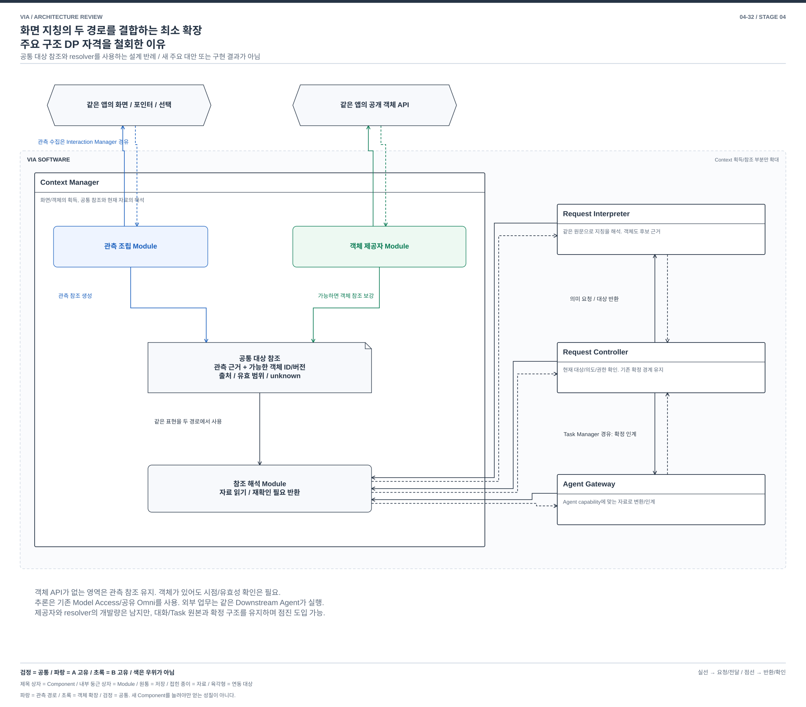

# 04-32. 화면 지칭의 정확성을 위한 대상 획득 — 관측 영역과 source 객체

> 기능 설계 비교 / 주요 구조 DP 자격 철회 / 2026-10-04 / [가이드](./04-30-comparison-guide.md) / 이전: [의미 구성](./04-31-semantic-construction.md) / 다음: [업무 대화](./04-33-dialogue-coordination.md)

> **현재 판정:** 화면 지칭은 중요한 기능 주제로 유지한다. 그러나 아래 이미지/객체 두 안은 공통 참조 구조에 점진적으로 함께 넣을 수 있으므로, 사용자가 요구한 수준의 주요 구조 대안 한 쌍으로 세지 않는다. §8에 최소 확장 구성과 근거를 기록했다. 그림의 차이는 이 판정을 바꾸지 않는다.

## 1. 왜 VIA에서 중요한가

사용자가 표를 가리키며 “이 범위를 비교해줘”라고 한 뒤 스크롤한다. VIA는 좌표에 새로 나타난 다른 표가 아니라 사용자가 지시한 범위를 알아야 한다. 이미지 속 그래프와 실제 스프레드시트 셀은 겉으로 비슷해도 같은 방식으로 다시 찾을 수 없다. 말과 화면을 연결하는 능력은 일반 Text Agent와 구별되는 VIA의 핵심이다.

UC-03/04는 발화 전/중 지칭, UC-05는 과거 또는 보이지 않는 대상을 다룬다. **source 객체**는 앱/문서 제공자가 식별하고 읽을 수 있게 노출한 셀, 문단, UI 요소 등이다. **관측 영역**은 특정 시점의 화면 이미지에서 사용자가 가리킨 부분이다. 둘 다 대상을 설명하지만 동일한 참조가 아니다.

## 2. SW Architecture에서 무엇이 어려운가

화면의 위치는 대상의 영구 identity가 아니다. 앱의 UI 요소 ID도 문서의 영구 객체 ID와 같지 않다. source가 수정되거나 창이 닫히면 재검증해야 한다. 화면 해석은 폭넓은 앱을 볼 수 있지만 실제 문서 범위로 연결하기 어렵고, 객체 연동은 정확한 범위/읽기 경로를 얻기 좋지만 앱별 구현과 지원 제한을 만든다.

결정은 **사용자의 화면 관측을 해석해 대상 참조를 만들 것인가, 앱/문서가 제공하는 객체를 지칭의 주 표현으로 삼을 것인가**다. 단순히 같은 화면을 미리 분석하거나 cache하는 비교를 교체했다.

## 3. 공통 환경과 두 구조

양안에 같은 앱, 같은 접근 권한, 화면/포인터/선택 사건과 Speech Input Worker의 발화 시점을 제공한다. 앱이 객체 API를 제공한다면 그 capability도 양쪽에 동일하게 존재한다. B만 비공개 ID를 얻는 평가를 하지 않는다. VIA는 읽기와 관찰만 하며 대상 앱 조작은 Agent에 맡긴다.

### A. 시점별 화면 관측에서 영역 참조를 생성

Interaction Manager는 허용된 화면과 입력 사건을 유한 RAM buffer로 모은다. Context Manager의 **관측 조립 Module**이 발화 구간의 화면 조각과 지시 경로를 구성한다. Request Interpreter는 Model Access를 통해 문장과 관측을 함께 해석하여 `창/문서 단서, 시점, 영역/집합, 관측 근거`를 담은 후보를 반환한다.

확정한 참조를 다음 대화에 재사용하며 간단한 앱 ID도 힌트로 쓸 수 있다. 다만 정상 대상 생성은 관측에서 이루어진다. 현재 원문을 읽거나 Agent에 수정 업무를 맡길 때는 관측 참조와 현재 source가 같은 대상인지 확인해야 한다. crop만으로 정확한 셀 주소를 보장하지 않는다.

### B. source 객체 참조를 획득부터 조회와 인계까지 공유

새 **Source Reference Service** Component가 앱/문서의 객체 참조를 발급하고 해석하는 책임을 소유한다. 내부의 객체 연동 Module이 read-only 제공자에서 문서, 객체/선택 범위, 제공자 버전과 당시 위치/시점을 받는다. Interaction Manager의 지칭 시점과 결합해 해당 관측이 어느 source 객체를 가리켰는지 기록한다. 객체 내용을 VIA가 임의로 정답으로 만드는 것이 아니다.

이 참조는 Context Manager만 쓰는 cache가 아니다. **Context Manager는 내용 읽기, Request Interpreter는 지칭 후보 확인, Agent Gateway는 실제 인계 자료의 해석/변환**에 같은 `제공자 + 문서 + 객체/범위 + 버전` 계약을 사용한다. 각 사용자는 현재 허용된 목적/범위로 요청하고 Service는 내용/유효성 또는 지원 불가를 반환한다. 최종 실행 승인과 정책 원본은 기존 Request Controller/Policy Manager에 남는다.

Service는 원본 변경/선택 사건을 받아 참조를 갱신하거나 무효화하고, 후속 접근 때 제공자에 다시 확인한다. 문서 원본의 권위는 앱에 있다. UI 요소 runtime ID를 영구 문서 ID로 취급하지 않으며, 제공자가 유지하지 않는 과거 상태를 나중에 조회할 수 있다고 가정하지 않는다.

따라서 A의 정상 참조가 `당시 무엇이 보였는가`라면 B의 정상 참조는 `어느 제공자의 어떤 객체를 현재 어떤 범위로 읽을 수 있는가`다. 입력 획득, 후속 대화의 대상 표현과 Agent 인계가 이 차이를 함께 소비한다. Service의 별도 네트워크 서버나 OS process 배치는 필수 조건이 아니다.

B도 화면 조각을 보조 근거로 사용할 수 있다. source가 객체를 노출하지 않는 canvas 세부 영역은 자동 객체 인계가 미지원/부분 지원이며 수동 첨부의 비용을 남긴다. 지원 앱은 객체 경로, 나머지는 화면 경로로 처리하는 혼합도 가능하다. 그 경우 두 대상 표현과 유효성/인계 규칙을 실제로 유지해야 한다.


[편집용 draw.io](./diagrams/choice32-structure.drawio). 같은 사용자 환경에서 source 관측과 객체 연동의 주 경로가 다르다. Source Reference Service는 VIA 소유의 연동 책임이며 외부 앱의 제공자는 VIA 밖이다.

## 4. 같은 지칭을 처리하는 과정


[편집용 draw.io](./diagrams/choice32-event.drawio).

| 단계 | A | B |
| --- | --- | --- |
| 1 | Interaction Manager가 표 지칭 당시 화면/포인터/발화 시점 수집 | 같은 사건 수집. Source Reference Service가 당시 선택/객체를 제공자에 요청해 범위와 버전을 획득 |
| 2 | Request Controller → Context Manager: 해당 시점 근거 조회. 관측 묶음 반환 | Context Manager가 Source Reference Service에서 제공자/문서/범위/시점 참조와 실제 읽은 내용을 반환받음. 뒤늦은 현재 선택을 과거 선택으로 대신하지 않음 |
| 3 | Request Interpreter → Model Access: 원문과 화면으로 대상 후보 생성, 결과 반환 | 같은 모델에 원문과 객체 내용/관계 전달. Request Interpreter가 Source Reference Service에서 후보 참조의 유효성 확인 |
| 4 | Request Controller가 근거와 현재 사용 범위를 검사. 스크롤 후 같은 대상인지 현재 source 대조 | Source Reference Service의 현재 참조 재확인 결과를 받아 확정. 재확인할 수 없는 옛 ID는 거절/질문 |
| 5 | Task Manager/Agent Gateway가 Agent에 관측 근거와 확인된 대상 인계, 상태 반환 | Agent Gateway가 Source Reference Service에서 허용된 객체 참조를 실제 인계 내용으로 해석/변환해 제공. Agent가 그 참조를 못 받으면 확인 가능한 내용으로 변환하거나 지원 한계 표시 |

## 5. 품질 차이가 실제로 드러나는 장면

| 장면 | A | B |
| --- | --- | --- |
| canvas의 “붉은 선 아래 부분” | 그림에서 직접 지정할 수 있으나 영역 해석 오류 가능 | 객체 API가 그 영역을 표현하지 못하면 수동 첨부/선택 필요 |
| 긴 표의 행을 스크롤 뒤 다시 참조 | 당시 그림과 현재 위치를 재연결해야 함 | 제공자가 유효한 문서 범위를 유지하면 재조회 쉬움 |
| 표 안의 숨겨진 값/선택 범위 | 화면에 보이지 않은 값을 보았다고 할 수 없음 | 허용된 source 읽기로 실제 값/범위 획득 가능. 화면 관측 사실과 구분 |
| 앱 버전/구조 변경 | 시각 형태가 유지되면 대응 기회, 모양 변경에 취약 | 제공자 계약 변경과 객체 무효화 처리 필요 |

## 6. 정정과 지원 범위

| 사건 | A | B |
| --- | --- | --- |
| “이 범위 말고 여기” | 관측/입력 버전 갱신, 새 영역 해석 | 새 객체/선택 사건과 입력 버전 결합, 옛 참조 폐기 |
| 창 닫힘/문서 변경 | 옛 관측으로 당시 대상을 설명할 수 있지만 현재 수정 가능성은 재확인 | 객체 handle은 유효성 재확인. 저장된 문서 ID가 있어도 같은 내용이라는 뜻은 아님 |
| 관측/제공자 gap | 없던 장면 추정 금지, 재지칭 | 없던 과거 객체 상태 추정 금지, 재조회/사용자 확인 |
| 동의 철회/삭제 | buffer와 crop, 파생 제안/KV 정리 | source 구독, 객체 cache/참조, 내용 사본과 KV 정리 |
| 재시작 | 확정 참조와 허용 근거에서 재연결 | session handle 복원 대신 source 재연결과 참조 검증 |

A/B 모두 단일/복수/순차 지칭을 지원하려 하지만 A는 시각 분해 정확도, B는 제공자 범위에 한계가 있다. B의 opaque 영역은 자동 지원으로 세지 않는다. UC-05의 메일 검색 전체를 이 화면 비교의 이익으로 가져오지 않는다.

## 7. 같은 13개 관점의 품질 손익

[공통 정의와 우선순위](./03-00-quality-scenarios.md#2-어떤-품질을-보고-있는가)를 따른다. 아래는 구조에서 예상하는 조건부 효과이며 측정값이 아니다. V-04/05는 VIA 귀속 시간이고 외부 Agent의 업무 실행 시간은 공통 외부 조건이다.

| 관점 | A의 이익과 비용 | B의 이익과 비용 |
| --- | --- | --- |
| V-01 정확성 | 시각적으로 보이는 임의 영역 처리, 위치/내용 오결합 위험 | source 범위의 명시적 identity, 제공자의 누락/오류와 오래된 ID 위험 |
| V-02 적절성 | 낯선 앱에서도 지칭 가능성, 재지칭 부담 | 지원 앱의 재참조/범위 지정 수고 감소, 미지원 앱은 수동 첨부 |
| V-03 완전성 | 화면에 없는 내용은 별도 조회 필요 | 세부 객체 미노출 영역은 부분/미지원, 요구 모집단에서 제외하지 않음 |
| V-04 반응성 | 시각 해석 대기 | source 왕복/변경 지연, 안정된 선택이면 작은 입력 가능 |
| V-05 VIA 완료 시간 | 반복 지칭과 현재 대상 재매칭 비용 | 객체 재조회 비용, 연동 실패 시 사용자 우회 |
| V-06 자원과 수용량 | 관측 buffer와 시각 토큰, burst 처리량 한계 | 제공자 cache/구독과 변경 backlog, 같은 모델 weights |
| V-07 결함과 복구 | capture/시각 실패 시 해당 지칭 보류 | provider crash/오래된 참조를 차단, 재연결 후 검증 |
| V-08 변경과 모듈성 | 시각 표현/매칭 변경 중심 | Source Reference Service와 입력/대화/Agent 인계의 참조 계약을 함께 변경 |
| V-09 분석과 시험 | 당시 관측 재현, 시각 오해 원인 확인 어려움 | 객체/버전 추적, 제공자 누락과 시간 오결합을 시험 |
| V-10 기밀성 | 화면에 다른 자료가 함께 포함될 수 있어 최소 crop 필요 | 범위 읽기 가능하나 보이지 않는 자료도 읽으므로 목적 제한 필요 |
| V-11 연동과 공존 | 연동: 화면 접근 중심 / 공존: capture와 시각 추론 경합 | 연동: 앱별 객체/선택 capability / 공존: 구독과 source 읽기 경합 |
| V-12 조작과 오류 방지 | 영역 강조와 재지칭, 좌표를 실제 문서 identity처럼 표시 금지 | 객체 범위 강조, 지원 안 되는 영역을 분명히 표시 |
| V-13 설치 | capture adapter와 같은 Omni/ASR | source adapter/권한/버전 호환 설치 및 제거 추가 |

## 8. 가장 싼 확장을 실제로 구성한 결과

이전에는 source 참조를 여러 Component가 소비한다는 사실을 큰 구조 전환의 근거로 삼았다. **소비자가 여러 개라는 사실만으로는 충분하지 않았다.** 대상 표현을 공통화한 뒤 자료 생산자만 추가하는 경로를 다음처럼 구성할 수 있다.

### 8.1 공통 참조를 사용하는 최소 확장



[편집용 draw.io](./diagrams/choice32-extension.drawio). 자료 읽기와 참조 부분을 확대한 설계 반례다.

아래는 설계 가능한 최소 확장이다. 구현 완료나 실제 OS/provider 지원을 뜻하지 않는다.

```text
대상 참조 = {
  observed: 창/문서 단서 + 시점 + 화면 영역 + 관측 근거,
  source: 제공자 + 문서/객체/범위 + 버전  [획득 가능할 때],
  validity: 확인된 범위 / unknown / invalid,
  origin: 어느 입력과 읽기에서 얻었는가
}
```

1. Interaction Manager는 기존 화면/포인터/선택 기록을 유지한다. 객체를 제공하는 앱에서는 Context Manager의 제공자 adapter가 당시 객체 ID/선택 범위를 함께 얻는다. 획득 시점이 다르면 같은 대상으로 단정하지 않는다.
2. Request Interpreter는 같은 원문과 근거에서 지칭을 해석한다. 객체 ID는 가능한 후보의 근거가 되며, 없으면 관측 참조를 사용한다. 이미지 해석 경로를 없앨 필요가 없다.
3. Context Manager는 대상 참조를 받아 `객체 조회`, `관측 근거 읽기`, `재확인 필요` 중 해당 경로를 수행한다. 제공자별 버전/수명은 이 resolver 내부에서 관리한다.
4. Agent Gateway는 Agent의 capability에 맞게 확인된 원본 범위 또는 관측 자료를 전달한다. 정확한 수정 대상이 확인되지 않으면 양쪽 모두 재확인한다. 객체 API를 지원하지 않는 Agent에 임의 ID를 보내 성공했다고 하지 않는다.

여기서 resolver는 **참조를 현재 읽을 수 있는 자료로 바꾸는 기능**이다. 별도 Source Reference Service로 배치할 수도 있고 Context Manager 내부에서 제공할 수도 있다. 별도 상자가 꼭 필요한 것은 아니다. 기존 호출자가 참조의 출처/유효성을 이미 전달받는다면 대부분의 변화가 제공자와 변환 경로에 모인다.

| 실제 사용자 사건 | 최소 확장으로 하는 일 | 별도 주요 구조가 필요한가 |
| --- | --- | --- |
| “이 표 설명해줘” | 당시 관측과 제공자 객체를 함께 후보로 사용 | 이 사건만으로는 아님 |
| 스크롤 뒤 “아까 그 표” | 객체 조회 가능하면 현재 버전 읽기, 아니면 당시 관측과 현재 대상 재확인 | 공통 참조의 두 조회 경로로 수용 가능 |
| 문서 수정/대상 삭제 | 해당 출처의 참조를 invalid/재확인으로 전환 | source 수명 관리의 기능 개발 필요. 대화 의미 생산 체계 교체는 불필요 |
| “그 표를 보고서에 넣어” | Agent가 지원하는 자료로 변환하고 현재 권한/대상 확인 | 인계 adapter 변경. 중앙 확정/Task 상태 소유를 유지 가능 |
| 객체 API가 없는 canvas | 관측 근거를 유지하고 필요한 경우 수동 재지칭 | 기능 손실/사용자 비용은 있으나 기존 경로를 폐기할 이유 없음 |

### 8.2 현재 저장소에서 확인되는 재사용 근거

참조 구조의 [Context 수명 §2](../target-architecture/memory-and-context-lifecycle.md#2-context-획득과-지칭의-정확성)는 stable object/file/artifact ID의 직접 읽기와 구조화 UI가 없는 화면 crop을 같은 근거 처리 안에서 다룬다. 선택/포인터의 유효 구간과 source revision, typed referent를 이미 구별한다. [architecture §9](../target-architecture/architecture.md#9-contextcachestale-처리)도 화면/UI 시점과 후보 집합, 변경 시 무효화를 다룬다.

이 참조 설계를 A로 강제하는 것이 아니다. **현재 범위에서 객체와 관측을 함께 다루는 작은 확장이 현실적이라는 반례**로 사용한다. 최초 A의 표현이 이미지 전용이었다 해도 참조 형태를 확장하고 소비자의 공통 resolver를 도입하는 전환부터 검토해야 한다. 모든 소비자의 의미/실행을 갈아엎는다고 가정할 수 없다.

### 8.3 다른 구조로 키우려던 방향도 채택하지 않은 이유

- **입력 시점에 지칭을 먼저 결합:** 관측 buffer와 발화 시점 정렬은 기존에도 필요하다. 모델이 최종 지칭을 정하는 경로를 유지한 사전 결합은 전처리 확장이다. 지칭 의미 전체를 입력 순간에 확정하면 뒤의 부정/정정을 잘못 처리하므로, 그 기능을 빼서 차이를 만들지 않는다.
- **화면 객체를 계속 추적하는 상태 추가:** 요청별 해석에 추적 결과를 보조 근거로 넣는 것만으로는 계열이 바뀌지 않는다. 모든 읽기/대화가 그 추적 상태를 원본으로 삼아야 한다는 가정은 현재 필요성보다 크고, 오래된 시각 해석을 새 권위로 만들 위험이 있다.
- **사용자가 먼저 대상을 확정하는 선택 UI:** 모호할 때의 재지칭/확인은 양안의 공통 수단이다. 모든 요청에 강제해 조작 부담을 늘리는 것만으로 주요 SW 구조를 만들지 않는다.

이들은 본격적인 새 구조 비교로 채택한 안이 아니라 최소 확장 반론에서 걸러낸 방향이다. 주제를 채우기 위해 별도 서버나 새로운 모델을 덧붙이지 않았다.

### 8.4 비용을 다시 분류한다

| 비용 종류 | 실제 남는 작업 | 이번 판단 |
| --- | --- | --- |
| 기능 개발 | 앱별 provider, 시점 결합, 참조 수명, Agent별 자료 변환 | 상당한 개발량일 수 있지만 그 자체는 새 구조 계열의 증거가 아님 |
| 상태 이행 | 예전 crop에 없는 객체 정보는 새 요청부터 획득 | 과거 정보 부족을 어려운 핵심 재설계라고 세지 않음 |
| 구조 변경 | 공통 참조/resolve port가 없다면 추가, 출처와 유효성 계약 확장 | 기존 대화/의미 생산/Task/확정 원본을 유지하며 점진 적용 가능. 현재 근거로는 주요 자격 미달 |

## 9. 판단과 다음에 다시 볼 조건

**이 두 안의 주요 구조 DP 자격을 철회한다.** 기존 04-37의 “입력부터 인계까지 쓰이면 주요 구조 비교로 유지”라는 판단은 충분하지 않았다. 입력/조회/인계의 소비자가 많아도 공통 참조와 resolver를 통해 쉽게 조합할 수 있다는 반론이 남는다.

화면 지칭의 중요성이나 객체 연동의 기능적 가치를 철회하는 것은 아니다. §1~7의 두 경로와 13개 품질 손익은 **같은 계열 안의 기능 설계 자료**로 유지한다. 객체 경로는 지원 앱에서 정확한 범위 읽기/재지칭을 돕고, 관측 경로는 낯선 앱/영역을 다룬다. 혼합이 자연스러우며 그 개발/자원/지원 비용을 비교하면 된다.

따라서 여섯 문서를 여섯 개의 유효한 주요 대안 쌍으로 보고하지 않는다. 이 주제는 중요한 미완 과제로 남긴다. 재검토하려면 새 안이 입력 의미를 생산하는 정상 경로나 대상 상태의 실제 권위를 어떻게 대체하는지, 그리고 그 대체가 VIA의 같은 사용자 목적에 왜 필요한지부터 보여야 한다. 새 provider, 추적 cache 또는 상자 추가만으로 재승격하지 않는다.
