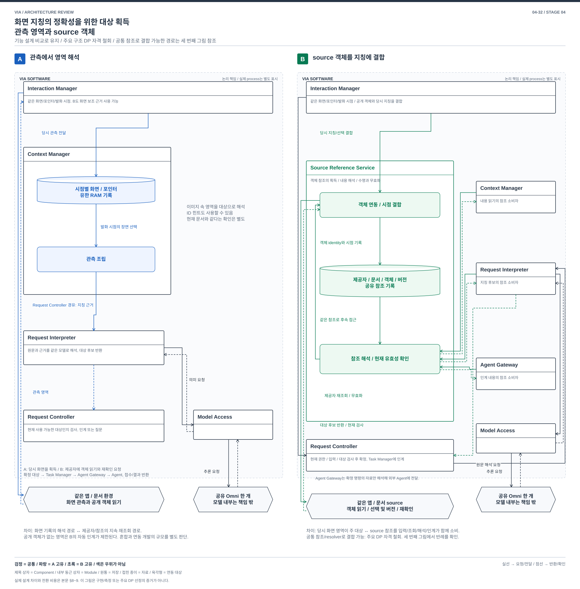
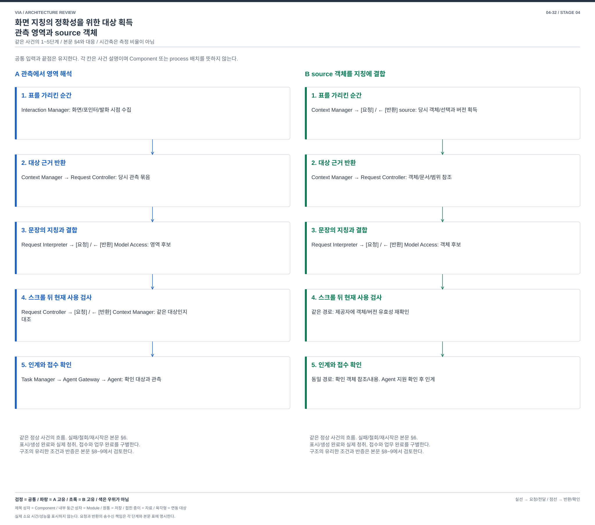

# 04-32. 화면 지칭의 정확성을 위한 대상 결합 — 요청 시 관측 해석과 관측 시 화면 상태 구성

> 메인 구조 비교 보완 / 2026-10-04 / [가이드](./04-30-comparison-guide.md) / 이전: [의미 구성](./04-31-semantic-construction.md) / 다음: [업무 대화](./04-33-dialogue-coordination.md)

**A는 질문이 들어오면 저장한 화면을 꺼내 대상을 해석한다. B는 허용된 화면이 바뀔 때 대상과 관계를 먼저 구성해 두고, 질문은 그 상태를 조회한다.** A는 물어본 화면에만 의미 처리 비용을 쓴다. B는 여러 요청이 같은 화면 상태를 공유하지만, 아직 질문하지 않은 화면도 처리하고 누락이나 오래된 상태를 관리해야 한다.

**메인 그림에서 볼 차이:** A는 원본 관측 저장소에서 요청 해석기로 자료가 들어온다. B에는 요청 경로와 별개로 움직이는 화면 상태 생산 경로가 있고, 요청은 버전 있는 상태 저장소를 조회한다. 화면 분석 보조 모듈 하나를 같은 모델 앞에 붙인 비교가 아니다.

## 1. 왜 VIA에서 중요한가

사용자가 첫 화면의 왼쪽 표를 가리키며 “이 표와”라고 말하고, 스크롤한 뒤 오른쪽 표를 가리키며 “저 표를 비교해줘”라고 한다. 다음에는 “첫 표는 왼쪽 말고 오른쪽”이라고 정정한다. 화면이 사라져도 당시 지칭을 설명할 수 있어야 하며, 현재 화면의 같은 좌표로 과거 대상을 바꾸면 안 된다.

UC-03/04의 화면 지칭과 UC-06의 보완을 다룬다. VIA는 말, 화면, 포인터를 같은 대화로 연결한다. 분석 방법과 실제 비교 업무는 Downstream Agent가 맡고, VIA는 어떤 두 대상을 넘길지를 정한다. PC 전체를 항상 분석하거나 동의하지 않은 화면을 수집하는 새 기능을 요구하지 않는다.

## 2. SW Architecture에서 무엇이 어려운가

발화, 화면 변화, 포인터는 다른 시점에 도착한다. 무엇을 당시 근거로 보존하고, 화면의 의미를 언제 생산하며, 미완성 화면 상태로 요청이 들어오면 어떻게 처리할지 결정해야 한다. 같은 좌표나 비슷한 모양은 대상의 동일성을 보장하지 않는다.

이번 질문은 **요청이 원본 관측의 의미 해석을 시작하는가, 관측 변화가 상태 생산을 시작하고 요청은 그 결과를 조회하는가**다. 입력 생산, 실행 수명, 상태 소유, 조회 의존성과 복구가 달라진다. 모델 내부 알고리즘이나 단순 호출 횟수는 비교 축이 아니다.

옛 이미지/API 비교와 직전의 공동 해석/두 생산자 결합은 [이력](../../../archive/decision-comparisons-before-main-figure-review-2026-10-04/04-32-screen-grounding.md)에 보존했다. 후자는 요청 안의 해석기 분해로 수용될 여지가 커 메인 대안으로 교체했다. 어느 설계가 더 정확하다는 결론은 내리지 않았다.

## 3. 같은 관측과 서로 다른 두 구조

양안에서 Interaction Manager는 사용자가 허용한 활성 창과 유한한 관측 구간의 화면/포인터 사건을 수집한다. 독립 Streaming ASR을 사용하는 Speech Input Worker의 발화 시점, 입력 버전과 연결한다. 의미 추론 중에도 음성 수신은 계속한다. Context Manager가 원본 관측의 수명, 접근과 삭제를 관리한다. 같은 공개 객체 정보가 있으면 둘 다 사용할 수 있다. 같은 예산에서 놓친 구간은 양안 모두 관측 공백이다.

**원본 관측**은 당시 화면, 포인터, 창과 시점이다. **화면 상태**는 그 관측에서 도출한 대상, 관계, 유효 구간과 불확실성이다. 파생 상태가 새로운 원본 증거가 되지는 않는다. 모델 추론은 같은 Model Access와 단일 Omni를 사용하며 새 학습이나 별도 시각 모델을 전제하지 않는다.

### A. 요청이 관측 해석을 시작한다

1. Context Manager가 허용된 화면/포인터를 **원본 관측 버퍼**에 보존한다. 단순 화면 변경마다 시각 의미 모델을 호출할 필요는 없다.
2. Request Controller가 지칭 요청을 받으면 **Observation Grounding Interpreter**에 원문, 지시 시점과 허용 범위를 보낸다.
3. Interpreter는 Context Manager를 통해 해당 시점의 원본을 조회하고 Model Access에 말과 화면의 공동 해석을 요청한다. 관측 ID와 시간 검증을 통과한 대상 관계를 Controller에 반환한다. 불명확하면 질문한다.
4. “첫 표는 오른쪽”이라는 정정에는 관련 원본과 앞 지칭을 다시 사용한다. 같은 해석 결과의 cache, 공개 객체 ID와 시간 검증, 일부 필드 수정도 허용한다.

해석 결과 cache가 있어도 **요청이 정상 의미 생산의 시작점**이다. 요청과 무관한 화면 변화에 모든 대상 상태를 유지할 의무는 없다. 낯선 그림이나 새 관계를 질문할 때 원본을 직접 해석할 기회를 유지한다.

### B. 관측이 화면 상태를 만들고 요청은 조회한다

1. 동의된 관측 구간이 열려 있는 동안 Context Manager는 화면 변화/선택 사건과 원본 참조를 **Scene State Service**에 전달한다. 매 frame 추론은 하지 않으며 중복 사건을 합치고 예산을 넘는 구간은 공백으로 표시한다.
2. Service 내부 **장면 갱신기**는 원본 관측을 공유 모델/공개 객체 정보로 해석한다. **대상과 관계 저장소**에 관측별 대상 ID, 영역/속성, 명시한 관계, 시점, 원본 참조, coverage와 버전을 발행한다. 다른 화면 사이의 동일성은 근거가 있을 때만 연결한다. 이 생산 수명은 개별 요청보다 길고 여러 요청이 공유한다.
3. Request Controller의 원문은 **Scene Query Interpreter**가 언어 조건으로 바꾼다. 이 경로는 정상적으로 화면 픽셀을 다시 읽어 대상을 만들지 않는다. Service의 **시점 조회기**가 `t1의 지시 대상`, `t2의 표` 같은 조건을 해당 버전의 상태에 적용해 두 참조와 근거를 반환한다.
4. 관측 처리가 아직 끝나지 않았으면 해당 버전 발행을 기다리거나 미해결을 반환한다. 원본은 있지만 상태가 낡은 경우 Service가 그 구간을 다시 구성한다. 후보 종류/관계가 표현 범위 밖이면 재지칭을 요청한다. 빈 조회 결과를 “대상 없음”으로 단정하지 않는다.
5. 첫 지시 정정은 동일 관측 버전에서 조건을 다시 조회한다. 원본/정책 변경 통지가 오면 Service가 영향받은 상태와 열린 조회를 무효화한다. 최종 Controller의 현재 의도/권한 검사와 Task/Agent 인계는 A와 같다.

Scene State Service는 VIA 내부의 독립 책임이며 서버나 별도 OS process를 강제하지 않는다. 상태는 유한 기간의 파생 read model이다. 과거 화면을 무한 저장하거나 모든 앱의 객체 동일성을 보장하지 않는다. 모델이 잘못 만든 상태는 여러 후속 요청에 오류를 전파할 수 있다.

[편집용 draw.io](./diagrams/choice32-structure.drawio). B의 **관측 생산**과 **요청 조회** 번호는 서로 다른 흐름이다. 상태 발행 전 조회가 들어오는 경우도 허용하며 화면에서 없는 과거 대상을 새로 만들어내지 않는다. 네모에는 이름, 화살표에는 자료/조건, 원통에는 저장 이름을 표시했다. 그림 아래는 공통 확정/인계와 선택 비용이다.

### 3.1 같은 자료를 어떻게 다르게 사용하는가

| 자료/처리 | A | B |
| --- | --- | --- |
| 화면 7/8과 p1/p2 | 같은 유한 원본 버퍼 | 같은 버퍼 + 관측별 파생 대상/관계 |
| 표 L@7, R@8 생산 | 해당 지칭 요청이 필요로 하는 범위에서 공동 해석 | 관측 사건 처리 때 생산, 상태 버전으로 발행 |
| 첫 참조 수정 | 원본/앞 지칭/정정의 재해석 또는 검증된 patch | 같은 상태에 바뀐 조회 조건 적용. 상태가 불완전하면 대기/재구성 |
| 새 종류의 도형 질문 | 원본에서 새 의미를 해석할 기회 | schema/생산자가 표현하지 않은 영역이면 재지칭 또는 미지원 |
| 확정 이후 | 대상 근거를 남기되 원본 수명 준수 | 참조한 상태/원본 수명과 무효화 관계를 함께 유지 |

## 4. 같은 정상 사건과 정정

[편집용 draw.io](./diagrams/choice32-event.drawio). 사건 번호는 아래 표의 순서이며 모델 실행 결과가 아닌 설계 추적이다.

| 사건 | A | B |
| --- | --- | --- |
| 1. “이 표와” 및 화면 7/p1 | 원본 저장 | 같은 저장 + 화면 7 상태 생산 시작 |
| 2. 스크롤 뒤 화면 8/p2와 “저 표를 비교” | 원본 저장, 해석 요청 | 화면 8 상태 생산. 발화는 시점 조회 조건으로 변환 |
| 3. 두 대상 결정 | 공동 해석에서 L@7/R@8 제안 및 검증 | 상태 7/8의 coverage/버전 확인 후 조건 조회. 준비 안 됐으면 기다리거나 질문 |
| 4. “첫 표는 왼쪽 말고 오른쪽” | 원본 재해석 또는 앞 결과의 검증된 수정 | 화면 7의 오른쪽 후보 재조회. 누락되었으면 해당 상태 재구성 또는 재지칭 |
| 5. 인계 | 현재 의도/자료/권한 검사 뒤 두 참조 인계 | 동일. 조회 성공이 외부 실행 승인은 아님 |

**불리한 같은 변형:** 첫 표를 가리킨 구간의 관측이 공백이면 양안 모두 정확한 참조를 확정할 수 없다. B에만 정답 상태를 미리 주지 않는다. 단순 스크롤은 L@7을 현재 화면의 다른 표로 바꾸지 않는다. 실제 문서 조작이 필요한 업무는 양안 모두 현재 source를 재확인한다.

## 5. 언제 어느 안을 선택하는가

| 상황 | A의 선택 이유/비용 | B의 선택 이유/비용 |
| --- | --- | --- |
| 가끔 화면을 묻고 앱/도형이 다양함 | 물어본 관측만 해석, 열린 표현 활용. 요청마다 준비 대기 | 질문하지 않은 화면 처리 비용, 표현 밖 관계의 손실 |
| 같은 작업 화면에서 지칭/정정을 반복 | cache/patch도 가능. 처음 필요해진 관계는 해석 | 발행 상태 재조회로 시각 생산을 공유. 상태가 틀리면 오류도 공유 |
| 화면 변화가 질문보다 훨씬 많음 | 원본 수집 비용 중심 | 생산 backlog와 배터리/메모리 증가, 질문 시 재구성으로 이익 소멸 가능 |
| 요청이 많고 장면 표현이 안정적임 | 반복 원본 해석 비용 또는 cache 관리 | 생산/조회 분리 가치가 커질 가능성. 실제 빈도/이익 미확인 |

B는 “더 정확하다”가 아니라 **관측별 근거와 조회 상태를 유지하는 운영 방식**을 선택한다. 표/목록/선택 영역처럼 지원 관계를 정할 수 있고 반복 조회의 가치가 있을 때 유력하다. 작은 결과 cache로 충분하면 A가 타당하다.

## 6. 누락, 변경, 철회와 재시작

| 사건 | A | B |
| --- | --- | --- |
| 화면 변화 처리 지연 | 요청 시 보존된 원본으로 해석 | 요청 시점까지의 상태 coverage 확인. 미처리 구간을 완료처럼 사용 금지 |
| 객체 동일성 불명 | 다른 관측의 별도 후보로 취급 | 연결을 unknown으로 남김. 좌표 유사성만으로 track 계승 금지 |
| source/정책 철회 | 원본, cache, 진행 해석/KV와 인계 차단 | 같은 차단 + 파생 상태, 참조 연결, 진행 조회/구독 삭제 또는 무효화 |
| 예산 초과/생산 실패 | 필요한 원본이 없으면 재지칭 | gap/부분 상태 발행. 정상적인 빈 장면과 구별. 요청 대기 무한 연장 금지 |
| 재시작 | 유효 원본/확정 참조에서 재해석, 외부 업무 중복 실행 금지 | 파생 상태는 재생산 가능. 원본이 없으면 unknown, 조회 가능하다고 표시 금지 |

양안의 원본 보존 예산은 동일하다. B의 후보 상태가 원본 삭제 후 몰래 영구 증거로 남지 않게 수명을 종속시킨다. 상태 서비스의 보관 방식은 35의 사건 원본 선택과 독립이며 event sourcing을 강제하지 않는다.

## 7. 같은 13개 품질 관점

[공통 정의](./03-00-quality-scenarios.md#2-어떤-품질을-보고-있는가)를 따른다. 모두 조건부 설계 효과다. V-04/05는 VIA 시간이며 Agent 내부 수행 시간은 포함하지 않는다.

| 관점 | A | B |
| --- | --- | --- |
| V-01 정확성 | 원문/원본 공동 해석, 시간/ID 검증. 매번 관계 오해 가능 | 시점/coverage 조회 명시. 잘못 발행한 상태의 반복 오류 위험 |
| V-02 적절성 | 낯선 표현을 원본에서 다룰 기회 | 반복 지칭에 일관된 상태 활용, 재지칭 요구 증가 가능 |
| V-03 완전성 | 모델이 해석할 수 있는 범위, 성공 미확인 | schema 밖 도형/관계는 부분 지원, 손실을 모집단에서 제외하지 않음 |
| V-04 반응성 | 요청 때 시각 해석 대기 | 준비된 상태 조회 이익, 미처리 coverage 대기와 모델 경합 |
| V-05 VIA 완료 시간 | 여러 보완의 재해석/cache 비용 | 반복 조회 이익, 상태 복구/질문 왕복 비용 |
| V-06 자원과 수용량 | 요청별 Context/KV, 원본 버퍼 | 같은 원본 + 파생 상태/구독/관측 생산. 미사용 화면 처리 비용 |
| V-07 결함과 복구 | 요청 단위 재시도 | 상태 생산 장애가 여러 조회에 영향. 원본에서 복구 또는 unknown |
| V-08 변경과 모듈성 | 공동 모델 입력/검증 수정 | 대상/관계 schema, 생산, 무효화와 질의 소비자 공동 변경 |
| V-09 분석과 시험 | 원문/원본/대응 비교 | 상태 version/coverage로 추적, 생산/조회 순서 경합 시험 추가 |
| V-10 기밀성 | 요청 근거/cache/원본 수명 관리 | 미사용 관측의 파생 의미까지 삭제/철회 관리 |
| V-11 연동과 공존 | 조회형 source 수용, 요청 burst | 관측 변화/누락/종료 연동, background 모델 경합. IPC 필수 아님 |
| V-12 조작과 오류 방지 | 자유 지칭과 확인 | 오래된 상태를 현재처럼 표시 금지, 표현 밖 대상은 명시적 재지칭 |
| V-13 설치 | 공동 해석/검증 모듈 | 상태 schema/생산/조회 호환 배포, 추가 모델 inventory 없음 |

## 8. 가장 싼 확장과 전환 판단

**A에 시각 cache를 넣으면?** 동일 화면의 해석 결과를 재사용하는 것은 A의 합리적 개선이다. 반복이 적고 상태 갱신을 요청 때만 해도 충분하면 B의 채택 이유가 없다. 따라서 A의 작은 cache와 비교하지 않은 반응성 주장은 인정하지 않는다.

**A의 cache를 화면 변화마다 갱신하면?** 일부 조회의 선행 계산만으로 충분한 경우도 있다. 그러나 정상 요청이 원본 공동 해석을 하지 않고 그 상태에 의존하도록 옮기면, 관측 coverage/삭제/버전 발행, 미처리 조회 대기, 관계 schema와 재구성을 함께 책임져야 한다. 이때는 요청 해석기 내부 최적화에서 **관측 생산자와 조회 소비자의 독립 수명**으로 바뀐다. 그것을 이미 갖춘 cache는 B 계열로 분류한다. 서비스 상자의 존재는 자격 근거가 아니다.

**B에 원본 공동 해석 fallback을 붙이면?** 현실적인 혼합이다. 생산 상태를 쓸지 원본을 해석할지 선택하고 두 결과의 근거/무효화 규칙을 연결한다. 혼합 유지비가 크다고 단정하지 않는다. 드문 지칭만 B가 처리하고 대부분 fallback이면 B의 지속 생산 비용은 정당화하기 어렵다.

| 비용 | A → B | B → A |
| --- | --- | --- |
| 기능 개발 | 상태 생산/조회, coverage/무효화/재구성 구현 | 원본과 발화를 공동 해석하는 경로, 기존 모델/버퍼 재사용 |
| 상태 이행 | 관측 구간을 새로 열어 시작, 과거 관계 발명 금지 | 유효 원본/참조 재사용, 파생 상태 종료 가능 |
| 핵심 재설계 | 요청이 시각 의미 생산을 소유하던 경로를 관측 생산/상태 발행/질의 소비로 이동. 요청의 대기/실패/철회가 상태 수명을 소비 | 조회 상태 의존을 원본 해석으로 회수하고 배경 생산/구독/파생 수명 종료. 더 쉬운 역전환 가능 |

**설계 판정:** 원본 공동 해석을 기본값으로 둔 helper 추가는 A다. B의 정상 경로는 상태 조회이고 관측 생산은 요청 밖에 있다. 이 운영 차이가 필요 없는 사용량이면 A를 택한다. 전환이 양방향 똑같이 어렵다는 주장은 하지 않는다.

## 9. 현재 판단과 남은 확인

화면 지칭이라는 핵심 주제를 유지하고 대안 쌍을 교체했다. 메인 그림에서 원본→요청 해석과 관측→상태 발행→요청 조회의 차이를 드러냈다. A는 드문 요청/낯선 표현, B는 안정된 표현 영역에서 반복 조회가 많은 경우 선택 이유가 있다.

B의 대상 schema와 coverage를 실제 모델/OS 관측으로 충분히 만들 수 있는지, A+cache보다 이득인지, 파생 상태의 비용이 PC 예산에 맞는지는 미확인이다. 상태 생산/조회 분리라는 구조적 근거는 구체화했지만 그것으로 최종 발표 수용이나 품질 우위를 선언하지 않는다. 31의 목표/금지 조건과 달리 이 상태는 관측된 화면의 대상/관계만 소유하며 사용자 의도나 업무 계획을 소유하지 않는다.
