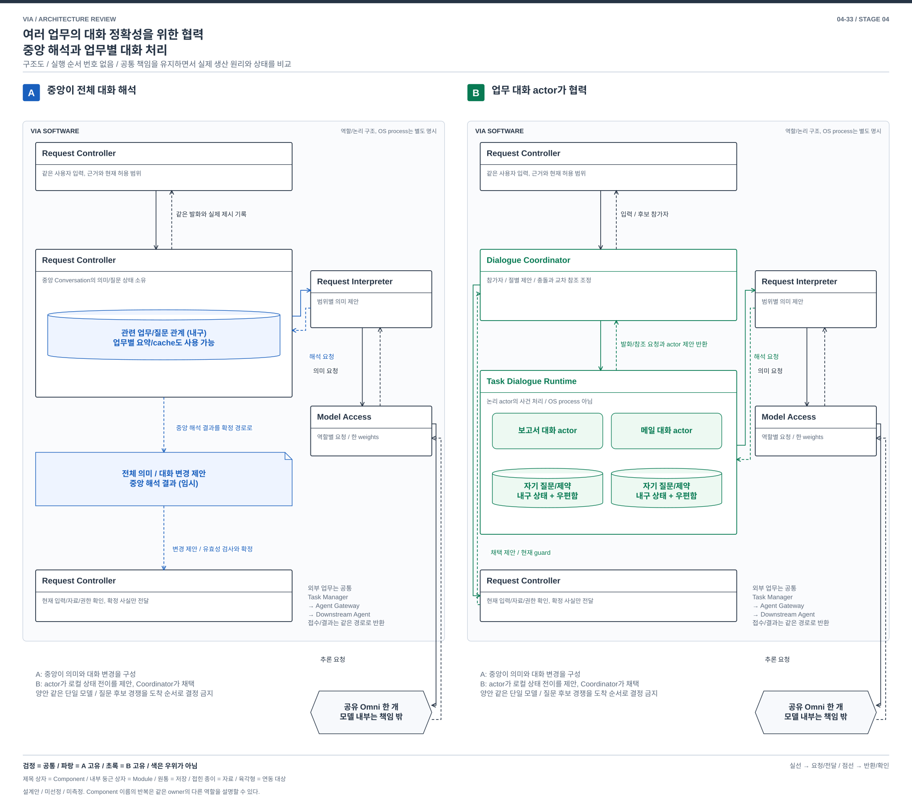
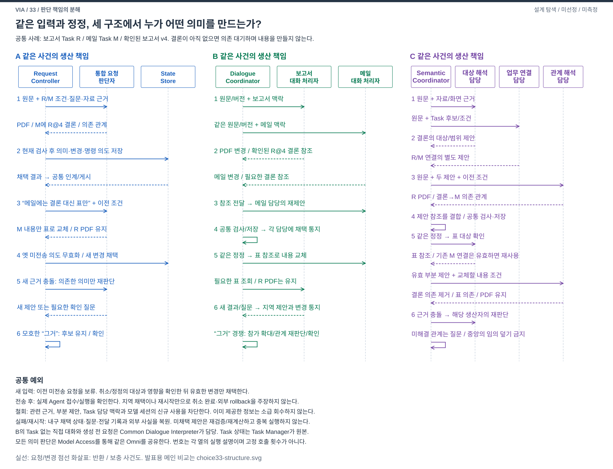

# 04-33. 여러 업무의 대화 정확성을 위한 협력 — 중앙 해석과 업무별 대화 처리

> 구조 재설계안 / 2026-10-03 / [가이드](./04-30-comparison-guide.md) / 이전: [화면 대상](./04-32-screen-grounding.md) / 다음: [음성 처리](./04-34-incremental-voice.md)

## 1. 왜 VIA에서 중요한가

보고서와 메일 업무가 동시에 질문을 보낸다. 사용자가 “보고서는 그 형식대로 하고, 메일에는 그 결론을 넣어줘”라고 답한다. 첫 절의 답변과 두 번째 절의 자료 참조를 정확히 연결해야 한다. 사용자가 Agent별 창이나 실행 번호를 관리하게 하면 VIA의 대화 창구로서의 가치가 줄어든다.

UC-06/07/10/13/14/15의 문제다. **업무 대화**는 Task의 사용자 제약, 미해결 질문, 사용자가 실제로 본 답변과 이어가기 관계다. 외부 Agent의 업무 계획이나 Tool 실행 상태가 아니다. 직접 설명만 한 주제도 후속 지칭을 위해 대화 단위를 가질 수 있지만, 그 자체로 Task를 만들지는 않는다.

## 2. SW Architecture에서 무엇이 어려운가

중앙에서 여러 업무를 함께 보면 교차 참조를 이해하기 좋지만 대화가 길수록 필요한 제약을 다시 회수하고 경쟁하는 질문을 구별해야 한다. 반대로 업무별 처리자가 자신의 맥락을 유지하면 길게 이어가기 좋지만, 어느 업무가 발화를 가져가야 하는지와 업무 간 참조를 협력으로 해결해야 한다.

**한 해석기가 관련 대화를 모아 발화 전체의 의미를 만드는가, 업무별 대화 처리자가 각자의 상태로 의미를 제안하고 협력해 적용 대상을 결정하는가**가 질문이다. Task별 prompt를 저장하거나 발화를 먼저 한 Task에 배정하는 정도를 넘어서, 의미 생산과 대화 상태 갱신을 누가 수행하는지 비교한다.

## 3. 공통 사실과 두 구조

Task Manager는 양안 모두 외부 실행 상태의 원본이다. Request Controller는 현재 권한과 요청 유효성을 검증하고 Task Manager에 명령을 전달한다. Response Manager는 사용자 응답을 조정하며 실제 표시/청취 기록은 Interaction Manager에서 받는다. 질문 focus는 실제 제시된 유효 질문을 가리키는 기록이며 양안에 있다. “응”을 관측 없이 임의 질문의 승인으로 처리하지 않는다.

### A. 중앙 대화 상태에서 전체 발화를 해석

Request Controller가 Conversation의 미해결 의미, 질문 연결과 대화 갱신을 소유한다. Context Manager가 관련 Task와 대화 근거를 반환하면 Request Interpreter가 전체 발화의 절, 참조와 Task 관계를 함께 제안한다. 중앙에서 상태를 확정하고 필요한 질문/명령을 만든다.

관련 업무만 검색하며 업무별 요약, cache와 index를 쓸 수 있다. 모든 대화를 매번 모델에 넣는 허술한 안이 아니다. 다만 상태 갱신과 새 사용자 발화의 의미 생산을 결정하는 주체는 중앙이다.

### B. 업무별 대화 actor가 의미를 제안하고 조정자가 합의

**Task Dialogue Runtime**이라는 새 Component가 업무/직접 대화 주제별 **대화 actor**를 실행한다. actor는 자기 대화 상태와 입력 우편함을 소유하며 메시지를 순서대로 처리하는 논리 실행 단위다. OS process나 별도 모델을 뜻하지 않는다. 각 actor는 미해결 질문, 사용자 제약, 실제 전달 참조를 유지하고 입력/Agent 질문/전달 완료 사건에 따라 자기 상태 전이를 제안한다.

**Dialogue Coordinator**라는 새 Component가 현재 발화의 후보 참가자를 정한다. 명시 Task와 관련 주제 검색으로 후보를 제한하되 불명확하면 범위를 넓히거나 질문한다. 후보 actor에 동일 입력 버전과 해당 actor에 허용된 근거만 보낸다. actor는 Request Interpreter/Model Access를 통해 자기 맥락에서 해석하고 `내가 담당할 절, 근거, 필요한 다른 참조, 다음 대화 상태 제안`을 반환한다.

Coordinator는 제안이 덮는 원문 구간과 Task/질문 ID를 비교한다. 경쟁/누락/상충은 재질의 또는 사용자 확인으로 해결한다. 모델별 confidence의 크기를 비교해 승자를 고르지 않는다. 업무 간 자료 참조가 있으면 생산 actor의 **확정 참조**를 소비 actor에게 요청/반환으로 전달하고 새 제안을 받는다. 여러 절의 관계가 여전히 불명확하면 관련 제안/원문으로 관계 해석을 요청할 수 있지만 actor의 로컬 상태를 직접 수정하지 않는다.

최종 적용은 Request Controller의 공통 guard를 거친다. Coordinator는 actor의 예상 버전과 채택된 변경을 같은 local State Store transaction으로 확정하고, 이후 actor에 적용 완료를 통지한다. actor가 선택되기 전에 외부 명령을 보내거나 질문을 중복 게시하지 못한다. actor의 상태 전이를 중앙 코드가 다시 만들어 버리면 B의 의미 생산 구조는 사라진다.

[편집용 draw.io](./diagrams/choice33-structure.drawio). 논리 actor의 여러 우편함이 여러 Omni weights를 뜻하지 않는다. 모델 호출은 같은 Model Access의 유한 실행 예산을 공유한다.

## 4. 같은 복합 후속 발화의 처리

[편집용 draw.io](./diagrams/choice33-event.drawio).

| 단계 | A | B |
| --- | --- | --- |
| 1 | Agent Gateway → Task Manager → Request Controller: 두 질문. 실제 게시 기록을 받은 뒤 사용자 발화 수신 | 같은 외부 사실과 입력. Runtime이 각 actor에 질문/실제 게시 사건 전달 |
| 2 | Context Manager에서 두 업무의 관련 대화 반환. Request Interpreter가 전체 발화 해석 | Coordinator → Runtime: 후보 actor에 입력 요청. 각 actor → Request Interpreter/Model Access: 자기 맥락 해석 요청/반환 |
| 3 | 전체 관계와 대화 상태 변경 제안 → Request Controller | actor → Coordinator: 담당 절/참조/상태 제안. 보고서의 확정 결론 참조를 요청/반환받아 메일 actor에 전달하고 제안 수정 |
| 4 | Request Controller가 현재 질문/Task/권한과 입력 버전을 검사해 중앙 상태 및 명령 intent 확정 | 같은 guard 뒤 Coordinator가 actor 예상 버전/채택 변경과 명령 intent를 한 local transaction으로 확정. 경쟁/누락이면 질문 |
| 5 | Task Manager → Agent Gateway: 답변/수정 명령. 반환 → Response Manager → Interaction Manager | 같은 외부 전달. actor는 적용 완료와 실제 사용자 전달 사건을 받아 대화 상태 유지 |

메일에 넣을 결론이 아직 생성되지 않았다면 둘 다 이미 있는 자료로 위장하지 않는다. 명시된 의존 관계를 보존하여 실제 결과를 기다리거나 확인한다. 불명확한 “응”은 어느 actor도 먼저 가져갈 수 없다.

## 5. 언제 각 구조가 도움이 되는가

| 장면 | A | B |
| --- | --- | --- |
| 한 발화가 여러 업무와 앞 설명을 연결 | 한 의미 입력에서 관계를 조합하기 쉬움 | 여러 제안과 참조 왕복, 누락/충돌 조정 부담 |
| 한 업무의 긴 제약과 대기 질문을 며칠 유지 | 관련 원문/요약을 정확히 회수해야 함 | 해당 actor의 미해결 상태와 대화 전이가 직접 다음 입력을 처리 |
| 다른 Task 결과가 해석 도중 도착 | 중앙 상태 버전 경합과 재해석 | 관련 actor만 갱신 가능하나 이미 낸 제안을 무효화/다시 받아야 함 |

B의 핵심 이익은 캐시 크기 감소만이 아니다. 독립 대화가 자신의 입력/결과 사건에 반응하고, 필요한 경우에만 다른 대화와 협력하는 실행 모델이다. 그 이익이 실제 업무 대화에 필요하지 않다면 A가 더 단순하다.

## 6. 상태, 정정과 지원 한계

| 사건 | A | B |
| --- | --- | --- |
| “메일 말고 보고서” | 중앙 제안 폐기 및 재해석 | 이전 참가 제안 취소, 새 참가자/입력 버전. 미확정 actor 상태를 다른 actor에 몰래 이전하지 않음 |
| 같은 절을 둘이 주장 | 중앙 해석에서 복수 Task 후보로 확인 | Coordinator가 충돌로 표시, 근거 추가/질문. 먼저 응답한 actor가 승리하지 않음 |
| actor timeout/Task 종료 | 해당 중앙 요청/질문 유효성 확인 | 해당 제안 제외 사유 표시. 필수 절 누락을 성공으로 확정하지 않음. 무관한 독립 절의 적용은 구분 |
| 교차 참조 순환 | 중앙 관계 검사 | 유한 라운드/전체 deadline과 참조 dependency 검사. 해결 안 되면 질문. 새로운 업무 계획을 만들지 않음 |
| 삭제/철회 | 중앙 대화와 모델 근거 무효화 | 모든 관련 actor 상태/우편함/제안/참조/KV에 전파 |
| 재시작 | 중앙 내구 상태와 외부 Task 복원 | actor 상태와 처리 완료 입력 버전 복원. 미확정 제안 재계산, 적용 명령은 재전송 원장 규칙 준수 |

두 안 모두 한 VIA 대화창과 교차 업무 제어를 지원하려 한다. B가 후보에서 필요한 업무를 놓치거나 협력으로 암묵 참조를 해결하지 못한 경우는 부분 지원/질문으로 기록한다. Agent thread 선택을 사용자에게 필수로 요구하지 않는다.

## 7. 같은 13개 관점의 품질 손익

[공통 정의와 우선순위](./03-00-quality-scenarios.md#2-어떤-품질을-보고-있는가)를 따른다. 아래는 구조에서 예상하는 조건부 효과이며 측정값이 아니다. V-04/05는 VIA 귀속 시간이고 외부 Agent의 업무 실행 시간은 공통 외부 조건이다.

| 관점 | A의 이익과 비용 | B의 이익과 비용 |
| --- | --- | --- |
| V-01 정확성 | 여러 업무 관계를 함께 해석, 맥락 혼입 위험 | 로컬 제약 유지, 참가 누락과 잘못된 협력/제안 결합 위험 |
| V-02 적절성 | 자유로운 업무 전환에 유리 | 긴 업무 이어가기 가능, 충돌 질문/참조 왕복으로 사용자 수고 증가 가능 |
| V-03 완전성 | 복합 발화의 통합 지원 의도 | 교차 함축/참가 누락은 부분 지원, 전체 발화 누락 여부 검사 필요 |
| V-04 반응성 | 중앙 검색과 통합 해석 대기 | 여러 actor 제안과 조정 대기. 논리 동시성은 단일 GPU 병렬 이익이 아님 |
| V-05 VIA 완료 시간 | 한 해석으로 교차 관계 구성 가능 | 필요 참조 획득/재제안 라운드가 완료를 늘릴 수 있음 |
| V-06 자원과 수용량 | 중앙 Context와 관련 후보 처리량 | actor 상태/우편함 및 모델 job 증가, 상주 KV 강제 없음, 동시 수용량 제한 |
| V-07 결함과 복구 | 중앙 대화 갱신 장애 영향 | 로컬 실패 구별 가능하나 동일 process/DB/model 장애는 공유 |
| V-08 변경과 모듈성 | 중앙 의미/질문 정책에 변경 집중 | 업무별 대화 전이 변경은 국소화, 협력 protocol/전체 불변 조건은 공동 변경 |
| V-09 분석과 시험 | 전체 제안과 근거 대조 | 참가/충돌/미확정 상태 경합을 관찰/재현하는 시험 추가 |
| V-10 기밀성 | 관련 업무 정보를 통합 Context에 제공 | actor별 최소 근거 가능, 단순 논리 분리는 OS 보안 격리가 아님 |
| V-11 연동과 공존 | 연동: 같은 Agent 질문 계약 / 공존: 큰 중앙 추론 | 연동: 외부 계약 동일 / 공존: 여러 job과 우편함 backlog 경합 |
| V-12 조작과 오류 방지 | 단일 대화 초점과 Task 이름 표시 | 같은 UI, 제안 경쟁을 사용자에게 내부 용어로 노출하지 않고 대상만 확인 |
| V-13 설치 | 중앙 상태와 정책 schema 배포 | actor 상태/메시지/협력 버전 동시 호환, 별도 분산 클러스터 불필요 |

## 8. 가장 싼 반론과 양방향 전환

**Task별 Context cache로 충분한가?** 충분한 제품 조건이 있다. 그렇다면 B를 선택하지 않는다. B가 추가하는 것은 캐시보다 **상태를 가진 대화 실행 주체의 사건 처리와 제안/채택 protocol**이다. 검색한 Task별 자료를 중앙 모델이 읽고 모든 의미/상태를 정하면 A다. actor가 자신의 다음 상태를 제안하고 외부 사건으로 그 제안이 바뀌며 Coordinator가 협력 결과를 확정해야 B다.

**“중앙 앞에 여러 모델 호출만 추가하면?”** 병렬 후보 생성만으로는 actor별 사건 순서, 대기 대화 전이, 제안 유효 버전, 채택/폐기와 참조 교환이 생기지 않는다. 반대로 이 계약이 실제로 필요 없고 actor가 수동 자료 보관자로 남으면 이전 04-20과 같은 약한 분할이다.

| 비용 | A → B | B → A |
| --- | --- | --- |
| 기능 개발 | 우편함/actor 대화 동작, 참가/제안/협력 구현 | 전체 발화와 관련 actor 근거를 처리하는 중앙 해석 구현 |
| 상태 이행 | 질문/제약을 actor별로 분배, 진행 입력 종료 후 이행 단순화 | 로컬 상태를 중앙의 질문/관계 상태로 모음 |
| 재설계 | 중앙이 직접 만들던 대화 변경을 actor의 상태 전이 제안과 채택으로 바꿈. 비동기 질문/참조/정정/게시 경로가 이 규칙을 소비 | 여러 실행 주체의 상태 전이와 협력을 중앙 갱신으로 대체. 같은 원문을 중앙에서 읽는 것만으로 전이 의미가 자동 복원되지 않음 |

중앙 교차 해석과 actor를 혼합할 수 있다. 이때 어떤 대화 상태를 누가 갱신하는지 단일 소유권을 정해야 한다. 모든 로컬 변경을 중앙이 재계산하면 중복 비용만 남는다. 기존 actor 엔진과 중앙 엔진을 모두 유지한 뒤 요청별 전환하는 운영 비용은 작을 수 있다.

## 9. 판단과 적용 조건

**협력 실행과 상태 소유를 포함하는 조건으로 구조 비교를 유지한다.** 이전의 “범위를 먼저 정한 뒤 Task별 prompt 해석”을 대체했다. A는 업무 간 자유로운 문맥 연결과 단순한 제어가 중요할 때, B는 길게 살아 있는 여러 대화가 각자의 사건/미해결 상태에 따라 독립 진행해야 할 때 선택 이유가 있다. 후자에 대한 실제 요구가 약하면 A와 Task별 cache가 더 타당하다.

[Akka의 actor 설명](https://doc.akka.io/libraries/akka-core/current/typed/guide/actors-intro.html)은 상태를 가진 메시지 처리 단위라는 원리의 참고다. Akka 도입, 분산 서버, actor당 별도 모델 또는 실제 동시 성능을 전제하지 않는다. 의미 제안의 정확성과 협력 라운드 비용은 미측정이다. 단순 소유권 명칭 변경으로 B의 자격을 인정하지 않는다.
