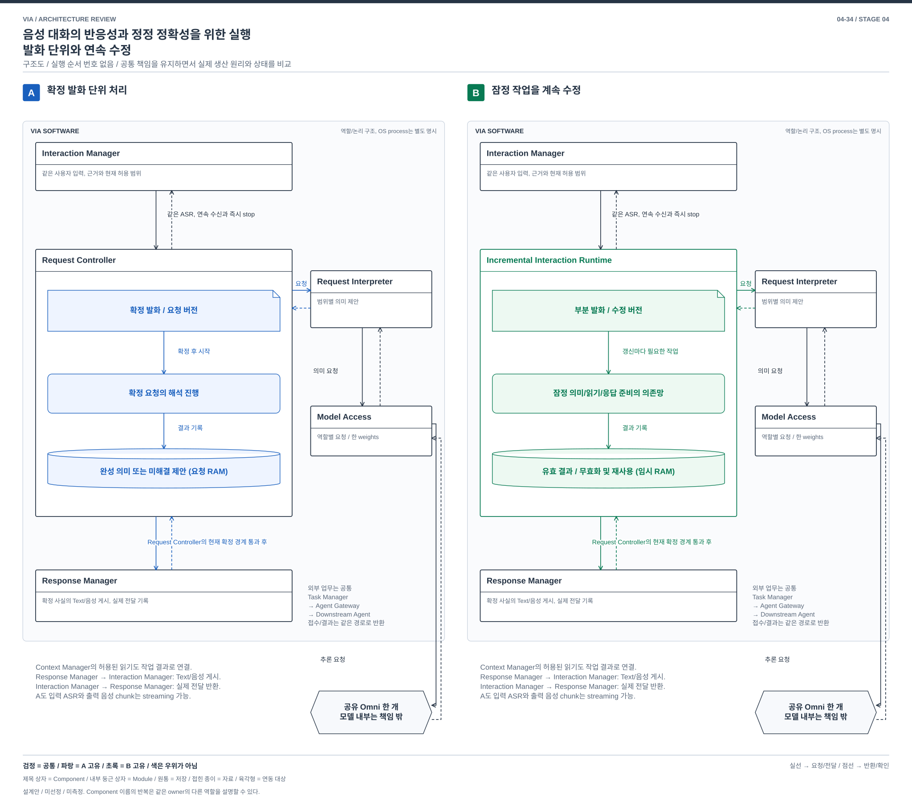
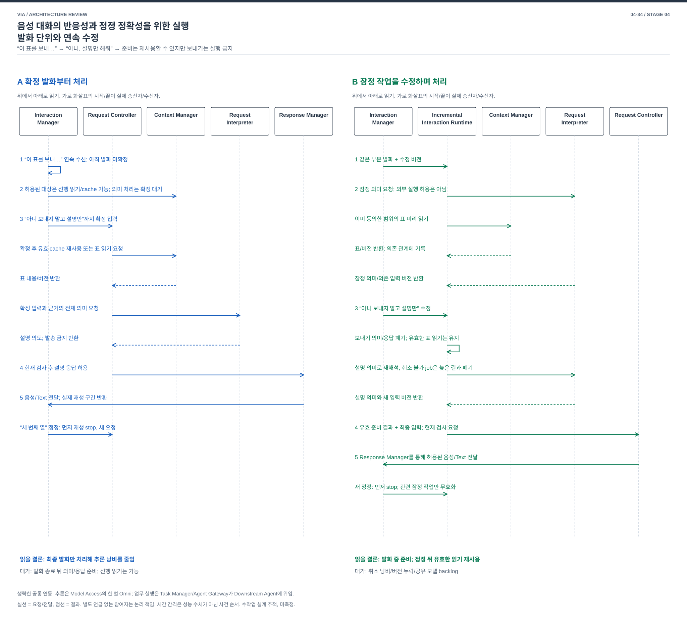

# 04-34. 음성 대화의 반응성과 정정 정확성을 위한 실행 — 발화 단위와 연속 수정

> 구조 재설계안 / 2026-10-03 / [가이드](./04-30-comparison-guide.md) / 이전: [업무 대화](./04-33-dialogue-coordination.md) / 다음: [상태 원본](./04-35-state-authority.md)

## 1. 왜 VIA에서 중요한가

사용자가 “이 표를 보내… 아니 보내지 말고 설명만 해줘”라고 고친다. VIA가 설명하는 도중 다시 “두 번째 열 말고 세 번째”라고 끼어든다. 늦게 반응하면 대화가 끊기고, 너무 일찍 의미를 확정하면 잘못된 업무를 시작하거나 틀린 내용을 들려준다. 계속 듣고 빠르게 고칠 수 있어야 하는 PC 음성 창구의 핵심 문제다.

UC-01/06/11/15의 연속 대화와 정정을 다룬다. **입력 버전**은 같은 발화가 새 전사/정정으로 바뀐 횟수, **실제 전달 구간**은 생성한 음성 전체가 아니라 사용자에게 실제 재생된 부분이다. 음성 출력 중단과 Agent 업무 취소는 다른 행동이다.

## 2. SW Architecture에서 무엇이 어려운가

ASR이 부분 Text를 내보내는 것만으로 전체 VIA가 연속 처리가 되지는 않는다. 부분 입력으로 시작한 의미 판단, 자료 읽기, 응답 준비가 뒤의 부정/정정으로 무효가 될 수 있다. 이미 사용자에게 들려준 말은 취소할 수 없다. 모든 것을 확정까지 기다리면 단순해지지만 그 대기 동안 가능한 준비를 활용하지 못한다.

**발화가 확정된 단위로 의미 처리와 응답을 시작할 것인가, 잠정 입력의 변화가 처리망을 계속 갱신하고 확정된 부분만 외부로 내보내게 할 것인가**가 질문이다. 이전의 원음/Text 및 음성 생성 방식을 묶은 비교는 폐기한다. 원음과 Text 중 어느 것을 모델에 줄지는 이 주제와 독립이며 양안에서 같은 설정을 사용할 수 있다.

## 3. 공통 입력과 두 구조

양안 모두 Interaction Manager가 계속 듣고, Speech Input Worker가 같은 Streaming ASR을 사용한다. 음성 끼어들기의 local stop은 모델 판단 없이 즉시 수행한다. 같은 Omni의 역할/Context를 분리하며, Text와 음성 출력의 사실/대상을 일치시키고 실제 전달을 기록한다. A도 ASR streaming과 확정 후 음성 chunk 재생을 지원한다.

### A. 확정된 발화를 요청 단위로 처리

Interaction Manager가 입력 종료/정정을 반영해 **확정 발화**를 Request Controller에 보낸다. Controller는 그 버전의 근거를 모아 Request Interpreter의 의미 제안을 받고 확정한다. Response Manager는 확정 사실에 맞는 응답을 만들고 준비된 문장부터 재생할 수 있다.

다음 정정이 오면 해당 요청/응답을 보류하고 새 발화의 의미를 해석한다. 현재 재생은 먼저 멈춘다. 입력 수신, Agent 진행, 다른 업무는 계속 움직이며 시스템 전체를 직렬화하지 않는다. 다만 한 발화 안의 잠정 의미를 여러 처리 단계가 지속 소비하는 정상 경로는 없다.

### B. 입력 변화에 따라 잠정 의미와 응답 준비를 갱신

새 **Incremental Interaction Runtime**이 입력 fragment, 의미 후보, 한정된 읽기 결과와 응답 조각 사이의 **의존 관계**를 관리한다. fragment는 시점/입력 버전을 가진 부분 발화다. Runtime은 쓸 수 있는 새 근거가 생기면 Request Interpreter에 잠정 의미를 요청하고, 결과가 의존하는 원문/자료 버전을 저장한다. Context Manager의 미리 읽기는 현재 허용된 범위에만 한정한다.

새 부정/정정이 오면 관련 의미와 응답 준비를 무효화하고 영향받은 작업을 재시작한다. 이미 무효화한 모델 결과는 반환돼도 채택하지 않는다. 단일 모델의 실행 예산을 지키기 위해 오래된 대기 작업을 합치거나 버리고, 실행 중 취소가 불가능하면 결과만 폐기한다. 이 시간/자원 손실도 비용이다.

Request Controller는 **확정 경계**를 소유한다. 이는 어떤 입력/조건까지 확인돼 외부 효과에 사용 가능한지를 나타내는 기록이다. 외부 변경 업무의 명령은 완성된 의도와 현재 권한을 확인한 뒤에만 나간다. 음성도 해당 부분의 의미/사실이 허용될 때 Response Manager가 게시한다. 잠정 전사나 모델 확률만으로 `보내기`를 실행하지 않는다.

B의 이익은 외부 업무를 위험하게 빨리 실행하는 것이 아니라 확정 이전의 허용된 준비와 수정 후 재사용이다. 발화 전체를 보아야 안전한 응답은 B도 기다린다. 이미 게시한 문장이 뒤의 새 지시로 바뀌면 그것을 기록에서 지우지 않고 정정 응답으로 연결한다.

그림은 확정 요청이 읽기/해석/응답 순서로 진행하는 A와, B의 의존 작업 배정자가 의미/읽기/응답 준비 결과를 따로 회수하고 정정 때 무효화하는 연결을 펼친다. 응답 준비 호출과 Request Controller의 게시 허용을 별도 경로로 표시한다.

[편집용 draw.io](./diagrams/choice34-structure.drawio). B의 임시 의존망은 04-35의 영구 사건 원본과 다르다. 같은 runtime 안에서 의미/자료/응답 작업이 겹칠 수 있으나 모델 weights는 하나다.

## 4. 같은 음성 정정의 흐름

[편집용 draw.io](./diagrams/choice34-event.drawio).

| 단계 | A | B |
| --- | --- | --- |
| 1 | Interaction Manager/Speech Input Worker가 “이 표를 보내…”의 원음/부분 전사를 수신하고 확정 대기 | 같은 입력을 Runtime에 버전 있는 fragment로 전달 |
| 2 | 수신을 지속. 발화 의미와 외부 변경은 미확정 | Runtime → Request Interpreter/Model Access: 잠정 의미 요청/반환. Context Manager에 이미 허용된 표 읽기 요청/반환. 외부 전송 없음 |
| 3 | “아니 보내지 말고 설명만”까지 반영한 발화를 Request Controller에 전달하고 의미 해석 | Runtime이 옛 `보내기` 의미/의존 응답 후보를 무효화. 여전히 유효한 표 읽기는 재사용하고 설명 의미로 갱신 |
| 4 | Request Controller가 최종 의미/권한 확인, Response Manager에 사실 전달 | 같은 최종 의미/권한 확인. Runtime의 유효 준비 결과만 Response Manager에 전달 |
| 5 | Response Manager → Interaction Manager: 설명 음성/Text. 실제 전달 반환. 새 “세 번째 열”에 즉시 stop 후 새 요청 처리 | 같은 stop/전달 기록. 새 fragment로 관련 의미/응답만 무효화/갱신, 오래된 chunk 재게시 금지 |

입력 의미를 원음으로 해석하든 Text로 해석하든 위 수명 차이는 남는다. B는 모델의 내부 decoding을 새로 학습하지 않는다. 주어진 runtime에서 가능한 짧은 재호출/취소/결과 폐기 계약으로 설계할 수 있지만 실제 동시성/지연은 확인해야 한다.

## 5. 어떤 대화에서 손익이 갈리는가

| 장면 | A | B |
| --- | --- | --- |
| 길게 말하지만 앞서 지정한 표는 변하지 않음 | 발화 확정 뒤 준비/해석 대기 | 허용된 읽기와 일부 의미 준비를 겹칠 기회 |
| 짧고 완전한 한 문장 | 단순 요청 처리로 충분 | 버전/의존망 유지비가 추가 이익 없이 발생 가능 |
| 여러 번 뒤집히는 자기 정정 | 최종 발화만 해석하여 낭비를 줄일 수 있음 | 잠정 작업 취소/재실행과 공유 모델 경합 증가 |
| 응답 도중 특정 항목만 정정 | 재생 중단 후 관련 요청 재해석 | 실제 전달/의미 fragment가 연결돼 유효 부분 재사용 가능, 연결 오류면 오래된 답 재생 위험 |

## 6. 예외와 지원 조건

| 사건 | A | B |
| --- | --- | --- |
| 늦은 전사 수정 | 새 입력 버전으로 요청 hold/재해석 | 의존 fragment와 의미/응답 작업을 전파 무효화 |
| 모델이 취소 불가 | 요청 결과를 폐기하고 새 요청 대기 | 같은 제한, 오래된 jobs의 자원 점유와 backlog를 비용에 포함 |
| source 변경/권한 철회 | 현재 의미와 게시/전송 검사 | 임시 읽기, 준비 응답과 model Context까지 dependency로 차단 |
| 입력 gap/불확실한 종료 | 확인/재입력, 외부 명령 보류 | 확정 경계를 진전시키지 않음. 미완료 prefix로 실행 금지 |
| 재시작 | 확정된 대화/Task/실제 전달로 재개 | 잠정 의존망은 폐기/재계산, 이미 확정한 명령/전달은 공통 내구 기록에서 복원 |

두 안 모두 S2S 직접 응답과 Core/Agent 결과 전달을 지원하려는 구조다. B의 모델이 실제 전달 구간과 의미 fragment를 충분히 대응시키지 못하면 항목/문장 단위로 보수적으로 확정하고 세밀한 후속 지칭은 질문한다. 해당 세밀 기능은 **미확인/부분 지원**이지 구현 완료가 아니다. helper를 몰래 추가하지 않는다.

## 7. 같은 13개 관점의 품질 손익

[공통 정의와 우선순위](./03-00-quality-scenarios.md#2-어떤-품질을-보고-있는가)를 따른다. 아래는 구조에서 예상하는 조건부 효과이며 측정값이 아니다. V-04/05는 VIA 귀속 시간이고 외부 Agent의 업무 실행 시간은 공통 외부 조건이다.

| 관점 | A의 이익과 비용 | B의 이익과 비용 |
| --- | --- | --- |
| V-01 정확성 | 확정 입력에서 의미 생성, 늦은 정정/재생 경합 처리 필요 | 변경 전파로 유효 근거만 재사용, dependency 누락 시 오래된 뜻/답 재사용 |
| V-02 적절성 | 짧고 완전한 요청에 단순 | 긴 대화의 수정 이어가기 기회, 잦은 재준비가 오히려 흐름 방해 가능 |
| V-03 완전성 | 연속 수신/중단/후속 요청 지원 | 같은 요구, 세밀한 부분 의미/실제 전달 대응은 runtime 미확인 |
| V-04 반응성 | 발화 확정 후 의미 처리 대기, 음성 streaming 가능 | 일부 준비 중첩 기회, 공유 모델 backlog/확정 대기로 상쇄 가능 |
| V-05 VIA 완료 시간 | 정정마다 필요한 요청 재처리 | 유효 부분 재사용과 취소 낭비 모두 발생, Agent 실행 시간은 동일 조건 |
| V-06 자원과 수용량 | 확정 요청/응답 queue와 단일 모델 | 임시 fragment/의존망/다수 job 비용, backpressure와 수용량 상한 필요 |
| V-07 결함과 복구 | 요청 버전 단위 실패/재시도 | 부분 실패/무효화 범위 구분, 공유 runtime 장애 영향 유지 |
| V-08 변경과 모듈성 | 단계별 확정 입력/출력 계약 | source/model/응답 모두 revision과 취소 의미를 공유해야 함 |
| V-09 분석과 시험 | 확정 요청을 재현해 검사 | 지연/순서 역전/취소 후 반환을 통제하고 dependency별 원인 추적 |
| V-10 기밀성 | 확정 경로의 자료/권한 검사 | 선행 읽기도 현재 동의 범위 준수, 임시 복제/KV 삭제 추가 |
| V-11 연동과 공존 | 연동: 확정 호출 중심 / 공존: 요청 burst | 연동: 부분 결과/취소/버전 대응 / 공존: 지속 재추론과 다른 앱 경합 |
| V-12 조작과 오류 방지 | 멈춤과 취소를 구별해 표시 | 잠정 처리를 완료처럼 표시하지 않음, 이미 들은 내용 정정은 명시 |
| V-13 설치 | 같은 Omni/ASR와 요청 pipeline | 같은 inventory, runtime/adapter의 revision 및 중단 계약 호환 필요 |

## 8. 작은 확장과 혼합 검토

**A에 streaming ASR/TTS를 붙이면?** 두 기능은 A에 이미 있다. 그것만으로 잠정 의미를 소비한 읽기/응답 준비의 의존성과 무효화가 생기지 않는다. A에 미리 읽기 하나를 붙이는 것은 작은 최적화일 수 있다. 그 정도로 충분하면 B 전체의 채택 이유가 없다.

B는 입력, 의미, Context 준비, 응답, 실제 전달이 서로의 **유효 버전과 확정 경계**를 소비한다. 모든 처리가 완성된 요청 하나를 입력으로 받는 가정을 유지한 adapter만으로 이 성질을 얻지 못한다. 작은 선행 읽기와 전 과정의 증분 실행을 구별한다.

| 비용 | A → B | B → A |
| --- | --- | --- |
| 기능 개발 | fragment/의존망, 무효화와 부분 재사용 | 확정 발화/응답 단위로 집계하는 실행 경로 |
| 상태 이행 | 진행 음성을 끝내고 전환하면 임시 상태 이행 거의 없음 | 동일, 기존 내구 Task/전달 기록 재사용 |
| 재설계 | 의미와 응답 작업의 입력을 완성 요청에서 수정 가능한 버전으로 변경. 취소/재사용/게시 경계를 처리망 전체에 적용 | 부분 작업을 확정 요청으로 모으고 소비자의 재사용/게시 조건 정리. B의 장기적 이익을 포기하는 만큼 역전환은 더 작을 수 있음 |

B에 확정까지 아무 작업도 시작하지 않는 설정을 두면 A와 비슷한 동작은 얻는다. 그러나 B의 처리망과 계약을 그대로 남긴 것이므로 A의 구현 단순성까지 자동으로 얻지는 않는다. 이미 완성된 B에서 성능 모드를 바꾸는 비용과, A에서 B의 처리망을 도입하는 비용을 혼동하지 않는다.

## 9. 판단

**실행 단위와 수정 전파를 바꾸는 구조 비교로 유지한다.** 원음/Text와 출력 방식을 묶어 차이를 키우던 이전 비교를 제거했다. A는 짧은 요청과 자원 제약에서, B는 긴 발화의 유효 준비와 부분 수정 재사용이 실제로 큰 비중을 차지할 때 선택 이유가 있다.

작은 prefetch만으로 유효한 시간 이익을 얻거나 B의 취소 낭비가 더 크면 A가 유리하다. B를 선택하려면 의미/자료/전달의 버전 연결이 실제 runtime에서 성립해야 한다. full-duplex라는 제품 이름만으로 그 계약을 제공한다고 가정하지 않는다. 구조 검토는 완료했으나 모델 지원과 시간 이익은 미검증이다.
