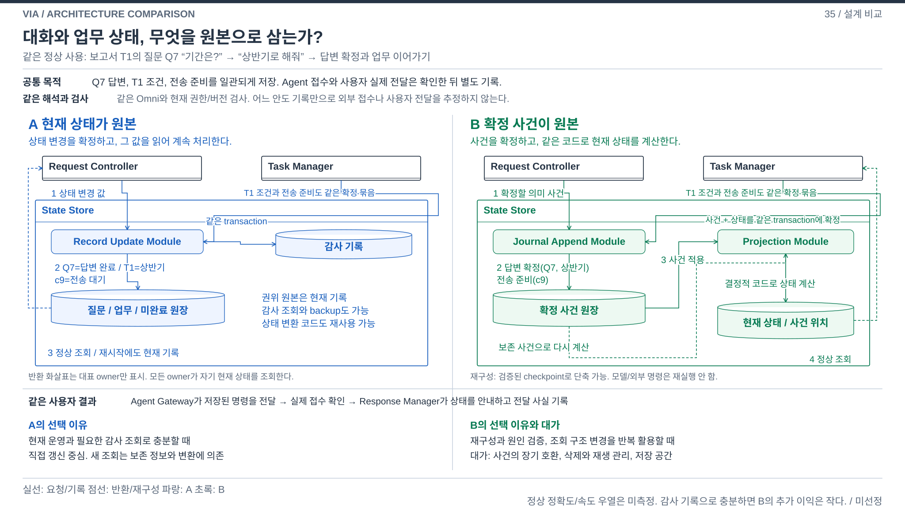
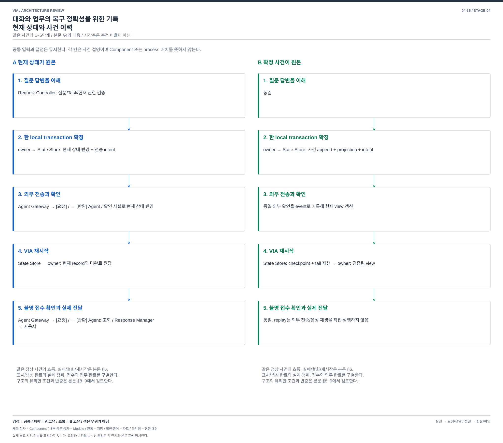

# 04-35. 대화와 업무의 복구 정확성을 위한 기록 — 현재 상태와 사건 이력

> 구조 재작성안 / 2026-10-03 / [가이드](./04-30-comparison-guide.md) / 이전: [음성 처리](./04-34-incremental-voice.md) / 다음: [권한 격리](./04-36-capability-isolation.md)

## 1. 왜 VIA에서 중요한가

사용자가 보고서 업무의 질문에 답했다. Agent는 그 답변을 받았을 수도 있고, VIA는 결과를 화면에 보였지만 음성을 끝내기 전에 종료됐을 수도 있다. 다시 켰을 때 답변을 다른 질문에 붙이거나 이미 수행한 변경을 반복하면 대화와 실제 업무가 어긋난다.

UC-06/10/13/15/18의 연속성을 지키는 문제다. VIA만의 고유 기능은 아니므로 기능 해석/지칭보다 우선순위는 낮다. 다만 오래 이어지는 Conversation과 여러 Task의 관계를 책임지는 VIA에서는 잘못된 복구가 실제 사용자 업무에 영향을 준다.

## 2. SW Architecture에서 무엇이 어려운가

프로그램 종료 직전의 값을 저장하는 것만으로 “답변 확정”, “전송 준비”, “Agent 접수”, “사용자에게 실제 전달”을 모두 알 수 없다. 외부 Agent의 접수는 local DB와 하나의 transaction으로 확정할 수도 없다. 더구나 새 버전에서 상태 형식이 바뀌면 과거 질문/전달 관계를 어떤 의미로 읽을지 정해야 한다.

**현재의 상태를 권위 있는 원본으로 갱신할 것인가, 확정된 사건을 원본으로 남기고 현재 상태를 그 사건으로 만들 것인가**가 결정이다. 사건 이력은 debug log가 아니라 `어떤 질문의 답을 어떤 버전에서 확정했다`와 같은 의미 있는 변경 기록이다. 같은 정상 기능을 유지하면서 쓰기, 상태 생성과 복구의 중심이 달라진다.

## 3. 공통 범위와 두 구조

Request Controller는 요청 의미, Task Manager는 업무/실행 연결, Agent Gateway는 전송, Response Manager는 전달 상태를 소유한다. State Store는 이 owner들이 만든 변경을 local transaction으로 원자 확정한다. **outbox**는 외부로 보낼 의도를 내구 저장한 원장이고, **inbox**는 받은 외부 사건의 중복을 구별하는 원장이다. 둘 다 양안에 있다.

### A. 현재 상태를 원본으로 저장

각 owner가 새 상태와 미완료 intent를 만든다. State Store는 질문, Task, 전송 및 전달 record를 함께 변경한다. 정상 읽기와 재시작은 이 현재 record를 믿는다. 감사 이력, backup과 미완료 전송 기록도 둘 수 있다. A를 이력이 전혀 없는 안으로 만들지 않는다.

상태 schema가 바뀌면 현재 값을 새 형식으로 변환한다. 과거 원인 조사에 필요한 정보가 이미 기록돼 있으면 활용할 수 있지만, 모든 과거 상태를 의미 전이로 재생할 것을 기본 계약으로 삼지 않는다.

### B. 확정 사건을 원본으로 저장하고 상태를 계산

각 owner가 현재 유효 조건을 확인하고 `질문 답변 확정`, `명령 전송 준비`, `외부 접수 확인`, `응답 실제 전달` 같은 **domain event**를 만든다. State Store의 **Journal Append Module**이 사건 묶음을 append하고 **Projection Module**이 같은 transaction에서 현재 조회 상태를 만든다.

projection은 사건으로 계산한 현재 값이다. 계산 함수인 **reducer**는 이미 확정된 사실만 적용하는 코드이며 모델을 다시 호출하지 않는다. **Checkpoint Module**은 검증한 중간 상태와 마지막 사건 위치를 저장하여 처음부터 모두 읽는 비용을 줄인다. checkpoint도 사건 의미와 삭제 정책에 맞는지 검증해야 한다.

정상 읽기는 journal 위치와 일치하는 projection을 사용한다. 재시작 시 유효 checkpoint와 이후 사건을 재생해 상태를 만들며, 새로운 조회 형태도 필요한 사실이 보존돼 있으면 같은 사건에서 구성할 수 있다. replay는 전송 intent의 상태를 복원할 뿐 외부 전송이나 음성 재생을 직접 실행하지 않는다.

그림은 A의 현재 원본과 미완료 원장을 직접 읽는 경로, B의 사건 원본에서 상태를 만드는 경로 및 재시작 때 checkpoint와 후속 사건을 같은 전이 함수로 재생하는 경로를 구분한다. 단순히 DB 이름을 바꾸는 선택이 아니다.

[편집용 draw.io](./diagrams/choice35-structure.drawio). B도 같은 local DB transaction을 사용할 수 있다. 분산 DB나 cloud 규모를 추가해 구조 차이를 만들지 않는다.

## 4. 같은 질문 답변과 재시작

[편집용 draw.io](./diagrams/choice35-event.drawio).

| 단계 | A | B |
| --- | --- | --- |
| 1 | Request Controller가 어떤 질문의 답인지 해석하고 현재 Task/권한 검증 | 동일 |
| 2 | owner → State Store: 질문 종료, 답변/명령 intent의 현재 변경 집합. 한 transaction 확정 후 결과 반환 | owner → State Store: 의미 사건, 예상 버전과 intent. journal append와 projection/위치/intent를 한 transaction 확정 후 반환 |
| 3 | Agent Gateway가 현재 권한을 검사해 전송. 접수 확인을 받으면 owner가 현재 상태 변경 | 같은 전송과 확인. owner는 접수 확인 사건을 기록해 상태 갱신 |
| 4 | VIA 재시작. State Store가 현재 record/미완료 원장을 읽어 owner에 반환 | State Store가 검증된 checkpoint+tail을 reducer로 재생하고 일관된 projection을 owner에 반환 |
| 5 | Agent Gateway가 접수 불명 command를 외부 조회. Response Manager가 확인된 상태만 게시, 실제 전달 반환 | 동일. 이력을 많이 저장했다고 사라진 외부 ACK를 추정하지 않음 |

## 5. 정상 사용과 운영에서 손익이 갈리는 경우

| 상황 | A | B |
| --- | --- | --- |
| 현재 Task 상태를 자주 갱신하고 빠르게 읽기 | 직접 상태 변경과 읽기로 단순 | 의미 사건과 view를 함께 관리하는 write 비용 |
| 질문/전달 관계 오류의 원인 조사 | 감사 기록이 충분한 범위에서 추적 | 기록된 의미 전이와 순서를 따라 원인 구분 가능 |
| 새 버전에서 상태 view 재구성 | 현재 schema 변환과 필요한 원장 참조 | 보존된 사건으로 새 view 생성 가능, 옛 사건 의미 호환 부담 |
| 개인 자료 삭제 | 현재/파생 사본 및 backup 정책 관리 | journal payload, checkpoint와 projection까지 삭제/무효화 설계 필요 |

## 6. 실패, 삭제와 지원 한계

| 사건 | A | B |
| --- | --- | --- |
| commit 전/후 crash | 원자 transaction의 결과와 미완료 intent로 구별 | 동일, journal/projection 위치를 함께 확정하지 못하면 실행 차단 |
| 접수 ACK 유실 | 외부 조회/idempotency capability에 따라 확인, 불명 유지 | 동일. replay가 외부 사실을 만들 수 없음 |
| 상태 schema 변경 | 현재 record migration | event reader/reducer와 checkpoint 호환 또는 명시 변환 필요 |
| 원문 삭제 | 현재 tombstone과 파생 자료 사용 차단/정리 | 민감 payload는 삭제 가능한 참조로 분리. 삭제 후 재생에 없는 원문을 요구하지 않게 event 의미 설계 |
| journal/current 손상 | backup/검증과 외부 조회, 복원 불가 범위 표시 | 권위 journal 손상은 projection만으로 과거 사건을 재창조하지 않음. 검증된 복원점 사용 |

두 안 모두 요구된 정상 복구를 지원하려 한다. B의 replay도 삭제된 내용, 기록하지 않은 원인, 외부에서만 발생한 사실을 복원하지 못한다. 복원 불가를 성공으로 세지 않는다.

## 7. 같은 13개 관점의 품질 손익

[공통 정의와 우선순위](./03-00-quality-scenarios.md#2-어떤-품질을-보고-있는가)를 따른다. 아래는 구조에서 예상하는 조건부 효과이며 측정값이 아니다. V-04/05는 VIA 귀속 시간이고 외부 Agent의 업무 실행 시간은 공통 외부 조건이다.

| 관점 | A의 이익과 비용 | B의 이익과 비용 |
| --- | --- | --- |
| V-01 정확성 | 현재 상태/관계의 원자 갱신, migration 오류 위험 | 사건과 view 일치 검사, 잘못된 event 의미/reducer는 오류를 반복 생산 |
| V-02 적절성 | 필요한 현재 복구가 충분하면 사용자 비용 작음 | 관계 재구성이 사용자 재설명을 줄일 수 있으나 replay 지연 가능 |
| V-03 완전성 | 같은 정상 기능과 복구 목표 | 같은 요구, 보존하지 않은/삭제된 사실 복원은 미지원 |
| V-04 반응성 | 직접 write/read 경로 | append+projection write 및 검증 비용 |
| V-05 VIA 완료 시간 | 일반 요청은 단순, migration/복구에 필요한 조회 | 정상 write 비용과 재구성 시간, Agent 시간 이익은 없음 |
| V-06 자원과 수용량 | 현재 상태/필요 원장/backup 크기 | journal/checkpoint/view 저장, replay CPU와 backlog 수용량 부담 |
| V-07 결함과 복구 | 현재 상태 복원 및 외부 재조정 | view 재구성 가능, 원본 journal 손상/reader 실패는 새 중요 장애 |
| V-08 변경과 모듈성 | 현재 schema와 migration 변경 | view 변경은 분리 가능, event 의미와 옛 reader 장기 호환 비용 |
| V-09 분석과 시험 | 감사 범위 내 원인 추적과 crash 시험 | 전이 재생 가능, 잘못된 순서/중복/삭제 이후 replay 시험 필요 |
| V-10 기밀성 | 현재/backup의 민감 자료 정리 | 사건/복제 view/checkpoint의 민감 payload 정리 경로 확대 |
| V-11 연동과 공존 | 연동: 같은 Agent 사실 계약 / 공존: 현재 IO | 연동: 외부 동일 / 공존: append와 replay IO/CPU 경합 |
| V-12 조작과 오류 방지 | 확인된 상태와 불명 상태 구별 | 동일. 재생된 상태를 새로 수행한 업무처럼 알리지 않음 |
| V-13 설치 | 현재 schema migration 및 복구 도구 | reader/reducer/checkpoint의 호환 배포와 제거 시 보존 정책 필요 |

## 8. 싼 추가와 전환의 판단

**A에 로그만 추가하면?** 변경된 row와 debug 문자열만으로 B의 의미 사건, 결정적 상태 생성과 옛 의미 호환이 생기지 않는다. 이미 완전한 사건과 replay를 갖춘 A라면 차이가 작아지는 것이 맞다. 그 경우를 일반 A의 기본값으로 숨기거나, 반대로 재사용할 이력을 무시하지 않는다.

| 비용 | A → B | B → A |
| --- | --- | --- |
| 기능 개발 | event/reducer/checkpoint와 삭제 연동 | 현재 상태 운영/검증 경로 |
| 상태 이행 | 현재 record를 시작 snapshot으로 가져올 수 있음. 과거 사건을 소급 발명하지 않음 | 검증된 최신 projection을 초기 current record로 사용 |
| 핵심 재설계 | owner의 쓰기 결과를 상태 값에서 의미 전이로 변경. 정상 읽기/복구/schema/삭제가 그 사건을 원본으로 소비 | reducer를 현재 갱신 함수로 재사용 가능. journal 의존 복구/검증을 해제하고 current record를 권위로 전환 |

역전환은 더 쉬울 수 있다. 진행 작업을 끝내도 앞으로의 쓰기/상태 생성 의미 변경은 남지만, 이력 재생 기능을 포기하는 비용을 대규모 개발로 과장하지 않는다. A와 완전한 event 원본을 병행하면 두 기록 불일치의 권위와 원자 갱신을 정해야 한다. 단순 감사 log만 필요한 제품에는 B가 과하다.

## 9. 판단

**다른 상태 운영 구조로 유지하되 기능 주제보다 후순위다.** 원본이 다르면 정상 writer, 상태 생성, 변경과 복구가 함께 바뀐다. A는 현재 원장/backup으로 충분한 경우, B는 확정 경위와 view 재구성이 중요한 경우에 선택 이유가 있다. 작은 감사 기록으로 필요한 복구/진단을 모두 충족하면 B의 이익은 약해진다.

[Microsoft Event Sourcing 설명](https://learn.microsoft.com/en-us/azure/architecture/patterns/event-sourcing)은 사건 원본과 상태 재구성의 원리 참고다. VIA에 특정 DB나 패턴을 선정한 근거가 아니다. 쓰기/삭제/재생 시간과 실제 복구율은 아직 측정하지 않았다.
