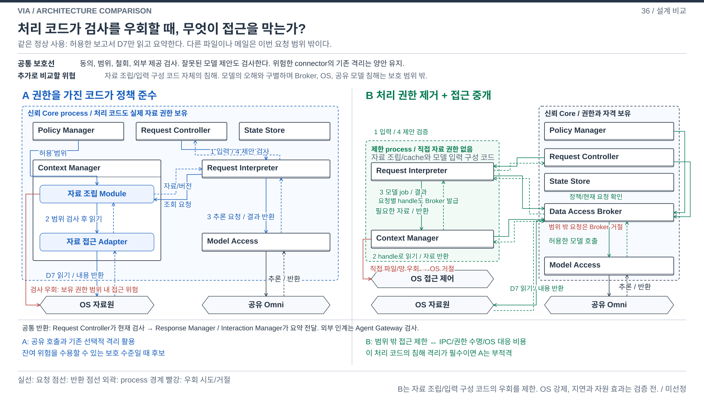
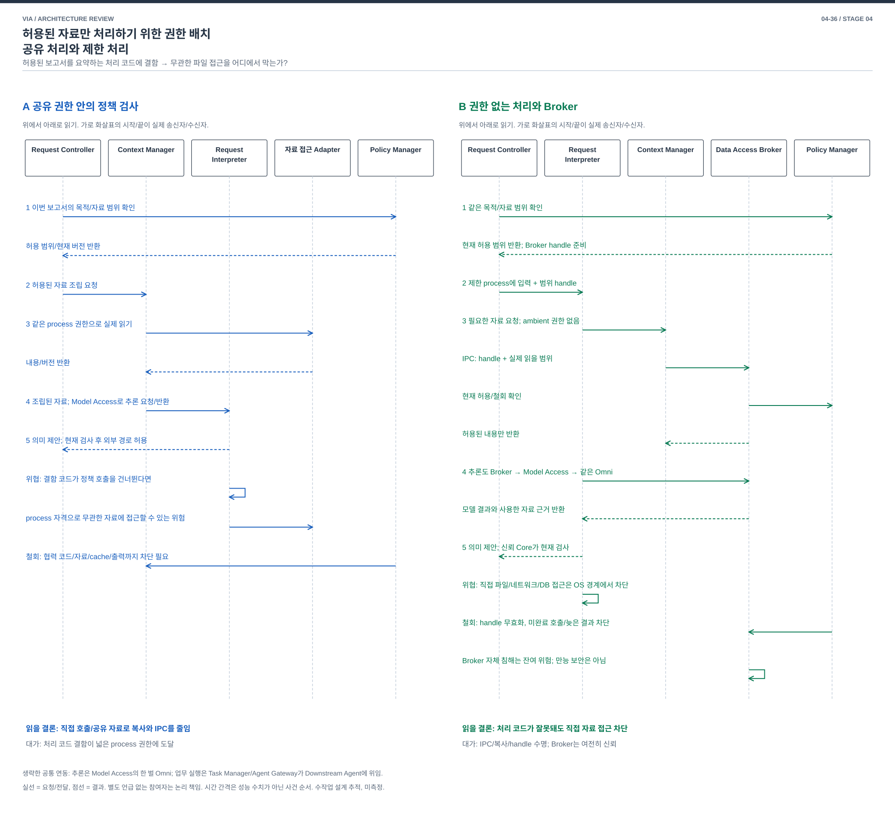

# 04-36. 허용된 자료만 처리하기 위한 권한 배치 — 공유 처리와 제한 처리

> 발표용 설명과 도식 보완 / 2026-10-04 / [가이드](./04-30-comparison-guide.md) / 이전: [상태 원본](./04-35-state-authority.md) / 다음: [여섯 문서 검토](./04-37-comparison-review.md)

**A는 권한을 가진 처리 코드가 정책을 지키는 구조이고, B는 처리 코드에서 권한을 제거한 뒤 중개자를 통해서만 자료를 받는 구조다.** B의 가치는 처리 코드에 결함이 생겼을 때 드러난다. 중개자 자체의 결함까지 해결하는 것은 아니다.

**메인 그림에서 볼 차이:** A의 process 보유 권한에 의한 직접 접근과 B의 제한 process→Broker 경유, OS 거절을 비교한다.

읽는 순서는 **사용자 상황 → 구조도 → 같은 사례의 흐름 → 품질 손익 → 가장 싼 전환 반론**이다. 그림 없이 읽을 때도 §3의 생산 책임과 §4의 사건 표로 같은 결론에 도달하도록 작성했다.

| 먼저 알아둘 말 | 쉬운 뜻 |
| --- | --- |
| Broker | 허용 범위를 확인하고 실제 자료 읽기와 모델 호출을 중개하는 신뢰 코드 |
| capability handle | 특정 요청과 자료 범위에만 사용할 수 있는 참조. 제한 process에 원래 자격을 주지 않기 위한 수단 |

## 1. 왜 VIA에서 중요한가

VIA는 화면, 메일, 문서와 업무 결과를 함께 다룬다. 회사 문서를 설명하는 코드가 잘못된 참조를 사용해 다른 메일을 읽거나 외부 Agent에 함께 전달하면, 사용자가 허용한 정보 범위를 벗어난다. UC-02/16/17/18의 자료 접근, 제공과 철회 기능을 지키는 문제다.

범용 Agent에도 필요한 주제라서 VIA 특화 기능보다 우선순위는 낮다. 하지만 PC의 여러 자료를 하나의 대화로 연결하는 VIA에서는 **자료를 처리하는 코드에 실제로 어떤 권한이 있는지**가 중요하다. 정상 코드의 검사와 잘못 동작한 코드의 접근 제한을 구별한다.

## 2. SW Architecture에서 무엇이 어려운가

같은 process의 코드가 원문과 credential, 저장소에 접근할 수 있다면 검사 함수를 정상 경로에 추가해도 다른 경로의 접근을 물리적으로 막지는 못한다. process를 나눠도 파일/네트워크 권한을 그대로 주면 비슷한 문제가 남는다. 권한을 없애면 필요한 자료를 전달하는 중개, 복사, 실패/취소와 수명 관리가 생긴다.

**자료 접근 권한을 가진 공유 처리 코드가 정책을 검사할 것인가, 실제 권한은 중개자에 두고 제한된 처리 코드에 필요한 자료만 줄 것인가**가 질문이다. scope 문자열이나 worker 하나 추가로 얻는 격리와 구별한다.

## 3. 공통 사실과 두 구조

Policy Manager가 현재 동의/목적/수신자 권한을 결정하고 Request Controller가 유효 요청을 확인한다. Agent Gateway는 승인된 업무 명령과 현재 권한에 맞는 자료만 외부 Agent에 제공한다. 단일 공유 Omni/Model Access, 독립 ASR, 즉시 음성 stop과 외부 업무 책임은 양안에 공통이다.

### A. 공유 Core의 자료 처리와 정책 검사

Context Manager의 자료 조립/cache와 Request Interpreter의 입력 구성은 신뢰하는 Core process에서 동작한다. Context Manager 내부의 자료 접근 Adapter가 source 읽기를 연결하며 읽기와 외부 제공 port에서 정책을 확인한다. 위험한 connector를 별도 worker에 두고 최소 범위로 읽을 수 있다. 필요한 native worker를 이미 격리한 참조 설계의 장점을 빼지 않는다.

공유 자료/객체를 직접 전달하기 쉬우며 serialization과 process 운영 비용을 줄일 수 있다. 대신 이 Core 안의 처리 코드가 정책 경로를 우회해 접근하는 결함까지 OS 경계로 가둔다고 주장하지 않는다.

### B. 권한을 가진 Broker와 제한 process의 분리

새 **Data Access Broker**가 현재 Policy Manager와 Request Controller를 확인해 자료를 읽고 **capability handle**을 발급한다. handle은 특정 요청/목적/수신자/자료 범위/유효 버전에 결합된 불투명 참조다. 제한 process가 숫자를 바꾸어 범위를 넓힐 수 없어야 한다.

Context Manager의 자료 조립/cache Module과 Request Interpreter는 요청 범위의 제한 process에서 실행한다. 전역 파일, credential, 임의 네트워크와 State Store 직접 접근 권한을 제거한다. **IPC**는 process 사이의 메시지 전달이며 이 안에서는 Broker가 허용한 port만 사용한다. Broker가 필요한 자료/모델 job을 검증해 중개한다. 단순 별도 process 실행만으로 이 조건이 충족되지는 않는다.

Policy Manager, 권위 State Store, Request Controller와 Broker는 신뢰 Core에 남는다. Model Access의 단일 inference service도 여전히 모든 허용 세션을 처리하는 신뢰 의존성이다. 제한 process마다 모델을 적재하지 않는다. Broker 또는 공유 모델 자체 침해를 이 격리로 방어한다고 주장하지 않는다.

그림은 A의 처리 코드와 자료/모델 접근이 같은 신뢰 Core에 있는 배치와 B의 실제 제한 process에서 Broker를 거쳐야 하는 배치를 구분한다. Process 경계를 그렸다는 사실만으로 OS 권한 제거가 구현됐다고 주장하지 않는다.

[편집용 draw.io](./diagrams/choice36-structure.drawio).

**구조도 읽기:** 네모 안은 Component/Module 이름, 원통은 상태 이름이다. 화살표에서 요청/반환 자료와 조건을 읽는다. 구조도의 번호는 해당 안의 처리 흐름이며, §4 사건도의 번호는 같은 사용자 사건 순서다. 같은 이름을 위아래 반복하면 동일 Component의 요청/반환 위치를 펼친 것이다. 양안의 공통 최종 검사, Agent 인계와 사용자 전달도 그림 아래에 표시했다.

이 문서의 점선 process 경계는 실제 OS 접근 제한을 의도한다. 04-33의 논리 actor 경계와 다르다.

### 3.1 같은 요구와 위협으로 두 안을 비교한다

A의 선택 이유를 만들기 위해 허용 범위/철회 요구를 낮추지 않는다. 양안 모두 같은 문서, 사용자 권한, 외부 제공 규칙을 따른다. 모델 출력은 신뢰된 실행 명령이 아니고 공통 Controller/정책 검사 대상이다. 기존의 격리된 외부 connector/Agent 경계도 양안에서 유지한다.

| 동일하게 가정한 상황 | A | B |
| --- | --- | --- |
| 모델이 무관한 메일 읽기를 제안 | 신뢰 Core가 범위 검사로 거절해야 함 | Broker/신뢰 Core가 같은 검사로 거절해야 함 |
| 처리 코드가 정상 API로 오래된 handle/범위를 요청 | 현재 검사로 거절해야 함 | 같은 거절 필요. 프로세스 분리만으로 해결되지 않음 |
| VIA 자료 조립 코드가 침해되어 검사를 우회 | 보유 process 권한 내 접근 가능성이 잔여 위험 | 제한 process의 직접 접근을 OS가 거절, Broker 요청은 범위 재검사 |
| Broker/OS 자체가 침해 | 신뢰 경계 밖, 별도 대응 필요 | 같은 잔여 위험. 모든 공격 차단 아님 |

**두 안이 모두 후보인 조건:** 필수선이 사용자 동의/범위/철회 및 외부 인계 검증이고, 추가로 VIA의 작은 신뢰 처리 코드까지 침해될 잔여 위험과 자원 비용을 비교하는 경우다. 양안에 같은 침해 가능성을 평가하며 A에는 그 잔여 위험을 숨기지 않는다. B는 그 위험을 줄이기 위해 코드/자료 수명을 분리한다.

**A를 탈락시켜야 하는 조건:** 자료 조립/해석 코드가 침해돼도 임의 파일/네트워크 접근이 불가능해야 한다는 격리가 필수 요구로 확정된 경우다. 이때 A/B를 동등하게 선택 가능한 안으로 표현하면 안 된다. 사용자 지시대로 부분 기능 대안을 탐색할 수 있어도 필수 보호 성질의 미충족을 높은 성능으로 상쇄하지 않는다.

현재 비교에서 제품의 침해 격리 수준을 새로 승인하지 않는다. 위 두 조건을 명시해 설계 심사의 선택 분기를 완성했다. 메인 그림은 A의 직접 권한 경로와 B의 Broker 경유/OS 거절을 모두 보여준다.

## 4. 같은 자료 이해와 인계

[편집용 draw.io](./diagrams/choice36-event.drawio).

| 단계 | A | B |
| --- | --- | --- |
| 1 | Request Controller가 Policy Manager에서 이번 목적/자료 범위 확인 | 같은 확인, Broker가 현재 요청/목적/범위에 결합한 handle 준비 |
| 2 | Context Manager에 허용 자료 조립 요청 | 제한 process에 입력과 범위 handle 전달 |
| 3 | Context Manager가 source adapter에 직접 읽기를 요청해 내용/버전 반환 | 제한 Context Manager가 IPC로 Broker에 읽기 요청. Broker가 현재 정책 확인 뒤 허용 내용만 반환 |
| 4 | Request Interpreter가 Model Access에 의미 요청하고 결과 수신 | Request Interpreter가 Broker에 모델 job 요청, Broker가 같은 Model Access의 요청/반환을 중개 |
| 5 | Request Controller가 제안/자료/권한 현재 검사 후 Task Manager/Agent Gateway로 인계 | 같은 현재 검사에서 Broker의 실제 발급 자료를 대조. 수신자별 자료도 Broker가 제공하며 제한 process의 직접 외부 송신은 불가 |

일반 읽기마다 새 사용자 승인을 요구하지 않는다. 이미 유효한 동의 범위는 재사용하며 실제 범위 확대가 필요한 때 공통 동의 절차를 따른다.

## 5. 어떤 위험과 비용을 교환하는가

| 상황 | A | B |
| --- | --- | --- |
| 신뢰 Core 처리 코드가 정상 동작 | 공통 정책 검사로 필요한 기능 수행 | 같은 결과에 IPC/handle 검사 추가 |
| 자료 조립 코드가 다른 파일을 직접 열려 함 | 같은 process의 실제 권한 범위에서는 우회 가능성 | OS와 Broker가 해당 접근을 거절해야 함. 이 속성이 구현 검증 대상 |
| 큰 화면/문서를 여러 번 전달 | 공유 객체/메모리 경로 활용 가능 | 복사 또는 안전한 공유 메모리 handle 수명/권한 관리 필요 |
| 제한 처리 crash | 해당 코드가 Core 안이면 더 넓은 영향 | 해당 처리의 재시도 가능. Broker/Core/model crash는 공통 영향 |

## 6. 철회, 실패와 지원 범위

| 사건 | A | B |
| --- | --- | --- |
| 문서 대상 정정 | 옛 제안/제공 무효화, 새 자료 준비 | 옛 handle/job 무효화, 새 범위 준비 |
| 동의 철회 | 신규 사용/제공 검사와 cache/KV 정리 | Broker 신규 사용 차단, pending job 무효화, process/cache/임시 파일 폐기. 이미 본 자료를 소급 제거했다고 하지 않음 |
| process 재사용 | 공유 Context 격리 규칙 | 이전 handle/자료/session 폐기 확인 후만 재사용. 유한 process pool과 대기 예산 필요 |
| Broker 장애 | 해당 구성 없음. 기존 Core/source 장애 처리 | 자료 제공 중단, 우회 직접 접근 금지. 입력/음성 stop은 유지 |
| 재시작 | 현재 권한/삭제 적용 후 owner 상태 복원 | 새 Broker 세대/handle 발급, 옛 OS handle과 raw cache를 무조건 복원하지 않음 |

정상 기능은 같은 요구를 지원하려 한다. 필요한 source 연동이 전역 권한 없이는 동작하지 않으면 B에서는 미지원/제한 연동으로 표시한다. 악성 문장을 모델이 명령으로 오해하는 문제, OS/Broker/정책/공유 모델 자체 침해는 이 격리만으로 해결되지 않는다.

## 7. 같은 13개 관점의 품질 손익

[공통 정의와 우선순위](./03-00-quality-scenarios.md#2-어떤-품질을-보고-있는가)를 따른다. 아래는 구조에서 예상하는 조건부 효과이며 측정값이 아니다. V-04/05는 VIA 귀속 시간이고 외부 Agent의 업무 실행 시간은 공통 외부 조건이다.

| 관점 | A의 이익과 비용 | B의 이익과 비용 |
| --- | --- | --- |
| V-01 정확성 | 공통 의미/현재 사실 검사, 정책 우회 결함 가능 | 허용 근거 확인 강화 가능, 모델 의미 정확성이 자동 향상되지는 않음 |
| V-02 적절성 | 자료 경로가 단순해 사용자 대기 감소 가능 | 추가 검사/미지원 연동으로 대기나 수동 작업 증가 가능 |
| V-03 완전성 | 현재 연동 범위 지원 | sandbox 안에서 불가능한 source integration은 부분/미지원 |
| V-04 반응성 | 공유 호출과 자료 접근 | IPC, handle 검증과 준비 process 대기 |
| V-05 VIA 완료 시간 | 일반 인계 경로가 짧음 | 읽기/모델/외부 제공 중개 단계의 누적 비용 |
| V-06 자원과 수용량 | 공유 cache와 address space 활용 | process/복사/handle 자원, 유한 pool의 대기 및 수용량 |
| V-07 결함과 복구 | 이미 분리된 connector 장애는 제한, Core 처리 장애 공유 | 이동한 자료 코드의 crash 제한, Broker는 새 중요 의존성 |
| V-08 변경과 모듈성 | source/자료 구조 변경을 공유 객체에 반영 | IPC/handle/sandbox 계약과 source adapter를 함께 변경 |
| V-09 분석과 시험 | 정책 port 경로와 오류 시험 | 실제 우회 접근, 권한 철회 경합과 handle 재사용을 공격적으로 시험 |
| V-10 기밀성 | 정상 코드의 검사에 의존 | 처리 코드의 실제 범위 밖 접근 제한, 신뢰 Core/model 위험은 남음 |
| V-11 연동과 공존 | 연동: 넓은 API 접근 / 공존: 공유 process | 연동: sandbox에서 가능한 API 제한 / 공존: 복사/추가 process 경합 |
| V-12 조작과 오류 방지 | 일반 동의/대상 안내 | 동일. Broker 상세를 사용자에게 관리시키지 않음 |
| V-13 설치 | Core와 기존 worker 배포 | OS별 sandbox/IPC 권한과 제한 process 배포/제거 검증 추가 |

## 8. 싼 전환과 혼합 검토

**기존 worker에 scope tag를 붙이면?** source adapter의 범위 검사는 개선할 수 있다. 그러나 Core의 자료 조립과 입력 구성 코드가 여전히 raw/credential/전역 저장 접근을 가지면 B가 제한하려는 우회는 남는다. 별도 process에도 그 권한을 그대로 주면 보호 성질은 생기지 않는다.

| 비용 | A → B | B → A |
| --- | --- | --- |
| 기능 개발 | Broker/IPC/handle과 OS 강제 정책 | in-process adapter 및 공유 cache 연동 |
| 상태 이행 | 진행 작업 종료 후 새 process/handle로 시작 가능 | 검증된 현재 owner state 재사용 |
| 재설계 | raw 직접 참조와 열린 권한을 제거. source/모델/인계/삭제가 중개된 자료 수명을 소비하도록 변경 | 제한 자료 수명과 비동기 반환을 공유 실행에 연결. 기존 Broker를 유지하면 더 싸게 전환 가능 |

역방향에서 sandbox만 풀어 정상 기능을 유지하는 것은 쉬울 수 있다. 대신 격리 성질을 잃는다. 이 방향을 어렵다고 부풀리지 않는다. 반대 방향의 실질적 권한 제거와 자료 전달 재설계가 이 선택의 주요 비용이다. 일부 처리만 격리하는 혼합은 합리적이며 보호하는 코드 범위와 남는 신뢰 영역을 명시해야 한다.

## 9. 판단

**권한 및 실행 경계가 다른 구조 비교로 유지하되 조건부 후순위다.** A는 신뢰하는 처리 코드와 기존 경계로 요구를 충족하고 시간/메모리 비용을 줄일 때, B는 추가로 격리할 코드의 오류/우회 제한이 그 비용을 감수할 가치가 있을 때 유력하다. 이미 필요한 코드가 모두 격리돼 있거나 Broker로 위험을 그대로 옮기기만 하면 B의 추가 가치는 약하다.

[Chromium sandbox 설계](https://chromium.googlesource.com/chromium/src/+/main/docs/design/sandbox.md)는 권한 있는 broker와 제한 process의 원리 참고다. 동일 보장이나 구현을 VIA에 이전하지 않는다. 목표 PC OS에서 실제 파일/네트워크/IPC 권한을 강제할 수 있는지, copy/latency와 호환성은 검증 전이다.
