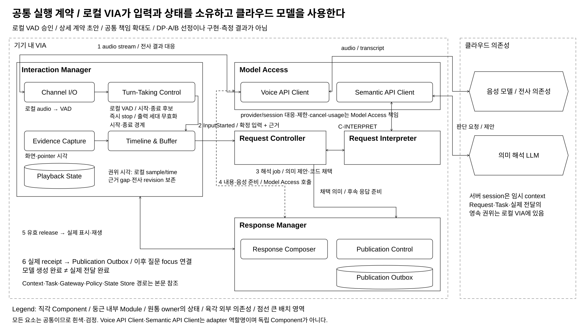

# 네 구조 비교의 공통 실행 계약과 모델 호출 지도

> 상태: **COMMON_EXECUTION_CONTRACT / 승인된 전제와 상세 계약 초안** / 2026-10-10
> 04-40은 새 Decision Point가 아니다. 41 → 44 → 45 → 42를 하나의 VIA 프로그램으로 설명하기 위한 공통 문서다. A/B 선택, 구현 및 품질 측정은 하지 않았다.

## 0. 이번에 합의한 것과 문서의 적용 범위

사용자는 VIA가 기기 안에서 실행되며 클라우드 음성 모델과 의미 해석 LLM을 활용하는 구조를 승인했다. **로컬 VAD는 Interaction Manager의 Turn-Taking Control에 둔다.** 음성 입력과 화면·포인터 근거를 계속 확보하고, 확정된 사용자 입력은 VIA의 요청 처리로 연결한다. 음성 모델의 자율 응답은 이번 네 비교의 설명 범위에서 제외한다. 이 제외를 기존 전체 Use Case 삭제로 해석하지 않는다.

이 문서는 위 전제를 지금 기록한다. Component 책임, 이벤트 연결, 모델 호출 위치, 비용 집계와 미결 통합 문제를 구체화한 아래 계약은 검토 가능한 설계 초안이다. 필드 이름, API transport, 모델 버전과 수치 설정까지 모두 사용자 승인을 받은 것으로 표시하지 않는다.

기존 [참조 Architecture](../target-architecture/architecture.md), [공유 Omni 실행](../target-architecture/shared-omni-runtime.md)과 일부 비교안은 하나의 기기 내 Omni와 별도 Streaming ASR을 전제한다. **그 문서들을 이번 작업에서 일괄 개정하지 않는다.** 새 모델 배치 전제로 네 비교를 다시 읽을 때 이 문서를 함께 읽으며, 기존 참조 설계는 당시 검토된 설계로 보존한다. 전체 동기화는 §10의 후속 작업이다. 기존 QA 정의·ADR·결과를 새 클라우드 구성의 평가 결과로 바꾸지 않는다.

| 항목 | 이번 공통 전제 | 아직 선택하지 않은 것 |
| --- | --- | --- |
| 프로그램과 권위 상태 | VIA는 로컬 프로그램. Request·Task·명령·실제 전달과 허용 근거의 권위는 로컬 owner에 있음 | 42 A/B의 실행·저장소 경계 |
| 모델 배치 | 음성 역할과 의미 LLM 역할은 클라우드 의존성 | 공급자·checkpoint, 연결 공유/분리와 동시 호출 상한 |
| 음성 차례 | Turn-Taking Control의 로컬 VAD가 시작·종료 후보를 제공. 종료 확정과 전사 완료를 구별 | VAD 구현, 침묵 임계값, echo 처리, pre-roll·buffer 한도 |
| 현재 요청 | 확정 입력을 VIA Request Controller에 전달. 의미 제안과 코드의 채택을 구별 | 41 A/B. 41A는 설명용 후보이며 최종 선택이 아님 |
| 음성 모델의 직접 답변 | 이번 비교는 VIA가 준비한 응답의 음성 출력 경로를 설명 | 직접 답변의 허용·중복 방지 정책은 별도 동기화 대상 |
| Decision model/API | 선택 가능한 구현 reference. 공통 필수 모델이나 별도 DP가 아님 | 특정 API의 채택과 호출 위치 |
| 품질·비용 | 정확성, 응답성, 변경 용이성 등 기존 검토를 유지하고 **모델 호출 비용**을 명시 | 비용의 QA 등록·우선순위·목표값·측정 freeze |

여기서 모델을 “stateless”로 쓴다는 것은 **VIA의 영속 업무 상태를 모델 서비스에 맡기지 않는다는 뜻**이다. Realtime API 연결에는 임시 session·대화 context·audio buffer가 존재한다. 연결을 잃어도 로컬 원본에서 허용된 context와 작업을 복원해야 하며, 서버 대화 이력이 유일한 원본이면 이 계약을 만족하지 않는다. 공급자의 저장·보존 정책까지 stateless라는 말로 단정하지 않는다. OpenAI도 Realtime Session을 stateful한 연결로 설명한다. [Realtime conversations](https://developers.openai.com/api/docs/guides/realtime-conversations)

## 1. Component와 Module의 책임

Component는 책임과 계약의 경계다. Module은 그 Component 내부에서 수행하는 세부 기능이다. 논리적 상태는 owner 안에 표시하되 State Store를 사용하는 물리 저장 위치와 구별한다. 실행 thread pool·라이브러리·provider SDK를 새로운 업무 Component로 그리지 않는다.

### 1.1 Interaction Manager: 입력 근거와 실제 장치 출력

| 내부 Module/상태 | 수행하는 일 | 다른 owner에 넘기는 것 |
| --- | --- | --- |
| **Channel I/O** | 마이크 capture, audio chunk와 sample/time 부여, text 입력, 화면 표시·스피커 재생·즉시 stop | audio stream → Model Access. 실제 표시/재생/중단 receipt → Response Manager |
| **Turn-Taking Control** | **로컬 VAD**, 발화 시작·종료 후보·재개와 차례 상태, 출력 세대 무효화와 로컬 중단 | InputStarted와 발화 경계 → Request Controller 및 Timeline & Buffer. 출력 가능 상태 → Response Manager |
| **Evidence Capture** | 허용된 OS 화면·window·focus·pointer·click·selection 관측과 원래 시각 기록 | 관측 참조·revision·gap → Timeline & Buffer |
| **Timeline & Buffer** | 음성 구간, 전사 revision, 관측 시각의 연결·한시 보존; provider item과 로컬 input의 대응 | Input + Evidence Record → Request Controller. 필요 시 근거 보관/조회 계약으로 연결 |
| **Playback State** | 현재 장치 재생 generation, 실제 전달 범위와 receipt 재전달 buffer | 실제 전달 사실 → Response Manager. publication의 영속 원장이 아님 |

VAD는 Turn-Taking Control 내부 기능/의존성이다. 음성 인식 모델이나 의미 해석 LLM이 아니며, 선택한 VAD 라이브러리·helper의 CPU·메모리와 오류 비용은 구현 후보에서 명시한다. Turn-Taking Control이 요청의 뜻을 확정하거나 Task를 취소하지 않는다. 로컬 stop는 원격 모델 cancel이나 외부 Agent cancel 확인을 기다리지 않는다.

음성 모델 호출을 Interaction Manager가 **사용**하되, provider session·protocol·audio 형식 변환은 Model Access가 책임진다. 마이크를 읽는 코드에 공급자 이벤트와 업무 판단을 모두 넣지 않는다. Model Access client는 실제 배치에 따라 입력 경로 가까이에 둘 수 있으며, 이 논리적 구분이 추가 네트워크 서버를 뜻하지 않는다.

### 1.2 나머지 Component와의 경계

| Component | 소유 책임 | 모델과 코드의 경계 |
| --- | --- | --- |
| **Request Controller** | 입력 등록/revision, Conversation·Request·질문 연결과 채택, admission/hold 및 후속 처리 | 코드가 최신성·정책·채택을 확인. 44의 중앙 Dispatcher 또는 단계별 실행 책임이 들어감 |
| **Request Interpreter** | 현재 요청의 의미 제안. A 모델 주도 해석 / B 틀·부분 의미와 코드 전체 결합 | 41 재구체화의 공통 owner. B 요청 구조화기·Request Resolution Engine은 내부 Module. 공통 읽기 도구 실행기·의미 제안 검증기를 사용하며 채택·전송 권한은 갖지 않음 |
| **Context Manager** | 목적별 허용 근거 공급과 파생 context 수명 | 45A Context Composer / 45B Memory Publisher·Evidence Reader. 의미가 필요한 가공에 한해 모델 호출 가능 |
| **Task Manager** | Task·Execution·명령 및 외부 업무 사실의 로컬 권위 | 인증된 구조적 Agent 알림은 ID/revision으로 코드 처리. 자유문 의미 판단이 필요하면 명시적 별도 처리 |
| **Agent Gateway** | Downstream Agent protocol, 명령 전송/receipt·event 대응·중복 방지 | 도메인 실행은 외부 Agent. VIA LLM이 전송 receipt를 추측하지 않음 |
| **Response Manager** | Response Composer의 응답 내용 준비, Publication Control의 게시 조건, Publication Outbox의 영속 전달 기록 | 필요 시 의미 LLM으로 내용 준비, Model Access로 음성 생성. 준비·생성·실제 전달을 구별 |
| **Policy Manager** | 자료 사용·동작 권한과 철회 규칙 | 확정 권한은 코드/정책 원본. 모델의 “가능하다”는 제안으로 허용하지 않음 |
| **State Store** | owner가 검증한 변경의 저장·transaction·복원 | 의미 판단 없음. 논리적 owner와 물리 저장소 구별 |
| **Model Access** | 클라우드 voice/semantic client·adapter, session/call correlation, 제한·timeout·cancel·usage | 모델 실행 위치는 클라우드. 로컬 한 벌 가중치·GPU/KV scheduler를 이번 전제로 가져오지 않음 |

**Voice Runtime은 추가 Component가 아니다.** 필요하면 Interaction Manager의 음성 입출력·중단 Module과 Model Access client가 실행되는 영역을 설명하는 배치 주석으로만 쓴다. thread pool과 비동기 실행 라이브러리도 실행 기반이다. 42의 서비스 수명을 결정하기 전에 별도 Voice process를 이 문서에서 확정하지 않는다.

### 1.3 대안별 추가 Component와 소속의 검토 기준

위 표는 참조 구조에서 가져온 공통 10개 Component의 책임을 정리한 것이다. 대안이 실제 계약/상태 권위를 추가하면 그 차이를 별도로 표시할 수 있다. 모든 대안의 Component 개수를 10개로 강제하지 않는다.

**2026-10-09의 41 재구체화에서 Request Resolution Engine을 Request Interpreter 내부 Module로 정리했다.** 이전 독립 Component를 정당화할 별도 수명·권한·영속 원본 근거가 부족했고, 코드가 조회 진행과 전체 결합을 소유하는 기제는 내부 Module로 유지된다. B 요청 구조화기는 초기/부분 의미를 생산하고 Engine은 미해결 처리/결합을 수행한다. 별도 미해결 항목 처리기·관계 결합기 박스를 추가하지 않는다.

잠정 A/B 해석 상태는 Request Interpreter, 채택 의미/질문과 필요한 artifact는 Request Controller 원본으로 통일한다. Engine의 별도 영속 상태·second commit을 기다리지 않는다. 이는 편입에 따른 호출·owner·저장 계약의 변경을 기록한 **검토용 설계안**이며 A/B 최종 선택이나 참조 Architecture 전체 개정이 아니다. 이름/Module 목록과 상세 port는 [41 §3](./04-41-request-resolution-control.md#3-공통-구성과-두-실행-구조)을 따른다.

## 2. 발화에서 VIA 처리까지의 공통 흐름

[편집 원본](./diagrams/common40-execution.drawio). 이 그림은 공통 책임의 확대도이며 전체 Component/배치도나 A/B 선택 그림이 아니다. 생략한 Task·Policy·저장 경로는 §1과 §6을 따른다.

1. **계속 capture한다.** Channel I/O는 마이크 sample과 로컬 monotonic 시각을 기록한다. Model Access를 통한 audio 전달과 로컬 근거 수집은 요청 이해/응답 준비의 완료를 기다리지 않는다. 전송 구간과 실제 로컬 sample 구간의 대응을 유지한다.
2. **로컬 VAD가 시작을 알린다.** Turn-Taking Control은 새 입력의 시작 경계를 만들고 Timeline & Buffer에 관련 관측과 pre-roll의 보존을 요청한다. 현재 출력은 즉시 멈추고 출력 세대를 무효화한다. Request Controller에는 InputStarted를 보내 관련 미전송 요청/응답을 hold하도록 연결한다. 이것은 의미 해석이나 외부 업무 취소 완료가 아니다.
3. **말하는 중에는 근거를 계속 보존한다.** 전사 partial과 관측을 revision으로 묶는다. 서버 응답 수신 시각을 발화/화면 시각으로 쓰지 않는다. 조용해졌어도 END_CANDIDATE일 수 있으며 다시 말하면 provisional Turn을 연장한다.
4. **발화 구간을 닫고 전사 결과를 대응시킨다.** 로컬 종료 확정에 따라 해당 audio 구간을 provider에 commit한다. 전사 완료/실패를 별도로 받으며 sample 범위·provider item ID를 대응시킨다. 아직 끝나지 않은 전사를 final로 간주하지 않는다.
5. **입력과 근거를 VIA에 전달한다.** final 전사와 producer watermark 또는 명시적 gap이 확보되면 Input + Evidence Record를 전달하고 Request Controller가 확정 input revision을 채택한다. onset 때의 임시 등록과 같은 입력 ID를 사용한다. 근거 부족을 무한 대기로 숨기지 않으며 필요한 지칭은 확인 질문으로 연결한다.
6. **VIA가 현재 요청을 처리한다.** Request Interpreter가 허용 근거와 Task 상태를 읽어 의미를 제안하고 Request Controller가 채택한다. 직접 답변 또는 Task Manager·Agent Gateway를 통한 위임으로 이어간다. 이 동안 다음 발화를 받을 수 있다.
7. **VIA가 응답을 준비하고 실제 전달한다.** Response Manager는 내용·source revision과 게시 조건을 관리한다. 필요 시 음성을 생성하고 Interaction Manager에 유효 release를 전달한다. 모델 생성 완료와 실제 재생 완료를 별도로 기록한다.

VAD는 발화 전체의 경계를 정한다. “이 표”를 말한 **단어 구간**과 당시 화면을 맞추려면 전사 span의 시각/정렬 근거가 추가로 필요하다. 사용 API가 그 근거를 제공하지 않으면 전사 완료 이벤트만으로 단어 시각을 만들지 않는다. 후보 범위·시각 오차·gap을 기록하고, 모호하면 확인한다. word alignment helper를 추가한다면 모델/자원/호출 비용과 적용 조건도 추가한다.

capture와 원격 모델 호출은 제한된 buffer·queue와 비동기 실행으로 분리한다. 무제한 backlog, 사건별 thread 생성, 의미 LLM 전체 호출 동안의 마이크 정지를 전제로 삼지 않는다. 한도·overflow·재연결 수치는 미정이며, 네트워크 단절 시 유한 보존 후 유실을 표시한다.

## 3. gpt-realtime을 사용하는 구체적 연동 예

아래는 **WebSocket transport의 공식 API를 이용하는 설명 예**다. provider-neutral 내부 계약과 공급자 API 이름을 구별하며, 실행 코드나 검증된 설정은 아니다. WebRTC의 media·playback 제어를 같은 메시지 순서로 단정하지 않는다.

### 3.1 로컬 발화 경계와 입력 commit

OpenAI의 server_vad는 서버에서 시작/종료를 탐지한다. 이번 VIA는 로컬 경계를 사용하므로 `session.audio.input.turn_detection: null`을 설정한다. 입력 전사를 받도록 transcription을 별도 설정해야 한다. [공식 VAD 문서](https://developers.openai.com/api/docs/guides/realtime-vad), [Realtime client events](https://developers.openai.com/api/reference/resources/realtime/client-events)

| VIA 내부 사실/동작 | provider 연동 예 | 해석 |
| --- | --- | --- |
| AudioChunk | `input_audio_buffer.append` | 로컬 sample/time은 별도 보존 |
| InputStarted / END_CANDIDATE | 로컬 VAD가 생산 | 서버의 `speech_started/stopped`를 기다리지 않음 |
| 종료 구간 확정 | `input_audio_buffer.commit` → `input_audio_buffer.committed` | commit은 전사 완료나 VIA 업무 완료가 아님 |
| 전사 revision / final / 실패 | `conversation.item.input_audio_transcription.delta / completed / failed` | provider item ID로 로컬 입력 대응 |

입력 commit마다 `response.create`를 보내 음성 모델의 답변을 만들 필요는 없다. transcription은 audio response 생성과 구별한다. 입력 전사는 음성 모델의 native 이해와도 동일한 결과가 아니다. 모델·transcriber 의존성과 별도 청구 항목을 inventory에 명시한다. [Realtime conversations](https://developers.openai.com/api/docs/guides/realtime-conversations), [Realtime client events](https://developers.openai.com/api/reference/resources/realtime/client-events)

### 3.2 VIA가 준비한 응답의 음성 생성과 중단

Response Manager는 source와 현재성에 맞는 **짧은 발화 내용**을 먼저 준비한다. Model Access는 명시적 `response.create`의 input/instructions로 이를 전달한다. 과거 audio 대화가 내용을 바꾸지 않도록 필요한 context만 주는 `conversation: "none"` 방식도 후보이며, 별도 입력/출력 session을 사용할지와 함께 후속 결정한다. 출력 형식은 `output_modalities: ["audio"]`로 지정할 수 있다. [Realtime client events](https://developers.openai.com/api/reference/resources/realtime/client-events)

이 API는 생성형 음성 응답이다. “이 문장을 읽어라”는 지시가 **정확한 원문 낭독을 보증하지는 않는다.** critical ID·금액·상태·실패 의미의 보존 조건과 실패 시 text-only/재생 보류 경로를 설계해야 한다. 검증 후 재생과 streaming 중 검사 중 어떤 방식을 사용할지는 미정이며, 전자는 대기 시간, 후자는 잘못된 첫 음절을 되돌릴 수 없는 비용이 있다. verbatim 출력이 필수이면 별도 TTS 의존성도 비교 후보이지 이미 선택한 구성은 아니다.

Model Access는 audio chunk·생성 전사·terminal status를 publication/job/output generation에 대응시켜 반환한다. Interaction Manager는 허용된 release와 현재 출력 세대만 재생한다. `response.done`을 사용자가 들은 양으로 기록하지 않는다. 사용자 발화가 시작되면 로컬 stop부터 수행하고, 원격 `response.cancel`을 요청한다. 기본 서버 대화에 존재하는 assistant audio item은 실제 재생 길이를 기준으로 `conversation.item.truncate`를 적용할 수 있다. out-of-band 응답에는 존재하지 않는 item을 무조건 truncate하지 않는다. 실제 전달 원본은 어느 경우에도 로컬 receipt다. [Realtime conversations](https://developers.openai.com/api/docs/guides/realtime-conversations), [Realtime client events](https://developers.openai.com/api/reference/resources/realtime/client-events)

### 3.3 Qwen과 기존 Alibaba 자료의 위치

`Qwen3-Omni-30B-A3B-Instruct`는 음성 입력과 text/audio 출력이 가능한 모델 reference다. checkpoint만으로 Realtime session·VAD·commit·cancel API가 제공되는 것은 아니다. 클라우드 서비스 adapter의 기능과 checkpoint의 기능을 구별한다. [Qwen 공식 모델 카드](https://huggingface.co/Qwen/Qwen3-Omni-30B-A3B-Instruct), [Alibaba Model Studio Realtime](https://www.alibabacloud.com/help/en/model-studio/realtime)

기존 [Alibaba smoke script](../../../../scripts/architecture/smoke_alibaba_s2s.py)와 [S2S evidence](../../08-quality-attributes/evidence/qwen3-omni-s2s-latency-evidence.md)는 연동 reference다. script의 hosted model 이름·전사 의존성·sample rate·이벤트 표기는 adapter별로 확인하며 OpenAI GA와 동일하다고 가정하지 않는다. 기존 smoke 자료는 새 구성의 정확성·응답성·비용 비교 결과가 아니다. 이번 작업에서 API를 실행하지 않았다.

## 4. 모델 호출 지도: 누가 왜 호출하는가

다음 C-표기는 이 문서의 설명용 역할 ID다. 기존 참조 설계의 M1~M3 번호나 QA ID를 재정의하지 않는다. 연속 audio session은 요청마다 한 번의 RPC가 아닐 수 있다.

| 역할 | 호출을 요구하는 owner | 모델이 하는 일 | 모델 없이 하는 일 / 호출 조건 |
| --- | --- | --- | --- |
| **C-VOICE-IN** | Interaction Manager → Model Access | 지속 audio 인식·설정된 전사 | 로컬 capture/VAD/근거 시각·전사 대응은 코드. 전사 의존성의 별도 청구 확인 |
| **C-INTERPRET** | Request Interpreter → Model Access | 의도·대상·Task 연결·관계·수정 범위의 의미 제안 | 코드가 예산/읽기 권한/채택 검사. 41A 반복 호출 가능, 41B 부분 판단 호출 가능 |
| **C-CONTEXT** | Context Manager → Model Access, 필요한 경우 | 자유문 과거 기록의 관계 추출/의미 가공 | ID/revision 조회·join·cache 검사는 코드. 45A는 현재 C-INTERPRET에서 판단하면 별도 호출 불필요; 45B는 생산 의미가 필요할 때 호출 |
| **C-RESPONSE** | Response Manager → Model Access, 필요한 경우 | 근거 기반 답변/질문/짧은 발화 내용 준비 | 정형 접수/진행 문구는 template 가능. 이미 충분한 후보를 다시 생성하지 않음 |
| **C-VOICE-OUT** | Response Manager → Model Access | 준비한 응답의 음성 표현 | 코드가 release·장치 playback·실제 receipt 관리. text-only면 음성 생성 생략 |
| **C-DECISION** | 판단을 소유한 Component → Model Access, 선택 시 | 유한 후보 선택/score 등 제한된 판단 | 필수 공통 호출 아님. 결정 불가·후보 누락 처리와 실제 호출 비용을 명시 |

**모델이 호출할 tool과 모델을 호출하는 코드 경로는 다르다.** 41A에서 모델이 `context_retrieve`를 요청하면 로컬 읽기 실행기가 Context Manager를 호출한다. `task_retrieve`는 Task Manager를 직접 조회할 수 있다. 반드시 Context Manager를 경유시키지 않는다. `interaction_retrieve`는 같은 Context Manager의 대화/실제 전달 읽기 view로 표현한다. 별도 Component나 마이크 입력 도구가 아니다. 모두 허용 범위와 버전이 있는 코드 실행이며, 조회 자체가 LLM 호출인 것은 아니다. Context Manager가 의미 가공을 따로 요청하는 경우에만 그 추가 호출을 집계한다.

42의 저장·transaction·command/receipt 대응은 코드로 수행할 수 있다. 자유문 “방금 그 업무”의 Task 연결은 41의 의미 제안 책임이며 42의 별도 모델 책임으로 중복시키지 않는다. 45도 구조적 관계만 있으면 코드로 처리하지만, “아까 설명한 평가 기준”의 의미를 자유문에서 뽑는 일까지 항상 코드로만 해결된다고 주장하지 않는다.

Decision API/Jev는 특정 provider의 구현 후보로 기록한다. 후보가 정해진 선택/점수 기능이 현재 필요와 맞을 때만 적용한다. 모델의 높은 confidence를 정답 보증이나 권한으로 쓰지 않고, 후보 집합에 정답이 없을 때의 unknown/확인 경로를 마련한다. 필요성·정확성·지연·비용을 확인하기 전에는 41/44/45의 구조 대안으로 승격하지 않는다. [Jev 소개](https://docs.typesafe.ai/introduction), [Jev confidence](https://docs.typesafe.ai/confidence)

## 5. 데이터와 이벤트의 최소 계약 초안

아래는 **검토용 필드 집합**이며 확정 API schema가 아니다. `Input + Evidence Record` 등 기존 개념을 구체화한다. IDs는 영속 로컬 ID와 provider ID를 분리한다. cloud payload에 모든 로컬 기록을 복제하지 않고 필요·권한 범위만 제공한다.

| 자료 / owner | 필요한 내용 | 예시와 주의점 |
| --- | --- | --- |
| Input + Evidence Record / Interaction Manager 생산, Request Controller 확정 | conversation/turn/input ID, revision, final 전사, sample 구간·clock mapping, evidence refs·watermark/gap, 사용 범위 | `u24@r2`, “그 평가 기준과 비교·견적 결과로 제안서를 만들어줘”. 전사 문장과 지칭 시각 근거 구별 |
| EvidenceBundle·QueryReceipt / Context Manager | source ID/revision·locator·허용 발췌, 실제 읽은 범위, provenance, 불확실성·누락·coverage | `P20` 실제 전달, `T21/D21@v2`, `T22/D22@v1`. 최신 Task 사실의 권위는 Task Manager |
| Meaning Proposal / Request Interpreter 생산 → Request Controller 채택 | input revision, intent/referent/task association/relations/revision scope, 근거·미해결 항목 | A 모델의 전체 제안 / B 내부 Engine의 완성 의미를 구별. 새 Task 연결은 현재 판단 결과. 과거 기억에 이미 정답 연결이 있다고 가정하지 않음 |
| Agent event / Agent Gateway → Task Manager | 외부 execution/command ID, event ID/sequence, question/result/status·version과 receipt | 로컬 접수와 Agent 실행 완료는 서로 다른 사실 |
| Response candidate/release / Response Manager | publication ID/revision, source·admission refs, 내용/음성 job, 출력 세대·조건 | 준비된 문구·음성 생성·게시 허용·실제 출력은 별도 상태 |
| Delivery receipt / Interaction Manager → Response Manager | publication/output generation, channel, 실제 표시/재생 범위·시각, 중단/실패/unknown | 재생 1.4초 뒤 중단을 전체 전달로 저장하지 않음. 질문 focus는 확정 receipt에서 Request Controller가 갱신 |
| Model call/usage record / Model Access | call/job/role ID, input/source revision, provider/model/version, enqueue/send/first/terminal 시각, status/usage·price version | cancel/stale/재시도도 비용 원장에 남김. 사용량 미제공은 0원이 아님 |

InputStarted, END_CANDIDATE, InputFinal, MeaningReady, ResponsePrepared, DeliveryReceipt는 VIA 내부 개념이다. 서버 이벤트와 adapter가 대응시킨다. Model call 완료, Stage 완료와 외부 Task 완료를 하나의 “done”으로 합치지 않는다.

확정 job은 시작 input/source revision을 들고 실행하며 채택·전송·게시 직전에 원본 현재성을 재확인한다. 늦은 전사 수정과 오래된 모델 결과는 해당 owner에게 수정/폐기 사건으로 전달한다. 원격 cancel이 실패해 계산이 계속되어도 오래된 결과는 새 입력에 게시하지 않으며 청구 비용은 남긴다.

## 6. 네 DP가 실제 프로그램에서 결합되는 지점

| 비교 | 달라지는 책임/기제 | 이 계약에서 공통인 경계 | 결합 시 확인할 것 |
| --- | --- | --- | --- |
| [41](./04-41-request-resolution-control.md) | A 모델의 조회·최종 의미 제안 / B 유한 typed frame을 코드 Resolution Engine이 완성 | 같은 Input/Evidence, source 읽기, 의미 제안의 검증·채택 | 어느 안도 capture·저장·실제 전송·재생 전체를 모델 제어로 바꾸지 않음 |
| [44](./04-44-continuous-interaction.md) | A Request Controller의 Dialogue Dispatcher·Dialogue Progress State / B Input Resolution Stage·Task Notice Stage 및 Response Manager의 Publication Join | 모델 호출 job은 비동기. 네 사건 종류·currentness·실제 receipt | 새 입력·Agent 알림·이해/응답 준비 완료·실제 전달 결과를 누가 이어 실행하고 대기하는지 |
| [45](./04-45-memory-and-context.md) | A Context Composer의 현재 요청별 원본 조합 / B Memory Publisher의 공통 과거 관계 게시와 Evidence Reader의 조회 | 원본 owner, 권한·revision과 현재 의미 판단 | A의 현재 판단 호출과 B의 배경 생산 호출을 구별. cache/부분 갱신은 선택 후 보완 가능 |
| [42](./04-42-lifecycle-ownership.md) | A modular 통합 Core·관련 로컬 변경 공동 확정 / B 독립 대화·업무 서비스·저장 권위·command/receipt 연결 | VIA는 로컬, 외부 Agent와 모델은 의존성. 서로 다른 논리적 수명 유지 | 모델 호출을 transaction 안에 넣지 않음. 로컬 서비스 분리를 추가 WAN 호출로 집계하지 않음 |

41A + 44A + 45A를 설명 예로 쓰면, **로컬 입력 → Dispatcher가 해석 job 시작 → 모델이 bounded read 제안 → 코드가 Context/Task 조회 → 모델 의미 제안 → 코드 채택 → 응답/위임 → 후속 사건과 실제 전달 연결**이다. 45B면 과거 조회의 정상 경로가 게시된 관계 읽기로 바뀌고, 44B면 실행 완료가 연결된 단계와 join의 입력이 된다. 이 교체가 새로운 발화를 기다리게 하거나 모델에게 State Store 쓰기 권한을 주지는 않는다.

**공통 port를 이용해 조합할 수 있는 문서 설계를 구체화했으며 구현 가능성과 품질은 아직 검증하지 않았다.** 각 비교는 동일한 원본/권한과 채택 경계를 유지한다. 관련 계약이 실제로 연결되는 조건은 다음과 같다.

1. **44의 전송 경합 계약과 42B:** [42 §4.2](./04-42-lifecycle-ownership.md#42-b의-입력-hold업무-접수전송복구-프로토콜)는 Task Manager의 업무 접수·전송 게이트와 Agent Gateway의 전송 CAS를 업무 저장소에서 확정하고, 대화 서비스의 hold/release를 control_session·sequence·gate revision으로 확인하는 설계다. 대화 서비스의 발화 시작 시각과 업무 게이트의 hold 적용/ACK 시각은 다르다. ACK 전 이미 DISPATCHING인 명령은 철회 완료로 숨기지 않고 전송 중/UNKNOWN을 보존한다. ACK 후 관련 새 전송은 차단하며 새 입력의 채택과 reconciliation 뒤에만 release한다. 따라서 42B가 공동 transaction을 몰래 유지하는 것은 아니다. timeout·재시작·늦은 ACK는 동일 명령 ID와 fencing으로 복원한다. 이는 **문서 수준 상세 프로토콜**이며 무지연 전역 중단, 외부 Agent의 무조건 exactly-once 또는 실제 구현 검증을 뜻하지 않는다. 44A Dispatcher와 44B Stage 모두 같은 업무 gate port를 사용한다.
2. **41B의 Resolution Engine과 42B:** Engine/잠정 frame은 Request Interpreter 내부, 의미/질문 채택 원본은 Request Controller다. 대화 서비스는 그 job/입력 수명을 관리하고 업무 서비스의 확인 사실을 참조한다. 업무 조회가 불가하거나 오래된 결과면 보류/재조회/실패 상태를 반환하며 모델에게 없는 Task를 확정시키지 않는다. Engine을 별도 영속 서비스로 만들거나 업무 저장소에 의미 제안을 직접 확정하지 않는다.
3. **45와 42B:** Context Manager의 근거 조회는 owner별 source vector·조회 범위/오류를 반환한다. 서비스 두 곳의 snapshot을 전역 공동 snapshot이라고 주장하지 않는다. Request Controller와 업무 gate가 실제 채택/전송 시점에 필요한 원본과 권한을 다시 검사한다. B의 공통 과거 관계는 Task Manager의 현재 업무 권위를 대체하지 않는다.

45B는 현재 Task·권한·실제 전달 원본을 대체하지 않는다. covered 관계 조회도 현재 권한/revision 검사를 남긴다. NOT_COVERED는 지원 범위 생산/게시 후 재조회, UNSUPPORTED_RELATION은 표현 한계다. 원본 조합으로 우회하는 B+는 별도 혼합 경로와 비용으로 기록한다.

## 7. 호출 비용과 응답성의 비교 계약 초안

**호출 수가 적으면 항상 싸거나 빠른 것은 아니다.** 비용은 같은 workload에서 실제 사용량과 공급자 요금으로 계산한다. 연속 음성 session, 긴 context, cache 적용, 반복 의미 호출과 배경 기억 생산을 포함한다.

`VIA 모델 비용 = 음성 입력/전사 + 현재 의미 판단 + 과거 의미 가공 + 응답 내용 준비 + 음성 출력 + 선택적 decision 호출 + 재시도/폐기된 청구 작업`

| 기록 축 | 비교 방법 |
| --- | --- |
| 사용량과 단가 | provider/model/version별 input/output/cached token 또는 공급자 audio 사용 단위를 실제 usage와 연결. 단가·화폐·적용 일자를 보존하고 중복 청구 범주 제거 |
| 집계 모집단 | 같은 사용자 요청·결과/정정·과거 기록·요구 정확성으로 비교. 전체 평가 기간 비용과 올바른 완료 수를 함께 보고; 실패·보류를 비용 분모에서 숨기지 않음 |
| 45 배경 생산 | 요청 때의 비용과 기간 전체 생산/갱신/미사용 기억 비용을 분리. 시작 상태가 cold/warm인지, 기존 cache·게시 생산 비용을 포함했는지 공개 |
| 응답 시간 | capture/VAD 경계, 전사 대기, queue, upload/network/model, source read, 응답 준비, 음성 생성과 실제 출력의 시각을 분리. 겹친 구간을 단순 합하지 않음 |
| 호출 수 | role별 foreground/background·retry/stale를 진단. 비용·지연을 설명하는 보조 값이지 금액 대체값 아님 |
| VIA와 Agent 비용 | 외부 Agent 내부 모델 비용은 별도 경계로 보고. VIA가 호출한 비용과 섞어 Agent 내부를 재설계하지 않음 |

기존 [Core ASR 계약](../../08-quality-attributes/core-asr-contract.md)과 [측정 endpoint 계약](../../11-measurement/event-boundary-contract.md)은 보존한다. 새 클라우드 구성에서 VIA-attributable 시간을 어떻게 구분하고 비용을 어느 품질 항목으로 평가할지는 후속 정합성 검토가 필요하다. 네트워크 지연을 임의로 제외하여 응답성 우위를 만들지 않는다. 실제 요금·숫자·A/B 우열은 이번 문서에서 산출하지 않았다.

## 8. 강한 대안과 tactic을 비교할 때 유지할 원칙

- 41A도 유한 예산·partial update·보존 조건과 효율적인 tool 조회를 허용한다. 41B도 필요한 구간에 모델을 다시 호출할 수 있다. 차이는 호출이 한 번인지가 아니라 조회/전체 binding 완성의 책임이다.
- 44A도 비동기·priority·동시 실행이 가능하다. 44B의 pub/sub 라이브러리 선택만으로 구조 차이를 입증하지 않는다. 중앙 continuation과 단계별 window/join의 실행 의존성을 비교한다.
- 45는 기본 구조의 정확성·응답성·비용·변경 용이성을 같은 조건으로 검토한 후 우선순위에 따라 대안을 선택하고, 약한 축에 cache·부분 갱신 같은 tactic을 적용할 수 있다. A가 B의 일부 성능을 따라잡는 것은 정상적인 보완 과정이다. 이익과 stale로 인한 정확성 위험을 함께 평가한다.
- 42는 저장 경계/수명 때문에 실제로 영향을 받는 품질 경로를 설명한다. 서비스가 나뉘었다는 이유로 의미 정확성이나 모델 호출 비용의 자동 우위를 주장하지 않는다.

## 9. 상세화가 남은 항목

| 항목 | 다음 검토에서 정할 내용 |
| --- | --- |
| 입력 endpoint | 로컬 VAD·종료 확정 조건, transcription failure/late revision, evidence watermark deadline·gap 처리 |
| 시간 정렬 | provider가 제공하는 span timing 범위, resampling sample mapping과 오차, alignment 추가 필요성 |
| 음성 생성 | 입력/출력 session 분리, 주어진 응답의 의미 보존·검증·streaming release·text-only 처리 |
| 직접 음성 응답 | 네 비교 밖 경로의 허용, VIA 처리와 이중 응답 방지 및 기존 UC와의 정합성 |
| model inventory | 음성/전사/LLM/helper별 정확한 역할·배치·자원/청구, 연결 복원과 최소 context |
| 동시성·실패 | queue/buffer 한도, provider rate limit·retry, 연결 단절과 오래된 generation의 폐기 |
| 42B와 44 | 42 §4.2의 hold/ACK·전송 CAS·reconciliation 설계를 구현해 선후 경합과 timeout/복원 검증. 문서 상세화는 완료, 실행 검증은 후속 |
| 비용 평가 | 적용 QA·우선순위와 전체 workload·단가·usage·시간 귀속의 freeze |

위 항목은 미정 수치를 기존 정책 전체의 재검토 이유로 만들기 위한 목록이 아니다. 새로운 모델 배치가 실제로 바꾸는 계약과 결합 문제를 다음 리뷰에서 닫기 위한 목록이다.

## 10. 기존 Architecture를 나중에 동기화하는 작업 지도

이 문서의 첫 작성 범위는 공통 계약·안내/재개 기록·공통 그림이었다. 이후 사용자 승인으로 §12의 개별 재구체화를 시작했고 41과 관련 도식/발표 자료를 먼저 갱신했다. 아래 Architecture 전체 동기화는 여전히 후속 작업이며, 변경 원인·적용 계약·기존 세대 보존을 함께 기록한다.

| 대상 | 맞출 내용 |
| --- | --- |
| [mission/boundary](../../01-system-mission-and-boundary.md), [fixed scope](../../03-fixed-architecture-scope.md), [UC](../../05-representative-use-cases.md) | 로컬 VIA/클라우드 모델 경계, 직접 답변 범위와 실제 요구사항의 보존 |
| [참조 Architecture](../target-architecture/architecture.md) | Component/Module 명칭·모델 연동, local VAD·input timeline, 입력/출력 경로와 상태 소유 |
| [control/lifecycle](../target-architecture/control-and-lifecycle.md) | 로컬 endpoint·final 전사·즉시 stop, direct/Core 연결, 42별 hold/dispatch 계약 |
| [memory/context](../target-architecture/memory-and-context-lifecycle.md) | 원본/파생 관계·현재 의미 구별, 선택된 45의 생산/조회와 호출 책임 |
| [shared Omni runtime](../target-architecture/shared-omni-runtime.md), [completeness](../target-architecture/design-completeness.md) | 기존 on-device 공유 weights/ASR 배치의 보존·대체 기록, cloud session/client·동시성·failure·inventory |
| [41](./04-41-request-resolution-control.md), [44](./04-44-continuous-interaction.md), [45](./04-45-memory-and-context.md), [42](./04-42-lifecycle-ownership.md) 및 각 SVG/draw.io·발표 자료 | 공통 model 조건 교체, 실제 호출 지도·비용 손익 재검토, 교차 DP 미결 계약. A/B 선택은 별도 |
| [Quality catalog](../../08-quality-attributes/README.md), [Core ASR](../../08-quality-attributes/core-asr-contract.md), [측정 계약](../../11-measurement/event-boundary-contract.md) | 새로운 비용 축, cloud 왕복/voice/transcript 시간 경계의 정합성. 기존 ID/숫자·evidence 보존 |
| [Architecture 안내](../../README.md), [decisions 안내](../README.md), AGENTS.md | 현재 적용 전제와 참조/과거 세대 구분, 재개 시 읽기 경로 |

후속 문서를 수정할 때 이 문서를 링크해 승인된 전제와 초안을 먼저 구별한다. 독립 DP 선정을 앞서 확정하거나 reference Architecture 전체를 선택된 최종 VIA로 부르지 않는다.

## 11. 이번 문서 작업의 검증 범위

2026-10-09에 active Markdown link 검사(152개 파일), 용어/정식 Component 이름 검사 및 `git diff --check`를 통과했다. [공통 그림 생성기](../../../../scripts/architecture/generate_common_execution_diagram.py)의 `--check`로 SVG/draw.io 일치와 내부 Module/상태의 owner 소속을 확인했다. 로컬 headless browser의 1920×1080 렌더에서 텍스트 범위/겹침 오류 0건을 확인하고 실제 렌더도 육안 검토했다.

이는 첫 공통 문서·그림 검증이다. 이후 41 재구체화에서는 독립 본문/도식 대조와 관련 발표 자료 검증을 추가했고 [41 검수](./04-41-diagram-review.md)에 결과를 기록했다. 초기에는 병행 신규 입력 근거 문서의 미생성 링크 네 개가 남았으나, 병행 파일 완성 후 전체 활성 Markdown 154개 링크 검사를 통과했다. cloud API 실행, VAD/전사/음성 의미 보존 검증, 교차 DP 프로토콜 구현과 품질/비용 측정은 수행하지 않았다. 사용자의 후속 게시 지시에 따라 공통 계약·41 완료 단위를 `33d66f1e`로 commit/push했으며 다른 세션의 04-50·`work/`·신규 입력 근거 문서는 포함하지 않았다.

## 12. 각 DP 재구체화의 진행 순서와 완료 기준

사용자는 2026-10-09에 전체 조합 전에 각 DP를 재구체화하고 Component/Module 소속을 맞추는 방향에 동의했다. 세부 작업은 **공통 구성 목록 → 41 → 44 → 45 → 42 → 전체 조합 검토 → 기존 Architecture 전체 동기화** 순서다. 첫 완료 단위는 공통 책임 목록과 41의 A/B 실행 계약·그림·검수다. 다음 DP는 그 계약을 이어받아 순서대로 작성하며 모든 대안을 미리 선택하지 않는다.

각 DP는 같은 형식으로 문제/비교 경계, 공통·차이 Component/Module, 데이터와 상태 owner·수명, 코드/모델 판단 책임, 정상·정정·취소·실패·늦은 결과 흐름, 실제 모델 호출/사용량, 품질의 조건부 이익·비용 및 미결 항목을 설명한다. 기존 QA 세트와 한계는 보존하며 호출 비용을 함께 구체화한다.

병렬 작업은 책임을 분리한다. 주 작업자는 공통 목록·Component 경계·본문·교차 계약을 관리한다. sub-agent는 이름/소속의 읽기 검토, 합의된 scene 명세에 따른 그림/SVG/draw.io/PNG 갱신, 최종 독립 검토를 맡을 수 있다. shared generator와 통합 발표 package는 한 writer가 관리하고 scoped 갱신으로 다른 DP를 보존한다. Module 소속과 실행 계약이 바뀌는 중에 그림 담당자가 별도 설계를 만들거나 여러 writer가 같은 파일을 덮어쓰지 않는다.

이번 단계의 완료는 **문서와 도식이 같은 실행 구조를 설명하며 근거·상태·판단·현재성 경계가 추적되는 것**이다. prototype, cloud model 실행, 측정, A/B 최종 선택과 repository 전체 동기화는 각 DP 재구체화에 포함시키지 않는다. 발표 자료의 관련 부분도 해당 DP의 본문/scene 확정 후 같은 내용으로 갱신하고 별도 검증한다.

## 13. 2026-10-10 재구체화의 조합 경계

사용자는 44 → 45 → 42 → 다른 세션의 46까지 문서·그림·발표를 완성하도록 위임했다. [지속 작업 기록](./redetailing-workplan.md)에 작성/그림/검수 원칙과 단위 게시를 유지한다. 개별 DP의 고정 데이터 JSON은 검토용 예시이며 문서 일관성 검사는 실제 모델/실행 정확성 시험이 아니다. §6의 42B 전송 미결을 최신 상세 프로토콜과 연결했으나 코드 실행·정량 품질 검증 상태는 바꾸지 않았다.

46은 시간 근거 공급까지 A 요청별 구성/B 공통 생산·조회를 확장하는 별도 검토안이다. 시간 관계 처리와 45의 과거 관계 처리를 함께 바꾸는 전체 A/B는 두 독립 선택을 묶는다. 45B를 고르고 46 전체 A를 동시에 적용한다고 표현하지 말고, 시간 A + 과거 B 같은 교차 조합을 명시해야 한다. Component의 원본 권위와 현재 의미 해석/채택은 유지한다. 46이 명시하는 temporal view의 준비는 input final의 새 필수 선행조건이 아니며, 조회가 필요한 경우에만 근거 생산/재조회 대기가 생긴다. [조합 검토](./composition-review.md)에 네 선택의 16개 문서 연결, 공통 owner/port와 경합, 46의 2×2 교차 조건을 기록했다. 의미·프로토콜·품질의 실행 검증을 완료했다고 해석하지 않는다.
