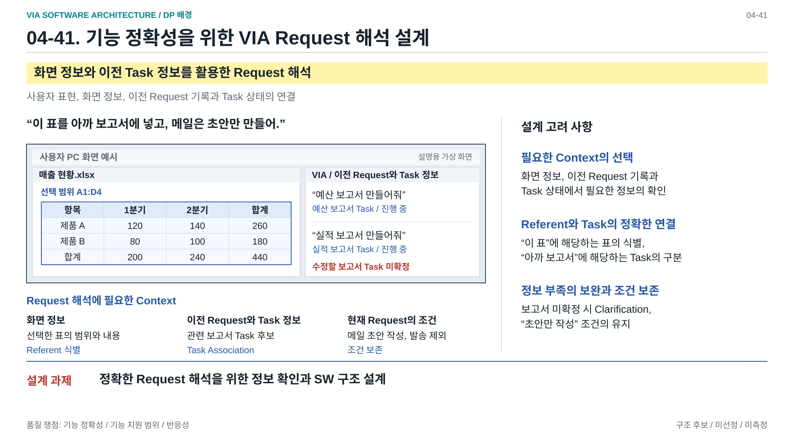
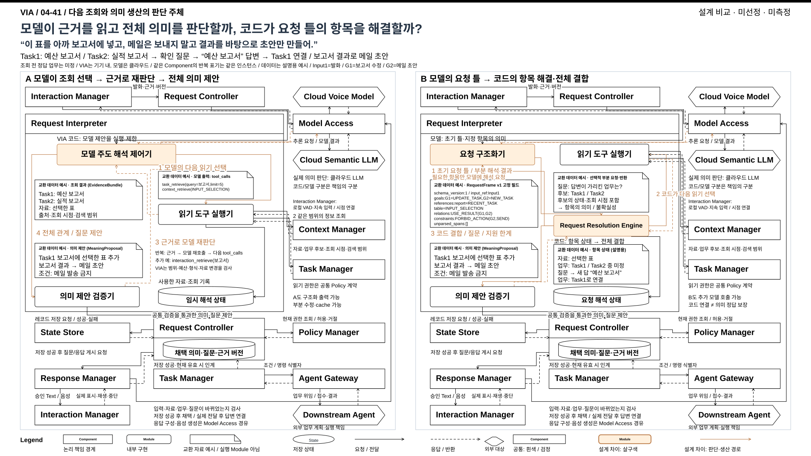
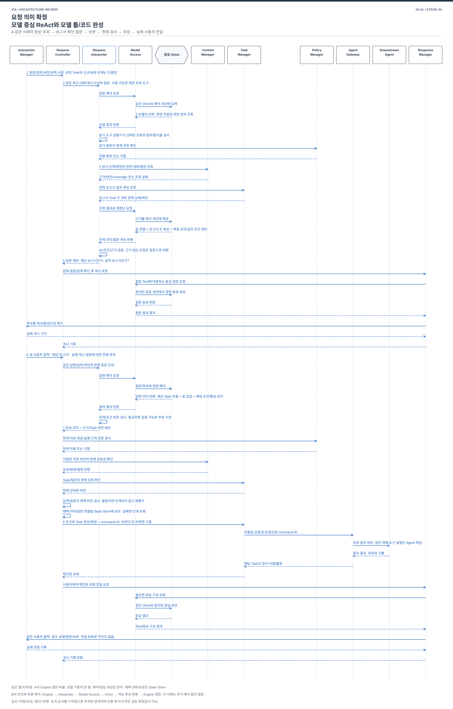
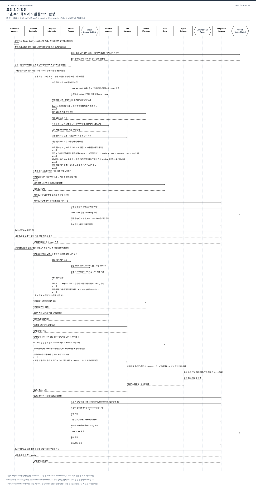

# 04-41. 요청 의미 확정 — 모델이 진행하는 해석과 코드가 진행하는 해석

> 2026-10-09 / 로컬 VIA·클라우드 모델 전제로 재구체화한 설계안 / A/B 미선정·미구현·미측정
> [공통 실행 계약](./04-40-common-execution-contract.md) / [가이드](./04-30-comparison-guide.md) / [복원한 31](./04-31-semantic-construction.md)

**A는 모델이 다음에 읽을 자료를 고르고, 조회 결과를 보며 요청의 뜻을 완성해 제안한다. B는 모델이 미해결 항목이 담긴 요청 틀을 만들고, 코드가 필요한 조회와 부분 해석을 진행하여 대상·업무·조건의 연결을 완성해 제안한다.** 두 안 모두 Request Controller가 최신 근거와 권한을 검사해 채택한다. 모델이나 해석 코드가 업무 실행 권한을 갖는 비교가 아니다.

## 0. 재구체화에서 바꾼 것과 유지한 것

VIA는 기기 내 프로그램이고 음성 모델·의미 해석 LLM은 클라우드 의존성이다. 로컬 VAD는 Interaction Manager의 Turn-Taking Control에 있다. 입력 capture와 전사·화면 근거 확보는 요청 이해 중에도 계속되며, 확정 입력은 VIA 처리로 연결한다. 이번 41 비교에서 음성 모델의 자율 직접 답변은 다루지 않는다. 기존 전체 Use Case를 삭제한 것은 아니다.

**B의 Request Resolution Engine은 Request Interpreter 내부 Module로 정리했다.** 이전 문서/그림은 독립 Component와 별도 해석 상태 owner로 표시했다. 그러나 별도의 실행 수명·외부 권한·영속 상태 권위가 필요한 근거를 제시하지 못했고, 코드가 조회 진행과 전체 결합을 결정하는 기제는 내부 Module로도 유지된다. 공통 10개 Component를 사용하고 Request Interpreter가 잠정 해석 상태를, Request Controller가 채택된 의미/질문을 소유한다. 독립 Engine의 두 번째 저장을 기다리는 사건도 경로는 제거한다.

이 변경은 Component/Module 경계와 저장 계약의 재구체화다. A/B 차이를 Component 추가나 호출 횟수로 입증하지 않는다. A의 모델 선택·전체 의미 제안과 B의 코드 선택·유한 표현의 전체 결합 차이, 강한 A의 구조화 출력/검증/cache/부분 수정, B의 추가 모델 호출·표현 한계·혼합 경계는 유지한다. 최종 Architecture나 A/B 선택, 43 변경, 구현·측정은 아니다.

**읽는 순서:** §1~3에서 목적과 구조를 이해하고, §4의 같은 요청 처리를 비교한다. B의 실현 가능성은 §5의 표현 범위와 §6의 지원 한계를 함께 읽어 판단한다. §8은 작은 확장으로 서로 바꿀 수 있는지 검토한다.

31의 ReAct 확장본을 이름만 바꾼 문서가 아니다. 31은 사용자 지시로 `ee2fcf31` 상태로 복원했다. 41에서는 **조회와 해석의 다음 단계를 누가 결정하고, 최종 대상/Task 관계를 누가 만드는가**를 독립적으로 설계한다. 지속 Meaning Workspace의 분리나 호출 횟수 차이를 주된 비교 근거로 삼지 않는다. 두 문서는 중첩되는 기능을 다루므로 최종 보고서에서 독립 DP로 모두 선정하거나 품질 이익을 합산한 상태가 아니다.

| 용어 | 이 문서의 뜻 |
| --- | --- |
| 요청 의미 | 사용자 목표, 실제 대상, 조건, 기존 업무와의 관계, 직접 응답/위임 방향 |
| 모델 주도 해석 반복 | 모델이 판단 → 읽기 도구 선택 → VIA 코드가 조회 → 모델이 결과를 보고 다시 판단하는 반복. 기존 ReAct loop를 쉬운 말로 표현한 것. 모델 내부 사고 기록의 저장을 요구하지 않음 |
| 요청 틀 | 모델과 코드가 공유하는 정해진 자료 형식. 목표와 지칭, 관계 후보, 조건, 아직 모르는 항목을 담음 |
| 결합 | ‘이 표’와 실제 자료, ‘아까 보고서’와 실제 Task를 연결하고 조건/의존 관계를 구성하는 일 |
| 채택 | 해석 제안을 현재 입력과 자료, 업무, 권한에 맞게 확인하여 VIA의 처리 상태로 받아들이는 일 |

## DP 배경 — 발표용 1페이지



[편집 가능한 draw.io](./diagrams/dp41-background.drawio) / [발표 삽입용 PNG](../../../presentations_files/dp-background/dp41-background.png) / [전체 지도와 배경 모아 보기](../../../presentations_files/dp-background/index.html)

사용자 화면 예시와 Request 해석에 필요한 Context를 보여주는 중립적인 배경 페이지다. 선택한 표의 Referent 식별, 이전 Request 기록을 통한 Task Association, 정보 부족 시 Clarification과 조건 보존을 설명한다. Component 배치, 처리 순서와 A/B의 해석 제어 방식은 이 배경에서 미리 정하지 않으며 아래 설계 비교에서 다룬다.

정보 조회와 의미 완성의 진행 책임이 이 장의 결정 범위이며, 43의 의미 생산 책임 구분과 다르다. 메일의 초안 작성과 발송 제외 조건도 보존한다. 노란색 문구는 예방할 설계 위험이며 실제 관측된 실패나 측정 결과가 아니다. [다섯 설계 문제 지도](./diagrams/dp-background-overview.svg)에서 각 결정 범위를 먼저 구분한다.

## 1. 왜 VIA에서 중요한가

사용자는 Agent의 실행 ID나 파일 경로를 지정하기보다 “이 표를 아까 보고서에 넣고, 메일은 초안만 만들어”라고 말한다. VIA가 문장을 이해했더라도 다른 표나 다른 업무에 연결하면 실제로 다른 일을 시킨다. 올바른 대상, 기존 조건, 복합 요청의 관계를 정리하는 일은 VIA의 핵심 기능이다.

이 설계는 [고정 범위](../../03-fixed-architecture-scope.md)의 요청 보완, 지칭, Task 연결과 복합 요청을 다룬다. [대표 UC](../../05-representative-use-cases.md)의 UC-03~10 및 UC-14에 직접 연결된다. 사용자에게 모든 정보를 처음부터 다시 말하게 하거나 지원하지 못하는 요청을 모두 Agent에 떠넘기는 것은 같은 기능을 달성한 것으로 세지 않는다.

VIA는 제한된 자료 조회와 요청 해석을 담당한다. 보고서를 어떻게 작성할지, 조사에 어떤 도구를 사용할지와 실제 파일/메일 변경은 Downstream Agent가 담당한다. A의 모델 주도 해석도 VIA 내부의 요청 해석이며 범용 업무 실행 Agent로의 변경이 아니다.

## 2. SW Architecture에서 무엇이 어려운가

관련 자료를 알아야 말뜻을 해석할 수 있지만, 무엇을 읽어야 하는지는 말뜻을 알아야 정할 수 있다. “그거”가 직전 질문의 답인지, 기존 결과를 사용하는 새 업무인지는 입력 순간에 항상 확정할 수 없다. 화면과 Task도 해석 도중 바뀐다.

A는 이 상호 의존을 모델의 반복 판단으로 다룬다. 표현을 폭넓게 받아들일 수 있지만 조회 범위, 종료, 조건 누락과 오래된 사실을 프로그램이 통제해야 한다. B는 명시적인 미해결 항목과 해결 절차로 다룬다. 처리 근거를 추적하기 좋지만 자연어를 어느 범위까지 코드가 처리할 표현으로 바꿀 수 있는지가 어렵다.

**설계 질문:** 모델이 다음 조회와 완성 의미를 결정하게 할 것인가, 모델이 만든 제한된 표현을 코드가 처리하며 필요한 조회와 부분 해석을 결정하게 할 것인가?

B의 규칙을 계속 늘리면 자연어 전반을 구현하는 문제로 커질 수 있다. 반대로 지나치게 작은 틀은 VIA의 핵심 기능을 잃는다. 이 긴장 자체가 품질 비교의 대상이다.

## 3. 공통 구성과 두 실행 구조

### 3.1 같은 시작과 끝

1. Interaction Manager의 Channel I/O·Turn-Taking Control·Evidence Capture·Timeline & Buffer가 로컬 VAD 경계, 전사 revision과 화면/포인터 근거를 연결한다. 종료 확정과 final 전사/근거 상태를 구별하고 Input + Evidence Record를 Request Controller에 보낸다. 신규/보완·정답 Task는 아직 판단하지 않는다.
2. Request Controller가 input revision과 `job ID`를 등록하고 같은 범위의 최근 대화·실제 전달 질문·보존 조건을 Request Interpreter에 제공한다. 전체 이력이나 정답 Task를 첫 입력에 미리 넣지 않는다. partial 전사만으로 새 의미를 확정하지 않는다.
3. 추가 근거는 같은 Context Manager와 Task Manager의 bounded read 계약으로 읽는다. 읽기 도구 실행기는 Task Manager를 직접 조회할 수 있다. 대화/실제 전달/관측은 Context Manager가 각 원본 owner의 허용 읽기를 조합하거나 45B의 유효 게시 근거를 제공한다.
4. Request Interpreter의 완성 의미 또는 질문 제안은 Request Controller로 돌아온다. Request Controller는 현재 입력·질문·자료/Task revision·권한을 검사하고 의미/질문 레코드의 저장 성공 후 채택한다. 잘못된 유효 Task를 선택한 의미 오류까지 코드 검사가 완벽하게 찾는다고 주장하지 않는다.
5. 채택된 위임은 Task Manager → Agent Gateway → Downstream Agent로, 질문/직접 응답/확인된 상태는 Response Manager → Interaction Manager로 연결한다. Model Access를 통한 내용 준비·음성 생성과 장치의 실제 전달은 다른 사건이다. 실제 질문 제시 기록을 기준으로 다음 사용자 답변을 연결한다.

VIA와 상태 owner는 로컬이고 음성/전사·의미 모델은 클라우드다. 양안의 model/version·provider 조건·허용 근거·기능 목표를 같은 비교 조건으로 둔다. 음성 입력은 의미 호출과 무관하게 계속된다. 로컬 공유 weights·GPU/KV scheduler·별도 로컬 ASR를 필수 전제로 가져오지 않는다. 전사 service가 별도 learned dependency면 inventory와 청구에 명시한다. API session context는 임시이며 업무 상태의 유일 원본으로 사용하지 않는다. [공통 계약 §0~4](./04-40-common-execution-contract.md#0-이번에-합의한-것과-문서의-적용-범위)

모델/조회/후보 수·context 크기·처리 시간에는 유한 예산을 두지만 ‘semantic 2회’나 B의 1회 호출을 고정하지 않는다. provider queue/rate limit·재시도·취소 실패·늦은 청구 작업을 포함한다. deadline을 넘기거나 지원하지 못한 요청을 빠른 성공으로 계산하지 않는다.

### 3.2 Component·Module·상태 목록

아래 이름을 본문·MAIN·사건도·41 발표 비교의 공통 목록으로 사용한다. 다른 DP가 아직 옛 모델 전제를 사용하는 것은 후속 동기화 대상이며 이번 41에 다시 적용하지 않는다. 직각 Component, 둥근 내부 Module, owner 안의 원통 상태, 육각 외부 의존성을 구별한다.

| Component | A 내부 Module | B 내부 Module | 상태와 책임 |
| --- | --- | --- | --- |
| **Interaction Manager** | Channel I/O, Turn-Taking Control, Evidence Capture, Timeline & Buffer | 동일 | Playback State는 실제 재생/receipt buffer 상태. VAD는 Turn-Taking Control 내부 기능 |
| **Request Controller** | 41에서는 기존 입력/revision·의미 채택·질문 기능을 사용. 44별 실행 Module은 고정하지 않음 | 동일 | 채택 의미, 질문/candidate snapshot, 보존 조건과 input/source revision. 실제 전달 원본은 Response Manager |
| **Request Interpreter** | **모델 주도 해석 제어기**, 읽기 도구 실행기, 의미 제안 검증기 | **요청 틀 해석기**, **Request Resolution Engine**, 읽기 도구 실행기, 의미 제안 검증기 | A 임시 해석 상태 / B 요청 해석 상태. 둘 다 미채택 근거·후보·job의 transient 상태 |
| **Context Manager** | 45의 근거 제공 계약을 사용. 41에서 생산/조회 대안을 선택하지 않음 | 동일 | EvidenceBundle/QueryReceipt 공급. 원본 Request/Task/publication 권위를 가져오지 않음 |
| **Task Manager** | 현재 Task·Execution·명령 조회/변경의 기존 기능 | 동일 | Task 사실·revision·command 상태 |
| **Agent Gateway** | 외부 명령/receipt/event의 기존 연동 기능 | 동일 | 전송·외부 접수/결과 대응. 내부 도메인 실행은 외부 Agent |
| **Response Manager** | Response Composer, Publication Control | 동일 | Publication Outbox의 영속 전달 원장. 질문의 준비와 실제 제시는 구별 |
| **Policy Manager** | 현재 읽기·제공·위임 권한의 기존 정책 기능 | 동일 | policy/permission epoch와 철회 |
| **State Store** | 기존 저장·transaction·복원 기능 | 동일 | **Component**다. 논리적 채택/질문/Task/publication 상태의 owner와 구별 |
| **Model Access** | Voice API Client, Semantic API Client라는 provider adapter 역할 | 동일 | call/session ID 대응·제한·timeout·cancel·usage. 모델 weights는 클라우드 의존성 |

굵게 표시한 내부 Module의 실행 책임이 41의 차이다. 읽기 도구 실행기와 의미 제안 검증기는 공통 기능이므로 살구색 차이 요소로 표시하지 않는다. 이름·소속의 일치는 각 Module이 같은 thread/process라는 뜻이 아니다. 미해결 항목 처리와 관계 결합은 Request Resolution Engine 내부 동작으로 설명하며 또 다른 Component나 별도 상태 owner를 만들지 않는다.

### 3.3 첫 모델 호출에 주는 입력과 조회 도구

`InterpretationInput`은 검토용 계약 이름이며 구현 schema가 아니다. 같은 사용자 발화라도 첫 입력의 확정된 사실과 미결정 의미를 구별한다.

| 최초 제공 항목 | 예시 / 제한 |
| --- | --- |
| input ID/revision, job ID, modality, final 전사 | `u41@r1`, “이 표를 아까 보고서에 넣고, 메일은 보내지 말고 초안만 만들어” |
| 발화/선택 시간 근거와 evidence locator | audio sample/span·화면/selection revision·watermark/gap. VAD 경계만으로 ‘이 표’의 단어 시각을 발명하지 않음 |
| 제한된 최근 대화와 실제 게시 질문 안내 | 질문 ID/version·publication ref·실제 전달 여부. 미전달 후보를 사용자에게 이미 물었다고 제공하지 않음 |
| 채택된 이전 의미·보존 조건과 변경 가능한 범위 | 관련 후보로 제공하며 신규/보완 여부와 Task 정답을 사전에 확정하지 않음 |
| 읽기 scope, policy epoch, 실행 예산 | 허용 source/목적·읽기와 호출 한도·deadline. 입력 중 보호 자료를 무조건 cloud로 보내지 않음 |
| A의 tool schema / B의 RequestFrame schema version | A에는 bounded read와 질문/의미 제안 형식. B에는 유한 표현·미해결 표시·부분 해석의 허용 필드 |

처음 제공하는 context는 프로그램이 범위를 정해 준비하고 필요한 부분만 보낸다. “41A니까 마이크·모든 기록·모든 tool을 처음부터 LLM에 넘긴다”는 구조가 아니다. A의 다음 조회 선택권은 이 제한된 입력과 도구 계약 안에 있다.

| 읽기 port | 입력 | 반환 | 실제 호출 대상 |
| --- | --- | --- | --- |
| `context_retrieval` | 목적, 허용 source kind, input/span/evidence ref 또는 대화/실제 전달 범위, 조건·limit/cursor | 허용 발췌/locator, source ID/revision·사용 범위, 불확실성·coverage/gap, QueryReceipt | Context Manager. 45A/B의 실제 근거 공급 구현을 감춤 |
| `task_retrieval` | 업무 종류/시간/관련 요청 또는 결과 참조 등 후보 selector, 필요한 상태 필드·limit/cursor | 후보 Task/Execution ID, 확인된 상태/revision, 질문·결과 ref, 검색 범위·누락 | Task Manager **직접 조회**. Context Manager 경유를 필수로 하지 않음 |

두 안의 읽기 도구 실행기는 같은 port를 실행한다. 각 조회에 request/job/read ID와 시작 revision을 붙이며 **자체 의미 판단이나 조회 전략을 만들지 않는다.** A는 모델이 조회를 선택하고 B는 Engine 코드가 선택한다. 같은 근거 조건을 만들기 위해 B에 정답 referent·Task를 pre-resolve해서 주지 않는다.

반환은 `OK`, 검색한 범위의 `NO_MATCH`, `NOT_COVERED`, `DENIED`, `UNAVAILABLE`, `STALE` 등을 구별한다. `NO_MATCH`가 전체 기록에 답이 없다는 뜻은 아니며 coverage 밖을 성공 hit로 바꾸지 않는다. 실패/누락도 조회 결과로 반환한다. bounded read 자체는 local 코드 동작이고, Context Manager가 의미 가공을 추가할 때만 별도 모델 호출 비용이 발생한다. B의 unsupported frame 관계와 45B의 미게시 범위는 서로 다른 오류다.

비구조 화면을 모델이 해석해야 하면 허용된 image crop/화면 근거와 시각을 처리할 수 있는 의미 모델 capability를 명시한다. text/UI evidence로 충분하면 이미지를 보내지 않을 수 있다. image-to-text·alignment helper를 추가한 비용과 오류를 숨기지 않는다.

### 3.4 A: 모델이 다음 조회와 전체 의미 제안을 결정

**모델 주도 해석 제어기**는 Request Interpreter 내부의 host 코드다. Model Access 호출, tool 결과의 대응, 예산·deadline·취소를 관리하지만 다음에 필요한 의미 조회 전략과 전체 binding을 대신 생산하지 않는다. 클라우드 의미 LLM이 `ReadRequest`, `ClarificationProposal`, `MeaningProposal` 중 허용된 제안을 반환한다.

1. 제어기가 같은 InterpretationInput과 tool schema로 의미 모델을 호출한다.
2. 모델이 조회를 제안하면 공통 **읽기 도구 실행기**가 타입·scope·현재 권한·예산을 검사하고 Context Manager 또는 Task Manager를 읽는다. 거절도 read ID와 이유로 반환한다.
3. 읽은 근거·version/coverage와 이전 조건을 제한된 context로 다시 모델에 준다. 독립 read는 같은 허용 범위에서 병렬 실행할 수 있고, 앞선 결과가 selector를 정하는 read는 순차 실행한다. 전역 atomic snapshot을 얻었다고 가정하지 않는다.
4. 모델이 충분하다고 판단하면 전체 의도·대상·Task 관계·조건·수정 범위 또는 확인 질문을 제안한다.
5. 공통 **의미 제안 검증기**가 ID·형식·자료 범위·근거 revision·금지/보존 조건·일관성을 검사한다. 고칠 수 있는 형식/참조 오류는 남은 예산 안에서 모델에 돌려준다. 모호함·근거 부족·예산 초과는 확인/보류/실패로 반환한다.
6. Request Controller가 현재 입력·원본·질문·정책을 다시 확인하고 채택한다. 검증 성공은 의미 정답 보증이나 업무 전송 완료가 아니다.

**A도 구조화 출력, cache, 이전 조건 보존 검사, 검증 가능한 부분 수정이 가능하다.** 관련 요청을 매번 전부 새로 이해하거나 전체 이력을 읽는 약한 A로 비교하지 않는다. 다만 부분 수정의 의미와 전체 연결을 모델이 제안하는 정상 경로는 유지한다. 내부 사고 기록을 영속 저장하지 않으며 tool 선택/입출력·근거·결과와 예산을 추적한다.

### 3.5 B: 모델의 틀을 코드가 해결하여 전체 의미 제안을 구성

**요청 틀 해석기**는 Model Access로 초기 `RequestFrame v1`을 생산하고 Engine이 범위를 지정한 부분 해석을 요청할 때만 그 부분을 모델에 준다. **Request Resolution Engine**은 frame version·미해결 항목을 검사하고 유한 연산의 상태 전이로 다음 read, 부분 해석, 확인 질문과 전체 binding 제안을 구성한다.

| 항목 상태 | Engine 코드의 처리 |
| --- | --- |
| `UNRESOLVED` | 지원되는 selector/관계인지 검사. 근거 부족이면 read spec, 비구조 속성 의미가 부족하면 부분 모델 요청을 선택 |
| `READ_PENDING` | 공통 실행기의 해당 read ID 결과 대기. deadline·source 변화·권한 철회 시 보류/무효화 |
| `CANDIDATES_READY` | 원문 조건과 지원 연산으로 후보·참조 결합. 근거 부족·불명·상충이면 부분 해석/추가 읽기/확인 |
| `BOUND` | 지원 규칙 안에서 결합됨. **유일 후보 또는 이 상태가 의미 정답을 보증하지 않음**. 공통 검증과 최종 채택 필요 |
| `AMBIGUOUS` | 구별 가능한 후보와 원문 범위를 가진 질문 제안. 임의 후보 선택 금지 |
| `UNSUPPORTED` | 표현/연산 범위 밖 구간을 보존하여 지원 한계 반환. 반복 모델 호출로 해결됐다고 꾸미지 않음 |

부분 모델 요청에는 `field ID`, 원문 span, 유한 candidate set, 해당 근거·version, 허용 반환 schema를 준다. 모델은 특정 후보/속성/부분 관계와 불확실성을 반환하고 Engine이 전체 결합에 반영한다. 모델이 전체 요청 관계를 완성한 뒤 Engine이 복사하는 경로는 **A형 혼합**이며 B의 비용/이익으로 숨기지 않는다. 임의 모델 생성 코드·expression은 실행하지 않는다.

Engine의 결합 결과도 공통 읽기·검증 계약을 거쳐 Request Controller에 제안된다. 모델의 초기 신규/보완 추출 오류, 잘못된 유효 Task, 누락 후보와 잘못 구현한 결합 규칙은 남을 수 있다. **B도 1회 호출로 끝나지 않을 수 있다.** frame 생성과 필요한 부분 해석·답변 해석·재질문 비용을 모두 포함한다.

### 3.6 잠정 상태, 채택 및 질문 복원의 저장 계약

| 상태/자료 | owner와 수명 | 영속 저장/복원 |
| --- | --- | --- |
| 입력 전사·원음/화면 evidence | Interaction Manager의 제한된 buffer/근거 계약. Request Controller가 확정 input revision 연결 | 허용된 기록·locator/보존 기한을 유지. 소실된 원음을 현재 화면으로 대체하지 않음 |
| A 임시 해석 상태 | Request Interpreter: job/context·read set·미채택 제안 | 진행 중 추론은 원본/채택 기록에서 재계산. 진단 trace가 의미 원본을 대신하지 않음 |
| B 요청 해석 상태 | Request Interpreter: frame/schema version·항목 상태·후보·dependency·부분 해석 | pending read/초기 frame은 재계산 가능. Engine의 별도 영속 원본이나 second commit을 만들지 않음 |
| 채택 의미·질문 | Request Controller: input/job/revision, 확정 의미·미결 구간, 보존/금지 조건, source refs·read set, 질문 ID/version·candidate snapshot | State Store를 통해 저장 성공 후 채택. 필요한 frame 설명 artifact/schema는 이 채택/질문 레코드의 일부 또는 함께 검증되는 참조로 보관 |
| 실제 질문/응답 전달 | Response Manager: publication/release·actual-range·receipt 원본. Request Controller는 질문 focus/receipt ref 연결 | Interaction Manager의 실제 receipt 후 반영. 질문을 준비한 사실과 사용자에게 제시한 사실 구별 |
| Task/command/external event | Task Manager·Agent Gateway | 41의 임시 frame과 별개의 권위. 이미 접수한 command를 새 ID로 자동 재전송하지 않음 |

질문 대기 복원에는 당시 원문·질문 후보/범위·보존 조건과 실제 제시 기록이 필요하다. 재계산 frame이 그 질문을 조용히 바꾸거나 금지 조건을 잃으면 안 된다. artifact는 원본 evidence의 보존/삭제·권한·schema 호환 규칙을 따른다. 필수 artifact가 저장되지 않으면 채택하지 않으며 외부 인계를 보류한다.

위 표는 **논리적 채택 port**다. 42A의 공동 저장과 42B의 독립 저장소 hand-off 중 무엇을 선택할지는 고정하지 않는다. 네트워크·모델 호출 동안 transaction/lock을 잡지 않는다. 44에서 가정한 공동 hold/전송 CAS를 42B에 적용하는 cross-owner 프로토콜은 [공통 계약 §6](./04-40-common-execution-contract.md#6-네-dp가-실제-프로그램에서-결합되는-지점)의 UNRESOLVED 사항으로 남긴다.

### 3.7 모델 호출과 후속 출력의 위치

| 호출 역할 | A | B | 공통/주의 |
| --- | --- | --- | --- |
| 현재 요청 의미 | 제어기가 모델의 read/의미 제안을 받고 조회 결과로 반복 | 틀 해석기가 초기 frame·Engine 지정 부분·사용자 보완을 해석 | Semantic API Client의 cloud 호출. code read/validator는 모델 호출이 아님 |
| 과거 의미 가공 | 현재 의미 호출에서 근거를 해석하면 추가 호출 없음 | 필요 근거 공급 구현에 따라 추가 호출 가능 | Context Manager의 45 호출은 해당 실제 call ID로 한 번만 집계 |
| 응답 내용 | 이미 만든 적합한 질문/의미를 재사용. 정형 접수 문구는 template 가능 | 동일 | Response Composer가 내용 준비에 모델을 사용하면 별도 semantic 호출 |
| 음성 입출력 | 지속 audio/전사 및 준비한 발화의 음성 생성 | 동일 | Voice API Client cloud 호출. 입력 commit이 자율 답변을 만드는 경로는 이번 비교 밖 |

Response Manager는 현재 source와 의미에 맞는 text/짧은 발화 내용을 준비하고 필요 시 Model Access로 음성을 만든다. generated audio/전사/status는 publication ID·출력 세대에 묶는다. Publication Control의 유효 release 뒤 Interaction Manager가 실제 표시·재생·중단하고 receipt를 반환한다. 생성 완료가 실제 청취 완료가 아니며 생성형 음성의 의미 보존·재생 전/streaming 검사는 [공통 계약 §3.2](./04-40-common-execution-contract.md#32-via가-준비한-응답의-음성-생성과-중단)의 후속 상세화 대상이다. 외부 업무 계획/도구 선택·실행은 Downstream Agent에 남긴다.



[편집용 draw.io](./diagrams/choice41-structure.drawio) · [발표용 PNG](./diagrams/choice41-structure.png) · [배치·내용 검수](./04-41-diagram-review.md)

MAIN은 16:9에서 A/B 각 칸의 경로를 독립적으로 표시하되, **A의 조회 요청·근거 반환·모델 재판단 반복**과 **B의 요청 틀·항목 해결·코드 전체 결합**을 확대해 대조한다. 연결에 놓인 문서형 주석은 교환 데이터의 설명용 예시이며 Component·Module·저장 상태가 아니다. A는 `ReadRequest`와 근거를 주고받아 모델이 전체 `MeaningProposal`을 제안하고, B는 `RequestFrame v1`의 미해결 항목을 코드가 해결하여 같은 최종 의미를 제안한다. B의 부분 모델 요청은 조건부 가지다. **A도 구조화 출력이 가능하므로 자유문장/JSON의 차이로 읽지 않는다.** 두 후보의 질문과 새 답변을 거친 뒤의 연결을 최초부터 주어진 정답으로 읽지 않는다.

큰 Component는 흰 바탕, 차이 Module만 살구색이며 박스에는 이름, 화살표와 데이터 주석에는 동작·자료·조건을 넣는다. 원통은 owner의 상태이고 State Store Component와 다르다. 입력·근거 공급·최종 검사/저장·실제 전달·위임의 공통 경로는 주변에 작게 배치한다. 클라우드 의미/음성 모델과 외부 Agent는 VIA Component가 아니다. 이 배치와 overlay는 실제 동작·판단 책임·저장 계약을 바꾸거나 새로운 API schema·44 실행 방식·42 저장소 경계를 선정하지 않는다.


## 4. 같은 입력을 끝까지 처리하면

**공통 사례:** 보고서 Task 두 개가 있고 화면에는 표가 있다. 사용자가 “이 표를 아까 보고서에 넣고, 메일은 보내지 말고 초안만 만들어”라고 한다. 최근이라는 정보만으로 어느 보고서인지 확정할 수 없는 조건이다. 실제 후보와 버전은 조회 전 어느 안에도 정답으로 제공하지 않는다.

| 단계 | A | B |
| --- | --- | --- |
| 1 입력 | Interaction Manager가 같은 원문/시점/버전을 Controller에 전달 | 동일 |
| 2 해석 시작 | Request Controller → Request Interpreter → Model Access → cloud 의미 LLM. 같은 입력과 제한 조회 도구 안내 | 같은 Component 경로. 요청 틀 형식과 미해결 표현 안내 |
| 3 다음 처리의 결정 | 모델이 화면과 이전 업무 조회를 선택. 도구 실행기가 요청을 수행 | 모델이 화면 지칭/기존 업무 지칭이 남은 틀 반환. Engine 코드가 각각의 조회를 구성 |
| 4 근거 조회와 결합 | Context/Task 결과로 모델이 재판단. 표의 연결과 보고서 두 후보, 초안/금지 조건을 제안 | 같은 결과로 Engine이 후보를 결합. 표 속성 해석이 더 필요하면 Interpreter에 그 부분만 요청 |
| 5 미해결 질문 | 검증한 질문 제안 → Controller. 어느 보고서인지 질문 | 복수 Task 연결을 미해결로 반환 → Controller. 같은 질문 |
| 6 보완 | 사용자의 “예산 보고서”가 새 입력으로 들어옴. 모델이 게시 질문/후보와 함께 해석 | 같은 입력을 모델이 질문의 선택/지칭 조건으로 변환. Engine이 현재 질문의 후보와 결합 |
| 7 채택 | Request Controller가 현재 조건 검사·기록 저장 후 완성 의미 채택. 금지 조건 유지 확인 | 같은 검사/저장 후 Request Interpreter의 Engine이 만든 의미 채택. 별도 Engine 저장 없음 |
| 8 인계와 전달 | Task Manager/Agent Gateway를 통해 올바른 보고서 변경과 메일 초안 요청. 실제 접수/결과만 사용자에게 전달 | 동일. 미해결 상태에서는 인계하지 않음 |

질문 게시 기록은 Response Manager → Request Controller로 돌아온다. 다음 사용자 답변은 게시 기록의 반환이 아니라 별도의 입력이다. Request Controller가 현재 질문 snapshot/실제 제시/원래 금지 조건을 같은 의미 입력으로 제공하고, B의 Engine은 그 안에서 후보를 결합한다. 질문이 취소됐거나 버전이 바뀌었으면 옛 답을 바로 적용하지 않는다. 모델이나 코드가 “가장 최근 질문”이라는 이유만으로 답변 연결을 확정하지 않는다.



[A 편집용 draw.io](./diagrams/choice41-event-a.drawio)



[B 편집용 draw.io](./diagrams/choice41-event-b.drawio)

두 사건도는 같은 입력과 사용자 전달까지를 보여준다. Request Interpreter 내부 Module의 해석/결합, Model Access의 cloud 의미/음성 역할, Context/Task 조회, 현재 검사, 채택 저장, 외부 인계와 실제 게시 기록을 구별한다. 행 간격이나 호출 횟수는 성능 결과가 아니다. 임의로 정상 사례를 성공시키는 실행 코드도 아니다.

### 4.1 신규, 보완, 혼합 요청의 판단

| 입력 | A | B |
| --- | --- | --- |
| “새 일정도 등록해줘” | 모델이 독립 목표/새 Task 제안 | 모델이 독립 목표 틀 생성. Engine은 이전 보고서 조건을 자동 상속하지 않음 |
| “오른쪽 것으로” | 모델이 관련 게시 질문을 조회하고 관계 제안 | 모델은 질문 답/화면 지칭 등 관계 후보를 남김. Engine이 게시 질문과 자료 후보를 조회. 관계가 여럿이면 확인 |
| “보고서는 PDF로 바꾸고 새 일정도 잡아줘” | 수정과 신규 목표를 구별해 전체 관계 제안 | 기존 목표 변경과 독립 목표를 각각 표현해 결합. 표현하지 못한 절을 누락하지 않음 |
| “지난 결과를 참고해서 별도 보고서를 만들어줘” | 기존 결과 사용과 새 Task를 함께 제안 | 기존 결과 참조 + 새 목표로 구성. 기존 자료 사용을 기존 Task 수정으로 간주하지 않음 |

B의 틀 자체에 잘못된 신규/보완 판단이 들어갈 수 있다. 상태 검사는 존재하지 않는 질문이나 오래된 버전을 잡지만 뜻이 다른 유효 Task를 고른 오류까지 보장해서 잡지는 못한다. 두 안 모두 모델 해석 오류가 남는다.

### 4.2 B에서 부분 모델 해석이 필요한 같은 입력

원래 요청의 표 후보가 두 개이고 구조화 UI metadata만으로 ‘빨간 선으로 표시된 표’를 구별할 수 없다고 하자. A/B에 같은 허용 화면 근거를 제공하며 정답 ID는 제공하지 않는다.

- A 모델은 화면 근거 읽기를 선택하고 반환한 두 후보/화면으로 대상과 나머지 요청 관계를 함께 제안한다. 부족하면 추가 조회/질문을 선택한다.
- B Engine은 지원되는 화면 조건으로 후보를 먼저 읽고, 틀 해석기에 **표 field·원문 span·두 candidate ID·허용 화면 crop·근거 revision**만 주어 부분 해석을 요청한다. 모델은 후보별 해당 조건의 의미 해석과 불확실성을 반환하고 Engine이 이 field를 다른 목표/Task/금지 조건에 결합한다.
- crop이 없거나 식별이 불확실하면 후보 하나로 자동 채택하지 않는다. 필요한 근거/확인 질문으로 남긴다. 모델에게 “전체 요청을 알아서 완성하라”고 요청하여 반환 graph를 복사하면 B가 아닌 명시적 혼합 경로다.

이 장면은 B도 초기 frame 외 모델 호출이 필요할 수 있음을 보여준다. 부분 scope가 작다는 이유만으로 비용/정확성 이익을 보증하지 않는다.

### 4.3 정정과 늦은 결과가 겹칠 때

`job j1 / u41@r1 / read-set v7` 해석 중 사용자가 “보고서는 예산 보고서로, 메일은 여전히 보내지 마”라고 보완한다.

1. 로컬 VAD 시작 시 Interaction Manager가 현재 출력을 중단하고 Request Controller에 InputStarted를 전달한다. 44가 관련 미전송 admission/후속 후보를 hold한다. 아직 모든 업무가 취소되었거나 모든 해석이 무효라는 뜻은 아니다.
2. 확정 보완을 해석하여 해당 요청과 연결하면 Request Controller가 `u42 / effective revision r2`와 새/갱신 job을 요청한다. A는 이전 조건/질문을 가진 모델 제안 또는 검증 가능한 patch, B는 해당 field의 frame 수정과 의존 결합 무효화를 수행한다. 둘 다 발송 금지 조건을 유지한다.
3. 늦은 j1 model/read 결과는 시작 revision·dependency를 들고 돌아온다. 공통 host 코드는 현재 job/revision과 비교하여 r2 제안으로 채택하지 않는다. 여전히 유효한 source read/cache만 허용 범위에서 재사용할 수 있다.
4. 모델 cancel이 실패해 j1 계산이 계속되어도 이전 결과를 새 응답이나 명령으로 내보내지 않는다. billed usage는 비용 원장에 남긴다. 이미 전송된 command는 Task Manager/Agent Gateway가 실제 외부 상태를 확인하며, 로컬 음성 stop를 Agent cancel 성공으로 바꾸지 않는다.

41은 해석 job 안의 조회/의미 생산과 결과 검증을 다룬다. 새 입력·Agent 알림·완료·실제 전달 사이의 다음 job 시작/대기는 44가, 상태의 확정·복원 경계는 42가 담당한다.

## 5. B의 자유도를 코드가 어떻게 감당하는가

**모델이 임의의 JSON이나 규칙을 발명하면 코드는 처리하지 않는다.** 다음은 이 설계에서 제안하는 버전 있는 최소 표현 `RequestFrame v1`이다. 구현된 schema나 전체 자연어 문법은 아니다. 이름은 코드가 인식하는 연산이고, 각 값은 원문 구간/자료 근거와 연결된다.

### 5.1 코드가 다루는 표현 범위

| 항목 | v1에서 다루는 것 | 경계 |
| --- | --- | --- |
| 목표 | 새 목표, 기존 목표 보완/교체/철회, 질문 답변, 상태 문의 | 업무 내부 수행 단계는 생성하지 않음 |
| 대상 | 자료 ID, 당시 선택/화면 구간, 대화 참조, 이름/시각/종류 조건으로 찾을 후보 | 없는 ID 생성 금지. 비구조 화면 해석에는 모델과 원본 근거가 필요 |
| Task 관계 | 새 업무, 기존 업무, 추적 업무 없음, 관계 미결정 | 무조건 직전 Task에 연결하지 않음 |
| 명시 관계 | 독립, 순서, 결과 참조, 조건 분기 | 사용자가 말한 관계만 보존. 임의 재귀 workflow나 업무 계획 생성은 범위 밖 |
| 조건 | 명시 속성의 비교/집합 포함, 금지/보존 조건과 적용 목표 | unknown 속성은 참/거짓으로 바꾸지 않음. 실행 승인과는 별개 |
| 작업 지시 | “임원이 이해하기 쉽게” 같은 도메인 목표/설명 원문 | VIA가 소유하는 Task 연결, 순서, 조건, 금지를 이 필드에 숨기지 않음 |
| 미해석 | 원문 구간과 미해결 이유, 지원하지 않는 관계 | 삭제하거나 성공으로 간주하지 않음 |

예시 발화는 “이 표를 아까 보고서에 넣고, 임원들이 이해하기 쉽게 설명해줘. 메일은 보내지 마”다. 사람이 읽기 쉽게 적으면 다음과 같다.

```text
목표 g1: 보고서에 표 삽입
자료 r1: 당시 선택/화면 구간에 해당하는 표 [미해결]
업무 t1: 아까 만들던 보고서 [기존 Task 후보 조회 필요]
관계: g1의 입력은 r1, 변경 대상은 t1
작업 지시: "임원들이 이해하기 쉽게 설명"
조건 c1: 이번 요청 범위의 메일 발송 금지
미해석 구간: 없음이라는 모델 제안 [코드가 의미 정확성을 증명한 것은 아님]
```

모델은 실제 ID를 모르는 상태로 틀을 만들 수 있다. Engine은 r1과 t1을 조회해 결합하고, 질문이 필요하면 아직 완성하지 않는다. `c1`의 범위가 모호하면 질문한다. 이를 모든 미래 업무에 적용되는 영구 금지로 승격하지 않는다.

### 5.2 규칙, 추가 모델 해석, 사용자 질문의 역할

- 코드가 처리할 수 있는 경우: 현재 질문의 후보에서 명시된 ID 선택, 근거 있는 연도/종류 조건의 교집합, 종료된 Task 연결 거절, 유효한 결과 참조 연결, 명시한 발송 금지 유지.
- 모델이 필요한 경우: “아까”, “덜 복잡한 표”, “그때 이야기한 것”의 후보 해석, 비구조 화면 내용에서 속성 추출. Engine이 범위와 필요한 출력 필드를 지정한다. 반환값은 근거 있는 후보이지 실행 명령이 아니다.
- 사용자가 필요한 경우: 같은 근거로 두 Task가 모두 가능하거나, 우연한 포인터 이동인지 구별할 수 없거나, 서로 충돌하는 조건의 우선순위를 알 수 없는 경우.
- 엔진 확장이 필요한 경우: v1에 없는 관계 연산이나 업무 상태를 추가하려는 경우. 질문으로 더 단순하게 바꿔도 사용자의 본래 요구 손실을 기록한다. 같은 모델 재호출로 표현 능력이 생기지는 않는다.

형식 검사, 원문 구간 연결과 누락 구간 점검은 실수를 찾는 수단이다. 모델이 문장 한 부분을 잘못 분류하거나 전체 구간을 부정확하게 표현한 경우를 코드가 완벽하게 검출한다고 주장하지 않는다.

### 5.3 틀과 연산은 누가 정의하고 바꾸는가

VIA 설계/개발자가 고정 UC·명령/Agent capability·필요 품질을 근거로 frame schema와 코드 연산을 함께 정의하고 version을 관리한다. ‘목표/자료/업무/조건’은 설명용 예시이며 모델이 매번 필드 종류나 새 연산을 발명하는 것이 아니다. v1의 임의 JSON을 실행하는 것도 아니다.

확장에는 새 필드/관계의 의미, 원문/근거 연결, 코드 조회·결합·정정 규칙, 부분 모델 반환, 검증/질문, old version 복원·삭제 영향을 함께 적는다. 같은 자료 계약을 연결하는 새 source adapter와 새로운 의미 관계 연산 추가를 구별한다. prompt만 바꿔 모델이 새 필드를 내보내게 해도 Engine이 처리할 수 없으면 지원이 늘어난 것이 아니다.

### 5.4 조건이 도메인 판단을 요구하는 경우

“보고서가 충분히 설득력 있으면 보내고 아니면 보완해줘”의 ‘설득력’은 VIA가 숫자 규칙으로 임의 판정하지 않는다. 외부 Agent가 해당 판단과 조건부 업무를 함께 지원하고 의미를 보존하는 계약이 있으면, 하나의 업무 목표/조건으로 명시해 위임할 수 있다. Agent의 판단이 다른 Task의 실행을 열어야 한다면 결과 판정의 의미와 상태 계약이 필요하다. 계약이 없으면 B v1은 그 자동 연결을 지원하지 않는 것으로 표시하고 확인/수동 연결을 제안한다.

A도 Agent가 없는 기능을 모델의 자신감으로 대신할 수 없다. 두 안 모두 같은 capability를 사용한다. B의 불리함은 외부 기능 부재에 더해 자신의 표현/결합 체계가 관계를 담지 못할 수 있다는 점이다. 한 문장 전체를 ‘자유 작업 지시’에 넣어 잘못된 Task 연결이나 허용되지 않은 동작을 숨기는 방식은 B의 지원 증거가 아니다.

## 6. 기능 지원과 공통 예외

아래는 **설계상 지원 의도와 제한**이다. 모델이나 구현으로 검증한 성공률이 아니다. A의 열린 표현도 무제한 지원을 뜻하지 않는다.

| 대표 기능/UC | A의 경로와 한계 | B의 경로와 한계 |
| --- | --- | --- |
| 일반 지식/직접 응답 UC-01/02 | VIA가 직접 답하는 요청의 의미 제안 → Response Manager의 내용 준비/전달. 사실 오류 미검증 | 동일한 응답 기능. Engine이 요약 문장을 코드로 작성하지 않음. 음성 모델의 자율 답변은 이번 비교 밖 |
| 선택/시간 지칭 UC-03/04 | 원본과 시점으로 모델 해석. 같은 입력 근거의 부족은 질문 | 엔진이 해당 시점 조회, 필요하면 모델에 지칭 후보 해석. 시간 관계/다중 지칭의 v1 표현과 추출 정확성 미검증 |
| 과거 자료/보완 UC-05/06/07 | 대화 조회 후 모델이 관계/변경 제안 | 대화/질문 참조와 결과 참조로 결합. 미정의 생략 관계는 추가 질문 또는 부분 지원 |
| 새 업무 UC-08 | 목표/제약/Agent capability를 모델 제안과 코드 검사로 연결 | 정해진 목표/자료/관계와 도메인 지시를 위임. Agent 선택도 공통 capability 검사, 새 Agent 능력 자동 발명 없음 |
| 복합 요청 UC-09 | 모델이 명시 관계를 전체 제안. 누락/순서 오류 가능 | 독립/순차/결과/표현 가능한 조건 지원 의도. 새로운 관계는 엔진 확장, 불명 조건은 질문. 일부 관계는 부분 지원 |
| 기존/혼합 업무 UC-10/14 | 모델의 Task/절 연결을 현재 상태로 검사 | 코드가 관계 후보와 Task를 결합. 미지원 변경 연산/교차 관계는 부분 지원 |
| 끼어들기/취소 UC-11/12 | 공통 즉시 출력 중단. 취소 대상 해석 후 Agent 확인 | 동일. 미해결 Task를 추측해 취소하지 않음. 음성 중단은 의미 해석 완료를 기다리지 않음 |
| 결과/채널/권한 UC-13/15/16 | 공통 Task/응답/동의 경로. 질문 연결 오류는 남음 | 동일 경로. 제한된 질문/승인 답 표현에 맞추는 비용과 미지원 관계를 공개 |
| 기억/문제 대응 UC-17/18 | 공통 owner와 기록을 사용. 읽기/추론 실패를 사용자에게 안내 | 동일. 파생 후보/틀의 삭제와 schema 호환 복구가 추가됨 |

| 사건 | A | B | 공통 사용자 결과 |
| --- | --- | --- | --- |
| “작년 말고 올해” 정정 | 새 원문/기존 조건으로 재추론 또는 검증 가능한 부분 수정 | 모델이 조건 교체 표현, Engine이 영향받은 후보/결합만 무효화 | 무관한 금지 조건은 유지. 정정 전 미전송 제안은 채택 금지 |
| 자료 변경/Task 종료 | 관련 읽기 결과와 제안 무효화, 필요 시 재해석 | 의존하는 슬롯/결합 무효화, 현재 사실 재조회 | 오래된 자료로 새 명령을 만들지 않음 |
| 권한 철회/삭제 | 해당 도구/근거/캐시/모델 세션에서 사용 차단 | 같은 처리에 틀, 후보 및 파생 결합 삭제/무효화 추가 | 철회한 자료를 다음 질문/위임에 사용하지 않음 |
| 모델 실패/한도 | 제한 재시도 또는 미해결/실패 반환 | 틀/부분 해석 실패와 코드의 미지원/모순/후보 폭증을 구별 | 실패 안내는 업무 성공이 아님 |
| 재시작 | 채택 의미/질문/원문·조건에서 해석 재개. 임시 추론 상태 재생 불필요 | 같은 원본과 필요 frame artifact/schema에서 재계산. pending read·잠정 후보는 재검증. 구 schema를 안전하게 읽을 수 없으면 보류 | 당시 질문 candidate snapshot/실제 제시 기록·금지 조건 보존. 기존 command ID/외부 접수 확인 후 연결, 무조건 재전송 금지 |
| 늦은 답변/중복 결과 | 입력/질문 버전이 다르면 폐기 또는 재확인 | 동일. 삭제된 후보를 늦은 모델 결과로 부활시키지 않음 | 잘못된 질문이나 Task에 연결 금지 |

## 7. 같은 13개 품질 관점의 손익

[03-00의 공통 의미와 우선순위](./03-00-quality-scenarios.md#2-어떤-품질을-보고-있는가)를 따른다. 아래는 설계 인과와 불확실성이며 수치 평가가 아니다. 기존 QA의 정의나 측정값을 바꾸지 않는다. V-01~03을 공동 우선하고 모델 호출 감소를 기능 품질보다 앞세우지 않는다.

| 관점 | A의 이익과 비용 | B의 이익과 비용 |
| --- | --- | --- |
| V-01 정확성 | 관련 근거를 공동 해석. 잘못된 조회/연결, 조건 누락 위험 | 명시 관계를 일관되게 결합. 틀 추출 오류, 잘못된 규칙, 누락 후보에는 취약 |
| V-02 적절성 | 열린 표현과 맥락에 맞춰 조회/질문 조정 가능 | 미해결 필드에 맞춘 질문 가능. 표현 범위 때문에 불필요한 재질문이 늘 수 있음 |
| V-03 완전성 | 도구 범위 안에서 유연한 표현 지원 의도, 실제 모델 능력 미검증 | v1 밖 관계는 부분/미지원. 도메인 지시 전달만으로 VIA 관계 지원을 대체할 수 없음 |
| V-04 반응성 | 쉬운 요청은 바로 제안, 복잡하면 여러 추론 왕복 | 코드 결합으로 빨리 끝날 가능성. 틀 생성과 부분 해석/질문이 늘면 느려짐 |
| V-05 VIA 완료 시간 | 모델이 근거를 선별하나 반복/재추론 비용 | 유효한 결합 재사용 가능. 표현 제한에 따른 사용자 왕복과 VIA 처리 비용 증가 |
| V-06 자원과 수용량 | cloud token/audio 사용·전송량·rate limit과 local tool/context buffer 부담. cache로 완화 가능 | 같은 cloud 비용 외 후보 조합/의존 상태/코드 탐색의 local CPU/메모리. frame/부분 호출·질문 비용 포함, 1회 전제 금지 |
| V-07 결함과 복구 | provider/네트워크/조회 실패가 해석 루프를 중단. 채택 기록에서 재개하고 late job 폐기 | 같은 외부 실패와 frame/결합 실패를 구별. 내부 Engine/규칙 결함과 schema 호환 비용. 독립 service의 fault 격리 이익은 부여하지 않음 |
| V-08 변경과 모듈성 | 새 표현은 prompt/도구/검증 변경으로 지원 가능할 수 있음 | 표현 형식, 조회 처리기, 결합/변경/질문 규칙을 함께 확장. 새 source의 동일 계약 adapter는 양안 공통 |
| V-09 분석과 시험 | 선택 도구와 결과/근거 추적 가능. 모델 연결 오류 원인 분리 어려움 | 미해결 항목/규칙/후보 충돌 재현 가능. 언어 추출 오류와 코드 오류를 각각 검토해야 함 |
| V-10 기밀성 | cloud로 제공하는 누적 근거·화면/전사 범위와 session 복원을 통제 | 부분 해석 scope를 제한할 수 있으나 초기 frame/context도 cloud 전송. 후보/틀 사본의 접근/삭제 비용. 자동 기밀 우위 아님 |
| V-11 연동과 공존 | 새 source 자료를 모델이 소비, adapter 계약은 필요. 모델 왕복 경합 | source 결과를 v1 속성으로 매핑해야 함. 코드 CPU/후보 메모리와 모델의 공존 비용 |
| V-12 조작과 오류 방지 | 사용자는 자유롭게 설명, 모델의 잘못된 단정을 확인해야 할 수 있음 | 구체 후보 질문, 미지원 관계를 다시 말하는 사용자 부담. 내부 연산명은 사용자 UI에 노출하지 않음 |
| V-13 설치 | local client·tool·validator와 provider model/API version 호환. cloud weights를 local 설치하지 않음 | 같은 의존성에 frame/rule/Engine과 저장된 설명 artifact의 schema 호환 필요. 별도 Engine process 설치 전제는 없음 |

V-04/05는 VIA에 귀속되는 준비, 조회, 추론, 대기와 전달을 비교한다. Agent 내부 조사/작성 시간은 공통 외부 조건이다. 사용자 재질문 횟수와 벽시계 대기도 별도로 공개한다. 미지원/실패를 빠른 성공으로 세거나 유리한 요청만 선별하지 않는다. 향후 측정 시 모든 비교안은 같은 버전의 QA 정의, 모집단/적용 규칙과 실패 처리 계약을 사용한다.

### 7.1 정확성·응답성·호출 비용·변경 용이성의 조건별 비교

| 비교 장면 | 기대되는 차이 | 함께 확인할 대가 / 반례 |
| --- | --- | --- |
| 새롭고 복잡한 생략·교차 관계의 의미 | **A가 유리할 수 있다.** 허용 근거를 모델이 공동 해석하여 유한 frame 밖 관계도 제안 가능 | A도 근거 누락/잘못된 Task/조건 누락 위험. B의 부분 해석·표현 범위로 같은 요청을 충분히 처리하면 정확성 우열은 미정 |
| 지원 schema 안의 반복 후보 선택·조건 유지 | **B가 유리할 수 있다.** 코드가 후보/의존 관계와 변경 범위를 일관되게 결합 | 초기 frame 의미 오류·누락 후보를 code가 완전히 잡지 못함. A의 작은 슬롯 처리/검증/patch로 같은 오류를 막을 수 있음 |
| 적은 read/부분 호출로 끝나는 정형 요청의 유효 응답 | **B가 빠르고 저렴할 수 있다.** 추가 전체 의미 추론을 코드 결합이 대체 | frame 생성 자체는 유료/지연. A가 최초 context/cache로 바로 제안하면 차이가 줄거나 A가 빠름 |
| B의 표현 한계·모호한 화면·재질문이 많은 요청 | **B의 시간/비용 이익이 사라질 수 있다.** 부분 호출·사용자 왕복·음성 질문이 추가 | A도 여러 read와 긴 context·재추론 비용 발생. unsupported를 빠른 완료로 세지 않음 |
| 새로운 VIA 소유 관계를 추가 | **A의 변경 범위가 작을 수 있다.** 도구/prompt/검증으로 수용 가능한 경우 | 충분한 semantic correctness를 검증해야 함. B는 frame·read/결합·partial·질문/검증·복원까지 변경하지만 정확한 변경 위치를 추적하기 좋음 |

**호출 비용의 계산:** A는 최초 의미 + read 결과 재판단 + 오류 수정/보완, B는 최초 frame + 필요한 부분 의미 + frame 수정/보완의 실제 usage를 기록한다. 여기에 공통 전사/음성 생성·조건부 Response Composer·Context 가공과 retry/stale billed usage를 더한다. 질문이 늘면 audio/transcription과 사용자 시간도 함께 늘 수 있다. local 코드 조회·결합·저장은 LLM 호출로 세지 않는다.

같은 기간/workload·기능 목표·model/version과 시작 context/cache를 비교하고 input/output/cached token·audio 청구 단위와 단가 version을 보존한다. call ID로 중복 집계를 막으며 호출 수는 비용/시간의 진단값이다. 다른 DP의 배경 생산을 41에서 공짜로 사용하거나 두 번 청구하지 않는다. cloud 왕복/queue를 응답 시간에서 숨기지 않으며 금액·QA 등록/목표값·측정 freeze는 [공통 계약 §7](./04-40-common-execution-contract.md#7-호출-비용과-응답성의-비교-계약-초안)의 후속 검토 사항이다.

기본 구조를 같은 조건으로 비교한 후 우선순위에 따라 선택하고, 선택한 안의 약한 축을 cache·부분 갱신·부분 수정·bounded parallel read 등의 tactic으로 보완할 수 있다. 그 보완으로 성능 차이가 줄어드는 것은 정상적인 설계 과정이며 원래 A/B의 진행/전체 의미 제안 책임을 함께 확인한다. 위 표는 조건부 가설이지 측정된 우열이 아니다.

## 8. 작은 확장으로 서로 바꿀 수 있는가

### 8.1 가장 싼 전환을 먼저 시도한다

| 시도 | 실제 얻는 것 | 남는 차이와 판단 |
| --- | --- | --- |
| A에 JSON 출력과 validator 추가 | 형식, ID와 금지 조합 검사. 이미 A에서 허용 | 미해결 항목별 조회/결합/질문 진행을 코드가 소유하지 않으므로 B가 아님 |
| A에 ‘현재 질문 후보 선택’ 전용 코드 추가 | 반복적인 단일 슬롯을 싸게 처리 | 좁은 경우는 B 이익을 얻는 현실적 혼합. 실제 요청 대부분이 이 정도면 B 전체는 정당화되지 않음 |
| A에 B Engine을 tool로 추가 | 모델이 필요할 때 코드 결합을 사용 | B Engine 자체를 설계하는 비용은 남음. 모델이 언제 쓰고 최종 관계를 바꿀지 결정하면 A 주도 혼합 |
| B에서 최종 관계 전체를 의미 LLM에게 맡김 | 표현 밖 요청에 유연하게 대응 가능 | 코드가 최종 생산자인 비교를 벗어남. A형 정상 경로와 B 상태/오류 계약을 함께 운영하는 혼합 |
| B에서 특정 속성만 의미 LLM에게 요청 | 비구조 자료의 후보/속성 해석 확보 | 엔진이 조회 진행과 최종 결합을 유지하면 B 내부의 정상 경로 |

### 8.2 실제로 교체해야 하는 설계

| 비용 | A → B | B → A |
| --- | --- | --- |
| 기능 개발 | 요청 표현과 관계 연산, 항목별 조회, 후보 결합/질문, 부분 해석 계약 | 도구 선택/반환 루프, 전체 의미 생성, 열린 관계의 검증/질문 계약 |
| 진행 상태 이행 | 게시 질문/채택 의미는 재사용. 진행 요청을 끝내고 전환하면 임시 상태 이행은 작음 | 같은 기록 재사용 가능. 기존 틀은 모델 입력으로 재사용 가능 |
| 핵심 설계 변경 | 모델의 다음 동작을 실행하던 책임을 엔진의 상태 전이로 교체. 조회/해석 결과의 소비자와 최종 관계 생산자 변경 | 엔진의 미해결/결합 전이를 모델 판단으로 교체. 모델이 선택하는 조회와 자유 관계를 검증하는 계약 필요 |

둘을 이미 구현했다면 라우팅 스위치는 작다. 이를 어렵다고 주장하지 않는다. 같은 owner의 내부 엔진을 교체할 수 있다는 사실만으로 차이가 없는 것도 아니다. **전환 시 실제로 새로 설계해야 할 정상 처리의 제어와 표현 체계가 핵심**이다. 별도 Component 이름, process 추가, state migration 크기나 계약 개수로 전환 비용을 부풀리지 않는다.

현재 판단은 **이전의 도구 실행자 분리보다 분명한 구조 비교로 상세화할 가치가 있다**는 것이다. 다만 B v1의 유용한 적용 범위는 아직 검증하지 않았다. ‘A + 작은 슬롯 처리기’가 같은 핵심 기능 품질을 달성하면 B 전체를 주요 대안으로 유지할 이유가 약해진다.

## 9. 선택 조건, 반증과 이번 검토 결과

**A를 선택할 조건:** 열린 표현과 낯선 맥락이 많고, 모델이 제한 조회를 적절하게 선택하며, 작은 검증/슬롯 처리만으로 중요한 오류를 충분히 막을 수 있을 때. 그 대가로 모델 반복과 결과 검증의 비용을 감수한다.

**B를 선택할 조건:** VIA의 중요한 대상/Task/조건 관계가 한정된 표현으로 충분히 포괄되고, 반복되는 수정과 질문의 정확한 결합 및 실패 원인 분리가 실제로 필요할 때. 그 대가로 표현/엔진 개발과 기능 확장 비용을 감수한다.

| 설계 주장을 철회하거나 바꿀 조건 | 확인할 증거 |
| --- | --- |
| B의 표현 범위가 VIA에 적절함 | 대표 UC에서 핵심 관계를 자주 표현하지 못하거나 과도한 재질문/수동 작업을 요구하면 철회 |
| B의 코드 결합이 의미 있는 차이임 | 실제 B가 전체 관계를 모델에게 결정시키고 결과를 저장/검사만 한다면 A형 혼합으로 재분류 |
| B의 통제 이익이 전체 엔진 비용을 정당화함 | A의 작은 슬롯 처리/검증으로 동일한 주요 오류와 조건 보존을 다룰 수 있으면 축소 |
| A의 자유로운 해석이 실용적임 | 제한 조회에서 반복 누락/잘못된 Task 연결/예산 초과가 나타나고 검증으로 다루기 어려우면 재검토 |

### 작성자 검토

- **구조 검토:** 같은 입력에서 A는 모델이 조회와 최종 관계를 선택하고, B는 틀의 미해결 항목을 코드가 처리하는 것으로 책임을 고정했다. 공통 최종 채택과 외부 업무 경로는 양쪽에 남겼다.
- **2026-10-09 경계 재구체화:** B Engine을 Request Interpreter 내부 Module로 정리하고 공통 실행기/검증기, transient 상태와 Request Controller 채택/질문 저장을 통일했다. cloud voice/semantic 역할, 첫 입력/읽기 port, 부분 호출과 늦은 job 검사를 명시했다. A/B 미선정 상태와 유한 B의 한계를 유지했다.
- **범위 검토:** B가 임의의 구조화 표현을 처리한다는 주장을 제거했다. 표현 밖 관계, 부분 해석, 도메인 지시 전달과 외부 capability 부재를 구별했다. 모델 추출 오류와 unknown을 숨기지 않았다.
- **반론 검토:** A의 상태/patch/검증을 허용하고 작은 슬롯 처리의 가치도 인정했다. 지속 Workspace의 추가나 모델 호출 횟수로 구조 차이를 대신하지 않았다.
- **31과 분리:** 31 본문과 두 그림/생성기를 ReAct 반영 전으로 복원했고, 41의 Engine/표현 체계를 31에 소급하지 않았다. 32~36의 대안도 변경하지 않았다.

이 문서는 설계와 수작업 사건 추적이다. 구현, 모델 capability 시험, 사용자 이해도 시험과 성능 측정을 수행하지 않았다. 도식/링크 검사의 통과는 구조적 우위의 증거가 아니다. 실제 파일 검사와 게시 기록은 [작업 기록](./00-workplan.md)의 최신 항목에서 확인한다.
