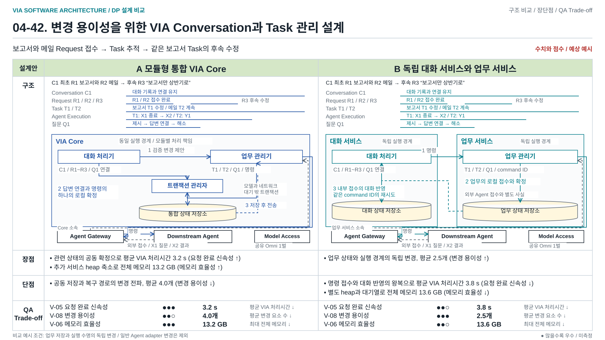

# 04-42. 서로 다른 대화와 업무 수명 — 통합 Core와 독립 서비스

> 2026-10-10 / Stage 4에서 정제한 Decision Point 유력 후보 / A/B 미선정 / 구현·모델 실행·품질 측정 없음
> [비교 가이드](./04-30-comparison-guide.md) / [품질 관점 V-01~13](./03-00-quality-scenarios.md#2-어떤-품질을-보고-있는가) / [발표 그림 모아 보기](./diagrams/choice42-review.html)

**A는 모듈화된 하나의 VIA Core에서 대화와 업무의 서로 다른 수명을 관리하고, 관련 로컬 상태를 함께 확정한다.**
**B는 VIA 내부의 대화 서비스와 업무 서비스가 각자의 상태와 실행 수명을 소유하고, 변경 요청과 접수 결과를 교환한다.**
**비교의 중심은 서로 다른 수명을 하나의 Core 안에서 관리할지, 독립된 상태·실행 소유자들이 협력하게 할지다. 공동 저장과 별도 접수는 이를 구현하는 구체적 협력 방식이다. B의 정상 사용상 주요 이익은 강한 A와의 추가 검토가 필요하다.**

## DP 배경 — 발표용 1페이지

[편집 가능한 draw.io](./diagrams/dp42-background.drawio) / [발표 삽입용 PNG](../../../presentations_files/dp-background/dp42-background.png) / [전체 지도와 배경 모아 보기](../../../presentations_files/dp-background/index.html)

처음 발화, 잠시 뒤의 진행 확인 발화, 보고서 완료 후의 수정 발화를 시간 순서로 표시한다. 한 번의 발화는 User Turn이며, 첫 발화는 독립적인 보고서 작성과 회의 안내 메일 초안 작성 Request로 해석한다. 후속 발화는 각각 보고서 진행 확인과 결론 수정 Request다. 모든 발화와 처리 기록을 하나의 Conversation 틀에 보관하므로 Conversation은 발화의 변환 결과가 아닌 이어지는 기록이다.

같은 시간 열 아래에 지속되는 보고서 Task와 별도 메일 Task를 배치한다. 최초 두 Task 생성 후 실제 작업을 Downstream Agent에 맡기는 Delegation과 개별 Agent Execution을 표시한다. 진행 확인은 이미 확인된 상태로 답변하는 사례이므로 새 실행이 없으며 보고서 작성 실행은 계속된다. 메일은 이 시점에 초안 작성이 완료되어 결과를 보관하고 마지막 시점에도 완료 상태와 결과를 유지한다. 보고서 작성 실행이 종료된 후 결론 수정 Delegation은 같은 보고서 Task의 새 Agent Execution에 연결되며 수정 Request 처리 완료 후에도 수정 실행은 진행 중이다.

시간 표시는 설명용 사건 순서이며 측정 시간이 아니다. 폴더와 시간 열은 공통 데이터 및 수명의 개념 표현으로 Component, 서비스 또는 process 배치가 아니다. 서로 다른 완료 시점, 관련 상태 연결 및 관리 SW 중단 후 복구에서 42의 관리 책임과 협력 설계 주제로 이어진다. A/B의 소유, 실행 경계 및 확정 방식은 아래 비교에서 다룬다.

위임 Request의 완료 표식은 VIA 로컬 접수가 아닌 외부 Downstream Agent의 접수 확인 후를 뜻한다. 상태 관리 책임 및 실행 경계가 이 장의 결정이며, 44의 사건 후속 실행 조직과 구별한다. 노란색 문구는 예방할 설계 위험이며 실제 관측된 실패나 측정 결과가 아니다. [다섯 설계 문제 지도](./diagrams/dp-background-overview.svg)에서 각 결정 범위를 먼저 구분한다.

## 1. 발표의 중심: 같은 기능, 다른 상태 소유와 실행 경계

[편집 가능한 draw.io](./diagrams/choice42-structure.drawio) / [발표 삽입용 PNG](./diagrams/choice42-structure.png)

메인 그림은 **같은 수명 → 같은 정식 Component → 다른 실행·확정 경계 → 예시 데이터와 실제 전달**을 한 장에서 읽는다. A/B는 같은 Interaction Manager, Request Controller, Request Interpreter, Response Manager, Task Manager, Agent Gateway와 Model Access를 사용한다. `대화 처리기`·`업무 관리기`라는 별도 Component를 추가하지 않는다. 공통 Component는 흰 바탕과 검정 테두리다. 다른 서비스에 배치된 공통 Component도 흰색으로 유지한다. 큰 Core/서비스 경계는 채우지 않고 A는 실선, B는 점선인 짙은 살구색 계열의 굵은 테두리로 실행과 상태 확정 범위를 구분한다. 책임과 동작이 다른 작은 내부 Module만 살구색으로 표시한다. 41과 같은 Legend를 사용하며 직각 박스는 논리 Component, 둥근 박스는 내부 Module, 원통은 저장 상태다. 실선 화살표는 요청과 전달, 점선 화살표는 응답과 반환이다. Component 포함 관계와 process 배치는 같은 개념이 아니다.

위쪽은 대화 C1·세 요청 R1/R2/R3·보고서 업무 T1·외부 실행 X1/X2·질문 Q1의 서로 다른 수명을 나타낸다. R1은 최초 위임, R2는 Q1 답변, R3는 결과 수정이다. 수명 선은 개념적 사건 순서이며 측정 시간이나 기록 삭제 시점이 아니다. 상세 수명과 C2 전환은 §2의 보충 그림을 따른다.

**그림의 정상 사례는 E4 답변이다.** 질문 Q1 “상반기로 할까요?”는 publication P1로 실제 제시된 상태다. 사용자가 C1으로 돌아와 u2 “응, 상반기로”라고 답하면 Request Controller는 Request Interpreter의 제안을 현재 Q1/T1/X1·P1·권한과 결합해 R2의 연결을 확정한다. Task Manager는 조회 시 `Q1=OPEN,v7`을 반환하고 답변 접수 시 `Q1=ANSWERED,v8`과 전달 명령 K1을 생성한다. 조회 전·접수 후의 예시 값이며 저장 schema를 동결한 것이 아니다.

A의 트랜잭션 관리자는 Request Controller의 `R2/u2→Q1→T1, P1 참조` 변경과 Task Manager의 `Q1 변경 + K1 전송 준비`를 같은 State Store transaction으로 확정한다. 성공이면 관련 변경 모두 반영, 충돌/실패이면 모두 미반영이다. B는 대화 저장소에 `R2=접수 대기, K1`을 먼저 저장하고 업무 서비스에 K1을 보낸다. 업무 측은 Q1 변경·K1·내부 접수 결과를 로컬 저장하고, 대화 측은 접수 결과를 자기 R2에 따로 반영한다. 같은 명령 ID로 접수 결과를 재조회하므로 응답 유실을 새 업무 시작으로 처리하지 않는다.

**저장된 K1, VIA 내부 접수, 외부 Agent의 실제 접수는 서로 다른 사실이다.** Task Manager와 Agent Gateway가 확인한 외부 접수 사실이 Request Controller에 돌아온 후, 게시가 허용된 P2 “상반기 조건 전달 확인”이 Response Manager로 간다. Response Manager는 Text/Voice 구성·게시·전달 원장을 소유하고 Interaction Manager에 `release(P2,output epoch)`를 보낸다. Interaction Manager는 실제 표시·재생 결과인 `receipt(P2,actual range)`를 반환한다. Response Manager가 이를 내구 기록하고 Request Controller는 Conversation에 실제 제시 참조를 반영한다. 이미 제시된 P1은 Q1 답변 연결의 근거이고 P2는 이번 접수 안내의 새 publication이다.

그림에서 Request Controller→Response Manager의 게시 허용과 Response Manager→Request Controller의 실제 제시 반환, Response Manager↔Interaction Manager의 release/receipt를 구별한다. Task Manager↔Agent Gateway↔Downstream Agent의 명령/외부 확인도 별도다. 모델 해석은 Request Interpreter, 필요한 응답 구성·음성 생성은 Response Manager가 같은 Model Access를 사용한다. Context·현재 Policy 조회와 모든 예외 계약은 본문에 공통으로 두며 이 그림에서 축약한다. 모든 Agent 알림에 새 발화나 새 semantic 모델 호출이 필요한 것은 아니다.

**60초 설명 원고:** “같은 질문에 상반기로 답하는 장면입니다. 두 안 모두 Request Controller가 답변과 질문·업무를 연결하고, Task Manager가 업무 질문과 전달 명령을 관리합니다. A는 관련 변경을 하나의 Core에서 함께 저장합니다. B는 대화와 업무가 각자 저장하고 K1 접수 결과로 연결합니다. 그 뒤 외부 Agent가 실제로 받았다는 사실을 확인해야 합니다. Response Manager는 이를 응답 P2로 구성하고 게시하며, Interaction Manager는 실제 표시·재생 결과를 돌려줍니다. 실제 제시 원장은 Response Manager, 답변 관계는 Request Controller의 책임입니다. 서비스 분리가 자연어 이해를 더 잘하게 만드는 것은 아니며, 정상 처리 왕복과 중간 상태의 비용이 생깁니다.”

**2026-10-08 사용자 리뷰 반영:** 이전 포괄 명칭은 전체 Architecture와 41의 정식 책임에 대응하기 어려웠고 실제 제시 기록의 소유도 흐렸다. 정식 명칭과 Response Manager/Interaction Manager 경로, Voice Runtime의 의미 및 관계·명령·전달 예시를 복원했다. A/B의 상태 확정·실행 수명 차이와 미선정/미측정 상태는 유지한다. 드문 중단·갱신을 제외하면 B의 주요 선택 근거는 크게 약해지며, 정상 사용에서 추가 비용을 정당화할 독립 운영 요구는 여전히 입증되지 않았다. 42는 상태 원본·확정·실행 소유, 44는 다음 실행을 진행시키는 중앙 조정/반응형 연결을 비교한다.

### 1.1 이 문서의 지위와 범위

- 사용자와의 33 논의에서 파생했지만, 원래 33의 중앙 의미 생산/업무별 actor 제안 비교를 대체하지 않는다. 33은 별도 미승인 논의로 보존한다.
- 사용자 지정에 따라 **30번대 주제 문서는 논의 대상, 40번대 주제 문서는 정제된 유력 Decision Point 후보**로 읽는다. 04-37은 기존 검토 기록이며 새 주제가 아니다. 번호는 최종 DP 선정이나 품질 승인을 뜻하지 않는다.
- 31의 지속 의미 구성, 41의 의미 해결 주체, 35의 저장 원본, 36의 권한 격리는 각각 별도 선택이다. 이 문서는 그 본문·도식·참조 Architecture를 바꾸지 않는다. 32는 주요 비교에서 제외된 상태를 유지한다.
- 두 안 모두 사용자 PC에서 실행할 수 있다. B의 서비스는 VIA 내부 소프트웨어이며 Downstream Agent가 아니다. 업무 계획·도구 선택·실제 작업은 외부 Agent 책임이다.

## 2. VIA에서 왜 중요한가: 하나의 대화가 하나의 실행은 아니다

같은 사용자가 다음 사건을 겪는다. 아래 E 번호는 사건도에서 그대로 사용한다.

| 사건 | 사용자와 시스템 | 남는 관계 |
| --- | --- | --- |
| E1 | 대화 C1에서 “이 자료로 보고서를 만들어줘.” Agent가 위임을 접수한다. | 요청 R1의 위임 처리는 끝나도 Task T1과 외부 실행 X1은 계속된다. |
| E2 | Agent가 “기간은 올해 상반기로 할까요?”라고 질문 Q1을 보낸다. | 질문은 X1에 연결되고 실제 제시 기록 P1은 C1에 남는다. |
| E3 | 사용자가 다른 대화 C2로 이동한다. | T1·X1·Q1은 유지된다. C2로 자동 이관하거나 다른 대화의 “응”을 Q1에 붙이지 않는다. |
| E4 | 사용자가 C1으로 돌아와 “응, 상반기로 해줘.”라고 답한다. | 실제 제시된 Q1과 현재 유효성을 확인해 답변을 전달한다. |
| E5 | Agent가 보고서 결과를 확정한다. | X1은 종료되고 T1은 결과와 함께 남는다. |
| E6 | “결론 부분만 짧게 바꿔줘.” | 같은 결과물 수정이므로 T1의 새 revision과 새 실행 X2를 연결한다. X1을 다시 실행하지 않는다. |

[편집 가능한 draw.io](./diagrams/choice42-lifetimes.drawio)

이 기능은 [참조 Architecture §5](../target-architecture/architecture.md#5-conversationturnrequesttaskexecution), [제어와 수명](../target-architecture/control-and-lifecycle.md), [기억과 Context 수명](../target-architecture/memory-and-context-lifecycle.md)에 근거한다. 현재 탐색의 P-06 복합 요청, P-07 Agent 연결, P-10 대화·업무 연속성, P-15 제공자 변화와 연결된다. 기존 참조의 Component 배치는 비교안의 제약이 아니다.

**데이터의 수명이 다르다는 요구와, 그 데이터를 관리하는 process의 수명을 분리한다는 선택은 구별한다.** A도 전자를 완전히 지원한다. B의 추가 선택은 후자와 독립적인 상태 확정 권한이다. 대화창 닫기, Voice 연결 종료, 대화 서비스 종료, Task 취소, 기록 삭제를 같은 사건으로 취급하지 않는다.

## 3. 공통 조건과 두 구조의 완결된 책임

### 3.1 같은 시작·끝과 강한 A

양안은 같은 원문·화면 근거·대화 기록·Agent capability·정책을 사용한다. 관련 Task는 정답으로 미리 제공하지 않는다. 같은 의미 해석 방식을 선택하고, Task 후보 조회·근거 보완·질문으로 같은 기능을 제공한다. 31/41의 선택을 고정한 채 42의 소유·실행 차이를 비교할 수 있지만, 통합 시 호출과 상태 채택 계약은 연결해야 한다.

현재 비교 조건은 [공통 실행 계약 40](./04-40-common-execution-contract.md)과 같다. VIA와 상태 owner는 사용자 PC에 있고, Interaction Manager의 Turn-Taking Control이 로컬 VAD를 수행한다. 음성/전사 역할과 의미 LLM은 클라우드 의존성이며 Model Access의 로컬 adapter를 통해 사용한다. 양안은 같은 provider/model/version·사용 범위·역할별 호출 조건을 사용한다. 모델의 임시 session/context는 업무 원본이 아니며, B에 추가 모델이나 자동 병렬 추론 이익을 부여하지 않는다. 전사가 별도 learned dependency이면 inventory·사용량·청구에 명시한다. 이전 참조 Architecture의 on-device Omni/로컬 ASR 배치는 이 비교의 필수 전제가 아니다.

A에는 내부 인터페이스, 업무별 요약·검색·cache, 부분 갱신, 비동기 event 처리, worker 격리, 내구 저장, background Core와 UI 재연결을 허용한다. **A의 의미 해석이 전체 업무 이력을 매번 입력받거나, 대화창을 닫으면 Task가 사라진다는 가정은 없다.** B에도 같은 최적화를 허용한다. A의 worker 분리는 Core의 최종 상태 권한을 자동으로 분리하지 않는다.

### 3.1.1 Interaction Manager·Response Manager·Request Controller와 Voice Runtime

이 문서의 용어 정리는 [참조 Architecture §4](../target-architecture/architecture.md#4-component와-상태-소유권), [직접 S2S 경로 §8](../target-architecture/architecture.md#8-s2s와-직접-응답), [응답 §13](../target-architecture/architecture.md#13-응답-전달), [배치 §14](../target-architecture/architecture.md#14-프로세스-배치fault-boundary)와 [44 §3.1](./04-44-continuous-interaction.md#31-공통-소유와-허용-경계)에 근거한다. 참조 Architecture 자체를 수정하거나 전체 구조를 선택한 것이 아니다.

| 책임 | owner | 예시 입력·출력 / 보유 상태 |
| --- | --- | --- |
| Voice/Text/device I/O와 시점별 화면·pointer·selection 관측 | Interaction Manager의 Channel I/O, Evidence Capture, Timeline & Buffer | audio/입력 revision·capture gap·근거 시각. 입력/관측 사실을 Request Controller에 전달. 지칭 의미·Task 관계·권한을 확정하지 않음 |
| 사용자 발화 여부·재생 세대·즉시 중단·실제 표시/재생 | Interaction Manager의 Turn-Taking Control와 Channel I/O | Response Manager의 release를 현재 epoch/발화 상태로 검사하고 receipt 반환. 새 발화 때 로컬 stop. 질문/Task 취소·답변 내용은 결정하지 않음 |
| 응답 내용 구성·게시 차례·현재성 확인·Text/Voice/알림·내구 전달 원장 | Response Manager | Request Controller의 허용 payload/source → 필요시 모델 구성 → release. receipt로 publication의 실제 범위 저장. Task/요청 의미 원본은 해당 owner에서 확인 |
| Conversation·Request Graph·의미 채택·정정·질문 답변 연결·게시/전송 admission | Request Controller | Request Interpreter 제안과 실제 제시 P1·질문 원본 Q1 → u2/R2→Q1→T1 연결. Response Manager의 actual receipt를 참조하며 원장을 대신 소유하지 않음 |

**대화 처리기라는 새 Component를 두거나 그 기능을 Interaction Manager/Response Manager에 몰아주지 않는다.** 정식 Request Controller의 기존 관계·제어 책임을 유지하고, 그 협력자인 Request Interpreter·Response Manager·Interaction Manager를 표시한다. 대화 서비스는 B의 배치·상태 확정 경계이며 하나의 거대한 대화 Component가 아니다.

**음성 실행 영역은 필요하지만 Voice Runtime이라는 새 Component를 추가하지 않는다.** microphone/playback·AEC·로컬 VAD·즉시 stop은 Interaction Manager 내부 Module의 기능이다. 음성/전사 API 연동과 의미 API 연동은 Model Access의 로컬 provider adapter 역할이고 실제 모델 weights는 클라우드에 있다. thread pool·비동기 executor·음성 실행 라이브러리는 실행 배치/기반 주석으로 표현하며 업무·대화 원본을 소유하지 않는다. Interaction Manager 전체를 음성 실행 영역과 동일시하지 않고 Text·화면 관측과 timeline 기능도 같은 Component 책임으로 유지한다. 42는 음성 모델 대안을 새로 도입하지 않는다.

### 3.1.2 로그와 관계 상태, 송수신·저장 예시

시간순 UI와 내부 관계 관리는 함께 가능하다. 내용별 대화 자동 분류나 Task별 대화방 생성은 요구하지 않는다. 사용자의 명시적 새 Conversation 경계는 유지한다. 다음 값은 E4 설명용 제안 데이터이며 최종 schema/측정 fixture가 아니다.

| producer → consumer / 저장 owner | 예시 데이터 | 의미 |
| --- | --- | --- |
| Interaction Manager → Request Controller | `C1,u2,input_revision,“응, 상반기로”,input_epoch` | 이번 답변 입력. 그 자체에 정답 Task를 붙이지 않음 |
| Task Manager → Request Controller, Request Interpreter의 해석 근거 | `T1,X1,Q1=OPEN,question_revision=7`와 실제 제시 `P1→Q1` 참조 | 업무 질문의 현재 사실과 사용자에게 실제 제시된 근거를 구분 |
| Request Interpreter → Request Controller | `answer_to=Q1,task=T1,answer=상반기,evidence=P1/u2` | 의미 후보. 현재 검사 후 채택 |
| Request Controller의 상태 | `R2/input=u2/answer_to=Q1/task=T1/presented_ref=P1` | 원문 로그 외에 어떤 요청·질문·업무에 연결됐는지, revision과 현재 처리 상태 보유 |
| Request Controller → Task Manager | `K1,R2,Q1,answer=상반기,expected_revision=7,input_epoch,permission_revision` | 조건부 답변 명령. 업무는 현재 원본으로 접수·거절·보류 |
| Task Manager / Agent Gateway | `Q1=ANSWERED,v8,K1=PENDING_SEND` → `K1=EXTERNAL_ACCEPTED` | 내부 저장·전송 준비·외부 확인을 다른 시점과 필드로 관리 |
| Request Controller → Response Manager | `P2,R2,T1,확인된 K1 외부 접수,“상반기 조건 전달 확인”,publication admission` | 허용한 사실과 응답 목표. 모델이 업무 사실을 새로 추측하지 않음 |
| Response Manager ↔ Interaction Manager | `release(P2,epoch)` / `receipt(P2,displayed/audible range,revision)` | 허용한 출력과 실제 전달 결과. 물리 재생·내구 기록은 원자적이지 않음 |
| Response Manager 저장 → Request Controller 참조 | `P1/Q1 실제 제시`, `P2 channel 상태/actual range` | 전달 원장은 Response Manager, Conversation/질문 focus 참조는 Request Controller 소유 |

Request→Task, 답변→질문, publication→질문/Request 및 요청 간 의존 관계는 단순 문자열 로그로 대체되지 않는다. 의미 관계는 Request Interpreter가 제안하고 Request Controller가 채택하며, 그 관계와 현재 상태를 명시적으로 저장한다. 필요한 근거만 모델에 주는 검색·요약은 양안 공통으로 가능하다.

### 3.2 A: 통합 Core, 정식 Component별 책임과 공동 확정

VIA Core 안에서 **Request Controller**는 Conversation·Turn·Request Graph·의미 채택·확인 질문/답변 관계를, **Task Manager**는 Task·Execution·Agent 질문·업무 명령의 의미를 소유한다. **Agent Gateway**는 명령 전송·외부 event 수신/조회와 전달 상태를 담당한다. **Request Interpreter**는 의미 후보와 근거를 제안하고 **Response Manager**는 응답 구성·publication·내구 실제 전달 원장을 소유한다. 각 owner는 자기 필드의 변경을 만들며 다른 owner의 의미를 임의로 바꾸지 않는다.

**트랜잭션 관리자**는 **State Store 내부 Unit-of-Work Module**이며 관련 owner의 검증된 변경 집합을 한 로컬 transaction으로 조합한다. 새 의미 판단 Component가 아니고 자연어를 해석하지 않는다. Q1 답변에서는 R2 연결과 Q1/명령 K1을 모두 반영하거나 모두 미반영한다. 관련 revision 충돌은 owner에게 돌려준다. 무관한 Task끼리 전역 잠금으로 직렬화하지 않으며 모델·네트워크 호출은 transaction 밖이다. 명령의 전송 직전 admission/hold 및 transmission 조건도 같은 원자 경계의 관련 owner 변경으로 조합한다.

P1/P2의 실제 표시·재생 자체는 transaction에 포함할 수 없다. **Response Manager의 실제 전달 기록은 receipt를 받은 뒤 별도로 저장**하며, 마지막 확인 밖의 전달은 UNKNOWN일 수 있다. 같은 State Store 사용과 상태 의미의 공동 소유를 혼동하지 않는다. Core는 UI/Voice 연결과 관계없이 background에서 업무를 추적할 수 있고, Core 전체 중단 때는 owner 처리가 함께 멈춘 뒤 내구 상태에서 복구한다. 외부 Agent 작업의 지속은 양안 공통이다.

### 3.3 B: 독립된 대화 서비스와 업무 서비스

**대화 서비스**에 Request Controller·Request Interpreter·Response Manager와 대화 상태 저장소를 배치하고, **업무 서비스**에 Task Manager·Agent Gateway와 업무 상태 저장소를 배치한다. 각 정식 Component의 상태 권한은 유지한다. Interaction Manager의 UI/음성 I/O와 Model Access의 클라우드 모델 연동은 공통이며, 입력 timeline과 서비스 간 입력 제어 계약은 배치에 맞게 연결한다. 두 서비스는 별도 process로 시작·종료할 수 있다. 저장소는 독립된 쓰기 권한·transaction·schema를 갖는 논리 저장소이며, 별도 장치·DB 서버가 필수라는 뜻은 아니다. 서로의 저장소에 직접 쓰거나 두 저장소를 하나의 transaction으로 묶지 않는다.

대화 서비스는 관련 업무를 API로 조회하고, 해석한 의도와 관련 버전·근거를 포함한 명령을 전달한다. 업무 서비스는 Task·질문·권한·입력 제어의 현재 조건을 검사하고 명령을 **접수·거절·보류**한다. 업무 서비스의 접수는 로컬 책임 인수이며 외부 Agent의 접수와 구별한다. Task 생성 때도 Request/command identity로 같은 명령이 하나의 Task에만 연결되게 한다.

업무 서비스는 자기 상태, 처리한 command ID와 접수 결과, 외부 전송 대기 명령, 반환 event를 같은 로컬 transaction으로 저장한다. 대화 서비스는 접수 결과를 자기 Request 상태에 따로 반영한다. 응답 유실 때 새 업무를 만들지 않고 같은 command ID로 접수 결과를 조회한다. 대화 쪽의 업무 표시 cache는 원본이 아니며 revision과 확인 상태를 갖는다.

대화 서비스 없이도 **접수된 Task의 외부 event 수신·조회·상태 추적·결과/질문 보관**은 계속된다. 사용자에게 새 질문을 제시하거나 미해석 의도를 결정하는 일, 아직 대화 서비스가 소유한 Request 의존 관계의 후속 해제는 기다린다. “VIA 전체가 계속 동작한다”거나 “사용자 답 없이 Agent가 계속 실행한다”고 주장하지 않는다.

### 3.4 상태·수명·권한 원장

| 상태 | 의미와 종료 | A의 owner / 보관 | B의 owner / 보관 |
| --- | --- | --- | --- |
| Conversation·Turn | 원문 입력·게시 참조·대화 연결. 연결 종료와 삭제는 다름 | Request Controller / 통합 저장소의 요청 영역 | Request Controller / 대화 저장소 |
| Request와 요청 간 의존 관계 | 직접 답변, 위임 접수, 확인/의존 대기. Task 완료와 다름 | Request Controller / 요청 영역 | Request Controller / 대화 저장소 |
| VIA 확인 질문·답변 관계·실제 질문 focus | Task가 없어도 가능. 실제 제시 확인과 유효 질문에만 답변 연결 | Request Controller / 요청 영역 | Request Controller / 대화 저장소 |
| publication·실제 표시/재생 원장 | 생성·허용·실제 전달 구별. channel별 상태와 불명 범위 보존 | Response Manager / 응답 영역 | Response Manager / 대화 저장소의 별도 owner 영역 |
| 장치 입력·출력 epoch·재생·로컬 stop | 현재 입출력과 짧은 근거/receipt buffer. 내구 publication 원본 아님 | Interaction Manager / 공통 입력·출력 구현 | 같은 Interaction Manager의 공통 구현 |
| Task·revision·결과 참조 | 사용자 업무 identity. 같은 결과 수정은 revision 증가 | Task Manager / 업무 영역 | Task Manager / 업무 저장소 |
| 외부 Execution 연결·관측 상태 | Agent source의 실행 사실과 확인 상태. X1/X2 구별 | Task Manager / 업무 영역 | Task Manager / 업무 저장소 |
| Agent 질문·허용 답변·만료 | Task/Execution에 연결. 실제 사용자 전달 사실과 다름 | Task Manager / 업무 영역 | Task Manager / 업무 저장소 |
| 명령·외부 전송 상태 | 로컬 접수, 외부 접수, 불명, 철회 구별 | Task Manager와 Agent Gateway의 각 필드 / 업무 영역 | 같은 두 owner의 각 필드 / 업무 저장소 |
| 실제 제시와 Agent 질문 연결 | Response Manager의 P1 기록을 Request Controller가 Q1과 연결하고 Task Manager 원본을 재검사 | 관련 owner 변경을 공동 확정 가능 | 대화의 Q1/revision/P1 참조와 업무 질문 원본을 접수 때 재검사 |

Task 조회는 후보 탐색용이다. 명령은 `command_id, request_id, conversation_id, expected_task_revision, question_id/revision, input_epoch, permission_revision, intent/evidence_refs` 중 해당 필드를 갖는다. `ACCEPTED / REJECTED / HELD`와 현재 revision·이유를 반환한다. 전송 응답 유실은 `UNKNOWN`으로 별도 표시한다. 이 필드들은 제안 계약이며 실제 외부 Agent가 모두 지원한다고 가정하지 않는다.

### 3.5 실행과 저장 계약을 바꾸는 내부 Module

| Component | A의 실행·저장 책임 | B의 실행·저장 책임 |
| --- | --- | --- |
| Request Controller | 채택 의미·입력 hold·명령 의도에 대한 자기 변경 집합을 공동 확정에 제공 | 대화 저장소에 의미·hold 의도·접수 대기와 명령 참조 저장. 업무 gate ACK·접수 결과를 따로 반영 |
| Task Manager / 업무 접수·전송 게이트 | Task/질문·명령 검증. 관련 admission/hold와 전송 조건을 공동 transaction에 제공 | 업무 저장소에서 control session/sequence·hold/release·명령 접수와 전송 조건 검사. 로컬 전송 게이트의 최종 권위 |
| Agent Gateway / 명령 전송·확인 | 검증한 transmission 변경 집합을 제공. 확정 후 외부 전송·조회·receipt 대응 | 같은 업무 저장소에서 transmission CAS 참여. 외부 전송·조회·receipt 대응. RC의 오래된 admission만으로 전송하지 않음 |
| State Store / 트랜잭션 관리자 | 관련 owner들의 검증된 변경을 한 Unit-of-Work로 공동 commit | 서비스별 독립 transaction을 지원. 대화/업무의 변경을 하나로 확정하지 않음 |

위 내부 기능은 새 Component나 모델 판단자가 아니다. Task Manager가 hold를 받아 업무 gate에 적용한 사실과 Request Controller가 hold 의도를 저장한 사실은 B에서 서로 다른 레코드다. Agent Gateway가 전송하는 것은 검증된 명령이며 자연어를 다시 해석하지 않는다. State Store는 저장 기술 Component이고, 상태의 의미 권한은 표의 owner에 남는다. B의 두 저장 scope는 각각의 State Store 구현/접근 범위이며 제3의 대화·업무 통합 상태 owner가 아니다.

42A의 공동 확정에도 무관한 Task의 비동기 처리와 worker 분리를 허용한다. 42B의 독립 transaction에도 각 서비스 내부 모듈화와 관련 명령의 원자적 검사를 허용한다. 모델·클라우드 API·Agent 네트워크 호출은 어느 안에서도 transaction 안에 두지 않는다.

### 3.6 수명·소유·협력의 핵심을 확대한 추가 발표 그림

[편집 원본](../../../presentations_files/dp-comparison/dp42-comparison.drawio) / [PNG](../../../presentations_files/dp-comparison/dp42-comparison.png). 기존 전체 MAIN과 수명/사건도를 유지하고 추가했다. 양안에 같은 Conversation·Request·Task 수명을 먼저 보여준 뒤, 상태 owner와 실행/저장 확정 경계, 실제 변경 집합/CommandIntent/AcceptanceReceipt를 비교한다. A의 트랜잭션 관리자는 State Store 내부이며 B의 업무 게이트는 Task Manager 내부다. 내부 접수와 외부 Agent 접수/실제 전달은 구별한다.

첫 독자를 위해 그림은 Input1/Request1/Task1/Question1/Command1/Publication1로 표시한다. 각각 본문 고정 Q1 답변 사례의 u2/R2/T1/Q1/K1/P1에 대응하는 설명용 ID이며 새로운 Component나 다른 의미가 아니다. 원통에는 상태 이름만 두고 관계/값은 접힌 데이터 예시에 표시한다. 공통 Request Interpreter/Model Access의 상세와 전체 호출/권한 경로는 MAIN과 공통 계약에 남겨 두었다. 하단 hold/ACK/CAS는 인계 제어의 보조 설명이고 세 층 비교를 대신하지 않는다.

## 4. 같은 사건을 끝까지 추적하기

[A draw.io](./diagrams/choice42-event-a.drawio)

[B draw.io](./diagrams/choice42-event-b.drawio)

사건도는 같은 E4 답변의 확정·외부 접수·실제 전달을 확대한다. E1~E6 전체는 수명 그림과 아래 표에서 추적한다. 공통 Model Access의 클라우드 모델 호출과 Agent Gateway는 각 서비스/모듈의 내부 경로로 축약한다. 별도 모델이나 외부 Agent의 판단을 생략해 얻은 호출 수 비교가 아니다. 그림 속 현재 상태 조회는 후보 해석용이며, 최종 확정/접수와 전송 조건 검사가 뒤따른다.

| 사건 | A의 상태 처리 | B의 상태 처리 | 같은 사용자 결과 |
| --- | --- | --- | --- |
| E1 신규 위임 | 의미/Task 연결/명령을 관련 owner가 검증하고 공동 확정. 이후 외부 접수 확인 | 대화 쪽 요청 저장 → 업무 쪽 명령·Task 접수 → 외부 접수 → 대화 Request 갱신 | 확인된 접수만 알린다. 작업 완료로 표현하지 않음 |
| E2 Agent 질문 | 업무 질문 저장 → 대화 전달 요청 → 실제 게시 기록 저장 | 업무 질문과 event 저장 → 대화가 수신/유효성 조회 → 제시 기록 저장 | 같은 질문을 C1에서 듣거나 봄 |
| E3 다른 대화 | C2 시작은 C1/T1 취소가 아님. 해당 대화의 제시 기록으로 답변 연결 | 같은 기능. 업무 원본은 그대로, 대화 서비스가 대화별 참조를 유지 | C2의 모호한 “응”은 Q1 승인으로 사용하지 않음 |
| E4 답변 | P1/Q1/X1 확인 후 답변 연결과 명령을 공동 확정 | 대화가 P1로 Q1을 특정 → 업무가 Q1/X1 현재 조건을 검사·접수 → 대화에 반영 | 유효한 답만 전달. Q1이 끝났으면 재확인/이미 종료 안내 |
| E5 결과 | Agent source를 업무 상태에 반영한 뒤 대화에 전달 | 업무 상태/결과 event 확정 → 대화가 조회·반영하고 전달 | 완료 범위와 결과를 같은 T1/C1에 연결 |
| E6 후속 수정 | 같은 결과물의 수정 판단 후 T1 revision과 새 X2 연결 | 대화가 T1 수정 명령 제출 → 업무가 현재 조건 확인 후 새 X2 연결 | 같은 업무를 이어가며 X1 이력을 유지 |

### 4.1 정정·철회·실패·재시작

| 사건 | A | B | 비용과 지원 한계 |
| --- | --- | --- | --- |
| 답변 직전 Agent가 질문 철회/실행 완료 | 공동 확정 시 Q/X revision 검사 | 업무 접수 시 Q/X revision 검사. 대화의 오래된 표시는 갱신 | B의 조회와 접수 사이 간극이 별도 경로. A도 외부 source 지연은 있음 |
| 사용자 새 발화 중 미전송 명령 | 입력 hold와 전송 상태 전이를 공통 로컬 확정 순서로 조정 | 업무 서비스의 전송 게이트가 입력 epoch/hold와 명령 전송을 직렬 판정. 아래 §4.2 적용 | 이미 전송한 작업은 자동 되돌리지 않음 |
| 취소/정정 | 미전송은 철회, 전송 후에는 같은 실행에 제어 명령 | 같은 결과. command 접수와 실제 외부 효력을 별도로 반환 | Agent가 취소/정정을 지원하지 않으면 불가/미확인 안내 |
| B 내부 응답 유실 | 내부 호출 실패는 저장 결과를 조회해 복원 | 같은 command ID로 업무 접수 결과 조회. 재접속으로 새 start를 만들지 않음 | 내부 중복 제거와 외부 idempotency는 서로 다른 계약 |
| Agent 접수 응답 유실 | 저장된 명령과 외부 상태를 조회 | 업무 서비스가 같은 조회 수행 | 외부 idempotent submit/status 조회가 없으면 자동 재위임하지 않음 |
| 대화 처리 owner process 중단 | Core process 중단이면 업무 추적도 중단. 저장 상태에서 복원 | 업무 서비스는 기존 Task의 수신·추적을 계속, 질문과 결과를 보관 | A의 UI만 중단한 사건과 B의 대화 서비스 중단을 비교하지 않음 |
| 업무 서비스 중단 | A에서는 같은 Core 장애 사건의 영향 범위로 평가 | 직접 대화는 가능한 범위에서 유지, 업무 변경은 보류. 복구 후 업무 원본 재조회 | 공유 OS/저장장치/모델 장애와 구별 |
| 결과 event 누락·역순·중복 | source revision/조회로 수렴 | 외부 수렴에 더해 서비스 간 cursor·event ID·snapshot 조정 | B의 전달 event는 업무 원본이 아니며 event sourcing 선택을 강제하지 않음 |
| 재시작·재접속 | 관련 저장 상태와 외부 실제 상태 확인 | 대화 저장의 command 참조 조회 → 업무 snapshot와 이후 event 연결 → 실제 제시 기록 대조 | 질문을 자동 재승인하지 않음. 마지막 event 수신이 실제 전달의 증거는 아님 |
| 대화 기록 삭제 | Task 취소와 구별해 관련 기록/참조/파생 cache를 처리 | 각 owner에 삭제 요청과 처리 결과를 추적. 미완료 삭제를 완료라고 표시하지 않음 | 현재 삭제·동의 계약 보존. 무조건 Task까지 삭제하지 않음 |

### 4.2 B의 입력 hold·업무 접수·전송·복구 프로토콜

다음은 44의 실행 연결과 결합할 수 있도록 상세화한 **설계 검토 계약**이다. 실제 구현·API 채택·시간 한도 동결이나 안전성 실험 완료가 아니다. [고정 사례 JSON](./contracts/dp42-handoff-examples.json)은 필드·owner·순서와 두 경합 결과를 함께 기록한다. 본문의 Q1/T1/K1은 각각 **보고서 기간 질문/보고서 업무/상반기 답변 전달 명령**이다. revision은 해당 레코드의 변경 번호이며 시각·측정값이 아니다.

#### 4.2.1 서로 다른 원본과 전송의 직렬점

- Interaction Manager는 발화/입력 시작·종료·전사 revision을 생산하고 로컬 stop를 수행한다. 새 입력이 취소인지, 어떤 Task를 바꾸는지는 정하지 않는다.
- Request Controller는 현재 의미·정정 범위·보존 조건·명령 의도를 대화 저장소에 기록한다. 미해결 입력에서는 보호 hold를 요청하며, 채택된 의미 뒤에만 업무 gate의 해제/정리를 요청한다.
- Task Manager의 업무 접수·전송 게이트는 control session/sequence, 적용된 hold와 업무 명령 조건을 업무 저장소에 소유한다. Agent Gateway와 같은 업무 transaction에서 전송 시작을 검증한다.
- Agent Gateway는 `PENDING → DISPATCHING` transmission CAS를 업무 저장소에 확정한 뒤 외부 전송을 수행한다. 이것이 B의 **로컬 전송 시작 선후를 정하는 지점**이다. RC 대화 저장과 하나의 transaction이 아니다.

`DISPATCHING`은 외부 Agent 접수 확인이 아니다. CAS 뒤 네트워크 호출 전 crash도 가능하므로 외부 효력을 확인할 수 없으면 UNKNOWN으로 남긴다. `EXTERNAL_ACCEPTED`는 외부 receipt/상태 조회로 확인한 별도 사실이다. CAS 뒤 전송 전 최신 조건을 재검사하여 보류할 수는 있지만, 정정/권한 철회를 이미 나간 외부 요청의 소급 차단으로 표시하지 않는다.

#### 4.2.2 control session·순서·ACK와 release

| 자료 | 고정 사례의 주요 필드 | 적용과 제한 |
| --- | --- | --- |
| Hold | conversation_id, control_session, control_sequence, input_epoch, reason | 새 입력을 해소할 때까지 미전송 효과 보호. reason은 INPUT_PENDING 등 코드 값이고 취소 의미가 아님 |
| HoldAck | conversation_id, control_session, applied_sequence, gate_revision, pending_held_commands, dispatch_started_commands, unknown_external_commands | **업무 gate에 저장된 사실**. ACK가 없으면 RC가 전송 차단 완료를 주장하지 않음 |
| CommandIntent | command_id, request_id, conversation_id, control_session, expected_gate_revision, input_epoch, meaning_revision, task/question expected revisions, permission_revision, kind, payload, evidence_refs | 채택된 의도의 조건부 명령. 같은 command ID의 다른 payload는 거절. provider 권한 확장 인자나 실행 코드를 넣지 않음 |
| ReleaseAndReconcile | reconciliation_id, conversation_id, control_session, control_sequence, expected_gate_revision, settled_input_epoch, meaning_revision, revoke_pending_commands, retain_pending_commands, new_command_intents | 현재 의미에 맞게 미전송 명령을 철회/유지/교체하고 gate를 해제하는 **업무 로컬 확정**. 대화 의미 채택과 공동 확정은 아님 |
| AcceptanceReceipt | conversation_id, request_id, command_id, acceptance_status, task/question accepted revisions, transmission_state | 내부 접수/거절/보류와 외부 전송 상태를 구별. event/receipt ID로 재조회·중복 제거 |

업무 authority가 발급하는 `control_session`은 재연결 세대이며, 같은 세대의 `control_sequence`는 단조 증가한다. 이미 적용한 같은 sequence와 같은 payload의 재수신은 같은 결과를 반환한다. 동일 sequence의 다른 payload, 현재보다 오래된 sequence/session, 다른 gate revision의 release는 충돌/오래된 요청으로 거절한다. **늦은 release가 더 새로운 hold를 해제하지 않는다.** control session은 외부 Agent의 idempotency를 대신하지 않는다.

명령의 안정된 ID와 payload 대응은 업무 접수 레코드에서 검사한다. 이미 접수한 명령의 동일 재수신은 저장된 접수 결과를 반환하며, 최신 transmission 상태는 원본 조회/새 event로 확인한다. 최초 AcceptanceReceipt에 PENDING이라고 적혀 있었다는 이유로 현재 EXTERNAL_ACCEPTED를 미전송으로 되돌리지 않는다. 정정된 payload는 새 명령 ID와 기존 명령/Execution 참조로 제출한다.

입력 control은 일반 응답 준비 queue/credit과 구별된 경로로 전달한다. 다만 발화의 물리적 시작 → RC 수신/hold 의도 저장 → 업무 gate 적용/ACK 사이에 전달 시간이 있다. **게이트가 수락한 hold 이후에는 아직 PENDING인 관련 명령을 DISPATCHING으로 바꾸지 않는다.** 물리적 발화 시작 순간부터 전역 무지연 차단했다고 주장하지 않는다. 양안 모두 capture/hold 요청·적용/CAS/외부 send의 시각을 남겨 경합 구간을 평가한다.

ASR final, 발화 종료나 준비 timeout만으로 release하지 않는다. RC가 의미·정정·제어 관계를 해소해야 하고 WAIT_USER/WAIT_CONTEXT/지원 밖 입력이면 보호 hold를 유지한다. release의 새 명령과 관련 질문/Task revision도 업무 owner가 재검사한다. 충돌이면 업무 transaction은 미반영이고 RC가 현재 원본으로 정정·보류·필요한 재해석을 한다. 임의로 모든 질문을 다시 LLM에 보내지는 않는다.

#### 4.2.3 정상 인계와 같은 정정의 두 경합 결과

1. RC는 Q1의 실제 제시 P1과 현재 업무 snapshot을 이용해 “상반기로”의 의미를 채택하고, 대화 저장소에 R2=접수 대기와 K1의 의도·revision을 기록한다.
2. TM은 K1과 Q1/Task/gate/권한 조건을 검사하고, 업무 저장소에 질문 답변 접수와 K1·접수 결과·반환 event를 같은 transaction으로 저장한다. Q1=ANSWERED는 로컬 답변 접수이며 Agent 수신 완료가 아니다.
3. RC는 AcceptanceReceipt를 자기 저장소에 반영한다. TM/AG는 이후 업무 transaction에서 현재 gate·명령·질문/Task/권한 조건을 검사하고 DISPATCHING CAS를 확정한다.
4. 네트워크 전송 뒤 확인한 외부 receipt가 돌아오면 업무 원본에 저장하고 대화로 전달한다. RM은 확인된 사실로 P2를 준비/게시하고 IM의 actual receipt를 별도로 기록한다.

사용자가 “아니, 하반기로 해줘”라고 정정하는 경우도 같은 명령을 다른 payload로 덮어쓰지 않는다.

| 로컬 확정 순서 | 업무 원본과 후속 처리 | 사용자에게 말할 수 있는 사실 |
| --- | --- | --- |
| **hold가 K1 DISPATCHING보다 먼저** | HoldAck가 K1=HELD를 확인. 새 의미의 reconciliation이 미전송 K1을 REVOKED로 남기고 별도 K2=하반기 답변으로 교체. 질문/업무 현재 revision 검사를 함께 수행 | “앞 답변은 전송 보류/철회했고 하반기로 전달을 준비 중” 또는 실제 외부 접수 후 전달 확인 |
| **K1 DISPATCHING이 hold보다 먼저** | HoldAck에 K1의 전송 시작/불명 상태를 포함. CAS를 미전송으로 되돌려 숨기지 않음. 외부 조회/receipt 뒤 같은 Execution에 정정/취소 제어 명령을 연결 | 이미 상반기 답변 전송을 시작했고 정정 효력을 확인 중. Agent capability가 부족하면 불가/미확인 안내 |

두 경우 모두 새 입력을 이해하기 전 기존 업무를 자동 취소하지 않는다. 새 K2는 새 업무 start가 아니라 기존 질문/Execution에 대한 정정 명령일 수 있다. 해당 Agent가 수정/취소나 답변 교체를 지원하지 않으면 이를 지원한 것처럼 처리하지 않는다.

#### 4.2.4 유실·지연·중단과 재연결

| 조건 | 확인·복구 경로 |
| --- | --- |
| command/hold/reconciliation 응답 유실 | 같은 command/control sequence/reconciliation ID로 적용 결과를 조회하거나 재시도. timeout을 거절/미실행으로 바꾸거나 새 start ID를 만들지 않음 |
| 외부 전송 timeout | 해당 command/attempt를 UNKNOWN으로 유지. Agent status 조회 또는 idempotent submit 계약이 있으면 같은 ID로 확인/복구. 둘 다 없으면 자동 재위임 금지 |
| timeout 뒤 늦은 외부 접수 | 원래 command/attempt에 귀속. 뒤늦은 receipt로 새 Task를 생성하지 않음. 최신 정정 의도와 실제 Execution을 대조해 후속 제어 |
| 대화 서비스 crash/연결 단절 | 업무의 기존 Agent event 수신·조회·보관은 계속. control 연결 상실/유효기간 만료를 **감지한 뒤** 대화 연계 신규 전송은 보호 hold. 새 의미 해석·질문 제시·대화 소유 의존 해제는 대기 |
| 업무 서비스 재시작 | 보호 gate로 시작. 새 control session 협상과 대화/업무 snapshot·pending 명령·DISPATCHING/UNKNOWN 외부 상태를 대조한 뒤 RC의 명시적 reconciliation으로 선택적 해제 |
| 대화 서비스 복구 | 기존 pending command ID로 업무 접수 결과/snapshot 조회 → snapshot watermark 이후 event 연결 → RM 실제 전달 원장 대조. stale release/답변 자동 재승인 금지 |
| event 누락/역순/중복 | event ID·업무 revision·cursor를 사용. 중간 gap이면 authority snapshot 재조회. 받은 event나 빈 cache를 현재 원본/known-empty로 간주하지 않음 |
| 업무 접수 뒤 대화 반영 전 crash | 업무 결과는 유지, RC가 같은 ID 조회로 접수 사실을 반영. 외부 업무를 rollback했다고 주장하지 않음 |

control heartbeat/lease를 쓰면 단절 감지 전 유효 구간과 업무 서비스의 monotonic clock 기준 만료를 명시해야 한다. 지금 lease 길이/허용 차단 지연 수치는 동결하지 않았다. 단절을 감지하기 전에 시작된 dispatch는 조회/정정 대상이며, 감지 이후 보호 상태라는 보장과 구별한다. 확인 불가 상태에서 자동 release하지 않는다.

#### 4.2.5 정책·후속 요청·실제 출력

현재 권한은 양안 공통 Policy Manager 원본으로 검사한다. 오래된 permission cache나 모델 confidence만으로 신규 제공/전송하지 않는다. 조회 불가면 보류한다. 권한 조회 뒤 외부 효과까지 경합이 남으므로 철회 신호가 각 gate에 적용된 revision/ACK와 이미 DISPATCHING인 명령을 구별한다. 적용 확인 전 전역 차단 완료, 이미 제공한 자료의 소급 회수는 주장하지 않는다. 별도 process 자체는 보안 격리가 아니다.

“보고서가 끝나면 그걸로 발표자료를 만들어줘”의 미실행 후속 Request 관계는 B에서도 RC가 소유한다. 업무 결과 event 뒤 현재 조건·사용자 의도를 확인해 새 명령을 제출한다. 대화 서비스 중단 중에는 해제가 지연된다. 이를 업무 서비스가 독립 해제하도록 옮기려면 Request orchestration 권한까지 이동하는 별도 혼합 설계로 기록한다.

RM의 내구 실제 전달 원장은 대화 서비스에 남는다. 업무 접수/전송 ACK로 질문 focus나 사용자 승인을 만들어내지 않는다. IM의 실제 표시·재생 receipt를 RM이 저장한 뒤 RC가 질문 focus/답변 관계에 참조한다. 준비 완료·게시 허용·실제 전달은 서로 다른 사건이다.

### 4.3 44A/B·41A/B·45A/B와의 연결

| 조합 경계 | 42A | 42B |
| --- | --- | --- |
| **44A 중앙 continuation** | Dispatcher가 owner의 공동 확정 결과와 job/receipt를 회수하여 다음 실행 | 같은 Dispatcher가 hold ACK·내부 접수/조회·외부 결과·실제 receipt를 별도 완료 사건으로 회수. 기다리는 동안 input/다른 작업은 계속 |
| **44B 단계별 window/join** | Stage 출력 뒤 owner 공동 확정 결과가 다음 입력. stream 도착 자체는 commit 아님 | 업무 AcceptanceReceipt/hold ACK가 typed completion 입력. Publication Join도 현재 authority/실제 receipt를 확인. delayed gate event 하나만으로 전송/게시 허가하지 않음 |
| **41A 모델 주도 / 41B frame·코드 완성** | RI의 임시 해석과 RC의 채택 원본 구별 | 동일. RI/RC는 대화 서비스 안에 유지. Task 조회 불가/변경이면 job 보류·부분 재조회/재해석이며 별도 전체 의미 owner를 추가하지 않음 |
| **45A 원본 조합 / 45B 게시 근거 읽기** | CM이 원본 owner의 bounded read/revision·권한 계약을 사용 | 동일한 읽기를 service API/유효 게시 view로 수행. 업무 조회 cache나 Memory 게시가 TM 원본/command 접수 권위를 대신하지 않음 |

42A에서 admission/hold·command 조건·transmission CAS는 관련 owner가 검증한 변경을 공동 로컬 확정할 수 있다. 42B에서는 대화의 의도 저장, 업무 gate 적용/명령 접수, RC의 결과 반영을 분리하며 위 프로토콜을 사용한다. **사용자 기능을 같은 목표로 두지만 전역 원자성이 같다고 주장하지 않는다.** 추가 왕복·접수 대기·경합 창과 UNKNOWN·재조회는 B의 실제 비용이며 응답성·상태 정확성·복구 평가에 포함한다.

이 계약의 문서화는 조합 경계를 설명한 것이다. 실제 protocol 구현·model run·시간/비용 측정과 모든 조합의 동작 검증은 수행하지 않았다.

## 5. Agent 기술 변화와 정상 운영에서 차이가 남는가

[편집 가능한 draw.io](./diagrams/choice42-change.drawio)

| 같은 변화/운영 조건 | 강한 A | B | 판정 |
| --- | --- | --- | --- |
| 상태 polling → event stream, 사용자 의미 동일 | Agent Gateway와 필요한 업무 내부 상태만 변경 가능 | 업무 서비스 내부의 같은 부분만 변경 가능 | B의 변경 요소 수 우세를 주장할 수 없음. 대화 코드는 양안 모두 유지 가능 |
| 외부 실행 ID·후속 요청 protocol 변경, VIA Task 의미 동일 | 내부 API 뒤로 숨기면 업무 영역에 국소화 가능 | 업무 서비스가 내부 binding/schema로 흡수 | B는 독립 상태 권한을 유지하지만, A도 모듈화되면 코드 변경 범위는 비슷할 수 있음 |
| 업무 저장/런타임 교체 중 대화 owner를 계속 운영해야 함 | process 전체 재시작이 필요한 변경이면 대화도 영향. 동적 교체/worker로 줄이는 혼합 가능 | 계약 호환 시 업무 서비스만 교체, 대화는 업무 요청 보류를 안내하며 계속 동작 가능 | B의 독립 운영 이익. 모든 Agent 교체가 무중단이어야 한다는 새 요구는 아님 |
| Request Controller의 갱신 중 기존 Task의 Agent event를 계속 수신해야 함 | Core 재시작이면 추적 중단 구간. UI만 바꾸는 경우는 영향 없음 | 업무 서비스와 그 저장소가 유지되면 수신·추적 계속 | B의 명확한 조건부 정상 운영 이익. 외부 Agent 작업 지속 자체는 공통 |
| 새로운 승인 의미·질문 종류가 사용자 상호작용을 바꿈 | 대화·업무 계약을 함께 변경 | 공개 서비스 계약과 양쪽 상태/전달도 변경 | B도 변화가 전파됨. “모든 Agent 발전을 업무 안에 가둔다”는 주장은 기각 |

**V-08은 process 수가 아니라 의미 있는 변경의 파급으로 평가한다.** 독립 배포·재시작의 이익은 운영 중 반응·완료·설치와도 연결되지만 같은 이익을 독립 점수처럼 중복 합산하지 않는다. 본 문서는 B의 모듈성 우위를 보장하지 않는다. 안정된 서비스 계약과 독립 상태 수명이 필요한 변화에서 그 효과를 검토할 수 있는 비교다.

## 6. 13개 품질 관점: 구조 원인, 기대 효과, 대가

우선순위와 의미는 [03-00 §2](./03-00-quality-scenarios.md#2-어떤-품질을-보고-있는가)가 원본이다. 아래는 설계 가설이며 별점·측정값·가중 총점이 아니다. 상위 기능 품질을 충족한다고 가정해 표에서 생략하지 않는다.

| 관점 | 구조 원인과 이익·비용 | 직관적 판단 / 반증·관찰 조건 |
| --- | --- | --- |
| **V-01 기능 정확성** | A는 대화/업무 관련 revision과 변경을 함께 확정. B는 업무 원본을 기준으로 명령을 접수하지만 두 원본 사이 stale view와 접수 중 상태가 생김 | 의미 해석 우열 없음. 같은 질문 철회·동시 수정에서 잘못된 Task/질문 연결, 거짓 접수·완료 표시를 비교. B의 검사는 A도 가능 |
| **V-02 기능 적절성** | 양안 모두 질문·업무를 보존. B는 대화 서비스 재연결 때 업무 원본을 재조회하지만 추가 충돌 재확인이 생길 수 있음 | 우열 미정. 충분한 근거에도 사용자에게 재설명·수동 연결을 요구하는지 확인 |
| **V-03 기능 완전성** | 동일한 독립 수명과 후속 수정 지원. B의 대화 중단 중 업무 관측은 유지되지만 미해제 Request와 사용자 질문 제시는 대기 | 정상 기능 동등을 설계 목표로 둠. 대화 중단을 “전 기능 계속”으로 과장하지 않음 |
| **V-04 상호작용 반응성** | A는 내부 조회·공동 확정 경로. B는 IPC·접수/조회·재검사가 추가되고 별도 queue를 둠 | 낮은 부하에서는 A 유리 가설. 추가 시간의 크기는 미측정. 부하 분리 이익이 왕복 비용을 넘으면 판단 변경 |
| **V-05 VIA 귀속 요청 완료 시간** | A는 동기화 단계가 적음. B는 업무 이벤트 처리와 대화 실행을 분리하지만 의존 후속 해제는 대화 서비스에 의존 | 짧은 경로 A 유리 가능, 높은 event 부하에서는 조건부 B. Agent 내부 실행·사람 대기는 이익으로 계산하지 않음 |
| **V-06 자원 활용성과 수용량** | B는 별도 process heap·대기열·event 전달·표시 cache를 유지. A도 queue/저장은 필요 | 자원 부담 A 유리 가설. 수용량 우열은 별도. 클라우드 모델 조건은 같으며 로컬 모델 weights 복제 절약 주장은 없음 |
| **V-07 결함 허용성과 복구성** | B의 대화 owner 장애가 업무 owner에 직접 전파되지 않음. B 자체의 IPC/재연결 실패도 추가 | 독립 process 장애에서 B 유리 후보. 공유 OS/디스크/모델 장애에는 자동 우위 없음. A worker 격리와도 대조 |
| **V-08 변경 용이성과 모듈성** | B의 독립 schema/API/runtime은 대화와 업무의 결합을 제한. A의 내부 모듈/API도 같은 Agent 변경을 흡수 가능 | 주요 비교 축. §5의 변화별 영향으로 판정하며 B 무조건 우세 아님. 공통 계약 변화에서는 B의 버전 호환 비용 증가 |
| **V-09 분석 및 시험 용이성** | B는 서비스 단독 시험/대체가 쉬우나 분산 사건 추적·부분 실패 시험이 필요. A는 통합 상태의 원인 추적이 쉬움 | 단독 시험과 전체 추적의 교환. command/request/question correlation 보존 여부 확인 |
| **V-10 기밀성** | 저장 owner는 달라도 동일 OS 권한이면 침해 격리는 동일하지 않음. B의 전달 복사·삭제 확인 경로가 늘 수 있음 | 현재 우열 없음. 36의 권한 격리 이익을 중복 차용하지 않음 |
| **V-11 상호운용성과 공존성** | 같은 Agent capability를 동일 의미로 번역해야 함. B의 protocol 지원 수가 자동 증가하지 않음 | 상호운용 우열 없음. 다른 앱과의 자원 경합은 실제 process/queue 조건으로 확인 |
| **V-12 조작 용이성과 사용자 오류 방지** | 같은 UI/질문/취소를 제공. B의 접수 중·불명·동기화 중 상태를 사용자에게 오해 없이 전달해야 함 | 우열 미정. 로컬 접수를 외부 접수/완료로 표시하거나 오래된 질문에 답하게 하면 실패 |
| **V-13 설치 용이성** | B는 서비스 시작/종료·버전 협상·부분 갱신을 관리. 한 설치 패키지로 감출 수 있음 | A 단순성 이익 가능. B는 호환 범위에서 독립 갱신 이익. 사용자 단계와 부분 실패 복구로 판단 |

### 6.1 정확성 이익을 부풀리지 않는 기준

대화 기록과 현재 업무 사실을 구분해 필요한 맥락만 모델에 제공하는 것은 양안 공통으로 가능하다. 같은 모델 입력과 추론 조건이면 process 분리 자체에 의미 정확도 이익을 부여하지 않는다. B의 마지막 검사가 잘못된 명령을 거절한 결과와 모델이 처음부터 올바르게 해석한 결과도 구별한다. 반대로 상태 owner·revision·전달 계약의 차이가 사용자에게 잘못된 상태를 보여주면 이는 V-01의 실제 회귀다.

### 6.2 요청 이해 정확도·VIA 응답 시간·모델 호출 비용

| 사용자 검토 축 | 물리적 영향 경로 | 현재 판단 |
| --- | --- | --- |
| 요청 이해 정확도 | 같은 원문·근거·모델 입력이면 해석 능력은 동일 조건. B의 업무 snapshot/접수 간 변경은 재검사·보류·필요한 재해석을 유발할 수 있음 | process/서비스 분리 자체의 이해 정확도 이익 없음. 잘못된 질문/Task 연결·오래된 승인/결과 게시·충돌 후 정정은 기능 정확성의 회귀로 평가 |
| VIA 응답 시간 | A 내부 조회·관련 공동 commit 대 B IPC/직렬화·대기 저장·업무 접수·대화 반영·원본 재확인 | 직접 관련. 음성 최종 전달은 공통 Response Manager/Interaction Manager 대기까지 포함. 외부 Agent 작업 시간과 사용자 답변 대기는 VIA 계산 지연과 구분 |
| 모델 호출 비용 | 같은 Request Interpreter/Response Manager와 클라우드 모델/provider 조건. 접수·동기화·receipt 반영은 코드로 처리 가능 | 기본 호출 수/입력 토큰 감소 이익 없음. stale/충돌 재해석·폐기 및 동일 목표의 clarification/정정 반복이 생기면 추가 비용에 포함. B의 별도 process heap은 모델 호출 비용과 구별 |

동일 입력 revision의 기본 해석/구성 조건은 맞추고, 사용자 목표와 완료 조건을 고정한 상태에서 추가 재해석·폐기·확인 질문·실제 게시까지의 왕복을 비교해야 한다. 무조건 B에서 모델을 다시 호출하거나 각 서비스가 추가 모델 호출/context를 무조건 갖는다고 가정하지 않는다. 이 분석은 새 모델 실행·호출 예산 동결·측정 결과가 아니다.

### 6.3 현재 다섯 QA 묶음과 연결한 관찰 경로

공동 QA 정의 검토안 03-02 `03-02-quality-attribute-definitions.md`(별도 세션 작성 중)의 정의·집계·확정 상태를 유지한다. 42만 다른 정확성 지표나 새 승자를 만들지 않고, 위 V-01~13과 함께 실제 경로를 확인한다.

| QA 묶음 | 42의 관찰 경로 / 조건부 trade-off |
| --- | --- |
| 요청 처리 정확성 | 올바른 답변/Task 연결·보존 조건은 양안 공통 의미 판단. 공동 확정 또는 접수 대기/반영 사이의 질문 철회·hold·late acceptance가 잘못된 전달/상태 안내로 이어지는지를 같은 사용자 정답 조건으로 평가 |
| 응답속도 | A의 내부 공동 commit 대 B의 의도 저장→업무 접수→대화 반영과 hold ACK/reconciliation. 짧은 정상 경로는 A 유리 가설. 독립 업무 event 수신/운영 이익은 그 조건이 실제 있을 때만 평가하고 A의 비동기 worker도 허용 |
| 모델 사용 비용 | 양안 같은 기본 호출 역할. B의 IPC/저장은 모델 비용이 아님. 충돌로 실제 필요한 재해석·확인 질문·늦은 폐기/재시도와 cloud voice/semantic 사용량은 포함 |
| 변경 용이성 | A 내부 API로도 일반 Agent protocol 변화 국소화. B는 안정된 계약 아래 업무 owner/runtime/schema를 독립 변경할 때 이익, 공통 의미 계약이 바뀌면 양 서비스·호환/이행을 함께 변경 |
| 메모리 사용량 | A도 queue/inbox/cache를 사용. B의 추가 process heap·두 owner의 명령 참조·event/outbox·projection·수신 backlog/직렬화 buffer를 공통 메모리 관측 범위에 포함. 클라우드 weights를 로컬 메모리 절감으로 계산하지 않음 |

실패·접수 불명·지원 밖 명령을 빠른 완료나 저비용 성공으로 분모에서 숨기지 않는다. 같은 외부 Agent profile과 input/정정 사건을 사용하며, 외부 업무 실행 시간·사람 답변 대기를 VIA 내부 계산의 속도 차이로 바꾸지 않는다. 비용·메모리/왕복·복구의 예상 방향은 미측정 설계 가설이다.

## 7. 실제 구현에서 확인한 것과 VIA에 새로 설계한 것

공식 저장소를 2026-10-05에 읽고 아래 commit으로 고정했다. 실행·설치·벤치마크하지 않았다. 두 제품의 대화/실행 개념을 VIA의 Conversation/Task/Execution과 일대일 대응시키지 않는다. **독립 런타임의 실현 가능성과 접속 계약을 참고한 것이며 VIA의 두 업무 원본 분리나 품질 우위를 입증하지 않는다.**

| 근거 | 확인한 사실 | VIA에서 활용 / 한계 |
| --- | --- | --- |
| [Cline SDK Architecture, commit 39ff2359](https://github.com/cline/cline/blob/39ff2359f7e08231281539696e48a166ce49270c/sdk/ARCHITECTURE.md#runtime-flows) | LocalRuntimeHost와 Hub runtime, local persistence, authority runtime을 멈추지 않는 attach/detach를 설명 | A의 영구 저장을 약화하지 않고 B의 연결 수명 분리를 참고. Agent loop 자체를 VIA 안으로 가져오지 않음 |
| [Cline HubRuntimeHost 구현](https://github.com/cline/cline/blob/39ff2359f7e08231281539696e48a166ce49270c/sdk/packages/core/src/hub/runtime-host/hub-runtime-host.ts#L1283) | run.abort, session.detach, session.delete가 별도 연산. dispose는 client capability도 정리 | 연결 종료/취소/삭제 구별. 클라이언트가 제공하던 도구까지 항상 계속 사용할 수 있다는 증거는 아님 |
| [OpenHands LocalConversation, commit b66c7243](https://github.com/OpenHands/software-agent-sdk/blob/b66c724361571aa5c982883173c71b04739b247d/openhands-sdk/openhands/sdk/conversation/impl/local_conversation.py#L210) | local 실행도 conversation ID와 상태/event persistence를 지원 | 독립 저장·복원이 B 전용이 아니라는 강한 A의 근거 |
| [OpenHands RemoteConversation 구현](https://github.com/OpenHands/software-agent-sdk/blob/b66c724361571aa5c982883173c71b04739b247d/openhands-sdk/openhands/sdk/conversation/impl/remote_conversation.py#L369) | event reconcile, 서버 권위 상태 재조회, attach, 기본 delete_on_close=False | B의 조회/재연결 비용과 상태 권한을 참고. workspace/server 종료까지 무관하게 실행이 지속된다는 보장은 아님 |
| [OpenHands Conversation 공식 설명](https://docs.openhands.dev/sdk/arch/conversation) | 같은 API 아래 local/remote 구현을 workspace 선택으로 전환 | 이미 두 runtime을 구현했다면 전환 설정은 작을 수 있음. API/HTTP 추가만으로 중대한 재설계를 주장하지 않는 반례. 웹 문서는 조회 시점 자료 |

제품 구조의 일부를 참고한 설계 판단과 코드에서 확인한 사실을 구별했다. 추가 연구 논문이 없어도 이 정도의 실제 코드 근거로 실행·상태 경계의 현실성을 논의할 수 있다. VIA에서 필요한 분리된 Request/Task 소유권, 입력 hold, 정책·삭제 전파는 본 문서의 설계안이며 위 제품이 검증해 준 기능이 아니다.

## 8. 가장 싼 양방향 전환과 혼합안에 대한 판정

| 시도 | 얻는 것 / 남는 차이 | 판정 |
| --- | --- | --- |
| A의 UI만 별도 실행하고 Core를 background로 유지 | 대화창/Voice 연결과 업무 수명 분리. 대화 owner와 업무 owner는 여전히 같은 Core | 이 요구만으로는 B 불필요. A의 정당한 기본 보완 |
| A 내부에 업무 API와 protocol adapter 도입 | 일반 Agent 추가·교체를 국소화. shared-state transaction과 공동 process는 유지 | V-08의 상당 부분을 얻음. B의 변경 우위를 약화하는 강한 반론 |
| A의 Agent Gateway만 worker로 분리 | 외부 SDK/native 연결 실패 격리. Task 원본과 최종 변경 권한은 Core에 남음 | 충분히 유력한 혼합안. 대화 owner 중단 중 Task 추적 owner가 계속되는 B와는 차이 |
| A → B: 업무 원본/접수 권한을 독립 서비스로 이전 | 공동 확정 대신 명령 ID·접수 결과·독립 저장·projection·재연결·입력 게이트 계약 필요 | 단순 포장보다 실질적 처리 변경. 이미 이 계약을 갖춘 A라면 추출 비용은 작아짐 |
| B 두 서비스를 같은 process에 배치 | IPC 비용 일부 감소. 별도 owner·접수·transaction 구조는 유지 가능 | 배치 혼합안. 공통 확정 구조 A로 자동 전환되는 것은 아님 |
| B → A: 같은 transaction으로 조합 | 중간 접수 상태 일부 축소. owner 변경 집합과 공동 확정/복구 경로를 다시 연결 | 모듈·Agent adapter·의미 해석 재사용 가능. 대규모 재작성이나 비가역성은 보장하지 않음 |
| 독립 process지만 공유 DB를 직접 쓰고 공동 transaction 사용 | process 격리 일부와 통합 확정 유지. schema/잠금/배포 결합이 남음 | 별도 유력 혼합. process 수만으로 순수 B라고 부르지 않음 |

기능 개발비는 어느 안에도 필요한 Task/질문/재연결 구현을 뜻한다. 상태 이행비는 진행 업무를 새 owner/schema에 옮기는 작업이며 새 설치에서는 줄어든다. 핵심 재설계비는 공동 확정과 독립 접수 사이의 변경이다. 이 세 비용을 합쳐 “B로 가기 어렵다”고 주장하지 않는다. 양방향 모두 기존 분리 수준에 따라 작아질 수 있으며, 전환 난이도 자체를 목표로 삼지 않는다.

**작성자 판정:** 서로 다른 책임·저장 권한·확정·실행 수명을 가진 실제 Architecture 비교다. 다만 B의 모듈성은 강한 A 대비 조건부이며, 독립 운영이 필요하지 않은 환경에서는 내부 모듈/API 보완으로 충분하다. 따라서 42를 유력 후보로 정리하되 최종 주요 DP 선정과 A/B 승자는 미선정으로 둔다. 상자 수나 전환 개발량만으로 주요 비교 자격을 확정하지 않는다.

## 9. 어떤 조건에서 선택하며, 무엇이 주장을 반박하는가

| 선택 | 적극적인 선택 이유 | 포기하거나 지불하는 것 | 주장을 뒤집는 조건 |
| --- | --- | --- | --- |
| A | 대화/업무가 긴밀히 협력하고 공동 변경이 많음. 짧은 응답 경로와 PC 자원 효율을 중시. 모듈/API로 기술 변화를 충분히 흡수 | Core owner의 공동 실행·복구 수명. 독립 갱신 요구에 추가 설계 필요 | 공동 process 수명이 실제 운영을 자주 막고 worker/API 보완으로 해결되지 않음 |
| B | 안정된 VIA 업무 계약 아래 Agent 기술·업무 저장/runtime을 독립적으로 발전시켜야 함. 대화 owner 갱신/중단 중에도 업무 관측을 유지할 가치가 큼 | IPC·독립 접수·동기화·버전 호환·전송 게이트 비용. 대화가 필요한 후속 처리까지 독립화되지는 않음 | A에서도 같은 변경 범위와 필요한 운영 독립성을 저렴하게 달성하거나, B의 계약이 매번 대화까지 바뀌거나, 상위 기능/시간 회귀가 큼 |

**발표에서 주장할 것:** 같은 수명 기능을 서로 다른 상태 권한과 실행 경계로 구현한다. 통합 조정과 독립 운영에는 실제 비용 교환이 있다.

**발표에서 주장하지 않을 것:** B가 더 똑똑하다, process를 나누면 자동으로 빠르다, 모든 Agent 교체가 B 안에서 끝난다, A는 대화를 닫으면 업무가 사라진다, B는 대화 서비스 없이 모든 후속 업무를 계속한다.

심사 질문에 대한 짧은 답:

- “A도 모듈화하면 되지 않나?” — 가능하다. 일반 Agent protocol 변경은 양안 모두 국소화할 수 있다. B는 업무 상태 권한과 실행 수명까지 독립 운영할 필요가 있을 때 선택한다.
- “왜 서비스 둘인가?” — 대화의 의도·제시 기록과 업무의 접수·외부 실행 관측을 독립 owner로 운영하기 위해서다. 단순 UI 분리만 필요하면 A로 충분하다.
- “B는 모델도 복제하나?” — 아니다. 음성 역할과 의미 역할의 클라우드 모델 구성은 양안 공통이다. 서비스 분리 때문에 의미 모델을 하나 더 호출하지 않는다.
- “정확도는 누가 좋은가?” — 현재 의미 정확도 우위를 주장하지 않는다. 상태 확정/접수 경쟁에서 같은 사용자 결과를 유지하는지 비교한다.
- “B가 무중단 업데이트를 보장하나?” — 아니다. 계약·상태 호환이 되는 변경에서 분리된 owner를 유지할 수 있다. 의미 계약이 바뀌면 조정된 갱신이 필요하다.

## 10. 작성·검수 범위

여섯 작성 작업은 동일 사례와 범위 정의, owner/확정/실행 설계, 싼 전환·혼합 반론, V-01~13 인과 검토, 실제 코드 근거 고정, 발표 도식·본문 작성이다. 이는 프로젝트 전체의 Stage 5/6 진행이나 구현·측정 승인이 아니다.

도식은 [전용 생성기](../../../../scripts/architecture/generate_lifecycle_ownership_diagrams.py)에서 같은 좌표·문자·연결 모델로 SVG/draw.io를 만든다. 메인 비교도는 16:9 2560×1440, 나머지도 발표에 옮기기 쉬운 16:9로 작성한다. [작성자 검수 기록](./04-42-lifecycle-review.md)에 실제 발견한 문제, 수정, 검증 한계와 완료 결과를 남긴다. 사용자 수용·독립 심사·측정된 우위는 별개다.
