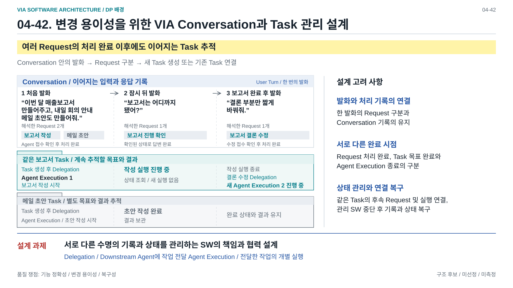
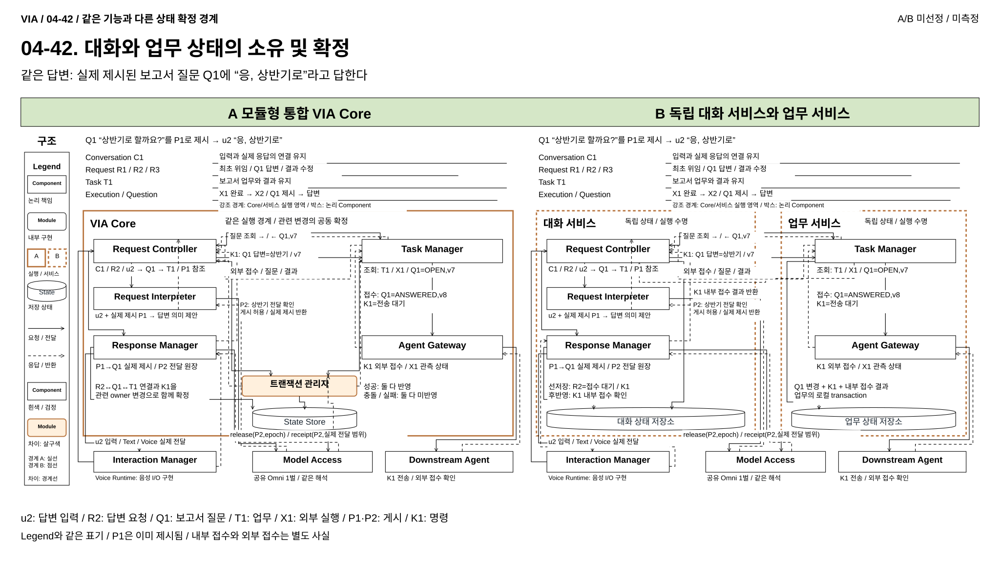
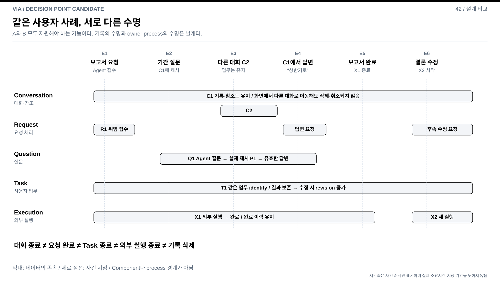
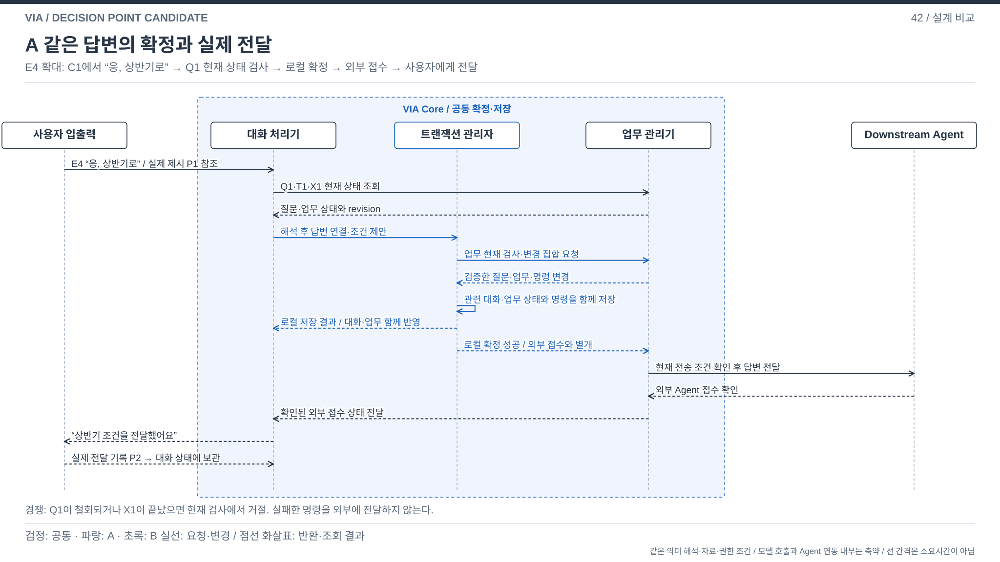
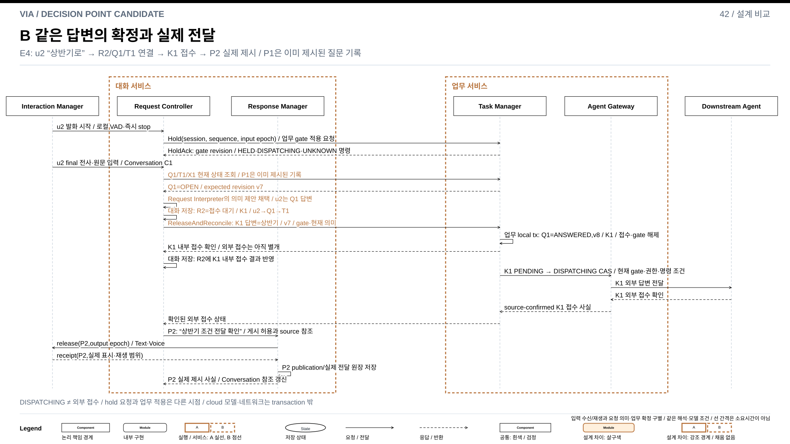
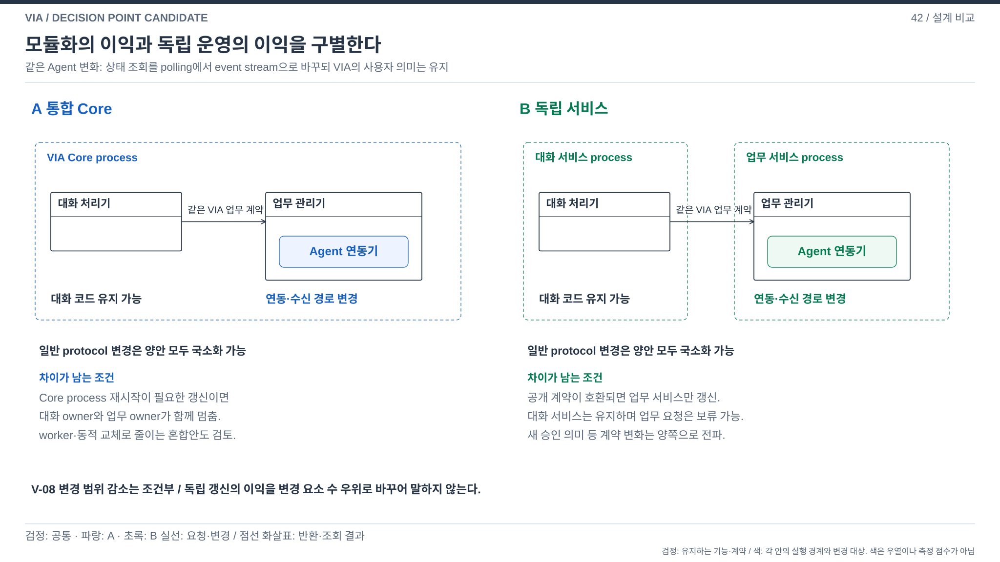

# 04-42. 서로 다른 대화와 업무 수명 — 통합 Core와 독립 서비스

> 2026-10-05 / Stage 4에서 정제한 Decision Point 유력 후보 / A/B 미선정 / 구현·모델 실행·품질 측정 없음
> [비교 가이드](./04-30-comparison-guide.md) / [품질 관점 V-01~13](./03-00-quality-scenarios.md#2-어떤-품질을-보고-있는가) / [발표 그림 모아 보기](./diagrams/choice42-review.html)

**A는 모듈화된 하나의 VIA Core에서 대화와 업무의 서로 다른 수명을 관리하고, 관련 로컬 상태를 함께 확정한다.**
**B는 VIA 내부의 대화 서비스와 업무 서비스가 각자의 상태와 실행 수명을 소유하고, 변경 요청과 접수 결과를 교환한다.**
**비교의 중심은 서로 다른 수명을 하나의 Core 안에서 관리할지, 독립된 상태·실행 소유자들이 협력하게 할지다. 공동 저장과 별도 접수는 이를 구현하는 구체적 협력 방식이다. B의 정상 사용상 주요 이익은 강한 A와의 추가 검토가 필요하다.**

## DP 배경 — 발표용 1페이지

[편집 가능한 draw.io](./diagrams/dp42-background.drawio) / [발표 삽입용 PNG](../../../presentations_files/dp-background/dp42-background.png) / [전체 지도와 배경 모아 보기](../../../presentations_files/dp-background/index.html)

처음 발화, 잠시 뒤의 진행 확인 발화, 보고서 완료 후의 수정 발화를 시간 순서로 표시한다. 한 번의 발화는 User Turn이며, 첫 발화는 독립적인 보고서 작성과 회의 안내 메일 초안 작성 Request로 해석한다. 후속 발화는 각각 보고서 진행 확인과 결론 수정 Request다. 모든 발화와 처리 기록을 하나의 Conversation 틀에 보관하므로 Conversation은 발화의 변환 결과가 아닌 이어지는 기록이다.

같은 시간 열 아래에 지속되는 보고서 Task와 별도 메일 Task를 배치한다. 최초 두 Task 생성 후 실제 작업을 Downstream Agent에 맡기는 Delegation과 개별 Agent Execution을 표시한다. 진행 확인은 이미 확인된 상태로 답변하는 사례이므로 새 실행이 없으며 보고서 작성 실행은 계속된다. 메일은 이 시점에 초안 작성이 완료되어 결과를 보관하고 마지막 시점에도 완료 상태와 결과를 유지한다. 보고서 작성 실행이 종료된 후 결론 수정 Delegation은 같은 보고서 Task의 새 Agent Execution에 연결되며 수정 Request 처리 완료 후에도 수정 실행은 진행 중이다.

시간 표시는 설명용 사건 순서이며 측정 시간이 아니다. 폴더와 시간 열은 공통 데이터 및 수명의 개념 표현으로 Component, 서비스 또는 process 배치가 아니다. 서로 다른 완료 시점, 관련 상태 연결 및 관리 SW 중단 후 복구에서 42의 관리 책임과 협력 설계 주제로 이어진다. A/B의 소유, 실행 경계 및 확정 방식은 아래 비교에서 다룬다.

위임 Request의 완료 표식은 VIA 로컬 접수가 아닌 외부 Downstream Agent의 접수 확인 후를 뜻한다. 상태 관리 책임 및 실행 경계가 이 장의 결정이며, 44의 사건 후속 실행 조직과 구별한다. 노란색 문구는 예방할 설계 위험이며 실제 관측된 실패나 측정 결과가 아니다. [다섯 설계 문제 지도](./diagrams/dp-background-overview.svg)에서 각 결정 범위를 먼저 구분한다.

## 1. 발표의 중심: 같은 기능, 다른 상태 소유와 실행 경계

[편집 가능한 draw.io](./diagrams/choice42-structure.drawio) / [발표 삽입용 PNG](./diagrams/choice42-structure.png)

메인 그림은 **같은 사례의 서로 다른 수명 → 소유·실행 경계 → 정상 답변의 협력 방식**을 읽는 16:9 한 장이다. A는 왼쪽 칸, B는 오른쪽 칸 안에서 수명과 구조를 완결한다. 각 칸 위쪽에서 요청 R1은 위임 접수 후 끝나지만, 대화 C1 기록·답변 대기 Q1·Task T1·외부 실행 X1은 각각 유지되거나 종료된다. 후속 수정은 T1을 유지하면서 X2를 시작한다. 이는 양안 공통 요구이며 B만의 능력이 아니다. 선의 길이는 사건 순서를 설명하며 측정 시간이 아니고, R1/X1/Q1의 종료는 기록 삭제를 뜻하지 않는다. 장점·대가·선택조건은 본문에서 다루며 메인 그림에 넣지 않는다.

하단에 같은 C1/R1/T1/X1·X2/Q1을 다시 적어 상단의 수명을 실제 소유자에 연결한다. **A는 대화·업무의 상태를 구분한 채 하나의 Core 실행 경계에서 관리하고, B는 각 서비스가 자기 상태 권한과 독립 실행 수명을 소유한다.** A의 내부 모듈화를 없애거나 B에 별도의 Omni 의미 해석기를 추가하지 않는다. 트랜잭션 관리자는 A의 공동 저장 수단으로 작게 배치하며, 소유 구조 전체를 대신하는 주인공으로 사용하지 않는다.

**검정은 같은 기능과 의존성, 파랑은 A의 통합 소유·협력 경계, 초록은 B의 독립 소유·협력 경계**다. 점선 테두리는 process 경계, 둥근 상자는 Module, 원통은 내구 상태다. 굵은 선은 답변 처리의 주요 경로이고, 가는 선은 조회·추론·반환이며 점선 화살표는 반환·외부 알림이다. 양쪽의 입력·모델·Agent 표시는 서로 배타적인 두 안에서 같은 의존성을 반복한 것이며, 한 실행에서 Omni를 복제한다는 뜻이 아니다. Model Access와 입력 인식 등의 공통 내부는 축약했다. 화살표의 1~6은 아래 처리 경로 번호다.

메인 그림의 번호는 경로를 구분한다. 1 답변 입력, 2 답변 변경 제안/명령, 3 대화의 답변 연결·대기 상태 저장, 4 업무의 질문 상태와 전송 명령 저장, **5 외부 Agent의 접수·진행·질문·결과 알림**, 6 사용자 전달이다. **이 답변에서 A는 3·4를 같은 로컬 transaction으로 조합하고, B는 각 owner가 따로 확정한다.** 관련 질문·업무 조회는 가는 왕복 경로로 따로 표시한다. 조회 응답·VIA 내부 접수 결과·외부 Agent 알림도 서로 다른 반환 경로다. 번호는 모든 요청의 시간 순서나 전체 작업의 직렬화를 뜻하지 않는다. B는 명령 전에 대기를 저장하고 내부 접수 응답 후 다시 대화 상태를 갱신하므로 3번 경로를 둘 이상의 시점에 사용한다. 배경 Agent event도 새 발화 없이 5번 경로로 들어온다.

| 그림의 반환 경로 | A | B | 의미·방향 |
| --- | --- | --- | --- |
| 조회 응답 | 업무 관리기 → 대화 처리기 | 업무 서비스 → 대화 서비스 | 관련 질문·업무 조회에 대한 현재 상태. B의 같은 명령 ID 접수 결과 재조회도 이 경로. 조회만으로 명령을 접수한 것은 아님 |
| 로컬 저장 결과 / VIA 내부 접수 결과 | 트랜잭션 관리자 → 대화 처리기·업무 관리기 | 업무 서비스 → 대화 서비스, ‘VIA 내부 접수 결과 (4 저장 후)’ 별도 화살표 | A는 관련 변경의 공동 저장 결과를 직접 받으므로 동일 사실의 업무→대화 재통보를 필수로 추가하지 않음. B는 내부 접수 결과를 받아 대화 저장소에 따로 반영. 외부 접수를 뜻하지 않음 |
| 5 Agent 알림 | 업무 관리기 → 대화 처리기 | 업무 서비스 → 대화 서비스 | 외부 Agent의 실제 접수·진행·질문·결과. 메인 답변 흐름에서는 ‘확인된 외부 Agent 접수’를 대표로 표시. 양안 공통 경로이며 내부 저장 결과와 다름 |

5번은 정보의 생산·전달 방향에 따라 업무→대화다. 사용자의 답변·정정·취소는 대화→업무의 2번 제안/명령 경로를 사용한다. 따라서 협력 전체는 양방향이며, 모든 입력이 5번 알림을 기다려야 하거나 모든 알림에 별도 발화가 선행해야 한다는 뜻은 아니다.

**그림의 정상 사례는 E4 답변이다.** 다른 대화에서 C1으로 돌아와 “응, 상반기로 해줘”라고 답한다. 양안 모두 실제 제시된 Q1과 T1/X1·권한의 현재 유효성을 확인한다. A의 대화 처리기는 답변과 제시 기록의 연결을, 업무 관리기는 Q1 변경과 답변 전송 명령을 제안한다. 트랜잭션 관리자는 검증한 두 변경을 함께 저장하며 전부 반영하거나 전부 미반영한다. B는 대화에 답변 전달 대기를 저장하고 업무 측에 조건부 명령을 보낸다. 업무 측이 Q1·전송 명령·VIA 내부 접수 결과를 자기 저장소에 반영한 뒤, 대화 측이 내부 접수 결과로 답변 요청을 갱신한다. 두 저장소의 반영 시점은 다르며, 응답 유실 때 같은 명령 ID의 접수 결과를 조회한다. E4의 답변 요청은 종료된 최초 요청 R1을 다시 여는 것이 아니다. 양안 모두 로컬 저장·내부 접수와 외부 Agent의 실제 접수는 별개이며, 확인된 외부 사실을 사용자에게 전달한 뒤 실제 게시 기록을 남긴다.

**60초 설명 원고:** “보고서를 부탁하고 다른 대화로 이동해도, Agent의 질문과 보고서 업무는 남아 있어야 합니다. 두 안 모두 위쪽의 서로 다른 수명을 지원합니다. 이제 돌아와 ‘상반기로 해줘’라고 답하는 장면을 보겠습니다. 왼쪽 A는 하나의 Core 안에서 대화 담당과 업무 담당이 나뉩니다. 답변 연결과 질문·전송 명령의 변경을 함께 저장합니다. 오른쪽 B는 두 서비스가 자기 상태를 각각 소유합니다. 대화 쪽이 전달 대기를 남기고 명령하면, 업무 쪽이 검사하고 저장한 다음 내부 접수 결과를 돌려줍니다. 대화 쪽은 이를 자기 기록에 반영합니다. 양쪽 모두 외부 Agent가 실제로 받았다는 사실은 별도로 확인합니다. 비교할 것은 같은 기능을 한 Core의 공동 확정으로 연결할지, 독립된 소유자 사이의 명령과 접수로 연결할지입니다.”

**2026-10-05 사용자 리뷰:** 갱신·재시작은 드문 조건부 사례이므로 B를 선택할 대표 이유로 앞세우지 않는다. 메인 그림은 정상 요청에서 발생하는 저장·접수 구조를 설명한다. 이를 더 명확하게 그렸다는 사실이 B의 중요한 정상 사용상 이익을 확보했다는 뜻은 아니다. 독립 상태 소유가 강한 A보다 어떤 반복적인 변경·운영에서 유리한지는 추가 설계 판단이 필요하며, 병행 처리·의미 정확도·반응성 이익을 새로 가정하지 않는다. §5의 갱신 사례는 조건부 참고로 유지한다.

**후속 중심 확인:** 42는 중앙 Omni 해석과 분산 Omni 해석을 비교하는 주제가 아니다. 사용자의 질문을 근거로 A를 모든 일을 하는 단일 모듈로 다시 정의하려 한 답변은 철회했다. 현재 정의는 A의 내부 모듈화와 B의 독립 상태·실행 소유를 유지한다. 메인 그림의 수명·소유·협력 세 층은 이 정의를 설명하는 것이며 새로운 설계 대안을 도입한 것이 아니다.

### 1.1 이 문서의 지위와 범위

- 사용자와의 33 논의에서 파생했지만, 원래 33의 중앙 의미 생산/업무별 actor 제안 비교를 대체하지 않는다. 33은 별도 미승인 논의로 보존한다.
- 사용자 지정에 따라 **30번대 주제 문서는 논의 대상, 40번대 주제 문서는 정제된 유력 Decision Point 후보**로 읽는다. 04-37은 기존 검토 기록이며 새 주제가 아니다. 번호는 최종 DP 선정이나 품질 승인을 뜻하지 않는다.
- 31의 지속 의미 구성, 41의 의미 해결 주체, 35의 저장 원본, 36의 권한 격리는 각각 별도 선택이다. 이 문서는 그 본문·도식·참조 Architecture를 바꾸지 않는다. 32는 주요 비교에서 제외된 상태를 유지한다.
- 두 안 모두 사용자 PC에서 실행할 수 있다. B의 서비스는 VIA 내부 소프트웨어이며 Downstream Agent가 아니다. 업무 계획·도구 선택·실제 작업은 외부 Agent 책임이다.

## 2. VIA에서 왜 중요한가: 하나의 대화가 하나의 실행은 아니다

같은 사용자가 다음 사건을 겪는다. 아래 E 번호는 사건도에서 그대로 사용한다.

| 사건 | 사용자와 시스템 | 남는 관계 |
| --- | --- | --- |
| E1 | 대화 C1에서 “이 자료로 보고서를 만들어줘.” Agent가 위임을 접수한다. | 요청 R1의 위임 처리는 끝나도 Task T1과 외부 실행 X1은 계속된다. |
| E2 | Agent가 “기간은 올해 상반기로 할까요?”라고 질문 Q1을 보낸다. | 질문은 X1에 연결되고 실제 제시 기록 P1은 C1에 남는다. |
| E3 | 사용자가 다른 대화 C2로 이동한다. | T1·X1·Q1은 유지된다. C2로 자동 이관하거나 다른 대화의 “응”을 Q1에 붙이지 않는다. |
| E4 | 사용자가 C1으로 돌아와 “응, 상반기로 해줘.”라고 답한다. | 실제 제시된 Q1과 현재 유효성을 확인해 답변을 전달한다. |
| E5 | Agent가 보고서 결과를 확정한다. | X1은 종료되고 T1은 결과와 함께 남는다. |
| E6 | “결론 부분만 짧게 바꿔줘.” | 같은 결과물 수정이므로 T1의 새 revision과 새 실행 X2를 연결한다. X1을 다시 실행하지 않는다. |

[편집 가능한 draw.io](./diagrams/choice42-lifetimes.drawio)

이 기능은 [참조 Architecture §5](../target-architecture/architecture.md#5-conversationturnrequesttaskexecution), [제어와 수명](../target-architecture/control-and-lifecycle.md), [기억과 Context 수명](../target-architecture/memory-and-context-lifecycle.md)에 근거한다. 현재 탐색의 P-06 복합 요청, P-07 Agent 연결, P-10 대화·업무 연속성, P-15 제공자 변화와 연결된다. 기존 참조의 Component 배치는 비교안의 제약이 아니다.

**데이터의 수명이 다르다는 요구와, 그 데이터를 관리하는 process의 수명을 분리한다는 선택은 구별한다.** A도 전자를 완전히 지원한다. B의 추가 선택은 후자와 독립적인 상태 확정 권한이다. 대화창 닫기, Voice 연결 종료, 대화 서비스 종료, Task 취소, 기록 삭제를 같은 사건으로 취급하지 않는다.

## 3. 공통 조건과 두 구조의 완결된 책임

### 3.1 같은 시작·끝과 강한 A

양안은 같은 원문·화면 근거·대화 기록·Agent capability·정책을 사용한다. 관련 Task는 정답으로 미리 제공하지 않는다. 같은 의미 해석 방식을 선택하고, Task 후보 조회·근거 보완·질문으로 같은 기능을 제공한다. 31/41의 선택을 고정한 채 42의 소유·실행 차이를 비교할 수 있지만, 통합 시 호출과 상태 채택 계약은 연결해야 한다.

입력 수신/인식, Model Access, 공유 on-device Omni 한 벌, Context 조회, 권한 확인은 공통 기능이다. 역할별 session과 KV 상태는 분리할 수 있고, B에 추가 모델이나 병렬 추론 속도 이익을 부여하지 않는다. 독립 Streaming ASR의 비용도 공통 조건으로 유지한다.

A에는 내부 인터페이스, 업무별 요약·검색·cache, 부분 갱신, 비동기 event 처리, worker 격리, 내구 저장, background Core와 UI 재연결을 허용한다. **A의 의미 해석이 전체 업무 이력을 매번 입력받거나, 대화창을 닫으면 Task가 사라진다는 가정은 없다.** B에도 같은 최적화를 허용한다. A의 worker 분리는 Core의 최종 상태 권한을 자동으로 분리하지 않는다.

### 3.2 A: 통합 Core, 모듈별 책임과 공동 확정

VIA Core 안의 **대화 처리기**가 사용자 Request·대화 참조·VIA 확인 질문·실제 제시 기록을 관리한다. **업무 관리기**가 Task·Execution·Agent 질문·업무 명령을 관리하며, **Agent 연동기**가 외부 protocol을 번역하고 전송·event 수신·조회 결과를 제공한다. 업무 내부 reasoning은 하지 않는다.

**트랜잭션 관리자**는 각 owner가 검증한 관련 변경 집합을 하나의 로컬 트랜잭션으로 저장하는 Unit of Work다. 두 변경을 모두 반영하거나, 저장 실패 시 둘 다 반영하지 않는다. 이전 이름 ‘공동 확정기’보다 저장의 원자성을 직접 나타내도록 바꿨다. 하나의 Core라는 이유로 반드시 별도 모듈이 필요한 것은 아니며, 현재 A가 선택한 저장 책임을 도식화한 것이다. 업무 의미나 자연어를 다시 해석하는 중앙 모델이 아니다. 다른 owner의 변경 의미를 임의로 결정하지 않으며, 관련 revision이 바뀌면 전체 변경을 거절해 owner에게 돌려준다. 무관한 Task끼리 하나의 전역 잠금으로 직렬화하지 않는다. 네트워크·모델 호출은 transaction 밖이다. B에도 각 저장소의 로컬 트랜잭션이 있지만 두 저장소를 함께 확정하는 관리자는 없다.

예를 들어 Q1의 답변 처리에서 대화 처리기는 P1과 답변 연결을, 업무 관리기는 Q1·X1의 유효성과 답변 명령을 제안한다. 트랜잭션 관리자가 관련 로컬 상태와 전송 대기 명령을 함께 저장한다. Agent 연동기는 저장된 명령을 현재 조건에 맞게 전달한다. Agent 접수가 확인되어야 사용자에게 그 접수 사실을 알린다.

Core가 계속 실행되면 UI/Voice 재연결과 관계없이 업무를 추적한다. Core process 전체가 중단되면 대화·업무의 소유 처리는 함께 멈추고 내구 상태에서 복구한다. 외부 Agent의 작업은 양안 모두 별도로 계속될 수 있다.

### 3.3 B: 독립된 대화 서비스와 업무 서비스

**대화 서비스**가 대화 처리기와 대화 상태 저장소를, **업무 서비스**가 업무 관리기·Agent 연동기와 업무 상태 저장소를 소유한다. 두 서비스는 별도 process로 시작·종료할 수 있다. 저장소는 독립된 쓰기 권한·transaction·schema를 갖는 논리 저장소이며, 별도 장치·DB 서버가 필수라는 뜻은 아니다. 서로의 저장소에 직접 쓰거나 두 저장소를 하나의 transaction으로 묶지 않는다.

대화 서비스는 관련 업무를 API로 조회하고, 해석한 의도와 관련 버전·근거를 포함한 명령을 전달한다. 업무 서비스는 Task·질문·권한·입력 제어의 현재 조건을 검사하고 명령을 **접수·거절·보류**한다. 업무 서비스의 접수는 로컬 책임 인수이며 외부 Agent의 접수와 구별한다. Task 생성 때도 Request/command identity로 같은 명령이 하나의 Task에만 연결되게 한다.

업무 서비스는 자기 상태, 처리한 command ID와 접수 결과, 외부 전송 대기 명령, 반환 event를 같은 로컬 transaction으로 저장한다. 대화 서비스는 접수 결과를 자기 Request 상태에 따로 반영한다. 응답 유실 때 새 업무를 만들지 않고 같은 command ID로 접수 결과를 조회한다. 대화 쪽의 업무 표시 cache는 원본이 아니며 revision과 확인 상태를 갖는다.

대화 서비스 없이도 **접수된 Task의 외부 event 수신·조회·상태 추적·결과/질문 보관**은 계속된다. 사용자에게 새 질문을 제시하거나 미해석 의도를 결정하는 일, 아직 대화 서비스가 소유한 Request 의존 관계의 후속 해제는 기다린다. “VIA 전체가 계속 동작한다”거나 “사용자 답 없이 Agent가 계속 실행한다”고 주장하지 않는다.

### 3.4 상태·수명·권한 원장

| 상태 | 의미와 종료 | A의 owner / 보관 | B의 owner / 보관 |
| --- | --- | --- | --- |
| Conversation·Turn·실제 제시 기록 | 대화·입력·실제 전달 근거. 연결 종료와 삭제는 다름 | 대화 처리기 / 통합 저장소의 대화 영역 | 대화 서비스 / 대화 저장소 |
| Request와 요청 간 의존 관계 | 직접 답변, 위임 접수, 확인/의존 대기. Task 완료와 다름 | 대화 처리기 / 대화 영역 | 대화 서비스 / 대화 저장소 |
| VIA 확인 질문 | Task가 없어도 생성 가능. 답변·철회·만료로 종료 | 대화 처리기 / 대화 영역 | 대화 서비스 / 대화 저장소 |
| Task·revision·결과 참조 | 사용자 업무 identity. 같은 결과 수정은 revision 증가 | 업무 관리기 / 업무 영역 | 업무 서비스 / 업무 저장소 |
| 외부 Execution 연결·관측 상태 | Agent source의 실행 사실과 확인 상태. X1/X2를 구별 | 업무 관리기 / 업무 영역 | 업무 서비스 / 업무 저장소 |
| Agent 질문·허용 답변·만료 | Task/Execution에 연결. 실제 사용자 전달 사실과 다름 | 업무 관리기 / 업무 영역 | 업무 서비스 / 업무 저장소 |
| 명령·외부 전송 상태 | 로컬 접수, 외부 접수, 불명, 철회, 결과를 구별 | 업무 관리기와 Agent 연동기의 각 필드 / 업무 영역 | 업무 서비스의 각 모듈 / 업무 저장소 |
| 실제 제시와 Agent 질문의 연결 | 어느 질문을 어느 대화에서 실제로 제시했는지의 참조 | 관련 owner 변경을 공동 확정 가능 | 대화 쪽의 Q ID/revision 참조와 업무 쪽 질문 원본. 답변 접수 때 재검사 |

Task 조회는 후보 탐색용이다. 명령은 `command_id, request_id, conversation_id, expected_task_revision, question_id/revision, input_epoch, permission_revision, intent/evidence_refs` 중 해당 필드를 갖는다. `ACCEPTED / REJECTED / HELD`와 현재 revision·이유를 반환한다. 전송 응답 유실은 `UNKNOWN`으로 별도 표시한다. 이 필드들은 제안 계약이며 실제 외부 Agent가 모두 지원한다고 가정하지 않는다.

## 4. 같은 사건을 끝까지 추적하기

[A draw.io](./diagrams/choice42-event-a.drawio)

[B draw.io](./diagrams/choice42-event-b.drawio)

사건도는 같은 E4 답변의 확정·외부 접수·실제 전달을 확대한다. E1~E6 전체는 수명 그림과 아래 표에서 추적한다. 공통 Model Access/Omni 호출과 Agent 연동기는 각 서비스/모듈의 내부 경로로 축약한다. 별도 모델이나 외부 Agent의 판단을 생략해 얻은 호출 수 비교가 아니다. 그림 속 현재 상태 조회는 후보 해석용이며, 최종 확정/접수와 전송 조건 검사가 뒤따른다.

| 사건 | A의 상태 처리 | B의 상태 처리 | 같은 사용자 결과 |
| --- | --- | --- | --- |
| E1 신규 위임 | 의미/Task 연결/명령을 관련 owner가 검증하고 공동 확정. 이후 외부 접수 확인 | 대화 쪽 요청 저장 → 업무 쪽 명령·Task 접수 → 외부 접수 → 대화 Request 갱신 | 확인된 접수만 알린다. 작업 완료로 표현하지 않음 |
| E2 Agent 질문 | 업무 질문 저장 → 대화 전달 요청 → 실제 게시 기록 저장 | 업무 질문과 event 저장 → 대화가 수신/유효성 조회 → 제시 기록 저장 | 같은 질문을 C1에서 듣거나 봄 |
| E3 다른 대화 | C2 시작은 C1/T1 취소가 아님. 해당 대화의 제시 기록으로 답변 연결 | 같은 기능. 업무 원본은 그대로, 대화 서비스가 대화별 참조를 유지 | C2의 모호한 “응”은 Q1 승인으로 사용하지 않음 |
| E4 답변 | P1/Q1/X1 확인 후 답변 연결과 명령을 공동 확정 | 대화가 P1로 Q1을 특정 → 업무가 Q1/X1 현재 조건을 검사·접수 → 대화에 반영 | 유효한 답만 전달. Q1이 끝났으면 재확인/이미 종료 안내 |
| E5 결과 | Agent source를 업무 상태에 반영한 뒤 대화에 전달 | 업무 상태/결과 event 확정 → 대화가 조회·반영하고 전달 | 완료 범위와 결과를 같은 T1/C1에 연결 |
| E6 후속 수정 | 같은 결과물의 수정 판단 후 T1 revision과 새 X2 연결 | 대화가 T1 수정 명령 제출 → 업무가 현재 조건 확인 후 새 X2 연결 | 같은 업무를 이어가며 X1 이력을 유지 |

### 4.1 정정·철회·실패·재시작

| 사건 | A | B | 비용과 지원 한계 |
| --- | --- | --- | --- |
| 답변 직전 Agent가 질문 철회/실행 완료 | 공동 확정 시 Q/X revision 검사 | 업무 접수 시 Q/X revision 검사. 대화의 오래된 표시는 갱신 | B의 조회와 접수 사이 간극이 별도 경로. A도 외부 source 지연은 있음 |
| 사용자 새 발화 중 미전송 명령 | 입력 hold와 전송 상태 전이를 공통 로컬 확정 순서로 조정 | 업무 서비스의 전송 게이트가 입력 epoch/hold와 명령 전송을 직렬 판정. 아래 §4.2 적용 | 이미 전송한 작업은 자동 되돌리지 않음 |
| 취소/정정 | 미전송은 철회, 전송 후에는 같은 실행에 제어 명령 | 같은 결과. command 접수와 실제 외부 효력을 별도로 반환 | Agent가 취소/정정을 지원하지 않으면 불가/미확인 안내 |
| B 내부 응답 유실 | 내부 호출 실패는 저장 결과를 조회해 복원 | 같은 command ID로 업무 접수 결과 조회. 재접속으로 새 start를 만들지 않음 | 내부 중복 제거와 외부 idempotency는 서로 다른 계약 |
| Agent 접수 응답 유실 | 저장된 명령과 외부 상태를 조회 | 업무 서비스가 같은 조회 수행 | 외부 idempotent submit/status 조회가 없으면 자동 재위임하지 않음 |
| 대화 처리 owner process 중단 | Core process 중단이면 업무 추적도 중단. 저장 상태에서 복원 | 업무 서비스는 기존 Task의 수신·추적을 계속, 질문과 결과를 보관 | A의 UI만 중단한 사건과 B의 대화 서비스 중단을 비교하지 않음 |
| 업무 서비스 중단 | A에서는 같은 Core 장애 사건의 영향 범위로 평가 | 직접 대화는 가능한 범위에서 유지, 업무 변경은 보류. 복구 후 업무 원본 재조회 | 공유 OS/저장장치/모델 장애와 구별 |
| 결과 event 누락·역순·중복 | source revision/조회로 수렴 | 외부 수렴에 더해 서비스 간 cursor·event ID·snapshot 조정 | B의 전달 event는 업무 원본이 아니며 event sourcing 선택을 강제하지 않음 |
| 재시작·재접속 | 관련 저장 상태와 외부 실제 상태 확인 | 대화 저장의 command 참조 조회 → 업무 snapshot와 이후 event 연결 → 실제 제시 기록 대조 | 질문을 자동 재승인하지 않음. 마지막 event 수신이 실제 전달의 증거는 아님 |
| 대화 기록 삭제 | Task 취소와 구별해 관련 기록/참조/파생 cache를 처리 | 각 owner에 삭제 요청과 처리 결과를 추적. 미완료 삭제를 완료라고 표시하지 않음 | 현재 삭제·동의 계약 보존. 무조건 Task까지 삭제하지 않음 |

### 4.2 B에서 추가로 필요한 입력·권한·후속 요청 계약

**입력 중 보류:** 입력 수신부는 대화별 순서와 epoch를 가진 시작/종료/연결 상태를 업무 서비스의 전송 게이트에도 전달한다. 게이트가 수락한 hold보다 뒤에 미전송 명령을 전송하지 않는다. 입력 제어 연결이 유효하지 않으면 대화 연계 미전송 명령은 fail-closed로 보류한다. 이미 Agent가 접수한 실행의 관측·결과 수신은 계속할 수 있다. 대화 서비스가 꺼져도 무조건 새로운 명령을 전송하는 구조가 아니다.

입력의 물리적 시작과 게이트 수신 사이에는 전달 시간이 있다. 양안 모두 같은 입력 source 사건과 전송 전이의 순서를 기록하고 race 구간을 평가해야 한다. B의 별도 전달 구간을 숨기거나 이미 전송한 명령을 “차단했다”고 주장하지 않는다. 허용 가능한 차단 지연을 만족하지 못하면 B의 중요한 회귀 실패다. 무중단·무지연 전역 확정을 보장하는 분산 transaction을 몰래 추가하지 않는다.

**현재 권한:** 양안 모두 공통 정책 owner의 현재 권한을 전송 직전에 검사한다. B의 오래된 permission cache만으로 전송하지 않는다. 정책 조회 불가 시 신규 제공/전송을 보류하며, 이미 제공한 자료가 회수되었다고 주장하지 않는다. 별도 process를 보안 격리로 간주하지 않는다.

**Request 의존 관계:** “보고서가 끝나면 그걸로 발표자료를 만들어줘”의 아직 실행되지 않은 후속 요청은 B에서도 대화 서비스가 소유한다. 선행 결과 event를 받은 뒤 현재 조건·사용자 의도를 확인해 후속 명령을 보낸다. 서비스 중단 중에는 이 후속 해제가 지연된다. 이를 업무 서비스로 옮기려면 Request orchestration 권한까지 옮기는 별도 확대/혼합 설계로 기록해야 한다.

**출력:** 업무 서비스는 Agent 질문·진행·결과의 사실을 발행하고 대화 서비스는 현재 대화/출력 epoch에 맞게 전달한다. 실제 게시 기록은 대화 서비스에 남는다. 출력 직전 확인에도 외부 사건 경쟁은 남으며, 재확인된 질문을 실제 승인으로 간주하지 않는다.

## 5. Agent 기술 변화와 정상 운영에서 차이가 남는가

[편집 가능한 draw.io](./diagrams/choice42-change.drawio)

| 같은 변화/운영 조건 | 강한 A | B | 판정 |
| --- | --- | --- | --- |
| 상태 polling → event stream, 사용자 의미 동일 | Agent 연동기와 필요한 업무 내부 상태만 변경 가능 | 업무 서비스 내부의 같은 부분만 변경 가능 | B의 변경 요소 수 우세를 주장할 수 없음. 대화 코드는 양안 모두 유지 가능 |
| 외부 실행 ID·후속 요청 protocol 변경, VIA Task 의미 동일 | 내부 API 뒤로 숨기면 업무 영역에 국소화 가능 | 업무 서비스가 내부 binding/schema로 흡수 | B는 독립 상태 권한을 유지하지만, A도 모듈화되면 코드 변경 범위는 비슷할 수 있음 |
| 업무 저장/런타임 교체 중 대화 owner를 계속 운영해야 함 | process 전체 재시작이 필요한 변경이면 대화도 영향. 동적 교체/worker로 줄이는 혼합 가능 | 계약 호환 시 업무 서비스만 교체, 대화는 업무 요청 보류를 안내하며 계속 동작 가능 | B의 독립 운영 이익. 모든 Agent 교체가 무중단이어야 한다는 새 요구는 아님 |
| 대화 처리기의 갱신 중 기존 Task의 Agent event를 계속 수신해야 함 | Core 재시작이면 추적 중단 구간. UI만 바꾸는 경우는 영향 없음 | 업무 서비스와 그 저장소가 유지되면 수신·추적 계속 | B의 명확한 조건부 정상 운영 이익. 외부 Agent 작업 지속 자체는 공통 |
| 새로운 승인 의미·질문 종류가 사용자 상호작용을 바꿈 | 대화·업무 계약을 함께 변경 | 공개 서비스 계약과 양쪽 상태/전달도 변경 | B도 변화가 전파됨. “모든 Agent 발전을 업무 안에 가둔다”는 주장은 기각 |

**V-08은 process 수가 아니라 의미 있는 변경의 파급으로 평가한다.** 독립 배포·재시작의 이익은 운영 중 반응·완료·설치와도 연결되지만 같은 이익을 독립 점수처럼 중복 합산하지 않는다. 본 문서는 B의 모듈성 우위를 보장하지 않는다. 안정된 서비스 계약과 독립 상태 수명이 필요한 변화에서 그 효과를 검토할 수 있는 비교다.

## 6. 13개 품질 관점: 구조 원인, 기대 효과, 대가

우선순위와 의미는 [03-00 §2](./03-00-quality-scenarios.md#2-어떤-품질을-보고-있는가)가 원본이다. 아래는 설계 가설이며 별점·측정값·가중 총점이 아니다. 상위 기능 품질을 충족한다고 가정해 표에서 생략하지 않는다.

| 관점 | 구조 원인과 이익·비용 | 직관적 판단 / 반증·관찰 조건 |
| --- | --- | --- |
| **V-01 기능 정확성** | A는 대화/업무 관련 revision과 변경을 함께 확정. B는 업무 원본을 기준으로 명령을 접수하지만 두 원본 사이 stale view와 접수 중 상태가 생김 | 의미 해석 우열 없음. 같은 질문 철회·동시 수정에서 잘못된 Task/질문 연결, 거짓 접수·완료 표시를 비교. B의 검사는 A도 가능 |
| **V-02 기능 적절성** | 양안 모두 질문·업무를 보존. B는 대화 서비스 재연결 때 업무 원본을 재조회하지만 추가 충돌 재확인이 생길 수 있음 | 우열 미정. 충분한 근거에도 사용자에게 재설명·수동 연결을 요구하는지 확인 |
| **V-03 기능 완전성** | 동일한 독립 수명과 후속 수정 지원. B의 대화 중단 중 업무 관측은 유지되지만 미해제 Request와 사용자 질문 제시는 대기 | 정상 기능 동등을 설계 목표로 둠. 대화 중단을 “전 기능 계속”으로 과장하지 않음 |
| **V-04 상호작용 반응성** | A는 내부 조회·공동 확정 경로. B는 IPC·접수/조회·재검사가 추가되고 별도 queue를 둠 | 낮은 부하에서는 A 유리 가설. 추가 시간의 크기는 미측정. 부하 분리 이익이 왕복 비용을 넘으면 판단 변경 |
| **V-05 VIA 귀속 요청 완료 시간** | A는 동기화 단계가 적음. B는 업무 이벤트 처리와 대화 실행을 분리하지만 의존 후속 해제는 대화 서비스에 의존 | 짧은 경로 A 유리 가능, 높은 event 부하에서는 조건부 B. Agent 내부 실행·사람 대기는 이익으로 계산하지 않음 |
| **V-06 자원 활용성과 수용량** | B는 별도 process heap·대기열·event 전달·표시 cache를 유지. A도 queue/저장은 필요 | 자원 부담 A 유리 가설. 수용량 우열은 별도. Omni 한 벌은 공통이며 모델 복제 절약 주장은 없음 |
| **V-07 결함 허용성과 복구성** | B의 대화 owner 장애가 업무 owner에 직접 전파되지 않음. B 자체의 IPC/재연결 실패도 추가 | 독립 process 장애에서 B 유리 후보. 공유 OS/디스크/모델 장애에는 자동 우위 없음. A worker 격리와도 대조 |
| **V-08 변경 용이성과 모듈성** | B의 독립 schema/API/runtime은 대화와 업무의 결합을 제한. A의 내부 모듈/API도 같은 Agent 변경을 흡수 가능 | 주요 비교 축. §5의 변화별 영향으로 판정하며 B 무조건 우세 아님. 공통 계약 변화에서는 B의 버전 호환 비용 증가 |
| **V-09 분석 및 시험 용이성** | B는 서비스 단독 시험/대체가 쉬우나 분산 사건 추적·부분 실패 시험이 필요. A는 통합 상태의 원인 추적이 쉬움 | 단독 시험과 전체 추적의 교환. command/request/question correlation 보존 여부 확인 |
| **V-10 기밀성** | 저장 owner는 달라도 동일 OS 권한이면 침해 격리는 동일하지 않음. B의 전달 복사·삭제 확인 경로가 늘 수 있음 | 현재 우열 없음. 36의 권한 격리 이익을 중복 차용하지 않음 |
| **V-11 상호운용성과 공존성** | 같은 Agent capability를 동일 의미로 번역해야 함. B의 protocol 지원 수가 자동 증가하지 않음 | 상호운용 우열 없음. 다른 앱과의 자원 경합은 실제 process/queue 조건으로 확인 |
| **V-12 조작 용이성과 사용자 오류 방지** | 같은 UI/질문/취소를 제공. B의 접수 중·불명·동기화 중 상태를 사용자에게 오해 없이 전달해야 함 | 우열 미정. 로컬 접수를 외부 접수/완료로 표시하거나 오래된 질문에 답하게 하면 실패 |
| **V-13 설치 용이성** | B는 서비스 시작/종료·버전 협상·부분 갱신을 관리. 한 설치 패키지로 감출 수 있음 | A 단순성 이익 가능. B는 호환 범위에서 독립 갱신 이익. 사용자 단계와 부분 실패 복구로 판단 |

### 6.1 정확성 이익을 부풀리지 않는 기준

대화 기록과 현재 업무 사실을 구분해 필요한 맥락만 모델에 제공하는 것은 양안 공통으로 가능하다. 같은 Omni 입력과 추론 조건이면 process 분리 자체에 의미 정확도 이익을 부여하지 않는다. B의 마지막 검사가 잘못된 명령을 거절한 결과와 모델이 처음부터 올바르게 해석한 결과도 구별한다. 반대로 상태 owner·revision·전달 계약의 차이가 사용자에게 잘못된 상태를 보여주면 이는 V-01의 실제 회귀다.

## 7. 실제 구현에서 확인한 것과 VIA에 새로 설계한 것

공식 저장소를 2026-10-05에 읽고 아래 commit으로 고정했다. 실행·설치·벤치마크하지 않았다. 두 제품의 대화/실행 개념을 VIA의 Conversation/Task/Execution과 일대일 대응시키지 않는다. **독립 런타임의 실현 가능성과 접속 계약을 참고한 것이며 VIA의 두 업무 원본 분리나 품질 우위를 입증하지 않는다.**

| 근거 | 확인한 사실 | VIA에서 활용 / 한계 |
| --- | --- | --- |
| [Cline SDK Architecture, commit 39ff2359](https://github.com/cline/cline/blob/39ff2359f7e08231281539696e48a166ce49270c/sdk/ARCHITECTURE.md#runtime-flows) | LocalRuntimeHost와 Hub runtime, local persistence, authority runtime을 멈추지 않는 attach/detach를 설명 | A의 영구 저장을 약화하지 않고 B의 연결 수명 분리를 참고. Agent loop 자체를 VIA 안으로 가져오지 않음 |
| [Cline HubRuntimeHost 구현](https://github.com/cline/cline/blob/39ff2359f7e08231281539696e48a166ce49270c/sdk/packages/core/src/hub/runtime-host/hub-runtime-host.ts#L1283) | run.abort, session.detach, session.delete가 별도 연산. dispose는 client capability도 정리 | 연결 종료/취소/삭제 구별. 클라이언트가 제공하던 도구까지 항상 계속 사용할 수 있다는 증거는 아님 |
| [OpenHands LocalConversation, commit b66c7243](https://github.com/OpenHands/software-agent-sdk/blob/b66c724361571aa5c982883173c71b04739b247d/openhands-sdk/openhands/sdk/conversation/impl/local_conversation.py#L210) | local 실행도 conversation ID와 상태/event persistence를 지원 | 독립 저장·복원이 B 전용이 아니라는 강한 A의 근거 |
| [OpenHands RemoteConversation 구현](https://github.com/OpenHands/software-agent-sdk/blob/b66c724361571aa5c982883173c71b04739b247d/openhands-sdk/openhands/sdk/conversation/impl/remote_conversation.py#L369) | event reconcile, 서버 권위 상태 재조회, attach, 기본 delete_on_close=False | B의 조회/재연결 비용과 상태 권한을 참고. workspace/server 종료까지 무관하게 실행이 지속된다는 보장은 아님 |
| [OpenHands Conversation 공식 설명](https://docs.openhands.dev/sdk/arch/conversation) | 같은 API 아래 local/remote 구현을 workspace 선택으로 전환 | 이미 두 runtime을 구현했다면 전환 설정은 작을 수 있음. API/HTTP 추가만으로 중대한 재설계를 주장하지 않는 반례. 웹 문서는 조회 시점 자료 |

제품 구조의 일부를 참고한 설계 판단과 코드에서 확인한 사실을 구별했다. 추가 연구 논문이 없어도 이 정도의 실제 코드 근거로 실행·상태 경계의 현실성을 논의할 수 있다. VIA에서 필요한 분리된 Request/Task 소유권, 입력 hold, 정책·삭제 전파는 본 문서의 설계안이며 위 제품이 검증해 준 기능이 아니다.

## 8. 가장 싼 양방향 전환과 혼합안에 대한 판정

| 시도 | 얻는 것 / 남는 차이 | 판정 |
| --- | --- | --- |
| A의 UI만 별도 실행하고 Core를 background로 유지 | 대화창/Voice 연결과 업무 수명 분리. 대화 owner와 업무 owner는 여전히 같은 Core | 이 요구만으로는 B 불필요. A의 정당한 기본 보완 |
| A 내부에 업무 API와 protocol adapter 도입 | 일반 Agent 추가·교체를 국소화. shared-state transaction과 공동 process는 유지 | V-08의 상당 부분을 얻음. B의 변경 우위를 약화하는 강한 반론 |
| A의 Agent 연동기만 worker로 분리 | 외부 SDK/native 연결 실패 격리. Task 원본과 최종 변경 권한은 Core에 남음 | 충분히 유력한 혼합안. 대화 owner 중단 중 Task 추적 owner가 계속되는 B와는 차이 |
| A → B: 업무 원본/접수 권한을 독립 서비스로 이전 | 공동 확정 대신 명령 ID·접수 결과·독립 저장·projection·재연결·입력 게이트 계약 필요 | 단순 포장보다 실질적 처리 변경. 이미 이 계약을 갖춘 A라면 추출 비용은 작아짐 |
| B 두 서비스를 같은 process에 배치 | IPC 비용 일부 감소. 별도 owner·접수·transaction 구조는 유지 가능 | 배치 혼합안. 공통 확정 구조 A로 자동 전환되는 것은 아님 |
| B → A: 같은 transaction으로 조합 | 중간 접수 상태 일부 축소. owner 변경 집합과 공동 확정/복구 경로를 다시 연결 | 모듈·Agent adapter·의미 해석 재사용 가능. 대규모 재작성이나 비가역성은 보장하지 않음 |
| 독립 process지만 공유 DB를 직접 쓰고 공동 transaction 사용 | process 격리 일부와 통합 확정 유지. schema/잠금/배포 결합이 남음 | 별도 유력 혼합. process 수만으로 순수 B라고 부르지 않음 |

기능 개발비는 어느 안에도 필요한 Task/질문/재연결 구현을 뜻한다. 상태 이행비는 진행 업무를 새 owner/schema에 옮기는 작업이며 새 설치에서는 줄어든다. 핵심 재설계비는 공동 확정과 독립 접수 사이의 변경이다. 이 세 비용을 합쳐 “B로 가기 어렵다”고 주장하지 않는다. 양방향 모두 기존 분리 수준에 따라 작아질 수 있으며, 전환 난이도 자체를 목표로 삼지 않는다.

**작성자 판정:** 서로 다른 책임·저장 권한·확정·실행 수명을 가진 실제 Architecture 비교다. 다만 B의 모듈성은 강한 A 대비 조건부이며, 독립 운영이 필요하지 않은 환경에서는 내부 모듈/API 보완으로 충분하다. 따라서 42를 유력 후보로 정리하되 최종 주요 DP 선정과 A/B 승자는 미선정으로 둔다. 상자 수나 전환 개발량만으로 주요 비교 자격을 확정하지 않는다.

## 9. 어떤 조건에서 선택하며, 무엇이 주장을 반박하는가

| 선택 | 적극적인 선택 이유 | 포기하거나 지불하는 것 | 주장을 뒤집는 조건 |
| --- | --- | --- | --- |
| A | 대화/업무가 긴밀히 협력하고 공동 변경이 많음. 짧은 응답 경로와 PC 자원 효율을 중시. 모듈/API로 기술 변화를 충분히 흡수 | Core owner의 공동 실행·복구 수명. 독립 갱신 요구에 추가 설계 필요 | 공동 process 수명이 실제 운영을 자주 막고 worker/API 보완으로 해결되지 않음 |
| B | 안정된 VIA 업무 계약 아래 Agent 기술·업무 저장/runtime을 독립적으로 발전시켜야 함. 대화 owner 갱신/중단 중에도 업무 관측을 유지할 가치가 큼 | IPC·독립 접수·동기화·버전 호환·전송 게이트 비용. 대화가 필요한 후속 처리까지 독립화되지는 않음 | A에서도 같은 변경 범위와 필요한 운영 독립성을 저렴하게 달성하거나, B의 계약이 매번 대화까지 바뀌거나, 상위 기능/시간 회귀가 큼 |

**발표에서 주장할 것:** 같은 수명 기능을 서로 다른 상태 권한과 실행 경계로 구현한다. 통합 조정과 독립 운영에는 실제 비용 교환이 있다.

**발표에서 주장하지 않을 것:** B가 더 똑똑하다, process를 나누면 자동으로 빠르다, 모든 Agent 교체가 B 안에서 끝난다, A는 대화를 닫으면 업무가 사라진다, B는 대화 서비스 없이 모든 후속 업무를 계속한다.

심사 질문에 대한 짧은 답:

- “A도 모듈화하면 되지 않나?” — 가능하다. 일반 Agent protocol 변경은 양안 모두 국소화할 수 있다. B는 업무 상태 권한과 실행 수명까지 독립 운영할 필요가 있을 때 선택한다.
- “왜 서비스 둘인가?” — 대화의 의도·제시 기록과 업무의 접수·외부 실행 관측을 독립 owner로 운영하기 위해서다. 단순 UI 분리만 필요하면 A로 충분하다.
- “모델이 둘인가?” — 아니다. 같은 Omni 가중치 한 벌과 같은 의미 해석 조건이다.
- “정확도는 누가 좋은가?” — 현재 의미 정확도 우위를 주장하지 않는다. 상태 확정/접수 경쟁에서 같은 사용자 결과를 유지하는지 비교한다.
- “B가 무중단 업데이트를 보장하나?” — 아니다. 계약·상태 호환이 되는 변경에서 분리된 owner를 유지할 수 있다. 의미 계약이 바뀌면 조정된 갱신이 필요하다.

## 10. 작성·검수 범위

여섯 작성 작업은 동일 사례와 범위 정의, owner/확정/실행 설계, 싼 전환·혼합 반론, V-01~13 인과 검토, 실제 코드 근거 고정, 발표 도식·본문 작성이다. 이는 프로젝트 전체의 Stage 5/6 진행이나 구현·측정 승인이 아니다.

도식은 [전용 생성기](../../../../scripts/architecture/generate_lifecycle_ownership_diagrams.py)에서 같은 좌표·문자·연결 모델로 SVG/draw.io를 만든다. 메인 비교도는 16:9 2560×1440, 나머지도 발표에 옮기기 쉬운 16:9로 작성한다. [작성자 검수 기록](./04-42-lifecycle-review.md)에 실제 발견한 문제, 수정, 검증 한계와 완료 결과를 남긴다. 사용자 수용·독립 심사·측정된 우위는 별개다.
