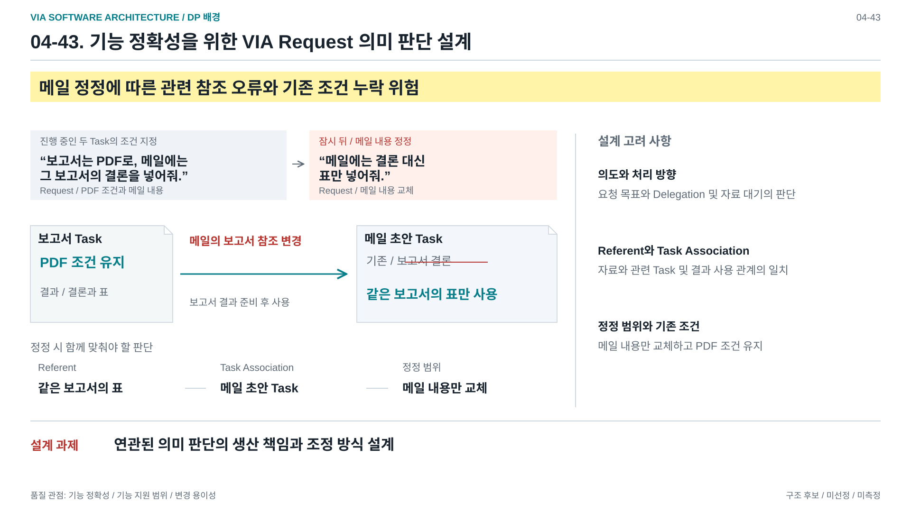
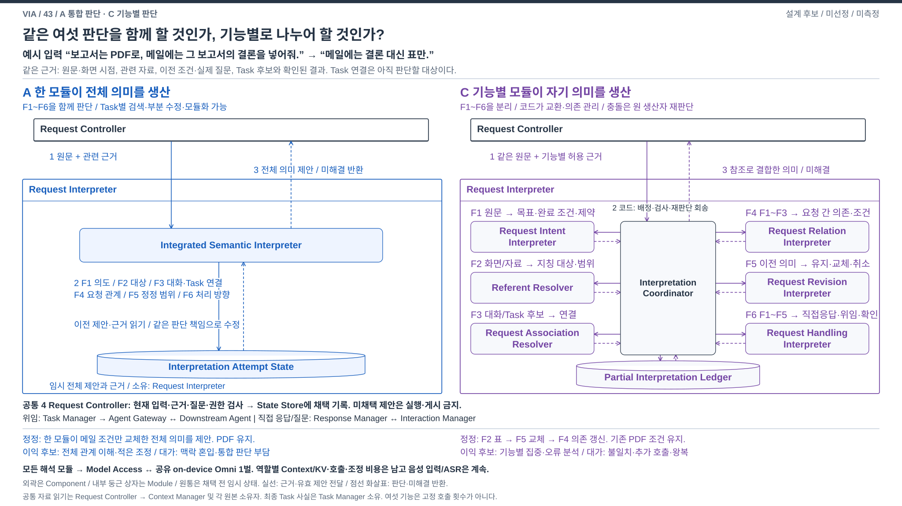
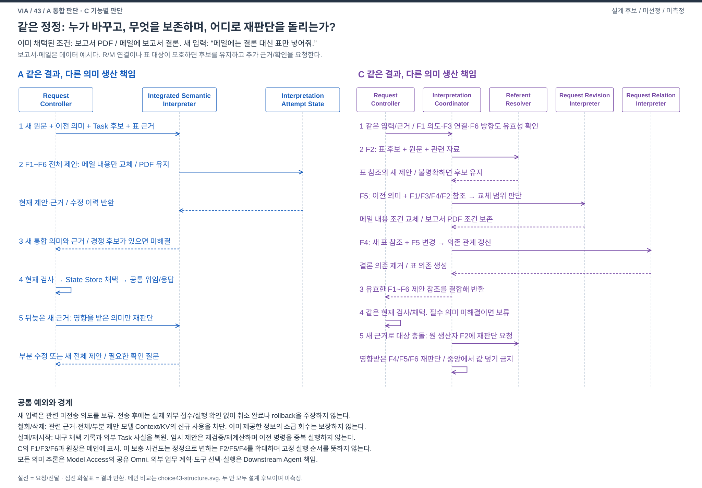

# 04-43. 요청 이해의 판단 책임 — A 통합 판단과 C 기능별 판단

> 상태: **STAGE_4_REFINED_CANDIDATE_REVIEW / 정제된 유력 DP 후보 / 미선정 / 미측정** / 2026-10-05
> [비교 가이드](./04-30-comparison-guide.md) / [분해 단위 지도](./04-50-agent-architecture-decision-map.md#area-02) / [현재 작업](./00-workplan.md)
> **33에서 정리한 A/C를 그대로 이어받은 최신 비교 문서다.** [33](./04-33-dialogue-coordination.md)은 논의와 B 제외 이력으로 보존하며, 이후 본문과 그림은 43에서만 갱신한다. 40번대 이관은 대안 재설계, A/C 우열 확정 또는 최종 DP 선정을 뜻하지 않는다.
> 사용자 지시에 따라 **A와 C만 남긴다.** 기존 C를 B로 재명명하지 않는다. [직전 A/B/C 문서와 도식](../../../archive/dialogue-coordination-before-ac-2026-10-05/README.md)은 검토 이력이다. 참조 Architecture, 다른 비교, QA/ADR와 최종 DP 선택은 변경하지 않는다.

**같은 여섯 가지 의미 판단을 한 모듈이 함께 책임질 것인가, 기능별 모듈이 부분 의미를 책임지고 협력할 것인가?** 두 안 모두 Task 연결이 정해지지 않은 원문에서 시작한다. 보고서/메일은 처리할 데이터의 예시이며 Component나 Module 종류가 아니다. VIA는 사용자 의도 이해와 대화 및 위임을 담당하고, 실제 업무 계획, 도구 선택과 실행은 Downstream Agent가 담당한다.

## DP 배경 — 발표용 1페이지

[편집 가능한 draw.io](./diagrams/dp43-background.drawio) / [발표 삽입용 PNG](../../../presentation_files/dp-background/dp43-background.png) / [다섯 배경 슬라이드 모아 보기](../../../presentation_files/dp-background/index.html)

진행 중인 보고서와 메일 초안의 조건을 지정한 User Turn과 잠시 뒤의 정정 User Turn을 표시한다. 각 발화에서 해석할 Request를 표시하고, 정정 후 보고서의 PDF 조건 유지와 메일 내용의 결론에서 표로의 교체를 구분한다. 보고서 결과 참조는 결과 준비 후의 사용 관계이며 현재 결과가 이미 완성됐다는 뜻이 아니다. 의도, Referent, Task Association, Request 관계, 정정 범위와 처리 방향은 같은 상황에서 함께 판단할 의미 항목이다. 도형은 요청 조건과 자료의 관계이며 여섯 Module이나 실행 순서를 미리 선택하지 않는다. 관련 Task의 판단도 원문과 이전 기록으로 얻는 해석 결과다. 이 상호 의존에서 의미 판단의 책임과 협력 설계로 이어지며, 통합 A와 기능별 C의 실제 구조는 아래 비교에서 다룬다.

## 0. 비교를 다시 구성한 이유와 B의 제외

직전 그림은 `보고서 대화 처리자`, `메일 대화 처리자`를 SW 모듈 이름처럼 그려 타입과 실행 인스턴스를 혼동시켰다. 실제 Task별 구현이라면 공통 처리 타입과 Task identity를 분리해야 한다. 더 중요한 문제는 특정 Task의 담당에게 맡기려면 **그 입력이 어느 Task와 관련되는지부터 이해해야 한다**는 점이다. 기존 업무와의 연결이 모호하거나 새 위임/직접 대화이면 해당 Task 담당만으로 시작할 수 없다.

기존 B는 공통 연결 판단 이후 Task별 지역 판단을 추가하는 구성이었다. Task별 조건 보존, 관련 기록 검색과 비동기 사건 처리는 강한 A/C에서도 가능하다. Task별 독립 의미 생산자가 추가로 얻는 중요한 품질 이익은 충분히 제시되지 않았다. 사용자가 B를 주요 비교에서 제외하도록 지시했으므로 본문, 메인/사건도, 품질 표와 전환 비교에서 제거한다. 구현 가능성 자체를 부정하거나 B의 재승격을 미완료 과제로 남기지 않는다.

새 A/C는 먼저 **공통 판단 기능과 산출물**을 정의하고, 그 생산 책임과 재판단 경로가 달라지는 설계를 비교한다. 기능 목록을 상자 여섯 개로 바꾸는 것만으로 C의 구조적 가치가 증명되지는 않는다.

## 1. 발표용 메인 비교 — 이 그림 한 장으로 설명한다

[편집용 draw.io](./diagrams/choice43-structure.drawio) / [발표 삽입용 PNG](./diagrams/choice43-structure.png)

2560×1440의 16:9 메인이다. 같은 외부 계약을 갖는 Request Interpreter Component 내부를 펼친다. A의 통합 모듈 하나와 C의 기능별 모듈 여섯 개 및 코드 조정 모듈이 실제 대체 관계다. 네모는 구현할 Component/Module의 설계명, 원통은 데이터 상태의 이름이다. 모델의 가중치나 OS process를 나타내지 않는다. 양쪽 Request Controller는 각 대안에서 같은 공통 역할이다.

### 1.1 그림을 짚는 발표 대본

1. **상단의 같은 시작:** 원문과 관련 근거를 받는다. 어느 Task인지, 새 업무인지, 직접 대화인지도 이제 판단해야 한다. 미리 Task를 나누어 주지 않는다.
2. **A 왼쪽:** Integrated Semantic Interpreter가 F1 의도, F2 대상, F3 연결, F4 관계, F5 정정, F6 처리 방향을 함께 판단해 하나의 의미 제안을 만든다. 이전 조건을 조회하고 필요한 부분만 수정할 수 있다.
3. **C 오른쪽:** 같은 기능을 실제 기능별 모듈로 나눈다. 각 모듈이 자기 값과 근거를 반환한다. 가운데 Interpretation Coordinator는 코드로 필요한 제안을 다른 모듈에 전달하고 의존 상태를 기록한다. 불일치하면 원 생산자에게 다시 판단하도록 요청한다.
4. **아래의 같은 정정:** A는 메일 내용만 교체한 통합 의미를 만든다. C는 대상 해석의 표 참조, 정정 해석의 교체 범위, 관계 해석의 새 의존을 결합한다. 두 안 모두 기존 PDF 조건을 보존한다.
5. **공통 채택과 손익:** Request Controller가 현재 근거와 권한을 검사한 뒤 채택한다. A는 전체 관계를 함께 보기 쉽고 조정이 적다. C는 기능별 집중과 오류 분석의 이익 후보가 있지만 부분 판단의 불일치, 추가 호출과 왕복이 생긴다. 한 Omni를 공유하며 어느 쪽의 정확성 우위도 측정하지 않았다.

## 2. 먼저 고정할 판단 기능과 결과

F1~F6은 양안이 수행할 **의미 판단 책임**이다. 여섯 Agent, 여섯 호출 또는 한 번씩 실행하는 단계의 개수가 아니다. 각 필드에는 근거, 후보, 미해결 상태가 필요하며 없던 정보는 생성하지 않는다. 아래 이름은 C의 내부 Module 설계명이고 참조 Architecture의 최상위 Component를 개명한 것이 아니다.

| 기능 | 주어진 근거와 판단할 질문 | C의 Module | 소유하는 의미 산출물 |
| --- | --- | --- | --- |
| **F1 요청 의도** | 전체 원문과 대화 근거. 사용자가 원하는 목표, 완료 조건, 제약과 의미 단위는 무엇인가? | Request Intent Interpreter | 요청 절/목표 후보, 완료 조건과 제약. 외부 업무의 실행 단계나 도구 계획은 만들지 않음 |
| **F2 지칭 대상** | 원문, 화면 시점, 자료 후보와 실제 제시 참조. “이 표”, “그 보고서의 결론”은 무엇인가? | Referent Resolver | 자료 identity/version, 범위와 경쟁 후보. 기존 Task를 바꿀지는 결정하지 않음 |
| **F3 대화/Task 연결** | 원문, 실제 게시 질문, 이전 Request와 Task 후보. 질문의 답, 기존 Task 후속, 새 업무, Task 없는 요청 중 무엇인가? | Request Association Resolver | 절↔Request/질문/Task 후보 연결, `NEW / EXISTING / NO_TASK / UNRESOLVED`. 실제 Task 생성/상태 변경은 하지 않음 |
| **F4 요청 간 관계** | 원문과 F1/F2/F3 제안, 정정이면 F5의 변경 참조. 요청들이 독립적인가, 결과 의존이나 결합 조건이 있는가? | Request Relation Interpreter | 제안 ID를 잇는 결과 사용/의존/결합 조건. 대상이나 Task 값을 새로 선택하지 않음 |
| **F5 정정 범위** | 원문, 이전 채택 의미, 현재 의도/연결/대상과 관련 관계. 무엇을 유지, 교체, 추가 또는 취소하는가? | Request Revision Interpreter | 기존 절/조건 ID에 대한 유지/교체/추가/취소 제안. 새 값은 해당 생산자 제안을 참조하며 직접 다시 만들지 않음 |
| **F6 처리 방향** | 원문, F1~F5의 상태와 허용된 직접 응답 범위/Agent capability. 직접 답변, 위임 또는 확인 중 어떤 처리가 필요한가? | Request Handling Interpreter | 의미상 처리 방향과 미해결 필드에 근거한 질문 제안. 실행 승인이나 실제 게시 권한은 만들지 않음 |

F1이 요청 절을 구별했다고 Task가 생성되거나 절마다 Task 하나가 확정되는 것은 아니다. 하나의 위임 목표로 묶을지, 기존 Task와 연결할지는 관련 의미와 capability를 함께 검토해야 한다. F2와 F3는 서로의 후보를 필요로 할 수 있고 F4/F5도 상호 영향을 준다. 번호는 책임의 식별자이며 고정된 일방향 pipeline이 아니다.

단순한 신규 독립 요청에서 F4/F5가 적용되지 않거나 기존 연결을 그대로 사용할 수 있으면 이를 명시한다. 유효한 이전 결과나 명시적 ID만으로 처리할 수 있는 부분은 재사용할 수 있다. **코드가 자연어를 추측하여 기능을 건너뛰지는 않는다.** 의미상 적용 여부가 불명확하면 해당 생산자가 판단한다. C의 호출을 줄이려고 전면 통합 해석을 숨겨 넣지 않는다.

근거 읽기, 권한/버전 검사, 실제 상태 저장, 외부 전달은 별도의 공통 코드 책임이다. 미해결 자료가 있으면 각 의미 생산자가 부족한 항목과 bounded read를 제안하고 Request Controller가 Context Manager 및 각 원본 소유자를 통해 읽는다. 질문은 필요한 차이를 제안하고 공통 경로로 실제 게시한다. 전문 모델이 독립된 지식이나 근거를 추가로 가진다는 전제는 없다.

## 3. 두 안의 실제 SW 설계

### 3.1 A — Integrated Semantic Interpreter의 통합 생산

Request Controller는 같은 입력 revision과 허용 근거를 Request Interpreter에 전달한다. 내부 **Integrated Semantic Interpreter** Module이 Model Access를 통해 공유 Omni에 F1~F6을 함께 판단하도록 요청한다. 모델 호출, 형식 검사와 재시도 처리는 Module 내부 코드다. 필요하면 제한된 추가 근거를 받아 재판단한다.

산출물은 하나의 `Semantic Proposal`이며 목표/조건, 대상, 대화/Task 연결, 요청 관계, 정정 범위, 처리 방향과 미해결을 포함한다. **의미 값들의 최종 생산 책임은 통합 모듈 하나**다. 전체 판단을 다시 수행할 필요가 없으면 근거가 유지된 부분을 보존하고 영향받은 부분만 수정한다.

**Interpretation Attempt State**는 Request Interpreter 소유의 요청 처리 중 임시 자료다. 원문 revision, 사용한 근거, 현재 통합 제안과 재시도 정보를 기록한다. 모델 KV나 장기 업무 원본이 아니다. 채택된 이전 조건/질문은 Request Controller의 읽기 계약으로, 확인된 Task 사실은 Task Manager의 읽기 계약으로 받는다. 이 원통이 모든 Task 원본을 독점하는 구조가 아니다.

A에도 Task별 검색/index, 일반 handler, 비동기 조회와 cache, 조건 보존 검사, 부분 수정, 필요할 때의 전문 보조를 허용한다. Module 하나가 모든 코드를 담는 거대한 구현이거나 모델 호출 한 번으로 제한된다는 뜻이 아니다. 보조 결과를 참고하더라도 최종 의미 생산자가 통합 모듈이면 A다.

### 3.2 C — 기능별 생산과 Interpretation Coordinator의 조정

같은 Request Interpreter 계약 안에서 F1~F6을 §2의 여섯 Module이 생산한다. 각 Module은 자기 맥락으로 Model Access의 같은 Omni를 호출한다. Module과 모델 세션은 일대일일 필요가 없고 가중치는 복제하지 않는다. 이름만 다른 helper 여섯 개를 중앙 통합 판단에 붙인 구조와 구분한다.

**Interpretation Coordinator** Module은 일반 코드로 다음을 수행한다.

1. 원문/근거 revision과 각 기능의 미해결 상태를 준비한다. 해당 기능에 필요한 허용 근거, 유효한 타 기능 제안과 이전 채택 참조를 전달한다.
2. 반환 제안을 **Partial Interpretation Ledger**에 기록한다. 값/후보, 생산자, 원문 절, 근거 read set, 의존 제안 ID/revision과 미해결 상태를 보존한다.
3. 필요한 제안을 다른 기능으로 전달한다. 예컨대 F3의 Task 후보 근거로 F2가 대상을 좁히고, F2의 결과를 F4/F5가 소비할 수 있다. 각 변경은 의존한 부분 결과를 무효화한다.
4. 형식/참조/버전/필수 필드와 선언된 충돌을 검사한다. 의미상 불일치가 남으면 해당 원 생산자에게 관련 제안/근거와 함께 재판단을 요청한다. 원문 전체의 의미 완전성이 코드 검사만으로 증명되는 것은 아니다.
5. 유효한 제안 참조를 결합해 `Semantic Proposal`로 반환한다. 해결되지 않으면 미해결/질문/실패로 반환한다. 공통 현재 검사 전에는 실행하거나 게시하지 않는다.

**Coordinator는 서로 다른 Task 후보 중 하나를 의미상 선택하거나 F2의 대상, F4의 관계를 임의로 덮어쓰지 않는다.** F5가 제안한 유지/교체 연산을 참조에 적용하는 것과 코드가 자연어 정정 범위를 추측하는 것을 구별한다. 다른 Module도 타 생산자의 값을 직접 수정하지 않는다. 예컨대 F4가 잘못된 F3 연결을 발견하면 F3의 새 제안을 받아야 한다.

원장은 Coordinator가 기록/조회하고, 각 의미 값의 작성 책임은 해당 생산자에게 남는다. 요청 처리 중의 임시 상태이며 장기 Task 원본이나 별도의 사용자 기억이 아니다. 질문 대기로 넘어가면 필요한 미해결/제안 참조를 Request Controller의 채택 기록과 결합해 보존한다. 재개 때 버전을 다시 확인한다.

협력은 유한 라운드와 전체 deadline 안에서 끝낸다. 같은 Omni의 역할 분리는 독립 검증이나 다수결의 근거가 아니다. C가 종료하려고 결국 모든 의미를 중앙 모델이 다시 작성한다면 A+보조의 혼합이다. 이 비중과 중복 비용을 순수 C의 이익으로 숨기지 않는다.

### 3.3 공통 사실, 지속 상태와 최종 권한

| 대상 | 공통 소유와 계약 |
| --- | --- |
| 원문/화면 시점/실제 게시 사실 | Interaction Manager 및 Response Manager의 확인된 기록. 생성됐지만 미게시인 질문을 답변 focus로 삼지 않음 |
| 허용 자료와 Task 후보 | Request Controller → Context Manager → 각 원본 소유자. 관련 후보를 찾는 것은 가능하지만 정답 Task를 입력 전부터 아는 것으로 가정하지 않음 |
| 외부 접수/질문/결과/종료 | Agent Gateway를 통해 확인한 Task Manager의 사실. 해석 Module은 이를 만들거나 다른 원본으로 복제하지 않음 |
| 채택된 요청 의미/질문/정정 연결 | Request Controller가 현재 입력/근거/Task/질문/권한을 확인하고 State Store에 기록. A의 통합 제안과 C의 조합 제안에 같은 기준 적용 |
| 새 Task | 위임 의미가 채택된 뒤 Task Manager가 생성/연결. 해석 Module마다, 요청 절마다 자동 생성하지 않음 |
| 직접 응답/확인 질문 | Task 생성 없이 Request/Conversation에 기록할 수 있음. Response Manager → Interaction Manager의 실제 전달 결과를 후속 근거로 사용 |
| 모델과 입력 지속 | Model Access의 한 on-device Omni. 역할 Context/KV, 중복 원문과 추가 호출/대기를 비용에 포함. 음성 capture/Streaming ASR은 계속 |

Component는 SW 책임 경계, Module은 그 안의 구현 단위, Actor는 선택할 수 있는 상태/수신함 실행 방식이다. 여섯 의미 생산 Module을 모두 자율 AI Agent라고 선언하지 않는다. 코드가 순서를 관리하며 모델의 부분 의미를 받는 구현도 가능하다. 어느 쪽도 독립 process나 새로운 모델 가중치를 요구하지 않는다.

## 4. 같은 사례와 기능 범위

보고서 Task R과 메일 Task M이 진행 중이라는 **외부 상태**를 고정한다. 발화를 어느 Task에 연결할지는 두 안 모두 판단해야 한다. 아래 결론/표의 실제 내용은 확인된 보고서 결과에 있을 때만 사용한다. 아직 없으면 사용자 의존을 보존해 기다리며 VIA가 업무 내용을 대신 작성하지 않는다.

| 같은 사건 | A 통합 생산 | C 기능별 생산 |
| --- | --- | --- |
| “보고서는 PDF로, 메일에는 그 보고서의 결론을 넣어줘” | 원문/후보를 함께 보고 R의 PDF 조건, M의 내용, 보고서 결과 의존을 제안 | F1 목표/PDF 조건, F2 결론 참조, F3 R/M 연결, F4 결과 의존을 생산. F5는 이전 조건과의 변경을 판별하고 F6는 위임/대기 의미를 제안 |
| “메일에는 결론 대신 표만 넣어줘” | 메일 내용과 의존만 바꾸고 PDF를 유지하는 의미 제안 | F2 표 참조, F5 기존 메일 내용 조건의 교체 범위, F4 결론 의존 제거/표 의존을 생산. 이전 채택 PDF 조건은 유지. F1/F3/F6도 현재 입력에서 유효한지 확인 |
| 질문과 결과가 교차 도착 | 실제 게시 질문과 Task 사실을 조회해 관련 의미만 재검토 | F3의 질문/Task 연결과 해당 source에 의존한 F2/F4/F5/F6을 무효화/재판단. 무관한 부분 제안은 유지 가능 |
| “그거” 후보가 둘 이상 | 대상과 Task 후보 및 실제 제시 이력을 함께 판단 | F2/F3가 후보 근거를 Coordinator를 통해 교환. 처음 반환하거나 confidence가 높은 제안이 자동 승리하지 않음 |
| 이전 판단과 새 근거 충돌 | 충돌한 근거를 넣어 관련 의미 재판단 | 충돌 값의 원 생산자가 새 제안을 만들고 의존 생산자들이 재판단. 코드의 기본값이나 임의 덮기 금지 |
| “둘 다 가능한 경우에만 진행” | 결합 조건을 전체 의미에 포함 | F4가 결합 조건을 생산. 그 조건을 해소하지 못하면 한 요청만 독립 전송하지 않음 |
| Task 없는 설명 뒤 “이걸로 보고서 만들어줘” | 실제 설명/자료 참조를 새 목표에 연결 | F2가 실제 참조, F3가 새 업무와 기존 대화 연결, F4가 자료 사용 관계, F6가 위임 방향을 생산. 기존 Task 담당을 요구하지 않음 |

새 결과가 도착했다는 이유로 과거 결과를 지칭한 요청을 자동으로 최신 결과에 바꾸지 않는다. 사용자 정정, 외부 사실과 과거 파생 판단을 구별하고 부족한 근거는 확인한다. 추가 질문으로 해결했으면 V-02의 사용자 수고에 남기며 원래 목표의 완료로 대신 세지 않는다.

### 4.1 단순 요청과 분해의 손해

“보고서만 PDF로 바꿔줘”처럼 기존 연결이 명확하고 다른 관계가 없으면 A의 좁은 맥락 또는 C의 필요한 기능/유효 제안 재사용으로 처리할 수 있다. C가 명백한 항목까지 반복 추론하면 호출과 원문 중복이 손해다. 반대로 특정 지칭 해석이 어렵고 그 오류가 반복된다면 C의 별도 입력/결과 계약이 집중 개선에 도움이 될 수 있다. A에도 같은 전문 보조를 허용해 실제 차이를 확인해야 한다.

“아까 취소하지 않은 쪽의 내용만 다른 쪽에 넣되 둘 다 안 되면 보류”처럼 연결/부정/정정이 강하게 얽히면 A의 통합 판단이 유리할 수 있고 C는 후보 왕복과 누락 위험이 늘 수 있다. 입력이나 근거가 없으면 어떤 분해도 정답을 만들어내지 못한다.

### 4.2 04-31과 함께 선택할 때의 소유 경계

31의 본문/그림은 유지한다. 31은 요청별 생성과 지속 의미 상태의 비교이고, 여기의 43은 같은 의미 기능의 생산 책임을 비교한다. A의 임시 상태와 C의 부분 제안 원장 자체는 31 B의 지속 Meaning Workspace가 아니다. 지속 Workspace를 조합하면 생산자가 만든 변경/질문을 공통 채택 뒤 반영하고 동일 의미의 독립 원본을 두지 않아야 한다. 기능별 제안과 지속 제약 변경의 상세 결합은 여기서 완성했다고 주장하지 않는다. 이전 Task별 B의 Workspace 조합 설명은 보존본의 이력이다.

### 4.3 04-41과의 차이와 중복

41은 다음 조회와 최종 대상/Task 결합을 모델이 주도할지, 모델의 제한된 표현을 코드가 해결할지를 비교한다. C의 Coordinator는 의미 값의 생산자가 아니며 F1~F6의 모델 생산 결과를 결합한다. 코드가 제한된 의미 규칙으로 대상/Task 관계 자체를 완성하는 41 B와 구별한다.

그렇다고 43을 자동으로 독립 주요 DP로 인정하지 않는다. Task별 검색, 정정/조건 보존, 미해결 관리와 선택적 부분 모델 호출은 41에서도 가능하다. 43 C에 남는 주장은 **기능별로 맥락과 의미 생산 책임을 분리했을 때 강한 통합안/부분 해석 보완보다 중요한 이해 품질이 좋아지는가**다. 그 효과와 추가 비용은 미확인이다. 별도 비교 축이라는 이유로 품질 이익을 합산하거나 41을 변경하지 않는다.

## 5. 정정, 취소, 철회, 실패와 재시작

| 사건 | 같은 처리 결과 | A와 C의 차이 |
| --- | --- | --- |
| 새 입력/정정 | 관련 미전송 의도를 보류하고 현재 입력의 변경만 채택 | A는 관련 통합 의미, C는 영향받은 부분 제안/조합과 의존 관계를 갱신 |
| 질문 만료/Task 종료 | 늦은 답을 적용하지 않음. 독립 요청은 결합 조건이 허용할 때만 진행 | C는 F3 연결과 이를 소비한 기능까지 무효화. 타입/버전 검사만으로 의미 정답을 보장하지 않음 |
| 전송 후 수정/취소 | 외부 접수/실행을 확인하고 지원되는 제어를 연결 | 로컬 채택은 어느 안에서도 외부 취소 완료나 rollback이 아님 |
| 삭제/권한 철회 | 현재 정책으로 신규 사용 차단, 이미 제공한 정보의 소급 회수는 주장하지 않음 | A의 통합 제안, C의 모든 의존 부분 제안과 두 안의 Context/KV/생성을 무효화 |
| 모델/Module 실패 | 필수 의미 누락을 성공으로 채택하지 않음 | A는 통합 생산 실패, C는 특정 기능 실패와 종속 부분의 보류. 같은 process/DB/Omni의 장애 격리는 분해만으로 생기지 않음 |
| 재시작 | 내구 채택/질문/실제 전달/명령 기록과 외부 사실을 복원 | A 임시 제안과 C 부분 원장은 재검증/재계산. KV를 업무 원본으로 사용하거나 미채택 제안을 명령으로 재실행하지 않음 |
| 협력/추론 예산 소진 | 제한된 시간/라운드 뒤 질문 또는 실패로 종료 | C의 반복 재판단/중복 맥락을 비용에 포함. 새 revision으로 예산을 초기화하지 않음 |

[편집용 draw.io](./diagrams/choice43-event.drawio). C에서 정정의 주된 변화인 F2/F5/F4를 확대했다. 생략된 기능이 사라졌거나 모든 요청에 그 순서로 실행한다는 뜻이 아니다. 메인 비교를 이해하기 위한 선행 그림으로 사용하지 않는다.

## 6. 지원 범위와 미확인

두 안은 같은 고정 UC-01~18을 기준으로 하며, 직접 대화, 신규 위임, 기존 Task 후속, 복합 요청, 질문 답변, 정정/취소와 결과 연결을 범위에 둔다. 이는 구현 PASS나 임의 자연어의 완전 지원 주장이 아니다.

| 범위 | A | C |
| --- | --- | --- |
| 직접 대화/새 위임 | 통합 의미에서 Task 없음/새 목표 판단 | F3와 F6를 포함한 필요한 기능으로 판단. 미리 Task를 만들지 않음 |
| 교차 관계/복합 조건 | 같은 맥락에서 생산하나 검색/모델 오류 가능 | 부분 계약으로 표현하고 협력해야 함. 임의 관계를 누락 없이 분해/종료할 실제 능력은 미확인 |
| 모호함/추가 질문 | 통합 후보/미해결로 질문 제안 | 각 생산자의 후보/미해결을 보존하고 F6가 필요한 질문을 제안. 사용자에게 내부 모듈을 선택시키지 않음 |
| 정정/철회/복구 | §5 계약 | §5 계약과 부분 제안의 의존 무효화 |

같은 명시적 조건의 좁은 S2S 직접 경로는 두 안에 공통으로 허용할 수 있다. 모든 음성 응답에 여섯 해석 호출을 강제하지 않는다. C가 어려운 사례를 통합 fallback으로 처리하면 지원 효과와 추가 비용을 혼합안으로 공개한다. 미지원/미확인, 불필요한 질문과 수동 연결 부담을 성공으로 숨기지 않는다.

## 7. V-01~13의 직관적 사고 실험

[03-00](./03-00-quality-scenarios.md)의 정의/우선순위를 유지한다. V-01/02/03을 우선하고 V-04/05, V-08, V-06, V-07 순으로 인과를 살핀다. **조건부 작성자 예상이며 측정, 심사위원 평가나 최종 선정이 아니다.** V-04/05에서 Downstream Agent의 업무 실행시간은 외부 조건이며 VIA가 만든 호출/조회/조정 대기는 포함한다.

| 관점 | A 통합 판단 | C 기능별 판단 | 직관적 비교와 뒤집히는 조건 |
| --- | --- | --- | --- |
| V-01 기능 정확성 | 얽힌 의도/대상/관계를 함께 판단. 검색 누락/맥락 혼입 위험 | 특정 기능에 집중. 부분 불일치와 오류 전파 위험 | 교차 의미는 A 유리 예상. C는 동일 근거/모델에서 집중 판단이 실제 오류를 줄여야 함 |
| V-02 기능 적절성 | 자유로운 한 문장을 전체 목표로 연결하기 자연스러움 | 내부 협력으로 해결하면 좋지만 불일치를 사용자에게 떠넘기면 반복 질문 | A의 통합 처리 대비 C가 실제 사용자 수고를 줄이는지가 핵심 |
| V-03 기능 완전성 | 같은 생산 책임에서 표현 범위 구성. 모델 오류는 남음 | 기능 경계에 걸친 관계/정정이 부분 계약에 담겨야 함 | 범위 구성은 A가 단순. C의 경계 누락/표현 밖/미확인을 공개해야 함 |
| V-04 상호작용 반응성 | 짧은 요청의 조정 경로가 적음 | 필요한 기능 생략/재사용 가능하지만 부분 판단을 기다림 | 단순 요청 A 유리 예상. C는 작은 입력 이익이 공유 Omni 대기를 넘어야 함 |
| V-05 VIA 귀속 요청 완료 시간 | 복합 관계를 한 생산 경로에서 구성 | 부분 생산/교환/재판단이 완료 경로에 추가됨 | 기본 A 유리 예상. C의 선택적 재처리는 A의 부분 수정과 비교 |
| V-06 자원 활용성과 수용량 | 큰 통합 입력 가능, 제안/조정 원장은 단순 | 원문/근거 중복, 호출/세션/KV와 부분 원장 비용 | 기본 A 유리 예상. C의 작은 입력/재계산 절약으로 역전될 가능성은 별도 확인 |
| V-07 결함 허용성과 복구성 | 중간 상태 종류가 적고 복구가 단순 | 실패 기능 구분 가능, 필수 기능 실패와 의존 복구 부담 | 분해만으로 process/model 격리 이익 없음. C도 필수 결과 누락이면 전체 요청 보류 |
| V-08 변경 용이성과 모듈성 | 일반 코드 모듈화 가능. 전체 의미 생산 계약 영향 | 특정 기능의 입력/출력과 생산 로직을 국소 변경 가능 | C의 후보 이익. 공통 의미 schema/관계가 바뀌면 여러 기능으로 전파 |
| V-09 분석 및 시험 용이성 | 전체 경로 시험 단순, 의미 오류 분해 어려움 | 부분 산출물로 원인 구분, 기능 간 조합/반복 시험 증가 | 원인 분석은 C의 후보 이익, 전체 시험 단순성은 A. 한 점수로 합치지 않음 |
| V-10 기밀성 | 필요한 근거만 구성, 파생 사용 경로가 적음 | 기능별 최소 근거 가능, 중복/파생과 철회 전파 증가 | 고정 순위 없음. 논리 Module은 강제 보안 경계가 아님 |
| V-11 상호운용성과 공존성 | 같은 외부 계약, 추가 추론이 적을 여지 | 외부 계약 동일, 기능별 호출이 PC/음성과 경합 | 연동은 차이 근거 부족. 공존은 실제 자원 소비에 달림 |
| V-12 조작 용이성과 사용자 오류 방지 | 한 창구에서 요청/제어, 오해하면 오대상 위험 | 같은 창구/확인 가능, 기능 분리만으로 오조작 방지 안 됨 | 같은 UI/현재 검사에서 고정 우열 근거 부족 |
| V-13 설치 용이성 | 비교적 적은 부분 계약과 상태 형식 | Module/부분 계약과 원장 호환 필요 | 같은 실행체/공유 가중치라 설치 자체는 유사. C의 계약 갱신 부담 가능 |

특정 기능 전문화의 정확성 이익을 모델 자체의 성능 향상으로 가정하지 않는다. A의 집중 검색/전문 보조로 같은 이익을 얻으면 C의 선택 이유는 약해진다. V-08/09의 후보 이익으로 V-01~03 손실을 자동 상쇄하지 않는다.

## 8. 가장 싼 확장, 혼합과 전환

| 반론/전환 | 유지할 수 있는 부분 | 실제로 바뀌는 핵심과 비용 | 판정 |
| --- | --- | --- | --- |
| A에 Task별 검색/기록/handler 추가 | 통합 의미 생산과 공통 채택 | 관련 맥락 구성과 일반 사건 처리 | 정정/연속성의 많은 이익을 얻을 수 있음. 별도 분해안의 독점 기능 아님 |
| A에 어려운 지칭만 전문 보조 추가 | 중앙의 최종 의미 생산 | 선택적 호출과 보조 결과 폐기/수명 | 강한 A의 현실적 확장. C는 이보다 중요한 이익이 필요 |
| A → C | 원문/자료/Task 계약, 채택 기록, 모델 가중치 | 기능별 값 생산 권한, 부분 계약, 교환/충돌/의존 무효화로 전환. 중앙 전면 재작성 제거 | 코드 파일 분할이나 prompt 이름 변경만으로 완료되지 않음 |
| C → A | 기능 로직을 보조로 재사용, 기존 채택 기록 | 부분 생산 책임을 통합 모듈로 회수하고 협력 종료/재판단 경로 교체 | 진행 임시 원장은 drain/재계산 가능. 강제 DB/process 이행비를 부풀리지 않음 |
| C + 통합 fallback | 어려운 관계의 지원을 보완 | 통합 재판단과 부분 제안 간 권한, 이중 추론 비용 | 가능하나 혼합으로 명시. fallback이 대부분이면 독립 기능 생산의 선택 이유 약화 |

**기능 개발비:** 부분 제안 계약과 협력 처리. **상태 이행비:** 진행 요청의 임시 제안 drain/변환이며 채택 원본을 유지하면 줄일 수 있다. **핵심 재설계:** 전체 의미 생산을 부분 생산/참조 결합으로 바꾸고 정정/질문/근거 변경에서도 같은 책임을 지키는 일이다. 전환을 어렵게 만들기 위한 새 저장소나 배포 단위는 도입하지 않는다.

## 9. 현재 판정과 선택 조건

- **A가 유리할 조건:** 짧은 요청과 자유로운 교차 표현이 많고, 관련 맥락 검색/부분 수정으로 충분하며 조정 비용을 줄이는 것이 중요할 때.
- **C의 이유가 강해질 조건:** 특정 의미 기능의 오류/변경이 반복되고, 기능별 맥락과 생산 책임 분리가 강한 A+보조보다 오류나 사용자 수고를 줄이면서 호출/협력 비용을 감당할 때.
- **C의 이유를 약화시키는 반증:** 통합 보조 호출로 같은 이익을 얻음, 경계 누락/반복 질문이 증가함, 부분 제안으로 끝내지 못하고 통합 재작성에 의존함.

**사용자가 정한 비교 범위는 A/C이며, 어느 안도 최종 선정하지 않는다.** 동일한 기능을 수행하더라도 생산 권한과 중간 상태, 충돌 해결 경로가 다르므로 설계 비교는 가능하다. 그 차이가 중요한 VIA 품질에 충분히 큰 이익을 내는지와 주요 DP 자격은 별도다. 그림의 상자 수나 문서/CI 완료를 그 증거로 삼지 않는다. 기존 B는 §0의 이유로 제외하며 자동 재탐색하지 않는다.

## 근거와 검수

- [참조 Architecture §4~7, §10](../target-architecture/architecture.md): 목표/대상/Task/관계/처리 방향, Semantic Proposal과 상태 소유를 공통 기능 근거로 사용. 여기의 여섯 Module 분해를 참조 설계에 소급하지 않음.
- [제어/수명](../target-architecture/control-and-lifecycle.md), [기억/맥락](../target-architecture/memory-and-context-lifecycle.md), [공유 Omni](../target-architecture/shared-omni-runtime.md): 정정/질문/취소/권한과 저장/입력 지속의 공통 경계. 기존 호출 수 정책을 이 탐색의 고정 상한으로 자동 채택하지 않음.
- [04-50 영역 2](./04-50-agent-architecture-decision-map.md#area-02): 기능/Task/일시 보조와 조정/모델/상태 단위를 구별하는 출발점.
- 생성 source는 `scripts/architecture/generate_request_interpretation_diagrams.py`, 검사 entry point는 `generate_request_interpretation_diagrams.py --check`. SVG/draw.io를 함께 생성하며 [04-37 이관 검수 기록](./04-37-comparison-review.md#promotion-43)에 실제 수정/검사와 한계를 남긴다. 구현, 모델 실행, 성능 측정은 하지 않는다.
