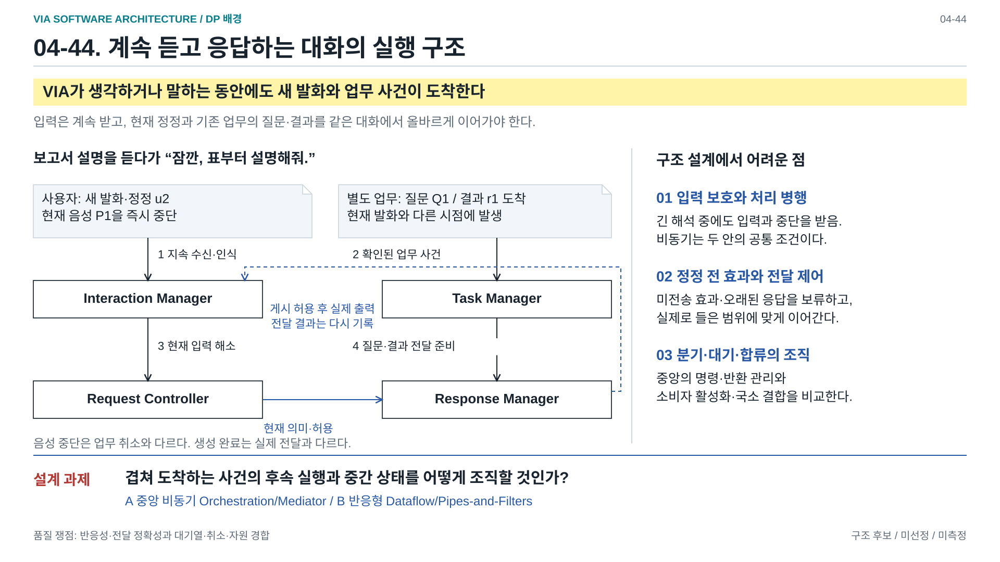
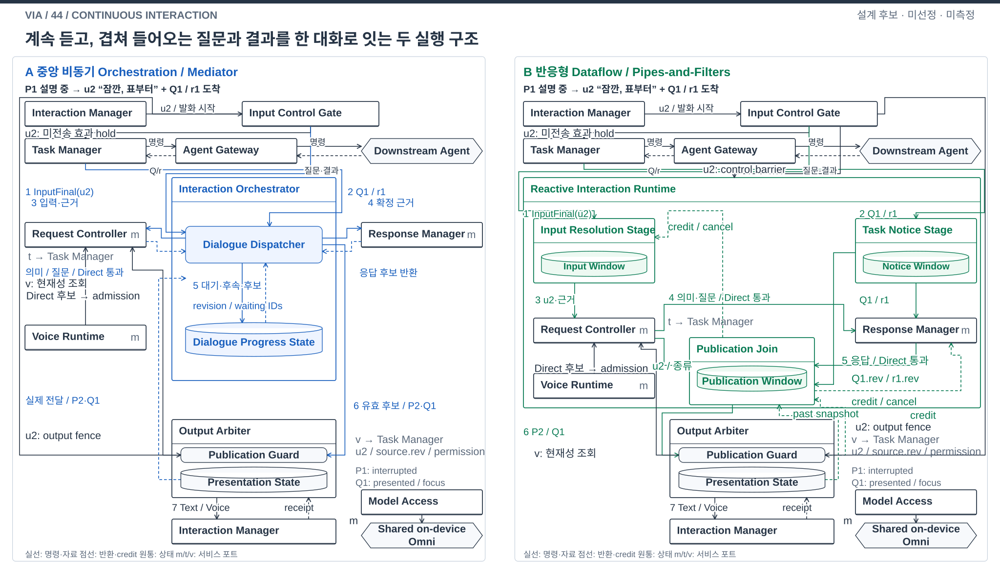
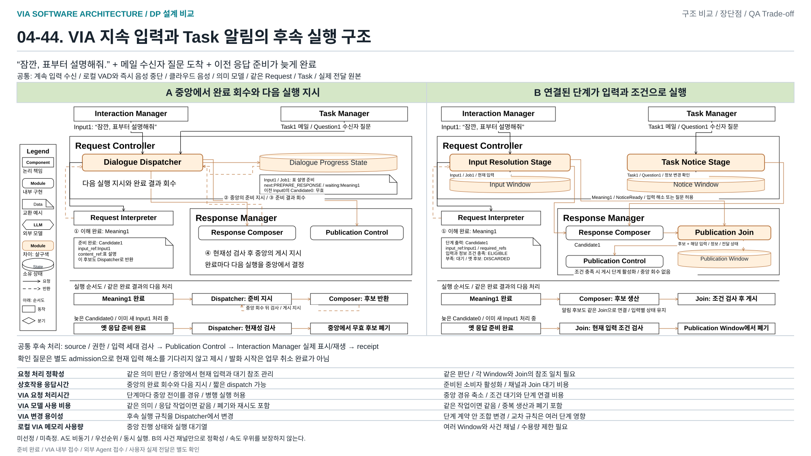
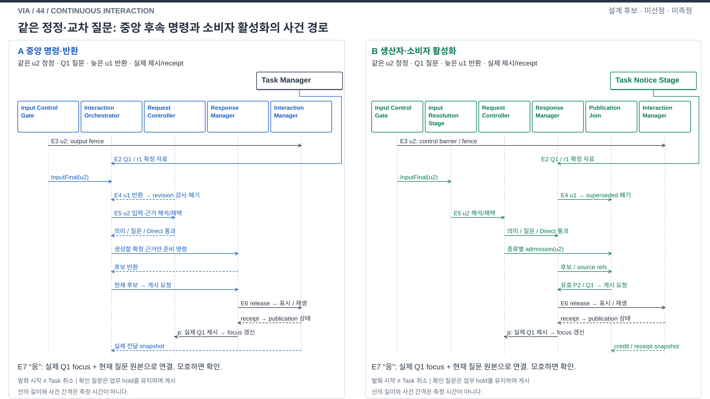

# 04-44. 계속 듣고 응답하는 대화의 실행 구조

> 상태: **STAGE_4_REFINED_CANDIDATE_REVIEW / A·B 미선정 / 구현·측정 없음** / 2026-10-10
> [탐색 지도 영역 6](./04-50-agent-architecture-decision-map.md#area-06) · [비교 기준](./04-30-comparison-guide.md#4-sw-구조적으로-다른-대안의-정확한-의미) · [독립 리뷰 기록](./04-44-interaction-review.md)

**사용자의 말을 계속 들으면서 현재 요청의 답변과 이전 업무의 질문·결과를 빠르고 올바르게 같은 대화로 이어가는 SW 구조**를 비교한다. A는 중앙 조정자가 사건마다 다음 실행을 명령하고 반환을 회수하는 **비동기 Orchestration/Mediator**다. B는 타입이 정해진 사건과 결과를 연결한 소비자가 조건 충족 시 활성화되는 **반응형 Dataflow/Pipes-and-Filters**다. 둘 다 입력과 작업을 병행한다. 차이는 비동기 API의 유무가 아니라 실행을 이어가는 책임과 중간 상태의 조직이다.

## DP 배경 — 발표용 1페이지

[편집 가능한 draw.io](./diagrams/dp44-background.drawio) / [발표 삽입용 PNG](../../../presentations_files/dp-background/dp44-background.png) / [전체 지도와 배경 모아 보기](../../../presentations_files/dp-background/index.html)

처음 발화는 보고서 설명과 회의 안내 메일 초안 작성의 두 목표다. VIA의 보고서 Response와 Downstream Agent의 메일 Task 실행이 병행되는 동안 사용자의 표 설명 발화와 메일 수신자 질문이 겹쳐 도착한다. 현재 음성의 즉시 중단, 새 발화 수신 및 해석, 표 설명으로의 전환을 위쪽에 표시한다. 아래쪽은 메일 Delegation과 Agent Execution, 질문 도착, 메일 Task를 명시한 실제 사용자 질문 전달과 답변까지의 실행 대기를 표시한다. 설명용 사건 순서이며 측정 시간이나 모든 상황의 고정 전달 우선순위를 뜻하지 않는다. 음성 중단은 Task 취소가 아니며, 현재 발화의 해석과 질문 생성은 실제 사용자 전달과 구별한다. 도형은 공통 사건과 전달 상태로 Component, 중앙 조정자 또는 반응형 실행망을 선택하지 않는다. 후속 처리, 대기 상태와 전달 차례를 이어가는 실행 구조는 아래 A/B 비교에서 다룬다.

마지막 열은 표 설명 후 메일 질문 전달의 예시 순서를 표시한다. 모든 상황에 적용하는 고정 우선순위가 아니다. 겹친 사건의 후속 실행과 실제 전달을 이어가는 실행 구조가 이 장의 결정 범위다. 노란색 문구는 예방할 설계 위험이며 실제 관측된 실패나 측정 결과가 아니다. [다섯 설계 문제 지도](./diagrams/dp-background-overview.svg)에서 각 결정 범위를 먼저 구분한다.

### 배경 페이지 작성 기준: 비교 사건과 범위

**풀어야 하는 문제:** VIA가 요청 이해·업무 위임·응답 준비를 하는 동안에도 사용자 입력과 다른 업무의 질문·결과가 계속 들어온다. 각각의 처리를 시작하는 것뿐 아니라, 완료 결과와 대기를 연결해 다음 처리를 이어가고 정정으로 무효가 된 결과를 걸러내야 한다. 44는 이 실행 연결을 어떤 SW 구조가 책임질지 비교한다.

#### 직접 다루는 네 종류의 사건

| 도착하는 사건 | 44에서 비교하는 실행 연결 |
| --- | --- |
| 새 사용자 입력·정정·보완·취소 입력 | 이해 처리를 시작하고, 관련 기존 작업·응답 후보를 보류하거나 무효화하는 경로. 실제 취소 범위는 공통 의미 판단·채택 결과에 따른다. |
| Agent의 진행·질문·결과·완료·실패 알림 | 확인된 업무 사건을 대화에 연결하고, 응답 준비와 전달 대기를 이어가는 경로. |
| 이해 처리·응답 준비 완료 | 완료 결과를 받아 다음 작업을 시작하거나, 늦게 돌아온 무효 결과를 폐기하는 경로. |
| 실제 표시·재생·중단 결과 | 실제 전달 상태를 반영하고, 대기 중인 후속 처리를 이어가는 경로. |

처음 두 종류는 사용자와 외부 업무에서 오는 사건이고, 뒤의 두 종류는 VIA 내부 처리와 실제 전달에서 돌아오는 완료 사건이다. 응답 후보가 준비되었다는 사실과 사용자가 실제로 보고 들었다는 사실은 구별한다.

#### 공통 조건과 예외 입력

- **발화 시작·즉시 음성 중단:** 양안 공통 기능이다. 중단 알고리즘 자체를 비교하지 않는다.
- **전사·화면 근거 갱신, Context 조회:** 입력·근거 생산 방식은 고정한다. 44는 그 결과를 사용하는 실행 연결을 다룬다.
- **의도·대상·업무 관계 판단:** 요청 이해 방식은 고정한다. 44가 새로 비교하는 의미 판단 문제가 아니다.
- **질문 만료·자료 변경·권한 철회:** 유효성 판단 규칙은 공통이다. 그 신호로 실행 중 작업과 대기 후보를 정리하는 경로는 44에 포함된다.
- **처리 실패·시간 초과:** 실패 판정 기준은 공통이다. 실패 결과를 전달하고 관련 후속 처리를 종료·보류하는 연결은 포함된다.

#### 대표 비교 장면: 세 사건의 겹침

1. 새 사용자 요청이 들어온다.
2. 별도 업무의 질문·결과가 도착한다.
3. 이전 요청의 응답 준비가 늦게 끝난다.

이때 새 요청의 이해를 계속 진행하면서 별도 업무의 알림을 연결하고, 이전 요청의 늦은 후보가 여전히 유효한지 확인해야 한다. 전달을 기다리는 후보와 실제 전달 결과도 다음 처리로 이어져야 한다. 사건의 도착 순서만으로 전달 순서나 유효성을 결정할 수 없다.

**A는 중앙 Dispatcher가 완료 결과와 대기 상태를 모아 후속 처리를 지시한다. B는 연결된 Module들이 각자의 입력·대기 조건을 관리하고, 필요한 결과와 조건이 갖춰지면 후속 처리를 이어간다.** 둘 다 비동기로 동작할 수 있다. 비교점은 누가 다음 실행을 시작하고 대기를 연결하는지이며, 어느 안의 정확성·응답성·비용이 더 좋은지는 아직 측정하거나 선정하지 않았다.

## 1. 발표용 메인 비교

[편집용 draw.io](./diagrams/choice44-structure.drawio) · [발표용 PNG](./diagrams/choice44-structure.png) · [확대 보기](./diagrams/choice44-review.html)

**주제: VIA가 요청 이해·업무 위임·응답 처리를 하는 중에도 계속 들어오는 사용자 입력과 Agent의 질문·결과를 어떤 SW 구조로 처리할 것인가?**

왼쪽 A는 **중앙 조정 방식**(중앙 비동기 Orchestration), 오른쪽 B는 **이벤트 흐름을 연결하는 방식**(반응형 Dataflow)이다. 각 칸은 배치를 위한 영역이며 Component나 process가 아니다. 양안은 정식 10개 Component와 같은 배치·입력·의미 생산·원본 상태·권한·저장·모델 조건을 사용한다. A도 사건을 받고 비동기로 작업하며 완료를 기다리는 동안 입력 처리가 멈추지 않는다.

Component는 직각 박스, 내부 Module은 둥근 박스, 논리적 데이터 상태는 원통, 외부 Agent·클라우드 모델는 육각형이다. 모든 Module과 원통은 의미 소유 Component 안에 있다. 공통 기능은 흰색/검정이며 실제 차이인 작은 Module과 실행 상태만 살구색 채움과 같은 계열의 짙은 테두리다. 41/42와 같은 기호 의미를 쓰며 44에는 다른 process/서비스 경계를 추가하지 않는다. 포함 관계는 DB·thread·process 개수를 뜻하지 않는다. 박스에는 이름, 화살표에는 요청·제안·채택 결과·후보·실제 전달과 제어 자료를 표시한다.

### 1.1 그림을 짚는 발표 대본

1. **같은 사례:** P1 보고서 설명을 실제 재생하는 동안 u2 “잠깐, 표부터 설명해줘”가 시작되고 메일 업무의 수신자 질문 Q1이 도착한다. P2는 u2의 표 설명 후보다. 입력 전에 정답 Task를 붙이지 않는다.
2. **즉시 제어와 계속 입력:** 한 Interaction Manager 안의 Turn-Taking Control·Channel I/O가 P1을 즉시 중단하고 출력 세대를 무효화한다. Timeline & Buffer가 입력 revision과 evidence 참조를 Request Controller로 보낸다. Request Controller는 의미 해소 전 관련 미전송 admission을 hold하며 Task Manager·Agent Gateway가 현재 hold·권한·명령을 확인한다. 이미 전송된 업무를 발화 시작만으로 취소하지 않는다.
3. **A의 중앙 회수:** Request Controller 안의 Dialogue Dispatcher가 기존 근거 조회·의미 제안/채택 경로와 Response Composer 준비를 요청한다. 완료 후보를 job ID/revision으로 회수하고 Dialogue Progress State에서 기다리는 조건을 연결한다. 유효 후보는 Publication Control에 보내고 늦은 u1 후보는 폐기한다. 의미는 Request Interpreter가 제안하고 Request Controller가 채택한다.
4. **B의 연결된 소비:** Request Controller 안의 Input Resolution Stage·Task Notice Stage는 각각 입력 해소/채택 결과와 대화 연결·질문 등록·게시 admission을 마친 Notice를 게시한다. Response Composer가 이를 소비해 후보를 준비하고, 같은 Response Manager 안의 Publication Join이 후보·admission·source revision·과거 실제 전달 참조를 결합한다. Input/Notice/Publication Window는 제한된 실행 상태이며 원본을 대체하지 않는다. credit/cancel은 준비 작업량과 무효 결과 제어이며 Task 취소 의도가 아니다.
5. **같은 실제 전달 경계:** Publication Control이 원본 현재성·권한·차례·중복을 최종 확인해 Interaction Manager에 release/identity를 보낸다. 실제 표시·재생·중단 receipt가 Publication Outbox를 갱신한 뒤 확인된 Q1 제시 기록이 Request Controller의 질문 focus로 돌아간다. 생성·게시 허용·실제 전달은 서로 다른 사실이다. 현재 입력을 해결할 확인 질문은 별도 admission을 사용하며 자기 후보 receipt는 게시의 선행조건이 아니다.

VIA는 로컬이며 음성/전사와 의미 모델은 같은 클라우드 의존성이다. 모델의 임시 세션은 업무 상태 권위가 아니다. A의 중앙 전이/결과 회수 비용과 B의 단계별 Window·Join·취소/수용량 계약 비용을 함께 비교한다. B의 속도·정확성 우위나 고정 전달 우선순위를 이 예시로 확정하지 않는다.

## 2. 사용자 문제와 설계 범위

사용자는 VIA가 생각하거나 말하거나 업무를 기다리는 동안에도 계속 말한다. 다른 업무의 질문과 결과는 사용자 입력과 다른 시점에 도착한다. 다음 네 결과가 필요하다.

| 공통 기능 | 필요한 결과 |
| --- | --- |
| 계속 듣기와 끼어들기 | capture·클라우드 음성 입력/전사를 유지하고 음성은 로컬에서 즉시 멈춘다. 입력 누락이나 인식 backlog를 정상으로 숨기지 않는다. |
| 현재 요청 처리 | 전체 원문과 관련 근거로 의도·대상·Task 연결을 판단하고 직접 응답/확인/위임으로 연결한다. |
| 비동기 질문/결과 전달 | 확인된 업무 이름·질문·부분 실패·결과를 올바른 대화에서 전달한다. Agent 접수와 업무 완료는 구별한다. |
| 정정과 대화 이어가기 | 정정 전 미전송 효과를 보류하고 실제 들은 범위를 기준으로 답변 재개/폐기/수정과 질문 답변 연결을 수행한다. |

핵심 근거는 [고정 범위](../../03-fixed-architecture-scope.md), [UC-01/06/10~15](../../05-representative-use-cases.md), [P-04/06/08/09/10/14](./01-00-problem-coverage.md)다. 비교의 대표 장면은 정상 대화에서 입력·질문·결과가 겹치는 상황이다. 드문 crash를 B의 대표 이익으로 삼지 않는다.

| 인접 주제 | 44에서 고정하거나 구별할 내용 |
| --- | --- |
| 34: 발화 중 잠정 준비 | **기존 A/B를 승격하지 않는다.** 두 안 모두 같은 확정 입력과 준비 정책을 사용한다. 부분 발화의 조기 해석은 별도 최적화이며 B의 성립 조건이 아니다. |
| 41: 의미 해결 제어 | 같은 의미 해결 방식을 양안에 적용한다. 실행망이 자연어 관계를 코드로 추측하지 않는다. |
| 43: 의미 생산 책임 | 같은 Request Interpreter/F1~F6 생산 방식을 사용한다. Stage는 업무별 semantic actor가 아니며 이전 33의 제외된 B를 복원하지 않는다. |
| 42: 서비스 수명/원본 | 같은 Core 배치, Conversation/Task 원본, 로컬 내구 저장과 외부 실행 수명을 사용한다. B에 별도 process나 독립 업무 서비스를 추가하지 않는다. |
| 공유 모델 | 같은 클라우드 음성/전사와 의미 LLM, 로컬 VAD·Model Access의 provider adapter·호출 수용량 제한을 유지한다. 모델 내부는 비교하지 않는다. |

## 3. 실제 설계: 누가 다음 처리를 진행시키는가

### 3.1 공통 소유와 허용 경계

정식 10개 Component와 Interaction Manager의 Channel I/O·Evidence Capture·Timeline & Buffer·Turn-Taking Control은 [참조 구조 §4](../target-architecture/architecture.md#4-component와-상태-소유권)를 따른다. 이번 메인은 입력과 출력을 한 Interaction Manager에 그린다. Response Composer·Publication Control은 기존 공통 기능을 펼친 Module이며 별도 Component가 아니다.

**게시 차례와 실제 재생은 책임이 다르다.** Response Manager 안의 Response Composer와 Publication Control은 각각 기존 응답 준비와 게시 제어 기능을 펼친 Module 이름이며 새 Component나 두 안의 차이가 아니다. Publication Control은 publication ID·출력 차례/lease·현재성 확인·중복 방지·내구 Publication Outbox를 관리하고, 현재성/권한의 판단 원본은 Request Controller/Task Manager에 조회한다. Interaction Manager는 허용된 release만 현재 장치/출력 epoch에 맞춰 표시·재생하고 로컬 stop와 실제 전달 receipt를 책임진다. Playback State는 장치 재생 상태와 확인된 receipt의 제한된 전달 buffer다. publication의 내구 원본과 질문 focus를 이 buffer로 옮기지 않는다.

기존 독립 Input Control Gate·Interaction Orchestrator·Voice Runtime·Reactive Interaction Runtime 박스는 제거한다. 기능 삭제가 아니라 실제 owner의 Module·제어 흐름과 실행 조건으로 돌아간 것이다. 새 발화 감지·즉시 stop·출력 세대 무효화는 Interaction Manager, 미전송 admission hold는 Request Controller, 실제 전송 제어는 Task Manager·Agent Gateway 책임이다. `Presented(question ID, publication ID, actual-range, revision)`은 내구 전달 기록과 일치해야 하며 Request Controller가 Pending User Interaction/질문 focus와 답변 연결을 소유한다.

| Component | 그림에서 펼친 Module | 논리적 상태와 의미 소유 |
| --- | --- | --- |
| Interaction Manager | Channel I/O, Evidence Capture, Timeline & Buffer, Turn-Taking Control | Playback State: 장치 재생과 확인된 receipt의 제한 buffer |
| Request Controller | A Dialogue Dispatcher / B Input Resolution Stage·Task Notice Stage | A Dialogue Progress State / B Input Window·Notice Window. Request·채택 의미·질문 focus·admission 원본도 이 owner에 유지 |
| Context Manager | 세부 Module을 추가하지 않음 | 기존 근거 조회·cache·source 읽기 계약 |
| Request Interpreter | 양안 같은 기존 이해 구현 | 의미 제안 및 추가 근거 요구, 채택 권한 없음 |
| Task Manager | 세부 Module을 추가하지 않음 | Task·질문·업무 사실 원본 |
| Agent Gateway | 세부 Module을 추가하지 않음 | 명령 전달·외부 사건 접수 계약 |
| Response Manager | 공통 Response Composer·Publication Control / B Publication Join | 공통 Publication Outbox / B Publication Window |
| Policy Manager | 세부 Module을 추가하지 않음 | 현재 권한·consent 계약 |
| State Store | 세부 Module을 추가하지 않음 | owner의 내구 저장·공동 확정 접근. 의미 소유권은 이전되지 않음 |
| Model Access | 세부 Module을 추가하지 않음 | 클라우드 API adapter·역할별 임시 session·호출 수용량 계약 |

Progress State/Window는 실행 중 job·대기·후속 조건을 연결하는 임시 상태다. Request·Task·명령·질문·publication의 확정 원본을 대신하지 않는다. 원통은 논리적 상태이며 독립 DB나 코드 Module이 아니다. Publication Outbox는 Response Manager 안에 한 번만 그리고 State Store 접근을 연결한다. Playback State에 내구 publication 원장이나 질문 focus를 넣지 않는다.

**실행 조건은 박스 밖 주석이다.** Voice Runtime에는 Interaction Manager의 음성 입출력·즉시 중단 기능과 Model Access client가 배치된다. 두 Component 전체나 weights·adapter·scheduler를 Voice Runtime이 소유하는 것이 아니다. 양안은 동시 실행 수가 제한된 비동기 executor와 제한된 Blocking worker pool을 사용하며 모델은 Model Access의 별도 scheduler를 거친다. 사건마다 thread를 만들거나 Module마다 전용 thread를 두지 않고 크기·우선순위 수치는 미정이다. A의 사건 대기열·비동기 작업·완료 반환은 실행 기반, B의 이벤트 채널·구독·단계별 수용량·취소 전달은 실행 라이브러리가 지원한다. 이들은 업무·질문·publication 상태 owner가 아니다.

| 사실/권한 | 공통 최종 소유자 | 두 안의 소비 조건 |
| --- | --- | --- |
| 원음·전사·현재 input epoch·발화 중 여부 | Interaction Manager / Turn-Taking Control·Timeline & Buffer | 확정 전사는 무오류 선언이 아니다. 늦은 정정은 새 revision으로 전달한다. |
| 의미 채택·Request·확인 질문·미전송 admission | Request Controller | Request Interpreter가 제안한 의미를 현재 근거/질문/권한으로 검사해 채택한다. 새 발화의 의미가 미해결이면 미전송 효과 hold를 해제하지 않는다. |
| Task·Execution·Agent 질문·외부 접수/진행/결과 | Task Manager / Agent Gateway | Request Controller의 hold epoch를 command admission/dispatch에서 검사하고 acknowledgment를 남긴다. capture와 hold 적용 사이 이미 외부로 나간 명령은 실제 외부 상태를 확인한다. 작업/질문 revision과 확인 상태가 필요하다. 기존 실행을 token만으로 취소 완료라고 하지 않는다. |
| Response 내용·publication/출력 차례·내구 전달 상태 | Response Manager | source와 의미 참조를 보존하고 원본 owner에 현재성/권한을 확인한다. Text와 음성의 대상·상태·결론·실패가 일치해야 한다. receipt로 Publication Outbox의 실제 전달 범위를 갱신한다. |
| 실제 표시·재생·로컬 중단·device receipt | Interaction Manager | Turn-Taking Control이 재생 직전 발화/출력 epoch/release를 검사하고 Channel I/O가 실제 전달을 수행한다. Playback State는 재생 상태/receipt buffer이며 내구 publication 원본이 아니다. |
| 실제 제시 질문 focus·질문 답변 연결 | Request Controller | 확인된 실제 전달 범위를 PendingUserInteraction에 반영한다. 생성 완료를 제시로 세지 않고 “응”은 실제 focus와 현재 질문 원본으로 연결한다. |

외부 업무는 **Request Controller → Task Manager → Agent Gateway → Downstream Agent**의 같은 검증/전달 경로를 따른다. 44는 이 후속 실행 조직을 비교하며 저장 경계는 42의 선택에 따른다. **42A**에서는 admission/hold·command/epoch·transmission CAS의 각 owner 검증 변경을 같은 local State Store transaction으로 확정한다. **42B**에서는 Request Controller의 intent와 Task Manager의 접수가 따로 확정되고, 업무 서비스의 gate/command/transmission CAS만 그 서비스에서 함께 확정한다. hold 요청 시각과 업무 gate 적용/ack 시각을 구별하며, CAS가 먼저 확정된 명령은 이미 전송을 시작한 것으로 보고 실제 외부 상태를 확인한다. 상세 command/control·재연결·UNKNOWN 계약은 [42](./04-42-lifecycle-ownership.md)에서 설명한다. 모델·네트워크 호출은 transaction 밖이고 발화 시작은 Task 취소 완료가 아니다.

음성 모델의 자율 답변은 [04-40](./04-40-common-execution-contract.md)의 이번 네 비교에서 제외한다. 모든 확정 사용자 입력은 VIA의 이해 처리로 연결한다. 기존 직접 응답 UC를 제거한 것이 아니라 이번 실행 비교의 입력/의미 생산을 고정한 것이다. 41의 읽기 도구 실행기가 Context Manager와 Task Manager에 직접 bounded read를 요청할 수 있다. Request Controller의 선택적 사전 읽기는 읽기 독점 권한이 아니다.

### 3.2 A — 중앙 조정 방식 (중앙 비동기 Orchestration)

**Request Controller 내부 Dialogue Dispatcher**가 입력·확인된 업무 변경·작업 완료·실제 전달 사건을 받아 다음 작업을 요청하는 코드 Module이다. 기존 요청 이해 경로를 호출하고 완료 결과 뒤 Response Composer의 준비 또는 Publication Control의 게시를 요청한다. 의미를 새로 판단하지 않으며 채택·질문 연결·admission은 Request Controller, 게시 차례·lease·중복은 Response Manager 권한이다.

**Dialogue Progress State**에는 `(conversation, input revision, continuation, waiting IDs, source refs, candidate response, suspended delivery refs)`를 연결한다. 확정 Request/Task/질문 원본을 복제하지 않는 실행 상태다. 반환은 `job ID + 시작 revision`으로 중앙에 회수된다. Dispatcher는 유효하면 다음 처리를 명령하고, 오래됐으면 폐기/재시작한다. 원본을 바꾸는 확정은 §3.1 owner에게 요청한다.

A는 전체 대화 처리를 하나의 긴 lock/모델 호출로 묶지 않는다. 입력별 짧은 상태 전이, 우선순위 mailbox, 비동기 worker, cache·사전 준비·부분 수정, 후보 병행 준비, Task별 검색, handler 모듈을 모두 허용한다. 개별 job에 수용량 상한과 취소 token을 적용할 수 있다. 그림의 hub는 CPU 한 개/모델 호출 한 개가 아니라 **후속 실행을 명령하는 소유자**다.

Dialogue Dispatcher는 질문 Q1의 실제 제시 receipt를 진행 상태에 연결한다. Task Manager는 확정 질문 원본을 유지하며 Request Controller가 확인된 실제 제시 사실로 focus를 갱신한다. 사용자의 “응”도 전체 입력과 실제 focus로 해석한다. 중앙에 관련 상태가 모여 원인을 추적하기 쉽지만, 여러 생산자/정정/차례 조건을 연결하는 전이와 dispatch 규칙이 조정 책임에 모인다.

### 3.3 B — 이벤트 흐름을 연결하는 방식 (반응형 Dataflow)

**실행 라이브러리**는 typed channel·구독·수용량·취소 전달을 지원한다. 독립 Component나 원본 상태 owner가 아니다. Request Controller와 Response Manager에 속한 Module이 연결된 입력과 조건을 소비하여 다음 처리를 수행하며 전체 후속 실행을 회수하는 Dispatcher는 없다.

| Stage | 입력과 산출물 | Stage가 소유하는 실행 상태 |
| --- | --- | --- |
| **Request Controller / Input Resolution Stage** | 확정 `Input(u)`·근거/실제 제시 참조 → Request Controller의 `AdoptedMeaning(u)` 또는 `Unresolved(u)` | Input Window: 실행 중 input/job ID, 대체 revision, 근거 read set. Request/의미 원본은 Request Controller 소유 |
| **Request Controller / Task Notice Stage** | Task Manager의 확인된 `Question/Result(T,r)` → 원래 대화·요청·Task 연결, Pending User Interaction 등록·공개 범위/게시 admission → `Notice(T,r)` | Notice Window: 원본 참조, 미전달 중요 항목, 준비 job, progress 최신값. 외부 질문/결과 원본은 Task Manager 소유 |
| **Response Manager / Response Composer** | 채택 의미, 허용된 확인 질문/실패·제어 안내 또는 유효 Notice → Text/audio candidate와 source refs. 직접 응답 후보도 VIA가 준비한 내용 참조를 사용하며 음성 모델 자율 후보는 이번 비교에서 제외 | Response Composer의 준비 상태와 Publication Control/Publication Outbox의 게시 상태. 준비 실패는 명시적 error envelope |
| **Response Manager / Publication Join** | 후보 + 후보 종류별 admission + 해당 source validity + 확정된 과거 delivery/focus snapshot → eligible candidate / hold / discard | Publication Window: 제한된 후보와 필요한 참조, dependency watermark, 중복 키. publication/내구 실제 전달 원본은 Response Manager, 질문 focus 원본은 Request Controller 소유. Playback State는 receipt snapshot 제공 |

InputSettled는 **새 입력이 없거나, 해당 입력의 의미·정정·제어 관계를 Request Controller가 해소했다는 확인**이다. 단순 ASR final이나 timeout으로 생산하지 않는다. Unresolved/WAIT_USER/WAIT_CONTEXT이면 기존 내용 응답과 관련 업무 Notice를 보류한다. **현재 u2를 해결하기 위한 확인 질문과 확인된 실패/제어 안내는 별도 `InteractionNotice(u, question ID, admission class)`로 반환한다.** 이 후보는 InputSettled를 요구하지 않고 현재 u2·유효 질문/사실·권한·발화 종료를 확인해 제한적으로 게시한다. 외부 효과 hold는 유지하며 질문 제시가 업무 실행 허가가 되지 않는다. 무관함이 채택 의미로 확인된 업무 결과는 기존 공통 정책대로 먼저 전달할 수 있다. Stage가 스스로 “무관하다”를 추측하지 않는다.

B의 Request Controller 반환은 `AdoptedMeaning/InputSettled` 채널에 게시되고 Response Manager/Publication Join이 구독한다. Task Notice 결과도 연결된 소비자로 전달된다. **모든 반환을 중앙에 회수해 다음 worker 호출을 결정하는 Dialogue Dispatcher와 Dialogue Progress State는 없다.** 각 Stage는 자기 입력의 충족 여부로 활성화된다. **Response Manager의 준비 입력과 게시 입력은 별도 typed port다.** Response Composer의 후보가 Publication Join으로 가고, Join의 eligible 후보는 Publication Control로 돌아간다. 이미 준비/승인된 Text/audio를 재생성하지 않으며 Publication Control은 다른 Stage의 다음 준비 job을 지시하지 않는다. 같은 프로그램·thread pool에서 구현할 수 있으며 process 분리의 이익을 주장하지 않는다.

Stage가 적용하는 최신성/중복/순서/credit 규칙은 타입 계약에 포함한다. 입력 u2에 대한 느린 u1의 의미/응답 반환은 downstream eligibility를 얻지 못한다. backend가 취소 불가이면 계산은 계속 비용으로 남되 결과를 신규 게시에 사용하지 않는다. Publication Join의 delivery 입력은 **새 후보가 게시되기 전의 확정 snapshot**이다. 첫 대화의 `known-empty`도 유효한 초기 값이고, 연결/복구 후 실제 상태가 UNKNOWN이면 이를 명시하며 질문 답변 연결을 보류한다. 새 후보 자신의 receipt는 게시의 선행조건이 아니다. 게시 뒤 Interaction Manager가 receipt를 생산하면 Response Manager가 동일 publication ID/revision의 actual-range를 내구 기록하고 Request Controller가 실제 질문 focus를 갱신한다. 다음 join은 이 확정 사실과 Playback State의 receipt snapshot을 참조한다. 불명 상태를 buffer의 빈 값으로 덮지 않는다.

단순 Reactive Streams 라이브러리만으로 VIA의 의미 정확성, source validity, 내구 저장과 실제 전달 연결이 자동 제공되지는 않는다.

### 3.4 flow-control, 순서와 확정

| 계약 | A | B |
| --- | --- | --- |
| 새 발화 우선 제어 | Interaction Manager가 즉시 stop/epoch 무효화, Request Controller가 미전송 hold. Dispatcher가 후속 사건 처리 | 같은 owner 제어. input/control은 일반 후보 credit에 막히지 않고 해당 Stage/Window·실제 출력·전송 admission에 전달 |
| 유량과 상한 | Dispatcher가 job/worker/후보 queue admission을 제한 | 소비자 credit이 Stage/pipe admission으로 전파. 모델 admission은 공통 Model Access 제한도 확인 |
| 줄일 수 있는 자료 | Task progress 최신값, 폐기된 generation을 중앙에서 합침 | 동일 종류를 Stage에서 합침. input, 질문, 중요 실패/완료, receipt는 임의 drop 금지 |
| 외부 source를 늦출 수 없음 | 먼저 durable inbox 저장, 준비 admission 제한 | 동일 inbox 보존 후 Notice 준비를 늦춤. 외부 Agent에 credit 지원을 가정하지 않음 |
| join과 순서 | 진행 상태의 waiting ID/revision으로 결합 | conversation/input/source ID와 revision으로 결합. 전역 도착 순서나 latest 값 하나로 여러 업무를 합치지 않음. 후보 종류(content / clarification / control / failure)별 admission을 구별 |
| 내구 경계 | owner가 확정 Request/명령/publication을 저장 | 같은 owner가 저장. Stage 출력 자체는 명령 접수/실제 게시가 아님 |
| 최종 현재성 | Response Manager의 원본 owner 현재성 확인 + Interaction Manager의 재생 직전 epoch/release 검사 | 동일 검사. 늦게 도착한 validity event만으로 최신 상태를 믿지 않음 |

B의 credit/cancel은 실행망의 제어 feedback이며 Task 취소 의도가 아니다. cyclic feedback은 receipt/credit/revision 갱신으로 한정하고 이미 처리한 envelope ID를 반복 재활성화하지 않는다. delivery/focus는 known-empty로 초기화할 수 있지만 필수 source/admission 초기 값이 없는 join은 `not ready`이며 무한 대기 대신 Request/준비 deadline에 따라 명시적으로 보류/실패를 반환한다. 중요 항목이 상한을 넘으면 내구 원본을 유지하고 추가 준비 admission을 막으며 UI에 backlog/처리 불가를 드러낸다. 양안에서 메모리 무한 증가나 중요한 결과 유실을 정상 동작으로 허용하지 않는다.

### 3.5 실행형 자료 계약과 실제 처리 예시

[고정 JSON 예시](./contracts/dp44-execution-examples.json)는 version 1 설계 검토 계약이다. 실행 라이브러리나 모델을 구현한 결과가 아니다. Host가 event/job/input/source ID·revision·권한 범위를 붙이며 LLM은 continuation/credit/hold를 결정하지 않는다.

| 자료 | 고정 key와 허용 의미 |
| --- | --- |
| EventEnvelope | `event_id:string`, `kind:INPUT_READY/TASK_NOTICE/JOB_COMPLETED/DELIVERY_RECEIPT`, `conversation_ref:string`, `source_ref:string`, `source_revision:int`, `input_generation:int 또는 null`, `payload:kind별 고정 자료`. receipt·질문·입력 event ID를 서로 바꾸지 않는다. |
| JobResult | job ID, 시작 input/generation, source vector, `status:OK/FAILED/CANCELLED/TIMEOUT`, 산출물 참조. generation이 같아도 Task/권한/source 현재 검사를 생략하지 않는다. |
| A Continuation | `job_ref`, `input_ref`, `input_generation`, `next:INTERPRET/PREPARE_RESPONSE/PUBLISH/WAIT_USER/END`, `waiting_refs`, `source_refs`, `status`. Dispatcher가 완료를 회수하고 다음 실행을 지시한다. |
| B PublicationWindow | `candidate_ref`, `kind:CONTENT/CLARIFICATION/CONTROL/FAILURE`, `input_ref`, `input_generation`, `required_refs`, `source_vector`, `status:WAIT_DEPENDENCY/ELIGIBLE/DISCARDED`. 연결된 소비자가 자기 조건을 확인한다. |

**겹친 동일 사건:** Input1의 표 설명 요청과 Task1 메일의 Question1이 들어오는 동안 Input0의 Candidate0 준비가 늦게 끝난다. A는 완료를 중앙에 회수해 현재 generation 2와 비교하고 Candidate0를 폐기하며 두 유효 흐름의 다음 job을 지시한다. B는 Input Stage와 Notice Stage가 각각 자기 입력을 준비하고 Candidate0는 window/join의 generation 조건에서 탈락한다. 현재 표 설명과 Question1은 같은 source가 아니며 Task1을 정정했다는 의미가 채택되기 전에는 cancel하지 않는다.

**대기와 질문:** 내용 후보는 관련 InputSettled·admission·source·과거 실제 전달 snapshot을 기다린다. 현재 Input1의 모호함을 해결할 확인 질문은 별도 clarification admission을 사용하여 InputSettled를 기다리지 않는다. known-empty 과거 전달도 명시 값이며 UNKNOWN 전달을 빈 값으로 치환하지 않는다. 자기 후보 receipt는 게시 후 생산되므로 게시 선행조건으로 넣지 않는다.

**실행 기반:** 양안 모두 제한된 async executor와 blocking worker pool을 쓴다. A는 짧은 per-conversation mailbox 전이에서 control/정정 처리를 먼저 수용하고 중요 질문·완료에 aging을 적용할 수 있다. B는 input/control 경로의 수용량을 후보 credit과 분리하고 Stage별 credit/deadline을 전파한다. progress 최신값은 합칠 수 있지만 입력·질문·중요 실패/완료·receipt는 내구 원본을 보존한다. 정책 숫자는 동결하지 않는다. 사건마다 thread를 만드는 설계가 아니다.

**실패와 늦은 결과:** error envelope는 해당 job의 기다림을 FAILED/TIMEOUT으로 끝내고 확인된 안내만 준비한다. provider 취소 실패로 계산이 끝나도 시작 generation과 source가 무효이면 소비하지 않는다. 이미 청구된 호출은 비용에 포함한다. RC crash 후 임시 continuation/window는 저장된 Request·Task·question·publication 사실에서 재구성하며 외부 업무를 새 ID로 재위임하지 않는다.

| 모델 호출 | A/B 공통과 차이 |
| --- | --- |
| 입력 음성/전사 | Interaction Manager → Model Access의 Voice API Client. 지속 입력과 로컬 stop는 해석 job 완료를 기다리지 않음 |
| 요청 이해 | Request Interpreter → Semantic API Client. 41A/B의 같은 구현을 고정. 44는 호출 내용을 새로 판단하지 않음 |
| 응답 내용/음성 준비 | Response Composer가 필요한 내용만 의미 호출, 음성은 Voice API Client. 준비 job의 중복·stale·retry는 실제 청구로 기록 |
| dispatch/window/join/현재성/receipt 저장 | 일반 코드. Dispatcher/Stage 개수만으로 호출 수 차이를 만들지 않음 |

### 3.6 추가 집중 비교 — 완료 회수와 연결된 실행

기존 전체 구조와 사건 흐름을 유지하고 아래 그림에서 제어권과 실제 실행 자료를 확대한다. 이름만 다른 동일 queue로 구현하면 두 대안의 차이가 사라진다. A는 job 완료 후 중앙의 다음 지시를 기다리고, B는 연결된 소비자의 입력 조건이 후속 실행을 활성화한다. 두 안 모두 최종 게시 권한은 Response Manager, 실제 출력은 Interaction Manager에 남긴다.

2026-10-11 집중 그림 보완: 위쪽은 기존 Component 안의 Module 협력 구조이고 아래쪽은 설명용 실행 순서도다. A의 이해/준비 완료는 Dispatcher로 반환되며 다음 준비/게시 지시도 여기에서 나온다. B의 이해 완료와 알림 준비는 Composer 입력으로 연결되고 후보는 Publication Join으로 간다. Progress State와 세 Window의 수명/소속은 그대로다. Input1, Task1 메일의 Question1, 이전 Input0의 Candidate0를 양쪽에 동일하게 표시한다. 늦은 후보를 중앙에서 검사/폐기하는 경로와 Join에서 현재 입력 조건으로 폐기하는 경로를 별도로 읽을 수 있다. 하단은 최신 여섯 ASR의 조건부 영향이며 실제 측정 또는 선정 결과가 아니다.

[draw.io](../../../presentations_files/dp-comparison/dp44-comparison.drawio) / [PNG](../../../presentations_files/dp-comparison/dp44-comparison.png)

## 4. 같은 정상·정정·교차 사건

[사건도 draw.io](./diagrams/choice44-event.drawio). 보충 그림도 왼쪽 A/오른쪽 B로 분리하며 각 칸의 참여자와 사건 경로만 사용한다. 검토 확대용이며 메인 설명을 대신하지 않는다.

| 사건 | A의 경로 | B의 경로 | 공통 사용자 결과 |
| --- | --- | --- | --- |
| E1 보고서 설명 P1 재생 | Dispatcher가 P1 전달 진행/receipt 참조를 연결 | eligible P1이 sink로 진행, receipt가 Publication Join으로 돌아옴 | 실제 재생한 범위만 후속 근거 |
| E2 별도 Agent 질문 Q1/결과 r1 도착 | Task Manager의 확인 사실을 중앙에 연결하고 Response Manager 준비 호출 | Notice Stage가 원본 참조를 소비해 Response Manager로 공급 | 현재 음성을 끊지 않으며 Text/중요 항목은 보존 |
| E3 u2 “잠깐, 표부터 설명해줘” | 공통 stop/hold 후 중앙에서 u2 해석 호출; 기존 후보/continuation 현재성 갱신 | 같은 stop/hold 후 Input Stage 활성화; u2 barrier로 관련 후보 eligibility 차단 | 계속 듣고 P1 중단. 업무 자체 취소는 아님 |
| E4 u1/P1 준비 결과가 늦게 반환 | 시작 revision과 현재 u2를 비교해 폐기 | 관련 stream/window에서 u1을 superseded 처리, sink에서도 재검사 | 오래된 음성이 되살아나지 않음 |
| E5 u2 의미·대상이 채택 | 중앙이 새 설명 준비/무관 Notice의 후속 처리를 명령 | 채택 의미와 InputSettled가 관련 Stage/join을 활성화 | 모호하면 질문. 기존 유효 조건/Task는 보존 |
| E6 설명 후 유효 Q1을 제시 | 중앙에서 후보를 전달하고 실제 receipt를 Q1에 연결 | Join에서 유효 Q1 후보 → sink → receipt feedback | 실제 제시된 Q1만 focus 후보 |
| E7 사용자 “응” | 같은 Request Interpreter가 실제 제시/경쟁 질문을 해석; owner가 답변 채택 | Input Stage가 같은 해석을 요청; 결과가 공통 owner를 통해 채택 | 유일한 유효 대상일 때만 연결. 경쟁 후보면 확인 |

기존 S2S 자율 응답 UC는 참조 범위로 보존한다. 이번 비교의 모든 확정 입력은 VIA가 해석하며, 준비된 direct/위임 응답은 같은 게시·실제 전달 경계를 따른다.

## 5. 변경·철회·실패·재시작

| 사건 | 설계 동작과 두 구조의 차이 |
| --- | --- |
| 발화 중 반복 정정 | 원본 revision을 보존한다. A는 중앙 pending/jobs를 갱신, B는 관련 window/pipe를 invalidation. 한쪽만 부분 재사용을 허용하지 않는다. |
| source 변경·동의 철회 | 원본 owner의 permission/source revision이 admission과 sink를 차단. A 후보/jobs와 B pipes/windows 및 모델 Context/KV의 신규 사용을 폐기한다. 이미 전달한 정보의 소급 회수는 보장하지 않는다. |
| 준비/모델 실패 | A job error 또는 B error envelope로 해당 후보를 종료하고 확인된 원인을 표시. 다른 유효 경로는 진행하되 같은 모델/process의 공통 장애는 공유한다. |
| input gap·인식 실패 | 어떤 안도 의미를 추측해 효과 hold를 해제하지 않는다. Request Controller가 재입력/확인을 요청한다. |
| Task 질문 만료·외부 취소 실패 | 질문/명령 원본 owner가 유효성을 거절하고 확인된 상태를 안내한다. stage 완료와 외부 업무 완료를 구별한다. |
| Runtime/Core 재시작 | 확정 Request/Task/질문/publication/receipt를 같은 내구 owner에서 복원한다. A 진행 상태 또는 B 임시 windows를 재구성한다. 미확인 외부 명령을 새 ID로 재전송하지 않는다. |
| 재생 중 crash | 마지막 확인 밖의 음성 범위는 UNKNOWN. 자동 반복 없이 Text 기록과 현재 사실로 재개한다. |
| 그래프/handler 교체 | 신규 admission drain/fence 뒤 schema/contract 호환을 검사. B는 subscription/pipe/window schema와 in-flight envelope version도 관리해야 한다. A도 dispatcher/handler 진행 상태 호환이 필요하다. |

## 6. V-01~13의 같은 기준으로 본 손익

[03-00 §2](./03-00-quality-scenarios.md#2-어떤-품질을-보고-있는가)의 정의와 우선순위를 유지한다. 아래는 **구조에서 예상하는 조건부 인과**이며 수치·별점·측정 우위가 아니다. 기능 정확성/적절성/완전성을 먼저, 반응성/완료 시간을 다음으로 검토한다. 두 안의 외부 Agent 실행 시간과 모델 조건은 같다.

| 관점 | A 중앙 비동기 조정 | B 반응형 실행망 |
| --- | --- | --- |
| V-01 정확성 | 중앙에 입력/반환/질문 연결과 현재성 규칙을 모아 검토. 중앙 전이 누락/경합이 여러 경로에 영향 | typed revisions·join·최종 sink를 모든 경로에 적용할 기회. join key/초기 값/늦은 validity/취소 전파가 틀리면 stale 게시. 의미 정확성의 자동 이익 없음 |
| V-02 적절성 | 집중된 대화 제어로 질문·결과를 묶고 같은 설명 반복을 피할 수 있음 | 동일 사용자 결과 가능. 부분 준비 실패/불명 join을 불필요한 질문으로 넘기면 사용자 수고 증가 |
| V-03 완전성 | Voice/Text, VIA 직접 응답, 위임, 교차 질문, 정정/재개를 공통 계약으로 지원하도록 설계 | 같은 범위. actual receipt, priority control, durable 중요 항목과 owner checks 없는 범용 stream 조합은 완전 지원으로 세지 않음 |
| V-04 반응성 | local stop는 공통. 중앙 전이를 짧게 하고 priority/async로 대기 제한 가능. 많은 반환/교차 규칙의 dispatcher 부하가 조건부 비용 | local stop는 공통. source→consumer 직접 활성화·단계별 credit으로 준비 부하를 제한할 기회. 추가 join/buffer/API 수용량 대기로 오히려 늦어질 수 있음 |
| V-05 VIA 완료 시간 | 중앙 명령/반환/후속 dispatch의 비용. 짧은 요청은 적은 경유와 상태로 유리할 수 있음 | 독립 Notice 준비를 연결해 불필요한 중앙 재배정을 줄일 기회. fan-in 조건 대기·폐기 작업·재검증 비용. 빠른 접수 멘트로 완료를 대신하지 않음 |
| V-06 자원/수용량 | 중앙 mailbox + 제한된 jobs, worker buffers. 같은 상한/포화 정책 구현 가능 | 다수 windows/pipes/subscriptions·credit bookkeeping·envelope 참조 비용. immutable 원문 참조를 공유하고 불필요한 모델 호출은 하지 않음. B만 자원 효율적이라는 주장 없음 |
| V-07 결함/복구 | 중앙 실행 상태와 owner 기록의 복원이 비교적 집중 | 임시 실행망의 재구성과 재구독/중복 제어가 추가. 같은 process/model/storage에서 자동 장애 격리 없음 |
| V-08 변경/모듈성 | handler별 국소 수정 가능. 여러 생산자 사이 activation/hold 규칙 변경은 중앙 dispatch 전이에 모임 | 같은 stream schema 안의 producer/consumer 조합 변경은 국소화 후보. schema·join·cancel 의미가 바뀌면 그래프 전체 영향. Stage 수만으로 변경성이 좋아지지 않음 |
| V-09 분석/시험 | 중앙 transition/job trace로 인과 추적. worker 순서 역전도 시험 필요 | graph/envelope/credit/cancel trace와 가상 시간 시험 경계. 분산 window·order 역전·중복·초기 join 조합의 분석 부담 |
| V-10 기밀성 | 중앙 후보/worker/model Context의 참조와 철회 정리 | 여러 pipe/window에 남은 참조/Context까지 철회 전파. envelope에 보호 원문을 매번 복제하지 않음. 입력 policy는 동일 |
| V-11 연동/공존 | 외부 protocol 변화는 공통 Gateway/owner에서 흡수. 중앙 burst와 workers의 PC 자원 경합 | 외부 credit 지원을 가정하지 않고 inbox 경계 유지. 내부 stream/error 계약 연동과 여러 buffer가 공존 비용. 클라우드 API 수용량·retry 조건은 동일 |
| V-12 조작/오류 방지 | 같은 실제 제시/focus와 stop/cancel 표시. 잠정 준비를 완료로 표시하지 않음 | 동일 정책. Stage complete/stream end를 업무 완료/청취 완료로 오인하지 않도록 publication 상태 분리 |
| V-13 설치 | 동일 클라우드 음성·의미 모델과 로컬 배치. coordinator/handler 계약 갱신 | 동일 inventory. Reactive Runtime/adapter/graph 버전 호환 추가. 특정 framework 설치를 선택하지 않았으며 runtime 교체 비용은 남음 |

## 7. 가장 싼 변경과 혼합에 대한 판단

| 반론 | 작성자의 판단 |
| --- | --- |
| A에 priority queue·async worker·stop fast path를 추가하면 충분하지 않은가? | **충분할 수 있다.** 모두 강한 A에 포함했다. 이 정도로 중요한 부하에서 반응성과 정확성을 만족하면 B의 도입 이유는 줄어든다. |
| A에 Event Bus/Rx를 붙이면 B인가? | 중앙이 모든 다음 실행을 명령하고 반환을 회수하면 A다. Bus/library는 운반 수단이다. B는 activation·return 연결·revision join·cancel/credit 책임을 실제 생산/소비 계약으로 옮긴다. |
| B도 Response Manager와 Interaction Manager로 모이니 중앙 구조 아닌가? | 게시 차례와 장치 출력이라는 마지막 경계는 공통이다. 준비 입력→Composer→Join→게시 입력은 정해진 자료 연결이며 중앙 후속 job 지시가 아니다. 이 경계가 모든 Request/Notice 준비 순서를 정해 worker를 호출하면 A+B 혼합이다. |
| A의 handler를 각각 독립 구독자로 만들면? | 단순 handler 등록은 A. handler가 자신의 stream readiness와 반환 소비/유량을 소유하고 Dispatcher를 대체한다면 실제 B로의 재설계다. |
| 일부 결과 경로만 stream으로 만들면? | 현실적인 혼합. 도입 범위의 activation/window/취소와 중앙 연결 비용을 공개한다. 작은 혼합으로 주요 이익을 얻으면 전체 B를 주요 필수 선택으로 주장하지 않는다. |

| 비용 | A → B | B → A |
| --- | --- | --- |
| 유지할 수 있는 것 | 입력/전사, 의미 생산, Context, Task/Agent 원본·권한, 실제 전달, 모델 API | 동일 |
| 기능 개발 | stream envelopes, Stage adapters, joins, credit/error/cancel 계약 | coordinator handlers, 명령/반환 correlations, 중앙 continuation |
| 임시 상태 이행 | 진행 준비 drain 후 전환하면 window 이행 대부분 불필요. 내구 owner 기록 재사용 | 동일. drain으로 migration 비용은 줄지만 제어 재설계는 남음 |
| 핵심 재설계 | 중앙 return→다음 명령 체계를 producer→consumer 활성화와 국소 windows로 대체 | Stage readiness/feedback 상태를 중앙 전이/작업 관리로 모으고 소비 계약 변경 |

**판정:** 이 비교는 중앙 Orchestration과 반응형 Dataflow라는 실제 실행 조직의 차이다. 34의 준비 시점 정책이나 43의 의미 생산 분해로 환원하지 않는다. 다만 style 차이만으로 B의 선택 이유가 충분해지지는 않는다. 강한 A의 짧은 중앙 전이와 작은 혼합을 정면 비교하며, 중요한 정상 대화의 반응/현재성 처리와 변경 부담이 전환 비용에 비해 의미 있을 때만 B의 선택 근거가 성립한다.

## 8. 선택 조건과 반증 조건

**A를 선택할 이유:** 입력/Notice 경로가 비교적 적고 중앙 전이·우선순위·상한으로 반응성을 유지할 수 있으며, 교차 대화의 제어와 원인 추적을 집중시킬 이익이 큰 경우다. 내부 모듈화와 병행을 포기할 필요가 없다.

**B를 선택할 이유:** 서로 다른 입력/질문/결과 생산 경로가 계속 조합되고, 중앙 continuation이 여러 경로의 준비·취소·유량·현재성 연결 부담을 반복적으로 떠안는 경우다. 그 책임을 typed flow의 Stage/pipe 계약으로 실제 이전할 때 조합과 유량 제어의 이익을 기대할 수 있다. 지연 개선은 추가 join과 buffer 및 공통 모델/API 수용량·호출 비용을 포함해 확인해야 한다.

| 주장 | 주장을 반박하는 조건 |
| --- | --- |
| B가 중요한 정상 부하에서 반응/완료 경로를 개선한다 | 강한 A의 짧은 dispatch/priority로 같거나 더 좋은 결과를 얻음. B의 추가 joins/buffers 또는 모델 경합이 이익을 상쇄 |
| B의 현재성/취소 계약이 정정에 유리하다 | u2 후 u1 게시, 미제시 Q1에 “응” 연결, 중요 event drop, 철회 후 신규 사용이 발생. A도 같은 공통 검사로 동등하게 처리 |
| B가 변경을 국소화한다 | producer 변경에 여러 stream/join/adapter 수정이 필요하거나 A handler/작은 혼합으로 같은 국소화를 얻음 |
| A가 더 단순하게 같은 목적을 만족한다 | 중요한 교차 입력/Notice에서 중앙 전이 조합·trace·취소 누락의 부담이 커지고 priority/handler 보완으로 해소되지 않음 |

현재는 문서/설계 검토다. 실제 V 결과, 장비 숫자, harness/freeze와 A/B 승자를 확정하지 않는다. 후속 검증이 승인되면 같은 입력·외부 사건·모델 조건에서 u2 이후 stale output, 실제 focus binding, 최종 전달, control/준비 backlog와 자원 비용을 실패까지 보존해 비교해야 한다.

## 9. 근거와 확인 범위

참조 설계의 [요청/대화 계약](../target-architecture/control-and-lifecycle.md), [공유 Omni](../target-architecture/shared-omni-runtime.md), [기억/Context 수명](../target-architecture/memory-and-context-lifecycle.md), [기능 완결성](../target-architecture/design-completeness.md)을 공통 기능과 소유 경계 확인에 사용했다. 참조 구조 자체가 A/B 승자나 B의 기반 구현은 아니다.

외부 근거는 스타일과 구성 계약의 출처이며 VIA 성능 근거가 아니다. 2026-10-06 공개 문서를 확인했다.

- [Microsoft — Choreography pattern](https://learn.microsoft.com/en-us/azure/architecture/patterns/choreography): 중앙 orchestration과 사건으로 이어지는 협력의 구별. VIA B는 독립 microservices를 추가하지 않고 같은 실행체 안의 dataflow로 구체화했다.
- [Microsoft — Pipes and Filters](https://learn.microsoft.com/en-us/azure/architecture/patterns/pipes-and-filters): 입력/출력 계약으로 연결한 처리, 중복/상태/실패 비용. 44는 단순 직렬 stateless pipeline 대신 분기·상태 있는 join·제어 feedback을 명시한 반응형 변형이다.
- [Reactive Streams](https://www.reactive-streams.org/): 비동기 경계의 수용량/비차단 backpressure 계약. input epoch, 의미 채택, 철회, durable inbox와 실제 전달은 이 문서에서 별도 설계한 VIA 계약이다.

그림 생성은 [44 전용 생성기](../../../../scripts/architecture/generate_continuous_interaction_diagrams.py)와 [공유 구조 scene](../../../../scripts/architecture/continuous_interaction_scene.py)에서 SVG/draw.io를 함께 만든다. `--check`는 source parity/형식/배치 보조 검사다. architecture 의미·우열은 자동 검사로 판정하지 않는다. 독립 리뷰·보완·재리뷰의 실제 발견과 범위는 [리뷰 기록](./04-44-interaction-review.md)에 남긴다.

2026-10-08 리뷰 전달 구성에 따라 Component 수준의 독립 Gate/Orchestrator/Runtime 박스를 실제 Module·상태 소속 및 실행 조건으로 정리했다. 중앙 완료 회수 대 연결된 소비자 실행이라는 기존 비교와 품질 조건은 유지한다. 참조 Architecture 자체의 Component·배치·scheduler 계약을 변경하거나 새 process·모델을 채택한 것이 아니다.
