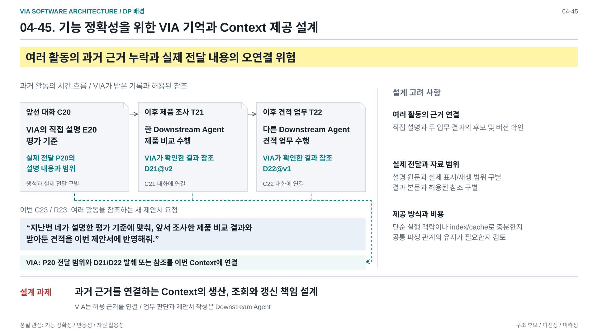
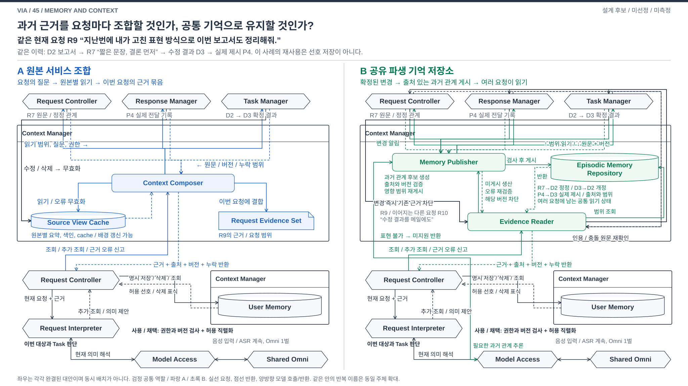
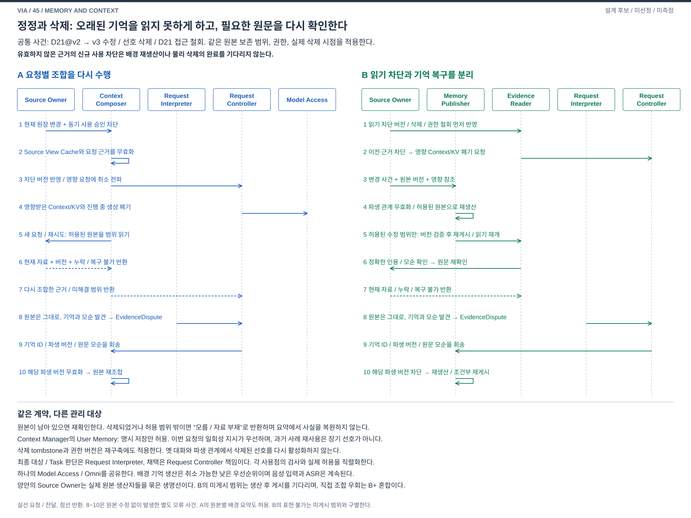

# 04-45. 기억과 Context: 원본 서비스 조합과 공통 기억 저장소

> 상태: **구조 비교 제안 / 사용자 검토 전 / 미선정 / 미측정** / 2026-10-06
> [04-50 영역 7](./04-50-agent-architecture-decision-map.md)에서 출발한 새 비교다. 45라는 번호는 독립 DP 선정이나 B 채택을 뜻하지 않는다. 구현, 모델 실행, 성능 측정과 참조 Architecture 변경은 포함하지 않는다.

## DP 배경 — 발표용 1페이지

[편집 가능한 draw.io](./diagrams/dp45-background.drawio) / [발표 삽입용 PNG](../../../presentation_files/dp-background/dp45-background.png) / [전체 지도와 배경 모아 보기](../../../presentation_files/dp-background/index.html)

지난번 보고서의 수정 전 결과, 결론 우선과 짧은 문장을 요청한 정정 발화, 수정 후 결과와 실제 전달 기록을 구분한다. 이번 새 보고서 Request가 그 표현 방식을 참조하므로 정정 내용, 결과 버전과 실제 전달 기록을 연결한 Context가 필요하다. 문서 실루엣은 기록 종류의 개념 표현이며 실제 보고서 본문이나 측정 자료가 아니다. 원본별 서비스, 공통 기억 저장소 또는 Context Manager 배치를 미리 답으로 그리지 않는다. 사용이 허용된 과거 정보의 연결과 유효성, 조회 및 유지 비용에서 책임 설계로 이어진다. 과거 표현 방식 참조는 장기 User Memory의 자동 등록이 아니며 현재 Request의 적용 의미 판단은 그대로 남는다. 원본 조합과 공통 파생 기억의 구조 비교는 아래 본문에서 다룬다.

과거 기록의 화살표는 이번 사용자 발화가 아닌 Context에 연결한다. 과거 결과 자체가 잘못이라는 뜻이 아니라 원본 수정, 삭제와 요약 누락 등에 따른 유효성 확인이 필요하다는 뜻이다. Context의 생산, 조회와 갱신 책임이 이 장의 결정 범위다. 노란색 문구는 예방할 설계 위험이며 실제 관측된 실패나 측정 결과가 아니다. [다섯 설계 문제 지도](./diagrams/dp-background-overview.svg)에서 각 결정 범위를 먼저 구분한다.

## 1. 사용자 문제와 이번 판단

**긴 대화와 여러 업무에 흩어진 과거 근거 및 허용된 사용자 기억을, 현재 요청을 정확하게 이해하는 데 필요한 Context로 어떻게 유지하고, 찾아 구성하고, 제공할 것인가?**

“지난번에 내가 고친 표현 방식으로 이번 보고서도 정리해줘.” 이 요청에 필요한 것은 단순히 ‘보고서’가 나오는 문장이 아니다. 사용자가 무엇을 고쳤는지, 어느 결과의 어느 버전에 반영됐는지, 실제로 무엇을 제시했는지 연결해야 한다. 그 연결을 이번 요청에서 다시 찾을 것인지, 여러 요청이 함께 읽을 수 있는 과거 관계로 유지할 것인지가 이번 설계 질문이다. 검색으로 찾은 관련 후보가 곧 이번 보고서의 대상이나 Task 확정은 아니다.

**작성자 판단: A 원본 서비스 조합형과 B 공통 파생 기억 저장소형을 비교한다.** 차이를 만드는 것은 미리 처리하는 시점이 아니라, **소비자가 요청마다 원본 소유자의 읽기 계약들을 조합하는가, 생산자가 유지하는 공통 과거 관계의 읽기 계약에 의존하는가**이다. Context 서브시스템의 서비스 조합 중심과 데이터 중심 조직을 비교하며, VIA 전체를 다른 architectural style로 바꾼다고 주장하지 않는다.

참조 설계에는 이미 단기 입력 근거, 중기 요약과 검색 view, cache, 장기 User Memory, 원본 버전과 누락 범위, 삭제와 철회에 따른 무효화가 있다. A에도 이 기능을 모두 허용한다. B를 ‘검색이 있는 안’, ‘기억이 있는 안’, ‘요약을 미리 만드는 안’으로 설명하면 비교가 성립하지 않는다. [참조 기억 수명 설계](../target-architecture/memory-and-context-lifecycle.md)와 [Architecture §9](../target-architecture/architecture.md#9-contextcachestale-처리)의 기능을 약화하지 않는다.

이번에 더하는 질문은 **여러 원본을 잇는 과거 관계를 공통 읽기 모델의 지속 계약으로 삼을 것인가**다. B에서는 그 계약이 정상 조회의 원본별 검색과 교차 결합을 대체한다. A의 뒤에 같은 저장소를 선택적 cache로 붙인 정도라면 A의 확장이지 이번 B가 아니다. 양안은 같은 기능 목표를 갖지만, B의 게시 범위 밖 의미를 처리하려면 기다림, 추가 생산 또는 원본 조합 경로가 필요하다. 이 제약도 비교한다.

## 2. 기존 후보와의 경계

### 2.1 Context Manager가 하는 일

Context Manager는 화면 interaction 전체나 모든 정보를 소유하는 Component가 아니다. Interaction Manager는 입력과 시점 근거, Request Controller는 대화와 Request, Task Manager는 Task와 확인된 업무 결과, Response Manager는 실제 제시 사실을 소유한다. Context Manager는 이 소유자들의 허용된 읽기 계약으로 근거를 검색하고 구성한다. User Memory의 원본과 삭제 원장은 예외적으로 Context Manager가 소유한다. State Store는 저장 수단이지 이 의미 권한을 가져가는 소유자가 아니다.

B는 Context Manager에 **공통 과거 관계의 생산, 게시, 폐기 책임**을 명시적으로 제안한다. 이것이 이미 참조 설계에서 완성돼 있다고 읽지 않는다. 화면 수집, 현재 요청의 의미 결정, Task 실행 권한을 가져오지 않는다. 기존 Component 이름은 유지하되 내부 Module과 자료 계약은 이 비교의 설계 제안이다.

| 문서 | 그 문서가 결정하는 것 | 45에서 가져오지 않는 권한 / 함께 사용할 때의 조건 |
| --- | --- | --- |
| [41](./04-41-request-resolution-control.md) | 다음 조회와 최종 의미 완성을 모델 또는 코드 중 누가 주도하는가 | 양안 모두 근거 API를 제공한다. 41 B의 유한 표현에 없는 관계는 B의 기억에도 있다고 자동 실행 가능해지지 않는다. 모델이 최종 binding을 다시 만들면 41의 혼합안이다. |
| [43](./04-43-request-interpretation.md) | 의도, 대상, Task 연결, 관계, 정정, 처리 방향을 통합 또는 기능별로 누가 생산하는가 | 과거 설명 순서나 정정 관계는 근거다. **이번 요청의** 최종 대상, Task, 정정 범위는 Request Interpreter가 생산한다. 43 C는 각 기능이 읽은 서로 다른 버전을 조정해야 한다. 제외된 Task별 B는 다시 도입하지 않는다. |
| [42](./04-42-lifecycle-ownership.md) | 대화와 업무 상태의 실행 수명 및 확정 권한을 어떻게 나누는가 | B의 기억은 원본 업무 원장이 아니다. 42 B와 결합하면 독립 원본별 cursor와 장애 범위를 유지한다. 기억 게시를 여러 원본의 공동 transaction으로 간주하지 않는다. |
| [34](./04-34-incremental-voice.md) | 확정 발화 뒤 처리할지, 발화 중 잠정 의미와 응답 준비를 진행할지 | 잠정 요청은 양안에 조회할 수 있지만 과거 사실로 게시하지 않는다. 정정된 잠정 결과와 KV를 버리는 책임은 남는다. 배경 기억 생산은 지속 음성 입력과 경쟁한다. |
| [31](./04-31-semantic-construction.md) | 현재 요청의 의미를 요청별로 만들지, 지속 Meaning Workspace에서 갱신할지 | 45의 과거 공유 기억은 현재 요청의 미확정 조건이나 의미 Workspace가 아니다. 31의 독립 후보 여부는 이번 문서에서 결정하지 않는다. |

**메인 비교에서는 41 A 모델 주도, 43 A 통합 판단, 42 A 모듈형 Core, 34 A 확정 발화 뒤 의미 처리를 양쪽에 동일하게 고정한다.** 이는 비교를 위한 설정이지 해당 문서의 선택 결과가 아니다. 검색 결과를 본 해석기가 추가 조회를 요구하는 반복은 두 안에 모두 남는다. Context가 항상 해석 전에 완성되는 일방향 pipeline이 아니다.

나머지 조합도 조건부로 가능하지만 자동 호환은 아니다. 특히 41 B의 표현 한계, 43 C의 근거 버전 불일치, 42 B의 원본별 가용성, 34 B의 잠정 입력과 확정 이력 혼동을 해결하지 않은 채 조합 완료라고 할 수 없다. 그림의 차이는 이 네 선택을 바꾸지 않아도 남는 기억 생산과 소비의 의존 구조다.

작성 중 별도 세션의 `04-44-continuous-interaction.md` 초안도 읽기 전용으로 확인했다. 44는 34의 A/B 단순 승격이 아니라 중앙 비동기 조정과 반응형 실행망을 비교한다. 45는 그 후속 실행 방식도 양안 동일하게 유지할 수 있다. 44의 어느 안에서도 기억 조회의 미완료/거절, source revision과 삭제 epoch를 반환하고 실제 사용/게시 게이트에서 확인해야 한다. B 기억 생산의 완료를 현재 입력 해석 완료나 응답 게시 허가로 사용해서는 안 된다. 44는 병행 작업이므로 본문/그림/상태를 이번 작업에서 수정하거나 확정하지 않는다.

### 2.2 탐색에서 무엇을 분리했는가

| 출발 질문 | 이번 판단 |
| --- | --- |
| 공통 구성자 vs 소비자별 직접 원본 조회 | 유효한 배치 선택이지만 공통 query library를 두면 동일한 원본 조합 방식이 된다. 이것만으로 주요 A/B를 만들지 않는다. A도 소비자별 목적에 맞게 좁은 Context를 만든다. |
| 요청 시 구성 vs 지속 파생 생산 | 배경 요약은 A에도 있다. B는 교차원본 관계의 공통 게시 계약이 정상 읽기의 기준이 되는 경우로 좁힌다. |
| 공통 기억 vs 소비자별 view | B도 목적별 view와 요청 임시 Context를 둔다. 공유 저장이 모든 소비자에게 같은 prompt를 공급한다는 뜻은 아니다. |
| 원문 vs 요약 vs 사실 vs 관계 | 네 표현을 양안에 허용한다. 정보 손실, 출처와 수명을 구별하는 설계이지 vector DB, 검색 알고리즘, prompt 길이의 비교가 아니다. |

## 3. 강한 두 구조와 메인 비교

[편집 가능한 draw.io](./diagrams/choice45-structure.drawio) / [발표용 PNG](./diagrams/choice45-structure.png)

**A는 왼쪽 블록만, B는 오른쪽 블록만 읽는다.** 현재 요청의 판단/채택, User Memory와 Model Access/Omni까지 각 블록 안에 완결되게 표시했다. 좌우를 연결하는 처리 경로는 없다. 두 안을 동시에 배치하거나 모델 가중치를 두 벌 사용하는 설계가 아니며, 각 안은 Omni 한 벌을 유지한다. 한 안 안에서 반복된 Request Controller와 Context Manager는 같은 주체의 책임을 확대해 표시한 것이다.

### 3.1 그림 한 장의 발표 순서

1. 같은 과거 원본을 짚는다. R7은 “짧은 문장, 결론 먼저”라는 정정, D2와 D3는 수정 전후 결과, P4는 D3를 실제 제시한 기록이다. R9는 그 방식을 이번 보고서에 적용하라는 새 요청이다. 처음부터 ‘사용자 선호’라는 정답 기억을 제공하지 않는다.
2. A의 요청과 반환을 따라간다. Context Composer가 소유자별 관련 기록, 요약과 index를 읽고 읽은 버전과 누락을 결합한다. 현재 요청의 해석기가 그 근거로 과거 정정을 이해하고 이번 적용 범위를 판단한다. 추가 근거가 필요하면 같은 경로를 다시 탄다.
3. B의 생산 경로와 조회 경로를 나누어 짚는다. 원본 확정 변경에서 Memory Publisher가 과거 정정과 결과 관계를 생산하고, 버전과 범위를 검사해 Episodic Memory Repository에 게시한다. 요청은 Evidence Reader를 통해 그 공통 관계와 원문 locator를 읽는다. 여러 요청은 동일 관계를 재사용하되 각자 현재 의미를 판단한다.
4. B의 갱신과 원문 복귀를 짚는다. 게시가 늦거나 관계가 틀리면 저장소가 있다는 이유로 사용하지 않는다. 원본 변경은 먼저 기존 파생물의 사용을 막고 재생산한다. 확인되지 않은 범위는 원본 조회나 대기, 확인 질문으로 돌아가며 그 추가 경로도 B의 비용이다.
5. 같은 User Memory, 현재 조건 검사와 공유 Omni를 짚는다. 기억 생산이 현재 지시를 덮지 않으며 과거 스타일을 자동 선호로 승격하지 않는다. B의 반복 재사용은 생산과 유지 비용을, A의 유연한 요청별 조합은 필요한 조회와 결합 비용을 부담한다. 선의 수가 성능 점수는 아니다.

### 3.2 A: 원본 서비스 조합형

**조직 원리:** 현재 요청이 필요로 하는 근거를 원본 소유자의 서비스 계약에서 모은다. Context Composer는 Context Manager 내부의 요청별 조합 책임이다. 공통 query helper, source adapter, 병렬 조회, 원본별 요약, 정정 링크 index, 재사용 cache와 부분 갱신을 모두 허용한다. 보유한 관련 자료를 매번 버리거나 전체 대화를 다시 읽지 않는다.

- **생산과 상태:** 원본 소유자가 원문과 확정 상태를 갱신한다. Context Manager는 파생 summary/index/cache를 유지한다. 특정 요청이 여러 source를 읽은 결과는 Evidence Bundle과 query receipt에 묶이고 해당 요청 수명에 귀속된다. cache hit도 출처와 현재 유효성을 확인한다.
- **조회와 반환:** Request Controller가 현재 요청과 허용 목적, 후보 source, 필요한 범위, 예산을 전달한다. Context Composer가 소유자의 bounded read를 호출하고 원문 발췌, 요약, stable ID, revision, 누락과 권한 거절을 반환한다. 41의 직접 Task Manager 조회가 필요한 현재 상태 확인은 남는다.
- **의미:** 메타데이터로 명확한 정정 ID나 버전 연결은 코드로 얻을 수 있다. 자유로운 과거 표현의 의미는 현재 해석 중 공유 Omni가 읽는다. 요약 생성에 Omni를 썼다면 A의 배경 비용으로 포함한다. A도 검증된 파생 관계를 cache할 수 있다.
- **갱신과 재확인:** 원본 변경은 관련 cache를 dirty/invalid로 만들고, 같은 요청에서도 다시 읽은 버전을 영수증에 반영한다. 인용, 수치, 부정, 조건과 정확한 수정 내용은 원문을 확인한다. 서로 다른 source의 결과가 모두 같은 시점이라는 보장은 없다.
- **잔여 의존:** 공통 관계가 선택적으로 재사용되더라도, source별 읽기 결과를 조합하고 누락을 해결하는 책임은 요청 경로에 남는다. 자주 쓰는 정정 링크 하나로 문제가 해결되면 B의 독점 이익이 아니다.

### 3.3 B: 공통 파생 기억 저장소형

**조직 원리:** 요청 소비자가 원본 서비스의 조합을 알기 전에, 생산 경로가 여러 원본을 공통 과거 기록과 관계로 조직한다. Episodic Memory Repository는 **파생 근거의 공통 읽기 모델**이며 원본 사실, 현재 Task 상태, 장기 선호 원본이 아니다. Context Manager 안의 Memory Publisher가 생산과 게시를, Evidence Reader가 목적별 조회와 반환을 담당한다. 별도 서버나 process, 별도 DB 제품은 필수가 아니다.

1. **확정 변경 수신:** Request Controller의 정정 확정, Task Manager의 확인된 결과 버전, Response Manager의 실제 제시 확정 등에서 변경 ID와 원본 revision을 받는다. 신호에는 허용된 최소 locator만 싣고 본문은 원본 read port로 읽는다. 신뢰할 변경 알림이 없는 source는 같은 권한 아래 증분 열거와 검증을 쓰며, 그 비용과 최신성 한계를 숨기지 않는다.
2. **공통 관계 생산:** 명시 ID, 설명 위치와 버전 관계는 코드가 연결한다. 의미 해석이 필요한 “아까 그 표현은 빼줘” 같은 연결은 공유 Omni에 근거 구간을 주어 가설을 만든다. 추출된 정정 범위와 요약은 `derived`로 표시한다. 모델이 본 적 없는 기록이나 미공개 자료를 보충하지 않는다.
3. **검증과 게시:** 필요한 원본들의 dependency revision vector, 권한 epoch, producer/schema version과 coverage를 검사한다. 읽는 동안 원본이 바뀌었으면 stale 결과를 게시하지 않고 해당 범위를 재시도한다. 하나의 게시 transaction에서 관계와 coverage를 함께 바꾸지만 **여러 원본의 전역 atomic snapshot을 만들어내지는 않는다.** 원본 사이 연결이 아직 없으면 unresolved로 남긴다.
4. **정상 조회 대체:** Evidence Reader는 repository의 공통 사건/관계 계약으로 후보를 찾고 관련 원문 locator, 요약과 근거 구간, 불확실성, 읽은 버전과 미게시 범위를 반환한다. 정상적인 covered 과거 조회는 source별 본문 fan-out과 교차 결합을 반복하지 않는다. 현재 권한, 원본 유효성 metadata 검사와 현재 Task 조회는 여전히 필요하다.
5. **갱신:** 수정과 정정 사건은 dependency index로 관련 관계를 사용 불가로 만든다. Memory Publisher가 영향 구간을 부분 재생산하고 새 revision을 게시한다. 삭제/철회는 producer의 처리 순서를 기다리지 않고 공통 사용 차단부터 적용한다. 이전 생산 job은 게시 직전 epoch/revision 검사에서 탈락한다.

B의 정상 경로는 repository를 읽는다. **NOT_COVERED일 때 원본 서비스 조합으로 즉시 우회하는 실용적 B는 명시적 혼합 B+다.** 본문 사례는 B의 대기/범위 생산 비용과 B+의 직접 원문 조합 비용을 구별한다. stale 값을 몰래 정상 hit로 사용하거나, 혼합 경로가 공짜라고 세지 않는다. 증분 backfill은 **지원하는 관계 종류의 미생산 범위**에만 Memory Publisher를 동기 실행하고 게시 후 읽는 경로이며, 현재 Request의 최종 의미를 게시하지 않는다. 스키마가 표현하지 못하는 관계는 `UNSUPPORTED_RELATION`으로 구별한다. 순수 B에서는 지원 제한을 알리고 표현 가능한 대상을 확인하며, 새 관계 구현은 V-08의 설계 변경이다. 반복 생산으로 해결됐다고 간주하지 않는다. B+는 이를 원본 기반 해석으로 보완할 수 있다.

## 4. 자료와 계약: 무엇을 기억하며 무엇을 잃는가

### 4.1 같은 자료, 다른 사용 수명

| 구분 | 권위와 생산자 | A의 사용 | B의 사용 / 금지 |
| --- | --- | --- | --- |
| 원본 입력과 기록 | Interaction Manager의 관측, Request Controller의 확정 Request, Task Manager의 결과, Response Manager의 실제 제시 | owner read로 읽고 요청에서 연결 | 같은 원본에서만 생산. 초안 응답을 실제 제시로, Agent의 추정을 확인된 결과로 바꾸지 않음 |
| 원문과 발췌 | 원본 소유자; source revision과 구간 필수 | 필요 구간 재조회, exact quote 확인 | locator와 허용된 발췌를 기억에 연결. 원문 삭제/만료 뒤 재구성 보장 없음 |
| 요약 | Context Manager의 파생 view | 원본별/구간별 요약과 cache | 공통 사건 요약. 말투의 세부, 순서, 부정, 예외를 잃을 수 있으므로 원문 대체 불가 |
| 구조화된 사실 | owner의 명시 필드 또는 출처 있는 추출값 | 후보 ID, 버전, 명시 정정 링크 | 사실과 모델 추출값을 구별. 잘못된 타입/누락된 조건을 확정 사실로 승격 금지 |
| 과거 관계 | 명시 연결 또는 derived 해석 | 요청 결합, 선택적 관계 cache | 정정→전후 결과, 실제 설명→순서, 결과→참조 관계를 지속 게시. 미래의 모든 지칭 의미를 선결정하지 않음 |
| 현재 요청의 임시 상태 | Request Interpreter의 의미 제안, Request Controller의 제어 | 조회 결과와 미확정 의미 | 같은 책임. repository는 현재 Task binding이나 잠정 정정을 저장하는 전역 Workspace가 아님 |
| 장기 User Memory | Context Manager; 사용자의 명시적 저장/변경/삭제 요청 | 목적에 맞는 ACTIVE 기억과 삭제 원장 읽기 | 동일. 과거 반복이나 추출 관계만으로 선호를 자동 등록하지 않음 |

**공유 대상은 필요에 맞게 고른 과거 근거다.** A의 요청별 view와 B의 소비자별 view 모두 권한과 목적별로 좁힌다. 공통 저장소가 모든 Request와 모든 모델 session에 같은 Context를 주는 것은 아니다. 원본의 저장 허용 여부와 읽기 허용 여부도 구별한다.

### 4.2 조회와 반환의 최소 계약

| 계약 | 필수 정보와 처리 |
| --- | --- |
| `EvidenceQuery` | Request/attempt ID, 목적과 권한 범위, 관계/주제 후보, 시간/대화/Task 후보 범위, 원문 필요 조건, 결과 및 시간/자원 예산. **Task 후보는 확정 Task가 아니다.** |
| `EvidenceBundle` | 원본 ID/revision/구간/locator, 자료 형태, 원문/추출 구분, 관련 후보와 근거, 읽은 권한 epoch, 누락/제외/거절/실패, freshness 확인 여부. 검색 점수는 정확성 확률이나 최종 binding이 아님 |
| `EvidenceQueryReceipt` | 실제 읽은 source별 범위, snapshot revision, page/중단 위치, 제외 조건, 부족한 범위. A는 read 결과에서, B는 게시 coverage와 이번 조회에서 구성. source별로 관리하며 글로벌 완전성을 주장하지 않음 |
| B `MemoryRecord` | 사건/관계 ID, 출처 dependency vector, 원문 구간, 생성 방식과 producer/schema version, 불확실성, source 범위와 관계 종류, 게시 revision, 유효성. 근거 없는 self-confidence로 원문 검증을 대체하지 않음 |
| B `Coverage` | source별 cursor, 확인한 시간/ID 범위, 지원 관계 종류, gap과 생산 실패. `NO_MATCH`는 **확인한 범위 안** 무일치, `NOT_COVERED`는 지원 종류의 미생산, `UNSUPPORTED_RELATION`은 표현 미지원, `DENIED`는 권한 없음, `UNAVAILABLE`는 획득 실패. 전체에 없다는 뜻으로 합치지 않음 |
| `UseCheck` | 모델 입력, 최종 의미 채택, Agent 제공, 응답 게시 시 현재 권한/삭제 epoch와 의존 source 유효성 확인. 확인 수단이 없으면 최신 결과라고 사용하지 않고 재조회/보류. 삭제 직전 만들어진 Bundle도 면제 없음 |
| `EvidenceDispute` | 파생 자료 ID, 게시 revision, 원문 구간과 모순/누락 근거. Request Interpreter의 제안을 Request Controller가 Context Manager에 전달한다. 해당 revision을 조건부 사용 중지하고 파생 소유자가 재검증/재생산한다. 소비자가 기억 값을 직접 고치거나 오래된 이의로 새 revision을 무효화하지 않음 |

B의 metadata 확인이 실패하면 repository에 본문이 있다는 이유로 현재 사용을 허용하지 않는다. 원본이 명시적으로 보존을 허용한 과거 snapshot은 ‘당시 버전’으로만 제공하고, 현재 내용이라고 말하지 않는다. 과거 참조의 유효성과 현재 액션 대상의 유효성은 별도다.

원본 revision이 그대로여도 요약이나 관계 추출이 틀릴 수 있다. 양안 모두 `EvidenceDispute`를 처리한다. A의 summary/cache 소유자와 B의 Memory Publisher는 보고된 revision을 조건부로 `DIRTY/UNRESOLVED` 처리하고 원문으로 검증한다. B는 검증된 새 관계와 coverage를 함께 재게시하며, 해결되지 않으면 공유 기억을 정상 결과로 복귀시키지 않는다. 이 경로는 원본 변경 알림을 기다리지 않는다.

### 4.3 공통 장기 기억, 삭제와 복구

명시적 “기억해”는 Request Interpreter의 해석과 Request Controller의 대상/scope 확인 뒤 Context Manager가 User Memory revision과 기록을 확정한다. 이번 한 번의 스타일 지시는 현재 Request 조건이며 저장된 선호를 수정하지 않는다. “지난번처럼”은 허용된 과거 사례를 한 번 참조하는 요청이지 지속 선호 저장 요청이 아니다.

삭제와 철회는 양안 모두 다음 순서를 갖는다. **사용 차단은 동기 경계이고, 본문과 파생물의 물리 정리는 재시도 가능한 후속 작업이다.**

1. User Memory 삭제는 Context Manager의 tombstone/epoch/cleanup intent를 함께 확정한다. 자료 권한 철회는 Policy Manager와 원본 계약의 현재 유효성에 반영한다. B의 변경 backlog보다 먼저 신규 사용이 차단돼야 한다.
2. A의 summary/index/cache와 활성 Bundle, B의 관계/repository/view, 양안의 관련 모델 session/KV와 대기 generation을 무효화한다. 게시/제공 경계의 재검사로 이미 읽힌 결과도 막는다. 불변 snapshot에 남았다는 이유로 허용하지 않는다.
3. 생산 중이던 오래된 job의 재게시를 거부한다. 중단/삭제 실패는 `PURGE_PENDING`으로 보존하고 재시작 후 계속한다. 사용 차단 완료와 local purge 완료를 구별한다. 외부 Agent에 이미 전달된 자료나 OS backup을 소급 회수했다고 말하지 않는다.
4. 과거 대화가 남아도 삭제된 선호를 현재 선호로 재추출하지 않는다. 삭제 원장은 opaque identity/revision으로 유지한다. 과거 대화의 명시적 사실 조회와 현재 선호 적용은 다르다. 새 명시적 저장 요청 없이 재등록하지 않는다.

검사 후 실제 사용까지의 틈도 닫아야 한다. 각 사용 게이트는 **현재 epoch 확인과 사용 승인/queue 등록을 같은 직렬화 경계**에서 처리한다. 철회 commit은 이전 epoch의 미실행 job과 미게시 결과를 fence하고, 실행 중 추론에는 취소를 요청하며 그 출력의 후속 사용을 막는다. B의 게시도 relation/coverage 쓰기와 expected epoch/revision 검사를 같은 조건부 commit으로 수행한다. 이것은 사용 승인과 철회의 순서 규칙이지 원본 전체의 동시 snapshot이나 외부 Agent 실행까지 포함하는 transaction이 아니다. 이미 시작된 외부 실행과 전달은 취소/회수 가능 범위만 보고한다. 42 B와 결합할 때에는 독립 게이트의 현재 권한 확인과 철회 순서 계약이 추가로 필요하며, 늦은 통지만으로 안전하다고 할 수 없다.

원문 만료/삭제/권한 상실로 근거를 재확인할 수 없으면 ‘복구 불가’ 범위를 반환하고 사용자가 자료를 다시 제공하거나 대상을 다시 지정하도록 요청한다. B의 추출 기억만으로 정확한 인용이나 수정 전후를 지어내지 않는다. 과거 보관 범위를 B를 위해 몰래 연장하지 않으며 참조 설계의 원본 보관 조건을 양안에 동일하게 적용한다.

### 4.4 중단과 재시작

A는 요청 receipt와 남아 있는 원본으로 재조회하고, 유효하지 않은 cache만 재구성한다. B는 마지막 **게시된** source별 cursor에서 중복 가능한 변경을 다시 읽고 원본 ID/revision과 producer version으로 중복을 제거한다. 관계와 coverage를 함께 게시하기 전에 중단되면 그 범위는 미게시다. source 신호 누락은 cursor gap/증분 대조로 발견하고 해당 범위를 사용 불가로 둔다. 원본이 있어야 재생산할 수 있으며 신호만으로 원문을 복원하지 않는다.

양안 모두 재시작 때 현재 삭제 원장을 먼저 적용한다. B의 저장소를 잃으면 과거 관계 재생산이 완료될 때까지 해당 조회는 제한되고 B+는 비용을 지불해 원본 조합으로 우회한다. 기억 복구가 Request/Task 실행 재시작이나 중복 Agent 명령을 유발해서는 안 된다. 별도 process 격리나 무중단 서비스를 이 비교의 자동 이익으로 세지 않는다.

### 4.5 정정과 삭제 경로 확대

[수명 그림 draw.io](./diagrams/choice45-lifecycle.drawio) / [PNG](./diagrams/choice45-lifecycle.png). 이 그림은 사용 차단과 복구 순서의 확대 자료이며 메인 비교의 구조 설명을 대신하지 않는다. 원본 소유자 묶음 생명선은 실제 Request Controller, Task Manager, Response Manager 등 해당 원본의 소유자를 뜻하며 새 Component가 아니다.

## 5. 같은 사건을 통과시키기

공통으로 같은 사용자 입력, 원본 이력, 수정 시점, 접근 권한, 보관/자원 예산과 외부 지연을 준다. B의 시작 상태는 원본에서 실제 생산 가능한 자료만이며, 그 생산 호출과 잘못된 추출도 포함한다. A의 warm cache를 허용하고 양안 모두 cold/warm, 권한 철회와 원문 부재를 구분한다. 아래는 **설계 사고 실험**이지 실행 결과가 아니다.

### 5.1 메인 사례: 지난번 고친 방식

| 사건 | A: 원본 조합 | B: 공통 기억 / 실패 시 |
| --- | --- | --- |
| 과거 D2 제시 뒤 R7 정정, D3 생성, P4 실제 제시 | 각 owner 확정, 관련 summary/index 부분 갱신. 정정 ID가 명시적이면 index로 남길 수 있음 | 같은 원본 변경을 읽어 `R7 corrects D2`, `D3 revises D2`, `P4 presents D3`를 게시. 직접 기록된 연결과 모델이 추출한 표현 범위를 구별 |
| R9 “지난번에 내가 고친 표현 방식으로 이번 보고서도 정리해줘.” | 관련 R7 후보와 D2/D3/P4를 source별로 조회. cache가 유효하면 재사용. receipt를 결합 | Evidence Reader가 정정/결과/제시 관계와 적용 후보를 조회. source별 본문 검색 대신 게시된 관계를 읽지만 현재 권한과 revision 검사는 유지 |
| ‘짧은 문장’만 summary에 남고 ‘결론 먼저’ 누락 | 원문 R7과 결과 발췌 재조회. 처음 summary만 믿으면 A도 오류 | B의 관계를 완전한 정답으로 믿으면 여러 요청에 오류 확산. 원문 확인으로 누락 발견, 해당 기억 invalid, 부분 재생산 후 재조회 |
| 이번 보고서 D9에 무엇을 적용할지 결정 | 같은 Request Interpreter가 현재 조건, 원문 정정과 실제 결과를 보고 제안 | 같은 Request Interpreter가 판단. 과거 relation hit만으로 D9의 Task를 정하거나 R7을 장기 선호로 저장하지 않음 |
| 이후 R10에서 같은 과거 스타일 재참조 | 유효 cache면 같은 자료 재사용. 아니면 필요한 부분 재조회 | 공통 관계를 재사용. 반복 이익은 A의 cache hit보다 더 많은 필요한 결합을 대체할 때만 남음 |

### 5.2 추가 여섯 사례

| 같은 사용자 사건과 원본 조건 | A의 실제 경로 | B의 실제 경로 | 지원과 사용자 영향 |
| --- | --- | --- | --- |
| 여러 대화 뒤 “아까 설명해준 두 번째 방법으로 진행해줘.” 실제 P8에는 세 방법, P9는 무관한 응답 | Response Manager의 **실제 제시 순서**와 원문을 검색. 현재 해석기가 어느 설명의 두 번째인지 판단 | 게시된 `P8 / item 2 / 원문 구간`과 관련 대화 관계 조회. P8이 미게시면 범위 생산 후 조회 또는 B+ 원문 조회 | 둘 다 설계상 지원. 여러 설명이 유효 후보면 질문. 생성 초안 순서, 전역 두 번째, 검색 순위를 사용자 설명 순서로 대체 금지 |
| 여러 업무 중 과거 보고서 D3 결과를 다른 업무에 사용 | Task Manager 결과와 Request Controller 연결, 필요 시 Response Manager 제시 기록을 조합 | 공통 결과/참조 관계로 후보 획득. 실제 최신 버전과 현재 사용 권한은 owner 확인 | 둘 다 부분 자료/권한 부족을 표시. B는 교차 업무 원문 검색을 줄일 여지. 지원 종류의 gap은 추가 생산, 표현 미지원은 제한 안내/설계 변경 또는 B+ 원문 조합. Downstream Agent 내부 업무 추론은 맡지 않음 |
| 저장된 M1은 간결한 답, 이번에는 “자세히 설명해줘” | ACTIVE M1과 현재 명시 지시를 별도 반환. 현재 지시 우선 | 같은 User Memory 원본을 별도 읽음. 과거 관계 빈도가 M1이나 현재 지시보다 우선하지 않음 | 둘 다 지원, 본질적 우위 없음. M1을 변경/삭제하지 않음 |
| 과거 D3가 D4로 수정되거나 summary가 틀려 원문 필요 | source 버전과 cache dependency 불일치로 재조회, 해당 요약 재생성 | D3 기반 관계 사용 차단 후 D4 영향 구간 재게시. ‘당시 D3’와 ‘현재 D4’를 섞지 않음 | 둘 다 원문 접근 가능 시 복구 경로 지원. 원문이 없어졌으면 확인 불가, B의 남은 파생물도 원문 대체 불가 |
| M1 삭제 또는 D3 접근 철회 뒤 오래된 summary/Context 존재 | 공통 epoch 검사로 모델 입력/제공/게시 차단, cache/Bundle/KV 폐기 | 같은 즉시 차단 + 공유 관계와 소비자별 view 폐기, 늦은 producer 게시 거부 | 둘 다 필수 통제. B는 영향 범위와 삭제 작업이 더 클 수 있음. 삭제된 M1의 과거 발언 재추출은 금지 |
| 짧은 일회성 “이 문장만 존댓말로 바꿔줘”, 과거 근거 불필요 | 현재 입력만으로 처리, 과거조회 생략. 공통 원본 기록 외 추가 유지 최소 | 조회를 생략할 수 있지만 앞선 원본 변화의 생산/저장 비용은 이미 발생할 수 있음. 유한 생산 범위 밖 사건은 미게시 | 기능상 동등. B에 재사용 이익이 없는 반례. 모든 일회성 사건을 모델로 기억화하는 정책은 요구하지 않지만 생산 제외로 생기는 coverage gap은 표시 |

두 안 모두 필요한 원문이 없거나 두 과거 설명이 동등하게 맞으면 재선택을 요청할 수 있다. 이는 적절한 불확실성 처리이지 원래 목표의 완전한 자동 달성은 아니다. 검색과 관계 추출이 임의의 과거 지칭을 항상 해결한다는 지원 보장은 **미확인**이며, 구현 검증된 완전 지원으로 표시하지 않는다.

## 6. V-01~13: 품질 손익과 정상 사용 비용

[03-00](./03-00-quality-scenarios.md)의 합의된 순서로 검토한다. 우열 점수나 가중 합산은 하지 않는다. 먼저 기능 정확성/적절성/완전성, 다음 시간, 변경, 자원, 복구, 나머지 관점이다.

| 순서 / 관점 | A가 유리해질 조건과 비용 | B가 유리해질 조건과 비용 / 반증 조건 |
| --- | --- | --- |
| 1 / **V-01 정확성** | 요청의 구체적 표현에 맞춰 원문 범위와 결합을 바꿀 수 있음. 검색 누락, 여러 source/버전의 불완전 결합과 반복 해석 오류 위험. warm 관계 cache도 가능 | 과거 정정/제시/결과 연결을 공통으로 유지해 반복 교차조회에서 관계 누락을 줄일 가능성. 그러나 잘못 추출한 관계를 여러 요청이 공유하고 schema가 예외/부정을 잃을 수 있음. 원문 확인 뒤에도 A와 동일한 오류라면 정확성 우위 없음 |
| 1 / **V-02 적절성** | 필요한 근거를 동적으로 넓혀 추가 설명 없이 해결할 수 있음. 반복 결합에 실패하면 이미 설명한 내용을 다시 묻게 됨 | 관련 과거 연결이 게시돼 있으면 재설명/수동 Task 연결을 줄일 여지. 미게시/모호한 관계는 추가 대기나 질문. 동일한 A index/cache로 같은 질문을 없애면 B의 고유 이익 아님 |
| 1 / **V-03 완전성** | 지원 owner read 범위 안의 새로운 조합을 요청 중 시도. 정확히 복원할 원문이 없는 과거 지칭은 제한 | 게시 관계 종류와 coverage 안에서 공유 과거 참조. 미생산은 backfill 가능, 표현 미지원은 설계 변경 또는 B+ 필요. 저장소만으로 임의의 새 관계를 완전 지원하지 못함. 양안의 원문 부재/권한 한계는 동일 |
| 2 / V-04 반응성 | 유효 cache hit나 과거 불필요 요청에서 추가 단계 작음. cold fan-out과 해석 반복이 유효 응답을 지연 | covered read가 원본별 검색/결합을 대체하면 빨라질 여지. 게시 지연, 권한 재확인, 오류 복구는 지연. 준비 작업의 공유 Omni 경합이 지속 입력과 상호작용을 방해할 수 있음 |
| 2 / V-05 VIA 귀속 완료 시간 | 현 요청에 필요한 만큼만 읽음. 근거 보완과 반복 질문은 완료 경로를 늘림 | 반복 재사용 때 VIA의 조회/구성 시간을 줄일 가능성. 사전 생산을 현재 요청 시간 밖으로 옮긴 것과 총비용 감소는 다름. backfill/재판단/재게시가 완료 경로에 들어오면 악화. 외부 Agent 실행 시간은 양안 동일 외부 조건 |
| 3 / **V-08 변경 용이성과 모듈성** | 원본 adapter 변경은 이미 국소화 가능. 새 관계는 요청 조합에서 시도 가능하나 여러 소비 경로에 같은 결합이 퍼질 수 있음 | 원본별 차이는 생산 adapter에서 흡수하고 소비자는 공통 계약 유지 가능. 반대로 관계 schema/의미 변경은 기존 기억 재생산과 모든 해당 소비자 검증으로 전파. 단순 파일 수나 계약 수로 이익을 증명하지 않음 |
| 4 / **V-06 자원 활용성과 수용량** | 재사용 적은 workload에서 필요한 조회/해석만 수행. 반복 결합은 모델 입력과 Context/KV를 다시 점유할 수 있음 | 여러 요청의 관계 재사용으로 중복 읽기/입력을 줄일 여지. 생산 호출, 미사용 기억, 중복 저장, dependency index, backlog, 재생산과 생산 session/KV를 추가. 작은 요청 위주이거나 변경이 잦으면 손해. RAM/저장/에너지와 동시 수용량은 별도 확인 |
| 5 / V-07 결함 허용성과 복구성 | owner별 실패를 receipt에 드러내고 해당 범위 재시도. source 분산 조회 도중 부분 결과 처리 필요 | 게시된 유효 자료 재사용과 cursor 재생산 가능. publisher 실패, cursor gap, 잘못된 공동 관계의 넓은 영향, repository 손실에 대한 복구 경로 증가. 별도 장애 격리 효과는 process 변경 없이는 주장 불가 |
| 6 / V-09 분석 및 시험 용이성 | 요청 receipt로 무엇을 읽었는지 추적. 요청마다 다른 검색과 결합의 재현 필요 | 기억 생산 실패와 조회/현재 해석 실패를 분리할 수 있음. producer version, 게시 전후 revision, gap과 삭제 race를 함께 재현해야 함. 생산 provenance 없으면 오히려 원인 은폐 |
| 6 / V-10 기밀성 | 목적별 source 접근과 파생 사용 fence 필요. 임시 Context와 cache도 유출/삭제 대상 | 공통 기억의 교차 source 결합이 추가 노출면. 원본별 scope의 교집합, 즉시 use fence, 파생/KV 삭제 필요. 중앙 저장만으로 안전하거나 통제 쉬워진다고 주장하지 않음 |
| 6 / V-11 상호운용성 / 공존성 | source별 의미 보존과 누락 보고 필요. on-demand burst가 다른 PC 앱과 경합 | 공통 형식이 소비를 통일하지만 외부 source의 의미/버전 계약 손실 위험. 배경 생산이 CPU/GPU/IO를 점유. 새 외부 protocol 지원 자체는 구조의 자동 이익 아님 |
| 6 / V-12 조작 용이성 / 오류 방지 | 근거 부족을 보여 재선택. 사용자가 현재/과거 버전과 선호/일회성 구분 가능해야 함 | 공유 과거 근거의 잘못된 관계를 사용자 정정으로 추적하고 폐기할 수 있어야 함. 익숙한 기억이라는 이유로 잘못된 대상 자동 선택 금지. 사용자 제어 기능은 양안 공통 |
| 6 / V-13 설치 용이성 | 기존 runtime과 local 저장을 유지할 수 있음 | 추가 모델/서버 필수 아님. 저장 schema migration, 생산 cursor와 잔여 자료 cleanup이 추가. 별도 runtime이 없으므로 설치 시간의 큰 차이는 현재 근거 없음 |

### 6.1 한 벌의 Omni에서 부담하는 비용

두 안은 같은 [공유 Omni 조건](../target-architecture/shared-omni-runtime.md)을 유지한다. 의미 추론과 S2S는 한 벌의 on-device Omni 가중치를 쓰고 지속 음성 capture/독립 Streaming ASR를 유지한다. 추가 embedding, reranker, helper 모델과 vector DB는 전제하지 않는다. 검색은 원본 메타데이터/키워드/ID와 게시된 관계를 사용할 수 있다. 새 learned helper가 필요해지면 별도 전제 변경과 전체 weights/runtime/KV/설치/경합 비용 검토가 필요하다.

- **A:** 요청 전 요약 생산 + 요청별 owner 조회 + 필요한 현재 해석/원문 확인 + cache 유지/무효화 비용. cache hit는 다시 만들지 않으며 요청 Context를 공유 가능한 원본 참조로 줄일 수 있다.
- **B:** 원본 변경 획득 + 필요할 때 과거 관계 모델 추출 + 검증/게시 + 요청별 기억 조회/목적별 Context + 현재 해석 + 갱신/삭제/재생산 + 원문 확인 비용. 관계의 단순 ID 연결까지 모두 모델 호출이라고 가정하지 않는다.
- **비용 비교 경계:** 시작 원본에서 기억을 만드는 비용, 사용되지 않은 생산, 변경으로 버린 생산, 요청 중 backfill, 전체 저장과 peak Context/KV를 모두 포함한다. 모델 호출 수만으로 token/메모리/시간을 대체하지 않는다.
- **실행 우선권:** 배경 생산은 유한 queue와 저장/Context 예산 아래 idle budget에서 수행하고 음성/foreground 압력이 생기면 먼저 중단한다. 미완료 범위는 coverage에 남긴다. 동기 backfill도 foreground budget을 무한 점유하지 않으며 초과하면 보류/질문/B+로 전환한다. 실제 기기 수치는 미정이며 동시 실행을 측정했다고 주장하지 않는다.

공통 repository는 공통 KV를 뜻하지 않는다. 생산 session과 요청 session은 분리하고, 소비자별 Context도 목적에 맞춰 구성한다. 원문이 철회되면 작은 요약으로 압축했다는 이유로 Context/KV의 삭제 의무가 사라지지 않는다.

## 7. 작은 확장과 현실적 혼합을 먼저 반박해 보기

| 가장 싼 반론 | 판단과 남는 차이 |
| --- | --- |
| A에 정정 링크 index와 source별 요약 추가 | **허용하며 가장 먼저 검토할 확장이다.** 메인 사례 하나는 이것만으로 충분할 수 있다. 단일 정정 사례의 성공을 B의 구조적 필요성으로 삼지 않는다. |
| A의 공통 query library/cache로 여러 소비자의 중복 제거 | 강한 A다. 같은 근거 품질과 사용자 수고를 달성한다면 B 선택 이유가 약해진다. 단, 생산자가 공통 관계의 coverage/게시/정정 책임을 지고 소비자 정상 읽기 계약이 그 관계로 바뀌면 점진 전환을 통해 B에 도달한 것 |
| B에서 publisher만 끄고 요청마다 생성 | 게시 전까지 조회가 불가능하면 동기 backfill B이며 생산 시점만 바뀐다. 요청이 owner 계약을 다시 조합하고 자체 receipt/누락 해결을 책임져야 A로 전환된다. 이름 변경이나 producer 비활성화만으로 소비 의존이 복원되지 않음 |
| B에 모든 경우 원본 fallback 추가 | B+라는 실용적 혼합. 기능 완전성과 복구를 보완하지만 두 경로의 계약/검증과 자원 비용을 부담한다. 대부분 요청이 fallback이면 공통 기억 중심의 정상 경로라는 선택 이유가 소멸 |
| 관계 종류 일부만 B, 나머지는 A | 유력한 점진 도입 형태. 예: 실제 제시 순서/명시 버전 연결은 공통 읽기 모델, 자유로운 표현의 정정 의미는 요청 시 해석. 어디서 어떤 품질 이익이 남는지 관계별로 분리해야 함 |
| 소비자별 별도 장기 기억을 복제 | 이번 주요 상대안으로 채택하지 않음. 현 요구에서 필요한 것은 같은 원본의 목적별 view이지 서로 다른 선호 원본이나 Task별 의미 권위가 아님. 목적별 view는 양안에 허용하고 별도 기억 권위를 만들지 않음 |

**가장 싼 A→B 전환:** 기존 index/요약 인프라에 공통 과거 관계의 producer, 출처/coverage 게시와 무효화를 붙이고, 해당 소비자의 정상 조회를 owner 조합에서 공통 관계 계약으로 옮긴다. 첫 관계 하나는 작게 시작할 수 있다. 중요한 변화는 코드량이 아니라 **누가 원본 간 연결을 완성하고, 무엇이 준비돼야 요청이 정상적으로 읽을 수 있는가**가 바뀌는 지점이다.

**가장 싼 B→A 전환:** 원본과 read port는 남아 있으므로 데이터 원본을 이관할 필요는 없다. 공통 관계를 읽던 소비 경로에 필요한 원본 탐색, 교차 결합, receipt와 gap 처리를 복원하고 repository를 선택적 cache로 낮춘다. 관련 공통 query가 이미 있다면 전환 비용은 작다. 따라서 ‘되돌리기 어렵다’ 자체를 B의 자격으로 내세우지 않는다.

## 8. 조건부 선택 이유와 독립 후보의 한계

**45는 이 A/B로 설계 검토를 진행할 가치가 있다.** 이유는 장기 대화와 여러 업무에서 흩어진 근거를 제대로 이어 제공하는 정상 사용 경로가 달라지고, 그에 따라 V-01~03과 시간/자원/변경 비용이 직접 충돌하기 때문이다. 원본 조합의 유연성을 택할지, 공통 과거 관계의 생산과 유지 의무를 부담할지가 핵심 결정이다. 중앙/분산이라는 이름이나 Component 수의 차이로 판단하지 않는다.

**A를 우선할 조건:** 원본별 요약과 작은 관계 index로 필요한 과거 참조를 충분히 해결하거나, 반복 재사용이 적거나, 새로운 관계/원본 변화가 잦거나, 공유 Omni의 idle 여력이 작다. 이 경우 B를 독립된 큰 구조로 만드는 것보다 현재 참조의 검색/요약/정정 링크를 보강하는 것이 타당하다.

**B를 선택할 조건:** 여러 대화와 업무에서 같은 교차원본 관계가 반복적으로 필요하고, 강한 A의 공통 query/cache로도 필요한 연결 누락과 재설명 부담이 남으며, 원본 변경을 추적해 충분한 coverage를 유지할 수 있다. 소비자가 공통 관계를 읽어 실제로 요청별 결합을 대체해야 하고 생산 오류, 갱신/삭제와 자원 대가를 감수할 이유가 있어야 한다. B+ 또는 관계별 혼합은 기능 범위를 보완할 수 있지만 순수 B의 이익으로 합산하지 않는다.

**가장 큰 약점:** 참조 설계가 이미 상당한 파생 view 기능을 갖고 있어, 실제로 필요한 관계가 소수이면 45는 기존 설계의 확장으로 축소된다. 이 반론은 아직 측정으로 해소되지 않았다. 작성자의 구조 판단은 ‘Context 서브시스템에서 서비스 조합과 공통 읽기 모델이라는 서로 다른 조직을 구체화했다’까지이며, ‘독립 DP로 최종 선정해야 한다’나 ‘B가 더 정확하다’가 아니다.

[04-30 §4.5](./04-30-comparison-guide.md#45-완료-보고-전-필수-판정)의 네 질문에 대한 현재 답은 다음과 같다.

1. **목적을 달성하는 원리:** A는 현재 요청에 필요한 원본 계약들을 조합하고, B는 별도 생산/게시된 공통 과거 관계를 읽는다. 같은 허용 근거로 재설명/재선택을 줄이되 최종 현재 의미의 생산자는 바꾸지 않는다.
2. **전환 시 유지와 재설계:** 원본 소유, 권한, 현재 의미/채택, 공유 Omni는 유지한다. 원본 간 연결을 책임지는 생산자와 소비자의 정상 읽기 계약, 미준비 범위 처리와 오류 복구는 §7의 방향별 설계로 전환해야 한다.
3. **가장 싼 확장/혼합의 판정:** 소수 관계 index/cache로 같은 결과를 얻으면 A 확장을 우선하며 B의 독립 선택 이유를 철회한다. 공통 읽기 계약으로 옮겨야 이익이 남는 범위만 B로 만들고 나머지는 A로 두는 혼합도 유력하다.
4. **선택할 사용자 조건과 대가:** 짧은 일회성/새로운 관계가 많으면 A, 여러 업무의 교차원본 참조가 반복되고 게시 범위를 유지할 수 있으면 B를 검토한다. A의 요청별 결합 누락/비용과 B의 추출 손실, 공통 오류 확산, 게시 지연/유지 비용을 §5~6의 같은 사건/품질로 비교한다.

후속 선택을 뒤집을 조건도 명확하다. **A의 작은 확장으로 같은 근거 누락과 사용자 수고를 해소하거나, B에서 원문 우회/재생산이 지배하거나, 잘못된 관계의 공유가 정확성을 악화하거나, 지속 음성 조건에서 생산 여력이 없으면 B를 지지하지 않는다.** 반대로 같은 허용 원본으로 B가 반복적인 교차원본 누락을 줄이고 그 비용을 감당할 수 있다는 근거가 생기면 B를 지지할 수 있다. 이번에는 그 시험을 실행하거나 지표를 동결하지 않는다.

## 9. 검수와 보존 범위

스타일을 구체화하는 참고 메커니즘은 2026-10-06 공식 문서에서 확인했다. [Gateway Aggregation](https://learn.microsoft.com/en-us/azure/architecture/patterns/gateway-aggregation)은 여러 backend 호출 결과를 요청에서 모으는 메커니즘, [Materialized View](https://learn.microsoft.com/en-us/azure/architecture/patterns/materialized-view)는 원본으로부터 별도 읽기 모델을 유지하고 소비자가 읽는 메커니즘의 참고다. VIA에 cloud gateway나 microservice 배치를 도입한다는 뜻은 아니다. 특히 materialized view도 넓은 의미의 cache일 수 있다. **B의 근거는 cache가 아니라는 명칭이 아니라, 공통 관계 게시 계약이 정상 소비 의존을 바꾼다는 설계**다. 공식 패턴명이 VIA의 독립 DP 자격이나 정확성 우위를 입증하지 않는다.

[독립 리뷰와 수정 기록](./04-45-memory-and-context-review.md)에서 실제 지적, 조치, 재검토와 렌더 검증 범위를 확인한다. 메인 SVG와 draw.io는 [전용 생성기](../../../../scripts/architecture/generate_memory_context_diagrams.py)의 같은 scene에서 생성한다. 그림이 잘 렌더된다는 사실은 구조 자격이나 품질 우위의 검증이 아니다.

31/32/34/35/36/41/42/43의 본문과 그림, 참조 Architecture, QA/ADR는 변경하지 않는다. 기존 후보의 제외/승격 결론을 새로 만들지 않는다. 이번 문서와 그림, 검수 기록 및 읽기 안내만 게시하며 최종 DP/A/B 선정은 사용자 검토 이후의 별도 일이다.
