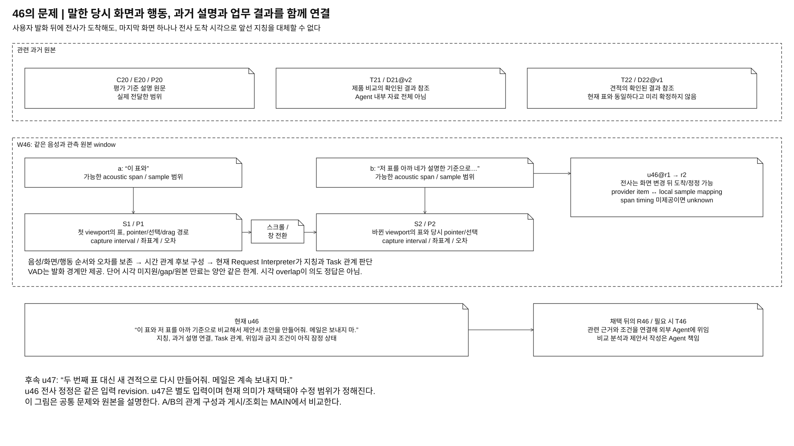
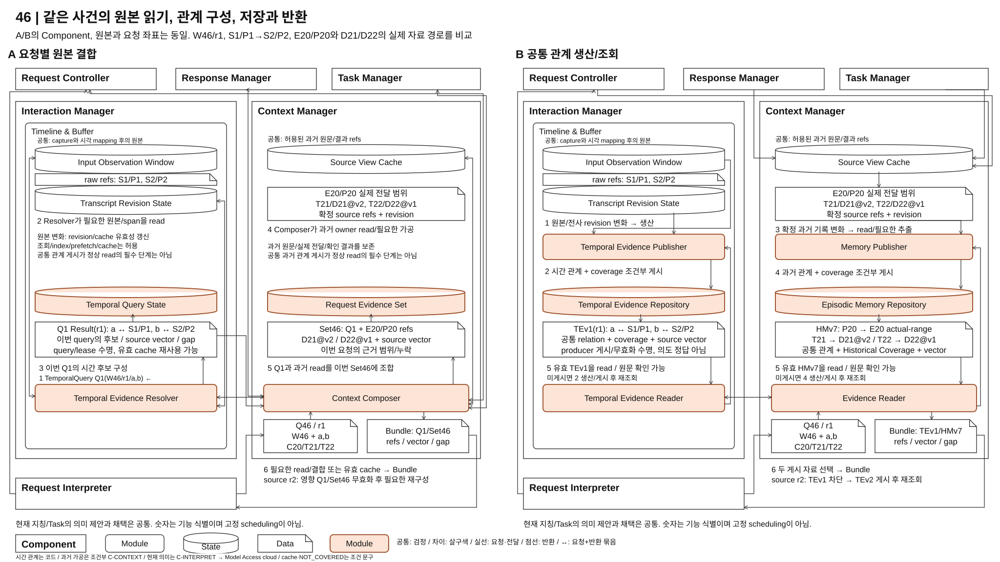
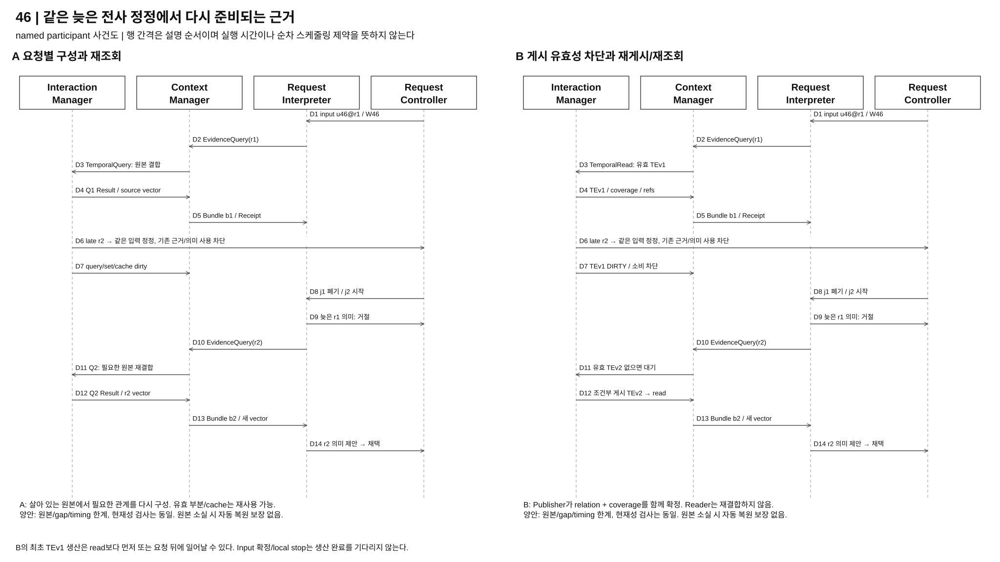
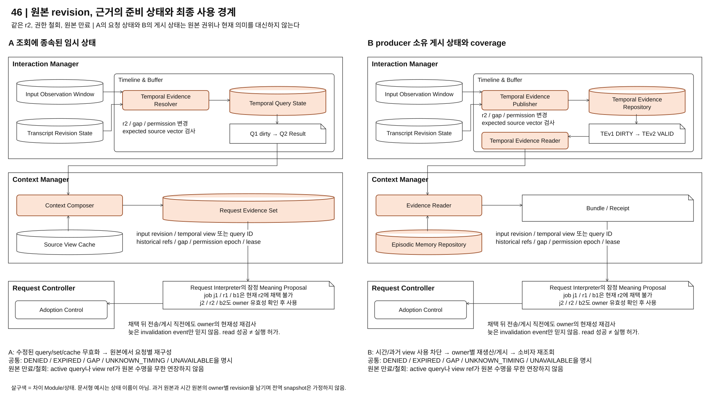

# 04-46. 발화와 관측부터 과거 기록까지: 요청별 근거 구성과 공통 근거 생산/조회

> 상태: **사용자 지시에 따른 46 재설계 / 사용자 검토 준비 / A/B 미선정 / 구현과 품질 측정 없음** / 2026-10-10
> 기존 [45](./04-45-memory-and-context.md)는 보존한다. 46은 45의 요청별 구성 / 공통 관계 생산/조회 선택을 **Interaction Manager의 시간 근거 처리부터 Context Manager의 과거 근거 처리까지** 확장한 검토안이다. 새 번호나 문서 완성은 주요 DP 선정 또는 품질 우위의 증명이 아니다.
> [04-40](./04-40-common-execution-contract.md)의 로컬 VIA, 로컬 VAD와 클라우드 음성/전사 및 의미 LLM을 적용한다. 기존 on-device 참조 Architecture, 다른 비교와 QA/ADR는 변경하지 않는다.

## 0. 이번 재설계에서 실제 바뀐 것

초기 46은 양안의 Interaction Manager가 시간 대응을 완성하고, 그 뒤에 45의 Context Manager를 붙였다. 사용자는 이것으로 시간 대응까지 포함한 구조 대안이 되지 않는다고 지적했다. 이번에는 **시간 관계를 만들어 공급하는 정상 계약부터 다르게** 설계한다.

| 범위 | A 요청별 근거 구성 | B 공통 근거 생산/조회 |
| --- | --- | --- |
| Interaction Manager | Temporal Evidence Resolver가 필요한 원본 구간을 읽어 시간 관계를 구성하고 조회 결과로 반환 | Temporal Evidence Publisher가 공통 시간 관계를 생산/검사/게시. Temporal Evidence Reader는 게시 자료를 읽음 |
| Context Manager | Context Composer가 시간 조회 결과와 과거 owner read를 요청별로 구성 | Memory Publisher가 과거 관계를 게시. Evidence Reader는 IM의 게시된 시간 관계와 CM의 게시된 과거 관계를 목적별로 공급 |
| 정상 읽기의 의존 | 원본 read와 필요한 결합의 완료. 유효 cache는 선택적으로 재사용 | 필요한 종류/범위의 유효 게시 자료. 미게시면 생산/게시 후 재조회 |
| 수정의 추가 상태 | 영향을 받은 query/set/cache 무효화와 재구성 | 시간/과거 자료의 dependency와 coverage 차단, 재게시와 소비자 재조회 |

공통으로 남기는 것은 capture, 로컬 VAD, sample/clock mapping과 원본 보존, 같은 관측/권한/수명/모델 조건이다. **기본 시각 정규화**와 **발화 구간-화면-행동의 교차 원본 관계 구성**을 구별한다. 전자는 공통 입력 계약이고 후자는 이번 A/B의 실제 처리 차이다.

B는 시간 자료를 Context Manager에 다시 복제/게시하는 이중 pipeline으로 만들지 않는다. 시간 관계의 owner는 Interaction Manager, 과거 관계의 owner는 Context Manager다. 공통 생산/조회라는 조직 원리를 두 책임에 적용한다. 하나의 중앙 raw 저장소, 전역 snapshot 또는 새 process를 의무화하는 안이 아니다.

## 1. 문제와 대표 사용자 경험

### 1.1 필요한 것은 마지막 화면이 아니라 말한 당시의 관측이다

사용자는 평가 기준을 VIA에게 설명받고 제품 조사와 견적 확보를 서로 다른 Agent에게 맡겼다. 지금 첫 문서의 표를 가리키며 “이 표와”, 스크롤/창 전환 뒤 다른 표를 가리키며 **“저 표를 아까 네가 설명한 평가 기준으로 비교해서 제안서 초안을 만들어줘. 메일은 보내지 마.”**라고 한다. 전사는 화면 변경 뒤 도착하고 이후 수정될 수 있다.



[draw.io](./diagrams/dp46-background.drawio) / [PNG](./diagrams/dp46-background.png)

| 표식 | 원본과 아직 확정하지 않은 것 |
| --- | --- |
| u46@r1 / W46 | 입력과 관측 window, acoustic/sample 범위, 전사 revision. Task 정답 없음 |
| a / b | “이 표와” / “저 표를”의 가능한 acoustic 구간. provider가 제공하지 않으면 unknown |
| S1/P1, S2/P2 | 당시 화면/viewport와 pointer/selection/drag 구간. 의도한 표의 의미 정답 아님 |
| C20 / E20 / P20 | 45의 평가 기준 대화, 설명 원문과 실제 전달 범위. “아까”의 후보 |
| T21 / D21@v2, T22 / D22@v1 | 45의 제품 비교와 견적 Task 및 확인된 결과 참조. 화면의 표와 동일하다고 미리 가정하지 않음 |
| R46 / T46 | 현재 의미 제안과 채택 뒤의 Request 및 필요 시 새 제안서 Task |
| u47 | “두 번째 표 대신 새 견적으로 다시 만들어줘. 메일은 계속 보내지 마.”라는 후속 정정 |

VIA는 당시 관측과 관련 과거 근거를 제공하고 요청의 의미/관계를 연결해 위임한다. 평가 기준 적용, 비교 분석과 제안서 작성의 domain reasoning/계획/실행은 Downstream Agent 책임이다. 시간 overlap이나 게시 hit가 “이 표의 정답”, “아까의 정답” 또는 Task 연결을 확정하지 않는다.

### 1.2 함께 다루는 요구와 제외하는 결정

[UC-03/04](../../05-representative-use-cases.md#uc-04)의 선택, 복수 순차 지시, 원형 경로, drag, 집합/단일, 발화 중 정정과 화면 이동을 시간 근거 계약에서 다룬다. 과거 설명/업무 참조와 실제 전달, 후속 정정 및 기억의 변경/삭제도 45와 같은 범위로 남긴다. 최종 자연어 지칭 지원과 provider timing capability는 검증되지 않았다.

capture Hz, VAD 임계값, retention 수치, worker/thread/queue와 재시도 간격, DB 제품과 시간 결합 알고리즘은 이번 주요 비교축이 아니다. 두 안이 같은 원본을 얻고 같은 후보/오차/gap을 표현해야 한다. A/B 차이는 **누가 교차 원본 관계를 완성하며 어떤 중간 상태가 정상 소비의 준비 조건이 되는가**다.

## 2. MAIN: 입력 근거 처리부터 Context 공급까지 다른 구조



[draw.io](./diagrams/choice46-structure.drawio) / [PNG](./diagrams/choice46-structure.png) / [확대 보기](./diagrams/choice46-review.html)

각 칸은 독립 대안이다. 사용자는 앞선 MAIN의 A/B 세로/가로 배치 차이가 실제 동작 차이를 보여주는 것이 아니라 눈속임처럼 보인다고 지적했다. 이를 반영해 **Component/원본/요청/반환의 배치와 크기를 같게 고정했다.** 다른 것은 처리 발생 입력, 원본 또는 게시 자료를 읽는 경로, 요청 결과 또는 게시 값을 쓰는 주체와 준비 조건이다. 생성기는 공통 14개 요소의 상대 좌표/크기가 같은지 검사한다. 실제 A/B 설계와 기능/QA 가설은 변경하지 않았다.

같은 위치의 자료 칸을 읽는다. **A는 하단 Resolver/Composer가 Q46을 받아 원본을 읽고 위쪽 Q1 Result/Set46을 구성해 임시 상태에 쓴다. B는 상단의 두 Publisher가 relation/coverage를 게시하고 하단의 두 Reader가 그 유효 값을 읽는다.** A의 조회가 두 원본 owner로 올라가는 경로와 B의 게시 값이 소비자로 내려오는 경로는 읽기/쓰기 계약의 차이다. 그림 위/아래 위치로 빠른 처리나 먼저 실행되는 안을 의미하지 않는다.

큰 직각 박스는 정식 Component, 둥근 박스는 내부 Module, 원통은 해당 owner의 상태, 접힌 문서는 교환 자료 또는 원본/게시 값의 예시다. 공통 요소는 흰색/검정, 차이 Module/상태는 살구색이다. 실행 박스에는 이름만 적고 발생 입력/읽기/구성/쓰기/반환은 연결과 주석에 둔다. **공통 Legend는 실선=요청/자료 전달, 점선=반환이며 왕복 화살표는 요청과 반환 한 쌍을 축약한다.** 유효 cache와 NOT_COVERED 생산 요구는 해당 선의 조건 문구로 표시한다. 후보와 schema 예시는 구현 확정 API가 아니다.

MAIN은 근거 read와 관계 생산/소비의 차이를 확대한다. 공통 capture/VAD/audio-cloud/sample mapping은 §3~4, 모든 Model Access 호출은 §10에서 상세화하며 그림 하단에도 코드/C-CONTEXT/C-INTERPRET를 구별한다. 축약된 경로가 공통 책임 삭제를 뜻하지 않는다. 번호는 기능과 교환 자료의 식별이며 고정 실행 순서/성능 수치가 아니다. 동일한 상대 좌표는 비교의 기준이며 동시 snapshot을 뜻하지 않는다. A의 과거 read와 시간 query는 병렬 가능하고 B의 두 생산 경로도 별도 실행이다. B의 내부 생산/소비 경로는 책임을 구별하며 첫 요청 전에 모든 생산을 완료하라는 scheduling 선택이 아니다.

### 2.1 A: 조회가 읽기와 결과 구성을 일으킨다

1. Request Interpreter가 `EvidenceQuery Q46(u46@r1, W46, a/b, 과거 후보, 목적/권한/예산)`을 전달한다. Context Composer가 필요한 범위를 정하고 `TemporalQuery Q1`을 Interaction Manager의 Temporal Evidence Resolver에 전달한다. 현재 Task 정답은 입력에 없다.
2. Resolver는 `Input Observation Window`의 S1/P1/S2/P2와 `Transcript Revision State`의 r1/span을 bounded read한다. 유효 Temporal Query Cache가 있으면 같은 범위의 read/결합을 생략할 수 있다.
3. 이번 query의 후보/출처를 Temporal Query State에 구성하고 `Q1 Result(r1): a↔S1/P1, b↔S2/P2, vector/gap`을 Composer에 반환한다. overlap은 의미 정답이 아니다.
4. Composer는 Request Controller/Response Manager/Task Manager의 과거 원문/실제 전달/확인 결과를 읽는다. Source View Cache는 유효 과거 read를 대체할 수 있다. 필요한 자유문 가공만 C-CONTEXT를 사용한다.
5. Q1 Result와 E20/P20, D21@v2/D22@v1의 read를 이번 Request Evidence Set에 조합한다.
6. 필요한 원본 read/결합 또는 유효 cache와 이번 Set이 준비되면 Bundle/Receipt를 반환한다.
7. 같은 현재 의미 모델과 Request Controller의 제안/채택으로 이어진다.

### 2.2 B: 생산자가 게시한 관계를 조회가 소비한다

1. 왼쪽 Interaction Manager 경로의 시작은 원본/전사 revision 변화다. `EvidenceQuery Q46`이 Temporal Evidence Publisher에 들어가 raw query를 수행하는 그림으로 그리지 않는다.
2. Temporal Evidence Publisher가 지원 시간 관계를 구성하고 관계/coverage/source vector를 같은 owner의 조건부 게시로 확정한다. 예시 `TEv1(r1)`에는 a↔S1/P1과 b↔S2/P2의 후보가 들어간다.
3. 오른쪽 Context Manager 경로는 Request Controller/Response Manager/Task Manager의 확정 기록 변화를 읽는다. 실제 전달 E20/P20과 확인 결과 D21/D22, source revision을 입력으로 삼는다. 필요한 의미 추출은 C-CONTEXT다.
4. Memory Publisher가 과거 관계/coverage를 Episodic Memory Repository에 게시한다. 예시 `HMv7`은 P20→E20 실제 범위와 T21/T22→확인 결과 관계이며 현재 요청의 Task 정답이 아니다. 시간 관계를 여기에 재게시하지 않는다.
5. Q46의 소비 경로는 Temporal Evidence Reader와 Evidence Reader다. 게시된 `TEv1/HMv7`의 범위/종류/원본/권한 유효성을 확인하고 읽는다. 원문 dereference는 허용하지만 Reader가 raw 간 시간/과거 관계를 재구성하지 않는다.
6. 필요한 자료가 미게시면 NOT_COVERED 조건의 경로로 해당 Publisher에 생산을 요구하고 유효 게시 후 재조회한다. `NOT_COVERED`를 지원 불가/gap과 합치지 않는다. 두 게시 자료의 refs/vector/gap을 Bundle/Receipt로 반환한다.
7. A와 같은 현재 의미 제안/채택으로 이어진다. 게시 hit가 최종 referent/Task의 정답이나 실행 허가가 아니다.

### 2.3 같은 값을 얻어도 내부에서 다른 것

| MAIN에서 추적할 것 | A | B |
| --- | --- | --- |
| 관계 구성의 발생 입력 | 필요한 범위의 query. 유효 cache/prefetch 활용 가능 | source 변화 또는 미게시 범위 생산 요구 |
| 정상 read가 의존하는 중간 자료 | 읽은 raw/vector에서 만든 Q1 Result와 요청별 Set | owner가 조건부 게시한 TEv1/HMv7과 coverage |
| 자료를 쓰는 주체와 쓰는 값 | Resolver가 이번 query 상태, Composer가 이번 Set | 두 Publisher가 공통 관계/coverage. Reader는 소비 |
| r2 뒤 필요한 재준비 | 영향 query/set/cache 차단 후 필요한 원본 재구성 | TEv1 및 의존 소비를 차단하고 TEv2 게시 후 재조회 |

과거 처리에서 이어지는 손익과 시간 처리의 추가 손익은 §11~12에서 비교한다. 읽기 자료가 같으면 최종 후보가 같을 수 있고, cache/미게시 경로의 실제 빈도에 따라 성능 차이가 작아질 수 있다는 조건도 유지한다.

## 3. 04-40의 책임을 유지하는 구성 목록

| Component / 소속 | 공통 Module와 상태 | A 추가 구성 | B 추가 구성 |
| --- | --- | --- | --- |
| Interaction Manager | Channel I/O, Turn-Taking Control의 로컬 VAD, Evidence Capture, Timeline & Buffer. Input Observation Window, Transcript Revision State. Playback State는 공통 출력 책임 | Timeline & Buffer 내부 Temporal Evidence Resolver, Temporal Query State와 선택적 Temporal Query Cache | Timeline & Buffer 내부 Temporal Evidence Publisher, Temporal Evidence Reader, Temporal Evidence Repository와 Temporal Coverage |
| Context Manager | User Memory, Source View Cache, 원본 접근/파생 사용의 유효성 검사 | Context Composer, Request Evidence Set | Memory Publisher, Episodic Memory Repository와 Historical Coverage, Evidence Reader |
| Request Controller | input/revision, Conversation/Request/질문, admission/hold, 채택 의미와 근거 참조 | 같은 owner | 같은 owner |
| Request Interpreter | 현재 의미 제안, 허용 read와 잠정 interpretation job | 같은 41 구조를 고정해 비교 | 동일, 게시 근거가 최종 의미를 선결정하지 않음 |
| Model Access | voice/transcription/semantic adapter, sample/item mapping, call/job/usage | 같은 cloud 의존성 | 동일 |
| Response Manager | 생성 원문/실제 전달 범위와 publication, 현재 응답 준비/게시 | 과거 E20/P20 read port | 동일한 원본을 Memory Publisher가 읽음 |
| Task Manager / Agent Gateway | 확인된 Task/result / 외부 protocol와 receipt | 결과 후보 read, 채택 뒤 위임 | 동일한 원본과 외부 위임 |
| Policy Manager / State Store | 사용 권한/철회 / owner가 검증한 저장과 복원 | 같은 필수 계약 | repository는 원본 권위를 인수하지 않음 |

추가 이름은 46의 내부 설계 Module/상태이며 독립 서비스 선정이 아니다. 상태 그림의 Adoption Control은 Request Controller의 공통 현재성 검사/채택 코드를 묶어 표시한 Module이며 새로운 채택 권위가 아니다. Timeline & Buffer의 책임을 없애거나 시간 관계를 Context Manager로 이전하지 않는다. [40 §2](./04-40-common-execution-contract.md#2-발화에서-via-처리까지의-공통-흐름)의 input/sample/관측 연결과 전달은 양안 유지하며, 시간 근거 read port를 만드는 내부 방식이 달라진다. 40 원문을 이번 작업에서 개정하지 않는다.

공통 Input + Evidence Record는 원문, acoustic mapping/오차, 원본 refs와 source watermark/gap을 포함한다. **모든 가능한 교차 관계가 이미 구성됐다는 뜻은 아니다.** B의 temporal 게시 완료도 입력 확정의 선행 조건이 아니다. 실제 의미 처리에 필요한 근거가 미준비면 별도 조회 대기가 생긴다.

## 4. 공통 취득과 시간 계약: 같은 관측에서 시작한다

### 4.1 capture, 시각 정규화, 관계 구성과 의미 판단

| 단계 | 공통 입력 기능 | A/B에서 달라지는 것 또는 남는 한계 |
| --- | --- | --- |
| audio 취득 | Channel I/O가 local sample 범위/monotonic 시각을 부여. Model Access가 resampling 전후/provider item 대응 유지 | 원격 수신 시각은 speech time이 아님 |
| 입력 경계 | 로컬 VAD가 onset/종료 후보, local stop와 InputStarted/hold 신호 생산 | 의미/근거 조회 완료를 기다리지 않음. VAD는 단어 timing을 제공하지 않음 |
| OS 관측 | Evidence Capture가 허용 화면/window/focus/viewport/pointer/click/selection/drag 원본과 capture interval을 기록 | 각 화면/행동의 sequence, 좌표계와 gap을 보존. 마지막 pointer 하나로 축약하지 않음 |
| 시각 정규화 | Timeline & Buffer가 clock domain/epoch, offset/오차, acoustic span과 sample mapping을 관리 | 어느 원본 구간이 어떤 입력에 속하는지 기록. 단어 timing 미제공은 unknown |
| 시간 관계 구성 | 정규화 원본에서 발화 구간과 당시 화면/행동의 overlap/순서/연속 경로 후보를 구성 | A Resolver의 조회 결과 / B Publisher의 게시 자료. 둘 다 코드이며 후보이지 의도 확정 아님 |
| 현재 의미 | 동일한 Request Interpreter가 현재 발화와 후보/원문으로 지칭/Task/정정 범위를 판단 | 41/43의 선택과 별도. 정답 referent를 게시해 두지 않음 |

단어/span timing이 없으면 발화 전체의 관측 후보만 제공한다. 시각 오차가 크거나 경로/화면이 누락되면 불확실성을 유지한다. 다른 근거로도 복수 지칭을 구별하지 못하면 재지칭/확인으로 연결하며 원래 목표의 자동 성공으로 세지 않는다. alignment helper를 선택한다면 기능/배치/전체 자원/청구 조건을 양안에 동일하게 추가해야 한다. 이번에는 추가 ASR, scene 의미 producer, embedding/reranker 또는 helper를 선정하지 않는다.

### 4.2 원본과 읽기 수명

Input Observation Window는 같은 유한 원본 보존 예산을 사용한다. producer backlog나 소비자의 pin이 원본 만료/철회를 무한 연장하지 않는다. admission lease와 window의 만료는 별도이며, 만료된 refs를 가진 active query도 `EXPIRED`다. pre-roll, 화면 상시 수집, cloud 지속 전송을 B만의 조건으로 추가하지 않는다.

window/display/document/viewport가 다르면 같은 좌표도 다른 관측이다. capture 중 화면 전환이 있으면 구간/오차를 보존한다. sleep/장치 변경/reconnect는 새 mapping epoch를 쓰고 미확인 연속성은 gap이다. 현재 화면을 다시 capture해 과거 S1의 원본으로 사용하지 않는다.

## 5. A: 필요한 시간과 과거 근거를 요청별로 구성

### 5.1 실행과 정상 read 계약

1. Context Composer는 `EvidenceQuery(input revision, window, 가능한 acoustic 범위, 과거 후보, 목적/권한/예산)`를 받는다. 현재 Request 의미를 확정하는 query가 아니다.
2. Composer는 Interaction Manager에 `TemporalQuery`를 보낸다. Temporal Evidence Resolver는 해당 전사/sample mapping과 원본 관측 구간을 읽어 가능한 overlap/순서/경로를 구성한다. Temporal Query State에 query ID, 읽은 source vector와 후보/gap을 관리한다.
3. Resolver는 이번 read의 Temporal Evidence Result/Receipt를 반환한다. 유효 index/cache와 부분 재사용이 있으면 활용한다. 필요한 raw read로 보완하고 누락/정정에 따른 재구성을 책임지는 port는 유지된다.
4. Composer는 Request Controller/Response Manager의 과거 입력/실제 전달과 Task Manager의 확인된 결과 후보를 bounded read한다. 명시 User Memory도 목적별로 읽는다. Request Evidence Set에 근거/출처/오차/누락을 기록해 Bundle/Receipt를 반환한다.
5. Request Interpreter는 필요한 추가 근거를 다시 조회할 수 있다. 현재 지칭/Task/조건을 제안하고 Request Controller가 입력/정책/source 유효성/admission을 검사해 채택한다. 전송/응답은 04-40 및 해당 owner 계약이다.

요청 전에 원본 index/요약을 만들거나 알려진 범위를 prefetch할 수 있다. A를 동기 fan-out만 가능한 약한 안으로 만들지 않는다. 시간 결합은 코드 처리이므로 매번 C-CONTEXT 호출을 강제하지 않는다. 자유문 과거 관계의 별도 의미 가공이 필요할 때만 호출하고, 현재 C-INTERPRET에 함께 처리할 수 있으면 중복하지 않는다.

### 5.2 수정과 강점의 대가

u46@r2 또는 S1의 늦은 revision은 영향받은 query/set/cache를 dirty로 만든다. 이전 read의 source vector로 만든 의미 제안은 새 input revision에 채택할 수 없다. 살아 있는 원본에서 필요한 query를 다시 구성하며 영향 없는 read는 재사용 가능하다. 부분 dependency 판단이 불명확하면 더 넓게 무효화한다.

A의 강점은 요청한 범위에 맞춰 읽기와 관계 구성을 조절하고, 새 조회 형태를 원본 port 안에서 시도할 수 있다는 것이다. 대가는 현재 요청의 read/결합/재검증, 동시 소비자의 중복 작업과 요청별 오류 처리다. 공통 query library/cache로 줄일 수 있으며 그 비용과 회귀를 포함한다.

## 6. B: 시간과 과거 관계를 owner별 공통 읽기 모델로 유지

### 6.1 Interaction Manager의 실제 다른 구조

Temporal Evidence Publisher는 관측/source 변경과 전사 revision을 받아 지원하는 시간 관계를 생산한다. 원본 확보만으로 `S1/P1 ↔ a`, `S2/P2 ↔ b`가 있다고 선언하지 않는다. 확보된 span/sample mapping과 당시 capture/행동 구간에서 후보 관계를 계산하고 각 오차/gap을 남긴다.

게시 단위는 입력/window과 전사 revision, 필요한 source vector 및 지원 관계 종류의 유한 묶음이다. expected revision/generation/권한을 검사해 관계와 해당 coverage를 같은 **Interaction Manager 내부 조건부 확정**으로 게시한다. 원본이 변경됐으면 오래된 생산은 게시되지 않는다. repository의 새 버전은 `TE46@v1`처럼 참조하며 다른 입력 revision에 자동 재사용하지 않는다.

Temporal Evidence Reader는 정상 조회에서 repository의 게시 관계를 읽는다. 사용 시 원본/권한/epoch와 view 유효성을 확인하고 필요한 이미지/행동 원문을 같은 원본 port로 dereference할 수 있다. 이것은 원문 확인이며 raw 원본 간 시간 관계를 Reader가 다시 구성하는 경로가 아니다.

### 6.2 Context Manager의 생산과 소비

Memory Publisher는 45처럼 확정 입력/정정/실제 전달/Task-result 원본에서 지원 과거 관계를 생산한다. `P20 presents E20 범위`, `T21 hasResult D21@v2`, `T22 hasResult D22@v1` 등은 명시 연결과 자유문 추출을 구별한다. Episodic Memory Repository에 relation/coverage와 dependency를 조건부 게시한다.

Evidence Reader는 **Interaction Manager의 Temporal Evidence Reader와 Episodic Memory Repository**에서 필요한 유효 자료를 읽어 목적별 Bundle을 만든다. 설명 순서와 결과 관계, 시간 관계를 소비할 뿐, 현재 “이 표”와 “아까”의 정답을 새로 확정하지 않는다. 두 read 모델을 같은 global transaction/snapshot이라고 하지 않으며 양쪽 revision/권한/누락을 Receipt에 남긴다.

시간 view의 소유권과 원본 이미지는 Interaction Manager에 남는다. CM은 필요 refs/발췌만 보유하며 **동일 시간 자료를 CM repository에 다시 게시하도록 요구하지 않는다.** 후속 Context cache가 TE46@v1을 사용했다면 그 dependency와 lease를 기록하며 새 temporal revision이 확인되면 사용부터 차단한다.

### 6.3 미준비, 미지원과 수정

| 상태 | 의미와 순수 B의 동작 |
| --- | --- |
| `VALID` | 필요한 범위/종류의 게시 자료와 의존 원본이 유효. 목적별 조회 |
| `NOT_COVERED` | 지원 종류의 필요한 범위가 미게시. 해당 Publisher에 범위 생산을 요구하고 게시 후 재조회. 대기/실패를 비용에 포함 |
| `UNSUPPORTED_RELATION` | schema가 표현하지 못하는 관계. 재생산 반복으로 해결하지 않음. 원본 목표의 제한/확인 또는 설계 변경 |
| `DIRTY` | source/input/producer 조건이 달라졌거나 파생 오류가 보고됨. 현재 정상 hit 금지, 영향 범위 재생산 |
| `UNKNOWN_TIMING / SOURCE_GAP` | 원본 timing/관측 자체가 부족. 게시 coverage가 있어도 정보가 생기지 않음. 후보 범위/한계 반환 |
| `DENIED / EXPIRED / UNAVAILABLE` | 권한 없음 / 원본 수명 종료 / 읽기 실패. 각각 반환하고 없다고 합치지 않음 |

공통 입력 확정과 현재 의미/전송 채택은 B의 게시를 기다리는 같은 사건이 아니다. 첫 요청 전에 가능한 자료가 생산됐으면 첫 조회도 유리할 수 있지만, final/span이 늦거나 생산이 미완료면 게시 의존이 현재 경로에 붙는다. 모든 frame에 LLM을 호출하거나 모든 가능한 조합을 생산하지 않는다. 생산 제외/한도 때문에 생긴 coverage도 공개한다.

원본 변화는 Reader의 use check에서 즉시 드러나야 하며 늦은 알림만 믿지 않는다. Publisher가 영향 관계를 dirty로 표시하고 새 revision을 게시한다. 진행 중 view 참조를 가진 query와 Context/job도 재검사한다. A도 같은 원본 수정과 현재성 검사를 수행하므로 이것을 B만의 정확성 이익으로 부풀리지 않는다.

raw 결합으로 즉시 우회하면 **B+ 혼합**이다. 시간만 A/과거만 B 또는 그 반대도 가능하지만 어느 종류가 어느 정상 계약을 쓰는지, 두 경로의 비용/무효화/지원 범위를 공개한다. B의 선택적 cache로 source read를 줄이는 것과 이 계약 전환은 다르다.

## 7. 같은 사건: 최초 요청부터 늦은 정정과 후속 재참조까지



[draw.io](./diagrams/choice46-timeline.drawio) / [PNG](./diagrams/choice46-timeline.png)

사건도 D1~D14는 아래 전체 사건 E3~E6의 첫 조회와 늦은 전사 정정을 확대한다. 전체 사건 번호와 세부 메시지 번호를 구별하며, 나머지 정상/후속/실패 사건은 같은 owner 계약으로 이어진다.

| 사건 | 공통 사실 | A 경로 | B 경로 |
| --- | --- | --- | --- |
| E1 발화 시작 | local VAD/input W46, 즉시 stop/hold, 원본 확보 | 아직 모든 시간 관계를 만들 필요 없음 | 가능한 범위 생산. provisional 관계를 확정 과거 의미로 게시하지 않음 |
| E2 a에서 S1/P1, b에서 S2/P2 | 당시 화면/경로/시각/오차와 순서 보존 | 원본 index/읽기 준비 | Publisher가 지원 시간 관계를 생산. 새 source마다 새 의미 판단 호출 없음 |
| E3 로컬 종료, cloud final r1 | sample/item/span와 watermark 또는 gap으로 입력 r1 등록 | 입력과 관측 refs 전달 | 동일. temporal 게시 완료와 input 확정 구별 |
| E4 첫 근거 read | 같은 필요 범위와 과거 후보 | Resolver query 결합 + Composer owner 조합 | temporal/과거 valid hit. 미게시 종류는 생산→게시→재조회 |
| E5 현재 의미 제안 | 현재 “이/저 표”, “아까”와 메일 금지의 의미는 동일 해석기 | Bundle→C-INTERPRET→Request Controller 채택 | 같은 경로, publisher가 정답 Task를 공급하지 않음 |
| E6 늦은 전사 r2/관측 수정 | 옛 source vector와 job 결과의 현재 사용 차단 | 영향 query/set 재구성 | TE46@v1 dirty→TE46@v2 조건부 게시, 의존 Context 참조 차단/재조회 |
| E7 u47 재참조 | 살아 있는 W46과 과거 refs. 새 조건은 새 의미 | 유효 query/cache 활용, 변경 범위만 read | 유효 공통 시간/과거 관계 재사용. stale 과거 요청 의미를 복사하지 않음 |
| E8 모호함/시간 없음 | 같은 gap/unknown, 다른 근거/재지칭/확인 | 원본 부재를 cache로 메우지 않음 | 게시 자료가 원본 부재를 메우지 않음 |
| E9 취소/새 입력 | capture 지속, 관련 job/admission/output generation 폐기 | 해당 query/set lease 해제, 유효 공통 cache 유지 가능 | query lease 해제. 공유 view는 허용 수명에만 유지, 취소 job이 잘못 재게시하지 않음 |
| E10 실패/재연결/overflow | source별 gap, 유한 보존과 입력 실패 구별 | 부분 read/한도/재시도 범위 반환 | producer/reader/view 실패와 원본 실패 구별. publisher backlog는 유효 coverage가 아님 |
| E11 만료/철회/삭제 | 원본과 권한 use gate 차단 | set/cache/대기 job 차단과 cleanup | temporal/과거 dependency와 view/대기 생산 차단 후 cleanup |
| E12 restart | 원본 RAM 소실 가능, generation/epoch와 실제 전달/Task 원장 재검사 | 살아 있는 source만 다시 read | 살아 있는 source만 view 재생산. source 소실이면 남은 관계로 이미지/경로를 복원 못함 |

### 7.1 사용자 정정과 근거 수정은 다른 사건이다

u47은 사용자의 새로운 뜻이므로 Request Interpreter가 원래 요청과의 정정 범위를 판단한다. r1→r2는 같은 입력의 전사/관측 근거 revision이며 기존 의미의 유효성을 재판단하게 한다. 두 사건을 모두 “기억 수정”으로 합치지 않는다. “메일은 보내지 마”는 해당 요청의 명시 조건이며 과거 선호나 temporal relation으로 대체하지 않는다.

옛 j1의 model/read 결과가 r2 뒤에 도착하면 Request Controller는 input/job/source vector를 검사해 채택하지 않는다. source read 중 일부가 여전히 유효해 재사용 가능해도 옛 전체 MeaningProposal을 새 요청으로 채택하는 것은 별개다. 이미 외부 명령을 전송한 경우는 Task Manager/Agent Gateway가 실제 상태 확인과 지원되는 수정/취소로 처리한다. [42 §4.2](./04-42-lifecycle-ownership.md#42-b의-입력-hold업무-접수전송복구-프로토콜)에 hold/ACK/CAS/reconciliation을 문서화했으며 46은 그 전송 권위를 바꾸지 않는다. 실제 선후 경합·복구 구현 검증은 아직 수행하지 않았다.

## 8. 상태/게시/사용/폐기의 계약



[draw.io](./diagrams/choice46-lifecycle.drawio) / [PNG](./diagrams/choice46-lifecycle.png)

| 자료 | owner와 최소 내용 | 수명/확정과 금지 |
| --- | --- | --- |
| Input Observation Window | IM: source generation/seq, sample 범위, capture/receive 시각, clock epoch/오차, document/viewport/좌표계, 실제 이미지/행동 refs와 gap | 같은 유한 예산. 실제 원본 또는 소유 참조를 보존; 서명/ID만으로 과거 이미지 복원 불가 |
| Transcript Revision State | IM: input/provider item, text revision, final 여부, sample/span mapping/method/오차 | provider 수신 시각으로 단어 시각 대체 금지. 입력 종료/final/관측완료 경계 구별 |
| A Temporal Query State/Result | IM: query ID와 input revision, 실제 읽은 원본 vector, overlap/순서/경로 후보와 Receipt | 요청/lease별 임시 상태. cache 재사용은 유효성 검사를 통과해야 함 |
| B Temporal Evidence Record | IM: view ID/revision, input/window/transcript revision, source vector, 지원 relation/coverage/오차/gap, producer/schema/generation/권한/만료 | 관계+coverage를 한 owner의 조건부 확정으로 게시. raw/Task/현재 referent의 권위 아님 |
| A Request Evidence Set | CM: 요청별 temporal receipt와 과거 read-set/발췌/locator/누락, input/attempt/정책 dependency | query/attempt 수명, 현재 의미 상태와 별도 |
| B Historical Record | CM: 설명/실제 전달/결과/정정 관계, 원문 locator와 source vector, 생산 방식/schema와 coverage | 45와 같은 허용 과거 수명. 짧은 temporal view를 장기 기억에 자동 복제하지 않음 |
| EvidenceBundle/Receipt | CM: 실제 temporal/history 범위와 버전, 목적/권한, 원문/코드관계/모델추출 구별, 오차/누락/유효성 | 두 owner의 글로벌 공동 snapshot 보증 아님. 미래 current referent/Task 정답 없음 |
| 채택 의미/실제 위임/전달 | Request Controller / Task Manager/Agent Gateway / Response Manager의 각 원본 | 근거 게시만으로 채택/전송/사용자 전달이 완료되지 않음 |

### 8.1 두 소유자의 게시와 이용 fence

B는 IM temporal 게시와 CM historical 게시를 공동 transaction으로 묶지 않는다. Evidence Reader는 소비한 두 read 모델의 vector를 반환하고, 코드가 이용할 input/source/permission 조건을 검사한다. 한쪽이 dirty면 그 범위를 정상 hit로 소비하지 않는다. 지연된 변경 알림이 있더라도 source/input/정책의 현재 유효성을 use port에서 확인한다. 42B의 독립 서비스 배치에서는 이 port의 순서/연결 실패 계약이 추가로 필요하다.

읽기, cloud 제공, 현재 의미 채택, Agent 제공과 응답 게시의 각 gate에서 epoch 확인과 사용 승인/queue 등록을 같은 직렬화 경계에서 처리한다. 철회 commit 이후 이전 epoch의 미실행 job/미게시 결과를 fence한다. raw/set/cache/temporal/history/대기 model context 정리는 재시도 가능한 후속 작업이다. 이미 cloud/Agent에 제공한 사본을 소급 회수했다고 주장하지 않는다. 공급자 삭제 기능은 별도 미확인 계약이다.

### 8.2 원본 변화 없는 파생 오류와 복구

잘못된 시간 mapping/관계나 과거 설명 추출은 source revision이 그대로여도 발생한다. `EvidenceDispute(record/query ID, revision, 근거)`는 Request Interpreter의 제안→Request Controller의 전달을 거친다. CM 과거 오류는 Memory Publisher/cache owner, IM 시간 오류는 Temporal Evidence Publisher/Resolver가 소유한다. 소비자가 게시 값을 직접 수정하지 않는다. 해당 버전의 이용을 차단하고 원본/mapping/producer를 재검사하며, 현재 지칭은 Request Interpreter가 재판단한다.

B repository의 disposable 성격은 **원본이 남아 있을 때만** 재생산 가능하다는 뜻이다. temporal RAM/원본이 사라지면 coverage/view도 불가로 만든다. 저장된 locator가 이미지를 복원하지 못한다. 원본 보존이 허용되는 경우에만 같은 조건의 durable spool을 둘 수 있으며, B의 복구 이익을 만들기 위해 보존 범위를 늘리지 않는다. restart는 새 generation을 사용하고 이전 job의 늦은 게시를 거부한다.

## 9. 실제 구현 가능한 방식과 공식 Reference의 한계

| 구조 | 로컬 코드로 구현할 최소 단위 | 추가 계약과 실제 비용 |
| --- | --- | --- |
| A | 유한 raw buffer/interval index, input/sample mapping, bounded temporal query와 owner adapters, query dependency/receipt, 요청별 set | query마다 결합/검증, 동시 query의 중복과 peak 상태, 실패/부분 결과와 cache 무효화 |
| B | 같은 raw buffer/mapping에 temporal producer/read-only projection/coverage와 conditional publication. CM에는 45의 historical producer/read model | 생산 cursors/dep index, schema/version, 게시 실패/미준비, 수정/만료/restart와 query lease 관리 |

두 안 모두 일반 로컬 Module과 저장 라이브러리로 구현할 수 있는 계약이다. 별도 cloud DB, OS 앱 replay, 추가 learned model, microservice나 Event Sourcing은 필수가 아니다. 이는 구현 가능성을 설명하는 설계이며 실행 후보를 만든 사실이 아니다. native screen/기록 API coverage, provider span timing과 각 budget의 실현성은 미검증이다.

A의 요청에서 여러 owner 결과를 모으는 부분은 [Gateway Aggregation](https://learn.microsoft.com/en-us/azure/architecture/patterns/gateway-aggregation)의 aggregation 메커니즘을 참고한다. VIA에 HTTP gateway를 설치한다는 뜻은 아니며 시간 결합 알고리즘의 증거도 아니다. B의 원본에서 read-only projection을 생산하고 소비가 그 view에 의존하는 부분은 [Materialized View](https://learn.microsoft.com/en-us/azure/architecture/patterns/materialized-view)를 참고한다. application-maintained view와 갱신/일관성/저장 비용이 대응한다. transient view도 가능하고 원본이 있어야 rebuild된다. 공식 패턴명은 VIA에서 중요한 QA 차이가 발생한다는 증거가 아니다. 두 공식 페이지는 2026-10-09 열람했으며 아래 VIA 손익은 작성자의 적용 추론이다.

## 10. 모델 호출, 지연과 로컬 메모리의 비교 경계

### 10.1 공통 역할과 조건부 호출

| 역할 / owner | A | B | 비용에 포함할 것 |
| --- | --- | --- | --- |
| C-VOICE-IN / IM→Model Access | 동일 cloud audio/전사 | 동일 | 실제 session/transcriber usage, upload/network, retry/stale 청구 |
| capture/mapping/시간관계 / IM | query/선택 cache의 코드 결합 | temporal 생산/게시/read의 코드 | CPU/IO/RAM/복사/삭제. 시간 관계 자체를 LLM 호출로 세지 않음 |
| C-CONTEXT / CM, 필요 시 | 과거 관계 의미 가공/요약. 현재 C-INTERPRET로 충분하면 생략 | 과거 관계 추출/갱신/재생산. 단순 ID/시간 연결은 코드 | 초기/미사용/폐기/retry/backfill 생산과 A cache 유지까지 전체 기간 비용 |
| C-INTERPRET / Request Interpreter | 같은 현재 의미 제안/조건부 read | 동일 | 같은 41/모델/요청. 작은 view라고 추가 의미 판단을 생략하지 않음 |
| C-RESPONSE / Response Manager | 필요한 질문/답변 준비 | 동일 | 정형 진행/오류는 template 가능. 추가 확인의 모델 비용과 사용자 부담 구별 |
| C-VOICE-OUT / Response Manager→Model Access | 준비된 응답 음성화 | 동일 | 생성/실제 playback receipt 구별. 취소된 청구도 남김 |

호출 원장은 job/role/input/source vector와 provider/model/version, enqueue/send/terminal, status/usage와 price version을 기록한다. 금액은 실제 공급자 사용량/요금 계약으로 계산하며 호출 횟수로 대체하지 않는다. 실제 가격이나 API 기능을 이번 문서에서 선정/측정하지 않는다. 현재 확정 QA 정의/목표/score를 새로 만들지 않는다.

### 10.2 무엇을 비교하며 무엇을 합하지 않는가

같은 시작 자료/수집 예산/권한/원본 수정/기간과 요청을 사용한다. B의 준비된 첫 상태를 무료로 주지 않고 A의 warm cache를 제거하지 않는다. temporal과 historical의 code 작업/모델 호출을 분리하고 각 총비용을 기록한다.

```text
시간 처리 자원 A = query 결합 + index/cache 유지 + 검증/무효화/재처리
시간 처리 자원 B = 관계 생산/게시 + view/index/dep 유지 + read + 검증/재생산
과거 의미 금액 A = 필요한 요청/요약/cache의 전체 billed usage
과거 의미 금액 B = 초기/증분/미사용/폐기/backfill/조회 검증의 전체 billed usage
```

시간 관계 재사용은 코드 작업의 절감 가설이며 자동 모델 요금 절감이 아니다. B가 C-INTERPRET의 같은 원문/화면을 여전히 요구하면 그 호출은 그대로다. payload를 줄일 가능성은 보존한 정보/정확성과 함께 확인하며 A도 필요한 crop/refs를 공급할 수 있다.

지연은 source 취득/전사, 시간 근거 준비, 과거 근거 준비, current 의미/추가 read, 응답 준비/음성/실제 출력의 의존 경로로 본다. capture 중 겹친 생산은 단순 합하지 않는다. A도 prefetch/비동기를 허용한다. local stop의 지연은 공통이며 B temporal 게시를 기다리지 않는다. [기존 endpoint 계약](../../11-measurement/event-boundary-contract.md)은 보존하고 새 cloud 시간 귀속은 공통 QA 정의 작업에서 정할 대상이다.

로컬 메모리는 같은 raw window와 owner 원장에 더해 A의 동시 query/set/cache, B의 temporal/history projection과 producer backlog/dep/index/query views를 포함한다. 원본 이미지 사본과 locator, retained byte와 pin만을 구별한다. 원본 pin이 추가 복사는 아니어도 release를 늦추면 peak byte에 영향을 줄 수 있다. 양안은 같은 총예산에서 overflow/gap/미준비와 사용자 손실을 공개한다. cloud server의 숨은 KV를 PC RAM으로 합산하지 않는다.

## 11. 주요 QA trade-off: 45에서 남는 것과 시간 대응에서 더해지는 것

병행 QA 작업 문서 `03-02-quality-attribute-definitions.md`의 **요청 처리 정확성, 응답속도, 모델 사용 비용, 변경 용이성, 로컬 메모리** 다섯 묶음을 사용한다. 해당 문서의 게시는 별도 세션 범위다. 세부 지표/분모/우선순위는 공동 검토 중이며 기존 03-00/QA baseline을 자동 대체하지 않는다. 아래는 조건부 가설이며 측정 우열이 아니다.

| QA | 45의 과거 처리에서 이어지는 충돌 | 46의 시간 처리에서 추가되는 충돌 | 현재 판정과 뒤집을 조건 |
| --- | --- | --- | --- |
| 요청 처리 정확성 | A의 원문 조건/새 관계 유연성 대 요청별 누락. B의 안정된 재사용 대 추출 손실/공유 오류 | A의 query별 revision 결합 오류 대 B의 게시 지연/무효화 누락/잘못된 시간 관계 공유 | 정상 관계 계산/같은 근거면 둘 다 같은 후보를 낼 수 있음. B가 근거 확보/정답 지칭을 자동 개선하지 않음. 최종 대상/Task/조건/정정 적용으로 비교 |
| 응답속도 | 준비된 관계 조회 B 이익 가능, 첫/새 관계/backfill과 원문 조합 A 이익 가능 | A query 결합이 현재 경로, B valid read가 대체 가능. B 첫 게시/late revision 대기와 미사용 생산 경합 | B가 이미 유효 준비된 경우 첫 요청도 이익 가능. A cache/prefetch 이후 결합이 작으면 추가 효과 작음. 같은 전사/현재 모델/외부 Agent 조건 유지 |
| 모델 사용 비용 | 반복 과거 관계의 생산비 상각 대 미사용/정정 생산, A 선택적 처리/cache 비용 | 시간 생산/read는 코드. temporal view만으로 새 모델 호출 절감 없음 | 45의 의미 재사용 이익을 유지할 가능성, live 시간 추가분은 주로 로컬 비용. 같은 정보를 더 적은 billed input으로 공급하는 실제 경로가 없으면 요금 이익 부여 금지 |
| 변경 용이성 | 원본 adapter 국소화 가능 대 공통 관계 schema/기억 재생산과 소비 호환 | A temporal query/result contract 대 B temporal producer/schema/dep/coverage/Reader와 CM의 참조 계약 | source 시각 형식 교체는 공통 mapping에서 흡수 가능. 새로운 시간 관계/경로 표현의 변경을 분리하며 B의 소비 국소화와 생산 전파 비용을 함께 봄 |
| 로컬 메모리 | A 동시 set/cache 대 B 공통 과거 relation/index/생산 상태 | A query별 temporal 상태 대 B 유한 temporal projection/dep/backlog/query lease | B가 원본 전체를 더 복제해야 하는 안은 아님. 실제 중복 query 상태 대체량이 추가 view보다 큰지 확인. 같은 budget와 peak/current byte로 비교 |

### 11.1 세 장면의 직관적 예상

| 장면 | A 선택 이유의 가설 | B 선택 이유의 가설 | 인정해야 할 반례 |
| --- | --- | --- | --- |
| 새 화면을 한 번 지칭 | 필요한 범위만 query/과거 read, 최소 추가 상태 | capture/transcript 중 이미 유효 view가 준비돼 있으면 read 경로 단축 | 시간 결합이 작으면 양안 체감 차이 없음. first publication이 대기를 추가할 수도 있음 |
| 같은 두 화면을 재참조/확인/정정 | cache와 필요한 범위 재구성으로 대응 | 같은 temporal/과거 relation을 여러 read가 공유해 반복 결합 제거 | A 유효 cache로 동일한 작업을 없애면 B 고유 이익은 작아짐. 사용자 반복을 인위적으로 늘리지 않음 |
| 늦은 전사로 a/b 구간 변경 | 영향 query/set만 재구성, 게시 단계를 요구하지 않음 | 한 producer의 corrected view를 모든 관련 소비자가 다시 읽어 관계 구성 중복을 줄일 가능성 | B dep 차단/게시가 길면 복구 경로 악화. A 공통 library도 같은 correction을 정확히 처리 가능 |

**현재 구조 판단:** A/B 모두 구현 가능한 구조지만 시간 범위 query가 충분히 작고 반복 사용이 적으면 B의 추가 단계는 이익 없이 비용을 만든다. B의 주요 후보 자격을 단순 구조/패턴명으로 확정하지 않는다. 같은 window의 반복 소비와 수정이 실제 정상 경로에서 중요하고 공통 relation 소비가 작업을 대체한다면 비교 가치가 커진다. 45의 과거 의미 trade-off는 별도로 유지하며 시간 범위의 효과가 작다는 이유로 기존 45를 격하하지 않는다.

## 12. 강한 대안, tactic, 선택 조건과 반증

A에 interval index, 공통 query library, 관계 cache, 원본별 요약, 부분 갱신과 비동기 prefetch를 허용한다. B에 선택적 생산 범위, 부분 view 갱신, 작고 유한한 refs 중심 view, 빠른 invalidation과 budget를 허용한다. 필수 현재성/권한/gap 검사를 제거해 빠른 안을 만들지 않는다. tactic으로 차이가 줄어드는 것은 정상 설계 과정이며 비교의 자동 무효화 사유가 아니다.

| 전환/혼합 | 실제 계약이 바뀌는 지점 |
| --- | --- |
| A 시간 cache 보강 | Resolver가 원본 보완과 현재 query 결과를 책임지면 A. cache가 있다는 이유로 B로 이름 변경하지 않음 |
| A→B 시간 처리 | producer가 공통 relation/coverage/게시/수정을 소유하고 정상 소비를 게시 view로 옮김. raw 소유를 옮길 필요 없음 |
| B→A 시간 처리 | raw query/결합/receipt와 누락 해결을 소비 경로에 복원. view는 선택적 cache로 낮춤 |
| A 시간 + B 과거 | 짧은 새 화면은 요청별 결합, 반복 과거 의미는 공통 생산/조회. 유력한 부분 도입이지만 전체 B의 무료 이익으로 합산하지 않음 |
| B 시간 + A 과거 | 공통 시간 relation을 쓰되 새 자유문 과거 관계는 요청별 구성. 각 read/수정 경계와 비용 공개 |
| B+ raw fallback | 미게시/미지원의 기능을 보완하지만 source 조합과 publication 두 계약의 시험/유지 비용 부담 |

**A 선택 가설:** 일회성 화면/새 관계와 변경이 많고 필요한 범위를 작게 읽거나 cache/prefetch로 충분하며, 게시 의존과 유지 상태를 줄이는 것이 중요할 때. 대가는 query별 결합/재검증과 중복 처리다. 같은 조건의 B가 중요한 요청 정확성을 유지하며 실제 반복 작업을 줄이고 총비용도 감당한다면 이 이유를 뒤집는다.

**B 선택 가설:** 같은 temporal/과거 관계가 확인/추가 근거 read/재참조에 실제 반복 사용되고, 생산 계약이 consumer의 원본 결합을 충분히 대체하며 supported coverage를 유지할 수 있을 때. 대가는 게시/수정 대기와 공통 오류 전파, schema/dep/자원이다. temporal 첫 대기/미사용 생산/재게시가 지배하거나 중요한 정확성이 악화되면 B를 지지하지 않는다. B가 대부분 raw fallback을 쓰면 shared read가 정상 경로라는 선택 이유가 약해진다.

공통 최종 QA 계약과 우선순위에서 구조를 선택한 뒤 약한 축에 tactic을 적용하고 전체 회귀를 확인한다. 현재는 QA 목표/분모 freeze, 구현, 모델 호출, 수치 성능 평가와 최종 선택을 진행하지 않는다.

## 13. 후속 비교 설계: 같은 사건으로 주장에 반증 기회를 준다

아래는 향후 승인 시 쓸 **workload 설계 초안**이다. 자동 runner나 현재 결과가 아니다. 구조의 기대 우열에 맞춰 과거 참조/반복/정정 빈도를 조정하지 않는다.

| 조건군 | 같은 입력/외부 조건 | 관찰할 구조 차이와 실패 조건 |
| --- | --- | --- |
| W1 첫 화면 지칭 | 새 W46, 동일 S1/P1→S2/P2와 timing | query 결합 대 view 생산/게시/read, 후보 품질과 유효 반응/전체 VIA 시간 |
| W2 과거 결합 | W1 + 실제 전달된 P20과 확인된 D21/D22 후보 | temporal와 historical 준비 경로, 최종 근거/Task/금지 조건의 정확성 |
| W3 과거만 사용 | 45의 R23/R24, 새 화면 없음 | 기존 45 손익을 보존하는지. temporal 미사용 생산 비용도 기간 전체에 포함 |
| W4 같은 window 재참조 | 원본 수명 안의 추가 read/확인/u47, 같은 변경률 | A cache와 B valid record 이후 실제 중복 대체량, 모델 usage와 peak RAM |
| W5 늦은 revision/정정 | query/model 처리 중 r2 또는 source correction | stale relation/MeaningProposal 차단, 영향 재처리와 유지 조건/실제 적용 |
| W6 timing/gap/표현 미지원 | 동일 미제공 span/OS gap/복수/원형/drag | unknown/source gap/unsupported 구분, 불필요 질문과 목표 손실. 원문 부재를 재생산으로 해결했다고 하면 실패 |
| W7 취소/철회/만료 | 동일 epoch 전이와 gate 경쟁 | 이전 job 게시/사용 차단, cleanup과 실제 외부 제공 한계 |
| W8 장애/재시작 | 같은 원본 소실 여부/producer generation/네트워크 조건 | A re-read와 B rebuild, 확인 불가 안내, 중복 Agent 명령 없음 |

QA는 03-02에서 정할 공통 사용자 결과/시간/요금/변경/메모리 정의를 따른다. temporal join 오류, view lag/cache hit, read 횟수와 source gap은 원인 진단이며 DP 전용 정확성 지표로 대체하지 않는다. 기존 QA/ADR/results는 당시 정의와 status로 보존한다.

## 14. 전체 13개 품질 관점과 다른 DP와의 경계

### 14.1 03-00 관점의 coverage

| 관점 | 인과 경로 / 공통 또는 미확인 범위 |
| --- | --- |
| V-01 기능 정확성 | §11의 최종 대상/Task/조건/수정, A 결합 오류와 B projection 오류/stale 공유 |
| V-02 기능 적절성 | 확보된 근거로 재설명/재지칭을 줄이는지. unsupported/gap으로 생긴 추가 사용자 단계 포함 |
| V-03 기능 완전성 | §1/4/6/13의 복수/원형/drag/정정과 과거 참조. schema 한계/원본 부재/provider 미확인 분리 |
| V-04 상호작용 반응성 | §10/11의 유효 근거/응답 대기. local stop는 공통, 접수 멘트를 완료로 세지 않음 |
| V-05 VIA 귀속 요청 완료 시간 | 실제 의존 read/생산/모델/인계/전달의 VIA 경로. 외부 Agent domain 실행은 같은 외부 조건 |
| V-06 자원 활용성과 수용량 | query/set 대 projection/dep/backlog, 원본 pin과 peak RAM/CPU/IO. 같은 예산에서 gap/부하 공개 |
| V-07 결함 허용성과 복구성 | §7/8의 source/view/job 실패와 rebuild 한계. process 격리의 이익 자동 차용 금지 |
| V-08 변경 용이성과 모듈성 | source clock 형식 대 시간관계/과거관계 의미 변경, consumer와 producer/schema 전파 |
| V-09 분석 및 시험 용이성 | query receipt 대 생산/게시/read provenance, 같은 revision/epoch/race 재현. 기록량 자체를 품질로 세지 않음 |
| V-10 기밀성 | 목적별 읽기/cloud 제공/사용 fence와 raw/파생 삭제, 공유 관계 추가 노출면 |
| V-11 상호운용성과 공존성 | OS/provider clock/좌표/sample 의미 보존과 gap, code 생산/read의 PC 자원 경합 |
| V-12 조작 용이성과 사용자 오류 방지 | 당시 지칭과 현재 Action 가능성, 새 조건과 과거 관계 구별. 익숙한 view를 정답으로 자동 채택 금지 |
| V-13 설치 용이성 | 같은 로컬 VIA/cloud clients. 새 process/모델 필수 아님, B schema/cursor/cleanup 관리 비용 |

### 14.2 DP 결합과 미결 사항

| 문서 | 유지하는 책임과 적용 한계 |
| --- | --- |
| 40 | 공통 local/cloud/로컬 VAD/input refs/actual output. 내부 시간 read 구조만 제안하며 원문 변경 없음 |
| 41 | 동일 현재 의미 처리/conditional read를 양안 고정. 46 A/B는 41 A/B와 독립. 현재 Task 정답을 pre-resolve하지 않음 |
| 42 | read/update/use gate를 각 배치 owner에 연결. 독립 서비스이면 publication/read 실패/epoch 계약 추가. raw/view가 자동 살아남는다고 하지 않음 |
| 43 | 시간/과거 후보 공급과 F2/F3 등의 현재 의미 생산 구별. 43 본문/전제는 이번 범위 밖 |
| 44 | input/revision/evidence ready/실패/gap 반환. producer 완료가 InputSettled/MeaningAdopted/응답 release를 대신하지 않음 |
| 45 | 과거 producer/조회와 QA 사고 실험/tactic 원칙을 유지. 46에서 temporal 손익은 별도 설명, 45 대체/격하 아님 |

42B+44의 hold/ACK/CAS/reconciliation 설계 계약은 [42](./04-42-lifecycle-ownership.md)와 [40 §6](./04-40-common-execution-contract.md#6-네-dp가-실제-프로그램에서-결합되는-지점)의 병행 상세화 범위다. 이번 46 게시물은 해당 최신 변경을 포함하지 않으므로 두 문서의 게시된 원본과 검수 기록을 확인해야 한다. 실행 선후/복구의 구현 검증은 미수행이며 46이 이를 증명하지 않는다. provider word timing, 실제 OS coverage, budgets/기기 비용/모델 payload와 단가는 미검증이다. 핵심 QA 구성의 세부항목/지표/순위는 03-02 공동 작업이며 이 문서가 확정하지 않는다.

## 15. 검토와 재개

읽기 순서는 **§2 MAIN → §3~6 owner/시간/생산/조회 → §7~8 같은 사건과 실패 → §10~12 QA/비용/선택**이다. [46 검수](./04-46-evidence-review.md)에 기존 41/42/44/45에서 가져온 완료 기준, 수정된 지적, 생성/렌더/링크/용어/QA/보존 확인과 한계를 기록한다. 독립 reviewer가 검토한 것처럼 표현하지 않는다.

초기 세대는 문서/그림/생성기와 함께 [역사 기록](../../../archive/46-observation-contract-only-2026-10-09/README.md)으로 보존했다. 이번 문서가 현재 46 원본이다. 기존 45와 다른 DP/참조 Architecture/QA/ADR, 병행 03-02/04-50/통합 발표 자료와 work/는 이번 게시 대상이 아니다. 2026-10-10 사용자는 다른 세션의 리뷰를 위해 46 관련 파일의 commit/push를 지시했다. 46 문서/전용 그림과 생성기, 계약 예시, 이전 세대 보존본, 읽기 안내 및 작업 계획의 46 블록을 게시한다. 구현/모델 실행/측정/최종 DP 선정은 수행하지 않는다.

[시간 근거 계약 예시](./contracts/dp46-temporal-evidence-examples.json)는 같은 u46/W46 원본으로 A의 Q1과 B의 TE46, r2 정정, use gate와 원본 만료를 대조하는 합성 자료다. 시각/오차/예산은 설명용이며 provider capability, 실제 API, fixture 또는 측정 계약의 확정이 아니다.
