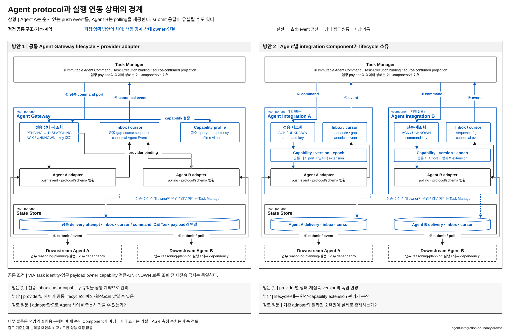

# 서로 다른 Agent의 실행 연동을 공통으로 관리할 것인가

> 상태: **우선 검토 후보 / 사용자 선정 전** · [목록](./README.md)

**질문:** 서로 다른 Agent의 전송·수신·재접속 lifecycle을 공통 Agent Gateway가 관리할 것인가, Agent별 독립 연동 Component가 소유할 것인가?

## 해결할 문제

어떤 Agent는 실행 ID와 순서 있는 event를 제공하고, 다른 Agent는 상태 polling이 필요하다. “취소 요청을 받았다”와 “실제로 취소됐다”의 의미도 다를 수 있다. VIA는 이런 차이를 흡수하면서 사용자의 Task와 승인·결과를 유지해야 한다.

**Agent별 차이를 어디까지 공통 구조가 책임지고, 어디부터 개별 연동이 책임지는가**가 문제다. 어떤 Agent를 고르는 순위나 matching 알고리즘을 비교하는 후보는 아니다.

## 두 방안

**방안 1 — 공통 실행 연동.** Agent Gateway가 capability, 전송 시도, 접수 불명, inbox cursor와 canonical 변환을 소유한다. Agent별 adapter는 그 안에서 provider protocol 차이를 흡수한다. Task Manager는 공통 Agent Command·Agent Event와 확인된 capability를 사용한다. 이미 adapter가 있는 구조를 단순한 단일 구현으로 그리지 않는다.

**방안 2 — Agent별 실행 연동.** 공통 Agent Gateway Component를 두지 않고 대안 전용 Agent Integration A·Agent Integration B 등이 각 Agent의 capability·command delivery·inbox·reconciliation을 소유한다. Task Manager는 versioned 공통 최소 port와 명시적 capability extension으로 각각 연결한다. 공통 전송 도구·schema·검증 library는 재사용할 수 있다.

[draw.io 편집 원본](./diagrams/agent-integration-boundary.drawio) · [표기 규칙](./diagrams/README.md)

### 그림에서 확인할 흐름과 구조 차이

① Task Manager의 업무 command에서 ② 연동 port, ③ Agent별 submit/event/poll, ④ canonical event 반환으로 읽는다. 양쪽 모두 adapter가 있으므로 adapter 유무를 차이로 주장하지 않는다. 파란 전송 시도·inbox·cursor·capability와 원장 owner가 공통 Agent Gateway에서 Agent별 Component로 분리되는 것이 차이다. Task payload 의미와 외부 Agent의 업무 reasoning은 그대로 남는다. command 전달과 접수 불명 조회의 상세 왕복은 해당 내부 책임 블록에 묶어 표시했다.

| 구조 차이 | 방안 1 | 방안 2 |
| --- | --- | --- |
| Component | Agent Gateway 내부 여러 adapter | Agent별 독립 연동 Component |
| 전송·수신 상태 | 공통 lifecycle owner | Agent별 lifecycle owner·namespace |
| Task Manager의 연결 | 공통 port 한 종류 | 공통 최소 port의 여러 구현 + 명시적 extension |
| protocol 변화 | 공통 lifecycle와 맞추어 adapter 변경 | 해당 연동 owner가 수용, 필요하면 extension 계약 변경 |

## 어느 쪽이 설득력 있는가

방안 1은 동일한 전송·수신 규칙과 capability 해석을 한곳에서 유지하기 좋다. 대신 서로 다른 Agent의 기능이 공통 lifecycle에 잘 맞지 않으면 확장과 예외가 쌓일 수 있다. 공통 계약이 필연적으로 최소 기능만 제공하는 것은 아니다.

방안 2는 Agent의 event·control·recovery 방식이 크게 다르고 독립적인 변경 주기가 필요할 때 유리할 수 있다. Task Manager 안에 vendor SDK를 직접 넣는 대안이 아니므로 공통 최소 계약과 강한 캡슐화를 유지할 수 있다. 대신 lifecycle 구현·내구 기록·버전 호환 관리가 여러 곳으로 퍼지고 extension이 Task Manager에 영향을 줄 수 있다.

## 자체 검토와 남은 질문

- 각 연동은 VIA 소속이다. 외부 Downstream Agent가 VIA Task identity나 최상위 orchestration을 소유하지 않는다.
- Agent 선택은 두 방안 모두 Request Interpreter의 제안과 Request Controller의 검증으로 수행한다. capability 조회 대상만 공통 owner에서 개별 owner로 달라진다.
- 업무 payload의 의미는 Task Manager가 소유하고, 전송·수신 상태만 연동 owner가 가진다. 접수 불명일 때 상태 확인 없이 재전송하는 대안은 허용하지 않는다.
- **후보로 남길 조건:** 단지 현재 adapter를 밖에 그리는 것이 아니라 전송·수신 lifecycle의 상태·버전·변경 책임이 실제로 이동해야 한다. 현재 adapter와 차이가 사라지면 독립 후보에서 제외한다.
- 공통 계약이 Agent별 요구를 자연스럽게 수용한다면 분산 owner의 필요성이 약하다. 반대로 예외가 누적되어 모든 Agent 변경을 함께 조정해야 한다면 공통 owner를 재검토할 이유가 된다. 아직 확인된 결과는 아니다.

기준선 근거: [전체 구조 §4·11·12](../target-architecture/architecture.md), [제어 계약 §5](../target-architecture/control-and-lifecycle.md). 주요 사용자 상황: UC-08·10·12~14·16·18.
