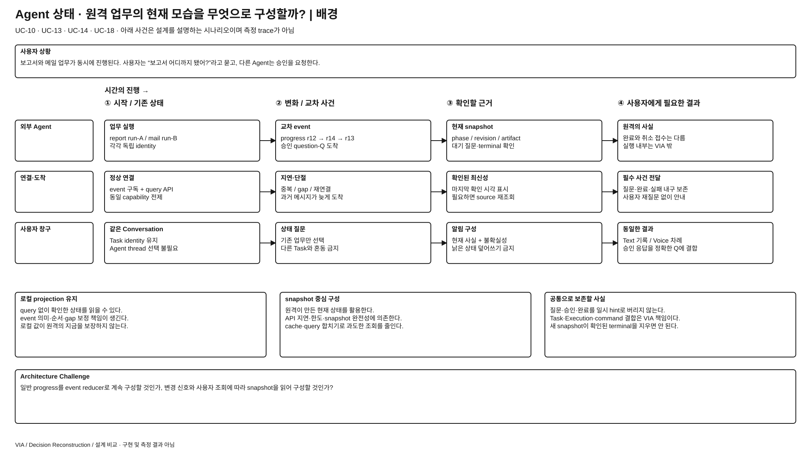
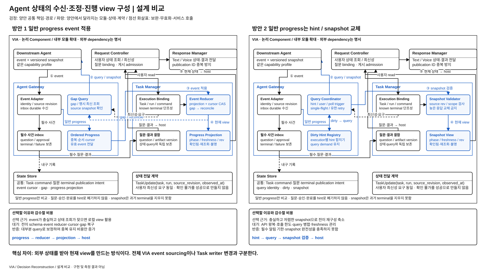

# Agent 진행 상태를 이벤트로 유지할 것인가, snapshot 조회로 구성할 것인가

> **우선 검토 후보 / 사용자 선정 전 / 같은 Agent capability에서 비교** · [목록](./README.md)
> 외부 업무 상태의 원천은 양쪽 모두 Agent다. VIA의 Task identity·제어 의도·질문·결과 전달 기록은 양쪽 모두 남는다.

## 발표용 2페이지

**배경 — 이 과제에서 왜 어려운가**

[배경 SVG 크게 보기](./diagrams/agent-state-observation-background.svg) · [배경 draw.io 편집 원본](./diagrams/agent-state-observation-background.drawio)

**설계 비교 — 같은 완료 조건을 만드는 두 실행 구조**

[비교 SVG 크게 보기](./diagrams/agent-state-observation-comparison.svg) · [비교 draw.io 편집 원본](./diagrams/agent-state-observation-comparison.drawio)

검정은 양안 공통, 파랑은 **양안 각각에서 달라지는 모듈·상태·계약**이다. 큰 테두리는 논리 책임 묶음이며 모든 상자가 별도 process라는 뜻이 아니다. 같은 Component를 여러 위치에 확대 표기해도 instance·모델 가중치를 복제하지 않는다. 그림의 내부 모듈과 아래 계약은 대안을 검토하기 위한 구체 설계이며 target 기준선 변경·구현·측정 결과가 아니다.

## ASR·추가 QA 관점의 장단점과 예상 차이

아래는 **동일 기능·완료 조건에서의 구조적 예상**이며 측정 결과나 승자 선정이 아니다. `PRIMARY`는 구조 차이가 개선·악화에 직접 영향을 주는 축, `REGRESSION_ONLY`는 직접 바꾸지 않는 공통 경로의 기능 유지를 확인할 축이라는 **적용 제안**이다. 인과 범위를 정하지 못한 경우에는 `UNRESOLVED`로 남긴다. 정식 모집단·수치·역할은 아직 동결하지 않았다. [현재 ASR 정의](../../08-quality-attributes/core-asr-contract.md)와 [상세 QA 의미](../../08-quality-attributes/README.md)를 유지한다.

**직관적인 핵심:** 1안은 도착하는 소식을 계속 장부에 반영하고, 2안은 “변경됐다”는 신호를 받으면 원격의 현재 장부를 다시 읽는다. 소식이 충실하면 전자가 빠르고, 소식의 전이 의미가 복잡하고 현재 조회가 충실하면 후자가 단순해질 수 있다.

| 관점 · 적용 제안 | 방안 1의 장단점 | 방안 2의 장단점 | 차이가 나는 조건·주의점 |
| --- | --- | --- | --- |
| QA-19 상태 처리 정확성 · PRIMARY | **장점:** 질문·진행 변화의 순서를 세밀하게 적용한다. **단점:** event 누락·해석 오류가 projection을 틀리게 만들 수 있다. | **장점:** source가 만든 일관된 현재 snapshot으로 상태를 맞춘다. **단점:** snapshot에 없는 짧은 사건이나 늦은 응답을 잘못 처리하면 상태를 놓친다. | phase·blocked·artifact·staleness의 정확성을 본다. 필수 질문·terminal은 양안 모두 내구 전달하며 snapshot이 지우지 못한다. |
| QA-09 응답성 · PRIMARY | **장점:** 유효 projection이 있으면 원격 왕복 없이 상태 답변을 시작한다. **단점:** event backlog·gap 보정 시 지연된다. | **장점:** 많은 hint를 한 query로 합칠 수 있다. **단점:** query 대기·rate limit이 알림과 사용자 상태 조회를 늦출 수 있다. | 같은 최신성 요구를 사용한다. “지금 다시 확인”에는 1안도 query한다. QA-03 시작은 valid 상태의 source 시각이므로 수신 이후만 재어 query 대기를 숨기지 않는다. |
| QA-29 변경 용이성 · PRIMARY | **장점:** 공통 event 계약이 안정적이면 source adapter에서 변환 가능하다. **단점:** 새 lifecycle 전이가 reducer·cursor·보정에 퍼질 수 있다. | **장점:** 안정된 snapshot schema면 복잡한 progress 전이 처리를 줄인다. **단점:** pagination·freshness·revision·query capability 변경은 coordinator·validator에 퍼진다. | Agent의 progress schema 변경과 snapshot API 변경을 각각 본다. 특정 provider를 한쪽에만 유리하게 바꾸지 않는다. |
| QA-39 신뢰성·복구 · PRIMARY | **장점:** 내구 inbox/cursor로 재연결 뒤 미적용 소식을 처리한다. **단점:** 큰 gap·잘못된 projection에는 source 조정이 필요하다. | **장점:** 새 snapshot으로 현재 상태를 다시 세울 수 있다. **단점:** query API 장애가 지속되면 상태 회복이 막힌다. | source 단절·역순·restart에서 correct binding과 terminal을 보존하는지 본다. local view가 있다는 것만으로 원격 업무가 복구된 것은 아니다. |
| QA-14 상태 수렴 / QA-13 binding · 추가 회귀 | event 순서·중복·cancel/completion의 충돌 처리가 관건이다. | event로 받은 필수 질문과 늦은 snapshot의 merge·revision floor가 관건이다. | 과거 r13 snapshot이 r14 승인 질문을 지우는 사례가 직관적인 반례다. 이 회귀를 QA-19에 자동 중복 합산하지 않는다. |
| QA-41 메모리 · 추가 진단 | inbox backlog·cursor·projection을 보존한다. | in-flight query·dirty 집합·snapshot cache를 보존하며 큰 snapshot도 비용이다. | event 빈도·관심 execution 수·snapshot 크기에 따라 역전된다. 필수 사건을 버려 메모리를 줄이는 안은 허용하지 않는다. |

추가 QA는 기존 지위 그대로 진단·회귀·qualification으로 다룬다. 더 빠른 응답으로 잘못된 대상 실행·중복 실행·권한 위반을 상쇄하지 않는다. 메모리의 core ASR 승격이나 새 QA 정의는 이번 정성 비교에서 확정하지 않는다.

## 그림을 따라 설명할 실행 계약

상단은 동일 Downstream Agent·사용자 조회·전달 창구다. 가운데 **Agent Gateway**는 외부 계약 변환과 송수신을, **Task Manager**는 VIA의 업무 binding·현재 view를 소유한다. 필수 사건은 검정 경로로 양안 모두 내구 보존하며, 일반 progress만 파란 경로로 달라진다.

| 경계 / 상태 | 방안 1의 구체 동작 | 방안 2의 구체 동작 |
| --- | --- | --- |
| 일반 progress 수신 | `(provider, execution_id, source_revision, event_id)`로 중복·순서 검사 | 같은 수신 정보로 execution을 dirty로 표시; phase reducer를 호출하지 않음 |
| 현재 view 생성 | event 적용·cursor·projection을 같은 local transaction으로 전진 | `SnapshotQuery(query_id, execution_id, expected_floor, reason)` 결과의 identity·revision 검증 후 snapshot view 교체 |
| 순서 gap | gap 이후 값을 무조건 적용하지 않고 source query로 reconcile | dirty 상태를 유지하고 single-flight query; 진행 중 추가 hint는 dirty generation을 올림 |
| query 경합 | 명시적인 최신성 조회나 gap에 query | query 시작 때 dirty generation 저장; 반환 뒤 더 새 hint가 있으면 현재 snapshot을 표시하되 한정 후속 조회 유지 |
| 필수 사건 | question·approval·terminal·failure를 durable inbox와 Task binding에 등록 | 동일 경로 유지; snapshot 대기나 query 실패와 독립적으로 알림 intent 생성 |
| 전달 | TaskUpdate를 Request Controller가 admission하고 Response Manager가 게시 | 동일; `publication_id`로 event·snapshot의 동일 질문/결과 중복 안내 차단 |

**늦은 snapshot의 예:** query가 r12에서 시작한 뒤 question-Q r14가 도착했다면 Q는 즉시 내구 결합한다. r13 snapshot 반환이 Q를 없애지 못한다. 이미 확인한 terminal과 충돌하면 더 오래된 query를 폐기하거나 모순을 표시하고 source를 재확인한다. 최신성을 증명할 revision이 없는 provider는 별도의 capability 한계이며 현재 비교의 충실한 versioned profile과 혼동하지 않는다.

**유한 비용:** query coordinator는 execution별 in-flight 1개와 최신 dirty generation을 유지한다. 동일 관심 상태의 조회를 합치고 deadline·backoff 안에서 재시도한다. Queue가 찼다고 질문·결과를 일반 progress와 같이 버리지 않는다. Task 종료 후 일반 progress cache·hint는 회수하고 필요한 binding·미전달 기록은 기존 보관 계약을 따른다.

**심사 질문 — “두 안 다 query하는데 같은 것 아닌가?”** 1안은 event 의미를 접어 현재 phase를 만드는 reducer가 정상 경로이며 query는 보정이다. 2안은 원격 snapshot이 정상 현재성 공급원이며 event는 조회 필요성을 알린다. 따라서 source 전이 schema 결합과 원격 API 왕복·호출 한도의 비용이 서로 바뀐다.

## 1. 배경 — Agent에서 진행되는 업무를 VIA 대화의 현재 상태로 연결해야 한다

사용자는 보고서를 맡긴 뒤 다른 질문을 하다가 “보고서 어디까지 됐어?”라고 묻는다. 질문하지 않아도 완료·실패·승인 요청을 받아야 한다. Agent 여러 개의 진행 이벤트가 교차하고 연결이 끊길 수도 있으므로, 단순히 마지막 메시지 문장을 화면에 붙이는 것으로는 업무 상태를 만들 수 없다.

VIA가 상태를 계속 구성해 두면 조회 없이 마지막 확인 상태를 사용할 수 있지만 외부 상태와의 차이를 관리해야 한다. 필요할 때 Agent의 현재 snapshot을 받으면 이벤트 재구성 부담을 줄일 수 있지만 매번 조회 경로에 의존한다. **사용자가 쓰는 진행 상태를 지속 갱신된 로컬 view로 만들 것인지, 조회 결과 중심으로 만들 것인지**가 설계 선택이다.

현재 방식은 [전체 구조 §12](../target-architecture/architecture.md#12-장기-업무복합-요청agent-event), [제어 계약 §4~5](../target-architecture/control-and-lifecycle.md#4-request질문task의-상태-전이)에 명시되어 있다. 핵심 기능은 [UC-10](../../05-representative-use-cases.md#uc-10), [UC-13](../../05-representative-use-cases.md#uc-13), [UC-14](../../05-representative-use-cases.md#uc-14), [UC-18](../../05-representative-use-cases.md#uc-18)이다.

## 2. 두 가지 구현 방식

### 방안 1 — 이벤트 적용으로 진행 projection 유지 + 필요한 재조회

1. Agent Gateway가 받은 이벤트를 durable inbox에 기록한다.
2. Task Manager가 identity·중복·순서·revision을 검사하고 이벤트 적용 기록·cursor·업무 projection을 함께 갱신한다.
3. 확인된 변화에서 사용자 알림 intent를 만들고 Request Controller와 Response Manager로 전달한다.
4. 이벤트 gap·모순, 재연결·재시작, 최신 상태 요구 시 snapshot 조회로 맞춘다. 순서가 없는 source의 이벤트는 원래부터 hint로 처리한다.

현재 방식은 이벤트만 믿는 방식이 아니다. 로컬 projection도 마지막으로 확인한 Agent 사실이며 원격의 지금 상태를 무조건 보장하지 않는다. 사용자에게 확인 시각·재조회 중·불명을 구분한다.

### 방안 2 — snapshot 조회 중심 + 변경 hint와 짧은 cache

1. Task identity, Agent Execution binding, command·승인·질문·publication 기록은 로컬에 보존한다. 일반 progress 이벤트로 지속적인 업무 phase를 접어 만드는 reducer는 두지 않는다.
2. 일반 변경 이벤트는 해당 execution의 snapshot을 읽어야 한다는 hint로 사용한다. Query coordinator가 동일 execution의 중복 요청을 합친다.
3. 사용자 조회 또는 변경 hint에 따라 Agent의 versioned snapshot을 읽는다. 최신성 조건을 충족하는 cache는 재사용하며, 변경이 드문 source는 유한 polling으로 알림 누락을 보완한다.
4. Task Manager는 snapshot의 phase·artifact·불확실성을 기존 binding과 결합해 표시·알림용 view를 만든다. 마지막 확인 snapshot과 시각을 보존할 수 있지만 progress event들을 누적 적용해 재구성하지 않는다.

이 대안에서도 **질문·승인·완료·실패 같은 필수 사건을 hint로 바꿔 버리지 않는다.** 수신 원문과 delivery intent를 내구 보존하고 source의 question·action ID로 결합한다. 동일 결과를 이벤트와 snapshot 양쪽에서 받아도 publication ID·source revision으로 중복 안내를 막는다. Query 실패가 이미 확인한 terminal 사실을 지우거나 취소 요청을 완료로 바꾸어서는 안 된다.

## 3. 대안이 성립하는 Agent 조건

비교에는 순서/버전 있는 이벤트와 의미 있는 snapshot 조회를 **둘 다 제공하는 같은 Agent profile**을 사용한다. Snapshot은 execution identity·revision/확인 시각·현재 phase·결과 참조·대기 질문을 구분할 수 있어야 한다. 짧게 존재했다가 사라지는 필수 질문·결과는 snapshot에 계속 남거나 내구 이벤트 경로로 전달되어야 한다. 이를 제공하지 않는 source에는 대안을 그대로 적용할 수 없다.

특정 실제 provider가 이 계약을 만족한다는 조사는 하지 않았다. 현재 문서의 capability 조건에서 가능한 설계 비교다. 조회 기능 없는 Agent를 한쪽에만 주거나, polling-only Agent를 기준선에서도 어차피 조회하면서 event 중심안의 이점으로 세지 않는다.

## 4. 같은 상황을 따라가 보면

| 사건 | 이벤트 projection 방식 | snapshot 중심 방식 |
| --- | --- | --- |
| progress가 연속 도착 | 순서·중복 검사 후 projection 갱신; 사용자 알림은 합칠 수 있음 | hint를 합쳐 필요 snapshot 조회; query 호출량과 최신성 관리 |
| “보고서 어디까지 됐어?” | 허용된 최신성 안의 projection 사용 또는 query | 허용된 최신성 안의 snapshot cache 사용 또는 query |
| “지금 실제 상태를 다시 확인해줘” | source 재조회 필요 | source 재조회 필요; 이 경우 한쪽에만 query 비용을 부과하지 않음 |
| snapshot 요청 중 질문 event 수신 | 질문을 내구 등록하고 관련 업무 상태에 결합 | 질문을 동일하게 내구 등록; 늦은 snapshot이 그 질문을 지우지 않도록 revision 확인 |
| 연결 단절·VIA 재시작 | inbox/cursor/projection 복원 후 source와 조정 | binding·질문·전달 기록·마지막 snapshot 복원 후 query 재개 |

Snapshot을 선택한다고 “상태 저장 없음”이 되는 것은 아니다. 차이는 **일반 진행 상태를 이벤트 전이로 계속 만들고 복구하는가, 확인된 snapshot으로 교체·재구성하는가**다.

## 5. 실제 구조 차이와 선택의 대가

| 항목 | 이벤트 projection | snapshot 중심 |
| --- | --- | --- |
| 진행 상태 생성 | event reducer·적용 cursor·projection transaction | query coordinator·snapshot adapter·versioned cache |
| 사용자 응답의 의존 | 유효 projection이면 로컬 경로; 필요 시 query | 유효 cache이면 로컬 경로; 나머지는 query 왕복 |
| source 변화 수용 | 이벤트 schema·전이 의미·gap 복구 변경 | snapshot schema·조회 capability·freshness 변경 |
| 자원과 비용 | 지속 수신·적용·쓰기·상태 조정 | 조회 트래픽·중복 합치기·polling·cache 갱신 |
| 연결이 없을 때 | 마지막 확인 상태와 불명 표시 | 동일; snapshot 중심도 이미 확인한 사실을 보존 가능 |

**현재 방식이 설득력 있는 조건:** 이벤트가 신뢰할 수 있고 상태 변경·사용자 조회가 잦으며, snapshot 비용이나 호출 제한이 큰 경우다. 상태를 로컬에서 일관되게 제공할 수 있는 대신 reducer와 복구 부담을 가진다.

**왜 대안을 선택할 수 있는가:** Agent가 충실하고 저렴한 snapshot API를 제공하고, 상태 조회 빈도가 낮거나 이벤트 전이 의미가 자주 바뀐다면 조회 중심 설계가 합리적이다. 표시할 현재 상태를 source가 구성하도록 하되, 질문·승인·전달의 VIA 책임까지 넘기지는 않는다.

**현재 선택을 다시 볼 조건:** 이벤트 보정 때문에 대부분 query를 다시 하면서 로컬 전이·저장을 중복 유지하고, snapshot 중심으로도 같은 알림·제어·최신성 요구를 적은 복잡성과 비용으로 충족할 수 있는 경우다. 반대로 query 제한·지연으로 알림과 사용자 확인이 밀린다면 대안의 이점이 약하다.

## 6. 다른 선택과 섞지 않는 범위

Agent 선택, command 전달의 UNKNOWN·중복 방지, 사용자 질문 결합, Task identity와 publication 내구 기록은 공통이다. Agent Gateway를 provider별 Component로 나누는 선택도 하지 않는다. 조회한 상태를 입력으로 쓰는 [Context 획득 후보](./context-acquisition-strategy.md)와 달리, 이 후보는 그 상태를 처음 만드는 공급 경로를 바꾼다.

대안의 비용을 보려면 같은 최신성·필수 알림 조건을 유지해야 한다. 길게 polling해서 늦어진 결과를 동등한 빠른 응답으로 설명하지 않는다. 정식 조건과 ASR은 후속 검토이며 지금 주기·기한·성능값을 정하지 않는다.

이벤트로 projection을 갱신한다고 전체 VIA를 event sourcing으로 바꾸는 것은 아니다. 양쪽 모두 현재 State Store의 저장·복구 계약과 Task의 쓰기 소유권을 유지한다. [선행 자료 검토](./reference-idea-review.md)에서 구별한 복구 원본 선택, Task별 writer, Agent 의미 정규화를 이 비교에 섞지 않는다. ADR-001·ADR-002의 accepted 상태를 새로 선정하거나 취소하는 문서가 아니다.

### Component와 계약에 실제로 생기는 변경

| 위치 | 방안 1 | 방안 2에서 필요한 변경 |
| --- | --- | --- |
| Agent Gateway | 정규화 event inbox·cursor, gap 시 query | 일반 progress hint·query 합치기·snapshot 응답 경로; 필수 사건의 내구 inbox는 공통 |
| Task Manager | 일반 progress event reducer·projection 갱신 | 검증된 snapshot으로 진행 view 교체·freshness 관리; 질문·명령·terminal 기록의 단조성 유지 |
| State Store | event 적용 위치와 현재 projection | 마지막 snapshot·dirty·진행 중 query identity·확인 시각; 무상태 안이 아님 |
| Request Controller / Response Manager | 확인된 상태에서 질문·응답·알림 구성 | 동일 사용자 창구·publication identity 유지; 필수 질문을 query 완료까지 숨기지 않음 |

영향받는 기준선은 일반 progress Observation의 효력, Task projection 갱신, query trigger·cursor·재연결 절차다. 방안 2에서도 필수 사건과 snapshot이 충돌하면 source revision으로 판별하고 비교할 수 없으면 불명·재확인으로 남긴다. 늦은 snapshot으로 확인된 완료를 진행 중으로 되돌리는 구조는 정상 대안이 아니다.

## 7. 발표 페이지의 핵심

**배경 1장:** 여러 Agent의 진행·질문·완료가 들어오는 동안 사용자가 상태를 묻는 장면을 그린다. source의 상태와 VIA가 마지막 확인한 상태를 나란히 놓고 단절·역순·중복을 표시한다. 하단 질문은 **“사용자에게 보여줄 상태를 VIA가 계속 만들어 둘 것인가, Agent에서 확인해 구성할 것인가?”**다.

**비교 1장:** 1안의 inbox→event reducer→projection→알림과 2안의 hint/user query→query coordinator→snapshot cache→알림을 파랑으로 비교한다. 양쪽에 공통 command·질문·결과 전달 기록을 검정으로 남긴다. 1안의 보완 query와 2안의 내구 필수 사건 경로도 표시한다. 단순히 push 대 polling 화살표 두 개로 축약하지 않는다.

## 8. 바로 사용할 발표 요약

**배경 5줄**

1. VIA는 외부 Agent가 일하는 동안에도 같은 대화에서 업무의 진행·질문·결과를 알려야 한다.
2. 여러 Agent의 이벤트는 중복·역순으로 오거나 연결 단절 때문에 빠질 수 있다.
3. 로컬 상태를 계속 만들면 바로 답할 수 있지만 외부 사실과의 차이를 보정해야 한다.
4. 조회한 snapshot을 쓰면 진행 상태 재구성을 줄일 수 있지만 API 비용·지연·완전성에 의존한다.
5. 핵심은 Task Manager의 유무가 아니라 사용자가 볼 진행 상태를 어떤 근거로 만들어 유지하는가다.

**설계 비교 8줄**

1. 방안 1은 유효 이벤트를 적용해 진행 projection을 유지하고 gap·최신성 요구에 재조회한다.
2. 방안 2는 일반 진행 이벤트를 조회 신호로 쓰고 snapshot으로 진행 view를 구성한다.
3. Task identity·명령·질문·승인·완료·실패·전달 기록은 두 안 모두 내구 보존한다.
4. 방안 2도 cache·query 합치기·필수 알림을 지원하며 상태를 전혀 저장하지 않는 안이 아니다.
5. event reducer·적용 cursor와 query coordinator·snapshot freshness라는 서로 다른 유지 계약이 생긴다.
6. 이벤트가 충실하고 조회 비용이 크면 방안 1이, snapshot이 충실하고 조회가 드물면 방안 2가 합리적이다.
7. 두 기능을 제공하는 같은 Agent와 같은 최신성·알림 요구에서 비교해야 한다.
8. snapshot이 질문·결과를 보존하지 못하거나 query 제한 때문에 필수 알림이 늦으면 대안의 적용이 제한된다.
