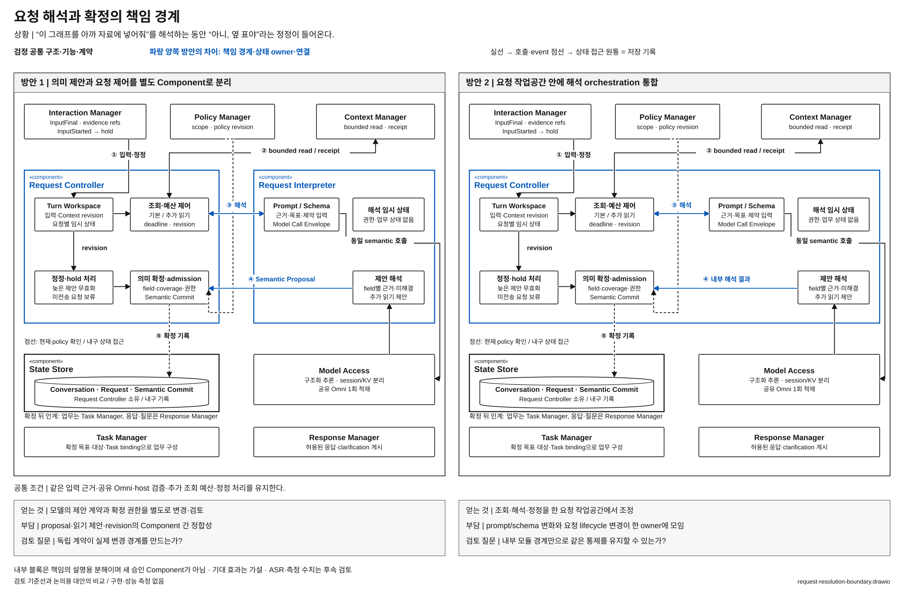

# 요청의 해석과 확정을 별도 Component로 나눌 것인가

> 상태: **우선 검토 후보 / 사용자 선정 전** · [목록](./README.md)

**질문:** 요청의 의미를 제안하는 책임과, 근거 조회·정정·확정을 관리하는 책임을 별도 Component로 둘 것인가, 하나의 Component 안에 통합할 것인가?

## 해결할 문제

사용자가 그래프를 가리키며 “이걸 아까 자료에 넣어줘”라고 말한다. VIA는 “이것”과 “아까 자료”를 찾고, 필요하면 더 읽거나 질문해야 한다. 해석하는 동안 사용자가 “아니, 표를 넣어줘”라고 고치면 이전 판단으로 업무를 시작해서도 안 된다.

여기서 중요한 것은 모델 호출 횟수보다 **의미 제안·추가 조회·현재 요청 상태·최종 확정 사이의 책임 경계**다. 모델의 제안이 실제 업무 전송 권한이 되는 곳을 분명하게 해야 한다.

## 두 방안

**방안 1 — 제안과 제어를 분리한다.** 기준선에서 Request Interpreter는 의미·필요 근거·clarification을 제안하고 Request Controller가 조회를 허용하고 현재 revision을 검사해 확정한다. 추가 읽기도 Request Controller를 거쳐 Context Manager에 요청한다. Request Interpreter는 호출 중 임시 상태만 가진다.

**방안 2 — 요청 처리 책임을 통합한다.** Request Interpreter를 독립 Component로 두지 않고 의미 해석 orchestration을 Request Controller 내부 모듈로 옮긴다. 하나의 요청 작업공간에서 해석·근거 확보·정정·확정을 관리하고 Model Access와 Context Manager를 호출한다. 모델 결과의 검증과 외부 실행 권한은 여전히 일반 코드가 강제한다. 모델에 임의 실행 권한을 주는 대안이 아니다.

[draw.io 편집 원본](./diagrams/request-resolution-boundary.drawio) · [표기 규칙](./diagrams/README.md)

### 그림에서 확인할 흐름과 구조 차이

① 입력과 정정에서 시작해 ② 제한된 근거 조회, ③ 의미 해석, ④ 제안 검증, ⑤ 확정 기록으로 읽는다. 파란 경계와 ③·④ 계약을 비교하면 Request Interpreter의 책임이 어디로 이동하는지 보인다. 검정으로 남긴 host 검증·정정·policy 확인은 통합 대안에서도 유지된다. 아래 State Store는 기록을 제공하며 확정 권한은 Request Controller에 있다.

| 구조 차이 | 방안 1 | 방안 2 |
| --- | --- | --- |
| Component | Request Controller + Request Interpreter | 책임이 확장된 Request Controller; 해석은 내부 모듈 |
| 계약 | versioned Semantic Proposal을 Component 사이에서 전달 | 같은 정보가 내부 데이터 구조·모듈 API로 전달 |
| 요청 상태 | 확정 상태와 해석 임시 상태의 경계가 명시적 | 한 owner가 요청별 작업공간을 관리하며 내부에서 구분 |
| 변경 경계 | 해석 schema·prompt 변화와 제어 lifecycle 변화를 port로 분리 | 요청 처리 기능을 한 단위로 변경·검토할 수 있음 |

## 어느 쪽이 설득력 있는가

방안 1은 해석 계약을 독립적으로 관리하고 모델 출력과 권한의 경계를 드러내기 좋다. 대신 proposal·읽기 제안·revision을 두 Component가 맞춰야 한다. 분리 자체가 의미상 정답을 보장하지 않으며, 같은 process의 호출일 수 있으므로 매번 IPC 비용이 든다고 주장하지 않는다.

방안 2는 하나의 요청을 이해하는 데 필요한 작업공간과 변경을 함께 관리하기 좋다. 해석과 확정 흐름이 자주 함께 바뀌는 제품이라면 공통 owner가 유리할 수 있다. 내부에 typed module과 검증 경계를 둘 수 있으므로 “통합하면 검증이 사라진다”는 약한 대안으로 만들지 않는다. 대신 그 내부 경계가 무너지면 모델·prompt 변화가 요청 lifecycle까지 퍼질 수 있다.

## 자체 검토와 남은 질문

- 모델은 동일한 공유 Omni를 사용한다. 알고리즘·모델 품질 차이를 Component 효과로 설명하지 않는다.
- 같은 질문·추가 읽기·정정·권한 요구를 지킨다. 자유로운 업무 계획·실행 loop는 두 방안 모두 범위 밖이다.
- **후보로 남길 조건:** 통합 시 실제 소유권·변경 단위·공개 계약이 달라져야 한다. 같은 Semantic Proposal 계약을 그대로 숨기고 박스만 지운다면 후보를 제외한다.
- 통합 대안이 내부 경계만으로 변경 통제와 잘못된 실행 차단을 충분히 유지한다면, 별도 Component의 필요성은 약해진다. 반대로 함께 바꿔야 하는 범위가 커지면 분리 근거가 강해진다. 이는 검토할 가설이다.
- [Context 준비 후보](./context-preparation-ownership.md)는 누가 근거 view를 만드는지에 관한 별도 질문이다. 이 비교에서는 Context Manager의 현재 책임을 고정한다.

기준선 근거: [전체 구조 §4·6·7](../../target-architecture/architecture.md), [제어 계약 §3·4](../../target-architecture/control-and-lifecycle.md). 주요 사용자 상황: UC-03~06·09~11.
