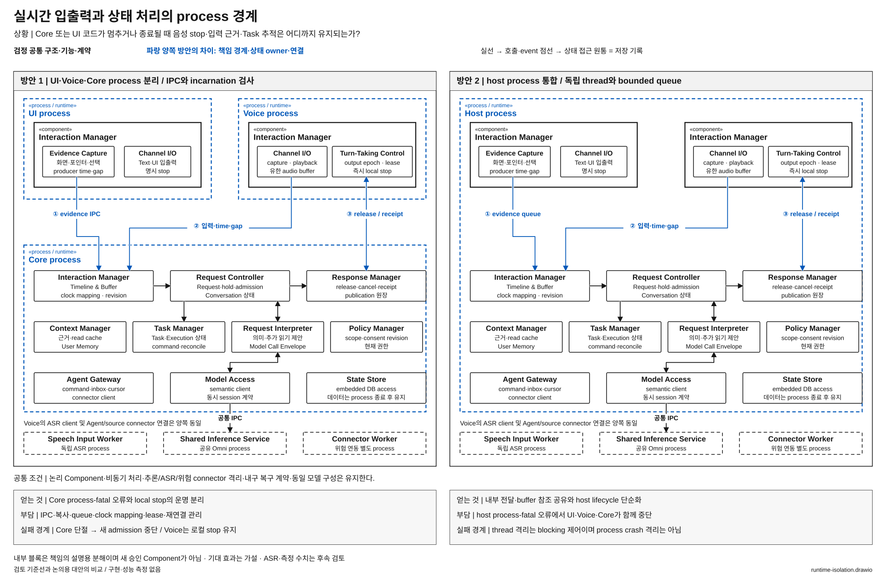

# 실시간 입출력과 상태 처리를 프로세스로 격리할 것인가

> 상태: **조건부 후보 / 논리 Component 변화보다 배치 변화 중심** · [목록](./README.md)

**질문:** UI·Voice·Core를 별도 process로 둘 것인가, 같은 process 안에서 독립 thread·비동기 작업으로 실행할 것인가?

## 해결할 문제

Core가 상태를 복구하거나 UI 연동 코드가 막혔을 때도 사용자가 음성을 끊을 수 있어야 한다. 반면 process를 늘리면 입력 근거·출력 명령·receipt가 IPC와 여러 buffer를 지나간다. 독립 실행과 process crash 격리를 위해 어느 경계까지 분리할지가 문제다.

## 두 방안

**방안 1 — UI·Voice·Core 분리.** 기준선은 UI·Voice·Core process를 분리한다. Interaction Manager의 입출력·timeline 모듈도 이 배치에 나뉜다. Core와의 연결이 끊기면 Voice는 lease·epoch로 오래된 출력을 거절하고 local stop을 유지한다.

**방안 2 — host process 통합.** UI·Voice·Core를 한 process로 합치되 device callback, 화면 수집, 상태 전이, 비동기 연동에 독립 thread·bounded queue·실행 예산을 둔다. native 추론과 위험한 connector는 두 방안 모두 별도 process에 남긴다. 논리 Component와 상태 owner는 유지한다.

[draw.io 편집 원본](./diagrams/runtime-isolation.drawio) · [표기 규칙](./diagrams/README.md)

### 그림에서 확인할 흐름과 구조 차이

① 화면 근거, ② 음성 입력·시간 근거, ③ 출력 release/receipt가 파란 process 경계를 어떻게 넘는지 비교한다. 왼쪽의 UI·Voice·Core가 오른쪽 Host process 하나로 합쳐져도 내부의 검정 논리 Component와 Request Interpreter를 통한 semantic 경로는 유지된다. Speech Input Worker·Shared Inference Service·위험 connector도 공통으로 격리한다. 이 그림은 배치와 대표 흐름을 보여주며 모든 논리 Component 호출을 반복하지 않는다. Core process-fatal과 전체 host process-fatal의 영향 차이가 핵심이다.

## 구조 차이와 조건

달라지는 것은 **process crash의 영향 범위와 Component 간 전달 방식**이다. IPC가 process 내부 queue·참조 전달로 바뀌고 host 종료 시 UI·Voice·Core가 함께 중단된다. 논리 Component가 통합된 것으로 설명하지 않는다. 별도 process도 CPU·메모리 대역폭·전력 경합은 공유한다.

방안 1은 Core의 process-fatal 오류와 실시간 입출력의 운명을 분리하기 좋다. 대신 IPC·직렬화·buffer·incarnation·lease·재연결 계약이 필요하다. 방안 2는 내부 전달과 데이터 공유가 단순해질 수 있고, 안정적인 host code·강한 thread 격리 조건에서 유리할 수 있다. 대신 process-fatal 오류는 함께 겪으며 thread만으로 이를 격리할 수 없다.

## 자체 검토와 남은 질문

- 단일 thread에서 모든 일을 직렬 처리하는 약한 대안을 제외했다. 충분한 thread·비동기·자원 제어를 허용한다.
- 비교 범위는 UI·Voice·Core로 한정한다. Shared Inference Service, Speech Input Worker, 위험 connector 격리까지 동시에 없애지 않는다.
- Task Manager·Request Controller 등 논리 책임은 양쪽에서 같다. [대화·업무 owner 통합](./conversation-task-ownership.md)과 별개 선택이다.
- 동일 입력 근거가 유지되면 process 수만으로 의미 판단이 좋아진다고 할 수 없다. event 유실·지연이 실제 판단에 영향을 주는 경우에만 그 경로를 논의한다.
- **후순위로 남긴 이유:** 설계적으로 중요한 runtime 선택이지만 사용자가 우선한 논리 Component 변화에는 해당하지 않는다. 심사에서 runtime view를 별도로 다룰지 결정한 후 채택한다.
- host 통합이 필수 입출력·복구 요구를 충분히 만족하면서 경계 비용을 줄인다면 분리 범위를 재검토할 이유가 된다. 아직 그러한 결과는 없다.

기준선 근거: [전체 구조 §14](../../target-architecture/architecture.md), [제어 계약 §7](../../target-architecture/control-and-lifecycle.md). 주요 사용자 상황: UC-11·13~15·18.
