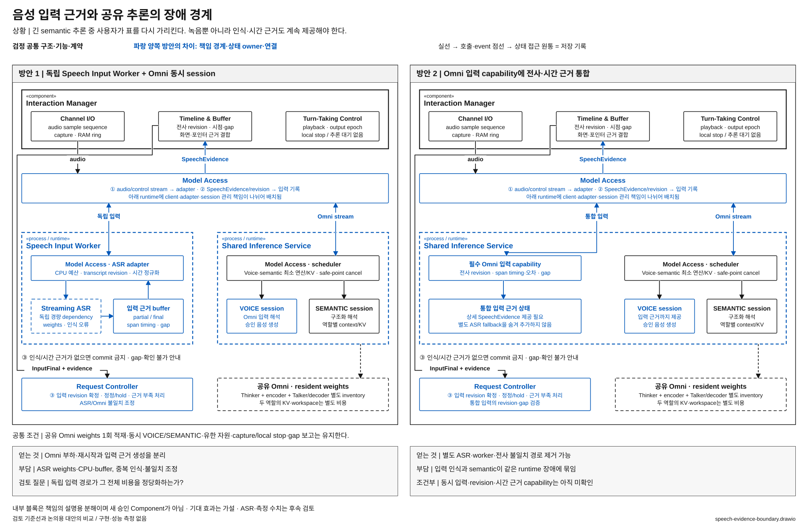

# 음성 입력 근거를 별도 경로에서 만들 것인가

> 상태: **조건부 후보 / 모델·runtime capability 확인 필요** · [목록](./README.md)

**질문:** 공유 Omni와 독립된 입력 인식 경로를 둘 것인가, Omni의 동시 입력 session에서 필요한 음성 근거를 모두 제공할 것인가?

## 해결할 문제

화면 자료를 해석하는 중에 사용자가 “아니, 옆의 표야”라고 말한다. 녹음만 쌓아 두었다가 기존 해석이 끝난 뒤 처리하면, 정정 수신과 지칭 시점의 연결이 늦어진다. semantic 추론 중에도 발화 수신·인식과 시간 근거 제공이 계속되어야 한다.

## 두 방안

**방안 1 — 독립 입력 근거 경로.** 기준선은 Speech Input Worker에 경량 Streaming ASR을 두고, Shared Inference Service의 Omni와 별도로 입력 근거를 만든다. Interaction Manager가 revision·시간 근거를 연결하며, Omni 해석과 다르면 원음 참조 또는 clarification으로 조정한다. Model Access는 두 dependency의 계약을 연계한다.

**방안 2 — Omni 입력 경로에 통합.** 별도 ASR과 Speech Input Worker를 제거하고 공유 Omni의 VOICE session이 전사·revision·시간 근거를 제공한다. semantic과 동시 활성화하고 유한 입력 service 계약을 제공해야 한다. capture와 local stop은 Interaction Manager에 남고 Omni 장애 구간은 gap으로 남긴다.

[draw.io 편집 원본](./diagrams/speech-evidence-boundary.drawio) · [표기 규칙](./diagrams/README.md)

### 그림에서 확인할 흐름과 구조 차이

위쪽 Interaction Manager의 capture·timeline·local stop은 공통이다. 가운데 파란 Model Access 계약과 runtime 경계를 비교하면 독립 ASR·입력 buffer·불일치 조정이 없어지는 대신 입력 근거까지 Shared Inference Service가 책임져야 함을 볼 수 있다. 확정 입력은 Interaction Manager의 timeline을 거쳐 Request Controller로 전달한다. 아래 Omni weights는 양쪽 모두 하나이며 session별 복제가 아니다. 오른쪽 필수 입력 capability는 확보된 구현이 아니라 대안 성립 조건이다.

## 구조 차이와 조건

별도 dependency·worker·불일치 조정 계약의 유무가 바뀐다. VIA 최상위 논리 Component 수가 바뀌는 후보는 아니며 **Model Access의 하위 연계 구조와 dependency·runtime 경계**를 비교한다. Streaming ASR이나 Omni 모델 자체를 새 VIA Component라고 세지 않는다.

방안 1은 Omni 추론·재시작과 입력 근거 생성을 분리하지만 ASR weights·CPU·buffer, 중복 인식과 전사 불일치 비용을 감수한다. 방안 2는 이 중복을 줄일 가능성이 있지만 인식·의미 해석이 동일 runtime 장애에 묶이고, 입력 기능과 동시 service를 해당 build에서 확보해야 한다. 단순 transcript 출력만으로 지칭 시각·정정·gap 계약을 충족했다고 할 수 없다.

## 자체 검토와 남은 질문

- 두 방안 모두 Omni weights는 한 번만 적재한다. whole-call mutex나 무한 backlog를 대안으로 삼지 않는다.
- 방안 2가 semantic 중 수신·인식을 유지할 수 있는지는 미확인이다. 현재 제품과 동등하게 실현 가능하다고 확정하지 않는다.
- Omni 장애 중에도 capture·local stop·Text와 확인 가능한 Task 상태는 유지한다. 별도 인식이 사라져 늘어나는 장애 영향은 대안의 비용으로 드러낸다.
- **조건부로 남긴 이유:** 구조 차이는 선명하지만 모델 내부 알고리즘 비교로 흐를 위험과 capability 공백이 있다. 같은 기능 계약을 제공하는 runtime 대안이 구체화될 때 우선 후보 승격을 검토한다.
- Omni만으로 필수 입력 계약을 더 적은 전체 비용으로 충족한다면 독립 ASR의 필요성이 약해진다. 현재 그런 결과는 없다.
- [프로세스 격리 후보](./runtime-isolation.md)는 ASR을 양쪽에 유지한 채 host 배치만 바꾸므로 이 선택과 구분한다.

기준선 근거: [공유 Omni §1~4·6~8](../../target-architecture/shared-omni-runtime.md), [전체 구조 §6·11·14](../../target-architecture/architecture.md). 주요 사용자 상황: UC-03·04·11·14·18.
