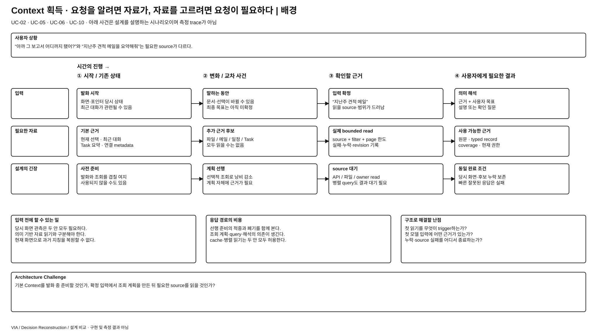
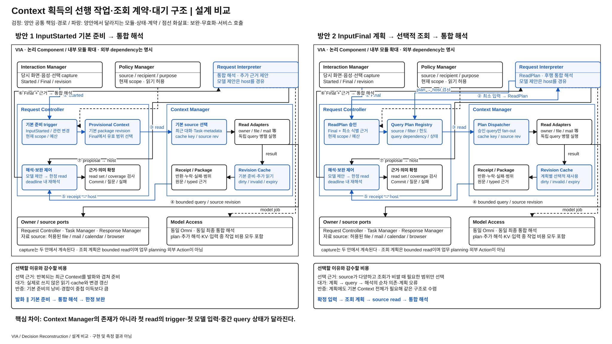

# 요청 해석 전에 근거를 준비할 것인가, 조회 계획부터 세울 것인가

> **우선 검토 후보 / 사용자 선정 전** · [목록](./README.md)
> 비교 대상은 Context Manager의 존재가 아니라 근거 획득의 trigger·순서·중간 상태다.

## 발표용 2페이지

**배경 — 이 과제에서 왜 어려운가**

[배경 SVG 크게 보기](./diagrams/context-acquisition-strategy-background.svg) · [배경 draw.io 편집 원본](./diagrams/context-acquisition-strategy-background.drawio)

**설계 비교 — 같은 완료 조건을 만드는 두 실행 구조**

[비교 SVG 크게 보기](./diagrams/context-acquisition-strategy-comparison.svg) · [비교 draw.io 편집 원본](./diagrams/context-acquisition-strategy-comparison.drawio)

검정은 양안 공통, 파랑은 **양안 각각에서 달라지는 모듈·상태·계약**이다. 큰 테두리는 논리 책임 묶음이며 모든 상자가 별도 process라는 뜻이 아니다. 같은 Component를 여러 위치에 확대 표기해도 instance·모델 가중치를 복제하지 않는다. 그림의 내부 모듈과 아래 계약은 대안을 검토하기 위한 구체 설계이며 target 기준선 변경·구현·측정 결과가 아니다.

## ASR·추가 QA 관점의 장단점과 예상 차이

아래는 **동일 기능·완료 조건에서의 구조적 예상**이며 측정 결과나 승자 선정이 아니다. `PRIMARY`는 구조 차이가 개선·악화에 직접 영향을 주는 축, `REGRESSION_ONLY`는 직접 바꾸지 않는 공통 경로의 기능 유지를 확인할 축이라는 **적용 제안**이다. 인과 범위를 정하지 못한 경우에는 `UNRESOLVED`로 남긴다. 정식 모집단·수치·역할은 아직 동결하지 않았다. [현재 ASR 정의](../../08-quality-attributes/core-asr-contract.md)와 [상세 QA 의미](../../08-quality-attributes/README.md)를 유지한다.

**직관적인 핵심:** 1안은 식사 주문을 듣는 동안 자주 쓰는 재료를 꺼내 놓는 쪽이고, 2안은 주문을 확정한 다음 재료 목록부터 만드는 쪽이다. 자주 맞는 준비는 시간을 벌지만 빗나간 준비는 읽기·메모리·공유 자원을 낭비한다.

| 관점 · 적용 제안 | 방안 1의 장단점 | 방안 2의 장단점 | 차이가 나는 조건·주의점 |
| --- | --- | --- | --- |
| QA-19 의미 정확성 · PRIMARY | **장점:** “아까 그 보고서”처럼 source도 모호한 요청에 최근 후보를 제공한다. **단점:** 준비한 후보에 과도하게 기대면 다른 source나 최신 정정을 놓칠 수 있다. | **장점:** 명시적인 기간·source 조건을 계획으로 드러낸다. **단점:** 자료를 보기 전 계획이 잘못되면 필요한 근거가 첫 해석에서 빠진다. | 지칭형 요청과 “지난주 견적 메일” 같은 명시형 요청을 구별한다. 읽기를 줄여 필수 후보를 누락한 결과는 효율 개선이 아니다. |
| QA-09 응답성 · PRIMARY | **장점:** 발화 중 준비가 끝나면 Final 이후 대기가 짧다. **단점:** 불필요한 선행 read가 필요한 query·semantic job과 경합할 수 있다. | **장점:** 비싼 source를 선택해 읽고 독립 query를 병렬화한다. **단점:** 계획 모델→source→해석이 사용자 입력 종료 뒤 순차로 남는다. | 기본 준비 적중률·발화와 겹친 구간·source 읽기 비용이 방향을 바꾼다. 준비가 시작된 시각을 숨겨 비용을 0으로 보지 않는다. |
| QA-29 변경 용이성 · PRIMARY | **장점:** 기본 Context 계약이 안정적이면 새 요청이 기존 근거를 쓴다. **단점:** 새 source마다 준비 trigger·package 선택·cache invalidation을 조정할 수 있다. | **장점:** 새 source를 read adapter·capability로 노출해 선택적으로 사용한다. **단점:** source별 filter·pagination·부분 실패 의미가 ReadPlan·validator에도 반영된다. | 새 calendar source 추가처럼 같은 변화에서 영향 계약을 비교한다. 계획이 있다고 adapter 변경이 사라지지는 않는다. |
| QA-39 신뢰성·복구 · PRIMARY | **장점:** 현재 발화 중 선행 read가 source 단절 전에 끝났다면 유효 근거를 활용할 여지가 있다. **단점:** 준비 결과의 stale·부분 실패를 잘못 재사용할 위험이 있다. | **장점:** plan의 query 의존 관계를 따라 실패 위치를 좁히고 재계획·보류를 조정할 수 있다. **단점:** 필수 source 실패가 계획 후 전체 해석을 막고 계획 상태 정리가 필요하다. | ReadReceipt의 완료·실패·coverage와 warm cache·freshness 조건은 양안 공통이다. 차이는 이번 요청의 read 시점과 계획 상태다. 한 source가 timeout일 때 올바른 partial 답변·clarification·보류로 끝나는지 본다. 질문을 했다는 사실만으로 원래 요청의 복구 성공을 대신하지 않는다. |
| QA-41 메모리 · 추가 진단 | provisional package·unused cache·발화 중 read buffer를 유지한다. | query plan·결과 join buffer·계획 job KV가 추가되지만 불필요한 본문을 덜 읽을 수 있다. | 실제 사용하는 source가 적고 본문이 클수록 2안 절약 여지. 계획에도 많은 근거가 필요하면 반대다. |
| QA-51 노출 최소화 / QA-61 추적 · 추가 qualification | 사용하지 않을 허용 자료까지 사전 준비할 수 있어 최소 범위와 보관을 설명해야 한다. | 요청별 source·filter·receipt를 설명하기 쉽지만 잘못된 계획의 과도한 범위는 host가 차단해야 한다. | 로컬 cache가 많다는 것만으로 QA-51 외부 노출 증가라고 단정하지 않는다. 실제 외부 제공 경계와 필요한 최소 범위를 따로 확인한다. |

추가 QA는 기존 지위 그대로 진단·회귀·qualification으로 다룬다. 더 빠른 응답으로 잘못된 대상 실행·중복 실행·권한 위반을 상쇄하지 않는다. 메모리의 core ASR 승격이나 새 QA 정의는 이번 정성 비교에서 확정하지 않는다.

## 그림을 따라 설명할 실행 계약

상단의 capture는 양안 공통이다. 왼쪽 **Request Controller**에서 첫 작업이 시작되는 조건, 오른쪽 **Context Manager**에서 실제 읽기가 실행되는 조건을 비교한다. Request Interpreter의 반환은 항상 Request Controller를 거친다. Context Manager가 모델을 독자적으로 호출하거나 의미를 확정하지 않는다.

| 경계 / 상태 | 방안 1의 구체 동작 | 방안 2의 구체 동작 |
| --- | --- | --- |
| 첫 trigger | `InputStarted(turn, capture_revision)`에서 권한 내 기본 준비 시작 | `InputFinal(request, input_revision)` 뒤 ReadPlan 요청; 그 전에도 당시 관측은 수집 |
| 읽기 전 모델 입력 | 기본 Context와 확정 발화로 통합 해석 | 확정 발화·현재 대상 식별 정보·source 목록·질문 binding·scope로 조회 계획 |
| 실행할 읽기 | 기본 source 집합 + 통합 해석이 제안한 한정 보완 | `ReadPlan(plan_id, input_revision, queries[], deadline)`; query별 source·filter·projection·page/byte 한도·dependency |
| 실행 제어 | 기본 준비의 관련 revision을 Final에서 검증·재사용 | Request Controller가 query별 권한·bounded 범위를 승인하고 Context Manager가 독립 query를 fan-out |
| 반환 계약 | `ReadReceipt(query_id, source_revision, covered_range, missing_range, failure)` + Evidence Package | 동일 receipt; query가 성공해도 source coverage가 부족하면 요청 전체의 근거 완료로 취급하지 않음 |
| 무효화 | 입력 변경에 의존한 준비만 폐기; 유효 source cache는 유지 가능 | input revision이 바뀌면 옛 계획의 새 query 발행 중지; 이미 읽은 값은 같은 scope·source revision에서만 재사용 |

**조회 상태:** `PLANNED → AUTHORIZED → RUNNING → COMPLETE / PARTIAL / FAILED / CANCELLED`. Query별 끝 상태를 보존하며 한 query의 timeout으로 이미 받은 다른 source를 성공 전체로 포장하지 않는다. 중간 결과는 request attempt에 결합하고 완료 후 cache로 승격할 때 별도 수명·접근 조건을 적용한다.

**실행 의존:** 방안 1의 기본 준비는 발화와 겹칠 수 있다. 방안 2의 계획과 첫 source read는 순차지만, 계획 안의 독립 read까지 직렬로 만드는 것은 아니다. Source 응답이 느리면 공통 deadline에서 partial evidence 또는 clarification으로 종료하며 open-ended 재계획은 허용하지 않는다.

**심사 질문 — “사전 준비 범위만 줄인 정책 아닌가?”** 차이는 첫 의미 모델 작업의 목적이다. 1안은 근거를 받아 요청 의미를 해석하고, 2안은 근거를 얻기 위한 실행 가능한 조회 계획을 먼저 발행한다. 계획 registry·query dependency·계획 완료를 기다리는 후행 해석 경계가 없어지면 독립 대안으로 볼 이유도 줄어든다.

## 1. 배경 — 필요한 정보를 알려면 요청을 알아야 하고, 요청을 알려면 정보가 필요하다

“아까 그 자료로 정리해줘”는 과거 자료와 대화가 필요하고, “오늘 오후 일정은?”은 일정 조회가 필요하다. VIA가 모든 source를 먼저 읽으면 불필요한 조회와 메모리·입력 비용이 늘어난다. 반대로 아무 근거 없이 요청을 해석하면 필요한 source나 대상부터 잘못 잡을 수 있다.

입력 중 준비를 끝내면 사용자가 말을 마친 뒤의 대기를 줄일 여지가 있다. 그러나 준비한 자료를 실제로 쓸지는 아직 모른다. **어느 정보를 미리 읽고, 어느 정보를 요청의 의미를 파악한 뒤 읽도록 처리 구조를 만들 것인지**가 설계 문제다. 기간·cache 크기 하나를 고르는 문제가 아니다.

현재 선택은 [전체 구조 §6·9](../target-architecture/architecture.md#9-contextcachestale-처리), [제어 계약 §3](../target-architecture/control-and-lifecycle.md#3-core-해석읽기응답-예산), [기억 계약 §2~3](../target-architecture/memory-and-context-lifecycle.md#2-context-획득과-지칭의-정확성)에 있다. 주요 기능은 [UC-02](../../05-representative-use-cases.md#uc-02), [UC-05](../../05-representative-use-cases.md#uc-05), [UC-06](../../05-representative-use-cases.md#uc-06), [UC-10](../../05-representative-use-cases.md#uc-10)이다.

## 2. 두 가지 구현 방식

### 방안 1 — 기본 근거 사전 준비 + 부족한 정보 추가 조회

1. Interaction Manager는 발화 당시 화면·선택·시각 근거를 계속 확보한다. Request Controller는 InputStarted에서 현재 권한 안의 기본 Context 준비를 요청한다.
2. Context Manager가 최근 실제 응답, 대기 질문, 관련 Task 요약, 연결 자료 metadata 등을 준비한다. 모든 파일·메일 본문을 읽지는 않는다.
3. 확정 입력과 준비된 근거로 Request Interpreter가 통합 해석한다. 충분하면 확정으로 가고, 부족하면 source·범위를 제한한 추가 읽기를 제안한다.
4. 추가 읽기 후 재해석하며, 사용한 자료의 revision·coverage·권한은 확정 시 검사한다.

현재 설계 자체가 혼합 방식이다. “항상 모든 Context를 미리 읽는 안”으로 과장하지 않는다. 값싼 기본 준비를 입력과 겹치고, 비싼 읽기는 요청 이후에 선택한다.

### 방안 2 — 요청별 조회 계획 후 근거 획득

1. 시점별 화면·선택·음성 근거는 동일하게 수집한다. 과거 대화·Task 상세·외부 자료의 의미 해석용 묶음은 아직 만들지 않는다.
2. Request Interpreter가 확정 입력, 현재 자료 식별 정보, 사용 가능한 source 목록·권한 범위를 받아 조회 계획을 제안한다. 이 호출은 업무를 확정하지 않는다.
3. Request Controller가 범위·권한·예산을 허용하면 Context Manager가 계획의 독립 query를 병렬 실행한다. 결과는 source revision·누락 범위를 포함한다.
4. 확보한 근거로 통합 해석한다. 계획 오류가 드러나면 제한된 보완 조회 또는 clarification으로 끝내며 open-ended 조사로 확장하지 않는다.

질문·승인 결합에 필요한 ID와 현재 권한은 공통 제어 상태로 유지한다. 최소 입력을 만들겠다고 이 안전 계약까지 없애지 않는다. 조회 계획은 기존 host 도구 목록의 bounded read를 조합할 뿐, Agent의 업무 planning이나 외부 Action을 포함하지 않는다. 자료가 이미 입력에 충분하면 빈 계획으로 추가 읽기를 생략할 수 있다.

## 3. 같은 상황을 따라가 보면

| 요청·사건 | 사전 준비 방식 | 조회 계획 방식 |
| --- | --- | --- |
| “아까 보고서 어디까지 됐어?” | 최근 Task 후보를 이미 준비했다면 첫 통합 해석에서 연결 | 계획이 최근/활성 Task 조회를 요청한 뒤 그 결과로 연결 |
| “지난주 받은 견적 메일 핵심만 알려줘” | 기본 근거가 부족하면 첫 해석 뒤 mail query·재해석 | source와 검색 조건을 먼저 계획하고 mail query 뒤 해석 |
| 발화 도중 다른 자료를 선택 | 관련 기본 준비를 갱신·무효화; 사용하지 않을 읽기가 생길 수 있음 | 당시 관측은 유지하되 의미 기반 조회는 확정 입력 뒤 시작 |
| source가 timeout 또는 일부만 반환 | 실패·coverage를 보존하고 필요한 요청만 보류 | 같은 처리; 조회 계획이 있었다고 읽기 성공이나 completeness로 간주하지 않음 |

두 번째 예시에서 조회 계획 방식이 반드시 호출 수가 적지는 않다. 양쪽 모두 선행 추론과 후행 해석이 필요할 수 있다. 반대로 읽기 비용이 작거나 적중률이 높으면 사전 준비가 유리할 수 있다. **절약되는 읽기와 추가되는 순차 대기를 함께 봐야 한다.**

## 4. 실제 구조 차이와 대가

| 항목 | 사전 준비 방식 | 조회 계획 방식 |
| --- | --- | --- |
| 입력 종료 전 작업 | Context 준비 job·관련 변경 갱신 | 공통 관측 capture; 의미 기반 source 조회는 보류 |
| 첫 모델 작업 | 기본 근거를 이용한 요청 해석 | source·조건·필요 범위의 조회 계획 |
| 중간 상태 | provisional Context·read receipt·추가 읽기 요청 | query plan·query dependency·완료/실패 기록·그 뒤 evidence |
| 대기 경로 | 준비가 겹치면 입력 종료 뒤 대기 단축 가능 | 계획 결과가 나와야 의미 기반 조회 시작 |
| 비용 위험 | 쓰지 않은 준비·cache·revision 갱신 | 계획 오류·필수 근거 누락·추론/조회 왕복 |

**현재 방식이 설득력 있는 조건:** 최근 대화·현재 자료·활성 Task가 반복적으로 쓰이고, 기본 준비가 가벼우며, 발화 중 겹칠 시간이 있는 경우다.

**왜 대안을 선택할 수 있는가:** source가 다양하고 조회 비용·보관 비용이 크며, 명시적인 요청 조건만으로 읽을 범위를 잘 특정할 수 있다면 계획 후 읽기가 합리적이다. 필요 없는 자료를 미리 가져오지 않고 source 접근을 요청별로 설명하기도 쉽다. 이것이 권한 검사를 생략한다는 뜻은 아니다.

**현재 선택을 다시 볼 조건:** 기본 준비가 대부분 사용되지 않거나 공유 자원을 점유해 실제 해석을 늦추고, 요청별 조회 계획이 필요한 근거를 안정적으로 확보하면서 총비용을 줄이는 경우다. 계획을 세우려면 결국 매번 기본 근거 전체를 먼저 읽어야 한다면 대안의 독립성·이점이 약하다.

## 5. 다른 선택과 섞지 않는 범위

양쪽의 screen/audio capture·pre-roll·당시 evidence 보존은 유지한다. 최종 전사 뒤 현재 화면만 읽는 대안은 발화 중 지칭 기능을 잃으므로 제외한다. 비교가 바꾸는 것은 이미 관측한 사실과 owner/source에서 **해석에 쓸 근거를 구성하는 시점·의존 경로**다.

최종 요청 의미는 양쪽 모두 같은 통합 방식으로 해석한다. [해석 파이프라인 후보](./request-interpretation-topology.md)를 동시에 적용하지 않는다. 모든 source와 cache의 권한·revision·삭제 계약은 유지하고, 입력 전에 수행한 읽기·메모리도 비용에서 빠뜨리지 않는다. 사전 준비량이나 호출 상한 숫자를 바꾸는 것만으로는 이 후보가 성립하지 않는다.

사전 조회 계획이 있다고 read-set을 영구 폐쇄하거나 계획 밖 source 때문에 모든 자료를 다시 모으도록 강제하지 않는다. 한정 보완·lazy read·동일 revision cache는 양쪽 모두 허용한다. **‘언제 어떤 근거로 첫 읽기를 시작하는가’와 ‘진행 중 source 집합을 어떤 계약으로 확장하는가’는 다른 결정**이다. Source 표현을 공통 값으로 만들지 소비 목적별 view로 만들지도 별도 축이다. [이전 자료 검토](./reference-idea-review.md)에서 이 세 축을 구분했다.

### Component와 계약에 실제로 생기는 변경

| 위치 | 방안 1 | 방안 2에서 필요한 변경 |
| --- | --- | --- |
| Request Controller | InputStarted에서 기본 준비 job 시작 | 입력 확정 뒤 조회 계획 요청·허용, query 완료를 기다린 뒤 해석 시작 |
| Request Interpreter | 준비된 Context로 SemanticProposal 생성 | bounded read-plan 출력 계약 추가; 조회 계획은 업무 의미 확정이 아님 |
| Context Manager | 기본 Context와 추가 요청을 materialize | 승인된 계획의 query 의존·병렬 실행·부분 실패·receipt 반환 |
| Interaction Manager / State Store | 당시 관측·원본·revision 근거 유지 | 동일 유지; capture를 나중으로 옮겨 비용을 줄이지 않음 |

영향받는 기준선은 InputStarted 처리, Context 준비 trigger, read request·receipt, 첫 semantic 입력과 호출 예산이다. 현재 기준선의 예산을 대안에 그대로 강제해 실패시키지 않되 계획 호출·입력·KV 비용도 모두 남긴다. 실제 성능·메모리 상한과 ASR은 아직 정하지 않는다.

## 6. 발표 페이지의 핵심

**배경 1장:** 서로 다른 세 요청을 대화·Task·메일 source에 연결하고, “필요한 자료를 알려면 의미를 알아야 한다 / 의미를 알려면 자료가 필요하다”는 의존을 보여준다. 하단 질문은 **“어떤 근거를 먼저 준비하고 어떤 근거를 판단 후 읽을 것인가?”**다.

**비교 1장:** 사용자 발화 시간축 위에 공통 capture를 검정으로 둔다. 1안은 발화와 겹치는 준비 job·provisional cache·추가 읽기를, 2안은 조회 계획·query 실행·후행 해석을 파랑으로 그린다. Context Manager는 양쪽에 있어도 실제로 기다리는 대상·실행 trigger·중간 데이터가 달라짐을 표시한다. 계획 이후에도 가능한 병렬 query는 직렬로 왜곡하지 않는다.

발표에서는 **“Context Manager가 있느냐”가 아니라 “사용자가 말을 마쳤을 때 무엇이 이미 준비되어 있고 무엇부터 시작해야 하느냐”**를 설명한다.

## 7. 바로 사용할 발표 요약

**배경 5줄**

1. VIA의 요청은 현재 화면, 과거 대화, 업무 상태, 메일 등 서로 다른 근거를 요구한다.
2. 필요한 자료를 알려면 요청을 이해해야 하지만, 요청을 이해하려면 자료가 먼저 필요할 수 있다.
3. 미리 준비하면 발화와 읽기를 겹칠 수 있으나 쓰지 않을 조회·cache를 만들 수 있다.
4. 요청별로 골라 읽으면 불필요한 준비를 줄일 수 있으나 계획·조회·해석이 순차 대기가 된다.
5. 발화 당시 화면은 다시 만들 수 없으므로 관측 보존과 해석용 근거 조회를 구별해야 한다.

**설계 비교 8줄**

1. 방안 1은 입력 중 최근 대화·Task·자료 metadata를 준비하고 부족한 정보만 추가 조회한다.
2. 방안 2는 확정 입력으로 bounded 조회 계획을 만든 뒤 source를 읽고 요청을 해석한다.
3. 화면·음성의 당시 관측과 권한·질문 ID는 두 안 모두 유지한다.
4. 독립 query의 병렬 실행, lazy read, cache, 한정 보완 조회도 양쪽에 허용한다.
5. 첫 모델 입력과 읽기를 시작하는 trigger가 바뀌며, 방안 2에는 계획·query 진행 계약이 필요하다.
6. 최근 근거 재사용이 많으면 방안 1이, source가 다양하고 선행 준비가 자주 낭비되면 방안 2가 합리적이다.
7. 조회 계획이 반드시 호출 수를 줄이는 것은 아니며 source 실패·누락도 해결해 주지 않는다.
8. 계획에도 기본 Context 전체가 필요하거나 준비량만 달라진다면 독립 후보로서의 차이가 약해진다.
