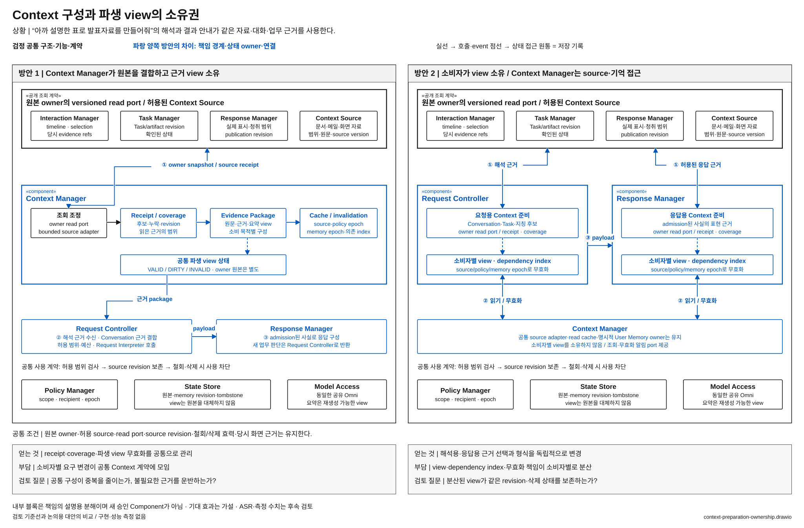

# 필요한 Context를 공통 Component가 준비할 것인가

> 상태: **우선 검토 후보 / 사용자 선정 전** · [목록](./README.md)

**질문:** 대화·업무·자료에서 필요한 근거를 모아 구성하는 책임을 Context Manager에 모을 것인가, 이를 사용하는 Component가 각각 소유할 것인가?

## 해결할 문제

“아까 설명한 표로 발표자료를 만들어줘”를 이해하려면 실제로 보여준 응답, 표의 원본과 version, 관련 업무 후보가 필요하다. 이후 “완료됐어?”에 답할 때는 최신 업무 상태와 결과 참조가 필요하다. 여러 처리 경로가 일부 같은 정보를 사용하지만 필요한 형태와 시점은 다르다.

**모든 소비자가 같은 큰 Context를 받는 것과, 각자 제멋대로 정보를 읽는 것 사이에서 근거 구성의 책임을 어디에 둘지**가 문제다.

## 두 방안

**방안 1 — 공통 근거 구성.** Context Manager가 각 owner의 versioned read port와 source adapter를 통해 후보·원문·출처·조회 receipt를 구성한다. Request Controller가 허용 범위와 예산을 정한다. Request Interpreter는 전달된 근거를 해석하며 owner 저장소를 직접 읽지 않는다. 소비 목적별 view가 가능하므로 모든 경로에 동일한 거대 package를 강제하는 구조가 아니다.

**방안 2 — 소비자별 근거 구성.** Request Controller는 요청 해석용 view, Response Manager는 허용된 source에서 응답 구성용 view를 각각 만든다. Context Manager는 공통 source 접근·cache·User Memory owner로 남되, 여러 owner의 근거를 합치는 권한과 상태는 소비자에게 이동한다. 소비자는 owner의 공개 read port를 사용하고 source revision·누락·policy를 보존한다. Request Interpreter는 이 대안에서도 Request Controller를 통해 호출한다.

[draw.io 편집 원본](./diagrams/context-preparation-ownership.drawio) · [표기 규칙](./diagrams/README.md)

### 그림에서 확인할 흐름과 구조 차이

위쪽은 동일한 원본 owner의 공개 read port다. 방안 1에서는 조회 receipt·근거 package·파생 view 상태가 Context Manager 안에 모이고, 방안 2에서는 요청용·응답용 준비 모듈과 dependency index가 각 소비자 안으로 이동한다. 파란 조회 경로와 view 상태가 핵심 차이다. 아래 Policy Manager·State Store·Model Access는 공통 지원 계약이며 모든 접근 화살표를 반복하지 않았다. 원본 권한이나 명시적 User Memory owner가 이동하는 대안은 아니다.

| 구조 차이 | 방안 1 | 방안 2 |
| --- | --- | --- |
| 구성 책임 | Context Manager | Request Controller·Response Manager의 내부 준비 모듈 |
| owner 조회 | Context Manager로 모임 | 소비자별 read port 연결로 분기 |
| 파생 view 상태 | Context Manager가 공통 관리 | 소비자별 view·dependency 기록과 무효화 책임 |
| 공통으로 유지 | source 접근 계약·권한·원본 owner·User Memory | 동일; 다른 owner의 내부 DB schema 직접 접근 금지 |

## 어느 쪽이 설득력 있는가

방안 1은 원문·revision·삭제 전파와 중복 읽기를 공통으로 관리하기 좋다. 대신 새로운 소비자의 요구가 Context Manager의 package·cache 계약을 확장할 수 있다. 공통 구성이라고 모든 읽기가 직렬 실행되어야 하는 것은 아니다.

방안 2는 각 소비자가 필요한 근거와 형식을 직접 바꿀 수 있어 소비 목적이 크게 다를 때 유리할 수 있다. 공통 adapter와 무효화 알림을 재사용해 중복 코드를 줄일 수도 있다. 그러나 view·cache가 여러 곳으로 퍼져 비용이 늘 수 있고, 삭제·권한 철회를 모든 소비자에 적용해야 한다.

## 자체 검토와 남은 질문

- 화면의 당시 근거 수집은 두 방안 모두 Interaction Manager가 유지한다. 발화가 끝난 뒤 현재 화면만 읽는 대안은 UC-04를 충족하지 못하므로 제외한다.
- Response Manager는 새 업무 의미를 확정하지 않는다. admission한 사실을 표현하기 위한 제한된 읽기만 한다. 새 판단이 필요하면 Request Controller에 돌려준다.
- view 분산은 원본 권위를 분산하는 것이 아니다. Task는 Task Manager, Conversation은 Request Controller, 실제 전달 기록은 Response Manager가 소유한다.
- **후보로 남길 이유:** 공통 근거 구성 책임과 조회 연결이 실제로 이동한다. 동일한 통합 package를 소비자별 adapter로 이름만 바꾸는 대안은 제외한다.
- 공통 구성이 소비자 변화까지 과도하게 묶거나 사용하지 않는 근거를 계속 운반한다면 방안 1을 재검토할 이유가 된다. 소비자별 구성이 서로 다른 revision·삭제 상태를 사용한다면 방안 2의 비용이 커진다. 아직 확인한 결과는 아니다.

기준선 근거: [전체 구조 §9](../target-architecture/architecture.md), [기억 계약 §1~5](../target-architecture/memory-and-context-lifecycle.md). 주요 사용자 상황: UC-02~07·10·15~17.
